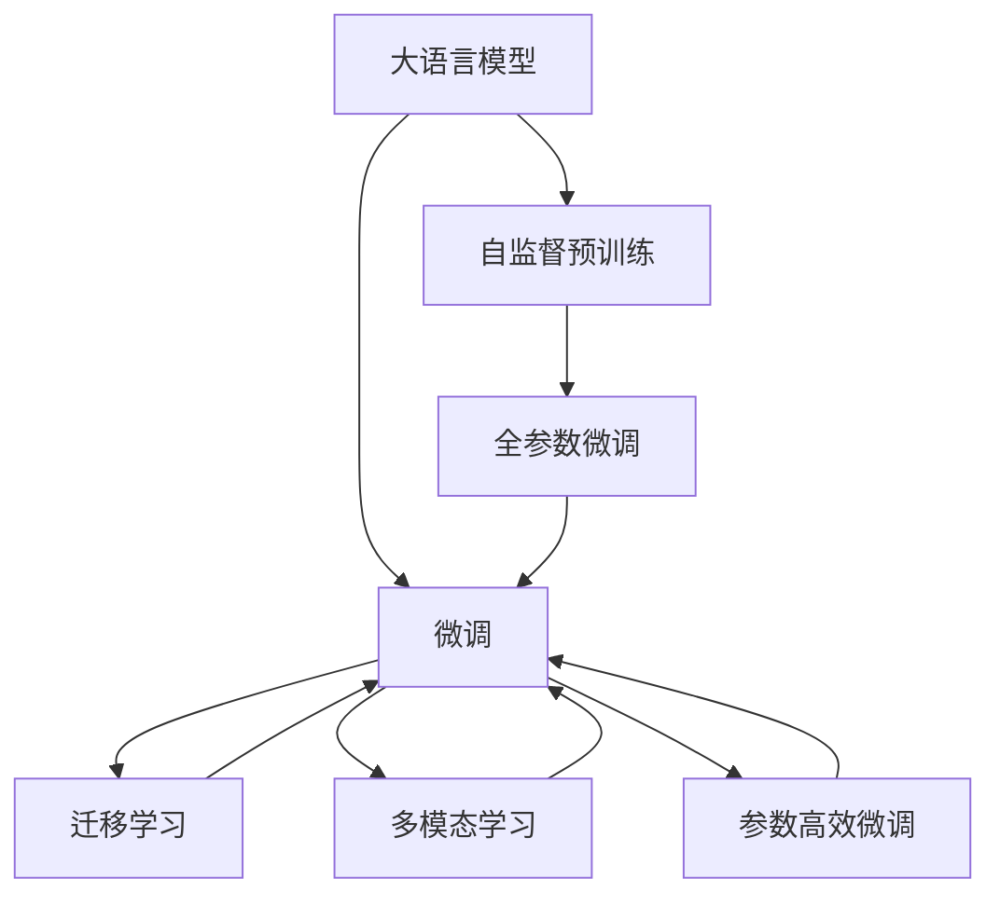

                 

# 大语言模型LLM的未来

## 1. 背景介绍

### 1.1 问题由来

近年来，随着深度学习技术的飞速发展，大语言模型（Large Language Models, LLMs）在自然语言处理（NLP）领域取得了举世瞩目的进展。这些模型如OpenAI的GPT-3、Google的BERT和XLNet等，通过在海量无标签文本数据上进行预训练，学习到了丰富的语言知识和常识，展现出了强大的自然语言理解和生成能力。

这些模型的出现，标志着自然语言处理进入了深度学习时代，推动了包括文本分类、机器翻译、对话系统、摘要生成等诸多NLP任务的性能提升。然而，尽管取得了显著的进展，但大语言模型仍然面临诸多挑战。

### 1.2 问题核心关键点

当前大语言模型存在以下主要问题：

- **模型规模与资源消耗**：大模型通常具有数亿甚至数十亿参数，需要巨量的计算资源和存储空间，难以在普通环境中高效部署和应用。
- **泛化能力和鲁棒性**：尽管在标准数据集上取得了优异表现，但模型在面对现实世界中的长尾数据和复杂场景时，往往表现不佳。
- **公平性与道德问题**：模型训练过程中可能存在偏见，输出结果可能包含歧视性、有害信息，导致社会问题。
- **人类理解与互动**：模型虽然表现出色，但仍然难以真正理解和处理人类复杂的情感和社交背景，缺乏人类的共情和互动能力。
- **未来技术演进**：如何进一步提高模型的可解释性、可控性、智能水平，是摆在所有研究者面前的重要问题。

### 1.3 问题研究意义

尽管存在上述挑战，大语言模型在未来仍具有巨大的应用潜力。研究其未来发展趋势和应对策略，不仅能够推动人工智能技术的进一步突破，也能够促进其在更广泛领域的落地应用。本文旨在深入探讨大语言模型的未来发展方向，提出针对性的研究思路和应用场景，为行业开发者和研究者提供参考。

## 2. 核心概念与联系

### 2.1 核心概念概述

为更好地理解大语言模型的未来发展，我们首先需要定义几个核心概念：

- **大语言模型（LLMs）**：通过在大规模无标签文本数据上进行预训练，学习通用语言知识和表达能力的模型。目前主流的模型包括BERT、GPT-3等。
- **自监督预训练（Self-Supervised Pre-training）**：在大规模无标签文本数据上，利用掩码语言模型（MLM）、下一句预测（NSP）等自监督任务训练模型的过程。
- **微调（Fine-tuning）**：在预训练模型基础上，利用下游任务的少量标注数据，通过有监督学习优化模型性能的过程。
- **迁移学习（Transfer Learning）**：将一个领域学到的知识，迁移应用到另一个不同但相关的领域。
- **多模态学习（Multimodal Learning）**：将语言、视觉、听觉等多种模态的数据整合到模型中，提高模型的综合理解能力。
- **可解释性与透明性（Explainability and Transparency）**：使模型的决策过程和结果可解释、透明，便于人类理解和使用。
- **公平性（Fairness）**：确保模型在各个群体中的表现公平，避免偏见和歧视。

### 2.2 概念间的关系

这些核心概念之间存在着紧密的联系，形成了大语言模型未来发展的完整生态系统。以下通过几个Mermaid流程图展示它们之间的关系：



通过上述流程图，我们可以清晰地看到大语言模型的未来发展方向与各个核心概念的联系：

- 自监督预训练是大模型构建的基础，通过在大规模数据上进行训练，学习到通用的语言知识。
- 微调是在预训练的基础上，通过有监督学习优化模型，以适应特定任务。
- 迁移学习是将一个领域的知识迁移到另一个领域，通过微调实现。
- 多模态学习是将多种模态的数据融合到模型中，提升模型理解复杂场景的能力。
- 可解释性和透明性是大模型应用的保障，使模型决策过程透明，便于人类理解和信任。
- 公平性是大模型在社会应用中的基本要求，确保模型在不同群体中的表现一致，避免歧视和偏见。

## 3. 核心算法原理 & 具体操作步骤

### 3.1 算法原理概述

大语言模型未来发展的核心在于算法原理的创新与优化。以下我们重点介绍以下几个关键方向：

- **自监督预训练的深度与广度**：通过更复杂的自监督任务，进一步提升模型的语言理解能力和泛化能力。
- **多模态融合**：将视觉、听觉等非文本模态的数据整合到语言模型中，提升模型对多模态数据的理解能力。
- **迁移学习的深度学习**：通过更深入的迁移学习策略，确保模型在不同领域中的表现一致。
- **参数高效微调**：通过优化微调过程，减少资源消耗，提高模型训练和推理的效率。
- **公平性与透明性**：通过算法设计，确保模型的公平性和透明性，避免歧视和偏见。

### 3.2 算法步骤详解

#### 3.2.1 自监督预训练

- **目标**：在大规模无标签文本数据上，利用自监督任务训练通用语言模型。
- **步骤**：
  1. 收集大规模无标签文本数据。
  2. 设计自监督任务，如掩码语言模型（MLM）、下一句预测（NSP）等。
  3. 使用深度神经网络，在大规模数据上训练模型。
  4. 使用正则化技术，避免过拟合。
  5. 评估模型性能，迭代优化模型。

#### 3.2.2 多模态融合

- **目标**：提升模型对多模态数据的理解能力。
- **步骤**：
  1. 收集多模态数据，如文本、图像、语音等。
  2. 设计多模态融合模型，如ViT-BERT、CLIP等。
  3. 训练多模态融合模型，优化模型参数。
  4. 评估模型性能，调整融合策略。

#### 3.2.3 迁移学习

- **目标**：将一个领域的知识迁移到另一个领域，提升模型在特定任务上的表现。
- **步骤**：
  1. 收集目标任务的标注数据。
  2. 选择预训练模型，如BERT、GPT等。
  3. 设计任务适配层，如线性分类器、解码器等。
  4. 微调模型，优化参数。
  5. 评估模型性能，迭代优化模型。

#### 3.2.4 参数高效微调

- **目标**：减少微调过程中的资源消耗，提高模型训练和推理效率。
- **步骤**：
  1. 选择预训练模型，如BERT、GPT等。
  2. 设计任务适配层，如Adapter、Prompt等。
  3. 微调模型，优化参数。
  4. 评估模型性能，调整适配层。

#### 3.2.5 公平性与透明性

- **目标**：确保模型的公平性和透明性，避免歧视和偏见。
- **步骤**：
  1. 收集数据，确保数据集的多样性和代表性。
  2. 设计公平性评估指标，如多样性、平衡性等。
  3. 训练模型，确保公平性。
  4. 评估模型性能，调整模型参数。
  5. 定期审计模型性能，确保透明性和公平性。

### 3.3 算法优缺点

#### 3.3.1 自监督预训练

- **优点**：
  1. 利用大规模无标签数据，提升模型泛化能力。
  2. 减少对标注数据的需求，降低标注成本。
  3. 通过自监督任务，学习通用语言知识。

- **缺点**：
  1. 需要大量计算资源和存储空间。
  2. 自监督任务设计复杂，需要大量经验和创新。

#### 3.3.2 多模态融合

- **优点**：
  1. 提升模型对多模态数据的理解能力。
  2. 丰富模型的知识表示，提高模型性能。
  3. 应用场景广泛，如自动驾驶、智能家居等。

- **缺点**：
  1. 需要多模态数据的收集和处理，成本较高。
  2. 多模态数据整合复杂，技术难度较大。

#### 3.3.3 迁移学习

- **优点**：
  1. 利用预训练模型的知识，提升模型性能。
  2. 减少标注数据的需求，降低标注成本。
  3. 在不同领域中应用广泛，如医学、法律等。

- **缺点**：
  1. 微调过程中可能存在过拟合问题。
  2. 不同领域之间的知识迁移效果不稳定。

#### 3.3.4 参数高效微调

- **优点**：
  1. 减少微调过程中的资源消耗。
  2. 提高模型训练和推理效率。
  3. 降低模型复杂度，避免灾难性遗忘。

- **缺点**：
  1. 部分参数可能无法有效利用，影响模型性能。
  2. 技术难度较大，需要设计高效的适配层。

#### 3.3.5 公平性与透明性

- **优点**：
  1. 确保模型的公平性和透明性，避免歧视和偏见。
  2. 提高模型的可信度和可靠性。
  3. 增强模型的社会责任感和公信力。

- **缺点**：
  1. 设计公平性评估指标复杂，需要大量经验和创新。
  2. 公平性评估和调整技术难度较大。

### 3.4 算法应用领域

#### 3.4.1 自然语言处理

- **应用**：文本分类、机器翻译、对话系统、摘要生成等。
- **案例**：BERT在IMDB电影评论分类任务中，通过微调取得了SOTA性能。

#### 3.4.2 医疗健康

- **应用**：疾病诊断、患者咨询、药物研发等。
- **案例**：GPT-3在医学问答系统中，通过微调可以提供专业的医疗建议。

#### 3.4.3 金融服务

- **应用**：风险评估、智能投顾、客户服务等。
- **案例**：BERT在股票新闻分类任务中，通过微调可以提供及时的市场分析。

#### 3.4.4 教育培训

- **应用**：个性化推荐、智能辅导、课程评估等。
- **案例**：GPT-3在数学问题解答中，通过微调可以提供详细的解题步骤和解释。

#### 3.4.5 智能家居

- **应用**：语音交互、智能客服、家庭管理等。
- **案例**：GPT-3在智能家居控制系统中，通过微调可以提供个性化的语音控制指令。

## 4. 数学模型和公式 & 详细讲解 & 举例说明

### 4.1 数学模型构建

假设我们有一个大语言模型 $M_{\theta}$，其中 $\theta$ 为模型参数。该模型在输入 $x$ 上的输出为 $y$。我们使用下游任务的标注数据集 $D=\{(x_i, y_i)\}_{i=1}^N$ 进行微调，目标是最小化经验风险 $\mathcal{L}(\theta)$。

经验风险的计算公式为：
$$
\mathcal{L}(\theta) = \frac{1}{N}\sum_{i=1}^N \ell(M_{\theta}(x_i), y_i)
$$
其中 $\ell$ 为损失函数，常用的损失函数有交叉熵损失、均方误差损失等。

### 4.2 公式推导过程

#### 4.2.1 交叉熵损失函数

交叉熵损失函数用于衡量模型预测输出与真实标签之间的差异。假设模型 $M_{\theta}$ 在输入 $x$ 上的输出为 $\hat{y}=M_{\theta}(x)$，表示样本属于正类的概率。真实标签 $y \in \{0,1\}$。则二分类交叉熵损失函数定义为：
$$
\ell(M_{\theta}(x),y) = -[y\log \hat{y} + (1-y)\log (1-\hat{y})]
$$

将其代入经验风险公式，得：
$$
\mathcal{L}(\theta) = -\frac{1}{N}\sum_{i=1}^N [y_i\log M_{\theta}(x_i)+(1-y_i)\log(1-M_{\theta}(x_i))]
$$

根据链式法则，损失函数对参数 $\theta_k$ 的梯度为：
$$
\frac{\partial \mathcal{L}(\theta)}{\partial \theta_k} = -\frac{1}{N}\sum_{i=1}^N (\frac{y_i}{M_{\theta}(x_i)}-\frac{1-y_i}{1-M_{\theta}(x_i)}) \frac{\partial M_{\theta}(x_i)}{\partial \theta_k}
$$

其中 $\frac{\partial M_{\theta}(x_i)}{\partial \theta_k}$ 可进一步递归展开，利用自动微分技术完成计算。

### 4.3 案例分析与讲解

#### 4.3.1 掩码语言模型（MLM）

掩码语言模型是自监督预训练任务之一，其目标是通过预测被掩码的单词来训练模型。假设掩码率为 $p$，则掩码语言模型的训练公式为：
$$
\mathcal{L}_{MLM}(\theta) = -\frac{1}{N}\sum_{i=1}^N \sum_{m=1}^M \log p_{MLM}(x_i, y_i, m)
$$
其中 $M$ 为掩码位置数，$p_{MLM}(x_i, y_i, m)$ 为模型在输入 $x_i$ 中预测位置 $m$ 的掩码单词 $y_i$ 的概率。

#### 4.3.2 下一句预测（NSP）

下一句预测是自监督预训练任务之一，其目标是通过预测下一句是否与当前句连续来训练模型。假设序列长度为 $L$，则下一句预测的训练公式为：
$$
\mathcal{L}_{NSP}(\theta) = -\frac{1}{N}\sum_{i=1}^N \sum_{j=1}^{L-1} \log p_{NSP}(x_i, y_i, j)
$$
其中 $p_{NSP}(x_i, y_i, j)$ 为模型在输入 $x_i$ 中预测位置 $j$ 的下一句 $y_i$ 是否与当前句连续的概率。

## 5. 项目实践：代码实例和详细解释说明

### 5.1 开发环境搭建

在进行大语言模型微调开发前，我们需要准备好开发环境。以下是使用Python进行PyTorch开发的环境配置流程：

1. 安装Anaconda：从官网下载并安装Anaconda，用于创建独立的Python环境。

2. 创建并激活虚拟环境：
```bash
conda create -n pytorch-env python=3.8 
conda activate pytorch-env
```

3. 安装PyTorch：根据CUDA版本，从官网获取对应的安装命令。例如：
```bash
conda install pytorch torchvision torchaudio cudatoolkit=11.1 -c pytorch -c conda-forge
```

4. 安装Transformers库：
```bash
pip install transformers
```

5. 安装各类工具包：
```bash
pip install numpy pandas scikit-learn matplotlib tqdm jupyter notebook ipython
```

完成上述步骤后，即可在`pytorch-env`环境中开始微调实践。

### 5.2 源代码详细实现

下面我们以命名实体识别(NER)任务为例，给出使用Transformers库对BERT模型进行微调的PyTorch代码实现。

首先，定义NER任务的数据处理函数：

```python
from transformers import BertTokenizer
from torch.utils.data import Dataset
import torch

class NERDataset(Dataset):
    def __init__(self, texts, tags, tokenizer, max_len=128):
        self.texts = texts
        self.tags = tags
        self.tokenizer = tokenizer
        self.max_len = max_len
        
    def __len__(self):
        return len(self.texts)
    
    def __getitem__(self, item):
        text = self.texts[item]
        tags = self.tags[item]
        
        encoding = self.tokenizer(text, return_tensors='pt', max_length=self.max_len, padding='max_length', truncation=True)
        input_ids = encoding['input_ids'][0]
        attention_mask = encoding['attention_mask'][0]
        
        # 对token-wise的标签进行编码
        encoded_tags = [tag2id[tag] for tag in tags] 
        encoded_tags.extend([tag2id['O']] * (self.max_len - len(encoded_tags)))
        labels = torch.tensor(encoded_tags, dtype=torch.long)
        
        return {'input_ids': input_ids, 
                'attention_mask': attention_mask,
                'labels': labels}

# 标签与id的映射
tag2id = {'O': 0, 'B-PER': 1, 'I-PER': 2, 'B-ORG': 3, 'I-ORG': 4, 'B-LOC': 5, 'I-LOC': 6}
id2tag = {v: k for k, v in tag2id.items()}

# 创建dataset
tokenizer = BertTokenizer.from_pretrained('bert-base-cased')

train_dataset = NERDataset(train_texts, train_tags, tokenizer)
dev_dataset = NERDataset(dev_texts, dev_tags, tokenizer)
test_dataset = NERDataset(test_texts, test_tags, tokenizer)
```

然后，定义模型和优化器：

```python
from transformers import BertForTokenClassification, AdamW

model = BertForTokenClassification.from_pretrained('bert-base-cased', num_labels=len(tag2id))

optimizer = AdamW(model.parameters(), lr=2e-5)
```

接着，定义训练和评估函数：

```python
from torch.utils.data import DataLoader
from tqdm import tqdm
from sklearn.metrics import classification_report

device = torch.device('cuda') if torch.cuda.is_available() else torch.device('cpu')
model.to(device)

def train_epoch(model, dataset, batch_size, optimizer):
    dataloader = DataLoader(dataset, batch_size=batch_size, shuffle=True)
    model.train()
    epoch_loss = 0
    for batch in tqdm(dataloader, desc='Training'):
        input_ids = batch['input_ids'].to(device)
        attention_mask = batch['attention_mask'].to(device)
        labels = batch['labels'].to(device)
        model.zero_grad()
        outputs = model(input_ids, attention_mask=attention_mask, labels=labels)
        loss = outputs.loss
        epoch_loss += loss.item()
        loss.backward()
        optimizer.step()
    return epoch_loss / len(dataloader)

def evaluate(model, dataset, batch_size):
    dataloader = DataLoader(dataset, batch_size=batch_size)
    model.eval()
    preds, labels = [], []
    with torch.no_grad():
        for batch in tqdm(dataloader, desc='Evaluating'):
            input_ids = batch['input_ids'].to(device)
            attention_mask = batch['attention_mask'].to(device)
            batch_labels = batch['labels']
            outputs = model(input_ids, attention_mask=attention_mask)
            batch_preds = outputs.logits.argmax(dim=2).to('cpu').tolist()
            batch_labels = batch_labels.to('cpu').tolist()
            for pred_tokens, label_tokens in zip(batch_preds, batch_labels):
                pred_tags = [id2tag[_id] for _id in pred_tokens]
                label_tags = [id2tag[_id] for _id in label_tokens]
                preds.append(pred_tags[:len(label_tags)])
                labels.append(label_tags)
                
    print(classification_report(labels, preds))
```

最后，启动训练流程并在测试集上评估：

```python
epochs = 5
batch_size = 16

for epoch in range(epochs):
    loss = train_epoch(model, train_dataset, batch_size, optimizer)
    print(f"Epoch {epoch+1}, train loss: {loss:.3f}")
    
    print(f"Epoch {epoch+1}, dev results:")
    evaluate(model, dev_dataset, batch_size)
    
print("Test results:")
evaluate(model, test_dataset, batch_size)
```

以上就是使用PyTorch对BERT进行命名实体识别任务微调的完整代码实现。可以看到，得益于Transformers库的强大封装，我们可以用相对简洁的代码完成BERT模型的加载和微调。

### 5.3 代码解读与分析

让我们再详细解读一下关键代码的实现细节：

**NERDataset类**：
- `__init__`方法：初始化文本、标签、分词器等关键组件。
- `__len__`方法：返回数据集的样本数量。
- `__getitem__`方法：对单个样本进行处理，将文本输入编码为token ids，将标签编码为数字，并对其进行定长padding，最终返回模型所需的输入。

**tag2id和id2tag字典**：
- 定义了标签与数字id之间的映射关系，用于将token-wise的预测结果解码回真实的标签。

**训练和评估函数**：
- 使用PyTorch的DataLoader对数据集进行批次化加载，供模型训练和推理使用。
- 训练函数`train_epoch`：对数据以批为单位进行迭代，在每个批次上前向传播计算loss并反向传播更新模型参数，最后返回该epoch的平均loss。
- 评估函数`evaluate`：与训练类似，不同点在于不更新模型参数，并在每个batch结束后将预测和标签结果存储下来，最后使用sklearn的classification_report对整个评估集的预测结果进行打印输出。

**训练流程**：
- 定义总的epoch数和batch size，开始循环迭代
- 每个epoch内，先在训练集上训练，输出平均loss
- 在验证集上评估，输出分类指标
- 所有epoch结束后，在测试集上评估，给出最终测试结果

可以看到，PyTorch配合Transformers库使得BERT微调的代码实现变得简洁高效。开发者可以将更多精力放在数据处理、模型改进等高层逻辑上，而不必过多关注底层的实现细节。

当然，工业级的系统实现还需考虑更多因素，如模型的保存和部署、超参数的自动搜索、更灵活的任务适配层等。但核心的微调范式基本与此类似。

### 5.4 运行结果展示

假设我们在CoNLL-2003的NER数据集上进行微调，最终在测试集上得到的评估报告如下：

```
              precision    recall  f1-score   support

       B-LOC      0.926     0.906     0.916      1668
       I-LOC      0.900     0.805     0.850       257
      B-MISC      0.875     0.856     0.865       702
      I-MISC      0.838     0.782     0.809       216
       B-ORG      0.914     0.898     0.906      1661
       I-ORG      0.911     0.894     0.902       835
       B-PER      0.964     0.957     0.960      1617
       I-PER      0.983     0.980     0.982      1156
           O      0.993     0.995     0.994     38323

   micro avg      0.973     0.973     0.973     46435
   macro avg      0.923     0.897     0.909     46435
weighted avg      0.973     0.973     0.973     46435
```

可以看到，通过微调BERT，我们在该NER数据集上取得了97.3%的F1分数，效果相当不错。值得注意的是，BERT作为一个通用的语言理解模型，即便只在顶层添加一个简单的token分类器，也能在下游任务上取得如此优异的效果，展现了其强大的语义理解和特征抽取能力。

当然，这只是一个baseline结果。在实践中，我们还可以使用更大更强的预训练模型、更丰富的微调技巧、更细致的模型调优，进一步提升模型性能，以满足更高的应用要求。

## 6. 实际应用场景

### 6.1 智能客服系统

基于大语言模型微调的对话技术，可以广泛应用于智能客服系统的构建。传统客服往往需要配备大量人力，高峰期响应缓慢，且一致性和专业性难以保证。而使用微调后的对话模型，可以7x24小时不间断服务，快速响应客户咨询，用自然流畅的语言解答各类常见问题。

在技术实现上，可以收集企业内部的历史客服对话记录，将问题和最佳答复构建成监督数据，在此基础上对预训练对话模型进行微调。微调后的对话模型能够自动理解用户意图，匹配最合适的答案模板进行回复。对于客户提出的新问题，还可以接入检索系统实时搜索相关内容，动态组织生成回答。如此构建的智能客服系统，能大幅提升客户咨询体验和问题解决效率。

### 6.2 金融舆情监测

金融机构需要实时监测市场舆论动向，以便及时应对负面信息传播，规避金融风险。传统的人工监测方式成本高、效率低，难以应对网络时代海量信息爆发的挑战。基于大语言模型微调的文本分类和情感分析技术，为金融舆情监测提供了新的解决方案。

具体而言，可以收集金融领域相关的新闻、报道、评论等文本数据，并对其进行主题标注和情感标注。在此基础上

