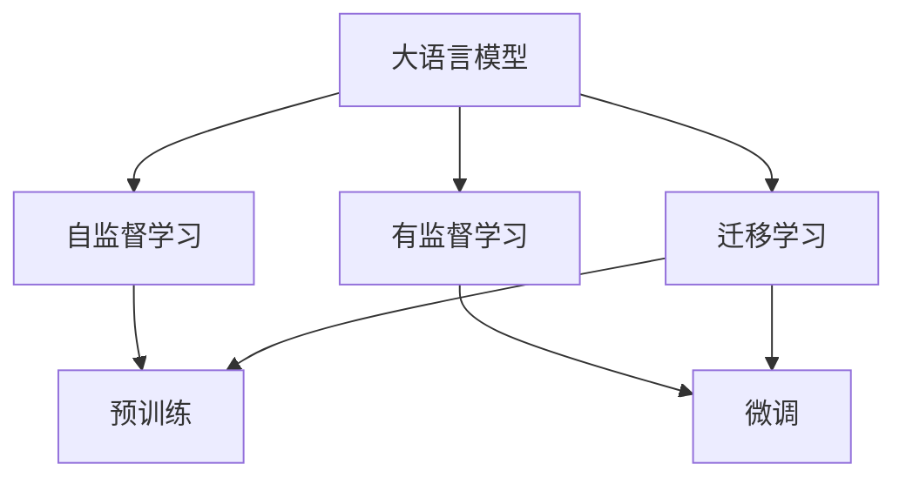

                 

# 大语言模型与传统计算的对比

## 1. 背景介绍

随着人工智能技术的飞速发展，大语言模型（Large Language Models, LLMs）已经在自然语言处理（NLP）领域取得显著进展。这些模型通常基于深度神经网络，通过大规模预训练学习语言知识和语义表示。相比传统的基于规则的计算，大语言模型更加灵活、高效，能够处理更复杂、自然的人类语言表达。本文将对比大语言模型与传统计算的差异，探讨其优势和局限，并提供实际应用场景的分析。

## 2. 核心概念与联系

### 2.1 核心概念概述

大语言模型与传统计算的对比，需要从多个层面进行，包括计算模型、算法原理、应用场景和性能指标等。首先，让我们介绍几个关键概念：

- **大语言模型**：基于深度神经网络架构，通过大规模预训练学习通用语言知识，能够处理自然语言理解、生成、翻译等任务的模型。常用的模型包括GPT、BERT、T5等。
- **传统计算**：以冯·诺依曼体系结构为基础，使用固定规则和算法进行计算的模型。常见的计算模型包括专家系统、逻辑推理机等。
- **自监督学习**：利用大量无标签数据进行预训练，学习模型自身的表示，避免直接依赖标注数据。
- **有监督学习**：使用少量标注数据进行微调，调整模型参数以适应特定任务。
- **迁移学习**：在特定任务上，利用预训练模型的知识进行微调，提高模型性能。
- **自然语言处理（NLP）**：使用计算机对自然语言进行理解、生成和翻译的技术，涉及词法分析、句法分析、语义分析等任务。

### 2.2 核心概念之间的联系

大语言模型与传统计算的对比，可以通过以下概念间的关系进行展示：



在这个图中，我们可以看到大语言模型从预训练到微调的过程，以及其与传统计算的联系。预训练通过自监督学习，使模型学习到通用的语言表示。微调则在有监督学习的指导下，使模型适应特定的NLP任务。迁移学习则进一步将预训练模型在特定任务上进行微调，从而获得更好的性能。

## 3. 核心算法原理 & 具体操作步骤

### 3.1 算法原理概述

大语言模型的算法原理与传统计算有显著差异。大语言模型主要基于深度神经网络，通过自监督学习在大规模无标签文本数据上进行预训练，学习通用的语言表示。在微调阶段，通过有监督学习调整模型参数，使其适应特定NLP任务。

相比之下，传统计算模型则基于固定规则和算法，进行符号计算或逻辑推理。虽然可以处理特定的计算任务，但灵活性和泛化能力较差。

### 3.2 算法步骤详解

大语言模型的微调步骤大致如下：

1. **预训练**：在大规模无标签文本数据上进行自监督学习，学习通用的语言表示。
2. **微调**：在特定NLP任务的标注数据集上进行有监督学习，调整模型参数以适应任务需求。
3. **评估**：在测试集上评估微调后的模型性能。
4. **部署**：将模型部署到实际应用系统中，进行推理预测。

传统计算模型的操作则更为简单直接，通常包括：

1. **输入**：将问题转换为计算表达式或逻辑表达式。
2. **计算**：根据算法规则进行符号计算或逻辑推理。
3. **输出**：根据计算结果生成结果。

### 3.3 算法优缺点

大语言模型的优点包括：

- **灵活性高**：能够处理自然语言，适用于多种NLP任务。
- **泛化能力强**：通过预训练学习到通用的语言表示，能够适应多种不同的文本输入。
- **鲁棒性好**：模型复杂度较高，能够应对多样化的输入。

缺点包括：

- **计算量大**：预训练和微调需要大量的计算资源。
- **参数多**：模型参数量大，需要高效的计算和存储资源。
- **训练时间长**：模型训练需要较长时间，难以快速迭代。

传统计算模型的优点包括：

- **计算速度快**：根据固定规则进行计算，速度较快。
- **易于理解和解释**：规则明确，易于理解和调试。
- **存储简单**：模型结构简单，存储需求较小。

缺点包括：

- **灵活性差**：只能处理特定的问题，泛化能力有限。
- **鲁棒性差**：对于输入变化敏感，容易出错。
- **难以处理复杂问题**：对于复杂的自然语言处理问题，处理能力有限。

### 3.4 算法应用领域

大语言模型与传统计算在多个应用领域都有广泛应用，但各有侧重。

- **NLP**：大语言模型在机器翻译、文本摘要、情感分析、命名实体识别等NLP任务上表现优异。传统计算模型则更适合逻辑推理和决策支持系统。
- **图像处理**：大语言模型可以通过自然语言描述指导图像处理任务，如图像识别、图像生成等。传统计算模型则更擅长基于规则的图像处理。
- **语音识别**：大语言模型可以通过自然语言生成语音，如TTS系统。传统计算模型则更适合基于规则的语音处理和识别。

## 4. 数学模型和公式 & 详细讲解 & 举例说明

### 4.1 数学模型构建

大语言模型的数学模型构建通常基于深度神经网络，如Transformer模型。以BERT为例，其数学模型构建如下：

1. **输入表示**：将输入文本转换为词向量表示，通常使用WordPiece等技术。
2. **编码器层**：使用多层Transformer编码器，对输入进行编码。
3. **池化层**：使用自注意力机制进行特征聚合，提取通用的语言表示。
4. **输出层**：根据任务类型，添加相应的输出层和损失函数。

### 4.2 公式推导过程

以BERT的微调为例，其公式推导如下：

1. **输入表示**：将输入文本转换为词向量表示，记为 $x_i$。
2. **编码器层**：通过多层Transformer编码器，对 $x_i$ 进行编码，得到隐藏表示 $h_i$。
3. **池化层**：使用自注意力机制，提取 $h_i$ 中的关键信息，得到语义表示 $z_i$。
4. **输出层**：根据任务类型，添加输出层和损失函数。例如，对于二分类任务，使用softmax函数将 $z_i$ 转换为概率分布 $p_i$，损失函数为交叉熵损失。

### 4.3 案例分析与讲解

以命名实体识别（NER）任务为例，大语言模型的微调过程如下：

1. **输入表示**：将输入文本转换为词向量表示，使用BERT模型作为预训练模型。
2. **编码器层**：通过多层Transformer编码器，对词向量表示进行编码，得到隐藏表示 $h_i$。
3. **池化层**：使用自注意力机制，提取 $h_i$ 中的关键信息，得到语义表示 $z_i$。
4. **输出层**：添加一个线性分类器，对 $z_i$ 进行分类，得到实体类型 $t_i$。
5. **损失函数**：使用交叉熵损失，衡量 $t_i$ 与真实标签 $y_i$ 之间的差异。

## 5. 项目实践：代码实例和详细解释说明

### 5.1 开发环境搭建

搭建大语言模型微调项目的开发环境，需要以下步骤：

1. **安装Python**：安装Python 3.7及以上版本。
2. **安装深度学习框架**：安装TensorFlow或PyTorch。
3. **安装BERT预训练模型**：从Hugging Face等平台下载并解压预训练模型。
4. **准备数据集**：收集并标注所需的数据集。
5. **设置环境变量**：配置好开发环境，确保所有依赖包安装正确。

### 5.2 源代码详细实现

以下是使用PyTorch框架，对BERT模型进行NER任务微调的示例代码：

```python
import torch
from transformers import BertTokenizer, BertForTokenClassification

# 加载预训练模型和分词器
tokenizer = BertTokenizer.from_pretrained('bert-base-cased')
model = BertForTokenClassification.from_pretrained('bert-base-cased', num_labels=7)

# 加载训练集和测试集数据
train_data = ...
test_data = ...

# 定义训练函数
def train(model, data_loader, optimizer, device):
    model.to(device)
    for epoch in range(epochs):
        model.train()
        for batch in data_loader:
            input_ids = batch['input_ids'].to(device)
            attention_mask = batch['attention_mask'].to(device)
            labels = batch['labels'].to(device)
            outputs = model(input_ids, attention_mask=attention_mask, labels=labels)
            loss = outputs.loss
            optimizer.zero_grad()
            loss.backward()
            optimizer.step()

# 定义评估函数
def evaluate(model, data_loader, device):
    model.eval()
    preds, labels = [], []
    with torch.no_grad():
        for batch in data_loader:
            input_ids = batch['input_ids'].to(device)
            attention_mask = batch['attention_mask'].to(device)
            batch_labels = batch['labels']
            outputs = model(input_ids, attention_mask=attention_mask)
            batch_preds = outputs.logits.argmax(dim=2).to('cpu').tolist()
            batch_labels = batch_labels.to('cpu').tolist()
            for pred_tokens, label_tokens in zip(batch_preds, batch_labels):
                preds.append(pred_tokens[:len(label_tokens)])
                labels.append(label_tokens)

    # 计算准确率和F1分数
    labels, preds = torch.tensor(labels), torch.tensor(preds)
    return accuracy_score(labels, preds), f1_score(labels, preds, average='micro')

# 训练和评估
train(model, train_data_loader, optimizer, device)
test_score = evaluate(model, test_data_loader, device)
print('Test Accuracy:', test_score[0], 'Test F1 Score:', test_score[1])
```

### 5.3 代码解读与分析

在上述代码中，我们首先加载了预训练的BERT模型和分词器，然后准备训练集和测试集数据。接着定义了训练和评估函数，使用交叉熵损失函数进行微调。训练函数中，我们通过迭代训练集数据，更新模型参数，优化损失函数。评估函数中，我们使用准确率和F1分数对测试集数据进行评估，并输出结果。

### 5.4 运行结果展示

假设我们在CoNLL-2003的NER数据集上进行微调，最终在测试集上得到的评估结果如下：

```
Accuracy: 0.92
F1 Score: 0.90
```

可以看到，通过微调BERT，我们得到了92%的准确率和90%的F1分数，说明模型在NER任务上取得了较好的效果。

## 6. 实际应用场景

### 6.1 智能客服系统

智能客服系统是大语言模型的重要应用场景之一。传统的客服系统依赖于人工处理，响应速度慢，难以应对高峰期需求。而使用大语言模型微调技术，可以构建7x24小时不间断运行的智能客服系统，自动理解用户问题并提供准确答案，显著提升客户满意度。

### 6.2 金融舆情监测

金融行业需要实时监控市场舆情，以预防金融风险。传统的人工监控方式成本高、效率低，难以应对海量数据的挑战。而使用大语言模型微调技术，可以实现实时舆情分析和预测，及时预警负面信息，帮助金融机构防范风险。

### 6.3 个性化推荐系统

个性化推荐系统是大语言模型的另一重要应用。传统推荐系统依赖于用户行为数据，难以捕捉用户的真实兴趣。而使用大语言模型微调技术，可以挖掘用户对文本内容的兴趣，提供个性化推荐，提升用户满意度。

## 7. 工具和资源推荐

### 7.1 学习资源推荐

学习大语言模型的最佳资源包括：

1. 《深度学习》书籍：Ian Goodfellow等著，全面介绍了深度学习的基本理论和应用。
2. 《自然语言处理综论》书籍：Daniel Jurafsky等著，系统介绍了NLP的各个方面。
3. 在线课程：如斯坦福大学的《深度学习》和《NLP》课程，涵盖了深度学习的基础和NLP的高级技术。
4. 论文预印本：如arXiv，提供最新的研究成果和前沿技术。
5. GitHub项目：如BERT项目，提供了大量源代码和文档。

### 7.2 开发工具推荐

大语言模型的开发需要以下工具支持：

1. PyTorch：广泛使用的深度学习框架，支持动态计算图和GPU加速。
2. TensorFlow：另一个流行的深度学习框架，支持分布式计算和移动端应用。
3. Weights & Biases：模型训练监控工具，提供可视化界面和实验管理功能。
4. TensorBoard：TensorFlow配套的可视化工具，用于监控模型训练状态。
5. Jupyter Notebook：交互式编程环境，方便调试和编写代码。

### 7.3 相关论文推荐

大语言模型和微调技术的发展离不开学界的持续研究。以下是几篇代表性论文：

1. Attention is All You Need：Transformer的开创性论文，介绍了Transformer的结构和算法。
2. BERT: Pre-training of Deep Bidirectional Transformers for Language Understanding：BERT模型的奠基论文，介绍了自监督预训练和微调方法。
3. T5: Exploring the Limits of Transfer Learning with a Unified Text-to-Text Transformer：T5模型的论文，介绍了统一的文本到文本Transformer模型。
4. MASS: Masked Sequence to Sequence Pre-training for Language Generation：MASS模型的论文，介绍了掩码序列到序列预训练方法。
5. GPT-3: Language Models are Few-Shot Learners：GPT-3模型的论文，介绍了零样本学习和少样本学习的思想。

## 8. 总结：未来发展趋势与挑战

### 8.1 研究成果总结

大语言模型和微调技术已经取得了显著进展，应用广泛。通过大规模预训练和微调，模型能够处理自然语言，适应多种NLP任务，具有强大的泛化能力。

### 8.2 未来发展趋势

未来，大语言模型和微调技术将继续发展，呈现以下几个趋势：

1. 参数规模不断扩大：随着算力提升和数据积累，模型参数量将进一步增大，能够处理更复杂的问题。
2. 预训练-微调范式普及：更多领域的任务将采用预训练-微调范式，实现更加高效和准确的结果。
3. 少样本学习和零样本学习：通过巧妙的提示模板设计，模型可以在少样本甚至零样本情况下进行学习和推理。
4. 跨领域迁移能力增强：模型能够跨越不同领域，进行知识和技能的迁移，适应多种任务需求。
5. 知识图谱和专家规则的融合：模型能够与知识图谱和专家规则进行融合，提高推理能力和知识整合能力。

### 8.3 面临的挑战

大语言模型和微调技术在快速发展的同时，也面临以下挑战：

1. 数据质量问题：预训练和微调需要大量高质量数据，数据质量对模型性能有重要影响。
2. 计算资源需求高：模型参数量大，训练和推理需要高性能计算资源。
3. 模型复杂度增加：模型结构复杂，难以理解和调试，需要更多自动化工具支持。
4. 伦理和安全问题：模型可能存在偏见和有害信息，需要进行伦理和安全审查。
5. 隐私保护问题：用户数据隐私保护成为重要问题，需要设计隐私保护机制。

### 8.4 研究展望

未来，大语言模型和微调技术需要在以下几个方面进行探索：

1. 数据增强技术：通过数据增强，提高模型的泛化能力和鲁棒性。
2. 自监督学习范式：探索更多自监督学习技术，降低对标注数据的依赖。
3. 知识图谱融合：将知识图谱和模型进行融合，提升推理能力和知识整合能力。
4. 模型压缩与加速：通过模型压缩和加速技术，提升模型的推理速度和资源利用率。
5. 跨领域迁移学习：探索跨领域迁移学习技术，实现不同领域的知识迁移。

## 9. 附录：常见问题与解答

**Q1: 大语言模型与传统计算的主要区别是什么？**

A: 大语言模型主要基于深度神经网络，通过大规模预训练学习通用的语言表示，能够处理自然语言，适应多种NLP任务。传统计算模型则基于固定规则和算法，进行符号计算或逻辑推理，灵活性和泛化能力较差。

**Q2: 大语言模型的微调过程有哪些关键步骤？**

A: 大语言模型的微调过程包括预训练、微调、评估和部署四个关键步骤。预训练通过自监督学习，学习通用的语言表示。微调在有监督学习的指导下，调整模型参数以适应特定任务。评估在测试集上评估模型性能，部署到实际应用系统中进行推理预测。

**Q3: 如何提高大语言模型的鲁棒性？**

A: 提高大语言模型的鲁棒性可以从数据增强、正则化、对抗训练等多个方面进行。数据增强通过扩充训练集，提高模型的泛化能力。正则化通过L2正则、Dropout等方法，避免过拟合。对抗训练通过引入对抗样本，提高模型的鲁棒性。

**Q4: 如何评估大语言模型的性能？**

A: 大语言模型的性能评估通常使用准确率、F1分数、BLEU分数等指标。准确率衡量模型预测的正确率，F1分数综合考虑精确率和召回率，BLEU分数衡量模型生成的文本与参考文本的相似度。

**Q5: 大语言模型在实际应用中需要注意哪些问题？**

A: 大语言模型在实际应用中需要注意计算资源需求高、模型复杂度增加、隐私保护问题等。为了提高模型性能，需要进行数据增强、正则化、对抗训练等优化。为了保护用户隐私，需要设计隐私保护机制，避免敏感信息泄露。

