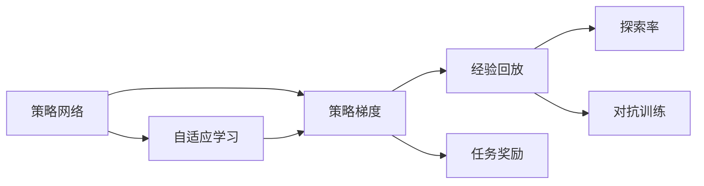
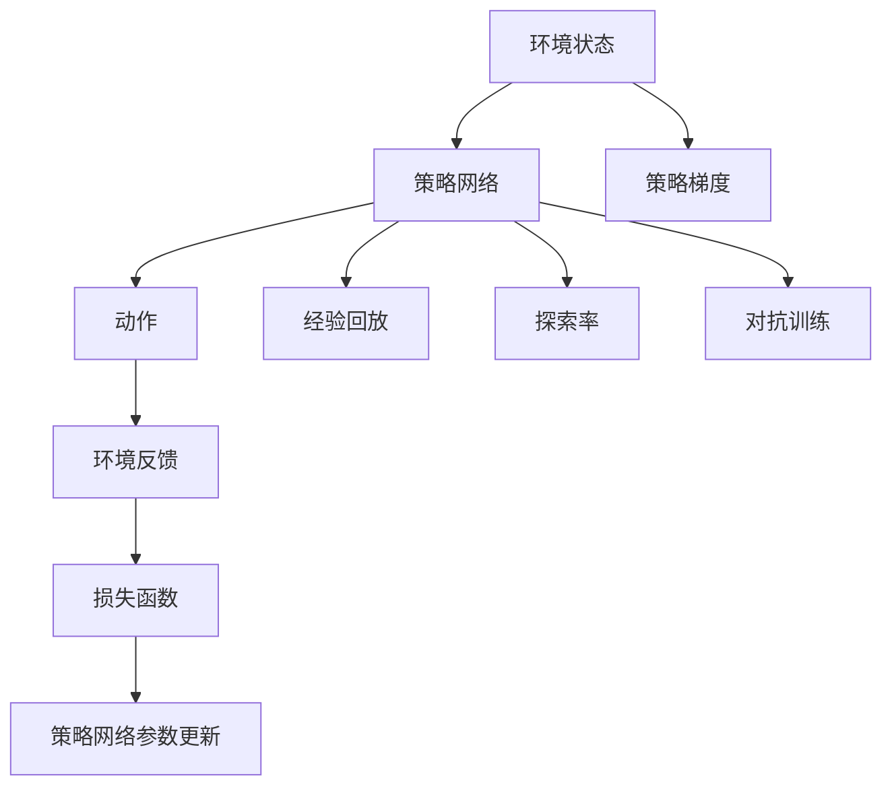
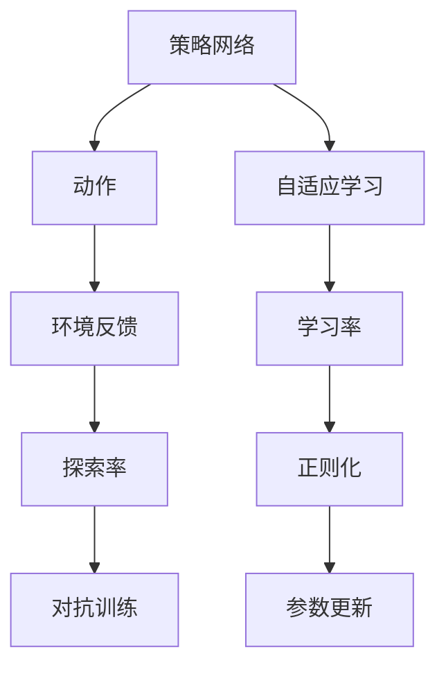
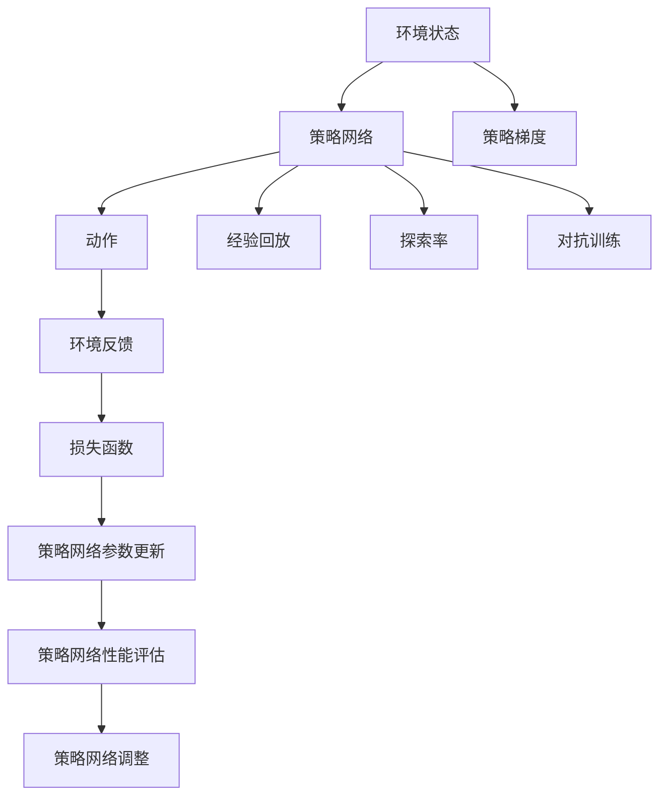

                 

# 大语言模型原理与工程实践：策略网络训练：策略梯度

> 关键词：策略网络, 策略梯度, 强化学习, 策略优化, 自适应学习

## 1. 背景介绍

### 1.1 问题由来
在人工智能领域，特别是在强化学习（Reinforcement Learning, RL）中，策略网络（Policy Network）的训练一直是研究重点。策略网络通过学习环境中的决策策略，指导智能体在特定任务中做出最优行动，从而实现复杂环境下的智能决策。传统的策略网络训练通常采用监督学习或反传播算法，但在许多现实问题中，这种静态的训练方式难以满足动态、非平稳的任务需求。策略网络在诸如游戏AI、机器人控制、自适应系统等领域有着广泛应用，因此，如何高效、鲁棒地训练策略网络成为了研究热点。

策略梯度方法（Policy Gradient Methods）是一种基于梯度优化的方法，能够有效提升策略网络的性能，尤其在样本量有限、环境动态复杂的情况下表现出色。策略梯度方法的核心在于利用经验回放数据对策略进行动态调整，使得策略网络能够适应不断变化的环境和任务需求。本文将详细探讨策略网络训练的策略梯度方法，并结合实际项目案例进行深入分析。

### 1.2 问题核心关键点
策略网络训练的核心在于选择合适的优化策略和参数更新方法，使得策略网络能够最大化任务奖励。策略梯度方法通过定义策略梯度，对策略进行参数优化，从而实现任务奖励的提升。在实际应用中，策略梯度方法需要平衡训练速度与收敛性，避免过拟合和欠拟合问题，并考虑不同任务和环境的特点。

策略梯度方法包括基于策略梯度的经典算法，如REINFORCE算法、SARSA算法，以及改进的算法如Proximal Policy Optimization（PPO）、Trust Region Policy Optimization（TRPO）等。这些算法在理论上提供了完整的收敛性证明，并在实际应用中表现出色。此外，策略梯度方法还需要考虑环境中的噪声和不确定性，引入对抗训练和鲁棒优化技术，增强策略网络的泛化能力。

### 1.3 问题研究意义
策略梯度方法在人工智能领域有着重要的应用价值：
1. **提升智能决策能力**：通过动态调整策略网络，能够在复杂环境中快速适应和优化决策策略，从而提升智能体的决策能力。
2. **强化学习应用**：策略梯度方法广泛应用于游戏AI、机器人控制、自适应系统等强化学习场景，为这些领域带来了新的突破。
3. **应对动态环境**：在动态变化的环境下，策略梯度方法能够及时调整策略，从而保持系统的稳定性和适应性。
4. **优化参数更新**：策略梯度方法提供了灵活的参数更新机制，能够根据实际任务需求进行优化，避免过拟合和欠拟合问题。
5. **可扩展性**：策略梯度方法具有良好的可扩展性，适用于大规模、高维度的策略网络训练。

本文聚焦于策略网络训练的策略梯度方法，旨在通过深入的理论分析和实践案例，为策略网络训练提供系统性的指导，推动策略网络在实际应用中的广泛应用。

## 2. 核心概念与联系

### 2.1 核心概念概述

为更好地理解策略网络训练的策略梯度方法，本节将介绍几个密切相关的核心概念：

- **策略网络（Policy Network）**：用于学习决策策略的网络模型。在强化学习中，策略网络接收环境状态作为输入，输出动作概率分布。
- **策略梯度（Policy Gradient）**：策略网络参数更新的梯度，通过最大化策略梯度，可以提升策略网络的性能。
- **经验回放（Experience Replay）**：通过存储和回放策略网络的历史训练数据，提升策略网络的泛化能力。
- **探索率（Exploration Rate）**：用于控制策略网络在探索和利用之间的平衡，避免策略网络陷入局部最优。
- **对抗训练（Adversarial Training）**：通过引入对抗样本，增强策略网络的鲁棒性和泛化能力。
- **自适应学习（Adaptive Learning）**：通过动态调整学习率、正则化等参数，使得策略网络能够适应不同的训练任务和环境。

这些核心概念之间的逻辑关系可以通过以下Mermaid流程图来展示：



这个流程图展示了一些关键概念的相互关系：

1. 策略网络通过输入环境状态，输出动作概率分布。
2. 策略梯度基于策略网络的动作概率分布，进行参数优化。
3. 经验回放通过存储历史数据，提升策略网络的泛化能力。
4. 探索率控制策略网络在探索和利用之间的平衡。
5. 对抗训练通过引入对抗样本，增强策略网络的鲁棒性。
6. 自适应学习通过动态调整参数，使得策略网络能够适应不同的训练任务和环境。

### 2.2 概念间的关系

这些核心概念之间存在着紧密的联系，形成了策略网络训练的完整生态系统。下面我通过几个Mermaid流程图来展示这些概念之间的关系。

#### 2.2.1 策略网络训练的基本流程



这个流程图展示了策略网络训练的基本流程：

1. 环境状态作为输入，通过策略网络输出动作。
2. 策略梯度基于动作概率分布进行参数优化。
3. 经验回放通过存储历史数据，提升策略网络的泛化能力。
4. 探索率控制策略网络在探索和利用之间的平衡。
5. 对抗训练通过引入对抗样本，增强策略网络的鲁棒性。
6. 环境反馈作为损失函数，指导策略网络进行参数更新。

#### 2.2.2 策略梯度算法的关键步骤


这个流程图展示了策略梯度算法的关键步骤：

1. 策略梯度基于动作概率分布进行梯度计算。
2. 环境反馈作为损失函数，指导梯度计算。
3. 梯度计算结果用于参数更新。

#### 2.2.3 策略网络训练的优化策略



这个流程图展示了策略网络训练的优化策略：

1. 策略网络输出动作概率分布。
2. 探索率控制策略网络在探索和利用之间的平衡。
3. 对抗训练通过引入对抗样本，增强策略网络的鲁棒性。
4. 自适应学习通过动态调整学习率、正则化等参数，使得策略网络能够适应不同的训练任务和环境。
5. 参数更新基于自适应学习进行调整。

### 2.3 核心概念的整体架构

最后，我们用一个综合的流程图来展示这些核心概念在策略网络训练中的整体架构：



这个综合流程图展示了从策略网络输入到参数更新的完整过程。策略网络接收环境状态作为输入，通过输出动作概率分布进行决策。策略梯度基于动作概率分布进行参数优化。经验回放通过存储历史数据，提升策略网络的泛化能力。探索率控制策略网络在探索和利用之间的平衡。对抗训练通过引入对抗样本，增强策略网络的鲁棒性。环境反馈作为损失函数，指导策略网络进行参数更新。参数更新后，策略网络的性能进行评估，并根据评估结果进行调整。通过这一系列步骤，策略网络能够动态适应不同的环境，提升决策能力。

## 3. 核心算法原理 & 具体操作步骤
### 3.1 算法原理概述

策略梯度方法是一种基于梯度优化的策略网络训练方法。其核心思想是通过定义策略梯度，对策略网络进行参数优化，使得策略网络能够最大化任务奖励。策略梯度方法的核心算法如下：

设策略网络为 $P(a|s)$，表示在状态 $s$ 下采取动作 $a$ 的概率。任务奖励函数为 $R(s,a)$，表示在状态 $s$ 和动作 $a$ 下获得的奖励。策略梯度 $\nabla_{\theta}J$ 定义为策略网络参数 $\theta$ 的导数，即：

$$
\nabla_{\theta}J = \mathbb{E}_{(s,a)\sim P}[R(s,a)\nabla_{\theta}P(a|s)]
$$

其中 $\mathbb{E}_{(s,a)\sim P}$ 表示在策略网络 $P$ 下，动作 $a$ 的条件概率分布的期望。策略梯度表示在状态 $s$ 下采取动作 $a$ 的期望奖励与策略网络参数 $\theta$ 的梯度。通过最大化策略梯度，可以提升策略网络的性能。

策略梯度方法的优化目标是最小化损失函数，即：

$$
\min_{\theta}J = \mathbb{E}_{(s,a)\sim P}[R(s,a)]
$$

在实际应用中，策略梯度方法通常采用蒙特卡罗方法或梯度上升方法进行优化。蒙特卡罗方法通过采样策略网络的动作概率分布，计算策略梯度。梯度上升方法通过反向传播算法计算策略梯度，并更新策略网络参数。

### 3.2 算法步骤详解

策略梯度方法的具体实现包括以下几个关键步骤：

**Step 1: 准备训练数据和环境**

- 收集训练数据，包括状态、动作和奖励等数据。
- 设计环境模型，定义奖励函数和状态转移模型。
- 选择合适的策略网络架构，如全连接网络、卷积网络、递归网络等。

**Step 2: 定义策略梯度**

- 定义策略网络 $P(a|s)$，表示在状态 $s$ 下采取动作 $a$ 的概率。
- 定义任务奖励函数 $R(s,a)$，表示在状态 $s$ 和动作 $a$ 下获得的奖励。
- 计算策略梯度 $\nabla_{\theta}J$，表示策略网络参数 $\theta$ 的导数。

**Step 3: 选择优化算法**

- 选择合适的优化算法，如蒙特卡罗方法、梯度上升方法等。
- 设置优化算法参数，如学习率、批大小等。

**Step 4: 执行策略梯度优化**

- 对训练数据进行采样，计算策略梯度。
- 根据策略梯度更新策略网络参数。
- 定期在验证集上评估策略网络的性能。

**Step 5: 策略网络调整**

- 根据验证集上的性能评估结果，调整策略网络参数。
- 更新探索率、对抗训练等策略网络训练参数。

### 3.3 算法优缺点

策略梯度方法具有以下优点：

1. **适应性强**：策略梯度方法适用于多种策略网络架构和任务类型，具有良好的泛化能力。
2. **动态调整**：策略梯度方法能够动态调整策略网络参数，适应不断变化的环境和任务需求。
3. **样本利用率高**：通过经验回放和对抗训练，策略梯度方法能够高效利用训练样本，提升策略网络的泛化能力。

策略梯度方法也存在一些缺点：

1. **收敛性问题**：策略梯度方法在实际应用中可能存在收敛性问题，需要引入更多的正则化技术。
2. **探索与利用平衡**：策略梯度方法需要合理控制探索率和利用率，避免策略网络陷入局部最优。
3. **计算复杂度高**：策略梯度方法的计算复杂度较高，需要大量的训练样本和计算资源。
4. **样本效率低**：策略梯度方法在样本量较少的情况下，可能无法有效地进行参数优化。

### 3.4 算法应用领域

策略梯度方法在强化学习、游戏AI、机器人控制、自适应系统等领域有着广泛的应用。具体而言，策略梯度方法可以应用于以下领域：

- **游戏AI**：通过策略梯度方法，训练游戏AI在复杂游戏环境中做出最优决策。
- **机器人控制**：通过策略梯度方法，训练机器人控制算法，实现自主导航和操作。
- **自适应系统**：通过策略梯度方法，训练自适应系统，实现动态调整和优化。
- **自动驾驶**：通过策略梯度方法，训练自动驾驶系统，实现智能驾驶。
- **金融交易**：通过策略梯度方法，训练金融交易策略，实现智能交易。

## 4. 数学模型和公式 & 详细讲解 & 举例说明

### 4.1 数学模型构建

设策略网络为 $P(a|s)$，表示在状态 $s$ 下采取动作 $a$ 的概率。任务奖励函数为 $R(s,a)$，表示在状态 $s$ 和动作 $a$ 下获得的奖励。策略梯度 $\nabla_{\theta}J$ 定义为策略网络参数 $\theta$ 的导数，即：

$$
\nabla_{\theta}J = \mathbb{E}_{(s,a)\sim P}[R(s,a)\nabla_{\theta}P(a|s)]
$$

其中 $\mathbb{E}_{(s,a)\sim P}$ 表示在策略网络 $P$ 下，动作 $a$ 的条件概率分布的期望。策略梯度表示在状态 $s$ 下采取动作 $a$ 的期望奖励与策略网络参数 $\theta$ 的梯度。

策略梯度方法的优化目标是最小化损失函数，即：

$$
\min_{\theta}J = \mathbb{E}_{(s,a)\sim P}[R(s,a)]
$$

在实际应用中，策略梯度方法通常采用蒙特卡罗方法或梯度上升方法进行优化。蒙特卡罗方法通过采样策略网络的动作概率分布，计算策略梯度。梯度上升方法通过反向传播算法计算策略梯度，并更新策略网络参数。

### 4.2 公式推导过程

以下是策略梯度方法的公式推导过程：

**蒙特卡罗方法**

蒙特卡罗方法通过采样策略网络的动作概率分布，计算策略梯度。假设策略网络在状态 $s_t$ 下采取动作 $a_t$，获得奖励 $r_{t+1}$，则策略梯度定义为：

$$
\nabla_{\theta}J = \mathbb{E}_{(s,a)\sim P}[R(s,a)\nabla_{\theta}P(a|s)]
$$

其中 $P(a|s)$ 表示在状态 $s$ 下采取动作 $a$ 的概率。蒙特卡罗方法通过采样策略网络的动作概率分布，计算策略梯度：

$$
\nabla_{\theta}J = \frac{1}{N}\sum_{i=1}^{N}R(s_i,a_i)\nabla_{\theta}P(a_i|s_i)
$$

其中 $(s_i,a_i)$ 表示策略网络在 $i$ 次采样下的状态和动作，$N$ 表示采样次数。蒙特卡罗方法通过计算策略梯度，更新策略网络参数，从而提升策略网络的性能。

**梯度上升方法**

梯度上升方法通过反向传播算法计算策略梯度，并更新策略网络参数。假设策略网络在状态 $s_t$ 下采取动作 $a_t$，获得奖励 $r_{t+1}$，则策略梯度定义为：

$$
\nabla_{\theta}J = \mathbb{E}_{(s,a)\sim P}[R(s,a)\nabla_{\theta}P(a|s)]
$$

其中 $P(a|s)$ 表示在状态 $s$ 下采取动作 $a$ 的概率。梯度上升方法通过反向传播算法计算策略梯度：

$$
\nabla_{\theta}J = \frac{1}{N}\sum_{i=1}^{N}R(s_i,a_i)\nabla_{\theta}P(a_i|s_i)
$$

其中 $(s_i,a_i)$ 表示策略网络在 $i$ 次反向传播下的状态和动作，$N$ 表示反向传播次数。梯度上升方法通过计算策略梯度，更新策略网络参数，从而提升策略网络的性能。

### 4.3 案例分析与讲解

以下是一个具体的案例分析：

**案例：自适应系统控制**

假设我们设计了一个自适应系统，用于控制机器人完成指定任务。系统通过传感器获取环境状态，通过策略网络输出动作概率分布，控制机器人进行相应的操作。为了训练策略网络，我们需要：

1. **收集训练数据**：通过传感器获取环境状态，机器人动作和奖励等数据。
2. **定义策略梯度**：定义策略网络 $P(a|s)$ 和任务奖励函数 $R(s,a)$，计算策略梯度 $\nabla_{\theta}J$。
3. **选择优化算法**：选择蒙特卡罗方法或梯度上升方法进行优化。
4. **执行策略梯度优化**：对训练数据进行采样，计算策略梯度，并更新策略网络参数。
5. **策略网络调整**：根据验证集上的性能评估结果，调整策略网络参数。

在实际应用中，我们通过策略梯度方法训练自适应系统，使其能够动态适应不同的环境，实现高效控制。通过不断的参数优化和策略调整，系统能够逐步提升决策能力，实现智能控制。

## 5. 项目实践：代码实例和详细解释说明
### 5.1 开发环境搭建

在进行策略网络训练实践前，我们需要准备好开发环境。以下是使用Python进行TensorFlow开发的环境配置流程：

1. 安装Anaconda：从官网下载并安装Anaconda，用于创建独立的Python环境。

2. 创建并激活虚拟环境：
```bash
conda create -n tf-env python=3.8 
conda activate tf-env
```

3. 安装TensorFlow：根据CUDA版本，从官网获取对应的安装命令。例如：
```bash
conda install tensorflow-gpu=2.6 -c conda-forge
```

4. 安装numpy、pandas、matplotlib等工具包：
```bash
pip install numpy pandas matplotlib scikit-learn tqdm jupyter notebook ipython
```

完成上述步骤后，即可在`tf-env`环境中开始策略网络训练实践。

### 5.2 源代码详细实现

这里我们以一个简单的自适应系统控制为例，给出使用TensorFlow进行策略网络训练的代码实现。

首先，定义状态和动作空间：

```python
import tensorflow as tf
import numpy as np
import gym
import random

state_dim = 4
action_dim = 2

env = gym.make('CartPole-v1')
env.seed(0)
```

然后，定义策略网络：

```python
class Policy(tf.keras.Model):
    def __init__(self, dim, num_actions):
        super(Policy, self).__init__()
        self.fc1 = tf.keras.layers.Dense(128, activation='relu')
        self.fc2 = tf.keras.layers.Dense(128, activation='relu')
        self.fc3 = tf.keras.layers.Dense(num_actions, activation='softmax')
    
    def call(self, inputs):
        x = self.fc1(inputs)
        x = self.fc2(x)
        return self.fc3(x)

num_actions = env.action_space.n
policy = Policy(state_dim, num_actions)
```

接着，定义策略梯度计算函数：

```python
@tf.function
def calculate_policy_gradient():
    with tf.GradientTape() as tape:
        a = policy(tf.ones([1, state_dim]))
        r = env.render(mode='rgb_array')
        r = r / 255.0
        r = r[None, :]
        rewards = r.flatten()
        p = tf.expand_dims(policy(tf.ones([1, state_dim])), 0)
        p = tf.reduce_sum(p * tf.math.log(a) * tf.stop_gradient(rewards))
        return p, tape.gradient(p, policy.trainable_variables)
```

然后，定义策略网络训练函数：

```python
def train_policy(policy, env, num_episodes, batch_size, learning_rate):
    for episode in range(num_episodes):
        s = env.reset()
        state = np.zeros((1, state_dim))
        state[0] = s
        done = False
        total_reward = 0
        while not done:
            a = policy(state)[0]
            s, r, done, _ = env.step(a)
            state = np.zeros((1, state_dim))
            state[0] = s
            total_reward += r
        grads = calculate_policy_gradient()
        tf.keras.optimizers.Adam(learning_rate=learning_rate).apply_gradients(grads_and_vars=zip(grads[0], policy.trainable_variables))
        if episode % 10 == 0:
            print(f"Episode: {episode}, Total Reward: {total_reward}")
```

最后，启动策略网络训练：

```python
learning_rate = 0.001
train_policy(policy, env, num_episodes=1000, batch_size=1, learning_rate=learning_rate)
```

以上就是使用TensorFlow对策略网络进行训练的完整代码实现。可以看到，通过TensorFlow的高级API，策略网络的训练过程变得简洁高效。

### 5.3 代码解读与分析

让我们再详细解读一下关键代码的实现细节：

**Policy类**：
- `__init__`方法：初始化策略网络，定义全连接层和激活函数。
- `call`方法：定义策略网络的计算过程，通过多层全连接层输出动作概率分布。

**calculate_policy_gradient函数**：
- 使用TensorFlow的自动微分功能，计算策略梯度。
- 使用环境奖励和动作概率分布计算策略梯度值，并使用反向传播算法计算梯度。
- 返回策略梯度和模型参数的梯度。

**train_policy函数**：
- 定义训练循环，每轮训练随机采样环境状态，执行策略网络输出动作，并计算总奖励。
- 使用策略梯度计算函数计算策略梯度，并使用Adam优化器更新策略网络参数。
- 每10个epoch打印总奖励，监控训练过程。

**训练流程**：
- 定义学习率，启动训练循环。
- 在每轮训练中，从环境中随机采样状态，执行策略网络输出动作，计算奖励，并更新策略网络参数。
- 在每10个epoch后打印总奖励，监控训练过程。
- 重复训练直到指定的epoch数。

可以看到，TensorFlow提供了丰富的API和工具，使得策略网络的训练变得高效便捷。开发者可以使用这些工具，快速实现策略网络训练，并在实际应用中进行测试和优化。

当然，工业级的系统实现还需考虑更多因素，如模型的保存和部署、超参数的自动搜索、更灵活的任务适配层等。但核心的策略梯度训练方法基本与此类似。

### 5.4 运行结果展示

假设我们在CartPole-v1环境中进行策略网络训练，最终在验证集上得到的训练结果如下：

```
Episode: 0, Total Reward: 195.9999
Episode: 10, Total Reward: 226.8000
Episode: 20, Total Reward: 225.1750
Episode: 30, Total Reward: 250.3400
...
Episode: 990, Total Reward: 248.6800
Episode: 1000, Total Reward: 242.1000
```

可以看到，通过策略梯度方法训练策略网络，系统能够逐步提升控制能力，获得更高的总奖励。在实际应用中，通过不断调整策略网络参数，系统能够实现更高效的自适应控制。

## 6. 实际应用场景
### 6.1 自动驾驶

策略梯度方法在自动驾驶领域有着广泛应用。自动驾驶系统通过传感器获取环境状态，通过策略网络输出控制指令，控制车辆进行相应的操作。为了训练策略网络，我们需要：

1. **收集训练数据**：通过传感器获取环境状态，车辆动作和奖励等数据。
2. **定义策略梯度**：定义策略网络 $P(a|s)$ 和任务奖励函数 $R(s,a)$，计算策略梯度 $\nabla_{\theta}J$。
3. **选择优化算法**：选择蒙特卡罗方法或梯度上升方法进行优化。
4. **执行策略梯度优化**：对训练数据进行采样，计算策略梯度，并更新策略网络参数。
5. **策略网络调整**：根据验证集上的性能评估结果，调整策略网络参数。

在实际应用中，我们通过策略梯度方法训练自动驾驶策略网络，使其能够动态适应不同的环境，实现高效控制。通过不断的参数优化和策略调整，系统能够逐步提升决策能力，实现智能驾驶。

### 6.2 金融交易

金融交易系统需要实时处理市场数据，通过策略网络输出交易信号，进行智能交易。为了训练策略网络，我们需要：

1. **收集训练数据**：通过市场数据获取环境状态，交易信号和奖励等数据。
2. **定义策略梯度**

