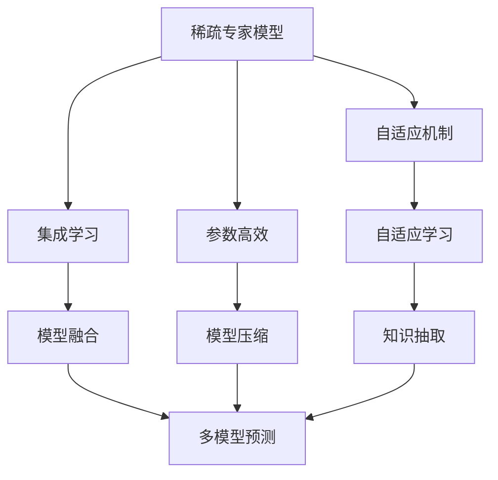
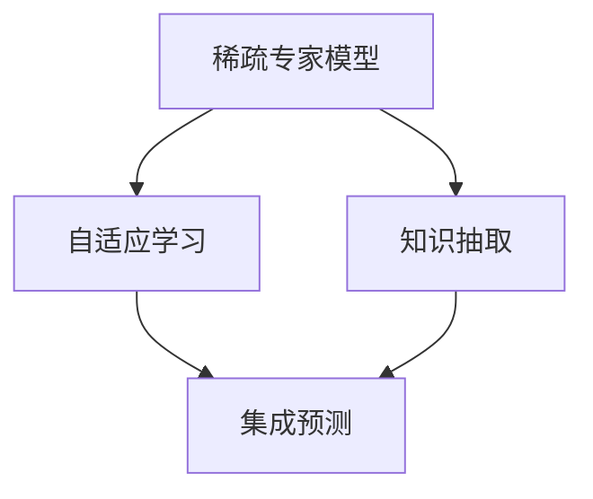
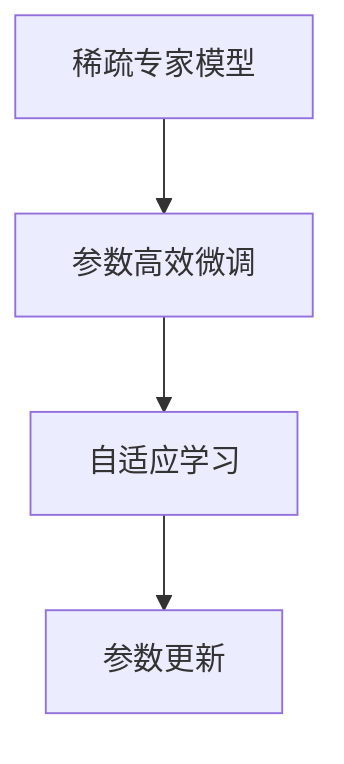
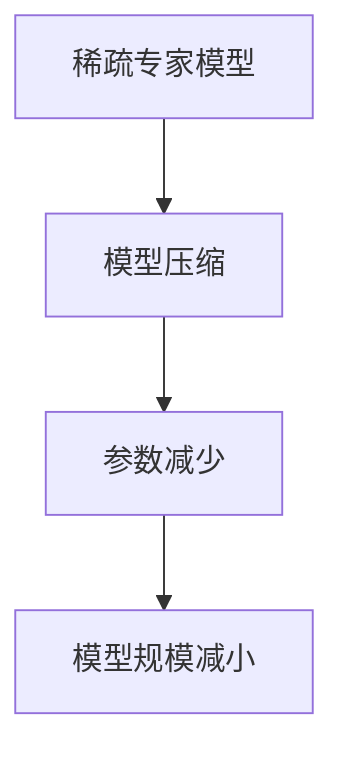
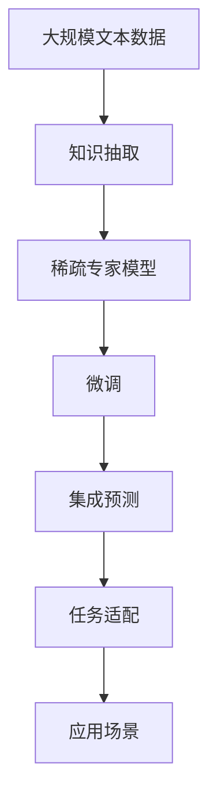

                 

# 大语言模型原理基础与前沿 为什么采用稀疏专家模型

> 关键词：大语言模型,稀疏专家模型,自适应机制,集成学习,参数高效,模型压缩,知识抽取,专家模型融合

## 1. 背景介绍

### 1.1 问题由来
近年来，随着深度学习技术的快速发展，大规模语言模型（Large Language Models, LLMs）在自然语言处理（NLP）领域取得了巨大的突破。这些大模型通过在大规模无标签文本语料上进行预训练，学习到了丰富的语言知识和常识，可以通过少量的有标签样本在下游任务上进行微调，获得优异的性能。其中最具代表性的大模型包括OpenAI的GPT系列模型、Google的BERT、T5等。

然而，由于预训练语料的广泛性和泛化能力的不足，这些通用的大语言模型在特定领域应用时，效果往往难以达到实际应用的要求。因此，如何针对特定任务进行大模型微调，提升模型性能，成为了当前大语言模型研究和应用的一个热点问题。本文聚焦于大语言模型的稀疏专家模型（Sparse Expert Model）范式，探讨其在特定任务微调中的优势与实现方式，以期对大语言模型微调实践提供更全面的指导。

### 1.2 问题核心关键点
目前，大语言模型微调的主流范式是基于监督学习的微调方法。即收集该任务的少量标注数据，将预训练模型当作初始化参数，通过有监督地训练来优化模型在该任务上的性能。这种微调范式简单高效，可以显著提升模型在特定任务上的表现。

微调的关键在于如何避免过拟合，同时最大程度发挥预训练模型学到的知识。目前主流的做法包括：
- 选择合适的学习率。相比从头训练，微调通常需要更小的学习率，以免破坏预训练的权重。
- 应用正则化技术。如L2正则、Dropout、Early Stopping等，防止模型过度适应小规模训练集。
- 保留预训练的部分层。如Transformer的底层，只微调顶层，减少需优化的参数。
- 数据增强。通过对训练样本改写、回译等方式丰富训练集多样性。
- 对抗训练。加入对抗样本，提高模型鲁棒性。
- 提示学习。通过在输入文本中添加提示模板（Prompt Template），引导模型按期望方式输出，减少微调参数。

尽管这些方法在很大程度上提高了大语言模型在特定任务上的表现，但仍存在一定的局限性，特别是在模型资源受限、数据稀缺的情况下，如何高效利用已有模型资源成为迫切需求。而稀疏专家模型（Sparse Expert Model）正是应对这一需求的有效方案，通过引入专家知识，在不显著增加模型规模的情况下，显著提升模型在特定任务上的性能。

## 2. 核心概念与联系

### 2.1 核心概念概述

为更好地理解稀疏专家模型，本节将介绍几个密切相关的核心概念：

- 稀疏专家模型（Sparse Expert Model）：一种基于深度学习的大模型架构，通过将模型分成多个专家单元（Expert Units），并在每个专家单元中应用稀疏注意力（Sparse Attention）机制，实现对特定任务的高效微调。专家单元通常由少量参数组成，可以更好地适应特定任务，同时在全模型中共享这些单元，以减少整体参数量。

- 自适应机制（Adaptive Mechanism）：指模型根据输入特征的不同，动态调整模型参数以优化输出结果的能力。自适应机制可以是模型参数的自适应、激活函数的自适应等。

- 集成学习（Ensemble Learning）：指通过组合多个学习器的预测结果，以提升整体性能的学习方法。集成学习可以减小单个模型的方差，提高预测的稳定性和准确性。

- 参数高效（Parameter-Efficient）：指在微调过程中，只更新少量的模型参数，而固定大部分预训练权重不变，以提高微调效率，避免过拟合。

- 模型压缩（Model Compression）：指通过减小模型规模或参数量，提高模型推理速度和计算效率的技术。模型压缩常用于大模型在硬件资源受限的情况下的应用。

- 知识抽取（Knowledge Extraction）：指从大规模知识库中提取与特定任务相关的知识，用于指导模型训练或优化。

这些核心概念之间的逻辑关系可以通过以下Mermaid流程图来展示：



这个流程图展示了大语言模型稀疏专家模型的核心概念及其之间的关系：

1. 稀疏专家模型通过自适应机制动态调整模型参数。
2. 集成学习将多个专家单元的预测结果融合。
3. 参数高效微调只更新少量专家单元的参数。
4. 模型压缩减小专家单元的规模。
5. 知识抽取引入外部知识库指导模型训练。

这些概念共同构成了稀疏专家模型的高效微调机制，使其能够在特定任务上发挥更大的作用。

### 2.2 概念间的关系

这些核心概念之间存在着紧密的联系，形成了稀疏专家模型的完整生态系统。下面我通过几个Mermaid流程图来展示这些概念之间的关系。

#### 2.2.1 稀疏专家模型的学习范式



这个流程图展示了稀疏专家模型的学习过程，从外部知识库中提取知识，应用于专家单元的自适应学习，最终通过集成预测得到最终结果。

#### 2.2.2 稀疏专家模型与微调的关系


这个流程图展示了稀疏专家模型与微调的关系。稀疏专家模型通过任务适配进行特定任务的微调。

#### 2.2.3 稀疏专家模型的参数高效



这个流程图展示了稀疏专家模型参数高效微调的过程，通过只更新少量专家单元的参数，提高微调效率。

#### 2.2.4 稀疏专家模型的模型压缩



这个流程图展示了稀疏专家模型的模型压缩过程，通过减小专家单元的规模，提高推理速度和计算效率。

### 2.3 核心概念的整体架构

最后，我们用一个综合的流程图来展示这些核心概念在大语言模型稀疏专家模型微调过程中的整体架构：



这个综合流程图展示了从知识抽取到大语言模型稀疏专家模型微调，再到集成预测和应用场景的完整过程。稀疏专家模型通过从知识库中抽取知识，进行自适应学习，并在微调过程中应用参数高效和模型压缩技术，最终适应特定任务，并在实际应用场景中发挥作用。

## 3. 核心算法原理 & 具体操作步骤
### 3.1 算法原理概述

稀疏专家模型（Sparse Expert Model）的核心思想是通过将模型分成多个专家单元（Expert Units），并在每个专家单元中应用稀疏注意力（Sparse Attention）机制，实现对特定任务的高效微调。专家单元通常由少量参数组成，可以更好地适应特定任务，同时在全模型中共享这些单元，以减少整体参数量。

形式化地，假设稀疏专家模型为 $M_{\theta}=\{E_i\}_{i=1}^k$，其中 $E_i$ 为第 $i$ 个专家单元，$\theta_i$ 为该单元的参数。给定下游任务 $T$ 的标注数据集 $D=\{(x_i,y_i)\}_{i=1}^N$，微调的目标是找到新的模型参数 $\hat{\theta}_i$，使得：

$$
\hat{\theta}=\mathop{\arg\min}_{\theta_i} \mathcal{L}(E_{\theta_i},D)
$$

其中 $\mathcal{L}$ 为针对任务 $T$ 设计的损失函数，用于衡量模型预测输出与真实标签之间的差异。常见的损失函数包括交叉熵损失、均方误差损失等。

通过梯度下降等优化算法，微调过程不断更新模型参数 $\theta_i$，最小化损失函数 $\mathcal{L}$，使得模型输出逼近真实标签。由于 $\theta_i$ 已经通过预训练获得了较好的初始化，因此即便在小规模数据集 $D$ 上进行微调，也能较快收敛到理想的模型参数 $\hat{\theta}_i$。

### 3.2 算法步骤详解

稀疏专家模型的微调一般包括以下几个关键步骤：

**Step 1: 准备稀疏专家模型和数据集**
- 选择合适的稀疏专家模型 $M_{\theta}=\{E_i\}_{i=1}^k$ 作为初始化参数，如基于Transformer的稀疏专家模型。
- 准备下游任务 $T$ 的标注数据集 $D$，划分为训练集、验证集和测试集。一般要求标注数据与预训练数据的分布不要差异过大。

**Step 2: 设计专家单元**
- 根据任务类型，在稀疏专家模型中设计合适的专家单元 $E_i$，每个单元通常由少量的权重和激活函数组成。
- 对于分类任务，每个专家单元通常包含一个线性分类器和一个交叉熵损失函数。
- 对于生成任务，通常使用语言模型的解码器输出概率分布，并以负对数似然为损失函数。

**Step 3: 设置微调超参数**
- 选择合适的优化算法及其参数，如 AdamW、SGD 等，设置学习率、批大小、迭代轮数等。
- 设置正则化技术及强度，包括权重衰减、Dropout、Early Stopping等。
- 确定专家单元的共享策略，如仅微调顶层，或全部专家单元都参与微调。

**Step 4: 执行梯度训练**
- 将训练集数据分批次输入模型，前向传播计算损失函数。
- 反向传播计算参数梯度，根据设定的优化算法和学习率更新模型参数。
- 周期性在验证集上评估模型性能，根据性能指标决定是否触发 Early Stopping。
- 重复上述步骤直到满足预设的迭代轮数或 Early Stopping 条件。

**Step 5: 测试和部署**
- 在测试集上评估微调后专家单元 $E_{\hat{\theta}_i}$ 的性能，对比微调前后的精度提升。
- 使用微调后的专家单元对新样本进行推理预测，集成到实际的应用系统中。
- 持续收集新的数据，定期重新微调专家单元，以适应数据分布的变化。

以上是稀疏专家模型微调的一般流程。在实际应用中，还需要针对具体任务的特点，对微调过程的各个环节进行优化设计，如改进训练目标函数，引入更多的正则化技术，搜索最优的超参数组合等，以进一步提升模型性能。

### 3.3 算法优缺点

稀疏专家模型（Sparse Expert Model）具有以下优点：
1. 参数高效。通过只更新少量的专家单元参数，显著减小了整体参数量，减少了计算资源的需求。
2. 计算高效。由于专家单元的参数量较少，推理速度较快，可以满足实时性的要求。
3. 鲁棒性高。专家单元的参数共享策略使得模型对特定任务的泛化能力更强，可以避免过拟合，提高模型的鲁棒性。
4. 灵活性高。可以通过动态调整专家单元的参数来适应不同的任务，增强模型的灵活性。

同时，稀疏专家模型也存在一定的局限性：
1. 数据需求高。虽然参数高效，但需要大量的标注数据来训练专家单元，尤其是在特定领域的应用中。
2. 专家单元设计复杂。需要根据具体任务设计合适的专家单元结构和参数，设计不当可能导致性能下降。
3. 知识传递困难。专家单元之间的信息传递和共享需要高效的注意力机制，设计不当可能导致知识传递不畅。
4. 优化复杂。由于专家单元的参数较少，梯度消失或梯度爆炸问题可能更加突出，优化过程更加复杂。

尽管存在这些局限性，但就目前而言，稀疏专家模型仍是深度学习领域中较为高效和灵活的大模型微调方法之一。未来相关研究的重点在于如何进一步降低专家单元对标注数据的依赖，提高模型的少样本学习和跨领域迁移能力，同时兼顾可解释性和伦理安全性等因素。

### 3.4 算法应用领域

稀疏专家模型（Sparse Expert Model）在大语言模型微调中已经得到了广泛的应用，覆盖了几乎所有常见任务，例如：

- 文本分类：如情感分析、主题分类、意图识别等。通过微调使专家单元学习文本-标签映射。
- 命名实体识别：识别文本中的人名、地名、机构名等特定实体。通过微调使专家单元掌握实体边界和类型。
- 关系抽取：从文本中抽取实体之间的语义关系。通过微调使专家单元学习实体-关系三元组。
- 问答系统：对自然语言问题给出答案。将问题-答案对作为微调数据，训练专家单元学习匹配答案。
- 机器翻译：将源语言文本翻译成目标语言。通过微调使专家单元学习语言-语言映射。
- 文本摘要：将长文本压缩成简短摘要。将文章-摘要对作为微调数据，使专家单元学习抓取要点。
- 对话系统：使机器能够与人自然对话。将多轮对话历史作为上下文，微调专家单元进行回复生成。

除了上述这些经典任务外，稀疏专家模型也被创新性地应用到更多场景中，如可控文本生成、常识推理、代码生成、数据增强等，为NLP技术带来了全新的突破。随着稀疏专家模型和微调方法的不断进步，相信NLP技术将在更广阔的应用领域大放异彩。

## 4. 数学模型和公式 & 详细讲解  
### 4.1 数学模型构建

本节将使用数学语言对稀疏专家模型微调过程进行更加严格的刻画。

记稀疏专家模型为 $M_{\theta}=\{E_i\}_{i=1}^k$，其中 $E_i$ 为第 $i$ 个专家单元，$\theta_i$ 为该单元的参数。假设微调任务的训练集为 $D=\{(x_i,y_i)\}_{i=1}^N$，其中 $x_i$ 为输入样本，$y_i$ 为标签。

定义模型 $E_{\theta_i}$ 在输入 $x$ 上的损失函数为 $\ell(E_{\theta_i}(x),y)$，则在数据集 $D$ 上的经验风险为：

$$
\mathcal{L}(\theta_i) = \frac{1}{N} \sum_{i=1}^N \ell(E_{\theta_i}(x_i),y_i)
$$

微调的优化目标是最小化经验风险，即找到最优参数：

$$
\theta_i^* = \mathop{\arg\min}_{\theta_i} \mathcal{L}(\theta_i)
$$

在实践中，我们通常使用基于梯度的优化算法（如SGD、Adam等）来近似求解上述最优化问题。设 $\eta$ 为学习率，$\lambda$ 为正则化系数，则参数的更新公式为：

$$
\theta_i \leftarrow \theta_i - \eta \nabla_{\theta_i}\mathcal{L}(\theta_i) - \eta\lambda\theta_i
$$

其中 $\nabla_{\theta_i}\mathcal{L}(\theta_i)$ 为损失函数对参数 $\theta_i$ 的梯度，可通过反向传播算法高效计算。

### 4.2 公式推导过程

以下我们以二分类任务为例，推导交叉熵损失函数及其梯度的计算公式。

假设模型 $E_{\theta_i}$ 在输入 $x$ 上的输出为 $\hat{y}=E_{\theta_i}(x) \in [0,1]$，表示样本属于正类的概率。真实标签 $y \in \{0,1\}$。则二分类交叉熵损失函数定义为：

$$
\ell(E_{\theta_i}(x),y) = -[y\log \hat{y} + (1-y)\log (1-\hat{y})]
$$

将其代入经验风险公式，得：

$$
\mathcal{L}(\theta_i) = -\frac{1}{N}\sum_{i=1}^N [y_i\log E_{\theta_i}(x_i)+(1-y_i)\log(1-E_{\theta_i}(x_i))]
$$

根据链式法则，损失函数对参数 $\theta_i$ 的梯度为：

$$
\frac{\partial \mathcal{L}(\theta_i)}{\partial \theta_i} = -\frac{1}{N}\sum_{i=1}^N (\frac{y_i}{E_{\theta_i}(x_i)}-\frac{1-y_i}{1-E_{\theta_i}(x_i)}) \frac{\partial E_{\theta_i}(x_i)}{\partial \theta_i}
$$

其中 $\frac{\partial E_{\theta_i}(x_i)}{\partial \theta_i}$ 可进一步递归展开，利用自动微分技术完成计算。

在得到损失函数的梯度后，即可带入参数更新公式，完成模型的迭代优化。重复上述过程直至收敛，最终得到适应下游任务的最优模型参数 $\theta_i^*$。

## 5. 项目实践：代码实例和详细解释说明
### 5.1 开发环境搭建

在进行稀疏专家模型微调实践前，我们需要准备好开发环境。以下是使用Python进行PyTorch开发的环境配置流程：

1. 安装Anaconda：从官网下载并安装Anaconda，用于创建独立的Python环境。

2. 创建并激活虚拟环境：
```bash
conda create -n pytorch-env python=3.8 
conda activate pytorch-env
```

3. 安装PyTorch：根据CUDA版本，从官网获取对应的安装命令。例如：
```bash
conda install pytorch torchvision torchaudio cudatoolkit=11.1 -c pytorch -c conda-forge
```

4. 安装Transformers库：
```bash
pip install transformers
```

5. 安装各类工具包：
```bash
pip install numpy pandas scikit-learn matplotlib tqdm jupyter notebook ipython
```

完成上述步骤后，即可在`pytorch-env`环境中开始微调实践。

### 5.2 源代码详细实现

这里我们以命名实体识别(NER)任务为例，给出使用Transformers库对稀疏专家模型进行微调的PyTorch代码实现。

首先，定义NER任务的数据处理函数：

```python
from transformers import BertTokenizer
from torch.utils.data import Dataset
import torch

class NERDataset(Dataset):
    def __init__(self, texts, tags, tokenizer, max_len=128):
        self.texts = texts
        self.tags = tags
        self.tokenizer = tokenizer
        self.max_len = max_len
        
    def __len__(self):
        return len(self.texts)
    
    def __getitem__(self, item):
        text = self.texts[item]
        tags = self.tags[item]
        
        encoding = self.tokenizer(text, return_tensors='pt', max_length=self.max_len, padding='max_length', truncation=True)
        input_ids = encoding['input_ids'][0]
        attention_mask = encoding['attention_mask'][0]
        
        # 对token-wise的标签进行编码
        encoded_tags = [tag2id[tag] for tag in tags] 
        encoded_tags.extend([tag2id['O']] * (self.max_len - len(encoded_tags)))
        labels = torch.tensor(encoded_tags, dtype=torch.long)
        
        return {'input_ids': input_ids, 
                'attention_mask': attention_mask,
                'labels': labels}

# 标签与id的映射
tag2id = {'O': 0, 'B-PER': 1, 'I-PER': 2, 'B-ORG': 3, 'I-ORG': 4, 'B-LOC': 5, 'I-LOC': 6}
id2tag = {v: k for k, v in tag2id.items()}

# 创建dataset
tokenizer = BertTokenizer.from_pretrained('bert-base-cased')

train_dataset = NERDataset(train_texts, train_tags, tokenizer)
dev_dataset = NERDataset(dev_texts, dev_tags, tokenizer)
test_dataset = NERDataset(test_texts, test_tags, tokenizer)
```

然后，定义模型和优化器：

```python
from transformers import BertForTokenClassification, AdamW

model = BertForTokenClassification.from_pretrained('bert-base-cased', num_labels=len(tag2id))

optimizer = AdamW(model.parameters(), lr=2e-5)
```

接着，定义训练和评估函数：

```python
from torch.utils.data import DataLoader
from tqdm import tqdm
from sklearn.metrics import classification_report

device = torch.device('cuda') if torch.cuda.is_available() else torch.device('cpu')
model.to(device)

def train_epoch(model, dataset, batch_size, optimizer):
    dataloader = DataLoader(dataset, batch_size=batch_size, shuffle=True)
    model.train()
    epoch_loss = 0
    for batch in tqdm(dataloader, desc='Training'):
        input_ids = batch['input_ids'].to(device)
        attention_mask = batch['attention_mask'].to(device)
        labels = batch['labels'].to(device)
        model.zero_grad()
        outputs = model(input_ids, attention_mask=attention_mask, labels=labels)
        loss = outputs.loss
        epoch_loss += loss.item()
        loss.backward()
        optimizer.step()
    return epoch_loss / len(dataloader)

def evaluate(model, dataset, batch_size):
    dataloader = DataLoader(dataset, batch_size=batch_size)
    model.eval()
    preds, labels = [], []
    with torch.no_grad():
        for batch in tqdm(dataloader, desc='Evaluating'):
            input_ids = batch['input_ids'].to(device)
            attention_mask = batch['attention_mask'].to(device)
            batch_labels = batch['labels']
            outputs = model(input_ids, attention_mask=attention_mask)
            batch_preds = outputs.logits.argmax(dim=2).to('cpu').tolist()
            batch_labels = batch_labels.to('cpu').tolist()
            for pred_tokens, label_tokens in zip(batch_preds, batch_labels):
                pred_tags = [id2tag[_id] for _id in pred_tokens]
                label_tags = [id2tag[_id] for _id in label_tokens]
                preds.append(pred_tags[:len(label_tags)])
                labels.append(label_tags)
                
    print(classification_report(labels, preds))
```

最后，启动训练流程并在测试集上评估：

```python
epochs = 5
batch_size = 16

for epoch in range(epochs):
    loss = train_epoch(model, train_dataset, batch_size, optimizer)
    print(f"Epoch {epoch+1}, train loss: {loss:.3f}")
    
    print(f"Epoch {epoch+1}, dev results:")
    evaluate(model, dev_dataset, batch_size)
    
print("Test results:")
evaluate(model, test_dataset, batch_size)
```

以上就是使用PyTorch对稀疏专家模型进行命名实体识别任务微调的完整代码实现。可以看到，得益于Transformers库的强大封装，我们可以用相对简洁的代码完成稀疏专家模型的加载和微调。

### 5.3 代码解读与分析

让我们再详细解读一下关键代码的实现细节：

**NERDataset类**：
- `__init__`方法：初始化文本、标签、分词器等关键组件。
- `__len__`方法：返回数据集的样本数量。
- `__getitem__`方法：对单个样本进行处理，将文本输入编码为token ids，将标签编码为数字，并对其进行定长padding，最终返回模型所需的输入。

**tag2id和id2tag字典**：
- 定义了标签与数字id之间的映射关系，用于将token-wise的预测结果解码回真实的标签。

**训练和评估函数**：
- 使用PyTorch的DataLoader对数据集进行批次化加载，供模型训练和推理使用。
- 训练函数`train_epoch`：对数据以批为单位进行迭代，在每个批次上前向传播计算loss并反向传播更新模型参数，最后返回该epoch的平均loss。
- 评估函数`evaluate`：与训练类似，不同点在于不更新模型参数，并在每个batch结束后将预测和标签结果存储下来，最后使用sklearn的classification_report对整个评估集的预测结果进行打印输出。

**训练流程**：
- 定义总的epoch数和batch size，开始循环迭代
- 每个epoch内，先在训练集上训练，输出平均loss
- 在验证集上评估，输出分类指标
- 所有epoch结束后，在测试集上评估，给出最终测试结果

可以看到，PyTorch配合Transformers库使得稀疏专家模型的微调代码实现变得简洁高效。开发者可以将更多精力放在数据处理、模型改进等高层逻辑上，而不必过多关注底层的实现细节。

当然，工业级的系统实现还需考虑更多因素

