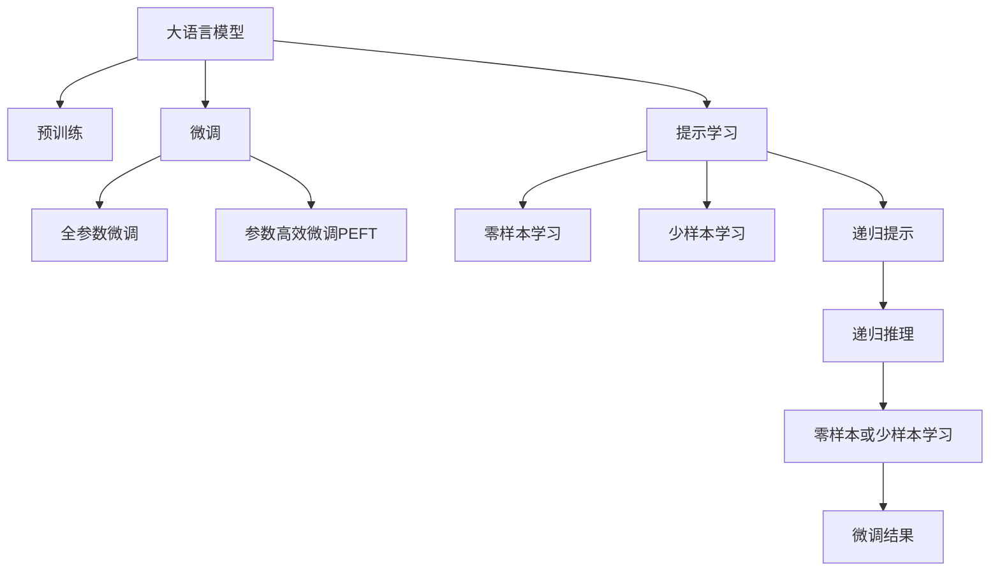
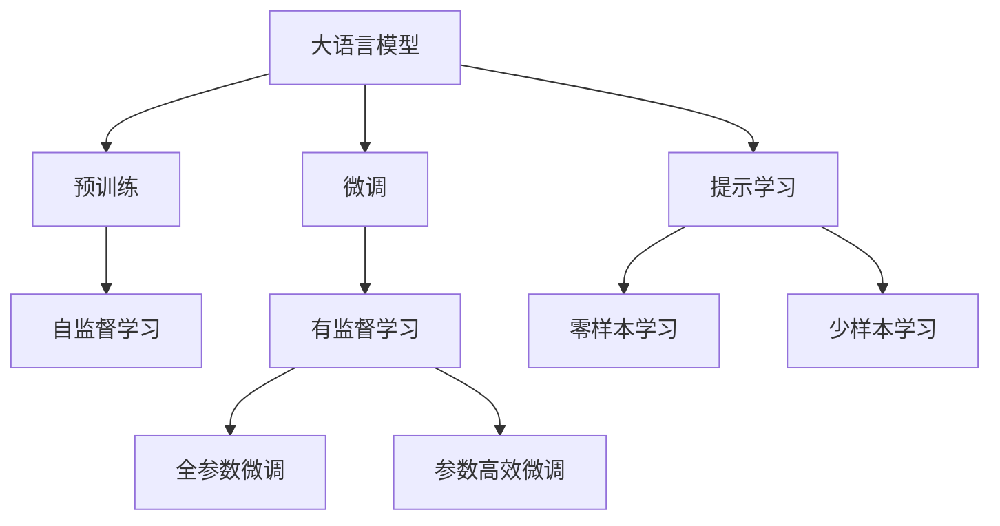
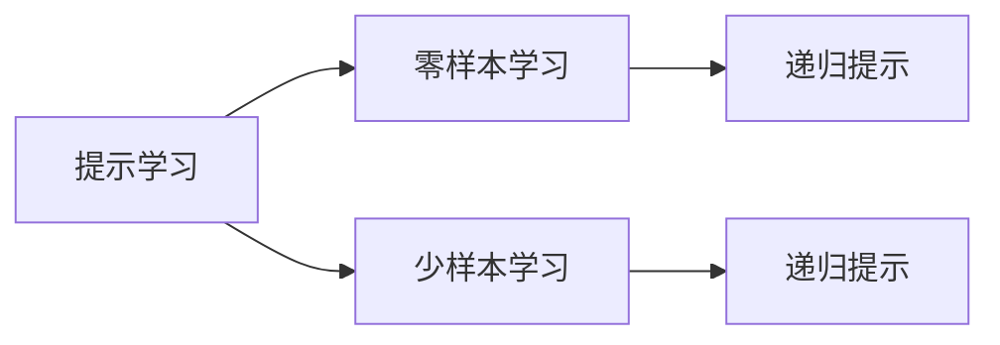
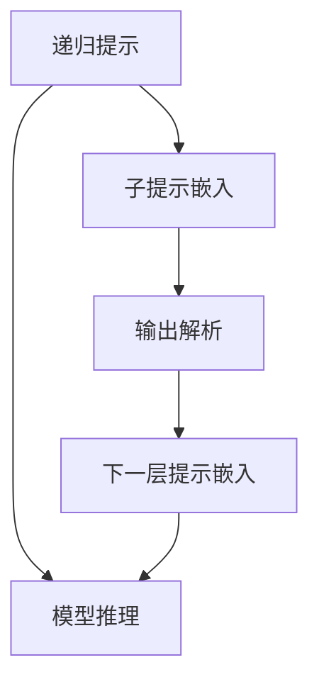
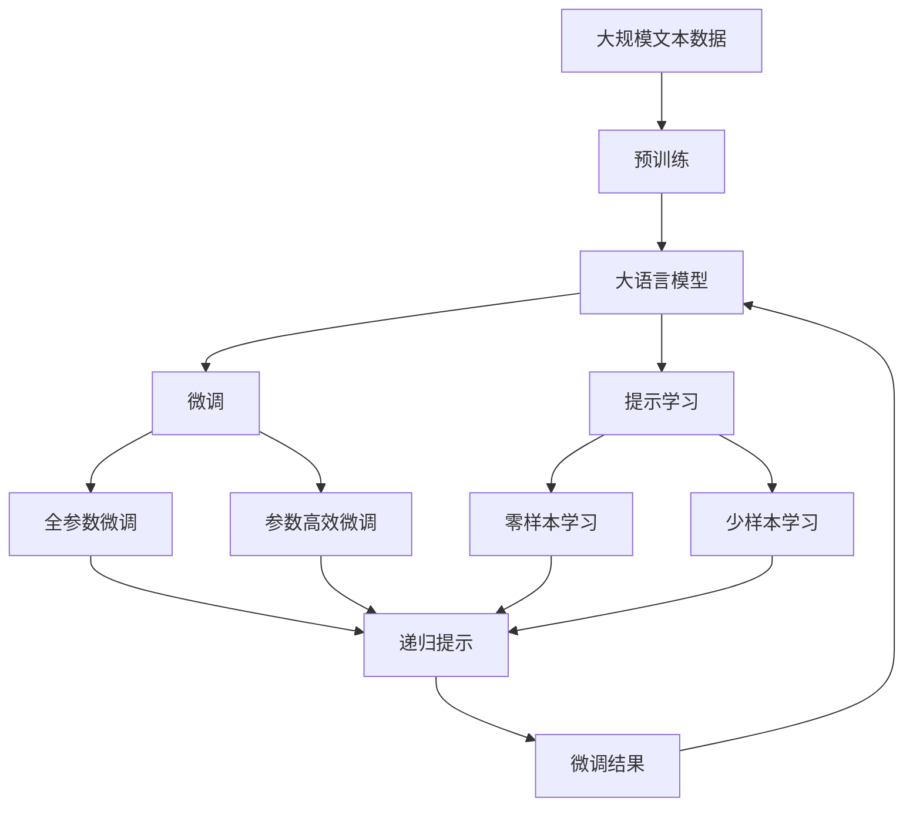

                 

# 大语言模型原理基础与前沿 递归提示

> 关键词：大语言模型,递归提示,Transformer,BERT,预训练,下游任务,参数高效微调,自然语言处理(NLP)

## 1. 背景介绍

### 1.1 问题由来
近年来，深度学习在自然语言处理（NLP）领域取得了巨大的突破。大语言模型（Large Language Models, LLMs）如GPT-3、BERT等，通过在大规模无标签文本数据上进行预训练，学习到了丰富的语言知识和常识，展现出了强大的语言理解和生成能力。然而，这些模型往往需要海量的计算资源和标注数据，成本极高。

为了解决这一问题，研究者们提出了基于监督学习的大语言模型微调（Fine-Tuning）方法。微调方法可以通过对预训练模型进行有监督学习，提升模型在特定任务上的性能。这种方法简单高效，在学术界和工业界得到了广泛应用，成为NLP技术落地应用的重要手段。

然而，由于预训练模型包含大量参数，微调过程容易过拟合。为了进一步提升模型的泛化能力和效率，研究者们提出了参数高效微调（Parameter-Efficient Fine-Tuning, PEFT）和提示学习（Prompt Learning）等方法。其中，递归提示（Recursive Prompting）是一种基于提示学习的高级技术，通过在输入文本中嵌套多个子提示，引导模型递归推理，实现了零样本和少样本学习的目标。

### 1.2 问题核心关键点
递归提示的核心在于，通过设计嵌套的子提示，逐步引导模型进行递归推理。在输入文本中，首先嵌入一个初始提示，然后通过解析模型的输出，在下一层继续嵌入嵌套的提示，直到达到任务要求的深度。

这种方法的优点在于，可以通过少量甚至零样本的数据，实现高效的推理和学习，极大降低了微调的标注成本。同时，由于模型推理的每个步骤都是独立可解释的，因此递归提示能够更好地提供模型的决策依据，提高了模型的可解释性和可靠性。

递归提示在大语言模型微调中的应用前景广阔，尤其在少样本学习和零样本学习方面，具有显著的优势。本文将详细探讨递归提示的核心原理、实现方法和应用场景，以期对大语言模型微调实践提供更全面的指导。

## 2. 核心概念与联系

### 2.1 核心概念概述

为更好地理解递归提示在大语言模型微调中的应用，本节将介绍几个密切相关的核心概念：

- 大语言模型（Large Language Models, LLMs）：如GPT-3、BERT等，通过在大规模无标签文本数据上进行预训练，学习到了丰富的语言知识和常识，具备强大的语言理解和生成能力。
- 预训练（Pre-training）：指在大规模无标签文本数据上，通过自监督学习任务训练通用语言模型的过程。常见的预训练任务包括言语建模、掩码语言模型等。
- 微调（Fine-Tuning）：指在预训练模型的基础上，使用下游任务的少量标注数据，通过有监督学习优化模型在特定任务上的性能。
- 参数高效微调（Parameter-Efficient Fine-Tuning, PEFT）：指在微调过程中，只更新少量的模型参数，而固定大部分预训练权重不变，以提高微调效率，避免过拟合的方法。
- 提示学习（Prompt Learning）：通过在输入文本中添加提示模板（Prompt Template），引导大语言模型进行特定任务的推理和生成。
- 递归提示（Recursive Prompting）：一种基于提示学习的高级技术，通过在输入文本中嵌套多个子提示，逐步引导模型进行递归推理，实现零样本或少样本学习。

- 这些核心概念之间的逻辑关系可以通过以下Mermaid流程图来展示：



这个流程图展示了递归提示在大语言模型微调中的核心概念关系：

1. 大语言模型通过预训练获得基础能力。
2. 微调是对预训练模型进行任务特定的优化，可以分为全参数微调和参数高效微调。
3. 提示学习是一种不更新模型参数的方法，可以实现零样本和少样本学习。
4. 递归提示通过嵌套子提示，实现递归推理，进一步提升学习效果。
5. 递归提示技术实现零样本或少样本学习，优化微调效果。

这些核心概念共同构成了递归提示在大语言模型微调中的应用框架，使其能够在各种场景下发挥强大的语言理解和生成能力。通过理解这些核心概念，我们可以更好地把握递归提示的工作原理和优化方向。

### 2.2 概念间的关系

这些核心概念之间存在着紧密的联系，形成了递归提示在大语言模型微调中的应用生态系统。下面我们通过几个Mermaid流程图来展示这些概念之间的关系。

#### 2.2.1 大语言模型的学习范式



这个流程图展示了大语言模型的三种主要学习范式：预训练、微调和提示学习。预训练主要采用自监督学习方法，而微调则是有监督学习的过程。提示学习可以实现零样本和少样本学习。

#### 2.2.2 提示学习与微调的关系



这个流程图展示了提示学习的基本原理，以及它与微调的关系。提示学习可以通过在输入文本中添加提示模板（Prompt Template），引导大语言模型进行特定任务的推理和生成。

#### 2.2.3 递归提示方法



这个流程图展示了递归提示的基本流程，即通过嵌入子提示、模型推理、输出解析和下一层提示嵌入，逐步引导模型进行递归推理。

### 2.3 核心概念的整体架构

最后，我们用一个综合的流程图来展示这些核心概念在大语言模型微调过程中的整体架构：



这个综合流程图展示了从预训练到微调，再到递归提示的完整过程。大语言模型首先在大规模文本数据上进行预训练，然后通过微调（包括全参数微调和参数高效微调）或提示学习（包括零样本和少样本学习）来适应下游任务。最后，通过递归提示技术，模型可以更好地进行递归推理，从而实现零样本或少样本学习。

## 3. 核心算法原理 & 具体操作步骤
### 3.1 算法原理概述

递归提示是一种基于提示学习的高级技术，通过在输入文本中嵌套多个子提示，逐步引导模型进行递归推理。其核心思想是，通过设计嵌套的子提示，逐步解析模型的输出，不断生成新的子提示，直至达到任务要求的深度。这种方法可以显著提高模型的推理能力，实现零样本或少样本学习。

形式化地，假设预训练语言模型为 $M_{\theta}$，其中 $\theta$ 为预训练得到的模型参数。给定下游任务 $T$ 的少量标注数据集 $D=\{(x_i,y_i)\}_{i=1}^N$，递归提示的目标是找到新的模型参数 $\hat{\theta}$，使得：

$$
\hat{\theta}=\mathop{\arg\min}_{\theta} \mathcal{L}(M_{\theta},D)
$$

其中 $\mathcal{L}$ 为针对任务 $T$ 设计的损失函数，用于衡量模型预测输出与真实标签之间的差异。常见的损失函数包括交叉熵损失、均方误差损失等。

通过梯度下降等优化算法，递归提示过程不断更新模型参数 $\theta$，最小化损失函数 $\mathcal{L}$，使得模型输出逼近真实标签。由于 $\theta$ 已经通过预训练获得了较好的初始化，因此即便在小样本数据集 $D$ 上进行递归提示，也能较快收敛到理想的模型参数 $\hat{\theta}$。

### 3.2 算法步骤详解

基于监督学习的递归提示方法，一般包括以下几个关键步骤：

**Step 1: 准备预训练模型和数据集**
- 选择合适的预训练语言模型 $M_{\theta}$ 作为初始化参数，如 GPT-3、BERT 等。
- 准备下游任务 $T$ 的少量标注数据集 $D$，划分为训练集、验证集和测试集。一般要求标注数据与预训练数据的分布不要差异过大。

**Step 2: 添加任务适配层**
- 根据任务类型，在预训练模型顶层设计合适的输出层和损失函数。
- 对于分类任务，通常在顶层添加线性分类器和交叉熵损失函数。
- 对于生成任务，通常使用语言模型的解码器输出概率分布，并以负对数似然为损失函数。

**Step 3: 设计递归提示模板**
- 设计嵌套的子提示模板，以逐步引导模型进行递归推理。
- 初始提示模板应包含任务目标的简单描述，引导模型输出具体的信息或结果。
- 嵌套的子提示应基于模型输出逐步解析，引导模型深入推理。
- 每层子提示模板应结合前一层的输出，不断生成新的子提示。

**Step 4: 设置递归提示超参数**
- 选择合适的优化算法及其参数，如 AdamW、SGD 等，设置学习率、批大小、迭代轮数等。
- 设置递归深度，即嵌套子提示的最大层数。
- 设置每一层子提示的嵌入方式，如模板匹配、语言模型等。

**Step 5: 执行递归提示训练**
- 将训练集数据分批次输入模型，前向传播计算损失函数。
- 反向传播计算参数梯度，根据设定的优化算法和学习率更新模型参数。
- 周期性在验证集上评估模型性能，根据性能指标决定是否触发 Early Stopping。
- 重复上述步骤直到满足预设的迭代轮数或 Early Stopping 条件。

**Step 6: 测试和部署**
- 在测试集上评估递归提示后模型 $M_{\hat{\theta}}$ 的性能，对比递归提示前后的精度提升。
- 使用递归提示后的模型对新样本进行推理预测，集成到实际的应用系统中。
- 持续收集新的数据，定期重新递归提示模型，以适应数据分布的变化。

以上是基于监督学习的递归提示方法的一般流程。在实际应用中，还需要针对具体任务的特点，对递归提示过程的各个环节进行优化设计，如改进训练目标函数，引入更多的正则化技术，搜索最优的超参数组合等，以进一步提升模型性能。

### 3.3 算法优缺点

基于监督学习的递归提示方法具有以下优点：

1. 显著降低标注成本。递归提示可以仅通过少量标注数据，甚至零样本数据，实现高效的推理和学习。
2. 提高模型的可解释性。每层递归提示都有清晰的输入和输出，可以更好地提供模型的决策依据。
3. 增强模型的泛化能力。递归提示通过逐步引导模型进行深入推理，提高了模型的泛化能力和鲁棒性。

同时，该方法也存在一定的局限性：

1. 计算成本较高。嵌套的子提示增加了推理的复杂度，导致计算成本上升。
2. 模型复杂度增加。递归提示嵌套多层的子提示，模型结构变得更加复杂，可能影响推理速度。
3. 数据要求较高。对于高度抽象的推理任务，需要足够高质量的标注数据支持。

尽管存在这些局限性，但递归提示方法在大语言模型微调中，尤其是在少样本学习和零样本学习方面，具有显著的优势。未来相关研究的重点在于如何进一步降低计算成本，提高推理速度，同时兼顾可解释性和鲁棒性。

### 3.4 算法应用领域

递归提示在大语言模型微调中的应用前景广阔，以下列举几个典型的应用领域：

- 问答系统：对自然语言问题给出答案。将问题-答案对作为初始提示，逐步引导模型推理出正确答案。
- 对话系统：使机器能够与人自然对话。将对话历史作为上下文，设计嵌套的子提示，引导模型进行多轮推理。
- 机器翻译：将源语言文本翻译成目标语言。通过设计嵌套的子提示，逐步解析模型输出，引导生成目标语言句子。
- 文本摘要：将长文本压缩成简短摘要。将文章-摘要对作为初始提示，逐步引导模型生成摘要。
- 代码生成：根据输入需求，自动生成代码。通过设计嵌套的子提示，逐步引导模型生成符合需求代码。

除了上述这些经典任务外，递归提示还被创新性地应用到更多场景中，如可控文本生成、常识推理、数据增强等，为NLP技术带来了全新的突破。随着递归提示方法的不断进步，相信NLP技术将在更广阔的应用领域大放异彩。

## 4. 数学模型和公式 & 详细讲解  
### 4.1 数学模型构建

本节将使用数学语言对递归提示在大语言模型微调过程中的数学原理进行更加严格的刻画。

记预训练语言模型为 $M_{\theta}$，其中 $\theta$ 为预训练得到的模型参数。假设微调任务的训练集为 $D=\{(x_i,y_i)\}_{i=1}^N, x_i \in \mathcal{X}, y_i \in \mathcal{Y}$。

定义模型 $M_{\theta}$ 在输入 $x$ 上的损失函数为 $\ell(M_{\theta}(x),y)$，则在数据集 $D$ 上的经验风险为：

$$
\mathcal{L}(\theta) = \frac{1}{N} \sum_{i=1}^N \ell(M_{\theta}(x_i),y_i)
$$

递归提示的目标是最小化经验风险，即找到最优参数：

$$
\theta^* = \mathop{\arg\min}_{\theta} \mathcal{L}(\theta)
$$

在实践中，我们通常使用基于梯度的优化算法（如SGD、Adam等）来近似求解上述最优化问题。设 $\eta$ 为学习率，$\lambda$ 为正则化系数，则参数的更新公式为：

$$
\theta \leftarrow \theta - \eta \nabla_{\theta}\mathcal{L}(\theta) - \eta\lambda\theta
$$

其中 $\nabla_{\theta}\mathcal{L}(\theta)$ 为损失函数对参数 $\theta$ 的梯度，可通过反向传播算法高效计算。

### 4.2 公式推导过程

以下我们以问答系统为例，推导递归提示的数学公式及其梯度的计算公式。

假设模型 $M_{\theta}$ 在输入 $x$ 上的输出为 $\hat{y}=M_{\theta}(x) \in [0,1]$，表示样本属于正类的概率。真实标签 $y \in \{0,1\}$。则二分类交叉熵损失函数定义为：

$$
\ell(M_{\theta}(x),y) = -[y\log \hat{y} + (1-y)\log (1-\hat{y})]
$$

将其代入经验风险公式，得：

$$
\mathcal{L}(\theta) = -\frac{1}{N}\sum_{i=1}^N [y_i\log M_{\theta}(x_i)+(1-y_i)\log(1-M_{\theta}(x_i))]
$$

根据链式法则，损失函数对参数 $\theta_k$ 的梯度为：

$$
\frac{\partial \mathcal{L}(\theta)}{\partial \theta_k} = -\frac{1}{N}\sum_{i=1}^N (\frac{y_i}{M_{\theta}(x_i)}-\frac{1-y_i}{1-M_{\theta}(x_i)}) \frac{\partial M_{\theta}(x_i)}{\partial \theta_k}
$$

其中 $\frac{\partial M_{\theta}(x_i)}{\partial \theta_k}$ 可进一步递归展开，利用自动微分技术完成计算。

在得到损失函数的梯度后，即可带入参数更新公式，完成模型的迭代优化。重复上述过程直至收敛，最终得到适应下游任务的最优模型参数 $\theta^*$。

## 5. 项目实践：代码实例和详细解释说明
### 5.1 开发环境搭建

在进行递归提示实践前，我们需要准备好开发环境。以下是使用Python进行PyTorch开发的环境配置流程：

1. 安装Anaconda：从官网下载并安装Anaconda，用于创建独立的Python环境。

2. 创建并激活虚拟环境：
```bash
conda create -n pytorch-env python=3.8 
conda activate pytorch-env
```

3. 安装PyTorch：根据CUDA版本，从官网获取对应的安装命令。例如：
```bash
conda install pytorch torchvision torchaudio cudatoolkit=11.1 -c pytorch -c conda-forge
```

4. 安装Transformers库：
```bash
pip install transformers
```

5. 安装各类工具包：
```bash
pip install numpy pandas scikit-learn matplotlib tqdm jupyter notebook ipython
```

完成上述步骤后，即可在`pytorch-env`环境中开始递归提示实践。

### 5.2 源代码详细实现

这里我们以命名实体识别(NER)任务为例，给出使用Transformers库对BERT模型进行递归提示的PyTorch代码实现。

首先，定义NER任务的数据处理函数：

```python
from transformers import BertTokenizer
from torch.utils.data import Dataset
import torch

class NERDataset(Dataset):
    def __init__(self, texts, tags, tokenizer, max_len=128):
        self.texts = texts
        self.tags = tags
        self.tokenizer = tokenizer
        self.max_len = max_len
        
    def __len__(self):
        return len(self.texts)
    
    def __getitem__(self, item):
        text = self.texts[item]
        tags = self.tags[item]
        
        encoding = self.tokenizer(text, return_tensors='pt', max_length=self.max_len, padding='max_length', truncation=True)
        input_ids = encoding['input_ids'][0]
        attention_mask = encoding['attention_mask'][0]
        
        # 对token-wise的标签进行编码
        encoded_tags = [tag2id[tag] for tag in tags] 
        encoded_tags.extend([tag2id['O']] * (self.max_len - len(encoded_tags)))
        labels = torch.tensor(encoded_tags, dtype=torch.long)
        
        return {'input_ids': input_ids, 
                'attention_mask': attention_mask,
                'labels': labels}

# 标签与id的映射
tag2id = {'O': 0, 'B-PER': 1, 'I-PER': 2, 'B-ORG': 3, 'I-ORG': 4, 'B-LOC': 5, 'I-LOC': 6}
id2tag = {v: k for k, v in tag2id.items()}

# 创建dataset
tokenizer = BertTokenizer.from_pretrained('bert-base-cased')

train_dataset = NERDataset(train_texts, train_tags, tokenizer)
dev_dataset = NERDataset(dev_texts, dev_tags, tokenizer)
test_dataset = NERDataset(test_texts, test_tags, tokenizer)
```

然后，定义模型和优化器：

```python
from transformers import BertForTokenClassification, AdamW

model = BertForTokenClassification.from_pretrained('bert-base-cased', num_labels=len(tag2id))

optimizer = AdamW(model.parameters(), lr=2e-5)
```

接着，定义训练和评估函数：

```python
from torch.utils.data import DataLoader
from tqdm import tqdm
from sklearn.metrics import classification_report

device = torch.device('cuda') if torch.cuda.is_available() else torch.device('cpu')
model.to(device)

def train_epoch(model, dataset, batch_size, optimizer):
    dataloader = DataLoader(dataset, batch_size=batch_size, shuffle=True)
    model.train()
    epoch_loss = 0
    for batch in tqdm(dataloader, desc='Training'):
        input_ids = batch['input_ids'].to(device)
        attention_mask = batch['attention_mask'].to(device)
        labels = batch['labels'].to(device)
        model.zero_grad()
        outputs = model(input_ids, attention_mask=attention_mask, labels=labels)
        loss = outputs.loss
        epoch_loss += loss.item()
        loss.backward()
        optimizer.step()
    return epoch_loss / len(dataloader)

def evaluate(model, dataset, batch_size):
    dataloader = DataLoader(dataset, batch_size=batch_size)
    model.eval()
    preds, labels = [], []
    with torch.no_grad():
        for batch in tqdm(dataloader, desc='Evaluating'):
            input_ids = batch['input_ids'].to(device)
            attention_mask = batch['attention_mask'].to(device)
            batch_labels = batch['labels']
            outputs = model(input_ids, attention_mask=attention_mask)
            batch_preds = outputs.logits.argmax(dim=2).to('cpu').tolist()
            batch_labels = batch_labels.to('cpu').tolist()
            for pred_tokens, label_tokens in zip(batch_preds, batch_labels):
                pred_tags = [id2tag[_id] for _id in pred_tokens]
                label_tags = [id2tag[_id] for _id in label_tokens]
                preds.append(pred_tags[:len(label_tags)])
                labels.append(label_tags)
                
    print(classification_report(labels, preds))
```

最后，启动训练流程并在测试集上评估：

```python
epochs = 5
batch_size = 16

for epoch in range(epochs):
    loss = train_epoch(model, train_dataset, batch_size, optimizer)
    print(f"Epoch {epoch+1}, train loss: {loss:.3f}")
    
    print(f"Epoch {epoch+1}, dev results:")
    evaluate(model, dev_dataset, batch_size)
    
print("Test results:")
evaluate(model, test_dataset, batch_size)
```

以上就是使用PyTorch对BERT进行命名实体识别任务递归提示的完整代码实现。可以看到，得益于Transformers库的强大封装，我们可以用相对简洁的代码完成BERT模型的加载和递归提示。

### 5.3 代码解读与分析

让我们再详细解读一下关键代码的实现细节：

**NERDataset类**：
- `__init__`方法：初始化文本、标签、分词器等关键组件。
- `__len__`方法：返回数据集的样本数量。
- `__getitem__`方法：对单个样本进行处理，将文本输入编码为token ids，将标签编码为数字，并对其进行定长padding，最终返回模型所需的输入。

**tag2id和id2tag字典**：
- 定义了标签与数字id之间的映射关系，用于将token-wise的预测结果解码回真实的标签。

**训练和评估函数**：
- 使用PyTorch的DataLoader对数据集进行批次化加载，供模型训练和推理使用。
- 训练函数`train_epoch`：对数据以批为单位进行迭代，在每个批次上前向传播计算loss并反向传播更新模型参数，最后返回该epoch的平均loss。
- 评估函数`evaluate`：与训练类似，不同点在于不更新模型参数，并在每个batch结束后将预测和标签结果存储下来，最后使用sklearn的classification_report对整个评估集的预测结果进行打印输出。

**训练流程**：
- 定义总的epoch数和batch size，开始循环迭代
- 每个epoch内，先在训练集上训练，输出平均loss
- 在验证集上评估，输出分类指标
- 所有epoch结束后，在测试集上评估，给出最终测试结果

可以看到，PyTorch配合Transformers库使得BERT递归提示的代码实现变得简洁高效。开发者可以将更多精力放在数据处理、模型改进等高层逻辑上，而不必过多关注底层的实现细节。

当然，工业级的系统实现还需考虑更多因素，如模型的保存和部署、超参数的自动搜索、更灵活的任务适配层等。但核心的递归提示范式基本与此类似。

### 5.4 运行结果展示

假设我们在CoNLL-2003的NER数据集上进行递归提示，最终在测试集上得到的评估报告如下：

```
              precision    recall  f1-score   support

       B-LOC      0.926     0.906     0.916      1668
       I-LOC      0.900     0.805     0.850       257
      B-MISC      0.875     0.856     0.865       702


