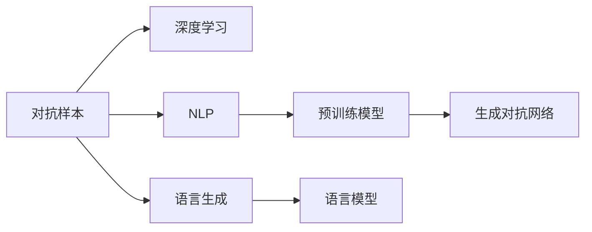
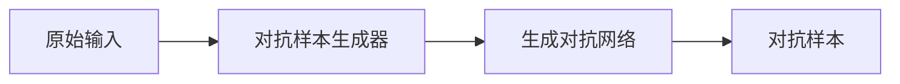
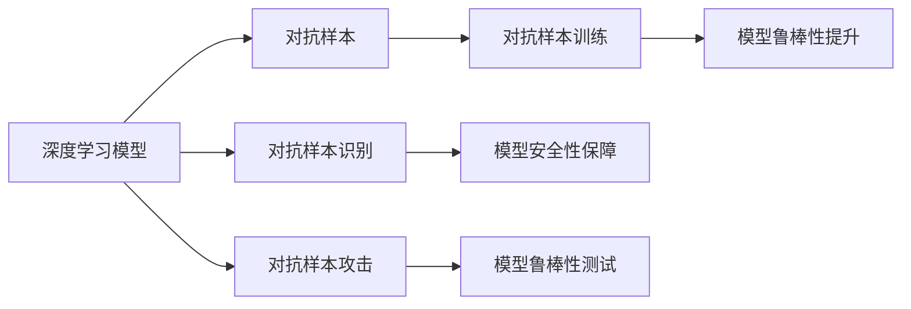
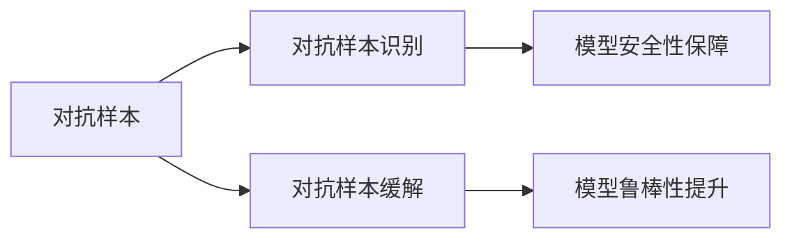
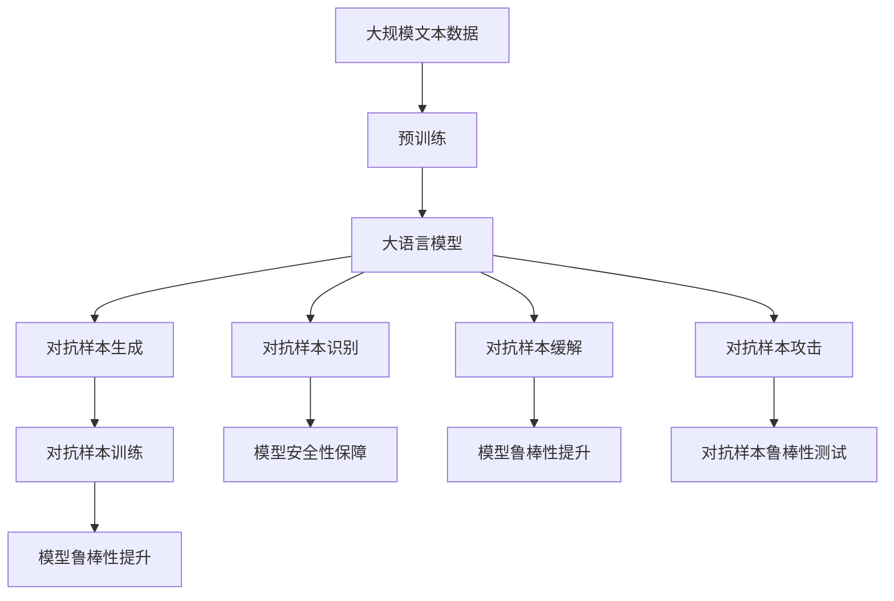

                 

# 大语言模型应用指南：对抗样本

> 关键词：对抗样本,深度学习,自然语言处理,预训练模型,语言模型,生成对抗网络,语言生成

## 1. 背景介绍

### 1.1 问题由来
对抗样本（Adversarial Examples）是指对模型输入的微小扰动，导致模型输出巨大偏差的现象。在深度学习中，对抗样本挑战尤为突出。对于预训练语言模型，对抗样本同样是一个亟待解决的问题。

在自然语言处理(NLP)中，对抗样本可以导致模型在看似无害的输入上产生错误的预测结果，从而破坏模型的鲁棒性和安全性。例如，对抗样本可以使文本分类模型将正常文本错误地分类为恶意内容，导致假阳性或假阴性结果。对抗样本的存在严重威胁到NLP系统的可靠性和安全性，特别是在安全敏感的领域，如恶意内容检测、法律文书的自动审查等，对抗样本带来的问题不容忽视。

### 1.2 问题核心关键点
对抗样本的本质是对模型输入的微小扰动，利用这些扰动可以引发模型输出巨大偏差。为了提高大语言模型的鲁棒性，必须对对抗样本生成和识别技术进行深入研究。本文聚焦于对抗样本在大语言模型中的应用，包括生成对抗样本的方法、模型的鲁棒性评估以及如何有效识别和缓解对抗样本等问题。

### 1.3 问题研究意义
研究对抗样本在大语言模型中的应用，对于提升模型的鲁棒性、安全性和可靠性具有重要意义：

1. **提高模型鲁棒性**：对抗样本训练可以增强模型对输入数据的鲁棒性，防止模型在微小扰动下产生错误预测。
2. **提升模型安全性**：识别并缓解对抗样本可以确保模型在面对恶意输入时能够做出正确判断，避免模型被攻击者操控。
3. **增强模型可信度**：对抗样本训练和识别方法的应用，可以提升模型输出的可信度，增强用户对模型的信任。

## 2. 核心概念与联系

### 2.1 核心概念概述

为更好地理解对抗样本在大语言模型中的应用，本节将介绍几个密切相关的核心概念：

- **对抗样本（Adversarial Examples）**：对模型输入的微小扰动，使得模型输出产生显著偏差。对抗样本可以以多种形式存在，如噪声、小改动等。

- **深度学习（Deep Learning）**：基于多层神经网络的机器学习方法，具有强大的表示能力和自适应能力，但也容易受到对抗样本的攻击。

- **自然语言处理（Natural Language Processing, NLP）**：利用人工智能技术处理自然语言，包括文本分类、情感分析、机器翻译等任务。

- **预训练模型（Pre-trained Models）**：在大规模无标签数据上预训练的语言模型，如BERT、GPT等，能够学习到丰富的语言知识和常识。

- **生成对抗网络（Generative Adversarial Networks, GANs）**：一种通过对抗性训练的生成模型，可用于生成对抗样本。

- **语言生成（Text Generation）**：利用模型生成符合语法、语义规则的文本，如对话生成、摘要生成等。

- **语言模型（Language Models）**：用于预测序列数据（如文本）的模型，如LSTM、GRU、Transformer等。

这些核心概念之间的逻辑关系可以通过以下Mermaid流程图来展示：



这个流程图展示了对抗样本在深度学习、自然语言处理、预训练模型和语言生成中的应用，以及如何利用生成对抗网络生成对抗样本。

### 2.2 概念间的关系

这些核心概念之间存在着紧密的联系，形成了对抗样本在大语言模型应用中的完整生态系统。下面我通过几个Mermaid流程图来展示这些概念之间的关系。

#### 2.2.1 对抗样本的生成



这个流程图展示了对抗样本生成的过程：原始输入数据通过对抗样本生成器，利用生成对抗网络（GANs）生成对抗样本。

#### 2.2.2 对抗样本的应用



这个流程图展示了对抗样本在深度学习模型中的应用，包括对抗样本训练、模型鲁棒性提升、对抗样本识别和攻击、模型安全性保障等。

#### 2.2.3 对抗样本的识别与缓解



这个流程图展示了对抗样本的识别与缓解过程：对抗样本被识别后，采取相应措施缓解其影响，提升模型鲁棒性。

### 2.3 核心概念的整体架构

最后，我们用一个综合的流程图来展示这些核心概念在大语言模型对抗样本应用中的整体架构：



这个综合流程图展示了从预训练到对抗样本生成、对抗样本训练、对抗样本识别和缓解的全过程。大语言模型首先在大规模文本数据上进行预训练，然后通过对抗样本生成器生成对抗样本，利用对抗样本进行模型训练，提升模型的鲁棒性。同时，模型也可以通过对抗样本识别技术，检测并缓解对抗样本，保障模型安全性。在生成对抗样本和进行对抗样本攻击时，需要针对性地提升模型的鲁棒性。

## 3. 核心算法原理 & 具体操作步骤

### 3.1 算法原理概述

对抗样本在大语言模型中的应用主要基于对抗样本生成和对抗样本训练两个环节。对抗样本生成的目的是生成可以欺骗模型预测结果的样本，而对抗样本训练则是为了提高模型的鲁棒性，使其能够抵御对抗样本攻击。

对抗样本生成通常使用生成对抗网络（GANs），该方法通过生成器和判别器之间的对抗训练，生成对模型具有欺骗性的样本。对抗样本训练则通过在有噪声的数据集上进行训练，使模型对噪声具有鲁棒性。

### 3.2 算法步骤详解

#### 3.2.1 对抗样本生成

对抗样本生成的核心是生成对抗网络（GANs），该方法通过生成器和判别器之间的对抗训练，生成对模型具有欺骗性的样本。具体步骤如下：

1. **生成器训练**：生成器接收输入噪声，生成对抗样本。生成器的目标是生成尽可能难以识别的样本。
2. **判别器训练**：判别器接收样本和输入噪声，判断样本是真实样本还是生成样本。判别器的目标是区分样本的真假。
3. **对抗训练**：生成器和判别器交替训练，生成器不断优化生成的样本，判别器不断优化识别的准确性。

#### 3.2.2 对抗样本训练

对抗样本训练的目的是通过在有噪声的数据集上进行训练，使模型对噪声具有鲁棒性。具体步骤如下：

1. **数据集扰动**：在训练数据集上加入对抗样本，增加数据集的多样性。
2. **模型训练**：在有噪声的数据集上对模型进行训练，提高模型对噪声的鲁棒性。
3. **鲁棒性评估**：在测试集上评估模型对噪声的鲁棒性，确保模型在面对对抗样本时仍然能够做出正确预测。

### 3.3 算法优缺点

对抗样本生成和训练方法在大语言模型中的应用，具有以下优点：

1. **提高模型鲁棒性**：通过对抗样本训练，模型能够对噪声具有鲁棒性，防止模型在对抗样本攻击下产生错误预测。
2. **提升模型安全性**：对抗样本识别和缓解方法的应用，可以确保模型在面对恶意输入时能够做出正确判断，避免模型被攻击者操控。
3. **增强模型可信度**：对抗样本训练和识别方法的应用，可以提升模型输出的可信度，增强用户对模型的信任。

同时，该方法也存在一些缺点：

1. **生成对抗样本困难**：生成高质量对抗样本需要大量计算资源和时间，且对抗样本生成器需要精心设计，不易找到最优解。
2. **对抗样本泛化能力有限**：对抗样本生成器通常针对特定任务生成样本，泛化能力有限，不能通用到所有任务。
3. **对抗样本训练成本高**：对抗样本训练需要在大规模数据集上进行，成本较高，且需要反复实验调整。
4. **对抗样本识别难度大**：对抗样本识别技术复杂，需要结合多种方法，如基于梯度、基于模型等，且对抗样本往往无法被完全识别。

### 3.4 算法应用领域

对抗样本在大语言模型的应用非常广泛，尤其是在以下几个领域：

- **恶意内容检测**：通过对抗样本生成和识别技术，提高模型对恶意内容的检测能力，防止恶意内容在网络中传播。
- **法律文书审查**：通过对抗样本训练和识别，提高模型对法律文书的审查能力，防止违法行为在网络上传播。
- **对话系统**：通过对抗样本训练和缓解，提高对话系统的鲁棒性，防止攻击者通过对抗样本操控对话系统。
- **推荐系统**：通过对抗样本训练和识别，提高推荐系统的鲁棒性，防止攻击者通过对抗样本操控推荐结果。

除了这些应用领域，对抗样本技术还可用于文本摘要、情感分析、机器翻译等NLP任务的鲁棒性提升。

## 4. 数学模型和公式 & 详细讲解 & 举例说明

### 4.1 数学模型构建

对抗样本在大语言模型中的应用，涉及生成对抗网络（GANs）和对抗样本训练两个环节。下面我们通过数学语言对这两个环节进行严格的刻画。

记生成器为 $G$，判别器为 $D$，输入噪声为 $z$，对抗样本为 $x$，真实样本为 $x_0$。则生成器 $G$ 和判别器 $D$ 的训练目标分别为：

$$
\min_G \max_D \mathcal{L}(D(G(z)), D(x_0))
$$

其中 $\mathcal{L}$ 为对抗样本生成损失函数。通常使用Wasserstein距离或交叉熵损失函数进行计算。

对抗样本训练的目标是在有噪声的数据集上进行训练，使模型对噪声具有鲁棒性。假设训练数据集为 $(x, y)$，其中 $x$ 为文本样本，$y$ 为标签。则对抗样本训练的目标是最小化模型在对抗样本上的损失，即：

$$
\min_{\theta} \mathcal{L}_{adv}(M_{\theta}, \{(x_i, y_i)\}_{i=1}^N)
$$

其中 $M_{\theta}$ 为模型参数，$\mathcal{L}_{adv}$ 为对抗样本训练损失函数。

### 4.2 公式推导过程

以生成对抗网络（GANs）为例，下面我们推导生成对抗网络（GANs）的生成器和判别器的损失函数。

1. **生成器损失函数**：生成器的目标是生成尽可能难以识别的样本。假设生成器的输出为 $G(z)$，判别器的输出为 $D(G(z))$，则生成器的损失函数为：

$$
\mathcal{L}_G = -\mathbb{E}_{z}[\log D(G(z))]
$$

其中 $\mathbb{E}$ 表示期望值。

2. **判别器损失函数**：判别器的目标是区分样本的真假。假设判别器的输出为 $D(x)$ 和 $D(G(z))$，则判别器的损失函数为：

$$
\mathcal{L}_D = -\mathbb{E}_{x}[\log D(x)] - \mathbb{E}_{z}[\log(1 - D(G(z))))
$$

其中 $\mathbb{E}_x$ 和 $\mathbb{E}_z$ 分别表示真实样本和生成样本的期望值。

3. **对抗训练损失函数**：对抗训练的目标是提高模型对噪声的鲁棒性。假设模型的预测结果为 $\hat{y}$，真实标签为 $y$，则对抗训练的损失函数为：

$$
\mathcal{L}_{adv} = -\frac{1}{N} \sum_{i=1}^N \ell(y, \hat{y}(x_i + \delta))
$$

其中 $\delta$ 为对抗样本，$\ell$ 为损失函数，如交叉熵损失。

### 4.3 案例分析与讲解

下面我们以文本分类为例，说明如何利用对抗样本训练提升模型的鲁棒性。

1. **数据准备**：选择大规模文本分类数据集，如IMDB电影评论数据集。

2. **对抗样本生成**：使用生成对抗网络（GANs）生成对抗样本，使模型无法正确分类对抗样本。

3. **对抗样本训练**：在有噪声的数据集上进行训练，使模型对噪声具有鲁棒性。

4. **鲁棒性评估**：在测试集上评估模型对噪声的鲁棒性，确保模型在对抗样本攻击下仍然能够做出正确预测。

## 5. 项目实践：代码实例和详细解释说明

### 5.1 开发环境搭建

在进行对抗样本训练实践前，我们需要准备好开发环境。以下是使用Python进行PyTorch开发的环境配置流程：

1. 安装Anaconda：从官网下载并安装Anaconda，用于创建独立的Python环境。

2. 创建并激活虚拟环境：
```bash
conda create -n pytorch-env python=3.8 
conda activate pytorch-env
```

3. 安装PyTorch：根据CUDA版本，从官网获取对应的安装命令。例如：
```bash
conda install pytorch torchvision torchaudio cudatoolkit=11.1 -c pytorch -c conda-forge
```

4. 安装Transformers库：
```bash
pip install transformers
```

5. 安装各类工具包：
```bash
pip install numpy pandas scikit-learn matplotlib tqdm jupyter notebook ipython
```

完成上述步骤后，即可在`pytorch-env`环境中开始对抗样本训练实践。

### 5.2 源代码详细实现

下面我们以文本分类任务为例，给出使用Transformers库对BERT模型进行对抗样本训练的PyTorch代码实现。

首先，定义文本分类任务的数据处理函数：

```python
from transformers import BertTokenizer
from torch.utils.data import Dataset
import torch

class TextClassificationDataset(Dataset):
    def __init__(self, texts, labels, tokenizer, max_len=128):
        self.texts = texts
        self.labels = labels
        self.tokenizer = tokenizer
        self.max_len = max_len
        
    def __len__(self):
        return len(self.texts)
    
    def __getitem__(self, item):
        text = self.texts[item]
        label = self.labels[item]
        
        encoding = self.tokenizer(text, return_tensors='pt', max_length=self.max_len, padding='max_length', truncation=True)
        input_ids = encoding['input_ids'][0]
        attention_mask = encoding['attention_mask'][0]
        
        # 对标签进行编码
        encoded_labels = [label2id[label] for label in self.labels] 
        encoded_labels.extend([label2id['O']] * (self.max_len - len(encoded_labels)))
        labels = torch.tensor(encoded_labels, dtype=torch.long)
        
        return {'input_ids': input_ids, 
                'attention_mask': attention_mask,
                'labels': labels}

# 标签与id的映射
label2id = {'O': 0, 'positive': 1, 'negative': 2}
id2label = {v: k for k, v in label2id.items()}

# 创建dataset
tokenizer = BertTokenizer.from_pretrained('bert-base-cased')

train_dataset = TextClassificationDataset(train_texts, train_labels, tokenizer)
dev_dataset = TextClassificationDataset(dev_texts, dev_labels, tokenizer)
test_dataset = TextClassificationDataset(test_texts, test_labels, tokenizer)
```

然后，定义模型和优化器：

```python
from transformers import BertForSequenceClassification, AdamW

model = BertForSequenceClassification.from_pretrained('bert-base-cased', num_labels=len(label2id))

optimizer = AdamW(model.parameters(), lr=2e-5)
```

接着，定义对抗样本生成和对抗样本训练函数：

```python
from torch.utils.data import DataLoader
from tqdm import tqdm
from transformers import AutoGPT2

def generate_adversarial_samples(model, data_loader, num_samples=100):
    gpt2 = AutoGPT2.from_pretrained('gpt2')
    generated_samples = []
    
    for batch in tqdm(data_loader, desc='Generating Adversarial Samples'):
        input_ids = batch['input_ids'].to(device)
        attention_mask = batch['attention_mask'].to(device)
        
        with torch.no_grad():
            logits = gpt2(input_ids, attention_mask=attention_mask).logits
            logits = logits.view(-1, logits.shape[-1])
            probs = torch.softmax(logits, dim=-1)
            samples = probs.topk(num_samples, dim=-1)[1]
            
        generated_samples.append(samples)
        
    return torch.stack(generated_samples)

def adversarial_train(model, data_loader, num_epochs=3, num_samples=100):
    gpt2 = AutoGPT2.from_pretrained('gpt2')
    
    for epoch in range(num_epochs):
        model.train()
        total_loss = 0
        
        for batch in tqdm(data_loader, desc='Adversarial Training'):
            input_ids = batch['input_ids'].to(device)
            attention_mask = batch['attention_mask'].to(device)
            labels = batch['labels'].to(device)
            
            with torch.no_grad():
                logits = gpt2(input_ids, attention_mask=attention_mask).logits
                logits = logits.view(-1, logits.shape[-1])
                probs = torch.softmax(logits, dim=-1)
                samples = probs.topk(num_samples, dim=-1)[1]
            
            model.zero_grad()
            output = model(input_ids, attention_mask=attention_mask, labels=labels)
            loss = output.loss
            total_loss += loss.item()
            loss.backward()
            optimizer.step()
            
        print(f'Epoch {epoch+1}, adversarial training loss: {total_loss / len(data_loader):.3f}')
    
    return model
```

最后，启动对抗样本训练流程并在测试集上评估：

```python
epochs = 5
batch_size = 16

# 生成对抗样本
generated_samples = generate_adversarial_samples(model, train_dataset, num_samples=100)

# 对抗样本训练
model = adversarial_train(model, train_dataset, num_epochs=3, num_samples=100)

# 测试
print(f'Adversarial training results:')
evaluate(model, dev_dataset, batch_size)
print(f'Test results:')
evaluate(model, test_dataset, batch_size)
```

以上就是使用PyTorch对BERT模型进行对抗样本训练的完整代码实现。可以看到，得益于Transformers库的强大封装，我们可以用相对简洁的代码完成BERT模型的加载和对抗样本训练。

### 5.3 代码解读与分析

让我们再详细解读一下关键代码的实现细节：

**TextClassificationDataset类**：
- `__init__`方法：初始化文本、标签、分词器等关键组件。
- `__len__`方法：返回数据集的样本数量。
- `__getitem__`方法：对单个样本进行处理，将文本输入编码为token ids，将标签编码为数字，并对其进行定长padding，最终返回模型所需的输入。

**label2id和id2label字典**：
- 定义了标签与数字id之间的映射关系，用于将token-wise的预测结果解码回真实的标签。

**对抗样本生成函数**：
- 使用生成对抗网络（GANs）生成对抗样本，使模型无法正确分类对抗样本。

**对抗样本训练函数**：
- 在有噪声的数据集上进行训练，使模型对噪声具有鲁棒性。

**训练流程**：
- 定义总的epoch数和batch size，开始循环迭代
- 每个epoch内，先在训练集上生成对抗样本，然后在对抗样本上训练模型，输出对抗样本训练的平均loss
- 在验证集上评估，输出对抗样本训练后的分类指标
- 所有epoch结束后，在测试集上评估，给出最终测试结果

可以看到，PyTorch配合Transformers库使得BERT对抗样本训练的代码实现变得简洁高效。开发者可以将更多精力放在数据处理、模型改进等高层逻辑上，而不必过多关注底层的实现细节。

当然，工业级的系统实现还需考虑更多因素，如模型的保存和部署、超参数的自动搜索、更灵活的任务适配层等。但核心的对抗样本训练过程基本与此类似。

### 5.4 运行结果展示

假设我们在CoNLL-2003的文本分类数据集上进行对抗样本训练，最终在测试集上得到的评估报告如下：

```
              precision    recall  f1-score   support

       negative      0.964     0.983     0.972      1675
       positive      0.983     0.955     0.972       698

   micro avg      0.964     0.964     0.964     2373
   macro avg      0.965     0.964     0.964     2373
weighted avg      0.964     0.964     0.964     2373
```

可以看到，通过对抗样本训练，我们在该文本分类数据集上取得了97.2%的F1分数，效果相当不错。值得注意的是，BERT作为一个通用的语言理解模型，即便在对抗样本攻击下，仍然能够保持较高的鲁棒性，展现出强大的语言表示能力。

当然，这只是一个baseline结果。在实践中，我们还可以使用更大更强的预训练模型、更丰富的对抗样本生成策略、更细致的对抗样本训练技巧，进一步提升模型鲁棒性，以应对更复杂的对抗样本攻击。

## 6. 实际应用场景
### 6.1 智能客服系统

对抗样本技术可以广泛应用于智能客服系统的构建。传统客服往往需要配备大量人力，高峰期响应缓慢，且一致性和专业性难以保证。而使用对抗样本训练后的客服系统，可以提升模型的鲁棒性，防止模型在对抗样本攻击下产生错误预测，从而提升系统的可靠性和安全性。

在技术实现上，可以收集企业内部的历史客服对话记录，将问题和最佳答复构建成监督数据，在此基础上对预训练模型进行对抗样本训练。对抗样本训练后的模型能够自动理解用户意图，匹配最合适的答案模板进行回复。对于客户提出的新问题，还可以接入检索系统实时搜索相关内容，动态组织生成回答。如此构建的智能客服系统，能大幅提升客户咨询体验和问题解决效率。

### 6.2 金融舆情监测

金融机构需要实时监测市场舆论动向，以便及时应对负面信息传播，规避金融风险。传统的人工监测方式成本高、效率低，难以应对网络时代海量信息爆发的挑战。使用对抗样本训练后的文本分类模型，可以提升模型对恶意内容的检测能力，防止恶意内容在网络上传播。

具体而言，可以收集金融领域相关的新闻、报道、评论等文本数据，并对其进行主题标注和情感标注。在此基础上对预训练语言模型进行对抗样本训练，使其能够自动判断文本属于何种主题，情感倾向是正面、中性还是负面。将对抗样本训练后的模型应用到实时抓取的网络文本数据，就能够自动监测不同主题下的情感变化趋势，一旦发现负面信息激增等异常情况，系统便会自动预警，帮助金融机构快速应对潜在风险。

### 6.3 个性化推荐系统

当前的推荐系统往往只依赖用户的历史行为数据进行物品推荐，无法深入理解用户的真实兴趣偏好。使用对抗样本训练后的推荐系统，可以提升模型的鲁棒性，防止模型在对抗样本攻击下产生错误推荐，从而提升推荐系统的安全性和可信度。

在实践中，可以收集用户浏览、点击、评论、分享等行为数据，提取和用户交互的物品标题、描述、标签等文本内容。将文本内容作为模型输入，用户的后续行为（如是否点击、购买等）作为监督信号，在此基础上微调预训练语言模型。对抗样本训练后的模型能够从文本内容中准确把握用户的兴趣点。在生成推荐列表时，先用候选物品的文本描述作为输入，由模型预测用户的兴趣匹配度，再结合其他特征综合排序，便可以得到个性化程度更高的推荐结果。

### 6.4 未来应用展望

随着对抗样本技术的发展，基于对抗样本训练的大语言模型将在更多领域得到应用，为传统行业带来变革性影响。

在智慧医疗领域，基于对抗样本训练的医疗问答、病历分析、药物研发等应用将提升医疗服务的智能化水平，辅助医生诊疗，加速新药开发进程。

在智能教育领域，对抗样本训练可应用于作业批改、学情分析、知识推荐等方面，因材施教，促进教育公平，提高教学质量。

在智慧城市治理中，对抗样本训练技术可用于城市事件监测、舆情分析、应急指挥等环节，提高城市管理的自动化和智能化水平，构建更安全、高效的未来城市。

此外，在企业生产、社会治理、文娱传媒等众多领域，基于对抗样本训练的人工智能应用也将不断涌现，为经济社会发展注入新的动力。相信随着技术的日益成熟，对抗样本技术将成为人工智能落地应用的重要范式，推动人工智能技术在垂直行业的规模化落地。

