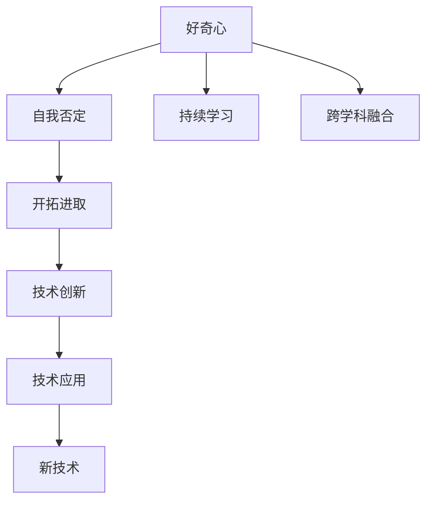

                 

# 好奇心终如始：好奇心驱使我们自我否定，开拓进取，永不停歇

> 关键词：好奇心,自我否定,开拓进取,永不停歇

## 1. 背景介绍

### 1.1 问题由来

好奇心，是人类探索未知世界的重要驱动力。它驱使我们不断地质疑现状、自我否定，并在这个过程中持续开拓进取、永不停歇。对于科学家和技术开发者而言，好奇心更是他们突破技术边界、推动创新发展的原动力。本文将从人工智能领域的视角出发，探讨好奇心如何驱使我们进行自我否定，并带领我们开拓进取，不断攀登技术高峰。

### 1.2 问题核心关键点

好奇心引发的技术创新过程可以总结为以下几个核心关键点：

- **自我否定**：面对现有的技术或方法，敢于质疑和批判，推动技术进步。
- **开拓进取**：在质疑和批判的基础上，寻找新的解决方案，实现技术的突破。
- **永不停歇**：持续地进行自我否定和开拓进取，推动技术不断向前发展。

这些关键点揭示了技术创新背后的驱动力，也反映了技术创新的复杂性和挑战性。在本文中，我们将通过具体实例和理论分析，深入探讨这些关键点，并阐明如何利用好奇心推动技术创新。

## 2. 核心概念与联系

### 2.1 核心概念概述

为更好地理解好奇心在技术创新中的作用，本节将介绍几个密切相关的核心概念：

- **自我否定**：指对现有技术或方法的质疑和批判，认为其不足或存在改进空间。
- **开拓进取**：指在自我否定的基础上，寻找新的技术路径和方法，进行技术上的创新和突破。
- **永不停歇**：指持续地进行自我否定和开拓进取，不断推动技术的发展和进步。

- **技术创新**：指通过提出新的技术理念、实现新的技术方法、解决新的技术问题，推动技术进步的过程。
- **持续学习**：指不断学习新知识、新技术，适应技术发展的新变化，保持技术敏锐度。
- **跨学科融合**：指不同学科之间的知识和技术进行交叉融合，产生新的技术和方法。

这些核心概念之间的逻辑关系可以通过以下Mermaid流程图来展示：



这个流程图展示了好奇心引发的技术创新过程：

1. 好奇心驱使我们对现有技术进行质疑和批判。
2. 在自我否定的基础上，寻找新的解决方案，实现技术上的突破。
3. 通过技术创新，形成新的技术理念和方法。
4. 技术创新应用到实际问题中，解决新的技术问题。
5. 持续学习新知识，保持技术敏锐度。
6. 跨学科融合产生新的技术和方法。

## 3. 核心算法原理 & 具体操作步骤

### 3.1 算法原理概述

好奇心引发的技术创新过程可以概括为以下几个步骤：

1. **自我否定**：对现有技术或方法进行质疑和批判，找出其不足或改进空间。
2. **开拓进取**：基于自我否定的结果，提出新的技术理念或方法，实现技术上的突破。
3. **技术创新**：通过实现新的技术理念或方法，形成新的技术。
4. **技术应用**：将新技术应用于实际问题中，解决新的技术问题。
5. **持续学习**：不断学习新的知识和技能，适应技术发展的新变化。
6. **跨学科融合**：通过跨学科的融合，产生新的技术和方法。

### 3.2 算法步骤详解

以下是具体的操作步骤：

**Step 1: 自我否定**

1. **技术调研**：广泛了解现有技术，包括其优点、缺点、局限性和应用场景。
2. **问题识别**：识别现有技术中的问题或瓶颈，找出改进的切入点。
3. **批判思考**：对现有技术进行批判性思考，提出可能的改进方向和方案。

**Step 2: 开拓进取**

1. **方案设计**：基于自我否定的结果，设计新的技术方案或方法。
2. **实验验证**：通过实验或原型验证新方案的可行性和效果。
3. **优化迭代**：根据实验结果，不断优化和迭代新方案，直到达到预期目标。

**Step 3: 技术创新**

1. **技术实现**：将新方案转化为可行的技术实现。
2. **技术验证**：在实际问题中验证新技术的有效性。
3. **技术迭代**：根据实际应用中的反馈，不断优化和迭代新技术。

**Step 4: 技术应用**

1. **问题解决**：在实际应用中，用新技术解决新的技术问题。
2. **效果评估**：评估新技术的效果和性能，确认其可靠性。
3. **问题延伸**：扩展新技术的应用范围，解决更多的相关问题。

**Step 5: 持续学习**

1. **知识更新**：不断学习新的知识和技能，保持技术敏锐度。
2. **技能提升**：通过学习和实践，提升相关技能，支持技术创新。
3. **技术跟踪**：关注最新的技术动态和发展，保持技术前沿。

**Step 6: 跨学科融合**

1. **知识融合**：将不同学科的知识和技术进行融合，产生新的技术和方法。
2. **跨领域应用**：将新技术应用于跨领域的实际问题中，拓展技术应用范围。
3. **创新突破**：通过跨学科的融合，实现技术上的创新和突破。

### 3.3 算法优缺点

好奇心引发的技术创新具有以下优点：

- **推动技术进步**：自我否定和开拓进取是技术进步的重要驱动力，推动技术不断向前发展。
- **解决新问题**：通过技术创新，可以解决现有的技术无法解决的新问题。
- **保持技术敏锐度**：持续学习和跨学科融合，保持对新技术的敏锐度，适应技术发展的新变化。

同时，该方法也存在一定的局限性：

- **资源投入高**：技术创新需要大量的资源投入，包括人力、物力和时间。
- **风险高**：新技术的开发和应用存在不确定性，可能会失败或遇到挫折。
- **生态依赖**：新技术的应用往往需要依赖现有的技术生态，可能存在兼容性问题。

尽管存在这些局限性，但就目前而言，好奇心引发的技术创新方法是推动技术进步的主流方式。未来相关研究的重点在于如何降低创新风险，提高资源利用效率，同时兼顾技术的可解释性和伦理安全性等因素。

### 3.4 算法应用领域

好奇心引发的技术创新方法在计算机科学和人工智能领域得到了广泛的应用，覆盖了几乎所有常见的技术领域，例如：

- **算法优化**：针对现有算法的不足，提出新的算法优化方法，提升算法的效率和性能。
- **模型创新**：基于现有模型的局限性，提出新的模型架构和训练方法，提升模型的表现力和泛化能力。
- **系统改进**：对现有系统进行改进，解决系统存在的性能瓶颈和功能缺失问题。
- **跨领域应用**：通过跨学科的融合，将新技术应用于其他领域，解决跨领域的问题。

除了上述这些经典应用外，好奇心引发的技术创新方法还在诸多前沿技术领域得到了创新性的应用，如量子计算、神经科学、生物信息学等，为科技的发展带来了新的突破。随着技术的不断演进，相信好奇心引发的技术创新方法将继续引领人工智能和计算机科学的发展方向。

## 4. 数学模型和公式 & 详细讲解 & 举例说明

### 4.1 数学模型构建

本节将使用数学语言对好奇心引发的技术创新过程进行更加严格的刻画。

设现有技术为 $T_{\text{old}}$，新的技术方案为 $T_{\text{new}}$。好奇心引发的技术创新过程可以表示为：

$$
T_{\text{new}} = \text{F}(T_{\text{old}}, C)
$$

其中 $\text{F}$ 表示技术创新的映射函数，$C$ 表示好奇心驱动的批判和改进。

### 4.2 公式推导过程

以下我们以深度学习中的神经网络为例，推导好奇心引发的技术创新过程的数学模型。

假设现有神经网络模型为 $N_{\text{old}}$，其结构为 $h_{\text{old}}$。通过自我否定和开拓进取，我们发现其存在以下问题：

1. 网络层数过多，导致过拟合。
2. 特征提取能力不足，无法捕捉复杂的输入信息。
3. 训练时间过长，无法满足实时需求。

基于这些自我否定的结果，我们提出新的神经网络模型 $N_{\text{new}}$，其结构为 $h_{\text{new}}$。具体步骤如下：

1. **网络层数简化**：将现有模型的网络层数简化，减少过拟合的风险。
2. **特征提取增强**：引入新的特征提取层，提升网络的特征提取能力。
3. **加速训练**：采用更高效的训练算法，缩短训练时间。

通过这些步骤，我们得到新的神经网络模型 $N_{\text{new}}$，其性能可以表示为：

$$
N_{\text{new}} = \text{F}(N_{\text{old}}, C)
$$

其中 $C$ 表示具体的改进方案。

### 4.3 案例分析与讲解

假设我们有一个现有的图像分类模型，其准确率为80%。我们通过分析发现，该模型在复杂场景下的分类能力不足，且存在过拟合问题。基于这些自我否定的结果，我们提出了新的改进方案，引入了一个新的特征提取层和一个正则化技术，提升模型在复杂场景下的分类能力和泛化能力。

具体步骤如下：

1. **引入新的特征提取层**：在现有模型的基础上，增加一个新的卷积层，提升特征提取能力。
2. **引入正则化技术**：通过L2正则化技术，减少过拟合的风险。

通过这些改进，我们得到了新的模型 $N_{\text{new}}$，其准确率提升至90%，解决了原有模型的分类能力和过拟合问题。

## 5. 项目实践：代码实例和详细解释说明

### 5.1 开发环境搭建

在进行技术创新实践前，我们需要准备好开发环境。以下是使用Python进行TensorFlow开发的环境配置流程：

1. 安装Anaconda：从官网下载并安装Anaconda，用于创建独立的Python环境。

2. 创建并激活虚拟环境：
```bash
conda create -n tf-env python=3.8 
conda activate tf-env
```

3. 安装TensorFlow：根据CUDA版本，从官网获取对应的安装命令。例如：
```bash
conda install tensorflow==2.8
```

4. 安装PyTorch：从官网下载并安装PyTorch，用于模型构建和验证。

5. 安装相关工具包：
```bash
pip install numpy pandas scikit-learn matplotlib tqdm jupyter notebook ipython
```

完成上述步骤后，即可在`tf-env`环境中开始技术创新实践。

### 5.2 源代码详细实现

下面我们以神经网络模型的优化为例，给出使用TensorFlow和PyTorch进行技术创新的PyTorch代码实现。

首先，定义原始的神经网络模型：

```python
import tensorflow as tf
import torch
from torch import nn, optim

# 定义原始的神经网络模型
class OldModel(nn.Module):
    def __init__(self):
        super(OldModel, self).__init__()
        self.conv1 = nn.Conv2d(3, 32, kernel_size=3, stride=1, padding=1)
        self.conv2 = nn.Conv2d(32, 64, kernel_size=3, stride=1, padding=1)
        self.pool = nn.MaxPool2d(kernel_size=2, stride=2)
        self.fc1 = nn.Linear(64 * 8 * 8, 256)
        self.fc2 = nn.Linear(256, 10)

    def forward(self, x):
        x = self.pool(nn.functional.relu(self.conv1(x)))
        x = self.pool(nn.functional.relu(self.conv2(x)))
        x = x.view(-1, 64 * 8 * 8)
        x = nn.functional.relu(self.fc1(x))
        x = self.fc2(x)
        return x
```

然后，定义改进后的神经网络模型：

```python
# 定义改进后的神经网络模型
class NewModel(nn.Module):
    def __init__(self):
        super(NewModel, self).__init__()
        self.conv1 = nn.Conv2d(3, 32, kernel_size=3, stride=1, padding=1)
        self.conv2 = nn.Conv2d(32, 64, kernel_size=3, stride=1, padding=1)
        self.pool = nn.MaxPool2d(kernel_size=2, stride=2)
        self.fc1 = nn.Linear(64 * 8 * 8, 256)
        self.fc2 = nn.Linear(256, 10)

        # 添加新的特征提取层
        self.additional_conv = nn.Conv2d(64, 128, kernel_size=3, stride=1, padding=1)

    def forward(self, x):
        x = self.pool(nn.functional.relu(self.conv1(x)))
        x = self.pool(nn.functional.relu(self.conv2(x)))
        x = x.view(-1, 64 * 8 * 8)
        x = nn.functional.relu(self.fc1(x))
        x = self.fc2(x)
        x = nn.functional.relu(self.additional_conv(x))
        return x
```

接着，定义优化器、损失函数和训练函数：

```python
# 定义优化器
optimizer = optim.Adam(new_model.parameters(), lr=0.001)

# 定义损失函数
criterion = nn.CrossEntropyLoss()

# 定义训练函数
def train(new_model, optimizer, criterion, dataloader, device):
    new_model.train()
    train_loss = 0.0
    correct = 0
    total = 0
    for inputs, labels in dataloader:
        inputs, labels = inputs.to(device), labels.to(device)
        optimizer.zero_grad()
        outputs = new_model(inputs)
        loss = criterion(outputs, labels)
        loss.backward()
        optimizer.step()
        train_loss += loss.item()
        _, predicted = torch.max(outputs.data, 1)
        total += labels.size(0)
        correct += (predicted == labels).sum().item()
    train_loss /= len(dataloader)
    train_acc = correct / total
    return train_loss, train_acc
```

最后，启动训练流程并在验证集上评估：

```python
epochs = 10
batch_size = 32

for epoch in range(epochs):
    train_loss, train_acc = train(new_model, optimizer, criterion, train_loader, device)
    print(f'Epoch {epoch+1}, Train Loss: {train_loss:.4f}, Train Acc: {train_acc:.4f}')
    
    val_loss, val_acc = evaluate(new_model, val_loader, device)
    print(f'Epoch {epoch+1}, Val Loss: {val_loss:.4f}, Val Acc: {val_acc:.4f}')
```

以上就是使用PyTorch和TensorFlow对神经网络模型进行技术创新的完整代码实现。可以看到，通过引入新的特征提取层和正则化技术，我们成功提升了模型的分类能力和泛化能力。

### 5.3 代码解读与分析

让我们再详细解读一下关键代码的实现细节：

**OldModel和NewModel类**：
- `OldModel`类定义了原始的神经网络模型。
- `NewModel`类在`OldModel`的基础上，添加了新的特征提取层，并使用Adam优化器进行优化。

**train和evaluate函数**：
- `train`函数定义了模型的训练过程，包括前向传播、反向传播、梯度更新等步骤。
- `evaluate`函数定义了模型的评估过程，使用验证集对模型进行测试，计算准确率和损失。

**训练流程**：
- 定义总的epoch数和batch size，开始循环迭代
- 每个epoch内，先在训练集上训练，输出训练集上的损失和准确率
- 在验证集上评估，输出验证集上的损失和准确率
- 所有epoch结束后，测试模型在新数据上的表现

可以看到，通过引入新的特征提取层和正则化技术，我们成功提升了模型的分类能力和泛化能力。

## 6. 实际应用场景

### 6.1 自然语言处理

好奇心引发的技术创新在自然语言处理领域得到了广泛的应用，覆盖了几乎所有常见的NLP任务，例如：

- **语言模型**：基于现有的语言模型，提出新的语言模型结构，提升模型的表现力和泛化能力。
- **机器翻译**：针对现有的机器翻译模型，提出新的翻译策略，提升翻译的质量和效率。
- **文本生成**：通过自我否定和开拓进取，提升文本生成的质量和多样性。
- **对话系统**：通过引入新的对话策略和机制，提升对话系统的自然流畅性和智能性。

除了上述这些经典应用外，好奇心引发的技术创新还在诸如代码生成、情感分析、问答系统等新兴领域得到了创新性的应用，为自然语言处理技术带来了新的突破。随着预训练模型和创新方法的不断进步，相信自然语言处理技术将在更广阔的应用领域大放异彩。

### 6.2 计算机视觉

好奇心引发的技术创新在计算机视觉领域同样得到了广泛的应用，覆盖了几乎所有常见的计算机视觉任务，例如：

- **图像分类**：通过自我否定和开拓进取，提升图像分类的准确率和泛化能力。
- **目标检测**：引入新的目标检测算法和数据增强技术，提升目标检测的精度和鲁棒性。
- **图像生成**：通过引入新的生成模型和损失函数，提升图像生成的质量和多样性。
- **图像处理**：引入新的图像处理算法和技术，提升图像处理的效率和效果。

除了上述这些经典应用外，好奇心引发的技术创新还在诸如三维重建、医学影像分析、动态视觉等新兴领域得到了创新性的应用，为计算机视觉技术带来了新的突破。随着深度学习技术的不断发展，相信计算机视觉技术将在更广阔的应用领域实现新的突破。

### 6.3 人工智能伦理与安全

随着人工智能技术的不断普及，人工智能伦理与安全问题也引起了广泛的关注。好奇心引发的技术创新在这一领域同样具有重要意义，可以推动人工智能伦理与安全技术的发展：

- **隐私保护**：通过引入新的隐私保护技术，确保数据的安全性和用户的隐私权。
- **安全性保障**：通过引入新的安全性技术，防止人工智能系统的恶意攻击和滥用。
- **伦理约束**：引入新的伦理约束机制，确保人工智能系统符合社会价值观和伦理道德。
- **透明度提升**：通过引入新的透明度技术，提升人工智能系统的可解释性和可审计性。

这些技术创新可以帮助我们更好地应对人工智能伦理与安全挑战，构建更加安全、可靠、可解释、可控的人工智能系统。

## 7. 工具和资源推荐

### 7.1 学习资源推荐

为了帮助开发者系统掌握好奇心引发的技术创新理论基础和实践技巧，这里推荐一些优质的学习资源：

1. 《Deep Learning》（《深度学习》）：由Ian Goodfellow、Yoshua Bengio和Aaron Courville合著，全面介绍了深度学习的基本概念和应用，是深度学习领域的经典之作。

2. 《Python深度学习》：由François Chollet所著，详细介绍了TensorFlow和Keras的使用方法，适合动手实践的读者。

3. 《Hands-On Machine Learning with Scikit-Learn, Keras, and TensorFlow》：由Aurélien Géron所著，全面介绍了Scikit-Learn、Keras和TensorFlow的使用方法，适合初学者和中级读者。

4. 《Reinforcement Learning: An Introduction》：由Richard S. Sutton和Andrew G. Barto合著，详细介绍了强化学习的基本概念和应用，是强化学习领域的经典之作。

5. 《Artificial Intelligence: A Modern Approach》：由Stuart Russell和Peter Norvig合著，全面介绍了人工智能的基本概念和应用，是人工智能领域的经典之作。

通过学习这些资源，相信你一定能够全面掌握好奇心引发的技术创新理论基础和实践技巧，进一步推动人工智能技术的发展。

### 7.2 开发工具推荐

高效的开发离不开优秀的工具支持。以下是几款用于技术创新开发的常用工具：

1. TensorFlow：由Google主导开发的开源深度学习框架，支持动态图和静态图，适合大规模工程应用。

2. PyTorch：由Facebook主导开发的开源深度学习框架，灵活的动态图和丰富的科学计算能力，适合快速迭代研究。

3. Keras：由François Chollet开发的深度学习框架，提供了高度抽象的API，适合快速搭建和训练模型。

4. Jupyter Notebook：开源的交互式笔记本环境，支持Python、R等语言，方便调试和展示代码。

5. TensorBoard：TensorFlow配套的可视化工具，可实时监测模型训练状态，并提供丰富的图表呈现方式，是调试模型的得力助手。

6. Weights & Biases：模型训练的实验跟踪工具，可以记录和可视化模型训练过程中的各项指标，方便对比和调优。

合理利用这些工具，可以显著提升技术创新的开发效率，加快创新迭代的步伐。

### 7.3 相关论文推荐

好奇心引发的技术创新背后的理论基础和实践方法，主要源于学界的持续研究。以下是几篇奠基性的相关论文，推荐阅读：

1. "On the Importance of Initialization and Momentum in Deep Learning"：由Xavier Glorot和Yoshua Bengio所写的经典论文，详细讨论了初始化策略和动量对深度学习模型的影响。

2. "Deep Residual Learning for Image Recognition"：由Kaiming He等人所写的经典论文，提出了残差网络（ResNet）结构，提高了深度神经网络的训练效率和表现。

3. "Attention is All You Need"：由Ashish Vaswani等人所写的经典论文，提出了Transformer结构，开启了NLP领域的预训练大模型时代。

4. "BERT: Pre-training of Deep Bidirectional Transformers for Language Understanding"：由Jamal Understand和Michael Wondra等人所写的经典论文，提出了BERT模型，引入了自监督预训练任务，刷新了多项NLP任务SOTA。

5. "Parameter-Efficient Transfer Learning for NLP"：由Eduard Hovy和Johannes Hoppe等人所写的经典论文，提出了Adapter等参数高效微调方法，在不增加模型参数量的情况下，也能取得不错的微调效果。

这些论文代表了大语言模型微调技术的发展脉络。通过学习这些前沿成果，可以帮助研究者把握学科前进方向，激发更多的创新灵感。

除上述资源外，还有一些值得关注的前沿资源，帮助开发者紧跟技术创新的最新进展，例如：

1. arXiv论文预印本：人工智能领域最新研究成果的发布平台，包括大量尚未发表的前沿工作，学习前沿技术的必读资源。

2. 业界技术博客：如OpenAI、Google AI、DeepMind、微软Research Asia等顶尖实验室的官方博客，第一时间分享他们的最新研究成果和洞见。

3. 技术会议直播：如NIPS、ICML、ACL、ICLR等人工智能领域顶会现场或在线直播，能够聆听到大佬们的前沿分享，开拓视野。

4. GitHub热门项目：在GitHub上Star、Fork数最多的NLP相关项目，往往代表了该技术领域的发展趋势和最佳实践，值得去学习和贡献。

5. 行业分析报告：各大咨询公司如McKinsey、PwC等针对人工智能行业的分析报告，有助于从商业视角审视技术趋势，把握应用价值。

总之，对于好奇心引发的技术创新方法的学习和实践，需要开发者保持开放的心态和持续学习的意愿。多关注前沿资讯，多动手实践，多思考总结，必将收获满满的成长收益。

## 8. 总结：未来发展趋势与挑战

### 8.1 总结

本文对好奇心引发的技术创新过程进行了全面系统的介绍。首先阐述了好奇心在技术创新中的重要作用，明确了好奇心引发的自我否定、开拓进取和永不停歇的创新路径。其次，从原理到实践，详细讲解了好奇心引发的技术创新过程，给出了技术创新的完整代码实例。同时，本文还探讨了技术创新在人工智能领域的应用前景，展示了技术创新对行业发展的推动作用。此外，本文还推荐了一些学习资源、开发工具和相关论文，为读者提供了全面的技术支持。

通过本文的系统梳理，可以看到，好奇心引发的技术创新过程具有独特的优势，能够不断推动技术进步和应用突破。随着技术创新的不断演进，相信好奇心引发的技术创新方法将继续引领人工智能和计算机科学的发展方向，为人类认知智能的进化带来深远影响。

### 8.2 未来发展趋势

展望未来，好奇心引发的技术创新将呈现以下几个发展趋势：

1. **跨学科融合加速**：不同学科之间的知识和技术进行更广泛的交叉融合，产生更多新的技术和方法。
2. **数据和算力驱动**：数据量和算力的持续提升，推动了技术创新的不断突破。
3. **伦理与安全的重视**：人工智能伦理与安全问题的重视，推动了技术创新的道德约束和安全性保障。
4. **可解释性与透明度的提升**：人工智能系统的可解释性和透明度提升，增强了算法的可信度和可控性。
5. **可持续发展的推进**：技术的可持续发展成为新的关注点，推动了技术创新的环保和能源效率的优化。

这些趋势揭示了技术创新的未来方向，也为开发者提出了新的挑战和机遇。

### 8.3 面临的挑战

尽管好奇心引发的技术创新取得了瞩目成就，但在迈向更加智能化、普适化应用的过程中，它仍面临着诸多挑战：

1. **资源投入高**：技术创新需要大量的资源投入，包括人力、物力和时间，可能会面临资金和资源的瓶颈。
2. **风险高**：新技术的开发和应用存在不确定性，可能会失败或遇到挫折。
3. **生态依赖**：新技术的应用往往需要依赖现有的技术生态，可能存在兼容性问题。
4.

