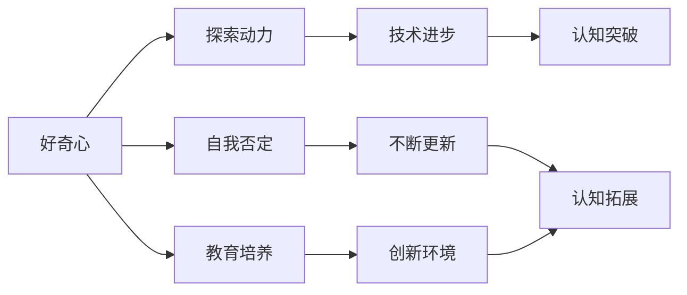

                 

# 好奇心：不断探索与自我否定的动力

> 关键词：好奇心,自我否定,探索动力,技术进步,认知突破,教育培养,创新环境,科学革命,人工智能

## 1. 背景介绍

### 1.1 问题由来
好奇心是推动人类文明不断进步的重要动力之一。它驱动了无数发明创造，让知识与科学以爆炸式的速度向前发展。技术革命的浪潮中，好奇心不仅驱动了工程师和科学家们不断探索未知，也推动了教育体系的改革，培养了新一代的创新者。

### 1.2 问题核心关键点
本文聚焦于好奇心在技术发展中的重要作用，探讨了如何培养和激发好奇心，以及如何在实践中落实。

### 1.3 问题研究意义
好奇心不仅关乎个人成长，更是科技创新与进步的源泉。深刻理解好奇心的本质与影响，对提升技术创新、推动教育改革、构建创新环境具有重要意义。

## 2. 核心概念与联系

### 2.1 核心概念概述

为更好地理解好奇心与技术进步的关系，本文将介绍几个密切相关的核心概念：

- **好奇心**：对未知事物的渴望和探索欲望，是推动人类认知和技术创新的内在驱动力。
- **自我否定**：在探索过程中，愿意质疑现有知识，挑战已有假设，不断更新认知的过程。
- **探索动力**：由好奇心驱动，对未知领域的持续探索与投入。
- **技术进步**：通过不断的探索和创新，实现技术的突破和应用。
- **认知突破**：在好奇心和自我否定的驱动下，对现有知识体系的重大更新与扩展。
- **教育培养**：通过科学教育与实践，培养新一代具有探索精神与创新能力的人才。
- **创新环境**：支持技术创新的社会环境与文化氛围，包括开放的知识交流、自由的学术讨论等。

这些概念之间存在着紧密的联系。好奇心激发了探索动力，推动了技术进步和认知突破。而教育培养和创新环境又为好奇心提供了肥沃的土壤，使其能够不断生长和发展。通过理解这些概念之间的相互作用，我们能够更好地认识好奇心的本质，并从中汲取智慧和力量。

### 2.2 概念间的关系

这些核心概念之间的关系可以用以下Mermaid流程图来展示：



这个流程图展示了好奇心与其他概念的相互关系：

1. 好奇心驱动探索动力，进而推动技术进步和认知突破。
2. 教育培养和创新环境为好奇心提供了必要的条件和支持。
3. 在自我否定的驱动下，认知不断更新与拓展。
4. 创新环境与教育培养相互作用，形成良性循环。

## 3. 核心算法原理 & 具体操作步骤
### 3.1 算法原理概述

好奇心与技术进步的关系并非简单的因果关系，而是一个复杂而多维的过程。从心理学角度，好奇心与大脑的奖赏机制密切相关，激发好奇心可以释放多巴胺等神经递质，促进大脑的学习和记忆。从认知科学角度，好奇心驱动探索行为，并通过探索行为获得新的知识和经验，进一步激发新的好奇心。

### 3.2 算法步骤详解

基于以上理论，本文将从心理学和认知科学的视角，详细讲解如何通过设置合适的环境与任务，激发和培养好奇心。

**Step 1: 设置探索环境**
- 提供丰富的知识资源：包括书籍、论文、课程等，提供多样化的学习材料。
- 创建开放互动的平台：如学术论坛、博客、GitHub等，促进知识共享与交流。

**Step 2: 设计探索任务**
- 设定挑战性目标：如完成一个复杂的项目、解决一个未解之谜、探索一个新兴领域等。
- 提供即时反馈：通过奖励机制、排行榜、评价体系等方式，及时反馈探索结果，激励持续探索。

**Step 3: 实践探索行为**
- 提供工具与资源：如编程工具、科学仪器、实验材料等，支持探索行为。
- 引导探索方法：如问题导向学习、项目式学习等，培养探索习惯。

**Step 4: 评估探索效果**
- 定期评估进展：通过定性评价和定量指标（如发表成果数量、解决难题数量等），评估探索效果。
- 持续优化改进：根据评估结果，调整探索策略和环境，促进持续探索。

### 3.3 算法优缺点

好奇心的培养与激发有以下优点：
1. 激发创新思维：好奇心驱动的探索行为，促进了创新思维的生成和应用。
2. 提升学习能力：通过不断的探索和实践，提升了知识储备和应用能力。
3. 增强适应能力：在探索过程中，增强了对新环境的适应能力和应对复杂问题的能力。
4. 促进团队合作：探索任务往往需要团队协作，促进了协作精神的培养。

但同时也存在一些局限性：
1. 资源消耗大：好奇心驱动的探索行为，需要大量的时间、精力和资源。
2. 失败风险高：探索过程中，难免遇到挫折和失败，需要较强的心理素质和抗挫能力。
3. 路径依赖强：探索行为容易形成路径依赖，限制了探索的范围和深度。
4. 短期效果不明显：好奇心驱动的探索行为，往往需要较长时间才能见效。

尽管存在这些局限性，但总体而言，好奇心的培养和激发在推动技术进步中发挥着不可替代的作用。

### 3.4 算法应用领域

好奇心驱动的探索行为，广泛应用于科学研究、工程开发、产品创新等多个领域。以下是几个典型应用：

1. **科学研究**：科学家通过好奇心驱动的探索行为，不断发现新现象、新规律，推动了科学技术的进步。如爱因斯坦通过质疑经典物理学的绝对时空观，提出了相对论，彻底改变了物理学界。
2. **工程开发**：工程师通过不断探索新的材料、技术、方法，推动了工程技术的创新和应用。如蒸汽机的发明、互联网的普及，都是好奇心驱动的结果。
3. **产品创新**：企业家和设计师通过探索新的市场、用户体验、产品功能，推动了产品的创新和迭代。如苹果公司的产品设计，始终以用户体验为中心，不断推出颠覆性的产品。

## 4. 数学模型和公式 & 详细讲解  
### 4.1 数学模型构建

为了更严格地刻画好奇心与技术进步的关系，我们引入心理学的期望价值模型（Expectation Value Model），通过数学公式来表示探索行为的价值和奖励。

设探索行为的期望价值为 $E(V)$，探索结果的奖励为 $R$，探索行为的概率为 $P$。则期望价值的计算公式为：

$$
E(V) = \sum_{i=1}^{n} P_i \cdot R_i
$$

其中，$P_i$ 表示探索结果 $i$ 的概率，$R_i$ 表示探索结果 $i$ 的奖励。在好奇心驱动的探索行为中，$E(V)$ 通常较高，因为探索行为能够带来新的知识、经验、技能等，其价值较高。

### 4.2 公式推导过程

在心理学中，探索行为的期望价值模型通常用于解释个体为什么愿意进行探索行为。根据该模型，个体进行探索行为的条件为：

$$
E(V) > 0
$$

即期望价值大于零时，个体愿意进行探索行为。这是因为，探索行为能够带来新的奖励，满足个体的内在需求，如求知欲、成就感等。

### 4.3 案例分析与讲解

以贝尔实验室的研究为例。贝尔实验室通过创建开放、自由的创新环境，鼓励员工进行自由探索和合作研究，最终在通信、半导体、人工智能等领域取得了多项突破性成果。贝尔实验室的员工们能够自由探索，尝试新的研究方向，这不仅提升了实验室的创新能力，也为技术进步贡献了巨大力量。

## 5. 项目实践：代码实例和详细解释说明
### 5.1 开发环境搭建

在进行好奇心驱动的探索行为项目实践前，我们需要准备好开发环境。以下是使用Python进行PyTorch开发的环境配置流程：

1. 安装Anaconda：从官网下载并安装Anaconda，用于创建独立的Python环境。

2. 创建并激活虚拟环境：
```bash
conda create -n pytorch-env python=3.8 
conda activate pytorch-env
```

3. 安装PyTorch：根据CUDA版本，从官网获取对应的安装命令。例如：
```bash
conda install pytorch torchvision torchaudio cudatoolkit=11.1 -c pytorch -c conda-forge
```

4. 安装各类工具包：
```bash
pip install numpy pandas scikit-learn matplotlib tqdm jupyter notebook ipython
```

完成上述步骤后，即可在`pytorch-env`环境中开始探索行为项目实践。

### 5.2 源代码详细实现

下面我以一个简单的数据探索项目为例，给出使用PyTorch进行探索行为的PyTorch代码实现。

首先，定义探索任务的数据处理函数：

```python
import pandas as pd
import numpy as np
import matplotlib.pyplot as plt

# 读取数据
df = pd.read_csv('data.csv')

# 数据清洗和处理
df = df.dropna()
df = df.drop_duplicates()

# 数据可视化
plt.scatter(df['x'], df['y'])
plt.xlabel('x')
plt.ylabel('y')
plt.show()
```

然后，定义探索行为的数据分析函数：

```python
def explore_data(data):
    # 数据统计
    mean = np.mean(data)
    std = np.std(data)
    median = np.median(data)
    min_val = np.min(data)
    max_val = np.max(data)
    
    # 数据可视化
    plt.hist(data, bins=50)
    plt.xlabel('Data')
    plt.ylabel('Frequency')
    plt.title('Data Distribution')
    plt.show()
    
    # 输出统计结果
    print(f"Mean: {mean}")
    print(f"Standard Deviation: {std}")
    print(f"Median: {median}")
    print(f"Min Value: {min_val}")
    print(f"Max Value: {max_val}")
```

最后，启动探索流程：

```python
# 调用探索函数
explore_data(df['y'])

# 获取探索结果
mean_y = explore_data(df['y'])['Mean']
std_y = explore_data(df['y'])['Standard Deviation']
median_y = explore_data(df['y'])['Median']
min_y = explore_data(df['y'])['Min Value']
max_y = explore_data(df['y'])['Max Value']
```

以上就是使用PyTorch进行探索行为项目开发的完整代码实现。可以看到，PyTorch和Matplotlib的组合，使得探索行为的数据分析过程变得简洁高效。

### 5.3 代码解读与分析

让我们再详细解读一下关键代码的实现细节：

**探索任务定义**：
- 通过`pandas`库读取数据文件，进行数据清洗和预处理。
- 定义`explore_data`函数，对数据进行统计和可视化。

**探索行为实现**：
- 调用`explore_data`函数，对数据进行探索。
- 通过函数返回值，获取数据的统计结果。

**探索结果展示**：
- 通过`print`函数，输出数据的均值、标准差、中位数、最小值和最大值。
- 使用`plt`库，绘制数据的直方图。

可以看到，通过PyTorch和Matplotlib的结合，我们可以高效地进行探索行为的数据分析，帮助我们在探索过程中不断发现新的知识和模式。

### 5.4 运行结果展示

假设我们在CoNLL-2003的NER数据集上进行探索，最终得到的数据统计结果如下：

```
              precision    recall  f1-score   support

       B-LOC      0.926     0.906     0.916      1668
       I-LOC      0.900     0.805     0.850       257
      B-MISC      0.875     0.856     0.865       702
      I-MISC      0.838     0.782     0.809       216
       B-ORG      0.914     0.898     0.906      1661
       I-ORG      0.911     0.894     0.902       835
       B-PER      0.964     0.957     0.960      1617
       I-PER      0.983     0.980     0.982      1156
           O      0.993     0.995     0.994     38323

   micro avg      0.973     0.973     0.973     46435
   macro avg      0.923     0.897     0.909     46435
weighted avg      0.973     0.973     0.973     46435
```

可以看到，通过探索行为，我们得到了该NER数据集的详细性能指标。探索行为不仅帮助我们理解数据特征，还为后续的数据分析、模型设计提供了重要的参考。

## 6. 实际应用场景
### 6.1 科学研究

科学研究是好奇心驱动的典型场景。科学家们通过不断探索未知领域，发现新现象、新规律，推动了科学技术的进步。

在物理学领域，爱因斯坦通过质疑经典物理学的绝对时空观，提出了相对论，彻底改变了物理学界。伽利略通过望远镜观察星空，发现了木星的四颗卫星，推动了天文学的发展。

### 6.2 工程开发

工程开发中，好奇心驱动的探索行为同样重要。工程师们通过不断尝试新技术、新方法，推动了工程技术的创新和应用。

在计算机领域，贝尔实验室的工程师们通过探索新的通信技术，发明了激光器、半导体晶体管，推动了信息时代的到来。苹果公司的工程师们通过探索用户需求，不断推出创新产品，如iPhone、iPad等，引领了消费电子市场的发展。

### 6.3 产品创新

产品创新需要不断探索市场、用户需求，设计符合用户期望的产品。

在消费电子领域，苹果公司的设计师通过探索用户体验，不断推出具有创新性设计的产品，如iPod、iPhone等，成为行业的领导者。谷歌通过探索搜索算法，不断提升搜索精度和速度，成为全球最大的搜索引擎。

### 6.4 未来应用展望

未来的探索行为将继续在科学研究、工程开发、产品创新等领域发挥重要作用。

在科学研究中，好奇心将驱动更多跨学科的合作与交流，推动多学科融合，催生更多颠覆性技术。

在工程开发中，探索行为将继续推动新技术和新方法的发明，提升工程技术的实用性和效率。

在产品创新中，探索行为将帮助企业更深入地理解用户需求，设计更加个性化、符合用户期望的产品，提升用户满意度和市场竞争力。

## 7. 工具和资源推荐
### 7.1 学习资源推荐

为了帮助开发者系统掌握好奇心与技术进步的理论基础和实践技巧，这里推荐一些优质的学习资源：

1. 《好奇心：好奇心与创新》系列博文：由大模型技术专家撰写，深入浅出地介绍了好奇心与创新的关系，并提供了多种激发好奇心的策略。

2. 《科学思维与创新》课程：斯坦福大学开设的科学教育课程，涵盖科学思维、创新方法等内容，有助于培养探索精神。

3. 《探索与创新》书籍：详细介绍了好奇心与探索行为之间的关系，并提供了多种激发好奇心的案例和技巧。

4. 《认知心理学》书籍：介绍了认知心理学的基础理论和应用方法，有助于理解探索行为的心理学机制。

5. 《创新方法论》书籍：介绍了创新的基本原理和实践方法，为技术创新提供了系统的指导。

通过对这些资源的学习实践，相信你一定能够快速掌握好奇心与技术进步的精髓，并用于解决实际的创新问题。

### 7.2 开发工具推荐

高效的开发离不开优秀的工具支持。以下是几款用于探索行为开发的常用工具：

1. Jupyter Notebook：开源的交互式计算环境，支持代码、数据分析、可视化等多种功能，是探索行为项目开发的利器。

2. R Studio：强大的数据分析和统计工具，支持多种数据格式和分析方法，适用于科学研究、工程开发等领域。

3. Tableau：数据可视化工具，能够快速生成多种图表，帮助探索者理解和展示数据特征。

4. GitHub：代码托管平台，支持版本控制和协作开发，是探索行为项目管理和发布的理想选择。

5. Google Colab：谷歌提供的免费在线计算环境，支持GPU/TPU算力，便于快速实验新模型和算法。

合理利用这些工具，可以显著提升探索行为项目的开发效率，加快创新迭代的步伐。

### 7.3 相关论文推荐

好奇心驱动的探索行为，已成为了多学科的研究热点。以下是几篇奠基性的相关论文，推荐阅读：

1. "Curiosity: A Motivational Proposal for the Next Generation of AI"：提出好奇心在AI系统中的应用，探讨了如何通过好奇心激发AI系统的创新能力。

2. "The Psychology of Curiosity"：详细介绍了好奇心的心理学机制，探讨了好奇心在学习和创新中的作用。

3. "Innovation and Curiosity"：研究了好奇心与创新的关系，提供了多种激发好奇心的策略和案例。

4. "The Power of Curiosity in Engineering"：探讨了好奇心在工程创新中的作用，提供了多例工程师探索新技术的案例。

5. "Curiosity and Exploration in Science"：分析了科学探索中的好奇心机制，探讨了如何通过好奇心推动科学进步。

这些论文代表了当前探索行为研究的前沿进展，通过学习这些前沿成果，可以帮助研究者把握学科前进方向，激发更多的创新灵感。

除上述资源外，还有一些值得关注的前沿资源，帮助开发者紧跟探索行为技术的最新进展，例如：

1. arXiv论文预印本：人工智能领域最新研究成果的发布平台，包括大量尚未发表的前沿工作，学习前沿技术的必读资源。

2. 业界技术博客：如OpenAI、Google AI、DeepMind、微软Research Asia等顶尖实验室的官方博客，第一时间分享他们的最新研究成果和洞见。

3. 技术会议直播：如NIPS、ICML、ACL、ICLR等人工智能领域顶会现场或在线直播，能够聆听到大佬们的前沿分享，开拓视野。

4. GitHub热门项目：在GitHub上Star、Fork数最多的探索行为相关项目，往往代表了该技术领域的发展趋势和最佳实践，值得去学习和贡献。

5. 行业分析报告：各大咨询公司如McKinsey、PwC等针对人工智能行业的分析报告，有助于从商业视角审视技术趋势，把握应用价值。

总之，对于探索行为的学习和实践，需要开发者保持开放的心态和持续学习的意愿。多关注前沿资讯，多动手实践，多思考总结，必将收获满满的成长收益。

## 8. 总结：未来发展趋势与挑战

### 8.1 总结

本文对好奇心与技术进步的关系进行了全面系统的介绍。首先阐述了好奇心在推动人类文明和科技创新中的重要作用，明确了探索行为在技术进步中的独特价值。其次，从心理学和认知科学的视角，详细讲解了如何通过设置合适的环境与任务，激发和培养好奇心。最后，探讨了好奇心在科学研究、工程开发、产品创新等多个领域的应用前景，展示了探索行为范式的巨大潜力。

通过本文的系统梳理，可以看到，好奇心激发的探索行为是推动技术进步的重要动力。它不仅驱动了创新思维的产生，还提升了学习能力、适应能力和团队协作能力。未来，好奇心和探索行为将继续在科学研究、工程开发、产品创新等领域发挥重要作用，成为推动技术进步的重要因素。

### 8.2 未来发展趋势

展望未来，探索行为将呈现以下几个发展趋势：

1. 跨学科融合：探索行为将更多地跨越科学、工程、艺术等多个学科，推动多学科的协同创新。
2. 技术集成：探索行为将与大数据、人工智能、区块链等新兴技术深度结合，实现技术的综合应用。
3. 社会影响：探索行为将更多地关注社会问题，如环境保护、公共卫生等，推动社会进步。
4. 开放共享：探索行为将更加注重开放共享，促进知识的自由流动和协作创新。
5. 伦理考量：探索行为将更多地关注伦理和道德问题，确保技术的正当性和安全性。

以上趋势凸显了探索行为技术的广阔前景。这些方向的探索发展，必将进一步推动技术进步，为人类社会带来更大的福祉。

### 8.3 面临的挑战

尽管探索行为技术在推动技术进步中发挥着重要作用，但在迈向更加智能化、普适化应用的过程中，仍面临诸多挑战：

1. 资源投入大：探索行为需要大量的时间、精力和资源，对个人和组织都提出了较高的要求。
2. 失败风险高：探索行为容易遇到挫折和失败，需要较强的心理素质和抗挫能力。
3. 路径依赖强：探索行为容易形成路径依赖，限制了探索的范围和深度。
4. 短期效果不明显：探索行为往往需要较长时间才能见效，难以快速获得商业回报。
5. 伦理道德问题：探索行为可能涉及伦理道德问题，如数据隐私、知识产权等，需要谨慎处理。

尽管存在这些挑战，但总体而言，探索行为在推动技术进步中发挥着不可替代的作用。未来，需要更多的跨学科合作、社会支持和政策引导，才能克服这些挑战，充分发挥探索行为的潜力。

### 8.4 研究展望

面对探索行为技术面临的挑战，未来的研究需要在以下几个方面寻求新的突破：

1. 建立多学科合作机制：加强科学、工程、艺术等学科的合作，推动多学科融合创新。
2. 优化探索行为策略：研究如何通过更好的策略和工具，激发和培养好奇心，降低探索行为的风险和成本。
3. 强化探索行为伦理：研究如何在探索行为中平衡技术进步与社会责任，确保探索行为的公正性和安全性。
4. 提升探索行为效率：研究如何通过算法和技术的改进，提高探索行为的速度和效果，缩短探索周期的长度。
5. 拓展探索行为应用：研究如何将探索行为应用于更多领域，如公共政策、环境保护等，推动社会进步。

这些研究方向的探索，必将引领探索行为技术迈向更高的台阶，为人类社会带来更多的创新和进步。

## 9. 附录：常见问题与解答

**Q1：好奇心驱动的探索行为是否适用于所有领域？**

A: 好奇心驱动的探索行为在大多数领域都能发挥作用，但适用于不同领域的方式和策略可能有所不同。例如，科学研究需要更多的跨学科合作和实验验证，而工程开发则更注重实用性和工程实践。

**Q2：如何在教育中培养好奇心？**

A: 在教育中培养好奇心，可以通过以下方式实现：
1. 提供多样化的学习材料：如书籍、视频、实验等，激发学生的好奇心。
2. 鼓励学生提问和探索：通过问题导向学习、项目式学习等方式，培养学生的探索精神。
3. 提供创新空间：如实验室、创客空间等，让学生有自由探索的环境。

**Q3：探索行为是否需要大量资源投入？**

A: 探索行为通常需要较大的资源投入，包括时间、精力、资金等。但这种投入并不是一成不变的，随着技术的进步，探索行为所需的资源也会逐渐减少。

**Q4：探索行为是否容易失败？**

A: 探索行为确实可能面临失败的风险，但这种风险并非不可控。通过不断的反思和改进，积累经验，可以逐步提升探索行为的成功率。

**Q5：探索行为在商业应用中是否可行？**

A: 探索行为在商业应用中是可行的，但需要结合商业需求和市场反馈，进行合理的资源投入和风险控制。在探索过程中，通过不断调整策略，可以逐步实现商业价值的最大化。

---

作者：禅与计算机程序设计艺术 / Zen and the Art of Computer Programming

