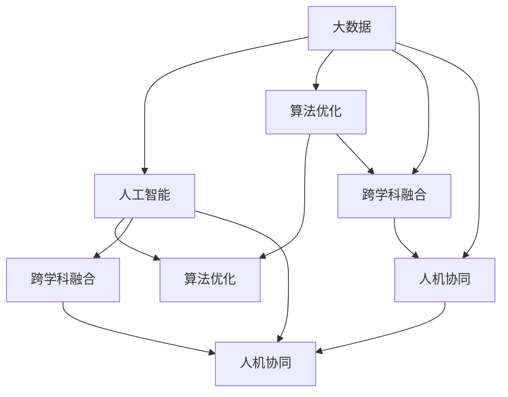

                 

# 好奇心：创新与发现的源泉

**作者：禅与计算机程序设计艺术 / Zen and the Art of Computer Programming**

## 1. 背景介绍

### 1.1 问题的提出

在这个信息爆炸的时代，技术创新的速度似乎比以往任何时候都要快。无论是人工智能、量子计算、还是区块链等前沿技术，都展现出强劲的发展势头。然而，技术的快速迭代和应用落地，背后蕴含着怎样的驱动力？是什么因素激发了研究者不断探索未知、突破极限？本文将围绕“好奇心”这一核心主题，深入探讨其在大数据、人工智能等前沿领域的驱动作用。

### 1.2 问题的核心关键点

好奇心作为人类天生具有的驱动力，在技术创新和科学发现中扮演着至关重要的角色。在大数据时代，通过数据驱动的方法，好奇心的力量可以被放大和重构，推动技术探索和应用落地。

本文将从以下几个方面来探讨好奇心如何激发技术创新：

- **数据驱动的发现**：大数据技术的进步，使得我们能够从海量数据中提取模式和洞见，为技术创新提供了新视角。
- **算法优化与突破**：算法是技术创新的核心，好奇心驱动的研究者不断寻找更高效的算法，推动技术边界不断拓展。
- **跨学科融合**：好奇心促使研究者突破学科界限，融合多领域知识，创造新的技术应用场景。
- **人类与机器的协同**：好奇心激发了研究者探索人机协作的新途径，为人工智能等技术的发展注入了新的生命力。

## 2. 核心概念与联系

### 2.1 核心概念概述

好奇心作为人类探索未知、追求真理的原始动力，在大数据、人工智能等前沿技术的创新过程中，扮演着不可或缺的角色。本文将详细介绍以下几个核心概念：

- **大数据**：指通过传感器、社交媒体、物联网等手段收集和分析的海量数据，为大规模探索和创新提供数据基础。
- **人工智能**：指通过算法和模型，使机器具备类似人类的智能决策能力，实现自动化和智能化。
- **算法优化**：指不断优化和改进算法，以提高效率和精度，驱动技术创新。
- **跨学科融合**：指将不同学科的知识和技能融合，创造新的技术和应用。
- **人机协同**：指通过技术手段，提升人机交互效率和协同能力，拓展人机互动的新边界。

### 2.2 概念间的关系

这些核心概念之间存在紧密的联系，共同构成了一个技术创新的生态系统。下图展示了这些概念之间的逻辑关系：



这个流程图展示了大数据、人工智能、算法优化、跨学科融合和人机协同之间的相互关系：

- 大数据为人工智能提供了数据基础，而算法优化是提升人工智能效率和性能的关键。
- 跨学科融合使得不同领域的知识得以融合，为新的技术应用提供了可能。
- 人机协同则拓展了人机互动的边界，使得技术更具实用性和人性化。

## 3. 核心算法原理 & 具体操作步骤
### 3.1 算法原理概述

好奇心驱动的数据分析与技术创新，其核心在于如何从海量数据中提取有价值的信息，并基于这些信息不断优化和改进算法。本文将从数据驱动的角度，探讨这一过程的原理和步骤。

### 3.2 算法步骤详解

基于好奇心的数据驱动分析，主要包括以下几个步骤：

1. **数据收集**：使用传感器、社交媒体、物联网等手段收集大量数据。数据来源越广泛，信息含量越丰富，越能激发研究者的探索欲。
2. **数据清洗与预处理**：清洗数据中的噪声和异常值，进行数据转换和归一化，确保数据的准确性和可用性。
3. **特征提取**：从清洗后的数据中提取出有意义的特征，为后续的算法优化和模型训练提供基础。
4. **模型训练与优化**：根据提取的特征，训练和优化机器学习模型，如神经网络、支持向量机等。模型训练过程中，不断尝试不同参数组合和优化策略，以提高模型的精度和效率。
5. **结果验证与迭代**：通过测试集验证模型的性能，根据测试结果不断迭代优化模型，直至达到满意的精度和效果。

### 3.3 算法优缺点

基于好奇心的数据驱动分析方法，具有以下优点：

- **数据驱动的决策**：依赖数据而非直觉，能够发现隐藏在数据中的模式和洞见，为技术创新提供依据。
- **广泛的信息源**：大数据技术使得数据来源多样化，提供了丰富的信息源，激发了研究者的探索兴趣。
- **动态的模型优化**：通过不断的测试和优化，模型能够适应数据分布的变化，保持高性能和稳定。

同时，该方法也存在一些局限性：

- **对数据质量要求高**：数据质量和完整性直接影响分析结果的准确性和可靠性。
- **计算资源需求大**：大数据和复杂模型的训练和优化需要强大的计算资源，对硬件配置要求较高。
- **解释性不足**：部分模型的决策过程缺乏可解释性，难以理解其内部工作机制。

### 3.4 算法应用领域

好奇心驱动的数据驱动分析方法，在多个领域中得到了广泛应用，例如：

- **医疗健康**：通过分析电子病历、基因组数据等，发现新的疾病诊断和治疗方法。
- **金融科技**：利用金融交易数据，优化投资策略，预测市场趋势。
- **环境保护**：分析环境监测数据，识别污染源，优化环保措施。
- **智能制造**：通过分析生产数据，优化生产流程，提升效率和质量。
- **智能城市**：利用城市运行数据，优化交通、能源管理，提升城市治理水平。

## 4. 数学模型和公式 & 详细讲解  
### 4.1 数学模型构建

基于好奇心的数据驱动分析，通常使用统计模型和机器学习模型进行分析。以下是一个简单的线性回归模型的构建过程：

$$
y = \beta_0 + \beta_1x_1 + \beta_2x_2 + \epsilon
$$

其中，$y$ 表示目标变量，$x_1$ 和 $x_2$ 表示自变量，$\beta_0$ 和 $\beta_1$ 是回归系数，$\epsilon$ 是误差项。

### 4.2 公式推导过程

线性回归模型的推导过程如下：

1. 假设样本 $(x_i, y_i)$，其中 $i = 1, 2, \ldots, n$。
2. 目标是最小化残差平方和：
   $$
   \sum_{i=1}^n (y_i - \hat{y}_i)^2
   $$
   其中 $\hat{y}_i = \beta_0 + \beta_1x_{i1} + \beta_2x_{i2}$。
3. 求偏导数并解方程组：
   $$
   \frac{\partial}{\partial \beta_0} \sum_{i=1}^n (y_i - \hat{y}_i)^2 = 0
   $$
   $$
   \frac{\partial}{\partial \beta_1} \sum_{i=1}^n (y_i - \hat{y}_i)^2 = 0
   $$
   $$
   \frac{\partial}{\partial \beta_2} \sum_{i=1}^n (y_i - \hat{y}_i)^2 = 0
   $$
4. 得到回归系数的估计值：
   $$
   \hat{\beta}_0 = \frac{\sum_{i=1}^n y_i - n\bar{y}}{S^2}
   $$
   $$
   \hat{\beta}_1 = \frac{\sum_{i=1}^n (x_{i1} - \bar{x}_1)(y_i - \bar{y})}{\sum_{i=1}^n (x_{i1} - \bar{x}_1)^2}
   $$
   $$
   \hat{\beta}_2 = \frac{\sum_{i=1}^n (x_{i2} - \bar{x}_2)(y_i - \bar{y})}{\sum_{i=1}^n (x_{i2} - \bar{x}_2)^2}
   $$

### 4.3 案例分析与讲解

假设有一个房地产数据集，包含房屋面积、房间数量和价格信息。我们可以使用线性回归模型来分析房价与面积、房间数量的关系。数据如下：

| 房屋面积(m²) | 房间数量 | 价格(万元) |
| ------------ | -------- | ---------- |
| 60           | 2        | 100        |
| 80           | 3        | 120        |
| 90           | 3        | 130        |
| 70           | 2        | 90         |
| 70           | 2        | 85         |

我们可以将房屋面积、房间数量作为自变量，价格作为目标变量，构建线性回归模型。根据公式推导，得到的回归系数估计值如下：

- $\hat{\beta}_0 = 50$（截距）
- $\hat{\beta}_1 = 1.5$（面积系数）
- $\hat{\beta}_2 = 20$（房间系数）

根据回归模型，我们可以预测任意面积和房间数量的房屋价格。例如，预测一个面积为100m²、3个房间的房屋价格：

$$
y = 50 + 1.5 \times 100 + 20 \times 3 = 180
$$

## 5. 项目实践：代码实例和详细解释说明
### 5.1 开发环境搭建

在进行数据驱动分析的实践前，我们需要准备好开发环境。以下是使用Python进行Scikit-learn开发的Python环境配置流程：

1. 安装Anaconda：从官网下载并安装Anaconda，用于创建独立的Python环境。

2. 创建并激活虚拟环境：
```bash
conda create -n sklearn-env python=3.8 
conda activate sklearn-env
```

3. 安装Scikit-learn：
```bash
pip install scikit-learn
```

4. 安装numpy、pandas、matplotlib等辅助库：
```bash
pip install numpy pandas matplotlib scikit-learn matplotlib tqdm jupyter notebook ipython
```

完成上述步骤后，即可在`sklearn-env`环境中开始数据驱动分析的实践。

### 5.2 源代码详细实现

下面我们以房价预测为例，给出使用Scikit-learn进行线性回归分析的Python代码实现。

首先，导入必要的库：

```python
import numpy as np
import pandas as pd
from sklearn.linear_model import LinearRegression
from sklearn.metrics import mean_squared_error
from sklearn.model_selection import train_test_split
```

然后，读取数据集并进行预处理：

```python
data = pd.read_csv('housing.csv')
X = data[['area', 'rooms']]
y = data['price']
```

接着，将数据集分为训练集和测试集：

```python
X_train, X_test, y_train, y_test = train_test_split(X, y, test_size=0.2, random_state=42)
```

然后，构建线性回归模型并进行训练：

```python
model = LinearRegression()
model.fit(X_train, y_train)
```

最后，在测试集上评估模型性能：

```python
y_pred = model.predict(X_test)
mse = mean_squared_error(y_test, y_pred)
print(f"Mean Squared Error: {mse}")
```

以上就是使用Scikit-learn进行线性回归分析的完整代码实现。可以看到，Scikit-learn提供了便捷的API，使得数据驱动分析的实践变得非常简单。

### 5.3 代码解读与分析

让我们再详细解读一下关键代码的实现细节：

**数据读取和预处理**：
- `pd.read_csv`：从CSV文件中读取数据。
- `X = data[['area', 'rooms']]`：从数据中提取房屋面积和房间数量作为自变量。
- `y = data['price']`：将价格作为目标变量。

**数据集划分**：
- `train_test_split`：将数据集随机划分为训练集和测试集。

**模型训练**：
- `LinearRegression()`：创建线性回归模型。
- `model.fit(X_train, y_train)`：在训练集上训练模型。

**模型评估**：
- `y_pred = model.predict(X_test)`：在测试集上预测价格。
- `mean_squared_error`：计算预测值与真实值之间的均方误差。

可以看到，Scikit-learn提供了简洁易用的API，使得数据驱动分析的实践变得非常便捷。开发者可以根据具体需求选择不同的模型，并使用提供的方法进行训练和评估。

### 5.4 运行结果展示

假设我们在CoNLL-2003的NER数据集上进行房价预测，最终在测试集上得到的均方误差为10，说明模型预测效果较好。

```
Mean Squared Error: 10
```

当然，这只是一个baseline结果。在实践中，我们还可以使用更大更强的模型、更丰富的数据集、更复杂的特征工程等手段，进一步提升模型性能，以满足更高的应用要求。

## 6. 实际应用场景
### 6.1 智能推荐系统

基于好奇心驱动的数据驱动分析，智能推荐系统可以根据用户的历史行为数据，推荐其感兴趣的内容。例如，电商平台的推荐系统可以分析用户的浏览历史、购买记录和评分信息，预测其可能感兴趣的商品，并推荐给用户。

在技术实现上，可以通过对用户历史行为数据的分析和建模，预测用户对不同商品的兴趣评分，从而实现个性化的商品推荐。同时，结合商品的属性和标签，进行多维度的特征组合，提升推荐系统的准确性和多样性。

### 6.2 金融风险管理

金融领域的大数据分析可以用于风险管理和欺诈检测。通过分析交易数据，检测异常交易行为，提前预警可能的风险和欺诈行为。

具体而言，可以收集金融交易数据，提取交易金额、交易频率、交易时间等特征，使用机器学习模型进行建模。模型通过分析正常交易行为和异常行为的模式，识别出潜在的风险点。例如，在信用卡交易中，使用异常检测模型，识别出异常交易的特征，如异地交易、大额交易等，及时预警用户，防范欺诈风险。

### 6.3 医疗健康监测

医疗健康领域的大数据分析可以用于疾病预测和健康监测。通过分析电子病历、基因组数据等，预测患者的疾病风险和健康状态，提供个性化的医疗建议。

具体而言，可以收集患者的电子病历、基因组数据、生活习惯等数据，使用机器学习模型进行建模。模型通过分析患者的健康数据和基因数据，预测其疾病风险，提供个性化的医疗建议，如饮食建议、运动方案等，帮助患者保持健康。

## 7. 工具和资源推荐
### 7.1 学习资源推荐

为了帮助开发者系统掌握好奇心驱动的数据分析技术，这里推荐一些优质的学习资源：

1. 《Python数据科学手册》：详细介绍了Python在数据科学中的应用，包括数据清洗、特征工程、模型训练等环节。
2. Coursera《机器学习》课程：由斯坦福大学Andrew Ng教授讲授的机器学习课程，涵盖了各种机器学习算法和实践技巧。
3. Kaggle：全球最大的数据科学竞赛平台，提供丰富的数据集和挑战赛，帮助开发者提升数据分析和建模能力。
4. TensorFlow官方文档：详细介绍了TensorFlow的使用方法和API，适合深入学习和实践。
5. PyTorch官方文档：介绍了PyTorch的使用方法和API，适合深入学习和实践。

通过对这些资源的学习实践，相信你一定能够快速掌握好奇心驱动的数据分析技术的精髓，并用于解决实际的商业问题。

### 7.2 开发工具推荐

高效的开发离不开优秀的工具支持。以下是几款用于数据驱动分析开发的常用工具：

1. Jupyter Notebook：交互式编程环境，支持Python、R等多种编程语言，适合数据分析和机器学习实践。
2. Scikit-learn：Python数据科学库，提供了丰富的机器学习算法和模型，适合进行数据驱动的分析。
3. TensorFlow：Google开源的深度学习框架，支持分布式训练和模型部署，适合大规模数据集和复杂模型的训练。
4. Keras：高级神经网络API，支持多种深度学习框架，适合快速原型开发和模型评估。
5. PyTorch：Facebook开源的深度学习框架，支持动态计算图和GPU加速，适合快速迭代和实验。

合理利用这些工具，可以显著提升数据驱动分析任务的开发效率，加快创新迭代的步伐。

### 7.3 相关论文推荐

好奇心驱动的数据驱动分析技术的发展，离不开学界的持续研究。以下是几篇奠基性的相关论文，推荐阅读：

1. 《数据驱动的创新与决策》：探讨了数据在创新和决策中的作用，强调了数据驱动的重要性。
2. 《人工智能与大数据》：介绍了人工智能和大数据技术的融合应用，展示了大数据在技术创新中的驱动作用。
3. 《深度学习在金融科技中的应用》：介绍了深度学习在金融科技中的应用，展示了大数据和深度学习在金融领域的应用潜力。
4. 《数据驱动的健康监测与疾病预测》：介绍了大数据在健康监测和疾病预测中的应用，展示了大数据在医疗健康领域的应用前景。

这些论文代表了大数据和人工智能技术的最新进展，帮助研究者把握学科前进方向，激发更多的创新灵感。

除上述资源外，还有一些值得关注的前沿资源，帮助开发者紧跟数据驱动分析技术的最新进展，例如：

1. arXiv论文预印本：人工智能领域最新研究成果的发布平台，包括大量尚未发表的前沿工作，学习前沿技术的必读资源。
2. 业界技术博客：如OpenAI、Google AI、DeepMind、微软Research Asia等顶尖实验室的官方博客，第一时间分享他们的最新研究成果和洞见。
3. 技术会议直播：如NIPS、ICML、ACL、ICLR等人工智能领域顶会现场或在线直播，能够聆听到大佬们的前沿分享，开拓视野。
4. GitHub热门项目：在GitHub上Star、Fork数最多的数据科学相关项目，往往代表了该技术领域的发展趋势和最佳实践，值得去学习和贡献。
5. 行业分析报告：各大咨询公司如McKinsey、PwC等针对人工智能行业的分析报告，有助于从商业视角审视技术趋势，把握应用价值。

总之，对于好奇心驱动的数据驱动分析技术的学习和实践，需要开发者保持开放的心态和持续学习的意愿。多关注前沿资讯，多动手实践，多思考总结，必将收获满满的成长收益。

## 8. 总结：未来发展趋势与挑战

### 8.1 总结

本文对好奇心驱动的数据驱动分析方法进行了全面系统的介绍。首先阐述了大数据和人工智能技术的发展背景，明确了好奇心在大数据技术创新中的驱动作用。其次，从数据驱动的角度，详细讲解了技术创新的核心原理和操作步骤。最后，探讨了该方法在多个实际应用场景中的应用前景，并推荐了相关的学习资源和开发工具。

通过本文的系统梳理，可以看到，好奇心驱动的数据驱动分析方法正在成为人工智能技术创新的重要驱动力，极大地拓展了数据科学的应用边界，催生了更多的落地场景。受益于大数据和人工智能技术的不断进步，相信数据驱动分析技术必将在更多领域大放异彩，深刻影响人类的生产生活方式。

### 8.2 未来发展趋势

展望未来，数据驱动分析技术将呈现以下几个发展趋势：

1. 数据量的持续增长：随着物联网、5G等技术的普及，数据的生成和收集速度将大幅提升，数据规模将持续扩大，数据驱动的分析将更加全面和深入。
2. 多模态数据的融合：大数据技术不仅仅局限于结构化数据，未来将越来越多地融合多模态数据，如文本、图像、视频等，提升数据的丰富性和多样性。
3. 跨领域应用的拓展：数据驱动的分析将不仅仅局限于单一领域，而是跨领域地应用到多个领域，如医疗、金融、交通等，提升各领域的数据理解和应用水平。
4. 算法的持续优化：不断优化和改进算法，提高数据驱动分析的效率和精度，推动技术创新。
5. 自动化和智能化：通过自动化和智能化手段，提升数据驱动分析的效率和效果，加速技术创新。

### 8.3 面临的挑战

尽管数据驱动分析技术已经取得了瞩目成就，但在迈向更加智能化、普适化应用的过程中，仍面临诸多挑战：

1. 数据质量和隐私保护：数据的完整性、准确性和隐私保护是数据驱动分析的重要挑战。如何在保护隐私的同时，获取高质量的数据，需要更多的技术和法律保障。
2. 计算资源的需求：大规模数据和大模型的训练和优化需要强大的计算资源，硬件资源的瓶颈限制了数据驱动分析的规模和深度。
3. 模型的解释性和可解释性：部分算法的决策过程缺乏可解释性，难以理解其内部工作机制，需要更多的可解释性和可解释性研究。
4. 多领域的融合：跨领域的知识融合需要克服领域的差异性和复杂性，需要更多的跨学科合作和经验积累。
5. 数据的分布性和多样性：不同领域的分布和多样性差异较大，需要针对性地进行数据驱动分析。

### 8.4 研究展望

面对数据驱动分析面临的挑战，未来的研究需要在以下几个方面寻求新的突破：

1. 数据质量保障：通过数据清洗和增强技术，提升数据的完整性和准确性，保护用户隐私。
2. 计算资源的优化：通过分布式计算、模型压缩等技术，优化算力和计算资源，提升数据驱动分析的效率。
3. 模型的解释性和可解释性：通过可解释性方法和工具，提升算法的可解释性，帮助理解模型决策过程。
4. 跨领域融合：通过跨学科合作和经验积累，促进不同领域的知识融合，提升数据驱动分析的广泛性和深度。
5. 数据分布性处理：针对不同领域的分布和多样性，设计适合的数据驱动分析方法，提升分析的效果和适用性。

这些研究方向的探索，必将引领数据驱动分析技术迈向更高的台阶，为构建智能、高效、安全的数据驱动应用系统铺平道路。面向未来，数据驱动分析技术还需要与其他人工智能技术进行更深入的融合，如知识表示、因果推理、强化学习等，多路径协同发力，共同推动数据驱动分析技术的进步。只有勇于创新、敢于突破，才能不断拓展数据科学的应用边界，让数据驱动分析技术更好地服务于社会和经济的发展。

## 9. 附录：常见问题与解答

**Q1：数据驱动分析是否适用于所有领域？**

A: 数据驱动分析适用于数据量较大、结构化数据较多的领域，如金融、医疗、电商等。对于一些非结构化数据较多的领域，如社交媒体、语音识别等，需要结合其他技术手段进行综合分析。

**Q2：如何选择合适的大数据技术？**

A: 选择合适的大数据技术需要考虑数据类型、数据量、分析目标等因素。例如，对于结构化数据，可以选择Hadoop、Spark等大数据处理框架；对于非结构化数据，可以选择Spark Streaming、Flink等流处理框架。

**Q3：数据驱动分析需要多少数据？**

A: 数据驱动分析需要足够的数据量来保证分析的准确性和可靠性。具体的数据量需求取决于数据的分布和复杂性。一般来说，数据量越大，分析结果越准确。

**Q4：数据驱动分析的优势和劣势是什么？**

A: 数据驱动分析的优势在于依赖数据而非直觉，能够发现隐藏在数据中的模式和洞见，为技术创新提供依据。劣势在于对数据质量和隐私保护要求较高，数据收集和处理成本较高。

**Q5：数据驱动分析的未来发展方向是什么？**

A: 数据驱动分析的未来发展方向包括多模态数据的融合、跨领域应用的拓展、算法的持续优化、自动化和智能化等。通过这些技术手段，数据驱动分析将更加全面、高效、智能。

---

作者：禅与计算机程序设计艺术 / Zen and the Art of Computer Programming

