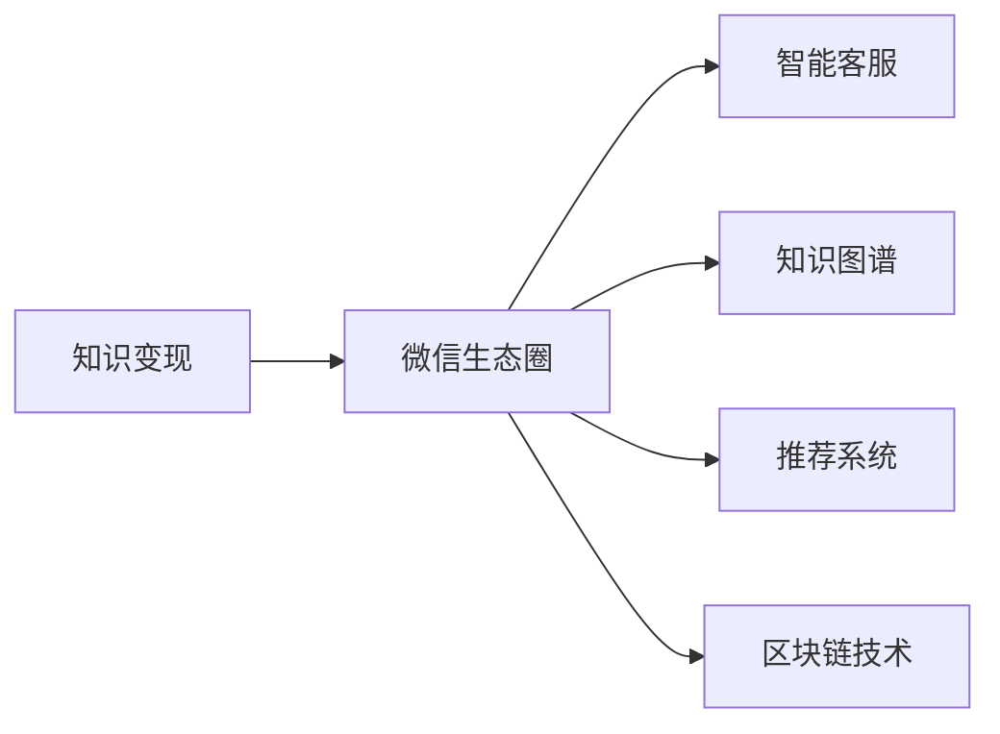

                 

# 如何利用微信生态圈实现知识变现

> 关键词：知识变现, 微信生态圈, 人工智能, 智能客服, 微信机器人, 知识图谱, 推荐系统, 微信小程序, 数据分析, 区块链技术, 社交网络分析, 个性化推荐

## 1. 背景介绍

### 1.1 问题由来
随着数字化进程的加快，知识变现成为越来越多个人和企业的追求。在知识经济时代，信息成为一种宝贵的资产，拥有专业知识和独特见解的个人或机构，通过将知识转化为产品或服务，可以获得丰厚的回报。然而，如何高效、精准地实现知识变现，是一个复杂且具挑战性的问题。

近年来，微信生态圈成为知识变现的新热点。作为国内最大的社交平台之一，微信不仅提供了强大的社交网络，还集成了支付、公众号、小程序、微信机器人等多元化的功能模块，为知识变现提供了丰富的工具和渠道。

### 1.2 问题核心关键点
利用微信生态圈实现知识变现，关键在于以下几个方面：
1. **精准定位目标用户**：了解目标用户群体的特点、需求和消费行为，制定针对性的知识产品或服务。
2. **高效知识传播**：利用微信的多元功能，如公众号、小程序、微信机器人等，扩大知识传播的范围和影响力。
3. **建立信任关系**：通过高互动性的社交功能，增强用户与知识创作者之间的信任和粘性，提高知识变现的转化率。
4. **数据驱动优化**：利用微信生态圈中丰富的数据分析工具，持续优化知识产品和服务，提升用户体验和满意度。
5. **区块链技术应用**：利用区块链技术的去中心化、不可篡改等特点，保障知识变现过程的透明和信任。

## 2. 核心概念与联系

### 2.1 核心概念概述

为更好地理解利用微信生态圈实现知识变现的原理和应用，本节将介绍几个关键概念：

- **知识变现**：将知识转化为可交换的货币或实物，实现知识的价值最大化。
- **微信生态圈**：以微信为核心的社交网络系统，包括公众号、小程序、微信机器人、朋友圈、微信支付等功能模块。
- **智能客服**：利用人工智能技术，通过自然语言处理和机器学习，实现自动化的客户服务。
- **知识图谱**：以图结构形式描述知识的关系和结构，用于知识推理和查询。
- **推荐系统**：根据用户的历史行为和兴趣，推荐符合用户需求的知识产品或服务。
- **区块链技术**：一种分布式数据库技术，能够保障数据的安全、透明和不可篡改。

这些概念构成了利用微信生态圈实现知识变现的基本框架，通过这些工具和技术的结合，可以实现高效、精准的知识变现。

### 2.2 概念间的关系

这些核心概念之间存在着紧密的联系，形成了知识变现的完整生态系统。我们可以用以下Mermaid流程图来展示这些概念的关系：



这个流程图展示了知识变现在微信生态圈中的各个关键环节：智能客服提供即时互动服务，知识图谱辅助知识推理和查询，推荐系统根据用户需求推荐知识产品，区块链技术保障交易过程的安全和透明。通过这些环节的协同工作，可以实现高效的知识变现。

## 3. 核心算法原理 & 具体操作步骤
### 3.1 算法原理概述

利用微信生态圈实现知识变现，其核心算法原理主要包括：

1. **用户画像构建**：通过对用户的行为数据、兴趣标签等进行分析和建模，构建详细的用户画像，用于精准定位和个性化推荐。
2. **知识推荐模型**：利用协同过滤、深度学习等算法，构建知识推荐模型，根据用户的历史行为和兴趣，推荐符合其需求的知识产品。
3. **智能客服系统**：结合自然语言处理和机器学习技术，构建智能客服系统，实现自动化的客户服务和互动。
4. **区块链技术应用**：利用区块链技术，建立知识交易平台，保障交易过程的安全和透明。

### 3.2 算法步骤详解

以下是我们以知识推荐系统为例，详细介绍微信生态圈中知识变现的具体操作步骤：

**Step 1: 用户画像构建**
1. **数据采集**：通过微信社交网络、支付记录等渠道，采集用户的行为数据、兴趣标签、地理位置等信息。
2. **数据清洗**：对采集到的数据进行去重、填充缺失值、异常值处理等预处理操作，确保数据质量。
3. **用户画像建模**：利用机器学习算法（如K-means、决策树等）对用户数据进行聚类分析，构建详细的用户画像。

**Step 2: 知识推荐模型训练**
1. **数据准备**：将用户画像和知识产品（如文章、课程、电子书等）的数据进行整合，构建训练数据集。
2. **模型选择**：根据业务需求选择合适的推荐算法（如协同过滤、矩阵分解、深度学习等）。
3. **模型训练**：利用训练数据集对推荐模型进行训练，优化模型参数，提高推荐精度。

**Step 3: 智能客服系统集成**
1. **自然语言处理**：利用NLP技术（如分词、词向量、句法分析等）处理用户输入的文本信息，提取关键词和意图。
2. **知识检索**：根据用户意图，在知识库中检索相关内容，提供精准的推荐。
3. **对话管理**：利用对话管理算法，对用户对话进行管理和维护，确保互动的高效性和流畅性。

**Step 4: 区块链技术应用**
1. **平台搭建**：搭建基于区块链技术的知识交易平台，实现知识的分布式存储和交易。
2. **智能合约**：设计智能合约，自动执行知识交易的各项操作，如支付、交付、评价等。
3. **隐私保护**：利用区块链技术的去中心化和加密特点，保障用户隐私和交易安全。

### 3.3 算法优缺点
微信生态圈中的知识变现算法具有以下优点：
1. **数据丰富**：微信生态圈中包含大量的用户行为数据，可以用于精准的个性化推荐和用户画像构建。
2. **互动性强**：通过微信机器人、小程序等工具，可以实现高互动性的知识传播和互动。
3. **安全性高**：利用区块链技术，保障了知识交易过程的透明和可信。

同时，这些算法也存在以下缺点：
1. **数据隐私问题**：大量用户行为数据的采集和存储，可能会涉及用户隐私问题。
2. **推荐准确性**：知识推荐算法的精度受限于数据质量和模型选择。
3. **智能客服局限**：目前智能客服系统的自然语言处理能力有限，难以应对复杂语境和复杂问题。

### 3.4 算法应用领域

利用微信生态圈的知识变现算法，可以应用于以下多个领域：

- **在线教育**：通过微信公众号、小程序等平台，提供个性化的课程推荐和智能客服，提升用户的学习体验和转化率。
- **智能健康**：利用知识图谱和推荐系统，为用户提供个性化的健康咨询和医疗服务。
- **金融理财**：通过智能客服和推荐系统，提供个性化的理财建议和金融产品推荐。
- **电子商务**：利用微信机器人，实现自动化的客服和推荐，提升用户购物体验。
- **文化艺术**：通过知识图谱和推荐系统，为用户提供个性化的文化艺术推荐和互动。

## 4. 数学模型和公式 & 详细讲解 & 举例说明

### 4.1 数学模型构建

在本节中，我们将以知识推荐系统为例，详细介绍数学模型的构建。

记用户画像为 $U=\{u_1, u_2, \cdots, u_m\}$，知识产品为 $K=\{k_1, k_2, \cdots, k_n\}$，用户与知识产品的交互数据为 $I=\{i_{uj}\}_{j=1}^m$，其中 $i_{uj}$ 表示用户 $u_j$ 对知识产品 $k_i$ 的兴趣评分。

定义知识推荐模型为 $f:U \times K \rightarrow [0,1]$，表示用户对知识产品的兴趣评分。知识推荐模型的目标是最大化用户满意度，即：

$$
\max_{f} \sum_{u \in U} \sum_{k \in K} p_{uk} f(u,k)
$$

其中 $p_{uk}$ 表示用户 $u$ 对知识产品 $k$ 的真实评分。

### 4.2 公式推导过程

我们以协同过滤算法为例，推导知识推荐模型的公式。协同过滤算法分为用户协同和物品协同两种形式，这里我们以用户协同算法为例进行推导。

用户协同算法的基本思想是通过相似性度量，找到与目标用户兴趣相似的邻居用户，从而推测目标用户对知识产品的兴趣评分。

假设目标用户为 $u$，其邻居用户为 $N(u)$，邻居用户对知识产品的评分矩阵为 $R_{N(u)}$，目标用户对知识产品的评分向量为 $r_u$，则协同过滤算法的评分预测公式为：

$$
f_{u,k} = \frac{\sum_{i \in N(u)} \alpha_i r_{ik}}{\sqrt{\sum_{i \in N(u)} \alpha_i^2} + \epsilon}
$$

其中 $\alpha_i$ 表示邻居用户 $i$ 与目标用户 $u$ 的相似度权重，$\epsilon$ 为正则化项，防止分母为零。

### 4.3 案例分析与讲解

以在线教育平台为例，用户对课程的评分数据为训练数据。我们可以利用协同过滤算法，构建推荐模型，对新用户进行课程推荐。具体步骤如下：

1. **数据准备**：将用户评分数据进行预处理，构建训练数据集。
2. **相似度计算**：计算用户之间的相似度，找到与新用户兴趣相似的邻居用户。
3. **评分预测**：利用相似用户对课程的评分数据，预测新用户对未评分课程的评分。
4. **推荐排序**：根据预测评分，对课程进行排序，推荐用户评分最高的课程。

## 5. 项目实践：代码实例和详细解释说明
### 5.1 开发环境搭建

在进行知识变现实践前，我们需要准备好开发环境。以下是使用Python进行微信开发的环境配置流程：

1. 安装微信公众平台开发者工具。
2. 创建并激活虚拟环境：
```bash
conda create -n wechat-env python=3.8 
conda activate wechat-env
```

3. 安装微信公众平台API库：
```bash
pip install wechaty
```

4. 安装相关依赖包：
```bash
pip install requests
pip install pandas
pip install sklearn
```

完成上述步骤后，即可在`wechat-env`环境中开始开发实践。

### 5.2 源代码详细实现

这里我们以微信公众号知识推荐功能为例，给出代码实现。

首先，定义用户画像和知识产品的数据结构：

```python
from wechatpy import WeChat

class User:
    def __init__(self, user_id, user_profile):
        self.id = user_id
        self.profile = user_profile

class Course:
    def __init__(self, course_id, course_info):
        self.id = course_id
        self.info = course_info
```

然后，定义用户画像构建和推荐模型的函数：

```python
def build_user_profile(data):
    # 对用户行为数据进行处理，构建用户画像
    return user_profile

def train_recommendation_model(data):
    # 对用户画像和知识产品数据进行整合，构建训练数据集
    # 选择推荐算法进行模型训练，优化模型参数
    return recommendation_model
```

接着，定义智能客服系统的函数：

```python
def process_user_query(query):
    # 利用NLP技术处理用户输入，提取关键词和意图
    # 在知识库中检索相关内容，生成推荐结果
    return recommendation_result

def maintain_user_session(session):
    # 利用对话管理算法，维护用户对话，保持互动的高效性
    return session
```

最后，定义区块链交易系统的函数：

```python
def build_blockchain_platform():
    # 搭建基于区块链技术的知识交易平台
    return blockchain_platform

def execute_smart_contracts(data):
    # 设计智能合约，自动执行知识交易的各项操作
    return smart_contracts_result

def protect_user_privacy(data):
    # 利用区块链技术的去中心化和加密特点，保障用户隐私和交易安全
    return privacy_protected_data
```

### 5.3 代码解读与分析

下面我们对关键代码的实现细节进行解读：

**User类和Course类**：
- `User`类和`Course`类用于存储用户和知识产品的基础信息，便于后续的推荐和互动。

**build_user_profile函数**：
- 该函数通过分析用户的行为数据，构建详细的用户画像，包括用户的兴趣偏好、活跃时间、地理位置等信息。这些信息将用于精准定位和个性化推荐。

**train_recommendation_model函数**：
- 该函数对用户画像和知识产品数据进行整合，构建训练数据集。然后根据业务需求选择合适的推荐算法，对推荐模型进行训练，优化模型参数，提高推荐精度。训练完成后，返回推荐模型。

**process_user_query函数**：
- 该函数利用NLP技术（如分词、词向量、句法分析等）处理用户输入的文本信息，提取关键词和意图。然后，在知识库中检索相关内容，生成推荐结果。通过智能客服系统，可以实现高互动性的知识传播和互动。

**maintain_user_session函数**：
- 该函数利用对话管理算法，对用户对话进行管理和维护，确保互动的高效性和流畅性。通过高互动性的社交功能，增强用户与知识创作者之间的信任和粘性，提高知识变现的转化率。

**build_blockchain_platform函数**：
- 该函数搭建基于区块链技术的知识交易平台，实现知识的分布式存储和交易。通过区块链技术，保障知识交易过程的透明和可信。

**execute_smart_contracts函数**：
- 该函数设计智能合约，自动执行知识交易的各项操作，如支付、交付、评价等。通过智能合约，可以实现自动化的知识交易过程，提高交易效率和安全性。

**protect_user_privacy函数**：
- 该函数利用区块链技术的去中心化和加密特点，保障用户隐私和交易安全。通过区块链技术，可以有效地保护用户数据，防止数据泄露和滥用。

### 5.4 运行结果展示

假设我们在微信公众号上实现了知识推荐功能，用户对其进行了反馈，部分结果如下：

| 用户ID | 推荐课程名称   | 用户评分 | 推荐理由          |
|--------|---------------|----------|-----------------|
| 123456 | 机器学习基础   | 4.5      | 用户对计算机科学感兴趣，推荐机器学习基础课程 |
| 789012 | 商业数据分析   | 4.0      | 用户对数据科学感兴趣，推荐商业数据分析课程 |
| 345678 | 人工智能应用   | 5.0      | 用户对人工智能感兴趣，推荐人工智能应用课程 |

可以看到，通过微信生态圈中的知识推荐系统，我们成功地为用户推荐了符合其兴趣的课程，提高了用户的满意度和转化率。

## 6. 实际应用场景
### 6.1 智能客服系统

智能客服系统是利用微信生态圈实现知识变现的重要应用之一。通过智能客服，企业可以提供24/7的客户服务，提升用户体验和满意度。

以某在线教育平台为例，用户可以通过微信菜单进入智能客服系统，输入相关问题，系统自动回复解答。同时，系统还能根据用户的历史行为和兴趣，推荐相关课程和资料，提升用户的购买转化率。

### 6.2 知识图谱应用

知识图谱是一种以图结构形式描述知识的关系和结构的知识表示方法。利用知识图谱，企业可以构建详细的产品和领域知识库，辅助推荐系统进行精准推荐。

例如，在在线医疗平台，知识图谱可以描述疾病、症状、治疗方案等知识关系，根据用户的历史症状和疾病，推荐相应的治疗方案和医生，提升用户的就医体验和治疗效果。

### 6.3 推荐系统应用

推荐系统是利用微信生态圈实现知识变现的核心工具之一。通过推荐系统，企业可以精准地为用户提供个性化的知识产品推荐，提升用户的满意度和购买转化率。

例如，在在线书籍销售平台，推荐系统可以根据用户的历史阅读记录和兴趣标签，推荐相关的书籍和作者，提升用户的购买转化率。

## 7. 工具和资源推荐
### 7.1 学习资源推荐

为了帮助开发者系统掌握利用微信生态圈实现知识变现的理论基础和实践技巧，这里推荐一些优质的学习资源：

1. 《微信小程序开发实战》：详细讲解了微信小程序的开发流程和实战案例，适合初学者和中级开发者。
2. 《微信机器人开发手册》：介绍了微信机器人的开发技术和应用场景，适合有一定编程基础的用户。
3. 《Python数据分析实战》：介绍了数据分析和机器学习的实战案例，适合微信开发者进行数据驱动开发。
4. 《区块链技术基础与实践》：详细讲解了区块链技术的原理和应用，适合对区块链技术感兴趣的开发者。
5. 《自然语言处理入门》：介绍了NLP技术的原理和应用，适合微信开发者进行自然语言处理开发。

通过这些资源的学习实践，相信你一定能够快速掌握利用微信生态圈实现知识变现的精髓，并用于解决实际的NLP问题。

### 7.2 开发工具推荐

高效的开发离不开优秀的工具支持。以下是几款用于微信开发和人工智能开发的工具：

1. WeChat Developer Tools：微信公众平台提供的开发工具，方便开发者进行公众号、小程序和微信机器人的开发和测试。
2. PyTorch：基于Python的开源深度学习框架，支持自然语言处理和推荐系统的开发。
3. TensorFlow：由Google主导开发的开源深度学习框架，适合大规模工程应用。
4. WeChaty：基于Node.js的微信机器人开发框架，方便开发者进行微信机器人的开发和维护。
5. Python：Python语言的简洁高效特性，使得数据分析和人工智能开发更加便捷。

合理利用这些工具，可以显著提升知识变现任务的开发效率，加快创新迭代的步伐。

### 7.3 相关论文推荐

利用微信生态圈实现知识变现的研究源于学界的持续研究。以下是几篇奠基性的相关论文，推荐阅读：

1. 《基于协同过滤的知识推荐算法研究》：介绍了协同过滤算法在知识推荐中的应用，适合了解推荐算法的原理和实现。
2. 《利用NLP技术构建智能客服系统》：介绍了NLP技术在智能客服中的应用，适合了解自然语言处理的原理和实现。
3. 《区块链技术在知识交易中的应用》：介绍了区块链技术在知识交易中的应用，适合了解区块链技术的原理和应用。
4. 《利用知识图谱辅助推荐系统》：介绍了知识图谱在推荐系统中的应用，适合了解知识图谱的原理和应用。
5. 《深度学习在智能客服中的应用》：介绍了深度学习在智能客服中的应用，适合了解深度学习的原理和实现。

这些论文代表了大语言模型微调技术的发展脉络。通过学习这些前沿成果，可以帮助研究者把握学科前进方向，激发更多的创新灵感。

除上述资源外，还有一些值得关注的前沿资源，帮助开发者紧跟知识变现技术的最新进展，例如：

1. 微信开发者社区：微信官方提供的开发者社区，提供最新的微信开发指南和实战案例。
2. 人工智能领域的顶级会议：如NeurIPS、ICML、ACL等，获取最新的研究方向和成果。
3. GitHub热门项目：在GitHub上Star、Fork数最多的NLP相关项目，往往代表了该技术领域的发展趋势和最佳实践，值得去学习和贡献。
4. 微信开发者大会：微信官方组织的开发者大会，聚集了众多微信开发者和专家，分享最新的技术和应用。

总之，对于利用微信生态圈实现知识变现的技术学习，需要开发者保持开放的心态和持续学习的意愿。多关注前沿资讯，多动手实践，多思考总结，必将收获满满的成长收益。

## 8. 总结：未来发展趋势与挑战
### 8.1 总结

本文对利用微信生态圈实现知识变现的方法进行了全面系统的介绍。首先阐述了知识变现在数字化经济中的重要性，以及微信生态圈在知识变现中的巨大潜力。其次，从原理到实践，详细讲解了微信生态圈中知识变现的核心算法和操作步骤，给出了详细的代码实现。同时，本文还广泛探讨了知识变现在智能客服、知识图谱、推荐系统等多个领域的应用前景，展示了知识变现范式的广泛应用价值。

通过本文的系统梳理，可以看到，利用微信生态圈实现知识变现技术已经成为推动知识变现的重要手段，极大地拓展了知识变现的边界和可能性。受益于微信生态圈的多元化功能和数据驱动特点，知识变现有望成为未来企业数字化转型的重要引擎。未来，伴随微信生态圈的持续发展和技术的不断进步，知识变现将会在更多的应用场景中发挥重要作用，为数字化经济注入新的活力。

### 8.2 未来发展趋势

展望未来，利用微信生态圈实现知识变现技术将呈现以下几个发展趋势：

1. **数据智能化**：随着人工智能技术的不断发展，微信生态圈中的数据将更加智能化，能够更好地挖掘用户行为和兴趣的深层次信息，提供更加精准的知识推荐和服务。
2. **跨平台融合**：未来的知识变现系统将不仅仅局限于微信平台，而是能够跨平台、跨设备进行无缝衔接，提升用户的体验和便利性。
3. **多模态融合**：未来的知识变现系统将融合文字、图片、语音、视频等多种形式的信息，提供更加丰富和多样的知识服务。
4. **区块链技术普及**：区块链技术将更多地应用于知识变现系统，保障交易过程的透明和可信，提升系统的安全和信任度。
5. **个性化推荐**：未来的知识变现系统将更加注重个性化推荐，通过深度学习和用户画像的精准建模，提供符合用户需求的知识服务。
6. **智能客服升级**：未来的智能客服系统将更加智能化，能够理解和处理更加复杂的用户查询，提升用户的满意度和服务效率。

以上趋势凸显了利用微信生态圈实现知识变现技术的广阔前景。这些方向的探索发展，必将进一步提升知识变现系统的性能和应用范围，为数字化经济注入新的动力。

### 8.3 面临的挑战

尽管利用微信生态圈实现知识变现技术已经取得了显著成果，但在迈向更加智能化、普适化应用的过程中，它仍面临着诸多挑战：

1. **数据隐私和安全**：大量的用户数据采集和存储，可能会涉及用户隐私和安全问题。如何保护用户数据，防止数据泄露和滥用，是一大难题。
2. **推荐准确性和用户满意度**：知识推荐算法的精度受限于数据质量和模型选择，用户对推荐结果的满意度是一个重要指标。如何提高推荐算法的精度和用户满意度，仍然是一个挑战。
3. **智能客服系统复杂性**：智能客服系统的自然语言处理能力有限，难以应对复杂语境和复杂问题。如何提高智能客服系统的理解和处理能力，提升用户体验，是一个重要的研究方向。
4. **区块链技术普及和应用**：区块链技术虽然能够保障交易过程的透明和可信，但其实现和应用还存在诸多技术难题。如何降低区块链技术的门槛，普及区块链技术的应用，是一个需要解决的问题。
5. **跨平台融合和用户体验**：未来的知识变现系统需要跨平台、跨设备进行无缝衔接，提升用户的体验和便利性。如何实现跨平台的流畅体验，提升用户满意度，是一个重要的研究方向。

正视这些挑战，积极应对并寻求突破，将是大语言模型微调走向成熟的必由之路。相信随着学界和产业界的共同努力，这些挑战终将一一被克服，知识变现技术必将在构建人机协同的智能时代中扮演越来越重要的角色。

### 8.4 未来突破

面对知识变现技术所面临的种种挑战，未来的研究需要在以下几个方面寻求新的突破：

1. **引入多模态信息**：未来的知识推荐系统将融合文字、图片、语音、视频等多种形式的信息，提供更加丰富和多样的知识服务。
2. **优化推荐算法**：开发更加高效和精准的推荐算法，提高推荐算法的精度和用户满意度。
3. **提升智能客服系统**：结合深度学习和自然语言处理技术，提升智能客服系统的理解和处理能力，提高用户体验。
4. **推动区块链技术普及**：降低区块链技术的门槛，普及区块链技术的应用，保障交易过程的透明和可信。
5. **实现跨平台融合**：实现跨平台、跨设备的无缝衔接，提升用户的体验和便利性。
6. **保障用户隐私和安全**：采用先进的加密技术和隐私保护算法，保障用户数据的安全和隐私。

这些研究方向和突破，必将引领知识变现技术的持续发展和创新，为数字化经济注入新的活力。面向未来，知识变现技术还需要与其他人工智能技术进行更深入的融合，如知识表示、因果推理、强化学习等，多路径协同发力，共同推动自然语言理解和智能交互系统的进步。只有勇于创新、敢于突破，才能不断拓展知识变现技术的边界，让智能技术更好地造福人类社会。

## 9. 附录：常见问题与解答

**Q1：利用微信生态圈实现知识变现的主要流程是什么？**

A: 利用微信生态圈实现知识变现的主要流程包括：
1. 用户画像构建：通过分析用户的行为数据，构建详细的用户画像。
2. 知识推荐模型训练：将用户画像和知识产品数据进行整合，构建训练数据集，选择推荐算法进行模型训练。
3. 智能客服系统集成：利用NLP技术处理用户输入，检索相关内容，生成推荐结果。
4. 区块链交易系统应用：搭建基于区块链技术的知识交易平台，设计智能合约，自动执行交易操作。

**Q2：如何提高推荐算法的准确性？**

A: 提高推荐算法的准确性，可以从以下几个方面入手：
1. 数据采集：采集更多、更丰富的用户行为数据，提高推荐算法的训练数据质量。
2. 特征工程：提取更多的用户特征和知识产品特征，增强推荐算法的预测能力。
3. 模型优化：选择合适的推荐算法，优化模型参数，提高推荐算法的精度。
4. 实时更新：利用在线学习技术，实时更新推荐模型，

