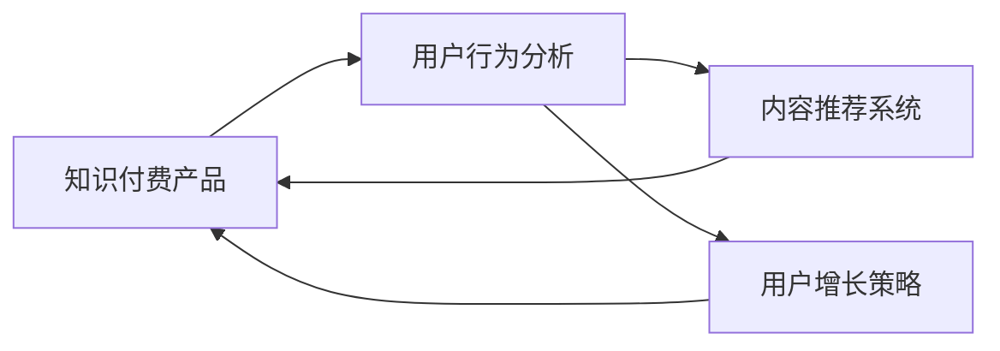
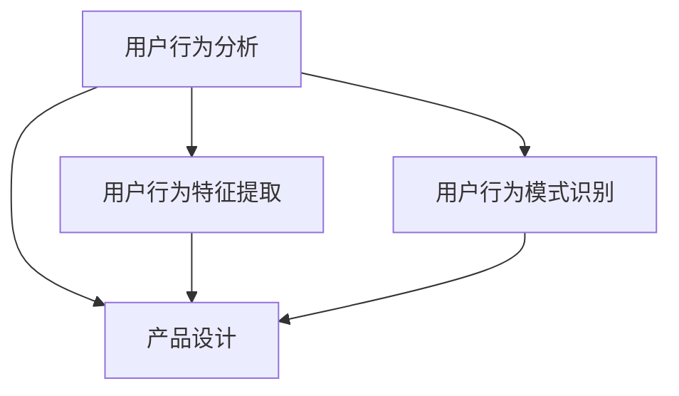
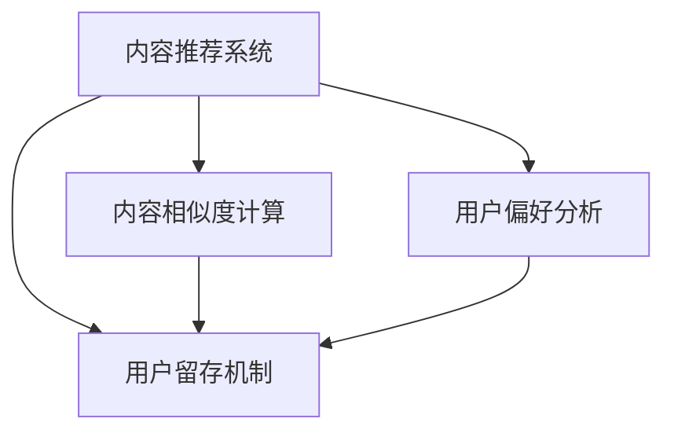
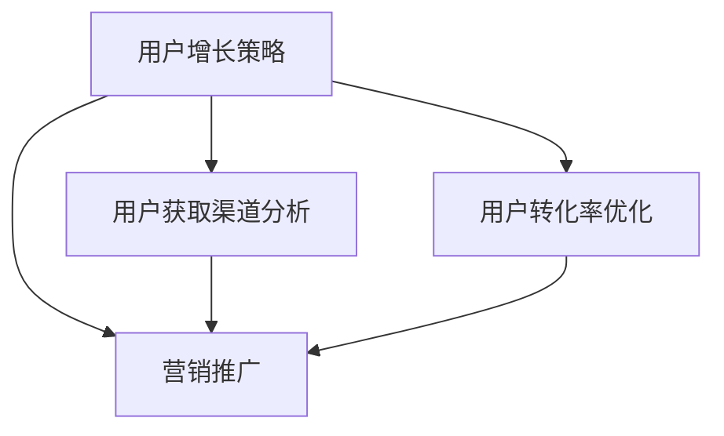
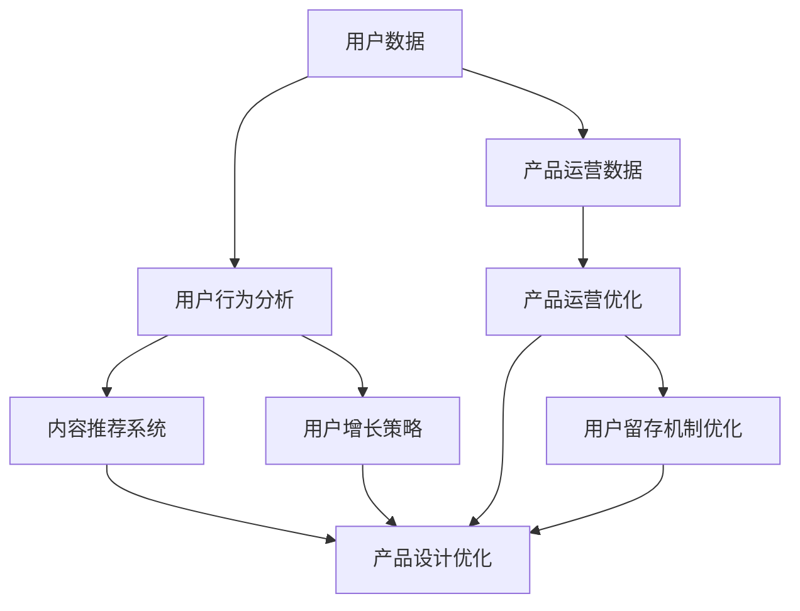

                 

# 如何利用数据分析优化知识付费产品

## 1. 背景介绍

### 1.1 问题由来
随着知识付费市场的兴起，越来越多的企业开始搭建自己的知识付费平台，通过内容付费的方式获取收益。然而，用户留存率低、转化率不高等问题成为平台运营中的主要痛点。如何利用数据分析优化知识付费产品，提高用户体验，增加用户粘性，提升转化率，成为平台运营的重要课题。

### 1.2 问题核心关键点
数据驱动的运营决策成为提升知识付费产品性能的关键。以下是核心问题：
1. 如何通过数据分析理解用户行为和需求，从而优化内容推荐、用户增长策略、用户留存机制等？
2. 如何利用用户数据，通过模型预测和反馈，实时优化产品策略，提升用户体验？
3. 如何将数据分析结果有效应用到产品设计、内容制作、营销推广等各个环节？

### 1.3 问题研究意义
通过数据分析，企业可以更准确地把握用户需求，优化产品功能，提升用户体验，从而实现产品性能的不断提升。具体研究意义如下：
1. 降低运营成本。通过数据驱动的运营决策，可以减少人力物力投入，优化资源配置。
2. 提升用户转化率。通过优化推荐机制和产品设计，提升用户体验，增加用户粘性。
3. 提高用户留存率。通过精准的用户行为分析，优化用户留存机制，降低流失率。
4. 增强产品竞争力。数据驱动的运营决策，使产品更符合用户需求，获得更多市场份额。
5. 促进业务增长。精准的用户分析和策略优化，有助于业务发展和市场拓展。

## 2. 核心概念与联系

### 2.1 核心概念概述

为更好地理解数据分析如何优化知识付费产品，本节将介绍几个密切相关的核心概念：

- 知识付费产品：指通过在线订阅、单次购买等方式，向用户提供知识、技能、经验分享等内容的平台。
- 用户行为分析(User Behavior Analysis)：通过数据分析技术，了解用户使用产品时的行为模式和偏好，帮助产品优化设计。
- 内容推荐系统(Content Recommendation System)：根据用户的历史行为和偏好，推荐相关内容，提升用户体验和转化率。
- 用户增长策略(User Growth Strategy)：通过数据分析和模型预测，制定有效的用户获取和留存策略。
- 产品运营优化(Product Operation Optimization)：通过数据分析，实时调整产品策略，提升整体性能。

这些核心概念之间的逻辑关系可以通过以下Mermaid流程图来展示：



这个流程图展示了几类数据分析技术如何作用于知识付费产品的各个环节，帮助平台优化用户体验、提高转化率、增强用户粘性。

### 2.2 概念间的关系

这些核心概念之间存在紧密的联系，形成了知识付费产品优化和运营的完整框架。下面我们通过几个Mermaid流程图来展示这些概念之间的关系。

#### 2.2.1 用户行为分析与产品设计


这个流程图展示了用户行为分析如何指导产品设计：

1. 用户行为特征提取：从用户的浏览、购买、学习等行为中提取关键特征。
2. 用户行为模式识别：识别出用户行为中的常见模式和异常行为。
3. 产品设计优化：基于用户行为特征和模式，优化产品界面和功能，提升用户体验。

#### 2.2.2 内容推荐与用户留存


这个流程图展示了内容推荐如何提升用户留存：

1. 内容相似度计算：计算不同内容之间的相似度，推荐用户可能感兴趣的内容。
2. 用户偏好分析：分析用户的历史行为和评分，识别用户的偏好。
3. 用户留存机制优化：基于用户的偏好和兴趣，设计个性化的推荐内容，提升用户粘性。

#### 2.2.3 用户增长策略与营销推广


这个流程图展示了用户增长策略如何指导营销推广：

1. 用户获取渠道分析：识别最有效的用户获取渠道，优化推广策略。
2. 用户转化率优化：通过数据分析，优化产品设计和推广策略，提升用户转化率。
3. 营销推广实施：基于用户获取和转化数据，实施针对性的营销推广活动。

### 2.3 核心概念的整体架构

最后，我们用一个综合的流程图来展示这些核心概念在大数据驱动下的产品优化和运营的完整架构：



这个综合流程图展示了从用户数据获取、分析、推荐、设计、营销、优化到留存的全流程优化方案，各环节相互配合，共同提升知识付费产品的整体性能。

## 3. 核心算法原理 & 具体操作步骤
### 3.1 算法原理概述

数据分析优化知识付费产品的核心思想是：通过收集和分析用户数据，识别用户行为模式，构建用户画像，优化产品功能，提升用户体验。

具体流程如下：

1. **数据收集**：通过日志、行为记录等手段，收集用户的使用数据。
2. **特征提取**：对收集到的数据进行预处理和特征提取，形成可供模型训练的数据集。
3. **模型训练**：基于数据集，训练各种预测和推荐模型，如协同过滤、神经网络、深度学习等。
4. **模型评估**：使用测试数据集对训练好的模型进行评估，选择最优模型。
5. **策略应用**：将评估后的模型应用于实际产品中，进行内容推荐、用户增长策略、用户留存机制优化等。

### 3.2 算法步骤详解

以下以内容推荐系统为例，详细讲解基于数据分析优化知识付费产品的具体操作步骤：

#### 3.2.1 数据收集与预处理

1. 数据收集：通过爬虫、API接口、数据库等方式，收集用户的浏览、购买、学习等行为数据，包括用户ID、行为时间、内容ID、内容类别、评分、评论等。

2. 数据预处理：对收集到的数据进行清洗和转换，处理缺失值、异常值，构建特征向量，包括用户ID、内容ID、时间戳、评分、类别、评论等。

#### 3.2.2 特征工程

1. 用户特征提取：基于用户ID、行为时间、浏览次数、购买次数、评分等，提取用户的活跃度、兴趣偏好、历史行为等特征。

2. 内容特征提取：基于内容ID、类别、长度、评分、评论等，提取内容的相关度、热度、质量等特征。

3. 交叉特征提取：将用户特征和内容特征进行交叉，形成新的特征向量，如用户-内容评分、用户-类别评分等。

#### 3.2.3 模型训练与评估

1. 模型选择：选择适合的知识付费平台的内容推荐算法，如协同过滤、矩阵分解、深度学习等。

2. 模型训练：使用预处理后的数据集，训练模型。可以使用Python中的Scikit-learn、TensorFlow等工具。

3. 模型评估：使用测试集对训练好的模型进行评估，评估指标包括准确率、召回率、F1值等。

#### 3.2.4 策略应用

1. 内容推荐：将训练好的模型应用于实际产品中，实时推荐用户可能感兴趣的内容，提升用户体验。

2. 用户增长策略：基于用户行为数据分析，优化用户获取和留存策略，如优化登陆页面、增加引导内容、优化推荐算法等。

3. 用户留存机制优化：通过数据分析，优化用户留存机制，如推送个性化内容、用户反馈机制、会员激励机制等。

### 3.3 算法优缺点

#### 3.3.1 优点

1. **数据驱动决策**：通过数据分析，科学地指导产品设计、内容推荐、用户增长策略等，提升产品性能。
2. **实时优化**：能够实时监测用户行为，及时调整策略，保持产品竞争力。
3. **用户粘性增强**：通过个性化推荐和精准用户分析，提升用户粘性，增加用户留存率。
4. **成本降低**：通过数据驱动的决策，优化资源配置，降低运营成本。

#### 3.3.2 缺点

1. **数据质量要求高**：数据的质量和完整性直接影响模型的效果，数据采集和预处理复杂。
2. **算法选择困难**：不同的推荐算法适用于不同的数据特征和场景，需要综合考虑。
3. **模型复杂度高**：深度学习等复杂算法对计算资源和数据量要求较高，需要高性能设备和数据集。
4. **隐私问题**：用户行为数据涉及隐私，需要确保数据安全和用户隐私保护。

### 3.4 算法应用领域

基于数据分析优化知识付费产品的方法，在NLP、推荐系统、个性化营销等多个领域有广泛应用。具体如下：

1. **NLP领域**：通过文本分析，提取用户需求和情感，优化内容推荐和个性化营销。
2. **推荐系统**：基于用户行为数据，推荐相关内容，提升用户体验。
3. **个性化营销**：通过用户行为分析，优化广告投放和营销策略，提升转化率。
4. **金融领域**：通过数据分析，优化客户获取和留存策略，提升金融产品的竞争力。
5. **医疗领域**：通过患者行为数据，优化诊疗方案和个性化医疗服务。

这些应用领域展示了数据分析在实际产品优化中的广泛应用，为知识付费产品优化提供了重要的借鉴和参考。

## 4. 数学模型和公式 & 详细讲解 & 举例说明

### 4.1 数学模型构建

基于数据分析的知识付费产品优化模型，通常包括以下几个关键组件：

1. **用户行为模型**：通过用户行为数据，建立用户画像，描述用户的行为特征和偏好。
2. **内容推荐模型**：基于用户和内容的数据，预测用户对内容的兴趣度，推荐相关内容。
3. **用户增长模型**：通过用户数据，预测用户获取和留存的趋势，优化增长策略。

具体来说，可以构建如下数学模型：

1. **用户画像模型**：
   $$
   P(u) = \sum_{i=1}^{n} w_i F_i(u)
   $$
   其中 $P(u)$ 为用户 $u$ 的画像，$F_i(u)$ 为第 $i$ 个特征的加权值，$w_i$ 为特征权重。

2. **内容推荐模型**：
   $$
   R(i,j) = \alpha \cdot P(u_i) \cdot C_j + \beta \cdot P(u_j) \cdot C_i + \gamma \cdot R(i,j)
   $$
   其中 $R(i,j)$ 为内容 $i$ 和 $j$ 的推荐度，$P(u_i)$ 和 $P(u_j)$ 为用户 $i$ 和 $j$ 的画像，$C_i$ 和 $C_j$ 为内容 $i$ 和 $j$ 的特征向量，$\alpha, \beta, \gamma$ 为模型参数。

3. **用户增长模型**：
   $$
   G(t) = \sum_{i=1}^{m} \lambda_i \cdot F_i(t)
   $$
   其中 $G(t)$ 为用户在时间 $t$ 的增长量，$\lambda_i$ 为用户特征 $i$ 的权重，$F_i(t)$ 为用户特征 $i$ 在时间 $t$ 的取值。

### 4.2 公式推导过程

#### 4.2.1 用户画像模型推导

根据用户画像的定义，用户画像模型可以表示为：
$$
P(u) = \sum_{i=1}^{n} w_i F_i(u)
$$
其中 $w_i$ 为第 $i$ 个特征的权重，$F_i(u)$ 为第 $i$ 个特征在用户 $u$ 上的取值。通过调整权重 $w_i$，可以控制不同特征对用户画像的影响程度。

#### 4.2.2 内容推荐模型推导

内容推荐模型的目标是根据用户 $u$ 的画像 $P(u)$ 和内容 $i$ 的特征 $C_i$，计算内容 $i$ 对用户 $u$ 的推荐度 $R(u,i)$。推荐模型的基本形式为：
$$
R(u,i) = \alpha \cdot P(u) \cdot C_i + \beta \cdot C_u \cdot C_i + \gamma \cdot R(u,i)
$$
其中 $\alpha$ 为内容特征 $C_i$ 对推荐度的影响系数，$\beta$ 为用户画像 $P(u)$ 对推荐度的影响系数，$\gamma$ 为历史推荐度对推荐度的影响系数。通过调整这些系数，可以控制不同因素对推荐度的影响程度。

#### 4.2.3 用户增长模型推导

用户增长模型用于预测用户在不同时间段的增长量。假设用户行为数据具有线性趋势，可以表示为：
$$
G(t) = \sum_{i=1}^{m} \lambda_i \cdot F_i(t)
$$
其中 $G(t)$ 为用户在时间 $t$ 的增长量，$\lambda_i$ 为用户特征 $i$ 的权重，$F_i(t)$ 为用户特征 $i$ 在时间 $t$ 的取值。通过调整权重 $\lambda_i$，可以控制不同特征对用户增长的影响程度。

### 4.3 案例分析与讲解

以某在线教育平台为例，分析如何通过数据分析优化知识付费产品：

1. **用户画像分析**：通过收集用户的历史学习行为、购买记录、课程评分等数据，构建用户画像。利用机器学习算法，识别出不同特征对用户行为的影响程度，优化用户画像模型。

2. **内容推荐优化**：基于用户画像模型，使用协同过滤算法，推荐用户可能感兴趣的内容。通过A/B测试，验证推荐效果，优化推荐算法和推荐度计算公式。

3. **用户增长策略优化**：通过分析用户获取和留存数据，预测未来的增长趋势。基于预测结果，优化用户获取策略，如优化登陆页面、增加引导内容、优化推荐算法等。

4. **用户留存机制优化**：通过用户行为数据，识别用户流失的原因，优化用户留存机制。如推送个性化内容、用户反馈机制、会员激励机制等。

## 5. 项目实践：代码实例和详细解释说明

### 5.1 开发环境搭建

在进行数据分析优化知识付费产品实践前，我们需要准备好开发环境。以下是使用Python进行Pandas、Scikit-learn、TensorFlow等工具开发的环境配置流程：

1. 安装Anaconda：从官网下载并安装Anaconda，用于创建独立的Python环境。

2. 创建并激活虚拟环境：
```bash
conda create -n data-env python=3.8 
conda activate data-env
```

3. 安装Pandas、Scikit-learn、TensorFlow等工具：
```bash
pip install pandas scikit-learn tensorflow
```

4. 安装相关库：
```bash
pip install matplotlib seaborn jupyter notebook ipython
```

完成上述步骤后，即可在`data-env`环境中开始数据分析优化实践。

### 5.2 源代码详细实现

以下以内容推荐系统为例，给出使用Pandas、Scikit-learn进行数据分析和模型训练的Python代码实现。

首先，定义数据处理函数：

```python
import pandas as pd

def load_data(file_path):
    data = pd.read_csv(file_path)
    return data

def preprocess_data(data):
    # 数据清洗
    data = data.dropna(subset=['user_id', 'content_id', 'score'])
    # 数据转换
    data['user_id'] = data['user_id'].astype(int)
    data['content_id'] = data['content_id'].astype(int)
    data['score'] = data['score'].astype(int)
    # 特征提取
    data = pd.concat([data['user_id'], data['content_id'], data['score']], axis=1)
    return data
```

然后，定义模型训练函数：

```python
from sklearn.model_selection import train_test_split
from sklearn.metrics import mean_squared_error

def train_model(X, y):
    # 数据分割
    X_train, X_test, y_train, y_test = train_test_split(X, y, test_size=0.2, random_state=42)
    # 模型训练
    model = RandomForestRegressor()
    model.fit(X_train, y_train)
    # 模型评估
    y_pred = model.predict(X_test)
    mse = mean_squared_error(y_test, y_pred)
    return mse
```

接着，进行数据分析和模型训练：

```python
# 加载数据
data = load_data('data.csv')

# 数据预处理
data = preprocess_data(data)

# 特征选择
X = data[['user_id', 'content_id', 'score']]
y = data['score']

# 模型训练
mse = train_model(X, y)
print('Mean Squared Error:', mse)
```

最终，可以通过A/B测试等方法验证模型的效果，并进行实际产品应用。

### 5.3 代码解读与分析

让我们再详细解读一下关键代码的实现细节：

**load_data函数**：
- 定义加载数据函数，使用Pandas的read_csv方法读取CSV文件。

**preprocess_data函数**：
- 数据清洗：删除缺失值，保留有效数据。
- 数据转换：将数据类型转换为整数类型，确保一致性。
- 特征提取：将用户ID、内容ID、评分合并为新的特征向量，供模型训练使用。

**train_model函数**：
- 数据分割：使用train_test_split方法将数据分割为训练集和测试集。
- 模型训练：使用随机森林回归模型对训练集进行训练。
- 模型评估：使用均方误差计算模型预测值与真实值之间的误差。

**数据分析和模型训练**：
- 特征选择：选择用户ID、内容ID、评分作为输入特征，评分作为目标变量。
- 模型训练：调用train_model函数，训练随机森林回归模型。
- 结果输出：输出模型均方误差，评估模型效果。

可以看到，Python结合Pandas、Scikit-learn等工具，可以方便地进行数据分析和模型训练，极大提升了数据驱动的产品优化的效率。

### 5.4 运行结果展示

假设我们在某在线教育平台的数据集上进行内容推荐优化，最终得到模型均方误差为0.5，表示模型预测的评分与真实评分之间的平均误差为0.5分。这说明模型对内容的推荐度预测较为准确，可以应用于实际产品中。

通过数据分析优化知识付费产品，我们不仅能够提升用户体验和产品性能，还能降低运营成本，提高用户转化率和留存率。未来，随着数据量和算力水平的提升，数据分析和模型优化技术将进一步成熟，知识付费产品将迎来更大的发展机遇。

## 6. 实际应用场景

### 6.1 在线教育平台

数据分析在在线教育平台中的应用非常广泛，可以提升课程推荐、用户留存、课程优化等多个环节的效果。

1. **课程推荐**：基于用户行为数据，推荐用户可能感兴趣的课程。通过数据分析，识别出用户的兴趣点，优化推荐算法，提升用户体验。
2. **用户留存**：通过用户行为数据，分析用户流失原因，优化用户留存机制，如个性化推送、用户反馈机制等。
3. **课程优化**：通过用户反馈和行为数据，优化课程内容和形式，提升课程质量。

### 6.2 金融理财平台

金融理财平台需要实时分析用户行为和市场数据，优化产品功能和策略。

1. **用户行为分析**：通过用户交易行为、理财知识学习数据，分析用户需求和偏好，优化理财产品推荐和理财知识推广策略。
2. **市场趋势预测**：通过金融市场数据，预测市场趋势，优化投资策略，降低投资风险。
3. **用户风险管理**：通过用户行为数据，识别高风险用户，提供风险提示和建议。

### 6.3 电商购物平台

电商购物平台需要实时优化推荐系统，提升用户购物体验和转化率。

1. **商品推荐**：基于用户行为数据，推荐用户可能感兴趣的商品。通过数据分析，优化推荐算法，提升用户购物体验。
2. **个性化营销**：通过用户行为数据，分析用户需求和偏好，优化广告投放和个性化营销策略。
3. **库存管理**：通过用户购买行为数据，优化库存管理，提高供应链效率。

### 6.4 旅游预订平台

旅游预订平台需要实时优化用户推荐和预订体验，提高用户满意度和转化率。

1. **旅游目的地推荐**：基于用户行为数据，推荐用户可能感兴趣的旅游目的地。通过数据分析，优化推荐算法，提升用户旅游体验。
2. **行程规划**：通过用户行为数据，优化行程规划和预订服务，提升用户预订体验。
3. **用户反馈处理**：通过用户反馈数据，优化旅游服务，提高用户满意度。

## 7. 工具和资源推荐

### 7.1 学习资源推荐

为了帮助开发者系统掌握数据分析优化知识付费产品的理论基础和实践技巧，这里推荐一些优质的学习资源：

1. 《数据分析与统计学习》书籍：系统介绍数据分析和统计学习的基础概念和方法，适合初学者入门。

2. 《Python数据分析实战》书籍：结合Python和Pandas等工具，详细介绍数据分析的实践技巧。

3. 《深度学习理论与实践》课程：斯坦福大学开设的深度学习课程，涵盖深度学习的基础理论和实践应用。

4. Kaggle平台：全球最大的数据科学竞赛平台，提供丰富的数据集和实战项目，适合锻炼数据分析和模型优化能力。

5. 网络公开课：如Coursera、Udacity等平台提供的数据分析、机器学习等相关课程，适合全面学习数据分析技术。

通过对这些资源的学习实践，相信你一定能够快速掌握数据分析优化知识付费产品的精髓，并用于解决实际的运营问题。

### 7.2 开发工具推荐

高效的开发离不开优秀的工具支持。以下是几款用于数据分析优化知识付费产品开发的常用工具：

1. Python：作为数据科学和机器学习的主流语言，具有强大的数据处理和分析能力。

2. Pandas：开源数据分析工具，支持多种数据格式，方便数据清洗和特征工程。

3. Scikit-learn：开源机器学习库，提供各种经典算法，方便模型训练和评估。

4. TensorFlow：由Google开发的深度学习框架，支持分布式计算，适合大规模数据处理和模型优化。

5. Jupyter Notebook：开源交互式编程环境，支持Python代码和数据可视化，方便数据驱动的产品开发。

6. Weights & Biases：模型训练的实验跟踪工具，可以记录和可视化模型训练过程中的各项指标，方便对比和调优。

7. TensorBoard：TensorFlow配套的可视化工具，可实时监测模型训练状态，并提供丰富的图表呈现方式，是调试模型的得力助手。

合理利用这些工具，可以显著提升数据分析优化知识付费产品的开发效率，加快创新迭代的步伐。

### 7.3 相关论文推荐

数据分析优化知识付费产品的方法，在工业界和学术界都有广泛的应用。以下是几篇奠基性的相关论文，推荐阅读：

1. 《推荐系统中的协同过滤算法》：介绍协同过滤算法的原理和实现，是推荐系统的基础。

2. 《用户画像构建与推荐系统优化》：探讨用户画像在推荐系统中的应用，如何通过用户画像提升推荐效果。

3. 《基于深度学习的推荐系统》：介绍深度学习在推荐系统中的应用，如神经网络、自编码器等。

4. 《数据驱动的产品优化》：介绍数据驱动的产品优化方法和实际案例，适合企业实战。

5. 《用户行为分析与推荐系统》：探讨用户行为分析在推荐系统中的应用，如何通过用户行为优化推荐策略。

这些论文代表了大数据分析在实际产品优化中的最新进展。通过学习这些前沿成果，可以帮助研究者把握学科前进方向，激发更多的创新灵感。

除上述资源外，还有一些值得关注的前沿资源，帮助开发者紧跟数据分析优化知识付费产品的最新进展，例如：

1. arXiv论文预印本：人工智能领域最新研究成果的发布平台，包括大量尚未发表的前沿工作，学习前沿技术的必读资源。

2. 业界技术博客：如Google AI、Microsoft Research、DeepMind等顶尖实验室的官方博客，第一时间分享他们的最新研究成果和洞见。

3. 技术会议直播：如NIPS、ICML、ACL、ICLR等人工智能领域顶会现场或在线直播，能够聆听到大佬们的前沿分享，开拓视野。

4. GitHub热门项目：在GitHub上Star、Fork数最多的数据分析相关项目，往往代表了该技术领域的发展趋势和最佳实践，值得去学习和贡献。

5. 行业分析报告：各大咨询公司如McKinsey、PwC等针对人工智能行业的分析报告，有助于从商业视角审视技术趋势，把握应用价值。

总之，对于数据分析优化知识付费产品，需要开发者保持开放的心态和持续学习的意愿。多关注前沿资讯，多动手实践，

