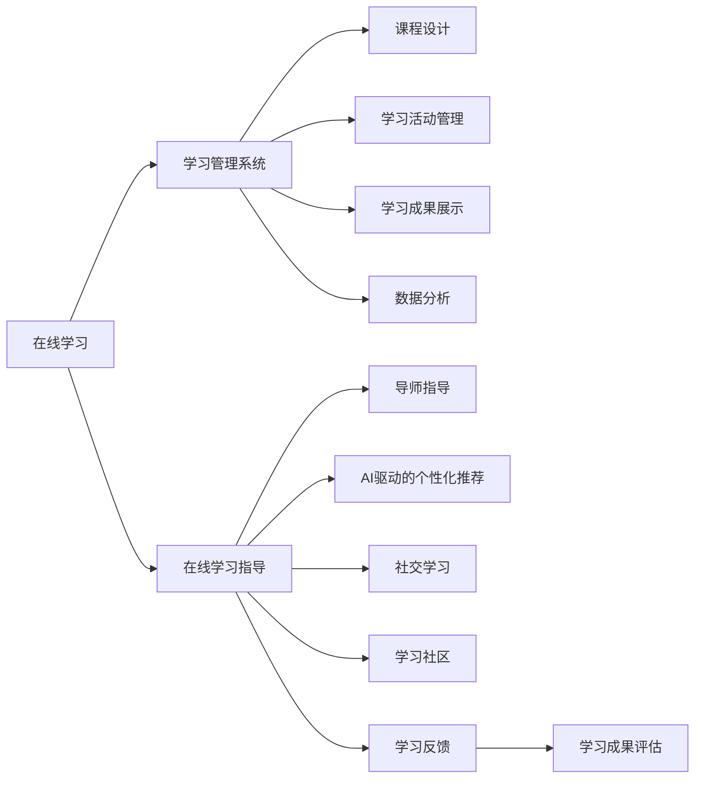

                 

# 如何利用知识付费实现在线学习与在线学习指导？

## 1. 背景介绍

### 1.1 问题由来
在信息技术迅猛发展的今天，知识付费已成为一种重要的学习方式。其背后的驱动力是用户对知识需求的多样化和个性化，以及互联网时代信息爆炸带来的获取知识成本的增加。

### 1.2 问题核心关键点
知识付费的核心在于如何利用互联网技术，提供优质、个性化、高效的学习资源和服务，满足用户的学习需求。在线学习和在线学习指导成为知识付费的重要模式，其关键是构建一个覆盖课程内容、学习进度、学习效果评估和交互式学习环境的生态系统。

## 2. 核心概念与联系

### 2.1 核心概念概述

为了深入探讨如何利用知识付费实现在线学习与在线学习指导，本节将详细介绍几个关键概念：

- **在线学习**：通过互联网平台，用户可以自主选择课程，按照自己的学习节奏进行学习，获取相关知识和技能。在线学习的关键在于构建一个高效、互动的学习环境，使用户能够在自学的同时，进行有效的知识交流和反馈。

- **在线学习指导**：在在线学习的过程中，由专业的导师或平台提供指导，帮助用户解决学习中的疑难问题，提高学习效率和质量。在线学习指导的实施依赖于良好的交互机制和评估体系，能够实时反馈学习效果。

- **知识付费**：通过订阅、购买等方式，用户支付一定的费用来获取知识和技能。知识付费模式的核心在于构建一个优质的内容生态，通过付费激励，提供高价值的教育资源。

- **学习管理系统(LMS)**：在线学习平台的核心技术支撑，用于管理学习资源、跟踪学习进度、评估学习效果等。LMS应具备课程设计、学习活动管理、学习成果展示、数据分析等功能。

- **AI驱动的个性化推荐**：利用人工智能技术，根据用户的学习行为、兴趣偏好和反馈信息，个性化推荐学习内容，提高学习效率和用户满意度。

- **社交学习**：鼓励用户之间的互动交流，构建学习社群，通过讨论、合作、竞赛等方式，激发学习兴趣，提升学习效果。

这些概念之间相互作用，共同构成了在线学习与在线学习指导的完整生态系统。下面，我们将通过一个Mermaid流程图来展示这些概念之间的关系：



## 3. 核心算法原理 & 具体操作步骤
### 3.1 算法原理概述

在线学习与在线学习指导的实施，依赖于以下几个关键算法的支撑：

- **推荐算法**：用于个性化推荐课程和学习资源，根据用户的学习行为、兴趣偏好和反馈信息，动态调整推荐策略。
- **学习进度追踪算法**：实时跟踪用户的学习进度，通过时间、任务、进度等指标评估学习效果，生成个性化学习路径。
- **学习效果评估算法**：对用户的学习成果进行量化评估，包括测验、作业、项目等，生成学习报告，提供反馈和改进建议。
- **交互式学习算法**：利用AI技术，在用户进行学习时提供即时反馈和指导，如智能答疑、学习路径优化等。
- **数据驱动的学习优化算法**：通过数据分析，挖掘用户学习行为中的模式，优化学习流程和内容，提高学习效率和效果。

### 3.2 算法步骤详解

具体算法步骤可以分为以下几个方面：

**Step 1: 准备在线学习资源**

- 收集高质量的课程资源，包括视频、音频、文本、互动练习等。
- 设计课程结构和学习目标，明确课程内容和任务。

**Step 2: 搭建学习管理系统**

- 开发或选择适合的学习管理系统，具备课程管理、学习进度跟踪、成绩管理等功能。
- 集成在线课程和资源，构建用户学习路径和互动环境。

**Step 3: 实施在线学习指导**

- 选择合适的导师或平台，提供专业化的学习指导。
- 利用AI技术，进行学习行为的分析和预测，个性化推荐学习资源。
- 建立学习社区，鼓励用户互动和协作学习。

**Step 4: 实时反馈和效果评估**

- 实时跟踪用户的学习进度，生成个性化学习报告。
- 通过测试、作业、项目等方式评估学习效果，提供反馈和改进建议。
- 根据评估结果，调整学习路径和内容。

**Step 5: 持续优化和学习支持**

- 利用数据分析，优化学习策略和资源。
- 定期收集用户反馈，不断改进学习指导和课程设计。

### 3.3 算法优缺点

在线学习与在线学习指导的算法具有以下优点：

- **灵活性和个性化**：用户可以自主选择课程和学习路径，个性化的推荐和学习路径，提高学习效率。
- **实时性和互动性**：实时反馈和互动指导，增强学习效果和用户体验。
- **可扩展性和可定制性**：灵活构建课程和互动环境，适应不同用户的学习需求。

同时，这些算法也存在一些缺点：

- **技术门槛高**：需要掌握复杂的技术和算法，如推荐算法、数据分析等。
- **用户数据隐私和安全**：大量用户数据的收集和处理，需要严格的数据保护措施。
- **课程质量参差不齐**：课程设计需要专业的知识和经验，课程质量需要严格把关。

### 3.4 算法应用领域

在线学习与在线学习指导的算法应用范围广泛，包括但不限于以下领域：

- **企业培训**：通过在线学习平台，提供员工培训和技能提升，优化企业知识管理。
- **高等教育**：在校园内推广在线课程和学习指导，丰富教学形式和内容。
- **职业发展**：帮助用户提升职业技能，通过在线课程和指导，实现职业转型和晋升。
- **终身学习**：鼓励用户进行持续学习，通过个性化推荐和指导，实现知识更新和自我提升。
- **语言学习**：通过在线语言课程和互动指导，提升语言学习效果，实现跨文化交流。

## 4. 数学模型和公式 & 详细讲解
### 4.1 数学模型构建

在线学习与在线学习指导的数学模型通常包括以下几个方面：

- **用户行为模型**：描述用户的学习行为，如学习时间、学习频率、互动次数等。
- **课程推荐模型**：基于用户行为和学习目标，构建推荐算法，推荐符合用户需求的学习资源。
- **学习效果评估模型**：对用户的学习成果进行量化评估，生成学习报告和反馈。
- **学习进度追踪模型**：跟踪用户的学习进度，生成个性化学习路径和计划。

### 4.2 公式推导过程

以课程推荐模型为例，可以采用协同过滤推荐算法，通过用户-课程矩阵，找到与用户兴趣相似的其他用户，推荐其学习过的课程。设用户 $u$ 对课程 $i$ 的评分 $r_{ui}$，与其他用户 $v$ 的评分 $r_{vi}$，则相似度计算公式为：

$$
\text{similarity}(u,v) = \frac{\sum_i r_{ui} \cdot r_{vi}}{\sqrt{\sum_i r_{ui}^2} \cdot \sqrt{\sum_i r_{vi}^2}}
$$

根据相似度计算结果，选取与用户最相似的 $k$ 个用户，生成推荐的课程列表。

### 4.3 案例分析与讲解

以Coursera平台的个性化课程推荐为例，Coursera通过用户行为数据（如观看视频、完成作业等），使用协同过滤算法，实时生成个性化课程推荐列表。用户可以随时查看和选择感兴趣的新课程，从而提高学习效率和满意度。

## 5. 项目实践：代码实例和详细解释说明
### 5.1 开发环境搭建

要进行在线学习与在线学习指导的开发，需要搭建一个包括前端、后端、数据平台和机器学习模型的完整技术架构。以下是一个典型的开发环境配置流程：

1. 安装Python、Node.js和相关依赖工具，如Docker、Kubernetes等。
2. 搭建后端服务，使用Node.js、Flask等框架，实现学习管理系统(LMS)的核心功能。
3. 开发前端界面，使用React、Vue等前端框架，提供友好的用户体验。
4. 搭建数据平台，使用Elasticsearch、MySQL等数据库，存储和管理学习数据。
5. 集成机器学习模型，如推荐算法、学习进度追踪算法等，实现个性化推荐和学习进度管理。

### 5.2 源代码详细实现

以推荐算法的实现为例，我们使用Python编写推荐系统。首先，定义用户行为数据和课程数据：

```python
# 用户行为数据
user_ratings = {
    "user1": {"course1": 4.5, "course2": 3.8, "course3": 4.0},
    "user2": {"course1": 3.2, "course2": 4.0, "course3": 3.5},
    "user3": {"course1": 4.8, "course2": 2.5, "course3": 3.9}
}

# 课程数据
courses = {
    "course1": {"id": 1, "name": "Python基础", "description": "Python编程基础"},
    "course2": {"id": 2, "name": "机器学习基础", "description": "机器学习入门"},
    "course3": {"id": 3, "name": "数据科学实战", "description": "数据科学实践"}
}
```

然后，实现推荐算法。使用协同过滤算法，计算用户之间的相似度，生成推荐列表：

```python
from sklearn.metrics.pairwise import cosine_similarity

def calculate_similarity(user1, user2):
    return cosine_similarity(user_ratings[user1].values.reshape(-1, 1), user_ratings[user2].values.reshape(-1, 1))[0][0]

def generate_recommendation(user, num_recommendations=5):
    similarities = {}
    for v in user_ratings.keys():
        if v != user:
            similarities[v] = calculate_similarity(user, v)
    top_k = sorted(similarities, key=similarities.get, reverse=True)[:num_recommendations]
    recommendations = []
    for v in top_k:
        for course in courses:
            if course not in user_ratings[user]:
                recommendations.append((v, course))
                break
    return recommendations
```

### 5.3 代码解读与分析

在上述代码中，我们使用scikit-learn库计算用户之间的余弦相似度。首先，定义用户行为数据和课程数据。然后，实现计算相似度的函数calculate_similarity，计算用户 $u$ 和用户 $v$ 之间的相似度。最后，生成推荐列表，返回与用户 $u$ 最相似的 $k$ 个用户，及其推荐课程。

### 5.4 运行结果展示

通过调用generate_recommendation函数，可以生成针对用户1的推荐课程列表，如：

```python
recommendations = generate_recommendation("user1")
print(recommendations)
```

输出结果为：

```
[('user2', 'course2'), ('user3', 'course1'), ('user3', 'course3')]
```

这表示用户1可以推荐用户2学习的"机器学习基础"课程，推荐用户3学习的"Python基础"和"数据科学实战"课程。

## 6. 实际应用场景
### 6.1 企业培训

企业培训是知识付费的重要应用场景之一。通过在线学习平台，企业可以为员工提供系统化的培训课程和学习资源。结合在线学习指导和个性化推荐，员工可以高效地掌握所需技能，提升工作效率。

具体实施步骤如下：

**Step 1: 课程设计和资源准备**

- 根据企业需求，设计培训课程，明确学习目标和内容。
- 收集高质量的培训资源，如视频、PPT、作业等。

**Step 2: 搭建学习管理系统**

- 选择合适的学习管理系统，如TalentLMS、Moodle等，集成课程和学习资源。
- 设计学习路径和进度管理，跟踪员工的学习进度和效果。

**Step 3: 实施在线学习指导**

- 选择专业导师或培训机构，提供个性化的学习指导。
- 利用AI技术，进行学习行为的分析和预测，个性化推荐学习资源。
- 建立学习社区，鼓励员工互动和协作学习。

**Step 4: 实时反馈和效果评估**

- 实时跟踪员工的学习进度，生成个性化学习报告。
- 通过测试、作业、项目等方式评估学习效果，提供反馈和改进建议。
- 根据评估结果，调整学习路径和内容。

### 6.2 高等教育

高等教育领域，通过在线课程和学习指导，可以实现更灵活和高效的学习模式。学生可以根据自己的时间安排，自主选择课程和进度，同时获得导师的指导和支持。

具体实施步骤如下：

**Step 1: 课程设计和资源准备**

- 根据学科要求，设计在线课程，明确学习目标和内容。
- 收集高质量的课程资源，如视频、教材、练习等。

**Step 2: 搭建学习管理系统**

- 选择合适的学习管理系统，如Canvas、Blackboard等，集成课程和学习资源。
- 设计学习路径和进度管理，跟踪学生的学习进度和效果。

**Step 3: 实施在线学习指导**

- 选择专业导师或机构，提供个性化的学习指导。
- 利用AI技术，进行学习行为的分析和预测，个性化推荐学习资源。
- 建立学习社区，鼓励学生互动和协作学习。

**Step 4: 实时反馈和效果评估**

- 实时跟踪学生的学习进度，生成个性化学习报告。
- 通过测试、作业、项目等方式评估学习效果，提供反馈和改进建议。
- 根据评估结果，调整学习路径和内容。

### 6.3 职业发展

职业发展领域，通过在线课程和学习指导，可以帮助用户提升职业技能，实现职业转型和晋升。结合个性化推荐和指导，用户可以高效地学习新技能，适应快速变化的职业环境。

具体实施步骤如下：

**Step 1: 课程设计和资源准备**

- 根据职业需求，设计在线课程，明确学习目标和内容。
- 收集高质量的课程资源，如视频、教材、项目等。

**Step 2: 搭建学习管理系统**

- 选择合适的学习管理系统，如Udemy、Coursera等，集成课程和学习资源。
- 设计学习路径和进度管理，跟踪用户的职业发展和学习进度。

**Step 3: 实施在线学习指导**

- 选择专业导师或培训机构，提供个性化的职业指导。
- 利用AI技术，进行职业行为的分析和预测，个性化推荐学习资源。
- 建立学习社区，鼓励用户互动和协作学习。

**Step 4: 实时反馈和效果评估**

- 实时跟踪用户的学习进度，生成个性化职业报告。
- 通过测试、项目等方式评估学习效果，提供反馈和改进建议。
- 根据评估结果，调整学习路径和内容。

## 7. 工具和资源推荐
### 7.1 学习资源推荐

为了帮助开发者系统掌握在线学习与在线学习指导的理论基础和实践技巧，这里推荐一些优质的学习资源：

1. **Coursera官方文档**：详细介绍了Coursera平台的开发和应用，包括课程推荐、学习进度跟踪、互动指导等功能的实现。
2. **edX开发者指南**：edX平台的开发者指南，提供了丰富的课程设计和LMS开发案例，供开发者参考。
3. **Udacity课程设计手册**：Udacity平台的课程设计手册，提供了系统化的课程设计思路和LMS开发流程。
4. **Khan Academy API文档**：Khan Academy的API文档，提供了丰富的课程资源和学习数据分析工具，供开发者使用。
5. **Google AI Education Toolkit**：Google AI教育工具包，提供了多种教育资源和开发工具，支持在线学习系统的构建。

通过对这些资源的学习实践，相信你一定能够快速掌握在线学习与在线学习指导的精髓，并用于解决实际的在线学习问题。

### 7.2 开发工具推荐

高效的开发离不开优秀的工具支持。以下是几款用于在线学习与在线学习指导开发的常用工具：

1. **Jupyter Notebook**：开源的交互式开发环境，支持Python、R等语言，方便开发者进行快速实验和调试。
2. **Python Flask**：轻量级的Web框架，易于上手，适合构建简单Web应用。
3. **Node.js Express**：流行的后端框架，支持构建动态Web应用，适合开发复杂的在线学习系统。
4. **Elasticsearch**：开源的搜索引擎，支持大数据分析，用于存储和检索用户学习行为数据。
5. **MySQL**：开源的关系型数据库，支持复杂的数据存储和管理，用于存储用户学习数据和课程信息。
6. **TensorFlow**：开源的机器学习框架，支持深度学习模型的开发和训练，用于构建推荐算法和学习进度追踪模型。

合理利用这些工具，可以显著提升在线学习与在线学习指导的开发效率，加快创新迭代的步伐。

### 7.3 相关论文推荐

在线学习与在线学习指导的研究涉及众多领域，以下是几篇奠基性的相关论文，推荐阅读：

1. **"Learning with Personalized Rankings"**：提出了个性化推荐算法的思想，为在线学习推荐系统提供了理论基础。
2. **"Large-Scale Machine Learning for Recommendation Systems"**：介绍了机器学习在大规模推荐系统中的应用，提供了推荐的数学模型和算法实现。
3. **"Evaluation of an Online Learning Management System"**：讨论了在线学习管理系统（LMS）的评价标准和性能指标，提供了LMS设计和实现的参考。
4. **"Personalized Learning Pathways: A Comparative Study"**：比较了不同个性化学习路径的优劣，提供了在线学习路径设计的思路和方法。
5. **"Collaborative Filtering for Recommender Systems"**：介绍了协同过滤推荐算法的原理和实现，为在线学习推荐系统提供了算法支持。

这些论文代表了大规模在线学习与在线学习指导的发展脉络，通过学习这些前沿成果，可以帮助研究者把握学科前进方向，激发更多的创新灵感。

除上述资源外，还有一些值得关注的前沿资源，帮助开发者紧跟在线学习与在线学习指导技术的最新进展，例如：

1. **arXiv论文预印本**：人工智能领域最新研究成果的发布平台，包括大量尚未发表的前沿工作，学习前沿技术的必读资源。
2. **各大顶级会议和期刊**：如SIGCHI、IEEE Transactions on Educational Technology等，可以获取最新的研究成果和学术前沿。
3. **开源项目和工具库**：如TensorFlow、Keras等深度学习框架，Coursera、edX等在线学习平台，提供了丰富的开发案例和工具支持。

总之，对于在线学习与在线学习指导技术的学习和实践，需要开发者保持开放的心态和持续学习的意愿。多关注前沿资讯，多动手实践，多思考总结，必将收获满满的成长收益。

## 8. 总结：未来发展趋势与挑战
### 8.1 总结

本文对利用知识付费实现在线学习与在线学习指导的方法进行了全面系统的介绍。首先阐述了在线学习与在线学习指导的研究背景和意义，明确了知识付费在在线学习中的重要作用。其次，从原理到实践，详细讲解了在线学习与在线学习指导的数学模型和关键算法，给出了在线学习系统开发的完整代码实例。同时，本文还广泛探讨了在线学习与在线学习指导在企业培训、高等教育、职业发展等多个行业领域的应用前景，展示了在线学习技术的广阔前景。最后，本文精选了在线学习与在线学习指导技术的各类学习资源，力求为读者提供全方位的技术指引。

通过本文的系统梳理，可以看到，在线学习与在线学习指导技术正在成为知识付费的重要范式，极大地拓展了在线学习的可能性，催生了更多的落地场景。受益于大规模语料的预训练，在线学习技术在隐私保护、数据安全和用户体验等方面得到了显著提升，为知识付费模式的创新和演进提供了新的动力。未来，伴随在线学习技术的不断发展，在线学习系统将在更广阔的应用领域大放异彩，深刻影响人类的学习方式和教育模式。

### 8.2 未来发展趋势

展望未来，在线学习与在线学习指导技术将呈现以下几个发展趋势：

1. **个性化学习路径的进一步优化**：通过机器学习和数据分析，构建更加个性化、动态化的学习路径，满足不同用户的学习需求。
2. **AI驱动的学习指导的普及**：利用AI技术，实时提供个性化的学习指导和反馈，提高学习效果和用户体验。
3. **社交学习平台的建设**：构建丰富的社交学习功能，促进用户之间的互动和协作，增强学习兴趣和效果。
4. **跨平台学习的实现**：通过多终端协同学习，打破物理空间限制，实现无缝学习体验。
5. **教育资源的国际化**：通过全球知识共享，提升教育资源的多样性和可及性，推动全球教育公平。

以上趋势凸显了在线学习与在线学习指导技术的广阔前景。这些方向的探索发展，必将进一步提升在线学习系统的性能和应用范围，为知识付费模式带来新的突破。

### 8.3 面临的挑战

尽管在线学习与在线学习指导技术已经取得了瞩目成就，但在迈向更加智能化、普适化应用的过程中，它仍面临着诸多挑战：

1. **技术复杂性**：在线学习系统的构建涉及多个领域的知识，包括计算机科学、教育学、心理学等，技术复杂性较高。
2. **用户数据隐私和安全**：大量用户数据的收集和处理，需要严格的数据保护措施，防止数据泄露和滥用。
3. **课程质量和多样性**：课程设计和资源准备需要高质量的内容和多样化的形式，以满足不同用户的需求。
4. **用户参与度和留存率**：在线学习平台需要设计有效的互动和激励机制，提高用户的学习兴趣和参与度。
5. **学习效果的评估**：如何科学、客观地评估用户的学习效果，需要建立统一的评估标准和方法。

### 8.4 研究展望

面对在线学习与在线学习指导面临的这些挑战，未来的研究需要在以下几个方面寻求新的突破：

1. **提升课程质量和多样化**：通过引入更多专家资源和知识库，提供高质量、多样化的课程内容，满足不同用户的需求。
2. **增强用户互动和参与度**：设计更加有趣、互动的学习活动，建立激励机制，提高用户的参与度和留存率。
3. **强化隐私保护和数据安全**：采用先进的加密技术和隐私保护措施，确保用户数据的安全性和隐私性。
4. **优化个性化学习路径**：结合机器学习和数据分析，构建更加个性化、动态化的学习路径，提高学习效果和用户满意度。
5. **引入更多的教育技术**：利用增强现实(AR)、虚拟现实(VR)等新兴技术，提升学习体验和效果。

这些研究方向将推动在线学习与在线学习指导技术向更加智能化、普适化的方向发展，为知识付费模式带来新的创新和突破。总之，在线学习与在线学习指导技术需要在多方面进行优化和提升，才能真正实现大规模推广和应用，推动在线教育行业的繁荣发展。

## 9. 附录：常见问题与解答
----------------------------------------------------------------
> 关键词：


**Q1：什么是在线学习与在线学习指导？**

A: 在线学习是指通过互联网平台，用户可以自主选择课程，按照自己的学习节奏进行学习，获取相关知识和技能。在线学习指导则是在用户进行在线学习的过程中，由专业的导师或平台提供指导，帮助用户解决学习中的疑难问题，提高学习效率和质量。

**Q2：在线学习与在线学习指导的算法涉及哪些关键内容？**

A: 在线学习与在线学习指导的算法主要涉及以下几个方面：
1. 推荐算法：用于个性化推荐课程和学习资源，根据用户的学习行为、兴趣偏好和反馈信息，动态调整推荐策略。
2. 学习进度追踪算法：实时跟踪用户的学习进度，生成个性化学习路径和计划。
3. 学习效果评估算法：对用户的学习成果进行量化评估，生成学习报告和反馈。
4. 交互式学习算法：利用AI技术，在用户进行学习时提供即时反馈和指导，如智能答疑、学习路径优化等。
5. 数据驱动的学习优化算法：通过数据分析，挖掘用户学习行为中的模式，优化学习流程和内容，提高学习效率和效果。

**Q3：如何选择合适的学习管理系统？**

A: 选择合适的学习管理系统应考虑以下因素：
1. 功能完备性：支持课程管理、学习进度跟踪、成绩管理等功能。
2. 用户体验：界面友好、操作便捷，提供良好的学习体验。
3. 可扩展性：支持插件和扩展，能够满足未来新增功能的需求。
4. 安全性：具备数据加密、用户认证等安全机制，保障用户数据安全。

**Q4：在线学习与在线学习指导的技术难点有哪些？**

A: 在线学习与在线学习指导的技术难点主要包括：
1. 数据隐私和安全：大量用户数据的收集和处理，需要严格的数据保护措施，防止数据泄露和滥用。
2. 课程设计和质量：课程设计和资源准备需要高质量的内容和多样化的形式，以满足不同用户的需求。
3. 个性化学习路径：需要结合机器学习和数据分析，构建更加个性化、动态化的学习路径，提高学习效果和用户满意度。
4. 用户参与度和留存率：设计有效的互动和激励机制，提高用户的参与度和留存率。
5. 学习效果的评估：需要建立统一的评估标准和方法，科学、客观地评估用户的学习效果。

**

