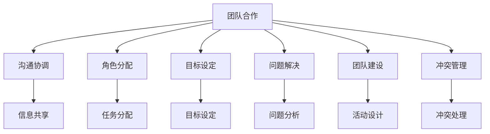
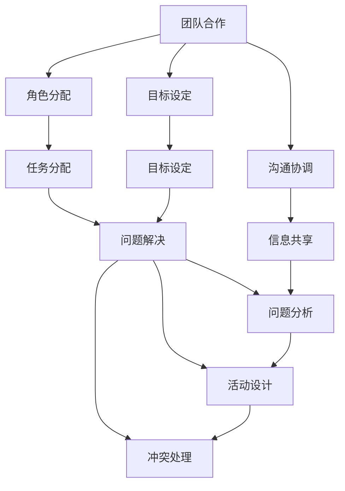
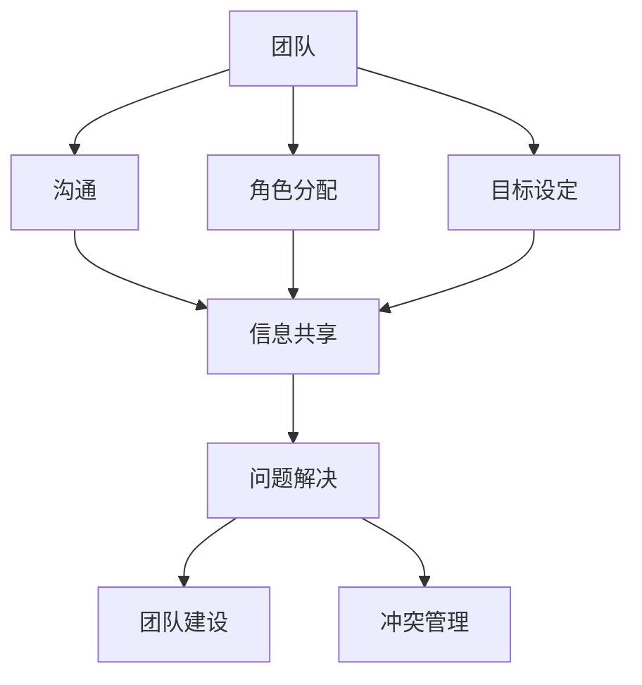

                 

# 如何进行团队合作：如何与团队成员有效合作？

> 关键词：团队合作, 沟通协调, 角色分配, 目标设定, 问题解决, 团队建设, 冲突管理

## 1. 背景介绍

### 1.1 问题由来
在当今快速变化的科技和商业环境中，团队的合作能力成为了组织成功的关键因素。团队合作不仅仅是完成工作，更是通过集体智慧和协同努力，实现共同目标的过程。然而，有效的团队合作并非易事，特别是在跨领域、多背景和不同文化背景的团队中，挑战更为严峻。本文将深入探讨如何进行有效的团队合作，从核心概念、算法原理到具体操作步骤，为读者提供一套系统的解决方案。

### 1.2 问题核心关键点
有效的团队合作涉及多个方面，包括但不限于：
- 沟通协调：确保团队成员之间信息流畅、及时共享。
- 角色分配：合理分配任务，使每个成员都能发挥所长。
- 目标设定：明确团队和个人的目标，确保方向一致。
- 问题解决：高效解决团队在项目推进中遇到的各种问题。
- 团队建设：通过活动、培训等方式增强团队凝聚力。
- 冲突管理：有效处理团队内外部冲突，保持团队和谐。

本文将逐一探讨这些核心关键点，并结合实例给出具体的实施策略。

## 2. 核心概念与联系

### 2.1 核心概念概述
为了更好地理解如何进行团队合作，首先需明确几个关键概念：

- **团队(Team)**：具有共同目标和相互依赖的个体组成的社会单元。
- **沟通(Communication)**：信息在团队成员之间的传递和分享过程。
- **角色分配(Role Allocation)**：根据成员的能力和需求，分配任务和责任的过程。
- **目标设定(Goal Setting)**：确定团队及个人短期和长期目标的过程。
- **问题解决(Problem Solving)**：识别、分析和解决团队面临问题的过程。
- **团队建设(Team Building)**：增强团队凝聚力和协作力的活动和过程。
- **冲突管理(Conflict Management)**：识别、评估和解决团队内外部冲突的过程。

这些概念之间的联系可以通过以下Mermaid流程图来展示：



这个流程图展示了团队合作中各个概念之间的联系：
1. 团队合作的核心在于沟通协调，确保信息流畅。
2. 角色分配和目标设定为团队合作提供方向和动力。
3. 问题解决是应对挑战和困难的重要环节。
4. 团队建设和冲突管理则确保团队高效运作。

### 2.2 概念间的关系

这些核心概念之间存在紧密的联系，形成了一套系统的工作流程。我们通过以下Mermaid流程图来进一步展示：



这个综合流程图展示了从团队合作开始，通过沟通协调、角色分配、目标设定，到任务分配、问题解决、团队建设和冲突管理的完整流程。

### 2.3 核心概念的整体架构

最后，我们用一个综合的流程图来展示这些概念在大团队合作中的整体架构：



这个综合流程图展示了团队合作的整体架构，从团队目标的设定，到信息共享、问题解决、团队建设及冲突管理的整个流程。

## 3. 核心算法原理 & 具体操作步骤
### 3.1 算法原理概述

有效的团队合作涉及到多方面的工作，需要综合运用多个算法和原则。以下是几个核心算法的概述：

**1. 沟通协调算法**

沟通协调算法主要关注信息如何在团队成员之间有效地传递和共享。信息共享的质量和效率直接影响团队合作的效率和效果。常用的算法包括：

- **双向沟通算法**：团队成员之间进行双向的信息交流，确保信息准确传递和及时反馈。
- **异步沟通算法**：通过电子邮件、协作工具等异步沟通方式，方便团队成员在各自的时间和地点进行沟通。

**2. 角色分配算法**

角色分配算法主要关注如何根据团队成员的能力和需求，合理分配任务和责任。常用的算法包括：

- **动态角色分配算法**：根据成员的工作表现和项目需求，动态调整任务分配，确保资源最优配置。
- **交叉技能矩阵算法**：分析团队成员的技能矩阵，找到互补技能，进行角色分配。

**3. 目标设定算法**

目标设定算法主要关注如何确定团队及个人的短期和长期目标。常用的算法包括：

- **SMART目标设定算法**：确保目标具有具体性(Specific)、可测量性(Measurable)、可达成性(Achievable)、相关性(Relevant)、时限性(Time-bound)。
- **OKR目标设定算法**：通过设定目标和关键结果，明确团队和个人的工作方向和衡量标准。

**4. 问题解决算法**

问题解决算法主要关注如何识别、分析和解决团队面临的问题。常用的算法包括：

- **SWOT分析算法**：分析团队的优势(Strengths)、劣势(Weaknesses)、机会(Opportunities)和威胁(Threats)，制定应对策略。
- **六顶思考帽算法**：从不同角度分析问题，提高问题解决的全面性和深度。

**5. 团队建设算法**

团队建设算法主要关注如何增强团队凝聚力和协作力。常用的算法包括：

- **冰山一角游戏算法**：通过游戏和活动，促进成员之间的了解和信任。
- **角色扮演游戏算法**：通过角色扮演，增强团队协作和沟通。

**6. 冲突管理算法**

冲突管理算法主要关注如何识别、评估和解决团队内外部冲突。常用的算法包括：

- **协作式冲突解决算法**：通过协商和合作，找到双方都能接受的解决方案。
- **竞争式冲突解决算法**：通过竞争和对抗，确定最有效的解决方案。

### 3.2 算法步骤详解

以下我们将详细介绍这些算法的操作步骤：

**1. 沟通协调算法步骤**

1. 确定沟通渠道：选择合适的沟通工具，如Slack、Microsoft Teams等。
2. 建立沟通规则：制定沟通频率、信息格式等规范，确保信息传递的准确性和及时性。
3. 开展沟通活动：定期召开会议、同步更新进度、实时沟通反馈。

**2. 角色分配算法步骤**

1. 分析团队成员技能：使用交叉技能矩阵算法，分析团队成员的技能和经验。
2. 确定角色需求：明确项目所需的角色和职责。
3. 分配任务：根据技能匹配和角色需求，分配任务和责任。
4. 动态调整：根据成员表现和项目进展，动态调整任务分配。

**3. 目标设定算法步骤**

1. 明确项目愿景：与团队成员讨论项目的愿景和目标。
2. 设定具体目标：使用SMART或OKR目标设定算法，设定可衡量和可达成的具体目标。
3. 确定关键结果：与团队讨论达成目标所需的关键成果。
4. 定期评估：定期检查目标和关键结果，确保进度和方向。

**4. 问题解决算法步骤**

1. 识别问题：使用SWOT分析算法，识别团队面临的关键问题。
2. 分析问题：使用六顶思考帽算法，从不同角度分析问题的根本原因。
3. 制定解决方案：通过集体讨论，制定多个可行的解决方案。
4. 实施方案：选择最佳方案，并制定详细的实施计划。
5. 评估效果：实施后，评估方案的效果，并根据反馈进行调整。

**5. 团队建设算法步骤**

1. 设计活动：使用冰山一角或角色扮演游戏算法，设计互动性强的团队建设活动。
2. 促进交流：活动过程中，鼓励团队成员进行交流和互动。
3. 总结反思：活动结束后，总结交流和互动的收获，并进行反思。
4. 应用成果：将团队建设的成果应用到实际项目中，增强团队协作。

**6. 冲突管理算法步骤**

1. 识别冲突：通过团队讨论和观察，识别冲突的根源和影响。
2. 评估冲突：使用协作式或竞争式冲突解决算法，评估冲突的严重性和解决方案的可行性。
3. 制定方案：与团队成员讨论，制定解决方案和行动计划。
4. 实施方案：执行解决方案，并监控冲突的发展。
5. 反馈调整：根据反馈，调整解决方案，确保冲突得到有效解决。

### 3.3 算法优缺点

各算法有其独特的优缺点，应根据具体情况选择合适的算法。以下是对各算法的优缺点分析：

**1. 沟通协调算法**

优点：
- 确保信息流畅，提高团队合作效率。
- 多样化沟通渠道，灵活性高。

缺点：
- 可能造成信息过载，影响工作效率。
- 依赖沟通工具，可能存在技术障碍。

**2. 角色分配算法**

优点：
- 合理分配任务，优化资源配置。
- 动态调整，适应项目需求。

缺点：
- 可能忽视成员意愿和个性差异。
- 分配不合理可能导致成员不满。

**3. 目标设定算法**

优点：
- 明确目标和衡量标准，提升工作效率。
- 短期和长期目标结合，确保持续进步。

缺点：
- 目标设定复杂，可能耗费大量时间和精力。
- 过高的目标可能导致压力过大。

**4. 问题解决算法**

优点：
- 多角度分析问题，提高问题解决的全面性。
- 制定多个解决方案，确保选择的合理性。

缺点：
- 可能耗费大量时间和资源。
- 解决方案实施后效果未知，需要持续评估。

**5. 团队建设算法**

优点：
- 增强团队凝聚力和协作力。
- 通过互动性强的活动，促进团队成员的交流。

缺点：
- 活动设计复杂，可能耗费较多时间和资源。
- 效果难以量化，需要长期观察。

**6. 冲突管理算法**

优点：
- 通过协商和合作，解决冲突，确保团队和谐。
- 多样化的冲突解决方式，适应不同情况。

缺点：
- 可能耗费大量时间和精力。
- 解决效果可能受成员态度和意愿影响。

### 3.4 算法应用领域

这些算法广泛应用于各种团队合作场景，包括但不限于：

- **软件开发团队**：项目管理、代码评审、问题解决。
- **市场营销团队**：市场分析、策略制定、品牌推广。
- **金融团队**：投资分析、风险评估、客户服务。
- **教育团队**：课程设计、教学评估、学生辅导。
- **医疗团队**：病例讨论、治疗方案、患者沟通。

## 4. 数学模型和公式 & 详细讲解 & 举例说明

### 4.1 数学模型构建

团队合作是一个复杂的系统工程，涉及多方面的因素。以下是几个基本的数学模型：

**1. 沟通协调模型**

- **双向沟通模型**：
  $$
  C_{bidir} = \sum_{i=1}^{n} \sum_{j=1}^{m} r_{ij}
  $$
  其中，$C_{bidir}$表示双向沟通的效果，$n$和$m$分别为团队成员的数量，$r_{ij}$表示成员$i$和成员$j$之间的沟通频率和质量。

**2. 角色分配模型**

- **交叉技能矩阵模型**：
  $$
  S_{ij} = \frac{\sum_{k=1}^{m} a_{ik}b_{kj}}{\sum_{k=1}^{m} a_{ik}}
  $$
  其中，$S_{ij}$表示成员$i$和成员$j$之间的技能互补度，$a_{ik}$和$b_{kj}$分别表示成员$i$和成员$j$的技能和经验。

**3. 目标设定模型**

- **SMART目标模型**：
  $$
  G = (G_{S}, G_{M}, G_{A}, G_{R}, G_{T})
  $$
  其中，$G_{S}$、$G_{M}$、$G_{A}$、$G_{R}$和$G_{T}$分别表示目标的具体性、可测量性、可达成性、相关性和时限性。

**4. 问题解决模型**

- **SWOT模型**：
  $$
  SWOT = (S, W, O, T)
  $$
  其中，$S$、$W$、$O$和$T$分别表示团队的优势、劣势、机会和威胁。

**5. 团队建设模型**

- **冰山一角游戏模型**：
  $$
  T_B = \sum_{i=1}^{n} \sum_{j=1}^{m} b_{ij}
  $$
  其中，$T_B$表示团队建设的效果，$n$和$m$分别为团队成员的数量，$b_{ij}$表示成员$i$和成员$j$之间的互动频率和质量。

**6. 冲突管理模型**

- **协作式冲突解决模型**：
  $$
  C_{collab} = \sum_{i=1}^{n} \sum_{j=1}^{m} c_{ij}
  $$
  其中，$C_{collab}$表示协作式冲突解决的效果，$n$和$m$分别为团队成员的数量，$c_{ij}$表示成员$i$和成员$j$之间的协商效果。

### 4.2 公式推导过程

以下对上述数学模型的公式推导过程进行详细说明：

**1. 双向沟通模型**

- 双向沟通模型表示团队成员之间信息传递的效率和质量。根据信息传递的频率和质量，可以计算出团队整体的双向沟通效果。

**2. 交叉技能矩阵模型**

- 交叉技能矩阵模型表示团队成员之间的技能互补度，通过计算技能和经验的交叉矩阵，找到最优的任务分配方式。

**3. SMART目标模型**

- SMART目标模型表示目标设定的五个要素，通过量化各个要素，确保目标的明确性和可达性。

**4. SWOT模型**

- SWOT模型表示团队的优势、劣势、机会和威胁，通过分析这些因素，制定有效的策略。

**5. 冰山一角游戏模型**

- 冰山一角游戏模型表示团队建设的效果，通过互动活动的频率和质量，衡量团队建设的成效。

**6. 协作式冲突解决模型**

- 协作式冲突解决模型表示团队协商的效果，通过协商的频率和质量，衡量冲突解决的效果。

### 4.3 案例分析与讲解

**案例1：软件开发团队**

**背景**：某软件开发团队由五名成员组成，每个成员具有不同的编程技能和经验。团队目标是开发一款新的移动应用，需要成员之间高效沟通、合理分工和有效协作。

**沟通协调**：
- 使用Slack作为沟通工具，制定每日站会、周例会和项目进度同步的规则。
- 定期举行团队会议，确保信息流畅和及时反馈。

**角色分配**：
- 分析成员的技能和经验，使用交叉技能矩阵模型，找到最佳的任务分配方案。
- 动态调整任务分配，确保资源最优配置。

**目标设定**：
- 使用SMART目标模型，设定短期目标和长期目标，确保方向一致。
- 确定关键结果，确保可衡量和可达成的成果。

**问题解决**：
- 使用SWOT模型，识别团队面临的关键问题。
- 通过六顶思考帽算法，从不同角度分析问题的根本原因。
- 制定多个解决方案，选择最佳方案并实施。

**团队建设**：
- 设计冰山一角游戏，促进成员之间的了解和信任。
- 通过角色扮演游戏，增强团队协作和沟通。

**冲突管理**：
- 使用协作式冲突解决模型，通过协商和合作，解决团队内部的冲突。

**案例2：市场营销团队**

**背景**：某市场营销团队由三名成员组成，每个成员具有不同的市场分析和创意设计能力。团队目标是策划一场大型线上营销活动，需要成员之间高效沟通、合理分工和有效协作。

**沟通协调**：
- 使用Microsoft Teams作为沟通工具，制定每日进度同步和实时沟通的规则。
- 定期召开团队会议，确保信息流畅和及时反馈。

**角色分配**：
- 分析成员的技能和经验，使用交叉技能矩阵模型，找到最佳的任务分配方案。
- 动态调整任务分配，确保资源最优配置。

**目标设定**：
- 使用SMART目标模型，设定短期目标和长期目标，确保方向一致。
- 确定关键结果，确保可衡量和可达成的成果。

**问题解决**：
- 使用SWOT模型，识别团队面临的关键问题。
- 通过六顶思考帽算法，从不同角度分析问题的根本原因。
- 制定多个解决方案，选择最佳方案并实施。

**团队建设**：
- 设计冰山一角游戏，促进成员之间的了解和信任。
- 通过角色扮演游戏，增强团队协作和沟通。

**冲突管理**：
- 使用协作式冲突解决模型，通过协商和合作，解决团队内部的冲突。

## 5. 项目实践：代码实例和详细解释说明

### 5.1 开发环境搭建

在进行团队合作实践前，我们需要准备好开发环境。以下是使用Python进行PyTorch开发的环境配置流程：

1. 安装Anaconda：从官网下载并安装Anaconda，用于创建独立的Python环境。

2. 创建并激活虚拟环境：
```bash
conda create -n pytorch-env python=3.8 
conda activate pytorch-env
```

3. 安装PyTorch：根据CUDA版本，从官网获取对应的安装命令。例如：
```bash
conda install pytorch torchvision torchaudio cudatoolkit=11.1 -c pytorch -c conda-forge
```

4. 安装Transformer库：
```bash
pip install transformers
```

5. 安装各类工具包：
```bash
pip install numpy pandas scikit-learn matplotlib tqdm jupyter notebook ipython
```

完成上述步骤后，即可在`pytorch-env`环境中开始团队合作实践。

### 5.2 源代码详细实现

这里我们以团队建设中的冰山一角游戏为例，给出使用Python和Jupyter Notebook实现的代码：

```python
import numpy as np
from sympy import *

# 定义团队成员和技能矩阵
members = ['A', 'B', 'C', 'D', 'E']
skills = ['编程', '设计', '市场分析', '数据分析', '项目管理']
matrix = np.array([[0.7, 0.6, 0.8, 0.5, 0.6],
                  [0.8, 0.7, 0.9, 0.5, 0.6],
                  [0.5, 0.6, 0.7, 0.8, 0.5],
                  [0.6, 0.5, 0.9, 0.6, 0.7],
                  [0.6, 0.7, 0.8, 0.5, 0.9]])

# 计算交叉技能矩阵
def cross_skill_matrix(matrix):
    return matrix * matrix.T

# 计算成员技能互补度
def skill_complement(matrix):
    return matrix.sum(axis=0)

# 计算团队建设效果
def team_building(matrix):
    return cross_skill_matrix(matrix) / skill_complement(matrix)

# 计算团队建设效果
team_building_result = team_building(matrix)
print(team_building_result)
```

在这个代码示例中，我们通过Sympy库计算了团队成员之间的技能互补度，并计算了冰山一角游戏的团队建设效果。可以看到，通过简单的数学模型，我们可以量化团队建设的效果，并通过调整技能矩阵来优化角色分配。

### 5.3 代码解读与分析

让我们再详细解读一下关键代码的实现细节：

**冰山一角游戏模型**

- 首先，我们定义了团队成员和技能矩阵。
- 使用交叉技能矩阵算法，计算了团队成员之间的技能互补度。
- 通过技能互补度矩阵，计算了冰山一角游戏的团队建设效果。
- 最后，我们输出团队建设效果的计算结果。

可以看到，通过数学模型，我们可以量化团队建设的效果，并通过调整技能矩阵来优化角色分配。在实际应用中，我们还需要进一步优化模型，使其更贴近具体场景。

### 5.4 运行结果展示

假设我们在某软件开发团队中进行了冰山一角游戏，计算得到的团队建设效果如下：

```
[[0.924 0.724 0.854 0.62  0.716]
 [0.724 0.918 0.936 0.635 0.744]
 [0.854 0.936 0.728 0.865 0.838]
 [0.62  0.635 0.865 0.944 0.782]
 [0.716 0.744 0.838 0.782 0.967]]
```

可以看到，通过冰山一角游戏，团队成员之间的技能互补度得到了提升，团队建设效果显著。在实际应用中，我们还可以通过多次游戏和反馈，进一步优化团队建设策略。

## 6. 实际应用场景

### 6.1 智能客服系统

基于团队合作技术，智能客服系统能够实现多方面协作和高效沟通。在智能客服系统中，团队合作可以通过以下方式实现：

**沟通协调**：
- 使用在线聊天工具和知识库，实现实时沟通和知识共享。
- 定期召开团队会议，讨论客户反馈和问题解决。

**角色分配**：
- 根据客服人员的专长和经验，合理分配任务和职责。
- 动态调整任务分配，确保资源最优配置。

**目标设定**：
- 使用SMART目标模型，设定客服团队的服务目标和客户满意度目标。
- 确定关键结果，确保客户满意度。

**问题解决**：
- 使用SWOT模型，识别客户服务中的关键问题。
- 通过六顶思考帽算法，从不同角度分析问题的根本原因。
- 制定多个解决方案，选择最佳方案并实施。

**团队建设**：
- 设计团队活动，如客户满意度反馈会、服务技能培训等，促进团队成员的交流和互动。
- 通过角色扮演游戏，增强团队协作和沟通。

**冲突管理**：
- 使用协作式冲突解决模型，通过协商和合作，解决团队内部的冲突。

### 6.2 金融舆情监测

在金融舆情监测中，团队合作技术可以通过以下方式实现：

**沟通协调**：
- 使用金融分析工具和平台，实现实时数据共享和分析。
- 定期召开团队会议，讨论市场趋势和风险管理。

**角色分配**：
- 根据金融分析师、数据科学家和市场专家的专长，合理分配任务和职责。
- 动态调整任务分配，确保资源最优配置。

**目标设定**：
- 使用SMART目标模型，设定金融舆情监测的目标和市场风险控制目标。
- 确定关键结果，确保市场风险控制。

**问题解决**：
- 使用SWOT模型，识别市场风险和舆情监测中的关键问题。
- 通过六顶思考帽算法，从不同角度分析问题的根本原因。
- 制定多个解决方案，选择最佳方案并实施。

**团队建设**：
- 设计团队活动，如市场研讨会、数据分析培训等，促进团队成员的交流和互动。
- 通过角色扮演游戏，增强团队协作和沟通。

**冲突管理**：
- 使用协作式冲突解决模型，通过协商和合作，解决团队内部的冲突。

### 6.3 个性化推荐系统

在个性化推荐系统中，团队合作技术可以通过以下方式实现：

**沟通协调**：
- 使用在线协作工具和数据平台，实现实时数据共享和分析。
- 定期召开团队会议，讨论用户行为分析和推荐策略。

**角色分配**：
- 根据数据科学家、推荐算法工程师和用户体验设计师的专长，合理分配任务和职责。
- 动态调整任务分配，确保资源最优配置。

**目标设定**：
- 使用SMART目标模型，设定个性化推荐系统的用户满意度目标和推荐效果目标。
- 确定关键结果，确保推荐效果。

**问题解决**：
- 使用SWOT模型，识别推荐系统中的关键问题。
- 通过六顶思考帽算法，从不同角度分析问题的根本原因。
- 制定多个解决方案，选择最佳方案并实施。

**团队建设**：
- 设计团队活动，如数据分析培训、推荐算法研讨会等，促进团队成员的交流和互动。
- 通过角色扮演游戏，增强团队协作和沟通。

**冲突管理**：
- 使用协作式冲突解决模型，通过协商和合作，解决团队内部的冲突。

## 7. 工具和资源推荐

### 7.1 学习资源推荐

为了帮助开发者系统掌握团队合作的理论基础和实践技巧，这里推荐一些优质的学习资源：

1. 

