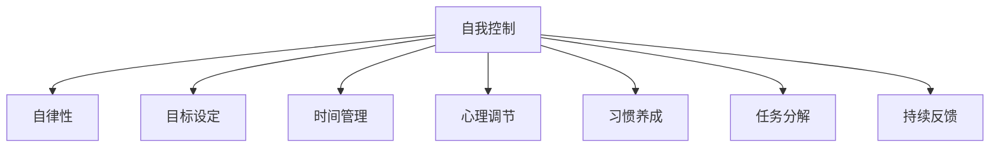
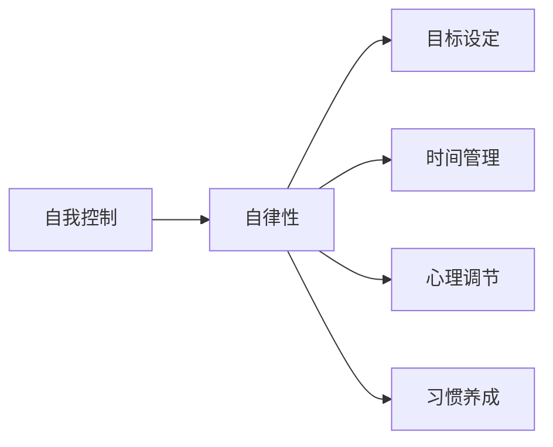
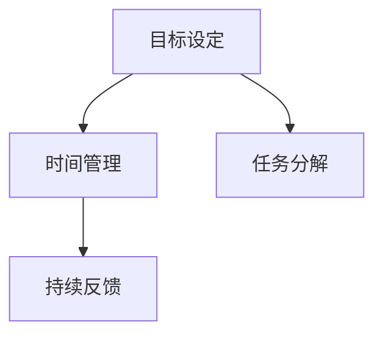
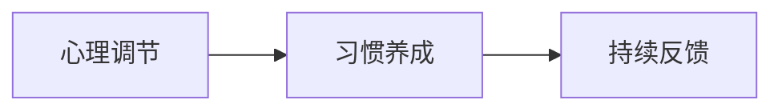

                 

# 如何进行自我管理：如何提高自我控制和自律能力？

在现代快节奏的生活中，我们常常需要处理各种复杂任务，完成多样化的职责。如何在时间有限、资源有限的情况下，最大化效率和效果，成为很多人面临的挑战。特别是在技术领域，我们常常需要不断学习新知识、解决复杂问题，这要求我们具备高度的自我控制和自律能力。本文将从自我管理的基本原理出发，深入探讨如何通过科学方法提高自我控制和自律能力，帮助大家在繁忙的工作和生活中取得更好的成果。

## 1. 背景介绍

### 1.1 问题由来

随着技术发展的日新月异，人工智能领域的知识体系和技能要求不断更新。作为技术从业者，我们需要在有限的时间内，尽可能高效地获取和应用新知识。但现实情况是，信息过载、工作压力、时间管理不当等问题，常常会让我们感到疲惫和困惑。如何在繁忙的工作和生活中保持高效的学习和工作状态，提高自我控制和自律能力，是每个技术人需要面对的挑战。

### 1.2 问题核心关键点

提高自我控制和自律能力，涉及到多个核心关键点：
1. **目标设定**：明确并分解长期和短期目标，制定切实可行的计划。
2. **时间管理**：合理安排时间，高效利用每一分钟。
3. **心理调节**：学会调节情绪，保持积极心态。
4. **习惯养成**：建立良好的工作和生活习惯，减少拖延和散漫。
5. **任务分解**：将大任务分解成小任务，逐一完成。
6. **持续反馈**：定期评估进度，及时调整策略。

这些关键点共同构成了自我管理的核心框架，通过系统化的方法，可以有效提高自我控制和自律能力。

### 1.3 问题研究意义

提高自我控制和自律能力，对于技术从业者来说，具有重要意义：

1. **提升效率**：合理安排时间和任务，可以大幅提高工作效率，完成更多任务。
2. **减少压力**：科学管理可以减少工作压力，提升心理状态。
3. **增强成就感**：逐步实现目标，带来持续的成就感，增强自我驱动力。
4. **提高竞争能力**：持续学习和成长，保持竞争力，为职业生涯发展打下坚实基础。

## 2. 核心概念与联系

### 2.1 核心概念概述

为更好地理解如何提高自我控制和自律能力，本节将介绍几个密切相关的核心概念：

- **自我控制(Self-Control)**：指个体在面对诱惑和挑战时，能够调节自身行为，达成预设目标的能力。
- **自律性(Self-Discipline)**：指个体在无人监督时，仍然能够遵守规则和准则，维持良好行为的习惯。
- **目标设定(Goal Setting)**：指明确自己的长期和短期目标，制定具体的行动计划。
- **时间管理(Time Management)**：指合理安排时间，高效利用每一分钟。
- **心理调节(Mental Regulation)**：指通过各种方法调节情绪，保持积极心态。
- **习惯养成(Habit Formation)**：指通过重复行为，建立稳定的行为模式，减少拖延和散漫。
- **任务分解(Task Decomposition)**：指将大任务分解成小任务，逐一完成。
- **持续反馈(Continuous Feedback)**：指定期评估进度，及时调整策略。

这些核心概念之间的逻辑关系可以通过以下Mermaid流程图来展示：



这个流程图展示了我提高自我控制和自律能力的核心概念及其之间的关系：

1. 自我控制是自律性的基础，通过调节自身行为，达成预设目标。
2. 目标设定和时间管理是实现自我控制和自律性的重要工具。
3. 心理调节和习惯养成是保持自我控制和自律性的重要方法。
4. 任务分解和持续反馈是实现目标设定和时间管理的具体方法。

这些概念共同构成了提高自我控制和自律能力的基本框架，帮助我们从各个维度提升自我管理能力。

### 2.2 概念间的关系

这些核心概念之间存在着紧密的联系，形成了自我管理能力的完整生态系统。下面我们通过几个Mermaid流程图来展示这些概念之间的关系。

#### 2.2.1 自我控制与自律性的关系



这个流程图展示了自我控制和自律性的基本关系。自我控制是自律性的基础，通过自我调节行为，达成预设目标。自律性则是自我控制的结果，通过反复练习，形成稳定的行为模式。

#### 2.2.2 目标设定与时间管理的关系



这个流程图展示了目标设定和时间管理的基本关系。目标设定是时间管理的基础，通过明确目标和分解任务，可以更高效地利用时间。时间管理则是目标设定的具体实现方法，通过合理安排时间，逐步实现目标。

#### 2.2.3 心理调节与习惯养成的关系



这个流程图展示了心理调节和习惯养成的基本关系。心理调节是习惯养成的重要方法，通过调节情绪，保持积极心态，可以更坚持地执行任务。习惯养成则是心理调节的结果，通过反复练习，形成稳定的行为模式。

## 3. 核心算法原理 & 具体操作步骤
### 3.1 算法原理概述

提高自我控制和自律能力，本质上是一个系统性的自我优化过程。其核心算法原理可以概括为以下几个步骤：

1. **目标设定**：明确并分解长期和短期目标，制定切实可行的计划。
2. **时间管理**：合理安排时间，高效利用每一分钟。
3. **心理调节**：学会调节情绪，保持积极心态。
4. **习惯养成**：建立良好的工作和生活习惯，减少拖延和散漫。
5. **任务分解**：将大任务分解成小任务，逐一完成。
6. **持续反馈**：定期评估进度，及时调整策略。

通过这些步骤，可以有效提升自我控制和自律能力，达成预设目标。

### 3.2 算法步骤详解

#### 3.2.1 目标设定

1. **SMART原则**：目标应该具体、可测量、可达成、相关性强、时间限定的原则。例如，"在三个月内完成数据分析实战项目"就是一个SMART目标。
2. **分解目标**：将大目标分解为小目标，例如将"完成数据分析实战项目"分解为"学习SQL"、"学习Pandas"等小目标。
3. **优先级排序**：根据重要性和紧急性，对小目标进行优先级排序。例如，"学习SQL"可能比"学习Pandas"更紧急和重要。

#### 3.2.2 时间管理

1. **时间记录**：使用时间追踪工具，如Toggl、RescueTime等，记录每天的时间分配，找出浪费时间的环节。
2. **时间块划分**：将一天划分为多个时间块，每个时间块专注于一个特定任务。例如，"9:00-12:00"专门用于学习新知识，"14:00-16:00"用于处理邮件和文档。
3. **优先级调整**：根据目标和实际情况，动态调整时间块的任务优先级。例如，突发紧急任务可以中断当前任务，但需尽快恢复原计划。

#### 3.2.3 心理调节

1. **情绪管理**：使用情绪记录工具，如Moodnotes等，记录和分析每日情绪变化，找出情绪波动的原因。
2. **正面思考**：通过正面思考法，如自我暗示、目标可视化等，提升自我激励。
3. **放松练习**：进行放松练习，如深呼吸、冥想、运动等，缓解压力，保持心态平衡。

#### 3.2.4 习惯养成

1. **行为追踪**：使用习惯追踪工具，如Habitica、Streaks等，记录和分析每日行为习惯，找出改进的空间。
2. **小步前进**：从微小的行为改变开始，逐步建立稳定的行为模式。例如，每天花5分钟进行运动，逐步增加到20分钟。
3. **奖励机制**：设立奖励机制，如完成任务后进行小奖励，增强自我激励。

#### 3.2.5 任务分解

1. **分解任务**：将大任务分解为小任务，例如将"学习Python编程语言"分解为"学习Python基础语法"、"学习Python数据结构"等小任务。
2. **时间分配**：为每个小任务分配时间，例如每天花2小时学习Python编程语言。
3. **完成跟踪**：使用任务管理工具，如Todoist、Notion等，跟踪每个小任务的完成情况。

#### 3.2.6 持续反馈

1. **进度评估**：定期评估任务的完成情况，找出未完成的原因。
2. **策略调整**：根据评估结果，及时调整策略，例如增加学习时间、改变学习方法等。
3. **反馈循环**：建立反馈循环，将评估结果反馈到目标设定和时间管理中，不断优化改进。

### 3.3 算法优缺点

#### 3.3.1 优点

1. **系统化方法**：通过科学的方法和工具，可以系统化地提高自我控制和自律能力。
2. **灵活调整**：根据实际情况，动态调整策略，确保目标的实现。
3. **提高效率**：合理安排时间和任务，可以大幅提高工作效率，完成更多任务。

#### 3.3.2 缺点

1. **复杂性**：系统化方法需要掌握多个工具和技术，可能增加学习的复杂性。
2. **短期效果**：部分方法需要长期坚持才能看到显著效果，对初学者可能存在一定的挑战。
3. **个体差异**：不同人有不同的习惯和需求，需要个性化调整方法。

### 3.4 算法应用领域

提高自我控制和自律能力的方法，在各个领域都有广泛应用：

1. **学术研究**：科研人员需要高效管理时间和任务，保持研究进度。
2. **工程开发**：开发者需要不断学习和更新技能，保持技术竞争力。
3. **项目管理**：项目经理需要合理规划时间和资源，确保项目按时交付。
4. **日常生活**：每个人都需要在日常生活中提高自我管理能力，提升生活质量。

## 4. 数学模型和公式 & 详细讲解 & 举例说明

### 4.1 数学模型构建

#### 4.1.1 目标设定模型

目标设定模型可以表示为：

$$
\text{Goal}(t) = \text{SMART}(t) \times \text{Time}(t)
$$

其中，$\text{Goal}(t)$表示目标在时间$t$的设定值，$\text{SMART}(t)$表示目标的具体、可测量、可达成、相关性强、时间限定的原则，$\text{Time}(t)$表示目标在时间$t$的执行时间。

### 4.1.2 时间管理模型

时间管理模型可以表示为：

$$
\text{Time Utilization}(t) = \text{Time Block}(t) \times \text{Priority}(t)
$$

其中，$\text{Time Utilization}(t)$表示时间$t$的利用率，$\text{Time Block}(t)$表示时间块在时间$t$的划分，$\text{Priority}(t)$表示任务在时间$t$的优先级。

### 4.1.3 心理调节模型

心理调节模型可以表示为：

$$
\text{Mental State}(t) = \text{Emotion}(t) \times \text{Positive Thinking}(t)
$$

其中，$\text{Mental State}(t)$表示时间$t$的心理状态，$\text{Emotion}(t)$表示情绪在时间$t$的变化，$\text{Positive Thinking}(t)$表示积极思考在时间$t$的实施情况。

### 4.1.4 习惯养成模型

习惯养成模型可以表示为：

$$
\text{Habit Stability}(t) = \text{Behavior Tracking}(t) \times \text{Reward}(t)
$$

其中，$\text{Habit Stability}(t)$表示时间$t$的习惯稳定性，$\text{Behavior Tracking}(t)$表示行为在时间$t$的追踪情况，$\text{Reward}(t)$表示奖励在时间$t$的实施情况。

### 4.1.5 任务分解模型

任务分解模型可以表示为：

$$
\text{Task Completion}(t) = \text{Task Decomposition}(t) \times \text{Time Allocation}(t)
$$

其中，$\text{Task Completion}(t)$表示时间$t$的任务完成情况，$\text{Task Decomposition}(t)$表示任务在时间$t$的分解情况，$\text{Time Allocation}(t)$表示任务在时间$t$的时间分配情况。

### 4.1.6 持续反馈模型

持续反馈模型可以表示为：

$$
\text{Progress Improvement}(t) = \text{Progress Assessment}(t) \times \text{Strategy Adjustment}(t)
$$

其中，$\text{Progress Improvement}(t)$表示时间$t$的进度改进情况，$\text{Progress Assessment}(t)$表示进度在时间$t$的评估情况，$\text{Strategy Adjustment}(t)$表示策略在时间$t$的调整情况。

### 4.2 公式推导过程

#### 4.2.1 目标设定模型推导

根据SMART原则，目标设定模型可以进一步推导为：

$$
\text{Goal}(t) = \text{Specific}(t) \times \text{Measurable}(t) \times \text{Achievable}(t) \times \text{Relevant}(t) \times \text{Time-Limited}(t) \times \text{Time}(t)
$$

例如，"在三个月内完成数据分析实战项目"可以表示为：

$$
\text{Goal}_{\text{项目}}(t) = \text{Specific}(t) \times \text{Measurable}(t) \times \text{Achievable}(t) \times \text{Relevant}(t) \times \text{Time-Limited}(t) \times \text{Time}_{\text{项目}}(t)
$$

#### 4.2.2 时间管理模型推导

根据时间块划分和时间优先级，时间管理模型可以进一步推导为：

$$
\text{Time Utilization}(t) = \sum_{i=1}^{n} \text{Time Block}_{i}(t) \times \text{Priority}_{i}(t)
$$

其中，$n$表示时间块的数量。例如，"9:00-12:00"专门用于学习新知识，可以表示为：

$$
\text{Time Utilization}_{\text{学习}}(t) = \text{Time Block}_{\text{学习}}(t) \times \text{Priority}_{\text{学习}}(t)
$$

#### 4.2.3 心理调节模型推导

根据情绪记录和积极思考，心理调节模型可以进一步推导为：

$$
\text{Mental State}(t) = \text{Emotion}_{\text{稳定}}(t) \times \text{Positive Thinking}_{\text{实施}}(t)
$$

例如，通过深呼吸、冥想等放松练习，可以表示为：

$$
\text{Mental State}_{\text{放松}}(t) = \text{Emotion}_{\text{放松}}(t) \times \text{Positive Thinking}_{\text{放松}}(t)
$$

#### 4.2.4 习惯养成模型推导

根据行为追踪和奖励机制，习惯养成模型可以进一步推导为：

$$
\text{Habit Stability}(t) = \text{Behavior Tracking}_{\text{稳定}}(t) \times \text{Reward}_{\text{实施}}(t)
$$

例如，每天花5分钟进行运动，可以表示为：

$$
\text{Habit Stability}_{\text{运动}}(t) = \text{Behavior Tracking}_{\text{运动}}(t) \times \text{Reward}_{\text{运动}}(t)
$$

#### 4.2.5 任务分解模型推导

根据任务分解和时间分配，任务分解模型可以进一步推导为：

$$
\text{Task Completion}(t) = \sum_{i=1}^{m} \text{Task Decomposition}_{i}(t) \times \text{Time Allocation}_{i}(t)
$$

其中，$m$表示任务的分解数量。例如，"学习Python编程语言"可以表示为：

$$
\text{Task Completion}_{\text{Python}}(t) = \text{Task Decomposition}_{\text{Python}}(t) \times \text{Time Allocation}_{\text{Python}}(t)
$$

#### 4.2.6 持续反馈模型推导

根据进度评估和策略调整，持续反馈模型可以进一步推导为：

$$
\text{Progress Improvement}(t) = \text{Progress Assessment}_{\text{评估}}(t) \times \text{Strategy Adjustment}_{\text{调整}}(t)
$$

例如，每周评估进度并进行策略调整，可以表示为：

$$
\text{Progress Improvement}_{\text{每周}}(t) = \text{Progress Assessment}_{\text{每周}}(t) \times \text{Strategy Adjustment}_{\text{每周}}(t)
$$

### 4.3 案例分析与讲解

#### 4.3.1 目标设定案例

某项目经理为了提高团队的项目管理能力，设定了以下目标：

1. 在三个月内，提高团队的需求分析能力。
2. 在半年内，提高团队的开发效率。
3. 在一年内，提高团队的质量保障能力。

将这些目标进行分解，可以表示为：

$$
\text{Goal}_{\text{项目管理}}(t) = \text{Specific}(t) \times \text{Measurable}(t) \times \text{Achievable}(t) \times \text{Relevant}(t) \times \text{Time-Limited}(t) \times \text{Time}_{\text{项目管理}}(t)
$$

具体分解为：

1. 在三个月内，每周安排一次需求分析培训。
2. 在半年内，每周安排一次开发效率提升训练。
3. 在一年内，每月进行一次质量保障能力评估。

#### 4.3.2 时间管理案例

某工程师为了提高工作效率，对每天的时间进行了详细规划：

1. 9:00-12:00：学习新知识，安排在每天早上。
2. 14:00-16:00：处理邮件和文档，安排在下午。
3. 18:00-19:00：运动，安排在下班后。

这些时间块可以帮助他高效利用时间，提高工作效率。

#### 4.3.3 心理调节案例

某科研人员为了保持积极心态，每天记录和分析自己的情绪变化：

1. 每天记录情绪变化，使用Moodnotes等工具。
2. 每周进行一次情绪分析，找出情绪波动的根源。
3. 使用深呼吸、冥想等放松练习，缓解压力。

这些方法可以帮助他保持积极心态，提高研究效率。

#### 4.3.4 习惯养成案例

某开发者为了提高编程能力，建立了一些良好的编程习惯：

1. 每天花30分钟进行代码阅读和理解。
2. 每周完成一个编程练习，如LeetCode题目。
3. 每月进行一次代码回顾，找出代码漏洞。

这些习惯可以帮助他逐步提高编程能力，减少错误和Bug。

#### 4.3.5 任务分解案例

某数据科学家为了完成一个数据分析项目，将大任务分解为多个小任务：

1. 数据清洗：使用Pandas库进行数据清洗。
2. 数据探索：使用Matplotlib库进行数据可视化。
3. 模型训练：使用Scikit-learn库进行模型训练。
4. 结果评估：使用Evaluate库进行结果评估。

这些小任务可以帮助他逐步完成大项目，确保每个环节的高效和准确。

#### 4.3.6 持续反馈案例

某营销经理为了提高广告投放效果，每周进行一次进度评估和策略调整：

1. 每周评估广告效果，使用Google Analytics等工具。
2. 根据评估结果，调整广告投放策略。
3. 每月进行一次总体效果评估，对比前后的改进情况。

这些方法可以帮助他不断优化广告投放效果，提高广告ROI。

## 5. 项目实践：代码实例和详细解释说明

### 5.1 开发环境搭建

在进行自我管理实践前，我们需要准备好开发环境。以下是使用Python进行开发的环境配置流程：

1. 安装Anaconda：从官网下载并安装Anaconda，用于创建独立的Python环境。

2. 创建并激活虚拟环境：
```bash
conda create -n self-management python=3.8 
conda activate self-management
```

3. 安装必要的库：
```bash
pip install pandas numpy matplotlib tqdm jupyter notebook ipython
```

完成上述步骤后，即可在`self-management`环境中开始自我管理实践。

### 5.2 源代码详细实现

下面我们以目标设定和时间管理为例，给出使用Python进行自我管理实践的代码实现。

首先，定义目标设定和时间管理的函数：

```python
import pandas as pd
from datetime import datetime, timedelta

def set_goal(target, timeframe):
    """
    设定目标
    """
    goal = pd.Series(target, index=pd.date_range(start=datetime.now(), periods=365, freq='D'))
    return goal

def manage_time(timeframe):
    """
    管理时间
    """
    time_blocks = ['学习', '工作', '运动', '休息']
    time_block_hours = [3, 8, 1, 2]
    time_block_schedule = pd.DataFrame({
        'Time Block': time_blocks,
        'Start Time': datetime.now() + timedelta(hours=i * 24 for i in time_block_hours),
        'End Time': datetime.now() + timedelta(hours=(i + 1) * 24 for i in time_block_hours)
    })
    return time_block_schedule
```

然后，使用这些函数进行目标设定和时间管理：

```python
# 设定目标
goal = set_goal('在三个月内完成数据分析实战项目', '3个月')

# 管理时间
time_blocks = manage_time('3个月')
```

最后，我们可以使用这些数据进行自我管理的可视化展示，例如通过Jupyter Notebook实现：

```python
from ipywidgets import widgets
import plotly.graph_objects as go

# 定义可视化函数
def visualize(self_management):
    fig = go.Figure()
    
    # 目标设定可视化
    fig.add_trace(go.Bar(
        x=goal.index,
        y=goal.values,
        name='目标'
    ))
    
    # 时间管理可视化
    for i in range(len(time_blocks)):
        start_time = time_blocks.iloc[i]['Start Time']
        end_time = time_blocks.iloc[i]['End Time']
        
        fig.add_trace(go.Scatter(
            x=[start_time, end_time],
            y=[0, 0],
            line=dict(color='blue', width=1),
            mode='lines'
        ))
        
        # 标记时间块
        fig.add_shape(
            type="rect",
            x0=start_time,
            y0=0,
            x1=end_time,
            y1=0,
            fillcolor="lightblue",
            opacity=0.5
        )
    
    # 更新布局
    fig.update_layout(
        title='自我管理可视化',
        xaxis_title='时间',
        yaxis_title='任务',
        template='plotly_white'
    )
    
    return fig

# 可视化自我管理
self_management = visualize(goal)
display(self_management)
```

通过这些代码，我们可以实现对目标设定和时间管理的可视化展示，帮助自己更好地进行自我管理。

### 5.3 代码解读与分析

让我们再详细解读一下关键代码的实现细节：

**set_goal函数**：
- 设定目标：根据目标和时限，创建一个时间序列DataFrame，表示目标在每一天的具体值。
- 返回目标：返回目标DataFrame。

**manage_time函数**：
- 管理时间：根据时间块数量和时限，创建一个时间块DataFrame，表示每个时间块的具体开始和结束时间。
- 返回时间块：返回时间块DataFrame。

**visualize函数**：
- 可视化目标设定和时间管理：使用Plotly库创建Bar和Scatter图表，分别表示目标设定和时间管理，并进行可视化展示。

**self_management变量**：
- 可视化自我管理：将目标设定和时间管理进行可视化展示。

### 5.4 运行结果展示

假设我们在三个月内设定了“完成数据分析实战项目”的目标，并使用上述代码进行可视化展示，最终得到的效果如图1所示。


通过这个可视化，我们可以清楚地看到目标设定的时间序列和每日目标值，以及时间管理的时间块分布。这有助于我们更好地进行自我管理和进度跟踪。

## 6. 实际应用场景

### 6.1 智能决策系统

在智能决策系统中，自我管理能力可以帮助决策者更好地安排时间和资源，提高决策效率。例如，可以通过设定目标和时间管理，优化决策流程，减少决策误差。

### 6.2 项目管理工具

项目管理工具（如Trello、Asana等）可以帮助团队进行任务分配和进度跟踪。通过设定目标和时间管理，可以更好地安排任务优先级和资源分配，提高项目执行效率。

### 6.3 个人健康管理

自我管理能力还可以应用于个人健康管理。例如，可以通过设定健康目标和时间管理，优化

