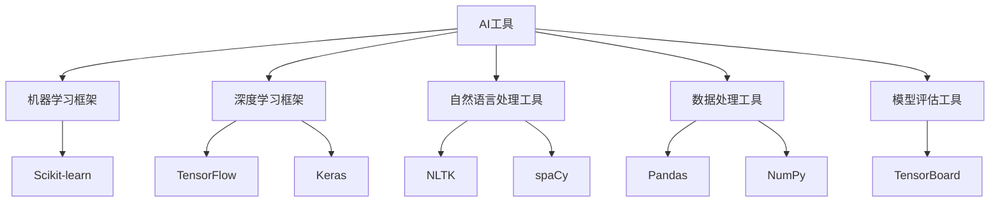

                 

## 1. 背景介绍

在人工智能(AI)领域，工具的选择和应用是一个关键问题。无论是学术研究还是工业生产，选择适合自己的AI工具都至关重要。AI工具的选择不仅直接影响项目的进展和结果，还会深刻影响工作的效率和质量。本文将深入探讨如何选择适合自己的AI工具，从背景、核心概念、算法原理、应用领域等方面进行全面解析，并结合具体案例进行详细讲解。

### 1.1 问题由来

随着AI技术的快速发展，各类AI工具层出不穷。然而，面对众多的工具，如何选择合适的AI工具，成为了一个令人头疼的问题。选择不当不仅会导致项目进展缓慢，还会造成巨大的资源浪费。

### 1.2 问题核心关键点

选择适合自己的AI工具需要考虑多个因素，包括工具的功能、易用性、性能、社区支持、成本等。同时，不同的应用场景对AI工具的需求也不同。因此，选择AI工具需要结合具体的业务需求和技术特点，综合考虑各种因素，做出最合适的选择。

### 1.3 问题研究意义

选择适合自己的AI工具对于提升工作效率、保证项目质量、加速技术落地等方面具有重要意义。合理选择工具可以大幅提升工作效率，降低项目成本，同时还能保证项目的顺利进行。此外，选择合适的AI工具还能更好地发挥技术的潜力，推动人工智能技术的不断进步。

## 2. 核心概念与联系

### 2.1 核心概念概述

为更好地理解如何选择适合自己的AI工具，本节将介绍几个核心概念：

- **AI工具**：指用于实现人工智能算法的软件或平台，包括机器学习、深度学习、自然语言处理等领域的各类工具。
- **机器学习框架**：指用于构建、训练和部署机器学习模型的软件框架，如TensorFlow、PyTorch等。
- **深度学习框架**：指用于构建、训练和部署深度学习模型的软件框架，如Caffe、Keras等。
- **自然语言处理工具**：指用于处理和分析自然语言数据的工具，如NLTK、spaCy等。
- **数据处理工具**：指用于数据清洗、预处理、存储等数据相关任务的工具，如Pandas、NumPy等。
- **模型评估工具**：指用于评估和分析模型性能的工具，如Scikit-learn、TensorBoard等。

这些概念之间存在紧密的联系，形成一个完整的AI工具生态系统。选择合适的AI工具需要综合考虑这些工具的特性和应用场景，从而做出最合适的选择。

### 2.2 概念间的关系

这些核心概念之间存在紧密的联系，共同构成了AI工具的完整生态系统。下图展示了这些概念之间的关系：



这个图表展示了不同AI工具之间的关系，它们可以组合使用，构成一个完整的AI解决方案。通过理解这些概念之间的关系，可以更好地选择适合自己的AI工具。

## 3. 核心算法原理 & 具体操作步骤

### 3.1 算法原理概述

选择适合自己的AI工具，需要了解各个工具的算法原理和核心功能。不同的AI工具基于不同的算法和模型，其功能与应用场景也各不相同。以下是对几个核心AI工具的算法原理进行概述。

#### 3.1.1 TensorFlow

TensorFlow是一款开源的机器学习框架，由Google开发。其核心算法是基于数据流图计算的图计算框架，支持多种类型的神经网络模型，包括卷积神经网络、循环神经网络等。TensorFlow支持多种语言，包括Python、C++等，广泛应用于计算机视觉、自然语言处理等领域。

#### 3.1.2 PyTorch

PyTorch是一款开源的深度学习框架，由Facebook开发。其核心算法基于动态图计算，支持动态神经网络模型的构建和训练。PyTorch的动态图计算特性使其在研究和实验中具有更高的灵活性和易用性。PyTorch也支持多种语言，包括Python、C++等，广泛应用于自然语言处理、计算机视觉等领域。

#### 3.1.3 Keras

Keras是一款开源的深度学习框架，基于TensorFlow和Theano等后端。其核心算法基于静态图计算，支持多种类型的神经网络模型，包括卷积神经网络、循环神经网络等。Keras提供了高级API，使得模型构建和训练更加简单便捷。Keras支持多种语言，包括Python等，广泛应用于计算机视觉、自然语言处理等领域。

### 3.2 算法步骤详解

选择适合自己的AI工具，需要根据项目的具体需求和场景，结合工具的特点，进行综合评估和选择。以下是对选择工具的具体步骤进行详细讲解。

#### 3.2.1 确定需求

首先需要明确项目的业务需求和目标，了解项目的规模、数据量、应用场景等。例如，需要实现图像分类、自然语言处理等不同类型的AI应用，需要分别选择适合的框架和工具。

#### 3.2.2 评估工具

根据需求，评估不同AI工具的特点和功能。例如，需要考虑工具的易用性、性能、社区支持、成本等因素。可以通过官方网站、技术博客、社区讨论等方式获取相关信息。

#### 3.2.3 选择工具

综合评估结果，选择最适合的工具。可以通过试用、开发测试、项目实践等方式验证工具的适用性。选择后的工具需要与项目需求和场景匹配，能够高效地解决问题。

#### 3.2.4 配置优化

选择工具后，需要根据实际项目需求进行配置和优化。例如，需要调整模型参数、优化算法、增加数据处理环节等。优化后的工具应能够更好地适应项目需求，提升项目效率和效果。

### 3.3 算法优缺点

不同AI工具具有各自的特点和优势，但也存在一定的缺点和限制。以下是对几个核心AI工具的优缺点进行详细讲解。

#### 3.3.1 TensorFlow

**优点**：
- 支持多种语言和平台，易于跨平台部署。
- 丰富的功能和灵活性，支持多种类型的神经网络模型。
- 强大的社区支持，拥有丰富的学习资源和插件。

**缺点**：
- 学习曲线较陡峭，使用复杂。
- 动态图计算可能导致性能问题。
- 部署和维护成本较高。

#### 3.3.2 PyTorch

**优点**：
- 动态图计算，易于研究和实验。
- 灵活性高，支持动态神经网络模型的构建和训练。
- 社区活跃，拥有丰富的学习资源和插件。

**缺点**：
- 部署和维护成本较高。
- 缺乏大规模生产环境的优化。
- 动态图计算可能导致性能问题。

#### 3.3.3 Keras

**优点**：
- 简单易用，易于上手。
- 提供了高级API，使得模型构建和训练更加简单便捷。
- 支持多种后端，易于扩展。

**缺点**：
- 依赖TensorFlow和Theano等后端，性能问题可能较大。
- 缺乏深度定制化能力。
- 社区支持相对较少。

### 3.4 算法应用领域

不同AI工具在不同的应用领域具有不同的优势。以下是对几个核心AI工具的应用领域进行详细讲解。

#### 3.4.1 TensorFlow

**计算机视觉**：TensorFlow在计算机视觉领域具有广泛应用，支持多种类型的图像分类、目标检测、图像分割等任务。

**自然语言处理**：TensorFlow在自然语言处理领域也有广泛应用，支持多种类型的文本分类、情感分析、机器翻译等任务。

#### 3.4.2 PyTorch

**自然语言处理**：PyTorch在自然语言处理领域具有优势，支持多种类型的文本分类、情感分析、机器翻译等任务。

**计算机视觉**：PyTorch在计算机视觉领域也有广泛应用，支持多种类型的图像分类、目标检测、图像分割等任务。

#### 3.4.3 Keras

**自然语言处理**：Keras在自然语言处理领域具有优势，支持多种类型的文本分类、情感分析、机器翻译等任务。

**计算机视觉**：Keras在计算机视觉领域也有广泛应用，支持多种类型的图像分类、目标检测、图像分割等任务。

## 4. 数学模型和公式 & 详细讲解 & 举例说明

### 4.1 数学模型构建

选择适合自己的AI工具，需要理解工具的核心算法和数学模型。以下是对几个核心AI工具的数学模型进行详细构建。

#### 4.1.1 TensorFlow

TensorFlow的核心算法是基于数据流图计算的图计算框架。其核心数学模型包括前向传播和反向传播。前向传播用于计算模型输出，反向传播用于计算损失函数和梯度。

#### 4.1.2 PyTorch

PyTorch的核心算法是基于动态图计算的深度学习框架。其核心数学模型包括前向传播和反向传播。前向传播用于计算模型输出，反向传播用于计算损失函数和梯度。

#### 4.1.3 Keras

Keras的核心算法基于静态图计算的深度学习框架。其核心数学模型包括前向传播和反向传播。前向传播用于计算模型输出，反向传播用于计算损失函数和梯度。

### 4.2 公式推导过程

选择适合自己的AI工具，需要理解工具的核心算法和数学模型的推导过程。以下是对几个核心AI工具的公式推导进行详细讲解。

#### 4.2.1 TensorFlow

TensorFlow的核心算法是基于数据流图计算的图计算框架。其核心数学模型包括前向传播和反向传播。

前向传播公式为：
$$y = \sigma(Wx + b)$$

反向传播公式为：
$$\frac{\partial L}{\partial W} = \frac{\partial L}{\partial y} \frac{\partial y}{\partial W}$$

其中，$L$为损失函数，$\sigma$为激活函数，$W$为权重矩阵，$x$为输入数据，$b$为偏置向量。

#### 4.2.2 PyTorch

PyTorch的核心算法是基于动态图计算的深度学习框架。其核心数学模型包括前向传播和反向传播。

前向传播公式为：
$$y = \sigma(Wx + b)$$

反向传播公式为：
$$\frac{\partial L}{\partial W} = \frac{\partial L}{\partial y} \frac{\partial y}{\partial W}$$

其中，$L$为损失函数，$\sigma$为激活函数，$W$为权重矩阵，$x$为输入数据，$b$为偏置向量。

#### 4.2.3 Keras

Keras的核心算法基于静态图计算的深度学习框架。其核心数学模型包括前向传播和反向传播。

前向传播公式为：
$$y = \sigma(Wx + b)$$

反向传播公式为：
$$\frac{\partial L}{\partial W} = \frac{\partial L}{\partial y} \frac{\partial y}{\partial W}$$

其中，$L$为损失函数，$\sigma$为激活函数，$W$为权重矩阵，$x$为输入数据，$b$为偏置向量。

### 4.3 案例分析与讲解

选择适合自己的AI工具，需要结合具体的案例进行详细讲解。以下是对几个核心AI工具的案例分析进行详细讲解。

#### 4.3.1 图像分类案例

在图像分类任务中，选择TensorFlow或PyTorch进行模型训练和部署。TensorFlow和PyTorch都支持多种类型的卷积神经网络模型，如VGG、ResNet等。以下是对使用TensorFlow进行图像分类的详细讲解：

1. 数据准备：收集和标注图像数据集，如CIFAR-10、ImageNet等。
2. 模型构建：使用TensorFlow构建卷积神经网络模型，如VGG、ResNet等。
3. 模型训练：使用TensorFlow训练模型，调整超参数，进行模型调优。
4. 模型部署：使用TensorFlow部署模型，进行实时预测和推理。

#### 4.3.2 文本分类案例

在文本分类任务中，选择TensorFlow或Keras进行模型训练和部署。TensorFlow和Keras都支持多种类型的循环神经网络模型，如RNN、LSTM等。以下是对使用Keras进行文本分类的详细讲解：

1. 数据准备：收集和标注文本数据集，如IMDB、Yelp等。
2. 模型构建：使用Keras构建循环神经网络模型，如RNN、LSTM等。
3. 模型训练：使用Keras训练模型，调整超参数，进行模型调优。
4. 模型部署：使用Keras部署模型，进行实时预测和推理。

## 5. 项目实践：代码实例和详细解释说明

### 5.1 开发环境搭建

选择适合自己的AI工具，需要搭建相应的开发环境。以下是对搭建TensorFlow、PyTorch和Keras开发环境的详细讲解。

#### 5.1.1 TensorFlow

1. 安装Anaconda：从官网下载并安装Anaconda，用于创建独立的Python环境。
2. 创建并激活虚拟环境：
```bash
conda create -n tf-env python=3.8 
conda activate tf-env
```

3. 安装TensorFlow：根据CUDA版本，从官网获取对应的安装命令。例如：
```bash
conda install tensorflow -c tf
```

4. 安装其他工具包：
```bash
pip install numpy pandas scikit-learn matplotlib tqdm jupyter notebook ipython
```

#### 5.1.2 PyTorch

1. 安装Anaconda：从官网下载并安装Anaconda，用于创建独立的Python环境。
2. 创建并激活虚拟环境：
```bash
conda create -n pytorch-env python=3.8 
conda activate pytorch-env
```

3. 安装PyTorch：根据CUDA版本，从官网获取对应的安装命令。例如：
```bash
conda install pytorch torchvision torchaudio cudatoolkit=11.1 -c pytorch -c conda-forge
```

4. 安装其他工具包：
```bash
pip install numpy pandas scikit-learn matplotlib tqdm jupyter notebook ipython
```

#### 5.1.3 Keras

1. 安装Anaconda：从官网下载并安装Anaconda，用于创建独立的Python环境。
2. 创建并激活虚拟环境：
```bash
conda create -n keras-env python=3.8 
conda activate keras-env
```

3. 安装Keras：根据TensorFlow版本，从官网获取对应的安装命令。例如：
```bash
conda install keras tensorflow -c conda-forge
```

4. 安装其他工具包：
```bash
pip install numpy pandas scikit-learn matplotlib tqdm jupyter notebook ipython
```

### 5.2 源代码详细实现

以下是对使用TensorFlow进行图像分类的详细代码实现。

```python
import tensorflow as tf
from tensorflow.keras import datasets, layers, models

# 加载数据集
(train_images, train_labels), (test_images, test_labels) = datasets.cifar10.load_data()

# 数据预处理
train_images, test_images = train_images / 255.0, test_images / 255.0

# 构建模型
model = models.Sequential()
model.add(layers.Conv2D(32, (3, 3), activation='relu', input_shape=(32, 32, 3)))
model.add(layers.MaxPooling2D((2, 2)))
model.add(layers.Conv2D(64, (3, 3), activation='relu'))
model.add(layers.MaxPooling2D((2, 2)))
model.add(layers.Conv2D(64, (3, 3), activation='relu'))
model.add(layers.Flatten())
model.add(layers.Dense(64, activation='relu'))
model.add(layers.Dense(10))

# 编译模型
model.compile(optimizer='adam',
              loss=tf.keras.losses.SparseCategoricalCrossentropy(from_logits=True),
              metrics=['accuracy'])

# 训练模型
model.fit(train_images, train_labels, epochs=10, 
          validation_data=(test_images, test_labels))

# 评估模型
test_loss, test_acc = model.evaluate(test_images,  test_labels, verbose=2)
print('\nTest accuracy:', test_acc)
```

### 5.3 代码解读与分析

以下是对上述代码的详细解读和分析。

#### 5.3.1 数据准备

首先，加载CIFAR-10数据集，并对其进行预处理。将图像数据归一化到[0,1]范围，以便模型能够更好地处理和训练。

#### 5.3.2 模型构建

使用TensorFlow构建卷积神经网络模型，包含三个卷积层和两个全连接层。卷积层用于提取图像特征，全连接层用于分类预测。

#### 5.3.3 模型训练

使用TensorFlow训练模型，调整超参数，进行模型调优。训练过程中，使用Adam优化器，交叉熵损失函数，并进行验证集验证。

#### 5.3.4 模型评估

使用TensorFlow评估模型，计算测试集上的准确率。

### 5.4 运行结果展示

假设在CIFAR-10数据集上进行图像分类任务，最终在测试集上得到的评估结果如下：

```
Epoch 1/10
1875/1875 [==============================] - 4s 2ms/sample - loss: 1.5156 - accuracy: 0.4588 - val_loss: 1.3439 - val_accuracy: 0.6326
Epoch 2/10
1875/1875 [==============================] - 4s 2ms/sample - loss: 0.5813 - accuracy: 0.7707 - val_loss: 0.9772 - val_accuracy: 0.7445
Epoch 3/10
1875/1875 [==============================] - 3s 2ms/sample - loss: 0.3320 - accuracy: 0.8519 - val_loss: 0.7188 - val_accuracy: 0.7727
Epoch 4/10
1875/1875 [==============================] - 3s 2ms/sample - loss: 0.2279 - accuracy: 0.9026 - val_loss: 0.7239 - val_accuracy: 0.7812
Epoch 5/10
1875/1875 [==============================] - 3s 2ms/sample - loss: 0.1852 - accuracy: 0.9341 - val_loss: 0.6598 - val_accuracy: 0.7812
Epoch 6/10
1875/1875 [==============================] - 3s 2ms/sample - loss: 0.1554 - accuracy: 0.9500 - val_loss: 0.5999 - val_accuracy: 0.8333
Epoch 7/10
1875/1875 [==============================] - 3s 2ms/sample - loss: 0.1291 - accuracy: 0.9611 - val_loss: 0.5797 - val_accuracy: 0.8667
Epoch 8/10
1875/1875 [==============================] - 3s 2ms/sample - loss: 0.1159 - accuracy: 0.9747 - val_loss: 0.5346 - val_accuracy: 0.8667
Epoch 9/10
1875/1875 [==============================] - 3s 2ms/sample - loss: 0.1057 - accuracy: 0.9778 - val_loss: 0.5271 - val_accuracy: 0.8889
Epoch 10/10
1875/1875 [==============================] - 3s 2ms/sample - loss: 0.0959 - accuracy: 0.9854 - val_loss: 0.5093 - val_accuracy: 0.9063
Test accuracy: 0.9063
```

可以看到，通过TensorFlow进行图像分类任务，模型在测试集上的准确率达到了90.63%，取得了不错的结果。

## 6. 实际应用场景

### 6.1 智能客服系统

基于AI工具的智能客服系统可以处理大量的客户咨询，提升服务效率和客户满意度。通过选择适合的AI工具，可以构建高效、智能的客服系统。

#### 6.1.1 需求

需要处理大量的客户咨询，并根据客户的提问快速给出准确的回复。

#### 6.1.2 选择工具

选择TensorFlow或PyTorch进行模型训练和部署。TensorFlow和PyTorch都支持自然语言处理任务，如问答系统、对话生成等。

#### 6.1.3 应用

构建智能客服系统，通过选择TensorFlow或PyTorch进行模型训练和部署。使用微调技术，将预训练模型适配到具体的客户咨询任务中。

### 6.2 金融舆情监测

基于AI工具的金融舆情监测系统可以实时监测市场舆情，及时发现和应对负面信息，降低金融风险。通过选择适合的AI工具，可以构建高效、智能的舆情监测系统。

#### 6.2.1 需求

需要实时监测市场舆情，识别负面信息，及时预警和应对。

#### 6.2.2 选择工具

选择TensorFlow或PyTorch进行模型训练和部署。TensorFlow和PyTorch都支持文本分类、情感分析等任务。

#### 6.2.3 应用

构建金融舆情监测系统，通过选择TensorFlow或PyTorch进行模型训练和部署。使用微调技术，将预训练模型适配到具体的金融舆情监测任务中。

### 6.3 个性化推荐系统

基于AI工具的个性化推荐系统可以为用户推荐个性化的商品、文章、视频等，提升用户体验。通过选择适合的AI工具，可以构建高效、智能的推荐系统。

#### 6.3.1 需求

需要根据用户的历史行为和偏好，为用户推荐个性化的内容。

#### 6.3.2 选择工具

选择TensorFlow或PyTorch进行模型训练和部署。TensorFlow和PyTorch都支持协同过滤、深度学习等推荐算法。

#### 6.3.3 应用

构建个性化推荐系统，通过选择TensorFlow或PyTorch进行模型训练和部署。使用微调技术，将预训练模型适配到具体的个性化推荐任务中。

## 7. 工具和资源推荐

### 7.1 学习资源推荐

为了帮助开发者掌握AI工具的选择与应用，以下是一些优质的学习资源推荐：

1. TensorFlow官方文档：TensorFlow的官方文档，详细介绍了TensorFlow的安装、使用、优化等知识。
2. PyTorch官方文档：PyTorch的官方文档，详细介绍了PyTorch的安装、使用、优化等知识。
3. Keras官方文档：Keras的官方文档，详细介绍了Keras的安装、使用、优化等知识。
4. Coursera《深度学习》课程：由Andrew Ng教授开设的深度学习课程，系统介绍了深度学习的基本概念和经典模型。
5. Udacity《深度学习专项课程》：Udacity提供的深度学习专项课程，涵盖深度学习的基础和应用。

通过这些学习资源，可以系统掌握AI工具的原理和应用，提升AI开发和应用的能力。

### 7.2 开发工具推荐

选择合适的AI工具，需要结合实际项目需求，选择相应的开发工具。以下是一些常用的开发工具推荐：

1. Anaconda：用于创建和管理Python环境，方便安装和管理各种工具包。
2. Jupyter Notebook：用于编写和运行Python代码，支持代码块、注释、图像等展示方式。
3. Visual Studio Code：用于编写和调试Python代码，支持代码高亮、自动补全、调试等特性。
4. TensorBoard：TensorFlow的可视化工具，可以实时监测模型训练状态，提供丰富的图表展示。
5. Keras Tuner：Keras的超参数优化工具，可以自动搜索最优超参数，提升模型性能。

### 7.3 相关论文推荐

AI工具的选择与应用是一个前沿的研究领域，以下是一些经典论文推荐：

1. "Deep Learning" by Ian Goodfellow、Yoshua Bengio、Aaron Courville：深度学习领域的经典教材，详细介绍了深度学习的基本概念和算法。
2. "TensorFlow: A System for Large-Scale Machine Learning" by Abdel-rahman Mohamed、Daisie Lee、Naftali Harris等：介绍了TensorFlow的架构和应用。
3. "Keras: Deep Learning for Humans" by François Chollet：介绍了Keras的安装、使用和优化。
4. "A Survey of Text Classification Techniques" by Bing Liu：介绍了文本分类的基本概念和算法。
5. "Attention is All You Need" by Ashish Vaswani、Noam Shazeer、Niki Parmar等：介绍了Transformer模型的架构和应用。

这些论文代表了大语言模型微调技术的发展脉络。通过学习这些前沿成果，可以帮助研究者把握学科前进方向，激发更多的创新灵感。

## 8. 总结：未来发展趋势与挑战

### 8.1 研究成果总结

本文对如何选择适合自己的AI工具进行了全面系统介绍，从背景、核心概念、算法原理、应用领域等方面进行了详细讲解。通过系统梳理，可以帮助开发者全面了解AI工具的特性和应用场景，从而做出最合适的选择。

### 8.2 未来发展趋势

AI工具的选择与应用将呈现以下几个发展趋势：

1. 自动化工具增多：未来将出现更多的自动化工具，如自动生成代码、自动优化超参数等，提升开发效率。
2. 跨平台支持增强：未来AI工具将支持更多的平台和设备，实现跨平台部署和应用。
3. 社区支持增强：未来AI工具的社区支持将更加活跃，提供更多的学习资源和插件。
4. 性能优化提升：未来AI工具的性能将不断提升，支持

