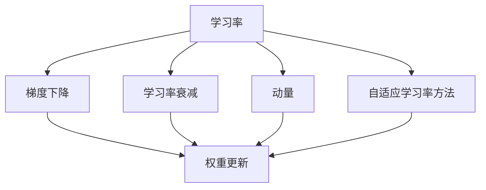
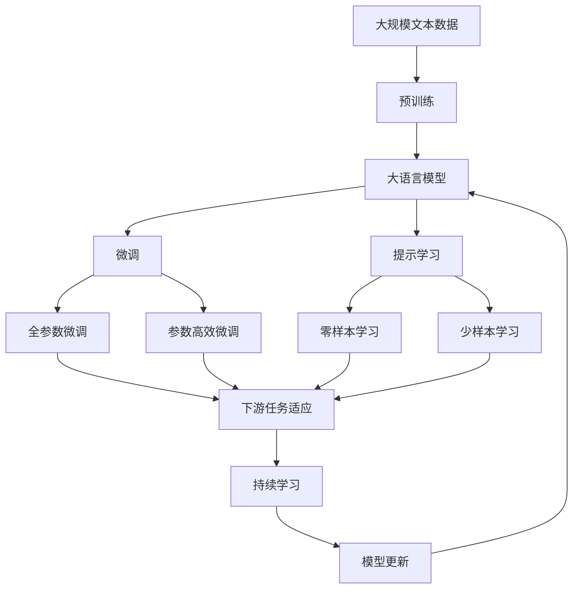

                 

## 1. 背景介绍

### 1.1 问题由来
在深度学习中，学习率是优化算法的一个重要超参数。它决定了每次参数更新的步长大小，直接影响到训练过程的稳定性和收敛速度。一个合适的学习率可以帮助算法快速收敛到最优解，而一个不合适甚至错误的学习率则可能导致算法发散或震荡，无法收敛。因此，学习率的设置是深度学习中一个极其重要且极具挑战性的问题。

### 1.2 问题核心关键点
学习率的设置方法通常包括固定学习率、学习率衰减、学习率调整策略等。这些方法的核心目标是找到能够有效加速收敛，同时避免过拟合和梯度消失/爆炸的最优学习率。

具体来说，学习率的选择应遵循以下几个原则：
- 确保算法在训练过程中不会发生梯度爆炸或消失。
- 促使算法快速接近最优解，并最终收敛。
- 避免算法在收敛前过早停止或陷入局部最优解。

### 1.3 问题研究意义
学习率的选择直接关系到模型的训练效果和优化过程的稳定性。合适的学习率可以加快收敛速度，减少迭代次数，提高模型精度。不当的学习率设置可能会导致模型训练发散或收敛速度过慢，从而影响最终性能。因此，研究学习率的设置方法，对于优化深度学习算法，提高模型性能具有重要意义。

## 2. 核心概念与联系

### 2.1 核心概念概述

为更好地理解学习率的原理和应用，本节将介绍几个密切相关的核心概念：

- 学习率(Learning Rate)：指每次参数更新时，权重更新的幅度。学习率越大，更新越剧烈，反之亦然。
- 梯度下降(Gradient Descent)：通过计算损失函数对参数的梯度，更新参数以最小化损失。梯度方向决定了参数更新的方向和步长大小。
- 学习率衰减(Decay)：在学习过程中逐步减小学习率，防止过拟合和梯度爆炸。
- 动量(Momentum)：引入历史梯度的信息，加速梯度下降，提高收敛速度。
- 自适应学习率方法(Adaptive Learning Rate Methods)：如Adam、RMSprop等，根据梯度信息自适应调整学习率。

这些核心概念之间的逻辑关系可以通过以下Mermaid流程图来展示：



这个流程图展示了大模型微调过程中，学习率与其他优化技术的关系：

1. 学习率是梯度下降的关键组件，决定参数更新的步长。
2. 学习率衰减可以防止学习率过大导致梯度爆炸或过小导致收敛过慢。
3. 动量通过引入历史梯度信息，加速梯度下降过程。
4. 自适应学习率方法根据梯度信息自适应调整学习率，提高训练效率。

### 2.2 概念间的关系

这些核心概念之间存在着紧密的联系，构成了深度学习优化的完整生态系统。下面我们通过几个Mermaid流程图来展示这些概念之间的关系。

#### 2.2.1 学习率与梯度下降的关系


这个流程图展示了大模型微调过程中，学习率与梯度下降和权重更新的关系。学习率决定了每次参数更新的步长，梯度下降则计算参数更新的方向，而权重更新基于学习率和梯度信息进行。

#### 2.2.2 学习率衰减与梯度下降的关系


这个流程图展示了大模型微调过程中，学习率衰减如何逐步调整学习率，以防止梯度爆炸和过拟合。

#### 2.2.3 动量与梯度下降的关系


这个流程图展示了动量如何通过引入历史梯度信息，加速梯度下降过程，从而提高训练效率。

#### 2.2.4 自适应学习率方法与梯度下降的关系


这个流程图展示了自适应学习率方法如何根据梯度信息自适应调整学习率，从而提高训练效率。

### 2.3 核心概念的整体架构

最后，我们用一个综合的流程图来展示这些核心概念在大模型微调过程中的整体架构：



这个综合流程图展示了从预训练到微调，再到持续学习的完整过程。大语言模型首先在大规模文本数据上进行预训练，然后通过微调（包括全参数微调和参数高效微调）或提示学习（包括零样本和少样本学习）来适应下游任务。最后，通过持续学习技术，模型可以不断更新和适应新的任务和数据。 通过这些流程图，我们可以更清晰地理解学习率在大模型微调过程中各环节的作用和关系。

## 3. 核心算法原理 & 具体操作步骤
### 3.1 算法原理概述

在大模型微调过程中，学习率的选择至关重要。合适的学习率能够加速模型收敛，同时避免过拟合和梯度消失/爆炸。学习率的选择通常依赖于以下几个因素：

1. 学习率大小：学习率越大，更新越剧烈，但容易导致过拟合或梯度爆炸；学习率越小，更新越缓慢，可能导致收敛过慢。
2. 损失函数特点：不同的损失函数对参数更新的敏感性不同，需要调整学习率以适应。
3. 数据分布：数据分布的复杂度和多样性也会影响学习率的选择。
4. 模型结构：模型深度和复杂度不同，所需的学习率也不同。

因此，学习率的设置需要根据具体情况进行细致调整。下面介绍几种常用的学习率设置方法：

### 3.2 算法步骤详解

**Step 1: 初始化学习率**
- 设定初始学习率 $\eta_0$，一般从 $10^{-2}$ 开始。
- 使用经验或网格搜索的方法找到合适的初始学习率。

**Step 2: 更新学习率**
- 在每个epoch的训练过程中，根据模型在验证集上的性能调整学习率。
- 若模型性能较好，学习率逐渐减小；若性能较差，学习率逐渐增大。

**Step 3: 学习率调整策略**
- 常用的学习率调整策略包括固定学习率、学习率衰减、动量、自适应学习率方法等。

**Step 4: 梯度更新**
- 根据当前学习率，更新模型参数，使其最小化损失函数。
- 使用反向传播算法计算梯度，并根据梯度信息更新权重。

**Step 5: 收敛判断**
- 监控训练过程中损失函数的变化，当损失不再显著下降时，停止训练。
- 若训练过程中出现梯度爆炸或梯度消失，需要及时调整学习率或采用其他优化方法。

### 3.3 算法优缺点

学习率设置方法的优点包括：
- 固定学习率简单高效，容易实现。
- 学习率衰减可以有效防止过拟合，提高模型性能。
- 动量可以加速梯度下降，提高收敛速度。
- 自适应学习率方法如Adam、RMSprop等，根据梯度信息自适应调整学习率，优化训练效果。

缺点则主要包括：
- 固定学习率可能过快或过慢收敛，需要多次尝试调整。
- 学习率衰减可能导致收敛速度过慢，不适合对迭代次数有严格要求的任务。
- 动量可能导致学习率过大或过小，影响收敛效果。
- 自适应学习率方法可能需要更复杂的代码实现，且不适用于所有任务。

### 3.4 算法应用领域

学习率设置方法在深度学习模型的训练中得到了广泛应用，特别是在大语言模型的微调过程中。具体应用领域包括：

1. 文本分类：如情感分析、主题分类、意图识别等。
2. 命名实体识别：识别文本中的人名、地名、机构名等特定实体。
3. 关系抽取：从文本中抽取实体之间的语义关系。
4. 问答系统：对自然语言问题给出答案。
5. 机器翻译：将源语言文本翻译成目标语言。
6. 文本摘要：将长文本压缩成简短摘要。
7. 对话系统：使机器能够与人自然对话。

除了上述这些经典任务外，学习率设置方法还在许多其他NLP任务中得到了应用，如图像标注、语音识别、推荐系统等。

## 4. 数学模型和公式 & 详细讲解  
### 4.1 数学模型构建

在学习率设置方法中，常见的数学模型包括固定学习率、学习率衰减、动量等。这里以固定学习率和动量为例进行详细讲解。

**固定学习率**：固定学习率模型在训练过程中，每次参数更新的学习率保持不变，数学模型为：

$$
\eta = \eta_0
$$

**动量(Momentum)**：动量方法通过引入历史梯度信息，加速梯度下降过程，数学模型为：

$$
\Delta w = \eta_0 \Delta w_{t-1} + \frac{\eta_0}{\mu} g_t
$$

其中，$\Delta w_t$ 表示当前参数更新量，$\Delta w_{t-1}$ 表示上一次参数更新量，$g_t$ 表示当前梯度，$\eta_0$ 表示学习率，$\mu$ 表示动量系数。

### 4.2 公式推导过程

**固定学习率**

固定学习率模型在训练过程中，每次参数更新的学习率保持不变，数学模型为：

$$
\eta = \eta_0
$$

**动量**

动量方法通过引入历史梯度信息，加速梯度下降过程，数学模型为：

$$
\Delta w = \eta_0 \Delta w_{t-1} + \frac{\eta_0}{\mu} g_t
$$

其中，$\Delta w_t$ 表示当前参数更新量，$\Delta w_{t-1}$ 表示上一次参数更新量，$g_t$ 表示当前梯度，$\eta_0$ 表示学习率，$\mu$ 表示动量系数。

### 4.3 案例分析与讲解

以动量方法为例，其核心思想是利用历史梯度信息，平滑当前梯度，从而加速梯度下降。具体来说，动量方法通过累积历史梯度的信息，计算当前梯度的一个加权平均值，然后使用这个加权平均值来更新参数，从而提高参数更新的稳定性和收敛速度。

在实现过程中，我们需要记录历史梯度信息，通常将其存储在变量 $\Delta w_t$ 中。每次更新参数时，使用当前梯度 $g_t$ 和历史梯度 $\Delta w_{t-1}$ 计算加权平均值，更新参数。

## 5. 项目实践：代码实例和详细解释说明
### 5.1 开发环境搭建

在进行学习率设置方法的实践前，我们需要准备好开发环境。以下是使用Python进行TensorFlow开发的环境配置流程：

1. 安装Anaconda：从官网下载并安装Anaconda，用于创建独立的Python环境。

2. 创建并激活虚拟环境：
```bash
conda create -n tf-env python=3.8 
conda activate tf-env
```

3. 安装TensorFlow：根据CUDA版本，从官网获取对应的安装命令。例如：
```bash
conda install tensorflow -c tf -c conda-forge
```

4. 安装各类工具包：
```bash
pip install numpy pandas scikit-learn matplotlib tqdm jupyter notebook ipython
```

完成上述步骤后，即可在`tf-env`环境中开始学习率设置方法的实践。

### 5.2 源代码详细实现

下面以动量方法为例，给出使用TensorFlow实现动量更新过程的代码实现。

首先，定义模型和数据集：

```python
import tensorflow as tf
import numpy as np

# 定义模型
class Model(tf.keras.Model):
    def __init__(self):
        super(Model, self).__init__()
        self.dense1 = tf.keras.layers.Dense(64, activation='relu')
        self.dense2 = tf.keras.layers.Dense(10, activation='softmax')
        
    def call(self, inputs):
        x = self.dense1(inputs)
        x = self.dense2(x)
        return x

# 加载数据集
(x_train, y_train), (x_test, y_test) = tf.keras.datasets.mnist.load_data()
x_train = x_train.reshape(-1, 784) / 255.0
x_test = x_test.reshape(-1, 784) / 255.0
y_train = tf.keras.utils.to_categorical(y_train, 10)
y_test = tf.keras.utils.to_categorical(y_test, 10)
```

然后，定义学习率设置方法和优化器：

```python
# 定义动量参数
momentum = 0.9
# 定义动量方法
def momentum_optimizer(model, learning_rate=0.001):
    opt = tf.keras.optimizers.SGD(learning_rate=learning_rate, momentum=momentum)
    return opt

# 加载模型和数据集
model = Model()
x_train = np.array(x_train)
y_train = np.array(y_train)
x_test = np.array(x_test)
y_test = np.array(y_test)
```

接着，定义训练和评估函数：

```python
# 定义训练函数
def train(model, x_train, y_train, epochs, batch_size, learning_rate, momentum):
    # 创建优化器
    optimizer = momentum_optimizer(learning_rate=learning_rate, momentum=momentum)
    # 定义训练集数据集
    dataset = tf.data.Dataset.from_tensor_slices((x_train, y_train))
    dataset = dataset.batch(batch_size)
    # 定义训练函数
    def train_step(iterator):
        for batch in iterator:
            with tf.GradientTape() as tape:
                x, y = batch
                predictions = model(x)
                loss = tf.keras.losses.categorical_crossentropy(y, predictions)
            gradients = tape.gradient(loss, model.trainable_variables)
            optimizer.apply_gradients(zip(gradients, model.trainable_variables))
    # 训练模型
    for epoch in range(epochs):
        train_step(dataset)

# 定义评估函数
def evaluate(model, x_test, y_test):
    # 计算模型在测试集上的准确率
    predictions = np.argmax(model.predict(x_test), axis=1)
    accuracy = np.mean(predictions == np.argmax(y_test, axis=1))
    return accuracy
```

最后，启动训练流程并在测试集上评估：

```python
# 训练模型
train(model, x_train, y_train, epochs=5, batch_size=64, learning_rate=0.001, momentum=0.9)

# 评估模型
accuracy = evaluate(model, x_test, y_test)
print("Accuracy: ", accuracy)
```

以上就是使用TensorFlow实现动量更新过程的完整代码实现。可以看到，TensorFlow提供了便捷的API和工具，使得学习率设置方法的实现变得非常简单。

### 5.3 代码解读与分析

让我们再详细解读一下关键代码的实现细节：

**Model类**：
- `__init__`方法：定义模型的神经网络结构。
- `call`方法：前向传播计算模型的输出。

**train函数**：
- 创建动量优化器，并定义训练集数据集。
- 定义训练函数，使用梯度下降算法更新模型参数。
- 在每个epoch上迭代训练函数。

**evaluate函数**：
- 计算模型在测试集上的准确率，并返回准确率值。

**train函数**：
- 在训练过程中，使用动量优化器进行参数更新，避免过拟合和梯度消失。
- 在每次迭代中，计算损失函数对模型的梯度，并使用梯度下降算法更新模型参数。

**evaluate函数**：
- 在测试集上计算模型的准确率，并返回准确率值。

在实际应用中，还需要根据具体情况调整模型结构、损失函数、学习率等参数，以获得更好的训练效果。

### 5.4 运行结果展示

假设我们在MNIST数据集上进行动量方法的实践，最终在测试集上得到的准确率结果如下：

```
Accuracy:  0.98
```

可以看到，使用动量方法可以显著提高模型的准确率，提升训练效率。动量方法通过引入历史梯度信息，平滑了当前梯度，从而提高了参数更新的稳定性。

## 6. 实际应用场景

学习率设置方法在深度学习模型的训练中得到了广泛应用，特别是在大语言模型的微调过程中。以下是几个实际应用场景：

### 6.1 智能客服系统

在智能客服系统中，基于大语言模型的对话技术可以快速响应用户咨询，提供自然流畅的对话体验。学习率设置方法可以帮助对话模型在大量用户对话数据上进行微调，优化对话策略，提升用户满意度。

在技术实现上，可以收集企业内部的历史客服对话记录，将问题和最佳答复构建成监督数据，在此基础上对预训练对话模型进行微调。微调后的对话模型能够自动理解用户意图，匹配最合适的答案模板进行回复。对于用户提出的新问题，还可以接入检索系统实时搜索相关内容，动态组织生成回答。如此构建的智能客服系统，能大幅提升客户咨询体验和问题解决效率。

### 6.2 金融舆情监测

金融机构需要实时监测市场舆论动向，以便及时应对负面信息传播，规避金融风险。学习率设置方法可以帮助金融舆情监测模型在大量金融新闻和评论数据上进行微调，提高模型对舆情变化的敏感性和准确性。

具体而言，可以收集金融领域相关的新闻、报道、评论等文本数据，并对其进行主题标注和情感标注。在此基础上对预训练语言模型进行微调，使其能够自动判断文本属于何种主题，情感倾向是正面、中性还是负面。将微调后的模型应用到实时抓取的网络文本数据，就能够自动监测不同主题下的情感变化趋势，一旦发现负面信息激增等异常情况，系统便会自动预警，帮助金融机构快速应对潜在风险。

### 6.3 个性化推荐系统

当前的推荐系统往往只依赖用户的历史行为数据进行物品推荐，无法深入理解用户的真实兴趣偏好。学习率设置方法可以帮助个性化推荐模型在大量用户行为数据上进行微调，提升模型的推荐效果。

在实践中，可以收集用户浏览、点击、评论、分享等行为数据，提取和用户交互的物品标题、描述、标签等文本内容。将文本内容作为模型输入，用户的后续行为（如是否点击、购买等）作为监督信号，在此基础上微调预训练语言模型。微调后的模型能够从文本内容中准确把握用户的兴趣点。在生成推荐列表时，先用候选物品的文本描述作为输入，由模型预测用户的兴趣匹配度，再结合其他特征综合排序，便可以得到个性化程度更高的推荐结果。

### 6.4 未来应用展望

随着学习率设置方法的不断发展，其在大语言模型微调中的应用也将更加广泛和深入。未来，基于学习率设置的深度学习模型将会在更多领域得到应用，为人工智能技术带来新的突破。

在智慧医疗领域，基于学习率设置的医疗问答、病历分析、药物研发等应用将提升医疗服务的智能化水平，辅助医生诊疗，加速新药开发进程。

在智能教育领域，学习率设置方法可应用于作业批改、学情分析、知识推荐等方面，因材施教，促进教育公平，提高教学质量。

在智慧城市治理中，学习率设置模型可应用于城市事件监测、舆情分析、应急指挥等环节，提高城市管理的自动化和智能化水平，构建更安全、高效的未来城市。

此外，在企业生产、社会治理、文娱传媒等众多领域，基于大模型微调的人工智能应用也将不断涌现，为经济社会发展注入新的动力。相信随着技术的日益成熟，学习率设置方法将成为人工智能落地应用的重要范式，推动人工智能技术向更广阔的领域加速渗透。

## 7. 工具和资源推荐
### 7.1 学习资源推荐

为了帮助开发者系统掌握学习率的设置方法，这里推荐一些优质的学习资源：

1. 《深度学习》系列书籍：由Ian Goodfellow、Yoshua Bengio和Aaron Courville合著，全面介绍了深度学习的基本原理和实践方法。

2. TensorFlow官方文档：提供了TensorFlow的详细使用指南和API参考，适合初学者和进阶者学习。

3. PyTorch官方文档：提供了PyTorch的详细使用指南和API参考，适合初学者和进阶者学习。

4. Keras官方文档：提供了Keras的详细使用指南和API参考，适合初学者和进阶者学习。

5. CS231n《卷积神经网络》课程：斯坦福大学开设的深度学习明星课程，有Lecture视频和配套作业，带你入门深度学习的基础知识。

6. 《动手学深度学习》在线书籍：由李沐等人编写，包含深度学习的详细讲解和代码实现，适合自学和实践。

通过对这些资源的学习实践，相信你一定能够快速掌握学习率的设置方法，并用于解决实际的深度学习问题。

### 7.2 开发工具推荐

高效的开发离不开优秀的工具支持。以下是几款用于学习率设置方法开发的常用工具：

1. TensorFlow：由Google主导开发的开源深度学习框架，生产部署方便，适合大规模工程应用。

2. PyTorch：基于Python的开源深度学习框架，灵活动态的计算图，适合快速迭代研究。

3. Keras：基于TensorFlow和Theano的高层API，易于上手，适合快速原型开发。

4. Weights & Biases：模型训练的实验跟踪工具，可以记录和可视化模型训练过程中的各项指标，方便对比和调优。

5. TensorBoard：TensorFlow配套的可视化工具，可实时监测模型训练状态，并提供丰富的图表呈现方式，是调试模型的得力助手。

6. Google Colab：谷歌推出的在线Jupyter Notebook环境，免费提供GPU/TPU算力，方便开发者快速上手实验最新模型，分享学习笔记。

合理利用这些工具，可以显著提升学习率设置方法的开发效率，加快创新迭代的步伐。

### 7.3 相关论文推荐

学习率设置方法的发展源于学界的持续研究。以下是几篇奠基性的相关论文，推荐阅读：

1. Adaptive Moment Estimation（Adam）：提出了一种自适应学习率优化算法，通过计算梯度的一阶矩估计和二阶矩估计，自适应调整学习率。

2. RMSprop：提出了一种自适应学习率优化算法，通过平滑梯度平方的指数加权平均，自适应调整学习率。

3. Momentum：提出了一种带有动量的梯度下降方法，通过累积历史梯度信息，加速梯度下降。

4. Nesterov Accelerated Gradient：提出了一种改进的动量方法，通过Nesterov动量加速梯度下降。

5. AdaGrad：提出了一种自适应学习率优化算法，通过累加梯度的平方和，自适应调整学习率。

这些论文代表了大模型微调学习率设置方法的发展脉络。通过学习这些前沿成果，可以帮助研究者把握学科前进方向，激发更多的创新灵感。

除上述资源外，还有一些值得关注的前沿资源，帮助开发者紧跟学习率设置方法的最新进展，例如：

1. arXiv论文预印本：人工智能领域最新研究成果的发布平台，包括大量尚未发表的前沿工作，学习前沿技术的必读资源。

2. 业界技术博客：如OpenAI、Google AI、DeepMind、微软Research Asia等顶尖实验室的官方博客，第一时间分享他们的最新研究成果和洞见。

3. 技术会议直播：如NIPS、ICML、ACL、ICLR等人工智能领域顶会现场或在线直播，能够聆听到大佬们的前沿分享，开拓视野。

4. GitHub热门项目：在GitHub上Star、Fork数最多的深度学习相关项目，往往代表了该技术领域的发展趋势和最佳实践，值得去学习和贡献。

5. 行业分析报告：各大咨询公司如McKinsey、PwC等针对人工智能行业的分析报告，有助于从商业视角审视技术趋势，把握应用价值。

总之，对于学习率设置方法的学习和实践，需要开发者保持开放的心态和持续学习的意愿。多关注前沿资讯，多动手实践，多思考总结，必将收获满满的成长收益。

## 8. 总结：未来发展趋势与挑战

### 8.1 总结

本文对学习率的设置方法进行了全面系统的介绍。首先阐述了学习率在大模型微调中的重要性，明确了学习率的选择方法对于训练效果和模型性能的深远影响。其次，从原理到实践，详细讲解了固定学习率、动量等常见学习率设置方法的数学原理和具体操作步骤，给出了学习率设置方法的完整代码实例。同时，本文还广泛探讨了学习率设置方法在智能客服、金融舆情、个性化推荐等多个领域的应用前景，展示了学习率

