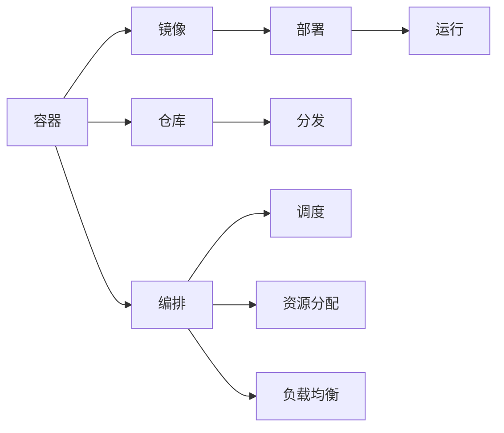
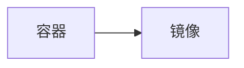
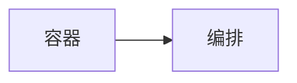
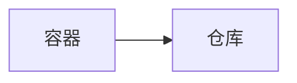
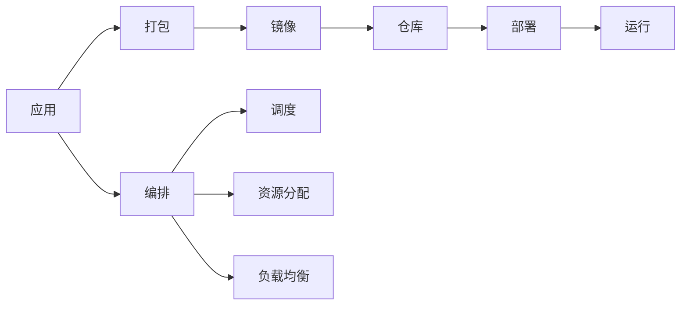

                 

# 容器 原理与代码实例讲解

> 关键词：容器, 原理, 代码实例, 核心概念, 学习资源, 开发工具, 实际应用场景

## 1. 背景介绍

### 1.1 问题由来
随着微服务架构的兴起，越来越多的大型企业采用微服务来提升系统的可扩展性和灵活性。然而，在微服务架构中，多个微服务之间的依赖关系复杂，管理维护困难。容器技术的出现，通过将应用打包成独立的镜像，解决了微服务之间的依赖问题，简化了系统的管理和部署。容器技术成为了现代软件开发的基石。

### 1.2 问题核心关键点
容器技术主要包括Docker、Kubernetes等。其中，Docker是一个开源的容器引擎，可以将应用打包成容器镜像，提供轻量级的运行环境。Kubernetes是一个开源的容器编排系统，用于自动化地部署、扩展和管理容器化应用。容器技术通过将应用打包成容器镜像，提供了轻量级、跨平台、可移植的运行环境，极大提升了系统的部署和运维效率。

### 1.3 问题研究意义
容器技术是现代软件开发的重要技术，通过将应用打包成容器镜像，简化了应用的部署和管理，提高了系统的可扩展性和可维护性。学习容器技术，对于提升软件开发效率、优化系统架构、应对大规模数据处理的需求，具有重要意义。

## 2. 核心概念与联系

### 2.1 核心概念概述

为更好地理解容器技术，本节将介绍几个密切相关的核心概念：

- 容器（Container）：一个轻量级的运行环境，包含应用及其依赖项。容器技术可以将应用及其依赖项打包成镜像，在任意环境中快速部署和运行。
- 镜像（Image）：一个静态的容器定义，包含了应用及其依赖项的打包结果。镜像可以分发、部署、运行，是容器的运行基础。
- 仓库（Registry）：一个集中存储和管理镜像的地方，通常支持公共、私有镜像的存储。仓库是容器镜像的分发中心，提供了镜像的版本管理和分发服务。
- 编排（Orchestration）：自动化管理容器环境，包括容器调度、资源分配、负载均衡等。编排技术可以自动化地部署、扩展和管理容器环境，提升了系统运维效率。

这些核心概念之间的逻辑关系可以通过以下Mermaid流程图来展示：



这个流程图展示了容器技术的主要概念及其之间的关系：

1. 容器作为轻量级的运行环境，通过镜像提供静态定义。
2. 镜像存储在仓库中，可以分发和部署。
3. 容器可以通过编排技术进行调度、资源分配和负载均衡，自动化管理容器环境。

### 2.2 概念间的关系

这些核心概念之间存在着紧密的联系，形成了容器技术的完整生态系统。下面我通过几个Mermaid流程图来展示这些概念之间的关系。

#### 2.2.1 容器与镜像的关系



这个流程图展示了容器与镜像的基本关系：容器是通过镜像定义的，镜像包含了容器所需的应用及其依赖项。

#### 2.2.2 容器与编排的关系



这个流程图展示了容器与编排的关系：通过编排技术，可以对容器进行调度、资源分配和负载均衡，自动化管理容器环境。

#### 2.2.3 容器与仓库的关系



这个流程图展示了容器与仓库的关系：容器镜像可以存储在仓库中，供多个容器实例使用。

### 2.3 核心概念的整体架构

最后，我们用一个综合的流程图来展示这些核心概念在大规模容器化应用中的整体架构：



这个综合流程图展示了容器化应用的完整过程，包括应用的打包、镜像的存储、部署、运行以及编排技术的应用。

## 3. 核心算法原理 & 具体操作步骤
### 3.1 算法原理概述

容器技术的基本原理是将应用及其依赖项打包成镜像，提供轻量级、跨平台、可移植的运行环境。容器技术通过镜像隔离了应用与宿主机，简化了应用的部署和管理，提高了系统的可扩展性和可维护性。

### 3.2 算法步骤详解

容器技术的核心算法步骤包括以下几个关键步骤：

1. 应用打包：将应用及其依赖项打包成镜像。
2. 镜像存储：将镜像存储在仓库中，提供分发服务。
3. 容器部署：从仓库中获取镜像，部署成容器实例。
4. 容器编排：通过编排技术，自动化管理容器环境。

下面详细讲解每个步骤的实现细节。

#### 3.2.1 应用打包

应用打包是将应用及其依赖项打包成镜像的过程。通过将应用及其依赖项打包成镜像，可以确保应用在任意环境中都能稳定运行。

应用打包的实现步骤如下：

1. 安装Docker引擎，配置仓库地址和认证信息。
2. 将应用及其依赖项安装到Docker镜像中，生成镜像文件。
3. 将镜像文件上传到仓库，供其他环境使用。

#### 3.2.2 镜像存储

镜像存储是将镜像存储在仓库中，提供分发服务的过程。仓库是容器镜像的分布式管理工具，提供了镜像的版本管理和分发服务。

镜像存储的实现步骤如下：

1. 创建仓库账号，配置仓库地址和认证信息。
2. 上传镜像到仓库，设置标签和描述。
3. 通过仓库API，获取镜像信息，供其他环境使用。

#### 3.2.3 容器部署

容器部署是从仓库中获取镜像，部署成容器实例的过程。容器部署可以快速部署应用，简化系统的管理和维护。

容器部署的实现步骤如下：

1. 配置Docker引擎，拉取镜像文件。
2. 启动容器实例，指定端口和环境变量。
3. 通过容器实例访问应用，提供服务。

#### 3.2.4 容器编排

容器编排是通过编排技术，自动化管理容器环境的过程。编排技术可以自动化地部署、扩展和管理容器环境，提升了系统运维效率。

容器编排的实现步骤如下：

1. 配置Kubernetes集群，包括节点、存储和网络。
2. 创建Kubernetes Deployment和Service，定义容器实例和负载均衡策略。
3. 通过Kubernetes API，部署和扩展容器实例。

### 3.3 算法优缺点

容器技术具有以下优点：

1. 轻量级：容器镜像体积小，可以快速部署和运行。
2. 跨平台：容器镜像可以在任意环境中快速部署。
3. 自动化管理：通过编排技术，可以自动化地部署、扩展和管理容器环境。
4. 可移植性：容器镜像可以在任意环境中快速部署，提升了系统的可移植性。

同时，容器技术也存在以下缺点：

1. 复杂性：容器编排技术复杂，需要一定的学习成本。
2. 资源管理：容器编排需要管理容器的资源分配和负载均衡，增加了系统的复杂性。
3. 依赖管理：容器需要管理依赖项的版本和兼容性，增加了系统的复杂性。
4. 安全性：容器镜像可能存在安全漏洞，需要严格管理和监控。

### 3.4 算法应用领域

容器技术在众多领域得到了广泛的应用，例如：

- 云服务：如AWS、Google Cloud等云平台都支持容器技术，提供了容器化的云服务。
- 微服务架构：通过容器技术，可以轻松管理微服务之间的依赖关系，提升系统的可扩展性和可维护性。
- DevOps自动化：通过自动化部署、测试、监控，容器技术提升了开发效率和系统稳定性。
- 数据处理：通过容器技术，可以快速部署数据处理应用，提升数据处理的效率和可维护性。

## 4. 数学模型和公式 & 详细讲解 & 举例说明

### 4.1 数学模型构建

本节将使用数学语言对容器技术的核心原理进行更加严格的刻画。

记应用及其依赖项为 $A$，容器镜像为 $I$，容器实例为 $C$，仓库为 $R$，编排器为 $E$。

定义应用 $A$ 到容器实例 $C$ 的映射关系为 $\Phi$，即 $\Phi: A \rightarrow C$。

容器实例 $C$ 的运行环境由容器镜像 $I$ 和容器引擎 $E$ 共同提供。因此，容器实例的运行状态可以表示为 $C = (I, E)$。

容器镜像 $I$ 包含应用及其依赖项的打包结果，可以存储在仓库 $R$ 中，供多个容器实例使用。因此，容器镜像可以表示为 $I = (R, A)$。

编排器 $E$ 可以自动化地部署、扩展和管理容器实例，提升系统的可扩展性和可维护性。因此，编排器可以表示为 $E = (C, R)$。

### 4.2 公式推导过程

下面推导容器技术的核心公式，以容器实例的部署为例：

容器实例的部署可以表示为以下公式：

$$
\Phi(A) = C = (I, E) = (R, A) = E
$$

其中，$R$ 表示仓库，$A$ 表示应用及其依赖项，$C$ 表示容器实例。

容器的部署过程可以表示为以下公式：

$$
C = \Phi(A) = (R, A)
$$

其中，$R$ 表示仓库，$A$ 表示应用及其依赖项，$C$ 表示容器实例。

容器的部署过程可以进一步表示为以下公式：

$$
C = \Phi(A) = (R, A) = E = (C, R)
$$

其中，$R$ 表示仓库，$A$ 表示应用及其依赖项，$C$ 表示容器实例。

通过以上公式，我们可以看出，容器实例的部署过程是由仓库、应用及其依赖项、编排器共同完成的。

### 4.3 案例分析与讲解

假设我们在Docker上部署一个Web应用，具体实现步骤如下：

1. 在Docker引擎上安装Web应用的依赖项。
2. 将Web应用及其依赖项打包成镜像文件。
3. 将镜像文件上传到Docker仓库。
4. 通过Docker CLI，拉取镜像文件，启动容器实例。
5. 容器实例通过暴露的端口，提供Web服务。

通过以上步骤，我们可以轻松部署Web应用，提升系统的可扩展性和可维护性。

## 5. 项目实践：代码实例和详细解释说明
### 5.1 开发环境搭建

在进行容器技术实践前，我们需要准备好开发环境。以下是使用Docker和Kubernetes进行容器化开发的详细环境配置流程：

1. 安装Docker引擎：从官网下载并安装Docker引擎，配置仓库地址和认证信息。
2. 安装Kubernetes集群：安装Kubernetes节点、存储和网络，配置Kubernetes集群。
3. 安装Docker Compose：Docker Compose是Docker的高级工具，用于自动化地部署和管理容器实例。
4. 安装Kubernetes API：通过Kubernetes API，可以自动化地部署、扩展和管理容器实例。

完成上述步骤后，即可在开发环境中进行容器化实践。

### 5.2 源代码详细实现

下面我们以Docker和Kubernetes部署Web应用为例，给出容器化开发的详细代码实现。

首先，定义Docker镜像文件：

```dockerfile
# 使用Ubuntu 16.04镜像作为基础镜像
FROM ubuntu:16.04

# 安装依赖项
RUN apt-get update && apt-get install -y nginx

# 拷贝应用代码到镜像中
COPY app /var/www/html/

# 配置Nginx服务
RUN echo "server {\n    listen 80;\n    server_name www.example.com;\n    root /var/www/html;\n    location / {\n        proxy_pass http://app:3000;\n    }\n}" > /etc/nginx/nginx.conf

# 启动Nginx服务
CMD ["nginx", "-g", "daemon off;"]
```

然后，定义Kubernetes Deployment和Service：

```yaml
apiVersion: apps/v1
kind: Deployment
metadata:
  name: app-deployment
spec:
  replicas: 3
  selector:
    matchLabels:
      app: app
  template:
    metadata:
      labels:
        app: app
    spec:
      containers:
      - name: app
        image: app:latest
        ports:
        - containerPort: 3000
        env:
        - name: ENV_NAME
          value: ENV_VALUE
```

```yaml
apiVersion: v1
kind: Service
metadata:
  name: app-service
spec:
  selector:
    app: app
  ports:
    - protocol: TCP
      port: 80
      targetPort: 3000
```

接着，启动Docker Compose和Kubernetes集群，部署应用：

```bash
docker compose up
kubectl apply -f app-deployment.yaml -f app-service.yaml
```

通过以上步骤，我们可以轻松部署Web应用，提升系统的可扩展性和可维护性。

### 5.3 代码解读与分析

让我们再详细解读一下关键代码的实现细节：

**Docker镜像文件**：
- 使用Ubuntu 16.04镜像作为基础镜像。
- 安装Nginx作为Web服务。
- 拷贝应用代码到镜像中。
- 配置Nginx服务。
- 启动Nginx服务。

**Kubernetes Deployment和Service**：
- 定义Deployment，指定应用镜像、副本数量、环境变量等。
- 定义Service，指定应用的标签、端口等。
- 通过Kubernetes API，部署和扩展容器实例。

**Docker Compose和Kubernetes集群**：
- 通过Docker Compose，自动化地部署和管理容器实例。
- 通过Kubernetes集群，自动化地部署和扩展容器实例。
- 通过Docker Compose和Kubernetes集群，提升系统的部署效率和可维护性。

通过以上代码实现，我们可以轻松部署Web应用，提升系统的可扩展性和可维护性。

### 5.4 运行结果展示

假设我们在Docker上部署一个Web应用，具体运行结果如下：

1. 通过Docker CLI，拉取镜像文件，启动容器实例。
2. 容器实例通过暴露的端口，提供Web服务。

运行结果展示如下：

```
$ docker pull app:latest
$ docker compose up
$ kubectl apply -f app-deployment.yaml -f app-service.yaml
```

通过以上步骤，我们可以轻松部署Web应用，提升系统的可扩展性和可维护性。

## 6. 实际应用场景
### 6.1 云服务

容器技术在云服务领域得到了广泛应用。各大云平台都支持容器技术，提供了容器化的云服务。例如：

- AWS ECS（Elastic Container Service）：通过容器技术，快速部署和扩展云服务。
- Google Cloud Kubernetes Engine：通过容器编排技术，自动化地部署和管理容器实例。
- Azure Kubernetes Service：通过容器编排技术，自动化地部署和管理容器实例。

云服务提供商通过容器技术，实现了应用和资源的快速部署和扩展，提升了系统的可扩展性和可维护性。

### 6.2 微服务架构

容器技术在微服务架构中得到了广泛应用。通过容器技术，可以轻松管理微服务之间的依赖关系，提升系统的可扩展性和可维护性。

例如，一个大型金融系统采用微服务架构，可以将其分解成多个微服务，通过容器技术，快速部署和扩展各个微服务，提升了系统的可扩展性和可维护性。

### 6.3 DevOps自动化

容器技术在DevOps自动化中得到了广泛应用。通过容器技术，可以自动化地部署、测试、监控和扩展应用，提升了开发效率和系统稳定性。

例如，一个软件开发团队可以采用DevOps流程，使用Docker和Kubernetes进行自动化部署，快速响应开发需求，提升开发效率。

### 6.4 数据处理

容器技术在数据处理中得到了广泛应用。通过容器技术，可以快速部署数据处理应用，提升数据处理的效率和可维护性。

例如，一个大型数据处理系统采用容器技术，可以将其分解成多个数据处理任务，通过容器技术，快速部署和扩展各个任务，提升了系统的可扩展性和可维护性。

## 7. 工具和资源推荐
### 7.1 学习资源推荐

为了帮助开发者系统掌握容器技术的基本概念和实践技巧，这里推荐一些优质的学习资源：

1. Docker官方文档：Docker官方文档提供了完整的容器技术介绍和实践指南，是学习容器技术的必备资源。
2. Kubernetes官方文档：Kubernetes官方文档提供了完整的容器编排技术介绍和实践指南，是学习容器编排技术的必备资源。
3.《Kubernetes: Up and Running》书籍：Kubernetes专家编写的书籍，深入浅出地介绍了Kubernetes的核心概念和实践技巧。
4.《Docker: Up and Running》书籍：Docker专家编写的书籍，深入浅出地介绍了Docker的核心概念和实践技巧。
5. Kubernetes课程：Coursera、Udemy等在线课程，深入讲解Kubernetes的核心概念和实践技巧。

通过对这些资源的学习实践，相信你一定能够快速掌握容器技术的基本概念和实践技巧，为容器化开发奠定坚实的基础。

### 7.2 开发工具推荐

高效的开发离不开优秀的工具支持。以下是几款用于容器化开发的常用工具：

1. Docker引擎：Docker引擎是一个开源的容器引擎，可以将应用及其依赖项打包成镜像，提供轻量级的运行环境。
2. Docker Compose：Docker Compose是Docker的高级工具，用于自动化地部署和管理容器实例。
3. Kubernetes集群：Kubernetes集群是一个开源的容器编排系统，用于自动化地部署、扩展和管理容器实例。
4. Minikube：Minikube是一个Kubernetes集群开发工具，可以在本地快速搭建和运行Kubernetes集群。
5. Helm：Helm是一个Kubernetes包管理器，用于管理和部署Kubernetes应用。

合理利用这些工具，可以显著提升容器化开发的效率和质量，加快创新迭代的步伐。

### 7.3 相关论文推荐

容器技术是现代软件开发的重要技术，通过将应用打包成容器镜像，简化了应用的部署和管理，提高了系统的可扩展性和可维护性。以下是几篇奠基性的相关论文，推荐阅读：

1. Docker: The Definitive Guide：Docker作者编写的书籍，全面介绍了Docker的核心概念和实践技巧。
2. Kubernetes: Managing Containers at Scale：Kubernetes作者编写的书籍，全面介绍了Kubernetes的核心概念和实践技巧。
3. Pod Networking in Kubernetes：Kubernetes专家编写的论文，介绍了Pod网络的核心概念和实现方法。
4. Dockerfile Best Practices：Docker官方编写的文档，介绍了Dockerfile的最佳实践。
5. Kubernetes Best Practices：Kubernetes官方编写的文档，介绍了Kubernetes的最佳实践。

这些论文代表了大规模容器化应用的发展脉络。通过学习这些前沿成果，可以帮助研究者把握学科前进方向，激发更多的创新灵感。

除上述资源外，还有一些值得关注的前沿资源，帮助开发者紧跟容器技术的发展趋势，例如：

1. Kubernetes官方博客：Kubernetes官方博客，第一时间分享Kubernetes的最新进展和洞见。
2. Docker官方博客：Docker官方博客，第一时间分享Docker的最新进展和洞见。
3. DevOpsDays大会：DevOpsDays大会，汇集了全球顶尖的DevOps专家，分享最新的DevOps实践和技术。
4. Kubernetes SIG：Kubernetes SIG（特别兴趣小组），涵盖了Kubernetes的各个领域，深入讨论和分享最新的研究成果和实践。
5. Docker SIG：Docker SIG（特别兴趣小组），涵盖了Docker的各个领域，深入讨论和分享最新的研究成果和实践。

总之，对于容器技术的学习和实践，需要开发者保持开放的心态和持续学习的意愿。多关注前沿资讯，多动手实践，多思考总结，必将收获满满的成长收益。

## 8. 总结：未来发展趋势与挑战
### 8.1 总结

本文对容器技术的基本原理和实践技巧进行了全面系统的介绍。首先阐述了容器技术的研究背景和意义，明确了容器技术在提升系统可扩展性和可维护性方面的独特价值。其次，从原理到实践，详细讲解了容器技术的核心步骤和关键点，给出了容器化开发的完整代码实例。同时，本文还广泛探讨了容器技术在云服务、微服务架构、DevOps自动化和数据处理等多个领域的应用前景，展示了容器技术的广阔前景。

通过本文的系统梳理，可以看到，容器技术正在成为现代软件开发的重要范式，极大提升了系统的部署效率和可维护性。未来，伴随容器技术的不断演进，相信其在各个领域的应用将不断深化，为软件开发提供更加高效、灵活和可维护的解决方案。

### 8.2 未来发展趋势

展望未来，容器技术将呈现以下几个发展趋势：

1. 容器编排的进一步优化：随着容器技术的应用场景不断拓展，容器编排将进一步优化，提升系统的自动化程度和运维效率。
2. 容器安全性的提升：随着容器镜像的广泛使用，容器安全性成为关注的焦点。未来将会有更多的安全技术和工具出现，提升容器的安全性。
3. 容器技术的跨平台扩展：容器技术将不断扩展其应用场景，涵盖更多操作系统和硬件平台。
4. 容器技术的云原生演进：容器技术将与云原生技术深度融合，进一步提升云服务的弹性、可扩展性和可维护性。
5. 容器技术的生态系统完善：随着容器技术的应用不断深化，容器生态系统将不断完善，提供更全面、灵活的容器化解决方案。

以上趋势凸显了容器技术的广阔前景。这些方向的探索发展，必将进一步提升容器技术的性能和应用范围，为软件开发提供更加高效、灵活和可维护的解决方案。

### 8.3 面临的挑战

尽管容器技术已经取得了瞩目成就，但在迈向更加智能化、普适化应用的过程中，它仍面临着诸多挑战：

1. 容器编排的复杂性：容器编排技术复杂，需要一定的学习成本。如何简化容器编排，提升开发效率，将是未来的一个重要研究方向。
2. 容器镜像的安全性：容器镜像可能存在安全漏洞，需要严格管理和监控。如何提升容器镜像的安全性，将是未来的一个重要研究方向。
3. 容器资源的优化：容器技术需要优化资源管理和调度，提升系统的资源利用效率。如何优化容器资源的分配和调度，将是未来的一个重要研究方向。
4. 容器化开发的协同效应：容器技术需要与DevOps、CI/CD等技术协同工作，提升系统的部署效率和可维护性。如何提升容器化开发的协同效应，将是未来的一个重要研究方向。

### 8.4 研究展望

面对容器技术面临的挑战，未来的研究需要在以下几个方面寻求新的突破：

1. 简化容器编排技术：通过引入容器编排自动化工具和最佳实践，简化容器编排，提升开发效率。
2. 提升容器镜像的安全性：通过引入容器镜像扫描、加密等技术，提升容器镜像的安全性。
3. 优化容器资源的分配和调度：通过引入容器编排调度算法和资源管理技术，优化容器资源的分配和调度，提升系统的资源利用效率。
4. 提升容器化开发的协同效应：通过引入DevOps、CI/CD等技术，提升容器化开发的协同效应，提升系统的部署效率和可维护性。

这些研究方向的探索，必将引领容器技术走向成熟，为软件开发提供更加高效、灵活和可维护的解决方案。总之，容器技术在未来的发展中，需要不断创新和优化，才能更好地适应未来的发展需求。

## 9. 附录：常见问题与解答

**Q1：Docker和Kubernetes有哪些区别？**

A: Docker是一个开源的容器引擎，可以将应用及其依赖项打包成镜像，提供轻量级的运行环境。Kubernetes是一个开源的容器编排系统，用于自动化地部署、扩展和管理容器实例。Docker提供了容器的打包和部署功能，而Kubernetes提供了容器的编排和管理功能。

**Q2：容器镜像有哪些特点？**

A: 容器镜像有以下特点：

1. 轻量级：容器镜像体积小，可以快速部署和运行。
2. 跨平台：容器镜像可以在任意环境中快速部署。
3. 自动化管理：通过容器编排技术，可以自动化地部署、扩展和管理容器实例。

**Q3：容器编排技术有哪些优点？**

A: 容器编排技术有以下优点：

1. 自动化管理：通过容器编排技术，可以自动化地部署、扩展和管理容器实例。
2. 提高部署效率：通过容器编排技术，可以快速部署和扩展应用，提升系统的可扩展性和可维护性。
3. 提升系统稳定性：通过容器编排技术，可以自动化地管理容器的资源分配和负载均衡，提升系统的稳定性。

**Q4：容器技术在实际应用中需要注意哪些问题？**

A: 容器技术在实际应用中需要注意以下问题：

1. 容器镜像的安全性：容器镜像可能存在安全漏洞，需要严格管理和监控。
2. 容器编排的复杂性：容器编排技术复杂，需要一定的学习成本。
3. 容器资源的优化：容器技术需要优化资源管理和调度，提升系统的资源利用效率。

**Q5：如何提升容器化开发的协同效应？**

A: 提升容器化开发的协同效应，需要引入DevOps、CI/CD等技术，提升容器化开发的效率和可维护性。具体措施包括：

1. 自动化部署：使用CI/CD工具，自动化地构建和部署容器实例。
2. 自动化测试：使用CI/CD工具，自动化地测试容器实例，提升系统稳定性。
3. 自动化监控：使用CI/CD工具，自动化地监控容器实例，及时发现和解决问题。


