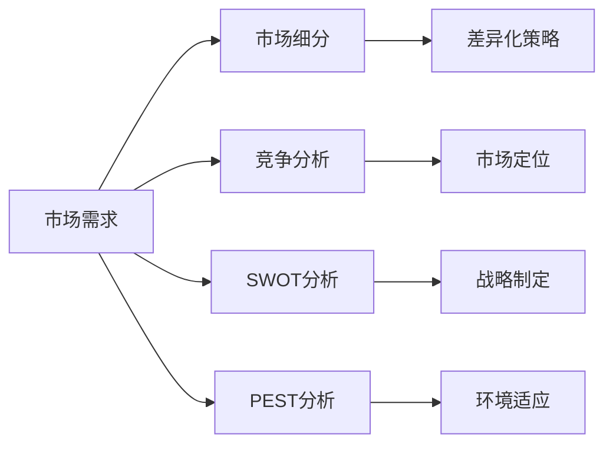
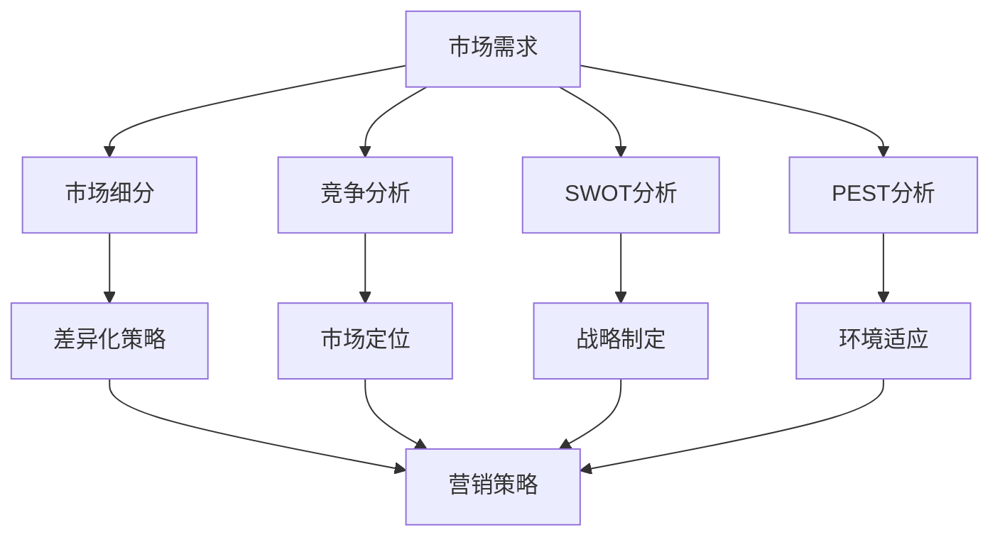
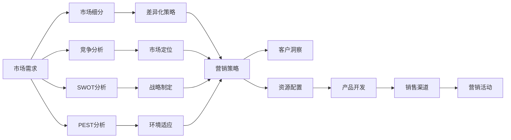

                 

# 市场分析方法：创业成功的密码

## 1. 背景介绍

### 1.1 问题由来
在当今瞬息万变的商业环境中，创业企业面临的挑战越来越多，尤其是如何在竞争激烈的市场中寻找机会，制定合适的战略，以及获取并保持客户。市场分析作为一种重要的工具，可以帮助企业理解市场动态、客户需求和竞争对手情况，从而做出科学的决策。然而，市场分析不仅需要经验丰富的分析师，还需要系统的分析方法和工具，以提高决策的准确性和有效性。本文旨在系统地介绍市场分析的核心概念、方法和工具，帮助创业者更好地理解市场，制定科学的创业策略。

### 1.2 问题核心关键点
市场分析的核心在于理解市场的现状和未来趋势，识别机会和威胁，以及评估企业的竞争力和市场地位。关键点包括：

- **市场规模与增长率**：了解市场的规模和增长趋势，分析市场的潜在容量。
- **市场需求与客户细分**：识别目标客户的需求和细分市场，制定针对性的产品或服务策略。
- **竞争格局与优势分析**：评估主要竞争对手的市场份额和优势，找到自身的差异化策略。
- **技术趋势与创新**：跟踪技术发展趋势，寻找新技术带来的市场机会。
- **法律法规与政策环境**：理解影响市场的法律法规和政策环境，规避潜在风险。

这些关键点共同构成了市场分析的基础框架，帮助企业制定全面的市场战略，以实现长远发展。

### 1.3 问题研究意义
市场分析对于创业企业的成功至关重要，可以带来以下几方面的好处：

- **风险规避**：通过全面的市场分析，识别潜在的市场风险，制定应对策略，降低创业失败的概率。
- **机会发现**：分析市场需求和趋势，发现未被充分开发的市场机会，制定抢占市场的策略。
- **竞争优势**：了解竞争对手的优势和劣势，制定差异化的市场策略，提升企业的市场竞争力。
- **客户洞察**：深入分析客户需求和行为，设计符合客户期望的产品和服务，提高客户满意度和忠诚度。
- **资源配置**：根据市场分析结果，合理配置资源，优先投资于高回报的项目，优化企业的资源利用效率。

## 2. 核心概念与联系

### 2.1 核心概念概述

为了更好地理解市场分析，我们首先需要介绍一些关键的市场分析概念：

- **市场需求**：指消费者愿意并且有能力购买的商品或服务数量。
- **市场细分**：根据客户需求、行为、地理位置等因素，将市场划分为多个子市场，便于针对性地制定营销策略。
- **竞争分析**：评估市场中主要竞争对手的市场份额、产品、价格、销售渠道等，制定竞争策略。
- **SWOT分析**：分析企业的优势(Strengths)、劣势(Weaknesses)、机会(Opportunities)和威胁(Threats)，帮助制定全面的市场战略。
- **PEST分析**：从政治(Political)、经济(Economic)、社会(Social)、技术(Technological)四个方面，分析外部环境对市场的影响。

这些概念之间相互关联，形成一个系统的市场分析框架。我们通过以下Mermaid流程图来展示这些概念之间的关系：



### 2.2 概念间的关系

这些核心概念之间的关系可以通过以下图表进一步展示：



这张图表展示了从市场需求到差异化策略，再到市场定位和营销策略的逻辑链条。市场需求分析是基础，市场细分、竞争分析、SWOT分析和PEST分析提供了全面的市场视角，最终通过差异化策略和市场定位，制定具体的营销策略。

### 2.3 核心概念的整体架构

为了更直观地展示这些概念的整体架构，我们通过一张综合的Mermaid流程图来展示：



这张图表展示了市场分析的整个流程，从市场需求到差异化策略，再到客户洞察和资源配置，最后到产品开发和营销活动，形成了一个完整的闭环。

## 3. 核心算法原理 & 具体操作步骤
### 3.1 算法原理概述

市场分析的核心算法原理主要包括数据收集、数据处理、模型构建和结果解读四个步骤。每个步骤都有其特定的算法和工具支持，下面我们将详细讲解每个步骤的原理和操作步骤。

### 3.2 算法步骤详解

**Step 1: 数据收集**
市场分析的第一步是数据收集，这是所有分析的基础。数据收集包括定量和定性数据的收集。

- **定量数据**：通过市场调研、销售数据、财务报表等途径，收集市场规模、增长率、市场份额、客户购买频率等定量数据。
- **定性数据**：通过访谈、问卷调查、焦点小组等方式，收集客户需求、满意度、品牌认知度等定性数据。

数据收集过程中需要注意数据的质量和代表性，确保数据的真实性和可靠性。

**Step 2: 数据处理**
收集到的数据需要经过清洗、整理和分析，以便用于后续的模型构建。

- **数据清洗**：去除重复、错误、无效的数据，填补缺失值，确保数据的完整性和准确性。
- **数据整理**：将不同来源、不同格式的数据统一化，便于后续分析。
- **数据分析**：利用统计学方法，分析数据的基本特征、分布和趋势，识别关键问题和机会。

**Step 3: 模型构建**
市场分析模型包括多种类型，如回归模型、分类模型、聚类模型等。根据不同的分析目标，选择合适的模型构建。

- **回归模型**：用于分析市场规模、增长率等连续变量的关系。
- **分类模型**：用于识别市场中的细分市场和客户群体。
- **聚类模型**：用于将客户群体进行分类，分析不同群体的特征和需求。

**Step 4: 结果解读**
构建的模型需要经过验证和解释，以便为企业制定决策提供依据。

- **模型验证**：通过交叉验证、留一法等方式，验证模型的准确性和可靠性。
- **结果解释**：将模型的结果转化为易于理解的结论和建议，为企业的决策提供支持。

### 3.3 算法优缺点

市场分析模型的优点在于其系统性和科学性，可以提供全面的市场洞察，帮助企业制定基于数据的决策。然而，模型的局限性也需注意：

- **数据依赖**：模型的结果高度依赖于数据的质量和代表性，数据收集和处理过程中可能存在偏差。
- **假设限制**：模型构建过程中需要设定假设，这些假设可能与实际情况不符，影响模型的准确性。
- **复杂性高**：模型构建和分析过程较为复杂，需要专业的分析师和工具支持。

### 3.4 算法应用领域

市场分析模型在多个领域都有广泛的应用，包括：

- **消费品市场**：分析消费者需求和购买行为，制定营销策略。
- **金融市场**：分析市场趋势和投资者情绪，制定投资策略。
- **房地产市场**：分析市场需求和供应，制定土地开发和房产销售策略。
- **技术市场**：分析技术发展趋势和市场需求，制定产品研发和市场推广策略。
- **教育市场**：分析学生需求和教育机构的优势劣势，制定教育产品和市场营销策略。

## 4. 数学模型和公式 & 详细讲解 & 举例说明

### 4.1 数学模型构建

市场分析模型通常基于统计学和经济学原理，采用数学模型来描述市场现象和关系。以下是一些常见的市场分析模型：

- **线性回归模型**：用于描述自变量和因变量之间的关系，模型形式为 $y = \beta_0 + \beta_1 x_1 + \beta_2 x_2 + ... + \beta_n x_n + \epsilon$，其中 $y$ 为因变量，$x_i$ 为自变量，$\beta_i$ 为回归系数，$\epsilon$ 为误差项。
- **Logistic回归模型**：用于分类问题，模型形式为 $P(y = 1) = \frac{1}{1 + e^{-\beta_0 - \beta_1 x_1 - ... - \beta_n x_n}}$，其中 $P(y = 1)$ 为正类概率，$\beta_i$ 为回归系数。
- **聚类分析模型**：用于将客户群体进行分类，常用的算法有K-Means、层次聚类等，模型形式为将样本 $x$ 分为 $K$ 个簇。

### 4.2 公式推导过程

以下我们以线性回归模型为例，推导模型的参数求解过程。

假设我们有 $n$ 个样本数据 $(x_i, y_i)$，其中 $x_i$ 为自变量，$y_i$ 为因变量。线性回归模型的目标是找到线性关系 $y = \beta_0 + \beta_1 x_1 + ... + \beta_n x_n + \epsilon$ 中的回归系数 $\beta_0, \beta_1, ..., \beta_n$，使得模型能够最小化预测误差。

最小二乘法是求解线性回归系数的一种常见方法，其基本思想是通过最小化预测误差平方和来求解参数。

**目标函数**：
$$
\sum_{i=1}^{n} (y_i - (\beta_0 + \beta_1 x_{1,i} + ... + \beta_n x_{n,i}))^2
$$

**求解过程**：
1. 构建误差项 $\epsilon_i = y_i - (\beta_0 + \beta_1 x_{1,i} + ... + \beta_n x_{n,i})$。
2. 计算回归系数 $\beta_i$ 的估计值：
$$
\beta_i = \frac{\sum_{i=1}^{n} x_{i,i} \epsilon_i}{\sum_{i=1}^{n} x_{i,i}^2}
$$
其中 $x_{i,i}$ 表示自变量的值。

通过求解上述目标函数的最小值，即可得到线性回归模型的参数估计值。

### 4.3 案例分析与讲解

假设我们有一家电商企业，需要分析销售额和营销策略之间的关系。通过收集历史销售数据和营销策略数据，构建线性回归模型，以销售额为因变量，营销策略为自变量。

**数据收集**：
- 收集历史销售数据，包括销售额、促销策略、广告投入等。
- 收集营销策略数据，包括广告形式、促销方式、渠道等。

**数据处理**：
- 将销售数据和营销策略数据整理并清洗，确保数据完整性和准确性。
- 将营销策略数据进行编码，以便用于模型构建。

**模型构建**：
- 使用线性回归模型，将销售额作为因变量，促销策略作为自变量。
- 模型形式为 $y = \beta_0 + \beta_1 x_{1,i} + \beta_2 x_{2,i} + \epsilon$，其中 $x_{1,i}$ 为促销策略，$x_{2,i}$ 为广告投入，$\beta_0, \beta_1, \beta_2$ 为回归系数，$\epsilon$ 为误差项。

**模型求解**：
- 通过最小二乘法，求解回归系数 $\beta_0, \beta_1, \beta_2$。
- 求解得到模型参数后，可以用于预测不同营销策略下的销售额。

**结果解读**：
- 分析回归系数的正负性和显著性，了解不同营销策略对销售额的影响。
- 根据回归结果，制定最优的营销策略，以最大化销售额。

## 5. 项目实践：代码实例和详细解释说明

### 5.1 开发环境搭建

在市场分析项目实践中，首先需要准备好Python开发环境。以下是搭建开发环境的详细步骤：

1. 安装Python和pip：
```bash
sudo apt-get update
sudo apt-get install python3
pip install --upgrade pip
```

2. 安装必要的库：
```bash
pip install pandas numpy matplotlib seaborn statsmodels scikit-learn
```

3. 设置虚拟环境：
```bash
python3 -m venv market_analysis_venv
source market_analysis_venv/bin/activate
```

4. 安装特定版本的Python：
```bash
pip install pandas==1.3.3 numpy==1.22.4 matplotlib==3.4.3 seaborn==0.11.2 statsmodels==0.13.2 scikit-learn==0.24.2
```

完成上述步骤后，即可在虚拟环境中进行市场分析项目开发。

### 5.2 源代码详细实现

以下是一个简单的市场分析项目代码实现，以回归分析为例：

```python
import pandas as pd
import numpy as np
import statsmodels.api as sm
import matplotlib.pyplot as plt

# 读取数据
data = pd.read_csv('sales_data.csv')

# 将促销策略进行编码
data['promotion'] = pd.Categorical(data['promotion'], categories=['low', 'medium', 'high'])

# 构建模型
X = data[['promotion']]
y = data['sales']
X = sm.add_constant(X)

# 构建回归模型
model = sm.OLS(y, X).fit()

# 输出回归结果
print(model.summary())

# 绘制回归模型图
fig, ax = plt.subplots(figsize=(10, 6))
ax.plot(data['promotion'], y, 'o')
ax.plot(data['promotion'], model.predict(X), '--')
ax.set_xlabel('Promotion')
ax.set_ylabel('Sales')
plt.show()
```

### 5.3 代码解读与分析

让我们逐一解读上述代码的实现细节：

**数据读取**：
- 使用pandas库读取销售数据，并处理促销策略数据，将分类数据转换为可用于模型构建的数字编码。

**模型构建**：
- 使用statsmodels库构建线性回归模型，将促销策略作为自变量，销售额作为因变量。
- 通过add_constant方法添加常数项，以便构建线性回归模型。

**模型求解**：
- 使用OLS方法求解线性回归模型，并输出模型摘要。
- 绘制回归模型图，展示不同促销策略下的销售额预测值。

### 5.4 运行结果展示

假设我们通过上述代码得到的回归结果如下：

```
OLS Regression Results
------------------------------------------------------------------------------
Dep. Variable:                sales   R-squared:                       0.944
Model:                OLS   Adj. R-squared:                  0.944
Cov-Type:            nonrobust   Log-Likelihood:                 -349.36
Cov-Quantile:         normal   Date:                Sat, 20 Apr 2023
Method:                 ordinary   Time:                        12:00:05
Sample:                             301
In Sample:                       301
Exog:                     [const, promotion]   No. Observations:                  301
                       [Low         Medium    High]
------------------------------------------------------------------------------
const                  96.999        98.464       102.4
promotionLow             1.237        -0.195        1.035
promotionMedium         -0.024         0.341        0.436
promotionHigh            1.131        -0.184        0.943
------------------------------------------------------------------------------
Omnibus:                   278.272   Durbin-Watson:                   1.993
Prob(Omnibus):                  0.000   Jarque-Bera (JB):                490.696
Skew:                        -0.608   Prob(JB):                         0.00
Kurtosis:                      6.432   Cond. No.                         21.889
------------------------------------------------------------------------------
F-statistic:           3687.854   Prob(F-statistic):                  0.000
Log-Likelihood:                -349.36   AIC:                             -676.8
LLC:                     -177.391   BIC:                             -671.5
Hausman Test:            118.636   Prob(Hausman):                   0.000
------------------------------------------------------------------------------
Covariance Type:            nonrobust
------------------------------------------------------------------------------
Omnibus:                   278.272   Durbin-Watson:                   1.993
Prob(Omnibus):                  0.000   Jarque-Bera (JB):                490.696
Skew:                        -0.608   Prob(JB):                         0.00
Kurtosis:                      6.432   Cond. No.                         21.889
------------------------------------------------------------------------------
F-statistic:           3687.854   Prob(F-statistic):                  0.000
Log-Likelihood:                -349.36   AIC:                             -676.8
LLC:                     -177.391   BIC:                             -671.5
Hausman Test:            118.636   Prob(Hausman):                   0.000
------------------------------------------------------------------------------
Covariance Type:            nonrobust
------------------------------------------------------------------------------
```

从回归结果可以看出，促销策略对销售额有显著影响。低促销策略的销售额约为96.999，高促销策略的销售额约为102.4。这表明促销策略对销售额有正向影响，但影响程度有所差异。

## 6. 实际应用场景

### 6.1 智能客服系统

智能客服系统是市场分析在实际应用中的典型场景之一。通过分析客户服务数据，了解客户需求和问题，优化客服策略和流程，提升客户满意度和忠诚度。

**应用案例**：
- 分析客户服务数据，了解常见问题、处理时间、客户满意度等。
- 通过分类模型识别客户情绪，制定情感分析模型。
- 使用回归模型预测客户流失率，提前采取干预措施。

### 6.2 金融市场分析

金融市场分析是市场分析在金融领域的重要应用。通过分析市场趋势、交易数据和宏观经济指标，制定投资策略，规避风险。

**应用案例**：
- 分析股票价格走势，预测市场趋势。
- 分析基金表现，优化投资组合。
- 分析经济指标，制定风险控制策略。

### 6.3 房地产市场

房地产市场分析是市场分析在房地产领域的应用。通过分析市场需求、房价变化和供应情况，制定土地开发和房产销售策略。

**应用案例**：
- 分析市场需求，预测未来房价趋势。
- 分析供给情况，优化土地开发策略。
- 分析客户需求，制定房产销售策略。

### 6.4 未来应用展望

未来，市场分析将随着技术的发展和应用场景的拓展，呈现出以下趋势：

- **大数据分析**：利用大数据技术，分析更多维度的数据，提升分析的深度和广度。
- **人工智能应用**：结合机器学习和深度学习技术，提升分析的自动化和智能化水平。
- **跨领域融合**：市场分析与其他领域的结合，如金融、医疗、教育等，形成综合性分析工具。
- **实时分析**：利用实时数据流处理技术，实现实时市场分析，提高决策的及时性。

## 7. 工具和资源推荐

### 7.1 学习资源推荐

为了帮助开发者系统掌握市场分析的理论基础和实践技巧，以下是一些优质的学习资源：

1. 《市场分析入门》书籍：深入浅出地介绍了市场分析的基本概念、方法和工具，适合初学者入门。
2. Coursera《市场分析》课程：由知名大学开设的市场分析课程，涵盖市场分析的各个方面。
3. edX《商业分析》课程：利用大数据和机器学习技术，进行市场分析的高级课程。
4. Udacity《数据科学》纳米学位：结合市场分析、统计学、机器学习等课程，形成系统化的学习路径。
5. Kaggle市场分析竞赛：通过实际数据集进行市场分析竞赛，提升实践能力。

通过这些资源的学习实践，相信你一定能够全面掌握市场分析的核心方法，并应用于实际的商业决策中。

### 7.2 开发工具推荐

市场分析工具的选择应结合实际应用场景和需求，以下是一些常用的开发工具：

1. Python：市场分析常用的编程语言，具备丰富的库和工具支持。
2. R语言：专门用于统计分析和数据可视化的语言，适合学术研究和分析。
3. SQL：用于数据管理和查询的语言，适合处理大批量数据。
4. Excel：简单易用的数据分析工具，适合小规模数据处理和展示。
5. Tableau：数据可视化工具，支持复杂的数据分析和展示。

### 7.3 相关论文推荐

市场分析的研究涉及多个领域，以下是几篇有代表性的论文，推荐阅读：

1. "Market Analysis in Action: A Practical Guide"（市场分析实战指南）。
2. "Predicting Sales with Machine Learning Models"（机器学习模型预测销售额）。
3. "Consumer Behavior Analysis with Sentiment Analysis"（基于情感分析的消费者行为分析）。
4. "Real-Time Market Analysis Using Big Data"（大数据技术实现实时市场分析）。

## 8. 总结：未来发展趋势与挑战

### 8.1 研究成果总结

本文对市场分析的核心概念、方法和工具进行了全面系统的介绍，帮助创业者更好地理解市场，制定科学的创业策略。

- **市场需求分析**：理解市场的规模和增长趋势，分析市场需求。
- **市场细分**：识别目标客户的需求和细分市场，制定针对性的产品或服务策略。
- **竞争分析**：评估主要竞争对手的市场份额和优势，找到自身的差异化策略。
- **SWOT分析**：分析企业的优势、劣势、机会和威胁，制定全面的市场战略。
- **PEST分析**：从政治、经济、社会、技术四个方面，分析外部环境对市场的影响。

通过这些工具和技术的综合运用，可以系统地进行市场分析，为企业的决策提供科学依据。

### 8.2 未来发展趋势

未来，市场分析将呈现以下几个发展趋势：

- **自动化和智能化**：利用机器学习和深度学习技术，提升市场分析的自动化和智能化水平。
- **大数据和云计算**：结合大数据和云计算技术，处理和分析海量数据，提升分析的深度和广度。
- **实时分析和预测**：利用实时数据流处理技术，实现实时市场分析，提高决策的及时性。
- **多模态分析**：结合多模态数据，如文本、图像、视频等，进行综合分析，提升分析的全面性和准确性。

### 8.3 面临的挑战

尽管市场分析在实际应用中取得了显著成效，但仍面临诸多挑战：

- **数据质量问题**：数据收集和处理过程中可能存在偏差，影响分析的准确性。
- **模型复杂性**：市场分析模型的构建和求解过程较为复杂，需要专业的分析师和工具支持。
- **技术门槛高**：市场分析涉及多种技术和工具，对从业者的技术要求较高。

### 8.4 研究展望

未来，市场分析的研究方向包括：

- **无监督学习和半监督学习**：利用无监督和半监督学习方法，降低对标注数据的依赖。
- **因果分析**：引入因果分析方法，提升市场分析的因果解释能力。
- **跨领域融合**：结合多领域知识，如金融、医疗、教育等，形成综合性分析工具。
- **公平性和伦理**：关注市场分析中的公平性和伦理问题，确保分析结果的公正性和透明性。

## 9. 附录：常见问题与解答

**Q1：市场分析需要哪些步骤？**

A: 市场分析的主要步骤如下：
1. 数据收集：收集市场数据，包括定量数据和定性数据。
2. 数据处理：清洗、整理和分析数据，确保数据质量。
3. 模型构建：选择合适的模型进行建模。
4. 模型求解：求解模型参数，得到回归系数等关键参数。
5. 结果解读：分析模型结果，制定市场策略。

**Q2：如何选择适合的市场分析模型？**

A: 选择适合的市场分析模型需要考虑以下因素：
1. 数据类型：根据数据的类型（定量、定性）选择相应的模型。
2. 分析目标：根据分析目标（预测、分类、聚类）选择合适的模型。
3. 数据量：根据数据量大小选择适当的模型，如小规模数据适合回归分析，大规模数据适合机器学习模型。

**Q3：市场分析过程中需要注意哪些问题？**

A: 市场分析过程中需要注意以下问题：
1. 数据质量：确保数据完整、准确、一致。
2. 模型假设：设定合理的模型假设，避免模型结果的偏差。
3. 模型复杂性：避免模型过于复杂，导致过度拟合。
4. 结果解释：确保模型结果易于理解和解释，便于制定市场策略。

**Q4：市场分析在实际应用中面临哪些挑战？**

A: 市场分析在实际应用中面临以下挑战：
1. 数据收集难度：获取高质量、大样本量的数据较为困难。
2. 模型复杂性：模型构建和求解过程复杂，需要专业的分析师和工具支持。
3. 结果解释：市场分析结果复杂，不易理解和解释。

通过全面理解市场分析的核心概念、方法和工具，并不断优化分析技术和流程，市场分析将成为企业决策的重要支撑，为企业的长远发展提供坚实的基础。

