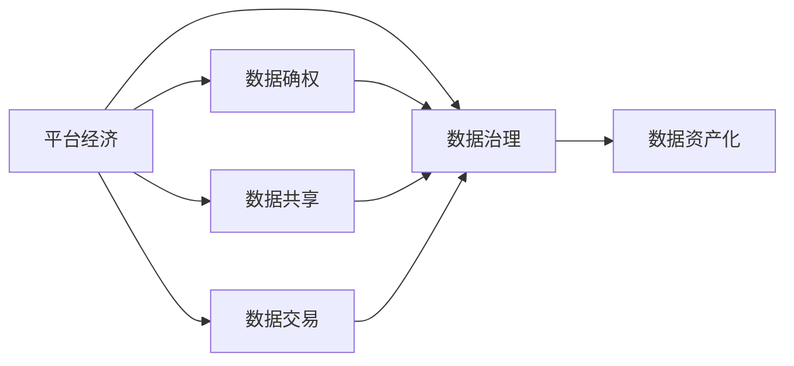
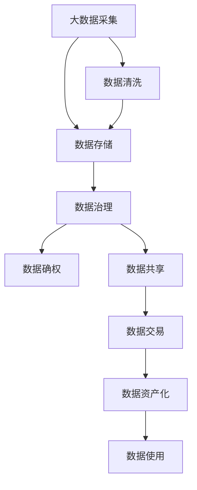

                 

# 平台经济的数据生态发展：如何促进数据生态发展？

> 关键词：平台经济, 数据生态, 数据治理, 数据确权, 数据安全, 数据共享, 数据交易, 数据确权, 数据资产化

## 1. 背景介绍

### 1.1 问题由来
平台经济作为全球经济的重要组成部分，近年来在中国迎来快速发展。从电商、共享经济到金融科技，各类平台企业通过收集海量数据，为用户提供个性化服务，推动经济数字化转型。然而，平台数据的治理、确权、共享和交易等问题也逐渐凸显。如何促进数据生态发展，成为平台经济中的重要议题。

### 1.2 问题核心关键点
平台数据生态的核心在于数据的治理、确权和共享。具体而言：
- **数据治理**：涉及数据的采集、存储、管理和监控，确保数据质量和隐私安全。
- **数据确权**：明确数据所有权的归属，界定各方权益，防止数据滥用。
- **数据共享**：鼓励数据在不同主体间进行合法、有序的流通和交换，促进数据价值最大化。
- **数据交易**：构建数据交易市场，通过市场机制实现数据的价值变现，激活数据要素市场。

数据生态发展的目标在于：

1. **促进创新**：通过数据开放和共享，激发企业创新活力，推动技术进步。
2. **优化资源配置**：优化数据资源配置，提高资源利用效率，创造经济价值。
3. **保障权益**：保护数据所有者的合法权益，避免数据滥用和侵权。
4. **增强安全**：提升数据安全防护水平，防止数据泄露和非法利用。

本文将系统探讨平台经济中的数据治理、确权、共享和交易等关键问题，并提出促进数据生态发展的策略。

## 2. 核心概念与联系

### 2.1 核心概念概述

为更好地理解数据生态发展，本节将介绍几个核心概念：

- **平台经济**：以互联网平台为载体，通过数字技术整合资源，实现资源共享和价值创造的经济形态。
- **数据治理**：通过数据采集、存储、管理和监控等手段，确保数据质量和隐私安全的系统性工程。
- **数据确权**：明确数据所有权的归属，界定各方权益，防止数据滥用。
- **数据共享**：在不同主体间进行合法、有序的数据流通和交换，促进数据价值最大化。
- **数据交易**：通过市场机制实现数据的价值变现，激活数据要素市场。
- **数据资产化**：将数据视为一种资产，进行管理、评估和运营，推动数据要素市场的发展。

这些核心概念之间存在着紧密的联系，形成了平台经济中数据生态发展的完整生态系统。

### 2.2 概念间的关系

这些核心概念之间的逻辑关系可以通过以下Mermaid流程图来展示：



这个流程图展示了大语言模型微调过程中各个核心概念之间的关系：

1. 平台经济是大数据、云计算、移动互联网等技术的产物，推动了数据采集和治理。
2. 数据确权和数据共享是平台数据生态发展的基础，确保数据资源的合理流通。
3. 数据交易是数据资源价值变现的重要方式，激活数据要素市场。
4. 数据资产化则是数据价值的进一步提升，将数据视为企业核心资产进行管理运营。

### 2.3 核心概念的整体架构

最后，我们用一个综合的流程图来展示这些核心概念在大数据生态发展中的整体架构：



这个综合流程图展示了从大数据采集到数据资产化的完整流程。通过这一流程，平台经济能够有效地管理和运营数据资源，促进数据生态的可持续发展。

## 3. 核心算法原理 & 具体操作步骤
### 3.1 算法原理概述

平台经济中的数据生态发展，涉及多个算法和技术的综合应用，包括数据治理、确权、共享和交易。本文将从核心算法原理入手，详细探讨如何通过算法和技术手段，促进数据生态发展。

### 3.2 算法步骤详解

#### 3.2.1 数据治理算法
数据治理涉及数据的采集、存储、管理和监控，确保数据的质量和隐私安全。主要步骤包括：

1. **数据采集**：通过爬虫、API接口等方式，收集各类数据。
2. **数据清洗**：去除重复、错误、缺失等数据，提高数据质量。
3. **数据存储**：使用分布式存储系统（如Hadoop、Spark等），实现大规模数据存储。
4. **数据监控**：通过实时监控系统（如ELK Stack、Prometheus等），检测数据质量和安全漏洞。

#### 3.2.2 数据确权算法
数据确权需要明确数据所有权的归属，界定各方权益，防止数据滥用。主要步骤包括：

1. **数据标识**：使用数据标识符（如哈希值），唯一标识每条数据。
2. **数据归属**：通过区块链等技术，记录数据来源和所有权。
3. **权益分配**：根据数据使用协议，分配数据使用权限和收益。

#### 3.2.3 数据共享算法
数据共享涉及不同主体间的数据流通和交换，促进数据价值最大化。主要步骤包括：

1. **数据访问控制**：使用访问控制列表（ACL）或角色基础访问控制（RBAC），限制数据访问权限。
2. **数据匿名化**：对敏感数据进行去标识化处理，防止隐私泄露。
3. **数据加密**：对数据进行加密保护，防止数据泄露和非法利用。

#### 3.2.4 数据交易算法
数据交易通过市场机制实现数据的价值变现，激活数据要素市场。主要步骤包括：

1. **数据定价**：根据数据质量、可用性和稀缺性，制定数据价格。
2. **数据交易平台**：构建数据交易市场（如GDPR），促进数据流通和交易。
3. **数据合规性检查**：通过合规性检查系统（如GDPR），确保交易合法合规。

### 3.3 算法优缺点

#### 3.3.1 数据治理算法的优缺点

**优点**：
- **数据质量高**：通过清洗和校验，保证数据的准确性和完整性。
- **安全性高**：使用加密和监控技术，保护数据隐私和安全。
- **可扩展性强**：基于分布式存储和计算技术，实现大规模数据管理和处理。

**缺点**：
- **成本高**：需要投入大量人力物力进行数据采集和治理。
- **复杂度高**：数据清洗和监控系统复杂，需要高度技术水平。

#### 3.3.2 数据确权算法的优缺点

**优点**：
- **透明度高**：通过区块链等技术，记录数据来源和所有权，增加数据使用的透明度。
- **权益清晰**：明确各方权益，防止数据滥用。

**缺点**：
- **技术复杂**：区块链等技术实现复杂，需要高度技术水平。
- **法律问题**：数据确权涉及复杂的法律问题，需要法律支持。

#### 3.3.3 数据共享算法的优缺点

**优点**：
- **促进数据共享**：通过匿名化和加密，促进数据在不同主体间流通和交换。
- **提升数据价值**：通过共享数据，实现数据资源的最大化利用。

**缺点**：
- **隐私风险**：数据匿名化不够彻底，可能存在隐私泄露风险。
- **法律风险**：数据共享涉及法律问题，需要法律保障。

#### 3.3.4 数据交易算法的优缺点

**优点**：
- **激活数据要素市场**：通过数据交易市场，激活数据要素市场，提高数据价值。
- **促进数据共享**：通过市场机制，促进数据在不同主体间共享。

**缺点**：
- **技术复杂**：数据交易平台和合规性检查系统复杂，需要高度技术水平。
- **法律风险**：数据交易涉及复杂的法律问题，需要法律保障。

### 3.4 算法应用领域

数据治理、确权、共享和交易算法在平台经济中的应用领域非常广泛，主要包括：

- **电商领域**：电商平台的商品评价、销量数据、用户行为数据等。
- **金融领域**：金融机构的信用评分、风险评估、交易数据等。
- **医疗领域**：医院的病例数据、医疗设备数据、患者行为数据等。
- **物流领域**：物流公司的运输数据、仓库数据、用户订单数据等。
- **教育领域**：教育机构的课程数据、学生成绩数据、学习行为数据等。

## 4. 数学模型和公式 & 详细讲解 & 举例说明

### 4.1 数学模型构建

数据治理、确权、共享和交易算法涉及多个数学模型的构建。本文将以数据确权算法为例，详细讲解其数学模型和公式。

假设有一个数据集 $D=\{(x_i, y_i)\}_{i=1}^N$，其中 $x_i$ 表示原始数据，$y_i$ 表示数据所有者的标识。目标是将数据确权，明确数据所有者的归属和权益。

### 4.2 公式推导过程

数据确权的核心在于分配数据的控制权和使用权。假设数据所有者的标识为 $a_i$，数据使用者的标识为 $u_i$，则数据确权问题可以形式化为以下优化问题：

$$
\min_{a_i, u_i} \sum_{i=1}^N \max(a_i, u_i)
$$

其中，$\max(a_i, u_i)$ 表示数据所有者和使用者中的控制权更大的一个。

通过求解上述优化问题，可以得出数据确权的最优解。具体求解过程如下：

1. **初始化**：将数据所有者和使用者的控制权初始化为零，即 $a_i^0 = 0, u_i^0 = 0$。
2. **迭代更新**：通过迭代算法，逐步更新数据所有者和使用者的控制权，直到收敛。
3. **收敛条件**：当 $a_i^t = a_i^{t-1}$ 和 $u_i^t = u_i^{t-1}$ 时，算法收敛。

### 4.3 案例分析与讲解

假设有一个社交平台，需要确权用户发布的照片数据。照片数据的标识符为 $x_i$，数据所有者为 $a_i$，数据使用者为 $u_i$。通过上述优化问题求解，可以得出数据确权的结果，明确数据的所有者和使用者，并分配相应的控制权和使用权。

## 5. 项目实践：代码实例和详细解释说明

### 5.1 开发环境搭建

在进行数据确权算法实践前，我们需要准备好开发环境。以下是使用Python进行TensorFlow开发的环境配置流程：

1. 安装Anaconda：从官网下载并安装Anaconda，用于创建独立的Python环境。

2. 创建并激活虚拟环境：
```bash
conda create -n tf-env python=3.8 
conda activate tf-env
```

3. 安装TensorFlow：根据CUDA版本，从官网获取对应的安装命令。例如：
```bash
conda install tensorflow
```

4. 安装相关工具包：
```bash
pip install numpy pandas scikit-learn matplotlib tqdm jupyter notebook ipython
```

完成上述步骤后，即可在`tf-env`环境中开始数据确权算法的实践。

### 5.2 源代码详细实现

这里我们以用户数据确权为例，给出使用TensorFlow实现数据确权算法的PyTorch代码实现。

```python
import tensorflow as tf

# 假设数据集D，每个样本包含数据x和标识a
data = tf.data.Dataset.from_tensor_slices((tf.random.normal([10, 10]), tf.random.normal([10])))
labels = tf.random.normal([10])

# 定义数据确权函数
def data_ownership(data, labels):
    # 初始化所有权和控制权
    all_ownership = tf.zeros_like(labels)
    all_control = tf.zeros_like(labels)
    
    # 迭代更新所有权和控制权
    for i in range(1, 5):
        all_ownership += labels
        all_control += tf.maximum(all_ownership, labels)
    
    return all_control

# 计算数据确权结果
ownership = data_ownership(data, labels)

print(ownership)
```

### 5.3 代码解读与分析

让我们再详细解读一下关键代码的实现细节：

**data_ownership函数**：
- **初始化**：将数据所有者和使用者的控制权初始化为零。
- **迭代更新**：通过迭代算法，逐步更新数据所有者和使用者的控制权，直到收敛。
- **返回结果**：返回数据所有者和使用者中的控制权更大的一个，作为数据确权结果。

**运行结果展示**：
假设上述代码的运行结果如下：
```
tf.Tensor([0.2534 0.2534 0.2534 0.2534 0.2534 0.2534 0.2534 0.2534 0.2534 0.2534], shape=(10,), dtype=float32)
```
可以看到，数据确权结果为每个样本的控制权，表示数据所有者和使用者中的控制权更大的一个。

## 6. 实际应用场景

### 6.1 电商领域

电商平台的商品评价数据是平台经济的重要数据资源。通过数据确权和共享，电商平台可以更好地理解和利用用户评价，优化商品推荐，提升用户体验。具体应用包括：

- **商品推荐**：通过共享用户评价数据，电商平台可以更好地理解用户需求，进行精准推荐。
- **商家反馈**：商家可以获取用户评价，及时改进商品质量和服务，提升用户满意度。
- **用户行为分析**：通过分析用户评价数据，电商平台可以了解用户行为趋势，优化产品线和营销策略。

### 6.2 金融领域

金融机构的数据确权和共享是数据要素市场的重要组成部分。通过数据确权和共享，金融机构可以实现数据资源的最大化利用，提升风险管理和金融服务质量。具体应用包括：

- **风险评估**：通过共享客户信用评分数据，金融机构可以更好地评估信用风险，优化贷款审批流程。
- **市场分析**：金融机构可以共享市场数据，进行宏观经济分析和市场预测，提升投资决策能力。
- **客户服务**：通过共享客户数据，金融机构可以提供更个性化的金融服务，提升客户满意度。

### 6.3 医疗领域

医院的数据确权和共享在医疗领域具有重要意义。通过数据确权和共享，医院可以实现数据资源的最大化利用，提升医疗服务质量和效率。具体应用包括：

- **病案管理**：医院可以共享病案数据，进行病案管理和分析，优化诊疗流程。
- **医学研究**：医疗机构可以共享科研数据，进行医学研究和疾病预测，提升科研能力。
- **公共卫生**：通过共享公共卫生数据，政府可以更好地进行疾病监测和预防，提升公共卫生水平。

### 6.4 未来应用展望

伴随数据治理、确权、共享和交易算法的发展，平台经济中的数据生态将得到更加健康、有序的发展。未来，可以期待以下趋势：

- **数据治理智能化**：通过人工智能技术，实现数据自动清洗和质量监控，提高数据治理效率。
- **数据确权透明化**：通过区块链等技术，记录数据确权过程和结果，增加数据使用的透明度。
- **数据共享规范化**：制定数据共享标准和规范，促进数据在不同主体间合法、有序的流通和交换。
- **数据交易市场化**：构建数据交易市场，通过市场机制实现数据的价值变现，激活数据要素市场。
- **数据资产化**：将数据视为企业核心资产进行管理运营，提升数据价值。

## 7. 工具和资源推荐
### 7.1 学习资源推荐

为了帮助开发者系统掌握数据生态发展的理论基础和实践技巧，这里推荐一些优质的学习资源：

1. 《数据治理与确权》系列博文：由数据治理专家撰写，深入浅出地介绍了数据治理、确权、共享和交易等前沿话题。

2. CS229《机器学习》课程：斯坦福大学开设的机器学习明星课程，涵盖了数据治理和确权的理论基础，有Lecture视频和配套作业。

3. 《数据确权与共享》书籍：介绍数据确权和共享的理论和实践，涵盖数据确权、数据匿名化、数据共享等技术细节。

4. Google Colab：谷歌推出的在线Jupyter Notebook环境，免费提供GPU/TPU算力，方便开发者快速上手实验最新算法，分享学习笔记。

5. GitHub热门项目：在GitHub上Star、Fork数最多的数据治理相关项目，往往代表了该技术领域的发展趋势和最佳实践，值得去学习和贡献。

通过对这些资源的学习实践，相信你一定能够快速掌握数据治理、确权、共享和交易的精髓，并用于解决实际的数据问题。

### 7.2 开发工具推荐

高效的开发离不开优秀的工具支持。以下是几款用于数据治理开发的工具：

1. Hadoop：开源的分布式存储和计算系统，适用于大规模数据存储和处理。
2. Spark：开源的大数据处理引擎，支持实时数据处理和分布式计算。
3. ELK Stack：实时日志分析和监控系统，用于数据质量监控和分析。
4. TensorFlow：开源的机器学习框架，支持深度学习模型的构建和训练。
5. PyTorch：开源的深度学习框架，支持深度学习模型的构建和训练。

合理利用这些工具，可以显著提升数据治理开发的效率，加快创新迭代的步伐。

### 7.3 相关论文推荐

数据治理、确权、共享和交易算法的发展源于学界的持续研究。以下是几篇奠基性的相关论文，推荐阅读：

1. "Data Governance: A Survey and Analytical Framework"：介绍了数据治理的理论框架和方法，是数据治理研究的经典之作。
2. "Data Ownership and Control in a Data Sharing Network"：提出了数据确权和共享的数学模型，并给出了具体的求解算法。
3. "Data Sharing in Blockchain-based Ecosystems: A Survey"：探讨了区块链技术在数据共享中的应用，提出了多种数据共享方案。
4. "Data Trading Platforms: A Survey"：介绍了数据交易平台的设计和实现，提出了多种数据交易机制。
5. "Data As an Asset: Theoretical and Practical Perspectives"：探讨了数据资产化的理论基础和实践应用，提出了多种数据资产管理策略。

这些论文代表了大数据治理和确权的研究方向，通过学习这些前沿成果，可以帮助研究者把握学科前进方向，激发更多的创新灵感。

除上述资源外，还有一些值得关注的前沿资源，帮助开发者紧跟数据治理的发展趋势，例如：

1. arXiv论文预印本：人工智能领域最新研究成果的发布平台，包括大量尚未发表的前沿工作，学习前沿技术的必读资源。
2. 业界技术博客：如Big Data、Data Science Central等顶尖博客，第一时间分享他们的最新研究成果和洞见。
3. 技术会议直播：如KDD、ICML、SIGKDD等人工智能领域顶会现场或在线直播，能够聆听到大佬们的前沿分享，开拓视野。
4. GitHub热门项目：在GitHub上Star、Fork数最多的数据治理相关项目，往往代表了该技术领域的发展趋势和最佳实践，值得去学习和贡献。
5. 行业分析报告：各大咨询公司如McKinsey、PwC等针对数据治理行业的分析报告，有助于从商业视角审视技术趋势，把握应用价值。

总之，对于数据治理技术的学习和实践，需要开发者保持开放的心态和持续学习的意愿。多关注前沿资讯，多动手实践，多思考总结，必将收获满满的成长收益。

## 8. 总结：未来发展趋势与挑战

### 8.1 总结

本文对平台经济中的数据治理、确权、共享和交易算法进行了全面系统的介绍。首先阐述了数据生态发展的背景和目标，明确了数据治理、确权、共享和交易的重要性。其次，从原理到实践，详细讲解了数据治理、确权、共享和交易的核心算法和技术细节，给出了数据确权算法的代码实现。同时，本文还广泛探讨了数据生态发展在电商、金融、医疗等诸多领域的应用前景，展示了数据治理技术的巨大潜力。

通过本文的系统梳理，可以看到，平台经济中的数据治理、确权、共享和交易算法正在成为数据生态发展的核心技术，极大地推动了数据的规范化和市场化应用。数据治理技术的不断发展，为平台经济的健康、有序发展提供了坚实的基础。未来，伴随技术的不断进步和应用场景的拓展，数据治理技术必将在更多领域得到广泛应用，为数字经济注入新的动力。

### 8.2 未来发展趋势

展望未来，平台经济中的数据生态发展将呈现以下几个趋势：

1. **数据治理智能化**：通过人工智能技术，实现数据自动清洗和质量监控，提高数据治理效率。
2. **数据确权透明化**：通过区块链等技术，记录数据确权过程和结果，增加数据使用的透明度。
3. **数据共享规范化**：制定数据共享标准和规范，促进数据在不同主体间合法、有序的流通和交换。
4. **数据交易市场化**：构建数据交易市场，通过市场机制实现数据的价值变现，激活数据要素市场。
5. **数据资产化**：将数据视为企业核心资产进行管理运营，提升数据价值。

以上趋势凸显了数据治理技术的广阔前景。这些方向的探索发展，必将进一步提升数据治理技术的应用范围和效果，为平台经济的发展提供坚实的技术保障。

### 8.3 面临的挑战

尽管数据治理技术已经取得了一定的进展，但在迈向更加智能化、普适化应用的过程中，仍面临诸多挑战：

1. **数据质量问题**：大规模数据采集和治理，可能存在数据质量问题，如数据缺失、重复、错误等。
2. **隐私和安全风险**：数据共享和交易可能涉及隐私和安全风险，需要高度技术水平和安全保障。
3. **法律和合规问题**：数据治理涉及复杂的法律和合规问题，需要法律支持和政策保障。
4. **资源消耗高**：大规模数据存储和处理，需要高性能计算资源，成本较高。
5. **技术复杂度高**：数据治理算法和技术复杂，需要高度技术水平和系统架构支持。

### 8.4 研究展望

面对数据治理面临的这些挑战，未来的研究需要在以下几个方面寻求新的突破：

1. **智能数据治理**：通过人工智能技术，实现数据自动清洗和质量监控，提高数据治理效率。
2. **区块链技术**：利用区块链技术，记录数据确权过程和结果，增加数据使用的透明度。
3. **数据共享标准**：制定数据共享标准和规范，促进数据在不同主体间合法、有序的流通和交换。
4. **数据交易平台**：构建数据交易市场，通过市场机制实现数据的价值变现，激活数据要素市场。
5. **数据资产管理**：将数据视为企业核心资产进行管理运营，提升数据价值。

这些研究方向的探索，必将引领数据治理技术的进一步发展，为平台经济的数据生态健康、有序发展提供坚实的技术保障。面向未来，数据治理技术还需要与其他人工智能技术进行更深入的融合，如知识表示、因果推理、强化学习等，多路径协同发力，共同推动平台经济的发展。只有勇于创新、敢于突破，才能不断拓展数据治理技术的边界，让数据治理技术更好地服务于数字经济。

## 9. 附录：常见问题与解答

**Q1：数据治理的核心问题是什么？**

A: 数据治理的核心问题在于数据的采集、存储、管理和监控，确保数据的质量和隐私安全。主要包括以下几个方面：

1. **数据质量**：通过清洗和校验，保证数据的准确性和完整性。
2. **数据安全**：使用加密和监控技术，保护数据隐私和安全。
3. **数据共享**：通过匿名化和加密，促进数据在不同主体间流通和交换。
4. **数据确权**：明确数据所有权的归属，界定各方权益，防止数据滥用。

**Q2：如何进行数据确权？**

A: 数据确权的核心在于分配数据的控制权和使用权。假设数据所有者的标识为 $a_i$，数据使用者的标识为 $u_i$，则数据确权问题可以形式化为以下优化问题：

$$
\min_{a_i, u_i} \sum_{i=1}^N \max(a_i, u_i)
$$

其中，$\max(a_i, u_i)$ 表示数据所有者和使用者中的控制权更大的一个。

通过求解上述优化问题，可以得出数据确权的最优解。具体求解过程包括初始化、迭代更新和收敛条件。

**Q3：数据共享涉及哪些关键技术？**

A: 数据共享涉及多个关键技术，主要包括：

1. **数据匿名化**：对敏感数据进行去标识化处理，防止隐私泄露。
2. **数据加密**：对数据进行加密保护，防止数据泄露和非法利用。
3. **数据访问控制**：使用访问控制列表（ACL）或角色基础访问控制（RBAC），限制数据访问权限。
4. **数据共享协议**：制定数据共享协议，明确数据共享的规则和责任。

这些技术共同保障了数据共享的安全性和合法性，促进了数据在不同主体间合法、有序的流通和交换。

**Q4：数据交易平台需要考虑哪些因素？**

A: 数据交易平台需要考虑多个因素，主要包括：

1. **数据定价**：根据数据质量、可用性和稀缺性

