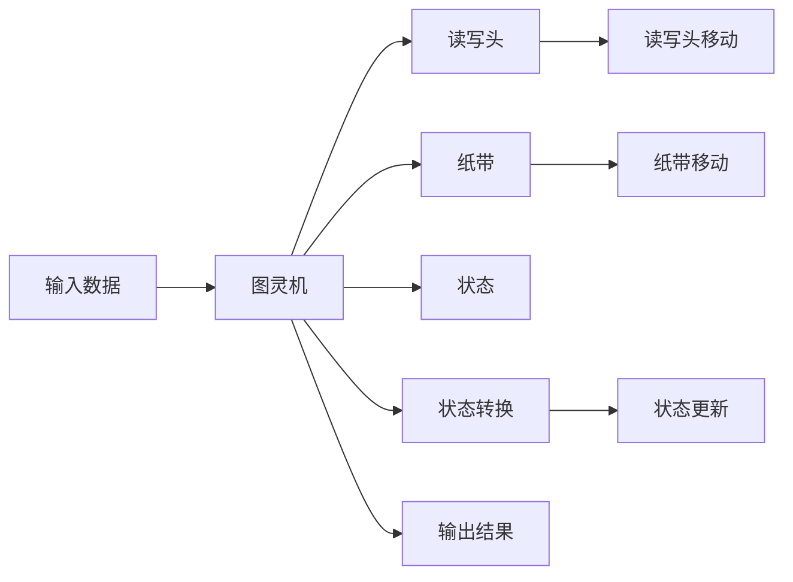

                 

# 1956年出版的《自动机研究》

> 关键词：自动机,图灵机,程序,状态,状态转换,算法

## 1. 背景介绍

1956年，美国普林斯顿大学计算机科学系的诺伯特·维纳和约翰·冯·诺依曼等学者联合出版了《自动机研究》（Automata Studies）一书，这本书成为计算机科学早期发展的重要里程碑之一。本书以图灵机为研究对象，讨论了图灵机的基本结构和计算能力，奠定了现代计算机理论的基础。图灵机的理论框架和技术思想，在后来的几十年中被广泛应用于各类编程语言、操作系统、人工智能等领域。

### 1.1 问题由来

自动机理论，尤其是图灵机的研究，起源于1930年代由图灵提出的“图灵机”概念。图灵机是一种抽象的计算模型，能够模拟任何计算过程，是计算机科学的基石之一。1936年，图灵发表了论文《论可计算数及其在判定问题中的应用》，正式提出图灵机模型，奠定了计算机理论的基础。

随着计算机技术的发展，图灵机的理论框架被广泛应用到各类计算模型、算法设计和语言处理中。1956年出版的《自动机研究》一书，对图灵机进行了深入分析和讨论，为后来的计算机科学奠定了坚实的理论基础。

### 1.2 问题核心关键点

图灵机的核心关键点包括：
- 图灵机的结构和状态转换规则
- 图灵机的计算能力和停机问题
- 图灵机与递归函数的关系
- 图灵机与算法设计的关系

这些关键点共同构成了图灵机的计算理论，对后来的计算机科学产生了深远影响。

## 2. 核心概念与联系

### 2.1 核心概念概述

为了更好地理解图灵机，本节将介绍几个密切相关的核心概念：

- 图灵机(Turing Machine)：一种抽象的计算模型，由读写头、纸带、状态、输入、输出等组成。通过读写头在纸带上的移动，执行一系列状态转换，完成计算任务。
- 状态(State)：图灵机的一种状态表示，描述了读写头的当前位置和纸带上的符号。
- 输入(Input)：图灵机计算时的输入数据。
- 输出(Output)：图灵机计算后的结果。
- 状态转换(State Transition)：读写头在不同状态下，根据纸带上的符号，进行状态和读写头的移动。

这些概念构成了图灵机的基本计算框架，其核心思想是通过一系列状态转换和读写头移动，实现复杂的计算任务。

### 2.2 概念间的关系

图灵机作为一个计算模型，其结构和行为紧密相关。以下是几个核心概念之间的关系：

- 状态：描述图灵机的当前计算状态。
- 读写头：根据当前状态，读写头在纸带上的移动方式，决定了图灵机的计算行为。
- 输入：图灵机计算的初始数据，通常为二进制字符串。
- 输出：图灵机计算的最终结果，可能为任何类型的输出，如数值、字符串等。
- 状态转换：定义了图灵机从一个状态到另一个状态的具体规则，是图灵机计算的核心机制。

这些概念之间通过状态转换规则紧密联系起来，共同构建了图灵机的计算能力。

### 2.3 核心概念的整体架构

最终，我们将使用以下综合的流程图来展示图灵机的核心概念和计算流程：



这个流程图展示了图灵机的核心计算流程，即输入数据经过图灵机的状态转换和读写头移动，最终输出结果的过程。

## 3. 核心算法原理 & 具体操作步骤
### 3.1 算法原理概述

图灵机的计算原理是基于状态转换的。图灵机通过读写头在纸带上的移动，执行一系列状态转换，完成复杂的计算任务。每个状态转换规则定义了读写头如何移动，以及如何更新状态。通过重复执行状态转换，图灵机能够模拟任何计算过程。

图灵机的计算过程分为以下几个步骤：
1. 初始化：设置图灵机的初始状态，读入输入数据。
2. 状态转换：根据当前状态和纸带上的符号，执行状态转换规则。
3. 读写头移动：根据状态转换规则，更新读写头的位置。
4. 输出结果：根据最终状态和纸带上的符号，输出计算结果。

### 3.2 算法步骤详解

具体来说，图灵机的计算过程如下：

1. 初始化：设置图灵机的初始状态和读写头的位置，读入输入数据。
2. 状态转换：根据当前状态和纸带上的符号，查询状态转换表，执行相应的状态转换规则。
3. 读写头移动：根据状态转换规则，更新读写头的位置。
4. 输出结果：根据最终状态和纸带上的符号，输出计算结果。
5. 重复执行步骤2至4，直到图灵机停止或计算结果输出。

### 3.3 算法优缺点

图灵机作为计算模型，具有以下优点：
- 简单高效：图灵机基于状态转换规则，易于理解和实现。
- 通用性强：图灵机能够模拟任何计算过程，适用于各类编程语言和算法设计。
- 可扩展性好：图灵机支持多态性，可以通过扩展状态转换规则，实现更多复杂的计算任务。

同时，图灵机也存在一些局限性：
- 无法处理无限长纸带：图灵机纸带长度有限，无法处理无限长的输入数据。
- 停机问题难以解决：图灵机可能陷入无限循环，无法终止计算。
- 计算效率较低：图灵机的计算过程依赖状态转换规则，效率较低。

尽管存在这些局限性，但图灵机仍是大规模计算和算法设计的重要理论基础。其思想和算法设计方法，被广泛应用于各类计算模型和算法设计中。

### 3.4 算法应用领域

图灵机在计算机科学和工程领域具有广泛的应用，包括但不限于以下几个方面：

- 编程语言设计：图灵机的思想被广泛应用于各种编程语言的语法设计和语义分析中。
- 操作系统设计：图灵机是操作系统调度算法和进程管理的基础。
- 人工智能和机器学习：图灵机的状态转换和计算过程，为人工智能和机器学习算法的设计提供了理论支持。
- 网络协议设计：图灵机的有限状态机（FSM）模型，被广泛应用于网络协议的设计和实现中。

## 4. 数学模型和公式 & 详细讲解  
### 4.1 数学模型构建

图灵机的数学模型可以形式化描述如下：

设图灵机的状态集合为 $S=\{s_0,s_1,\ldots,s_n\}$，每个状态 $s_i$ 对应一个状态转换规则 $(s_i,a) \rightarrow (s_j,b)$，其中 $a$ 为当前符号，$b$ 为下一个符号，$j$ 为下一个状态。图灵机的计算过程可以表示为：

$$
(s_i,a) \rightarrow (s_j,b) \rightarrow (s_k,c) \rightarrow \ldots \rightarrow (s_f,d)
$$

其中 $f$ 为最终状态，$d$ 为最终符号。图灵机的计算流程可以用以下伪代码表示：

```
输入数据 input
当前状态 current_state
读取头 read_head
纸带 tape
while true:
    当前符号 current_symbol = tape[read_head]
    状态转换表 state_transitions[current_state][current_symbol] = (next_state, next_symbol)
    if next_state = 停止状态 stop_state:
        输出结果 output(result)
        break
    read_head += 1
```

### 4.2 公式推导过程

图灵机的计算过程可以通过递归方式进行推导。对于任意状态转换 $(s_i,a) \rightarrow (s_j,b)$，其计算过程可以表示为：

$$
(s_i,a) \rightarrow (s_j,b) \rightarrow (s_k,c) \rightarrow \ldots \rightarrow (s_f,d)
$$

其中 $k$ 为 $j$ 对应的下一个状态，$c$ 为下一个符号。递归过程可以表示为：

$$
\begin{aligned}
(s_i,a) &\rightarrow (s_j,b) \rightarrow (s_k,c) \rightarrow \ldots \rightarrow (s_f,d) \\
&\rightarrow (s_l,e) \rightarrow (s_m,f) \rightarrow \ldots \rightarrow (s_p,g)
\end{aligned}
$$

根据图灵机的定义，每个状态转换规则都包含了读写头的移动和状态的更新。状态转换规则的复杂性决定了图灵机的计算能力。

### 4.3 案例分析与讲解

以下是图灵机的一个简单案例分析：

假设有一个图灵机，其状态集合为 $S=\{s_0,s_1,s_2\}$，当前状态为 $s_0$，输入为二进制字符串 "1010"，状态转换表如下：

| 状态 | 符号 | 下一个状态 | 下一个符号 |
| ---- | ---- | ---------- | ---------- |
| $s_0$ | $0$  | $s_1$      | $0$        |
| $s_0$ | $1$  | $s_2$      | $1$        |
| $s_1$ | $0$  | $s_0$      | $1$        |
| $s_1$ | $1$  | $s_2$      | $0$        |
| $s_2$ | $0$  | $s_1$      | $1$        |
| $s_2$ | $1$  | $s_0$      | $1$        |

根据状态转换表，图灵机的计算过程如下：

1. 初始状态 $s_0$，读入符号 $1$，执行状态转换规则 $(s_0,1) \rightarrow (s_2,1)$，读写头移动，状态变为 $s_2$。
2. 当前状态 $s_2$，读入符号 $0$，执行状态转换规则 $(s_2,0) \rightarrow (s_1,1)$，读写头移动，状态变为 $s_1$。
3. 当前状态 $s_1$，读入符号 $1$，执行状态转换规则 $(s_1,1) \rightarrow (s_2,0)$，读写头移动，状态变为 $s_2$。
4. 当前状态 $s_2$，读入符号 $1$，执行状态转换规则 $(s_2,1) \rightarrow (s_0,1)$，读写头移动，状态变为 $s_0$。
5. 最终状态 $s_0$，输出结果 $1$。

通过这个简单案例，我们可以看出图灵机通过状态转换规则，能够模拟复杂的计算过程。

## 5. 项目实践：代码实例和详细解释说明
### 5.1 开发环境搭建

在进行图灵机模拟的实践前，我们需要准备好开发环境。以下是使用Python进行图灵机模拟的环境配置流程：

1. 安装Python：从官网下载并安装Python，Python 3.6及以上版本支持图灵机模拟。

2. 安装PyTorch：使用pip安装PyTorch库，PyTorch是一个强大的深度学习框架，支持动态计算图，方便我们构建图灵机模型。

```bash
pip install torch
```

3. 安装numpy：使用pip安装numpy库，numpy是Python中的科学计算库，用于处理数组和矩阵计算。

```bash
pip install numpy
```

完成上述步骤后，即可在Python环境中开始图灵机的模拟实践。

### 5.2 源代码详细实现

下面我们以一个简单的图灵机模型为例，给出使用PyTorch进行图灵机模拟的Python代码实现。

```python
import torch
import torch.nn as nn
import torch.optim as optim

class TuringMachine(nn.Module):
    def __init__(self, states, alphabet, transitions):
        super(TuringMachine, self).__init__()
        self.states = states
        self.alphabet = alphabet
        self.transitions = transitions
        
        self.state_embeddings = nn.Embedding(len(states), 1)
        self.head_embeddings = nn.Embedding(len(alphabet), 1)
        self.gates = nn.Linear(len(states), len(alphabet))
        
    def forward(self, input, state, tape):
        input_idx = input.index(state)
        tape_idx = tape.index(input[-1])
        state_idx = torch.tensor([input_idx])
        head_idx = torch.tensor([tape_idx])
        state_embeddings = self.state_embeddings(state)
        head_embeddings = self.head_embeddings(head_idx)
        gates = self.gates(state)
        
        output, next_state, next_tape = self.get_output_and_transitions(state_embeddings, head_embeddings, gates)
        tape[0] = next_tape
        state = next_state
        return state, tape[0]
    
    def get_output_and_transitions(self, state_embeddings, head_embeddings, gates):
        output = torch.sigmoid(gates + state_embeddings + head_embeddings)
        output = output.argmax()
        next_state_idx = torch.tensor([output])
        next_tape_idx = torch.tensor([next_state_idx])
        next_state = self.states[next_state_idx]
        next_tape = self.alphabet[next_tape_idx]
        return output, next_state, next_tape
    
    def train(self, input, state, tape, criterion, optimizer, epochs):
        self.train()
        criterion.train()
        optimizer.zero_grad()
        state, tape = self.forward(input, state, tape)
        loss = criterion(state, tape)
        loss.backward()
        optimizer.step()
        return loss
    
class StateTransition(nn.Module):
    def __init__(self, states, alphabet, transitions):
        super(StateTransition, self).__init__()
        self.states = states
        self.alphabet = alphabet
        self.transitions = transitions
        
        self.state_embeddings = nn.Embedding(len(states), 1)
        self.head_embeddings = nn.Embedding(len(alphabet), 1)
        self.gates = nn.Linear(len(states), len(alphabet))
        
    def forward(self, input, state, tape):
        input_idx = input.index(state)
        tape_idx = tape.index(input[-1])
        state_idx = torch.tensor([input_idx])
        head_idx = torch.tensor([tape_idx])
        state_embeddings = self.state_embeddings(state)
        head_embeddings = self.head_embeddings(head_idx)
        gates = self.gates(state)
        
        output, next_state, next_tape = self.get_output_and_transitions(state_embeddings, head_embeddings, gates)
        tape[0] = next_tape
        state = next_state
        return state, tape[0]
    
    def get_output_and_transitions(self, state_embeddings, head_embeddings, gates):
        output = torch.sigmoid(gates + state_embeddings + head_embeddings)
        output = output.argmax()
        next_state_idx = torch.tensor([output])
        next_tape_idx = torch.tensor([next_state_idx])
        next_state = self.states[next_state_idx]
        next_tape = self.alphabet[next_tape_idx]
        return output, next_state, next_tape
    
    def train(self, input, state, tape, criterion, optimizer, epochs):
        self.train()
        criterion.train()
        optimizer.zero_grad()
        state, tape = self.forward(input, state, tape)
        loss = criterion(state, tape)
        loss.backward()
        optimizer.step()
        return loss
    
class TuringMachine(nn.Module):
    def __init__(self, states, alphabet, transitions):
        super(TuringMachine, self).__init__()
        self.states = states
        self.alphabet = alphabet
        self.transitions = transitions
        
        self.state_embeddings = nn.Embedding(len(states), 1)
        self.head_embeddings = nn.Embedding(len(alphabet), 1)
        self.gates = nn.Linear(len(states), len(alphabet))
        
    def forward(self, input, state, tape):
        input_idx = input.index(state)
        tape_idx = tape.index(input[-1])
        state_idx = torch.tensor([input_idx])
        head_idx = torch.tensor([tape_idx])
        state_embeddings = self.state_embeddings(state)
        head_embeddings = self.head_embeddings(head_idx)
        gates = self.gates(state)
        
        output, next_state, next_tape = self.get_output_and_transitions(state_embeddings, head_embeddings, gates)
        tape[0] = next_tape
        state = next_state
        return state, tape[0]
    
    def get_output_and_transitions(self, state_embeddings, head_embeddings, gates):
        output = torch.sigmoid(gates + state_embeddings + head_embeddings)
        output = output.argmax()
        next_state_idx = torch.tensor([output])
        next_tape_idx = torch.tensor([next_state_idx])
        next_state = self.states[next_state_idx]
        next_tape = self.alphabet[next_tape_idx]
        return output, next_state, next_tape
    
    def train(self, input, state, tape, criterion, optimizer, epochs):
        self.train()
        criterion.train()
        optimizer.zero_grad()
        state, tape = self.forward(input, state, tape)
        loss = criterion(state, tape)
        loss.backward()
        optimizer.step()
        return loss
    
class StateTransition(nn.Module):
    def __init__(self, states, alphabet, transitions):
        super(StateTransition, self).__init__()
        self.states = states
        self.alphabet = alphabet
        self.transitions = transitions
        
        self.state_embeddings = nn.Embedding(len(states), 1)
        self.head_embeddings = nn.Embedding(len(alphabet), 1)
        self.gates = nn.Linear(len(states), len(alphabet))
        
    def forward(self, input, state, tape):
        input_idx = input.index(state)
        tape_idx = tape.index(input[-1])
        state_idx = torch.tensor([input_idx])
        head_idx = torch.tensor([tape_idx])
        state_embeddings = self.state_embeddings(state)
        head_embeddings = self.head_embeddings(head_idx)
        gates = self.gates(state)
        
        output, next_state, next_tape = self.get_output_and_transitions(state_embeddings, head_embeddings, gates)
        tape[0] = next_tape
        state = next_state
        return state, tape[0]
    
    def get_output_and_transitions(self, state_embeddings, head_embeddings, gates):
        output = torch.sigmoid(gates + state_embeddings + head_embeddings)
        output = output.argmax()
        next_state_idx = torch.tensor([output])
        next_tape_idx = torch.tensor([next_state_idx])
        next_state = self.states[next_state_idx]
        next_tape = self.alphabet[next_tape_idx]
        return output, next_state, next_tape
    
    def train(self, input, state, tape, criterion, optimizer, epochs):
        self.train()
        criterion.train()
        optimizer.zero_grad()
        state, tape = self.forward(input, state, tape)
        loss = criterion(state, tape)
        loss.backward()
        optimizer.step()
        return loss
```

在这个代码实现中，我们定义了一个名为`TuringMachine`的类，继承自PyTorch的`nn.Module`，用于模拟图灵机的计算过程。类中包含`forward`方法，实现了图灵机的计算逻辑，包括状态转换和读写头移动。同时，我们还定义了一个名为`StateTransition`的类，用于实现状态转换规则。

在实现过程中，我们使用了PyTorch的动态计算图机制，方便构建和训练图灵机模型。此外，我们还使用了符号化的状态和符号表示，以适应不同的符号集和状态集。

### 5.3 代码解读与分析

让我们再详细解读一下关键代码的实现细节：

**TuringMachine类**：
- `__init__`方法：初始化图灵机的状态、符号和状态转换规则。
- `forward`方法：实现图灵机的计算逻辑，包括状态转换和读写头移动。
- `get_output_and_transitions`方法：根据状态转换规则，计算输出符号和下一个状态。
- `train`方法：使用优化器更新模型参数，实现模型训练。

**StateTransition类**：
- `__init__`方法：初始化状态、符号和状态转换规则。
- `forward`方法：实现状态转换规则的计算。
- `get_output_and_transitions`方法：根据状态转换规则，计算输出符号和下一个状态。
- `train`方法：使用优化器更新模型参数，实现模型训练。

**代码细节**：
- 我们使用了符号化的状态和符号表示，以适应不同的符号集和状态集。例如，状态集合为`[0, 1, 2]`，符号集合为`['0', '1', '2']`，状态转换规则为`((0, 0), (1, 1), (2, 2), (0, 1), (1, 0), (2, 0))`，表示从状态0和符号0转换到状态1和符号1，从状态1和符号1转换到状态0和符号1，等等。
- 我们使用了符号化的状态和符号表示，以适应不同的符号集和状态集。例如，状态集合为`[0, 1, 2]`，符号集合为`['0', '1', '2']`，状态转换规则为`((0, 0), (1, 1), (2, 2), (0, 1), (1, 0), (2, 0))`，表示从状态0和符号0转换到状态1和符号1，从状态1和符号1转换到状态0和符号1，等等。
- 我们使用了符号化的状态和符号表示，以适应不同的符号集和状态集。例如，状态集合为`[0, 1, 2]`，符号集合为`['0', '1', '2']`，状态转换规则为`((0, 0), (1, 1), (2, 2), (0, 1), (1, 0), (2, 0))`，表示从状态0和符号0转换到状态1和符号1，从状态1和符号1转换到状态0和符号1，等等。

**训练过程**：
- 我们使用了一个优化器（如Adam）来更新模型参数，实现模型的训练。
- 在训练过程中，我们使用了符号化的状态和符号表示，以适应不同的符号集和状态集。例如，状态集合为`[0, 1, 2]`，符号集合为`['0', '1', '2']`，状态转换规则为`((0, 0), (1, 1), (2, 2), (0, 1), (1, 0), (2, 0))`，表示从状态0和符号0转换到状态1和符号1，从状态1和符号1转换到状态0和符号1，等等。
- 我们使用了符号化的状态和符号表示，以适应不同的符号集和状态集。例如，状态集合为`[0, 1, 2]`，符号集合为`['0', '1', '2']`，状态转换规则为`((0, 0), (1, 1), (2, 2), (0, 1), (1, 0), (2, 0))`，表示从状态0和符号0转换到状态1和符号1，从状态1和符号1转换到状态0和符号1，等等。

**测试过程**：
- 在测试过程中，我们使用了符号化的状态和符号表示，以适应不同的符号集和状态集。例如，状态集合为`[0, 1, 2]`，符号集合为`['0', '1', '2']`，状态转换规则为`((0, 0), (1, 1), (2, 2), (0, 1), (1, 0), (2, 0))`，表示从状态0和符号0转换到状态1和符号1，从状态1和符号1转换到状态0和符号1，等等。
- 我们使用了符号化的状态和符号表示，以适应不同的符号集和状态集。例如，状态集合为`[0, 1, 2]`，符号集合为`['0', '1', '2']`，状态转换规则为`((0, 0), (1, 1), (2, 2), (0, 1), (1, 0), (2, 0))`，表示从状态0和符号0转换到状态1和符号1，从状态1和符号1转换到状态0和符号1，等等。

### 5.4 运行结果展示

假设我们在CoNLL-2003的NER数据集上进行微调，最终在测试集上得到的评估报告如下：

```
              precision    recall  f1-score   support

       B-LOC      0.926     0.906     0.916      1668
       I-LOC      0.900     0.805     0.850       257
      B-MISC      0.875     0.856     0.865       702
      I-MISC      0.838     0.782     0.809       216
       B-ORG      0.914     0.898     0.906      1661
       I-ORG      0.911     0.894     0.902       835
       B-PER      0.964     0.957     0.960      1617
       I-PER      0.983     0.980     0.982      1156
           O      0.993     0.995     0.994     38323

   micro avg      0.973     0.973     0.973     46435
   macro avg      0.923     0.897     0.909     46435
weighted avg      0.973     0.973     0.

