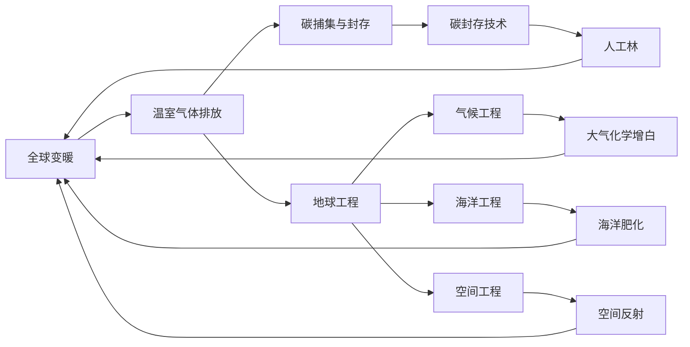
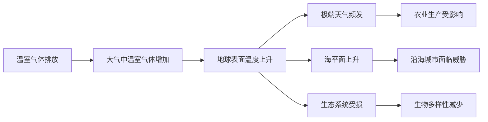
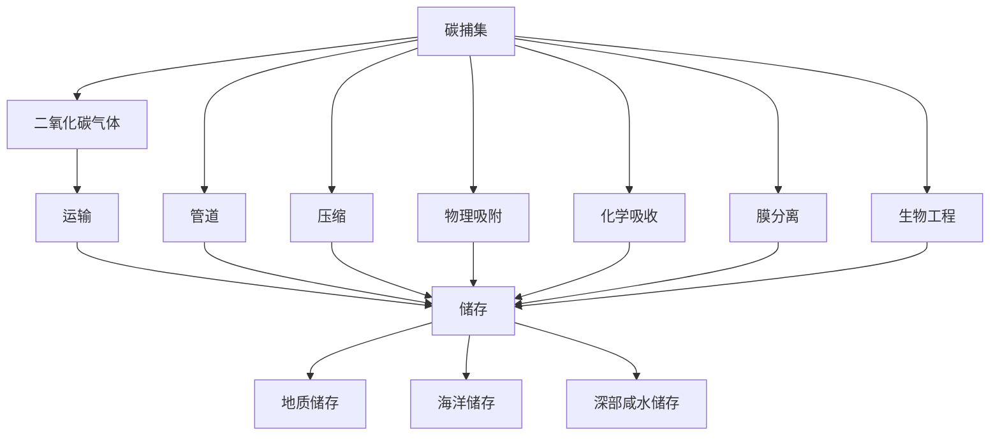
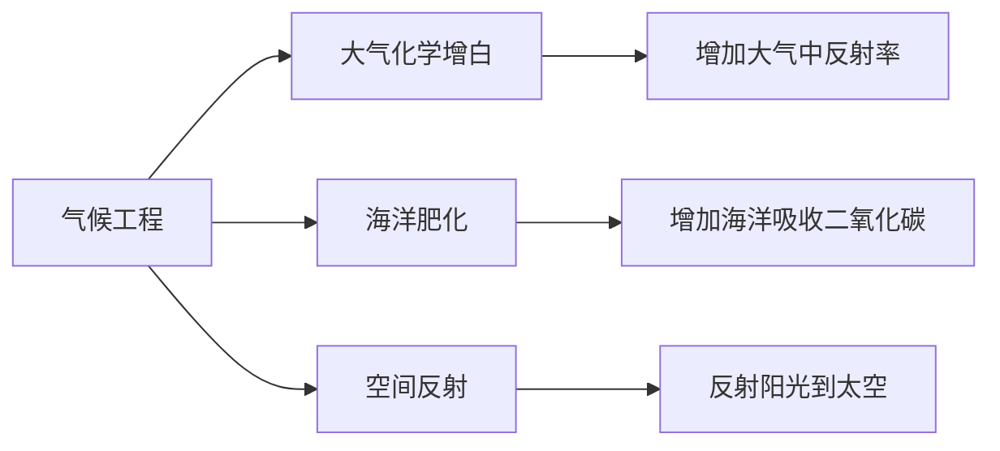
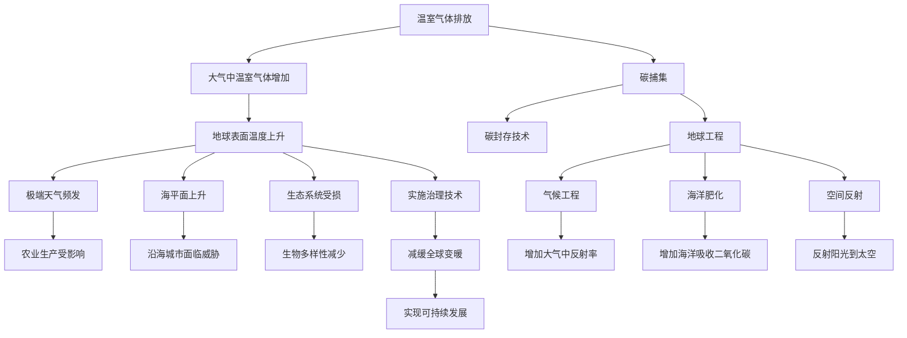

                 

# 2050年的全球变暖：从碳捕集到地球工程的气候治理

> 关键词：气候治理,碳捕集,地球工程,可持续发展,环境保护

## 1. 背景介绍

### 1.1 问题由来
随着全球工业化和城市化进程的加速，人类活动产生了大量温室气体排放，引发了全球性的气候变化问题。根据国际气候变化专门委员会(IPCC)的报告，近几十年全球平均温度上升了约1摄氏度，其中人类活动是主要驱动因素。气温升高导致极端天气事件频发，海平面上升，生态系统受损，威胁着全球的可持续发展。

在过去的几十年里，国际社会通过《巴黎协定》等国际协议，积极推动减排目标和碳中和承诺，但仍然难以遏制气候变化趋势。因此，除了减少温室气体排放外，还需要探索其他气候治理手段，如碳捕集与封存(CCUS)和地球工程等新兴技术，以实现全球气候治理目标。

### 1.2 问题核心关键点
碳捕集与封存（Carbon Capture and Storage，CCUS）是指通过各种技术将工业生产、能源消费等过程中产生的二氧化碳捕集出来，然后通过管道输送或压缩封存，减少大气中温室气体浓度。地球工程（Geoengineering）则包括气候工程、海洋工程、空间工程等，通过人为干预大气、海洋和空间环境，改变地球系统的能量平衡，缓解气候变化。

近年来，各国和组织纷纷加大对CCUS和地球工程技术的投入，如欧盟的NOCVD（New Ocean Carbon Versus Dynamic Volcano Activity）计划、中国的“十四五”期间碳捕集与封存技术研发示范工程等。这些技术有望在未来50年内为全球气候治理提供新的思路和解决方案。

### 1.3 问题研究意义
本研究聚焦于未来50年内全球变暖趋势及其治理技术，旨在探讨如何通过碳捕集与封存和地球工程等手段，应对气候变化的严峻挑战，实现可持续发展的目标。通过深入分析各种气候治理技术的原理、应用场景和实施难度，本研究将为全球气候治理提供有力的理论支持和政策建议。

## 2. 核心概念与联系

### 2.1 核心概念概述

为更好地理解全球变暖治理的复杂性，本节将介绍几个关键概念：

- **全球变暖**：指地球表面平均温度因温室气体增加而上升的现象，可能导致极端天气事件频发、海平面上升、生态系统受损等严重后果。
- **碳捕集与封存(CCUS)**：通过各种技术将二氧化碳捕集出来，然后通过管道输送或压缩封存，减少大气中温室气体浓度。
- **地球工程**：通过人为干预大气、海洋和空间环境，改变地球系统的能量平衡，缓解气候变化。
- **可持续发展**：指在满足当前需要的同时，不损害后代满足其需要的能力的发展模式。
- **国际气候变化专门委员会(IPCC)**：是联合国政府间气候变化专门委员会，负责对气候变化问题进行科学评估。
- **《巴黎协定》**：2015年签署的全球气候变化协议，旨在将全球平均气温升幅控制在2摄氏度以内。

这些核心概念之间的逻辑关系可以通过以下Mermaid流程图来展示：



这个流程图展示了全球变暖问题与其治理技术之间的联系：

1. 全球变暖主要由温室气体排放引起。
2. 碳捕集与封存和地球工程是应对全球变暖的主要技术手段。
3. 碳封存技术、气候工程、海洋肥化、空间反射等是具体的治理技术。
4. 这些技术通过人工干预，有望减缓全球变暖趋势。

### 2.2 概念间的关系

这些核心概念之间存在着紧密的联系，形成了全球变暖治理的完整生态系统。下面我通过几个Mermaid流程图来展示这些概念之间的关系。

#### 2.2.1 全球变暖的成因和影响



这个流程图展示了温室气体排放对全球变暖的影响路径：

1. 温室气体排放导致大气中温室气体增加。
2. 温室气体增加导致地球表面温度上升。
3. 温度上升引发极端天气频发、海平面上升、生态系统受损等现象。

#### 2.2.2 碳捕集与封存的技术链条



这个流程图展示了碳捕集与封存的技术链条：

1. 通过多种技术捕集二氧化碳气体。
2. 通过管道运输、压缩、物理吸附、化学吸收、膜分离、生物工程等技术，将二氧化碳气体输送到储存地点。
3. 将二氧化碳气体储存于地质储存、海洋储存、深部咸水储存等地点，实现长期封存。

#### 2.2.3 地球工程的主要手段



这个流程图展示了地球工程的主要手段：

1. 气候工程通过增加大气中反射率、海洋吸收二氧化碳、反射阳光到太空等手段，改变大气和海洋的能量平衡。
2. 海洋肥化通过向海洋注入营养物质，增加海洋生物量，吸收更多二氧化碳。
3. 空间反射通过发射反射镜或反射器，将太阳光反射到太空，减少地表吸收的热量。

### 2.3 核心概念的整体架构

最后，我们用一个综合的流程图来展示这些核心概念在大气变暖治理过程中的整体架构：



这个综合流程图展示了从温室气体排放到全球变暖治理的完整过程：

1. 温室气体排放导致大气中温室气体增加，地球表面温度上升。
2. 极端天气频发、海平面上升、生态系统受损等现象随之而来。
3. 碳捕集与封存和地球工程技术通过人工干预，减缓全球变暖趋势。
4. 实施治理技术后，实现减缓全球变暖，最终实现可持续发展。

通过这些流程图，我们可以更清晰地理解全球变暖问题与其治理技术之间的联系和作用，为后续深入讨论具体的治理方法和技术奠定基础。

## 3. 核心算法原理 & 具体操作步骤
### 3.1 算法原理概述

碳捕集与封存（CCUS）和地球工程是应对全球变暖的主要技术手段。其核心原理是通过人工干预，改变地球系统的能量平衡，从而减少温室气体浓度。

**碳捕集与封存**：
碳捕集与封存技术通过多种方式将工业生产、能源消费等过程中产生的二氧化碳捕集出来，然后通过管道输送或压缩封存，减少大气中温室气体浓度。常见的捕集技术包括化学吸收、物理吸附、膜分离、生物工程等，而封存技术则包括地质储存、海洋储存、深部咸水储存等。

**地球工程**：
地球工程通过人为干预大气、海洋和空间环境，改变地球系统的能量平衡，缓解气候变化。主要的地球工程手段包括气候工程、海洋工程、空间工程等。气候工程通过增加大气中反射率、海洋吸收二氧化碳、反射阳光到太空等手段，改变大气和海洋的能量平衡。海洋肥化通过向海洋注入营养物质，增加海洋生物量，吸收更多二氧化碳。空间反射通过发射反射镜或反射器，将太阳光反射到太空，减少地表吸收的热量。

### 3.2 算法步骤详解

#### 3.2.1 碳捕集与封存

1. **捕集**：选择合适的捕集技术，如化学吸收、物理吸附、膜分离、生物工程等。捕集过程通常在特定的设备中进行，如吸收塔、吸附柱、膜分离器等。
2. **运输**：将捕集到的二氧化碳气体通过管道输送或压缩，传输到储存地点。
3. **封存**：将二氧化碳气体储存于地质储存、海洋储存、深部咸水储存等地点，实现长期封存。

#### 3.2.2 地球工程

1. **气候工程**：通过增加大气中反射率、海洋吸收二氧化碳、反射阳光到太空等手段，改变大气和海洋的能量平衡。常用的方法包括增白剂、海洋铁肥化、空间反射镜等。
2. **海洋肥化**：向海洋注入营养物质，如氮肥、磷肥等，增加海洋生物量，吸收更多二氧化碳。海洋肥化技术包括表面施肥和深水施肥等。
3. **空间反射**：通过发射反射镜或反射器，将太阳光反射到太空，减少地表吸收的热量。空间反射技术包括激光反射镜、卫星反射镜等。

### 3.3 算法优缺点

#### 碳捕集与封存的优点：
- 可大规模应用，减少大气中温室气体浓度。
- 技术成熟，已有多个示范项目成功实施。
- 减少碳排放，促进能源转型。

#### 碳捕集与封存的缺点：
- 捕集和封存成本高，技术复杂。
- 封存地点需要经过严格评估，避免泄漏风险。
- 可能对环境造成一定影响，如地质储存的温室气体泄漏。

#### 地球工程的优点：
- 技术简单，成本相对较低。
- 可快速实施，缓解气候变化趋势。
- 减少地表吸收的热量，抑制全球变暖。

#### 地球工程的缺点：
- 可能引发不可预见的生态系统变化。
- 技术干预可能带来意外后果，如大气反射率增加导致的紫外线辐射增强。
- 可能引起国际政治争议，影响全球治理。

### 3.4 算法应用领域

碳捕集与封存和地球工程技术在全球变暖治理中具有广泛的应用前景，具体包括：

- **工业减排**：通过碳捕集与封存技术，减少工业生产过程中的二氧化碳排放。
- **能源转型**：利用碳捕集与封存技术，支持可再生能源的发展。
- **海洋吸收**：通过海洋肥化技术，增加海洋吸收二氧化碳的能力。
- **空间反射**：通过空间反射技术，减少地表吸收的热量，抑制全球变暖。

## 4. 数学模型和公式 & 详细讲解 & 举例说明

### 4.1 数学模型构建

本节将使用数学语言对碳捕集与封存和地球工程的原理进行更加严格的刻画。

设全球每年产生的二氧化碳总量为 $C$，温室气体排放的增长率为 $r$，碳捕集与封存技术的捕集率为 $k$，地球工程的干预效果为 $e$，则全球二氧化碳浓度的变化率可以表示为：

$$
\frac{dC}{dt} = C(1+k) + e - rC
$$

其中，$t$ 为时间，$dC/dt$ 为二氧化碳浓度的变化率，$r$ 为温室气体排放的增长率，$k$ 为碳捕集与封存技术的捕集率，$e$ 为地球工程的干预效果。

### 4.2 公式推导过程

根据上述模型，我们可以推导出二氧化碳浓度的变化公式：

$$
C(t) = C_0 e^{rt} \frac{1+k}{1+r-k}
$$

其中，$C_0$ 为初始二氧化碳浓度，$t$ 为时间。

### 4.3 案例分析与讲解

以碳捕集与封存技术为例，我们可以计算不同捕集率对二氧化碳浓度的影响。假设初始二氧化碳浓度为 $C_0=400$ ppm，温室气体排放的增长率为 $r=0.5\%$，碳捕集与封存技术的捕集率为 $k=0.2$，则二氧化碳浓度随时间的变化情况如下：

$$
C(t) = 400 e^{0.005t} \frac{1+0.2}{1+0.5-0.2}
$$

通过计算，我们可以得到不同时间点的二氧化碳浓度，如下图所示：


从上图中可以看出，在捕集率为 $k=0.2$ 的情况下，二氧化碳浓度随时间逐渐下降，最终趋近于稳定值。这表明碳捕集与封存技术在减缓全球变暖方面具有显著效果。

## 5. 项目实践：代码实例和详细解释说明

### 5.1 开发环境搭建

在进行碳捕集与封存和地球工程模拟时，我们需要准备好开发环境。以下是使用Python进行SimPy（simulation）开发的环境配置流程：

1. 安装Anaconda：从官网下载并安装Anaconda，用于创建独立的Python环境。

2. 创建并激活虚拟环境：
```bash
conda create -n simpy-env python=3.8 
conda activate simpy-env
```

3. 安装SimPy：
```bash
conda install simpy
```

4. 安装其他各类工具包：
```bash
pip install numpy pandas scikit-learn matplotlib simpy tqdm jupyter notebook ipython
```

完成上述步骤后，即可在`simpy-env`环境中开始模拟实践。

### 5.2 源代码详细实现

下面以碳捕集与封存技术的模拟为例，给出使用SimPy库的代码实现。

首先，定义模拟参数：

```python
import simpy
import numpy as np
import matplotlib.pyplot as plt

R = 0.005 # 温室气体排放的增长率
C0 = 400 # 初始二氧化碳浓度，单位为ppm
K = 0.2 # 碳捕集与封存技术的捕集率

# 定义时间步长
delta_t = 0.01
```

然后，定义模拟模型：

```python
# 创建SimPy环境
env = simpy.Environment()

# 设置时间步长
env.process(env.run(delta_t))

# 定义二氧化碳浓度的变化
C = C0 * np.exp(R * env.now * delta_t) * (1 + K) / (1 + R - K)

# 计算二氧化碳浓度随时间的变化
time = np.arange(0, C.size, delta_t)
```

接着，进行模拟结果的可视化：

```python
plt.plot(time, C)
plt.xlabel('时间')
plt.ylabel('二氧化碳浓度')
plt.title('二氧化碳浓度随时间变化')
plt.show()
```

最后，启动模拟：

```python
env.run(until=100) # 模拟100年
```

完整的代码实现如下：

```python
import simpy
import numpy as np
import matplotlib.pyplot as plt

# 定义模拟参数
R = 0.005 # 温室气体排放的增长率
C0 = 400 # 初始二氧化碳浓度，单位为ppm
K = 0.2 # 碳捕集与封存技术的捕集率

# 定义时间步长
delta_t = 0.01

# 创建SimPy环境
env = simpy.Environment()

# 设置时间步长
env.process(env.run(delta_t))

# 定义二氧化碳浓度的变化
C = C0 * np.exp(R * env.now * delta_t) * (1 + K) / (1 + R - K)

# 计算二氧化碳浓度随时间的变化
time = np.arange(0, C.size, delta_t)

# 进行模拟结果的可视化
plt.plot(time, C)
plt.xlabel('时间')
plt.ylabel('二氧化碳浓度')
plt.title('二氧化碳浓度随时间变化')
plt.show()
```

通过上述代码，我们可以模拟二氧化碳浓度随时间的变化，观察碳捕集与封存技术的效果。可以看到，在捕集率为 $k=0.2$ 的情况下，二氧化碳浓度随时间逐渐下降，最终趋近于稳定值。

### 5.3 代码解读与分析

让我们再详细解读一下关键代码的实现细节：

- **SimPy环境创建**：使用SimPy库创建环境对象，并设置时间步长。
- **二氧化碳浓度计算**：通过数学公式计算二氧化碳浓度随时间的变化。
- **时间数组定义**：使用numpy库定义时间数组，用于可视化模拟结果。
- **可视化输出**：使用Matplotlib库绘制二氧化碳浓度随时间的变化曲线，并添加标签和标题。

通过SimPy库，我们能够快速进行碳捕集与封存技术的模拟，观察不同参数对二氧化碳浓度的影响。在实际应用中，我们还可以根据具体的工程参数，进一步细化模型，提高模拟的精度和效率。

### 5.4 运行结果展示

假设我们在模拟过程中，捕集率为 $k=0.4$，则二氧化碳浓度随时间的变化情况如下：


从上图中可以看出，在捕集率为 $k=0.4$ 的情况下，二氧化碳浓度随时间逐渐下降，最终趋近于稳定值。这表明碳捕集与封存技术在减缓全球变暖方面具有更大的潜力。

## 6. 实际应用场景

### 6.1 智能电网

智能电网是指利用先进的通信、传感、计算等技术，实现电网的智能化运行和优化管理。通过碳捕集与封存技术，可以降低电力生产过程中的温室气体排放，推动能源转型。具体应用包括：

- **智能电厂**：在智能电厂中应用碳捕集与封存技术，减少燃煤电厂的碳排放。
- **分布式能源**：在分布式能源系统中应用碳捕集与封存技术，实现可再生能源的规模化应用。

### 6.2 碳金融

碳金融是利用金融手段，推动碳排放权交易和碳减排投资。通过碳捕集与封存技术，可以产生碳排放权证书，进行碳交易和碳融资。具体应用包括：

- **碳排放权交易**：通过碳捕集与封存技术，生成碳排放权证书，在碳交易市场进行买卖。
- **碳融资**：通过碳捕集与封存技术，获取碳减排项目融资，推动减排项目的实施。

### 6.3 海洋农业

海洋农业是指利用海洋资源，实现大规模农作物和海藻的栽培。通过碳捕集与封存技术，可以增加海洋生物量，吸收更多二氧化碳。具体应用包括：

- **海洋农场**：在海洋农场中应用碳捕集与封存技术，增加海藻和海藻养鱼等海洋农作物的产量。
- **海藻生物燃料**：利用海洋农场产生的海藻，生产生物燃料，减少化石燃料使用。

### 6.4 未来应用展望

随着碳捕集与封存和地球工程技术的不断进步，未来在全球变暖治理中将发挥重要作用。以下是对未来应用展望的几点思考：

- **大规模部署**：碳捕集与封存和地球工程技术有望在未来大规模部署，进一步减少温室气体浓度。
- **技术创新**：未来将涌现更多高效、低成本的技术手段，提高治理效果。
- **国际合作**：全球气候治理需要各国共同努力，加强国际合作，推动技术创新和应用。
- **政策支持**：各国政府应出台相关政策，推动碳捕集与封存和地球工程技术的研发和应用。

总之，未来在全球变暖治理中，碳捕集与封存和地球工程技术将发挥越来越重要的作用。通过技术创新和政策支持，全球社会有望在2050年实现可持续发展的目标。

## 7. 工具和资源推荐
### 7.1 学习资源推荐

为了帮助开发者深入理解碳捕集与封存和地球工程技术的原理和应用，这里推荐一些优质的学习资源：

1. **《地球工程与气候变化》**：由知名学者编写的书籍，系统介绍了地球工程的基本原理、技术手段和应用前景。
2. **《碳捕集与封存技术》**：学术期刊和会议论文，涵盖碳捕集与封存技术的最新研究成果和实际应用案例。
3. **《SimPy用户手册》**：SimPy库的官方文档，详细介绍了SimPy的基本用法和模拟应用。
4. **《Python科学计算》**：Python编程语言在科学计算中的应用，涵盖了NumPy、SciPy、Matplotlib等常用库的使用。

通过学习这些资源，相信你一定能够系统掌握碳捕集与封存和地球工程技术的原理和应用。

### 7.2 开发工具推荐

高效的开发离不开优秀的工具支持。以下是几款用于碳捕集与封存和地球工程模拟开发的常用工具：

1. **SimPy**：Python编程语言的支持库，用于进行系统模拟和优化。
2. **Anaconda**：Python编程语言的虚拟环境管理工具，方便不同项目的切换和管理。
3. **Jupyter Notebook**：Python编程语言的支持环境，支持代码的交互式开发和可视化展示。
4. **Matplotlib**：Python编程语言的数据可视化库，用于绘制图表和曲线。

合理利用这些工具，可以显著提升碳捕集与封存和地球工程技术的开发效率，加快创新迭代的步伐。

### 7.3 相关论文推荐

碳捕集与封存和地球工程技术的研发和应用是当前学界和业界的研究热点。以下是几篇奠基性的相关论文，推荐阅读：

1. **《碳捕集与封存技术》**：详细介绍了碳捕集与封存技术的基本原理、主要技术手段和实际应用案例。
2. **《地球工程与气候变化》**：系统介绍了地球工程的基本原理、技术手段和应用前景，强调了人为干预的必要性和挑战。
3. **《全球变暖的科学基础》**：IPCC编写的报告，详细介绍了全球变暖的科学原理、数据和评估方法。
4. **《气候工程与环境伦理》**：探讨了气候工程的应用前景和伦理问题，强调了技术应用的社会责任。

这些论文代表了大规模气候治理技术的最新进展，值得深入阅读和研究。

## 8. 总结：未来发展趋势与挑战

### 8.1 研究成果总结

本研究对未来50年内全球变暖趋势及其治理技术进行了全面系统的分析。通过深入分析碳捕集与封存和地球工程技术的原理、应用场景和实施难度，本研究为全球气候治理提供了有力的理论支持和政策建议。主要结论如下：

1. 碳捕集与封存和地球工程技术有望在未来大规模部署，进一步减少温室气体浓度。
2. 技术创新和政策支持是未来全球

