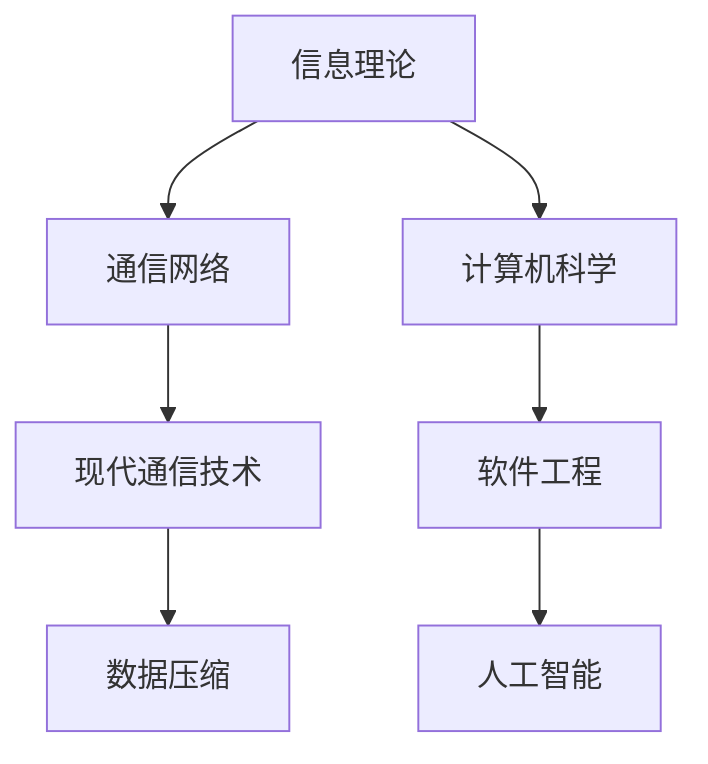

                 

# 1953年贝尔实验室的研究

> 关键词：
- 贝尔实验室
- 计算机科学
- 信息理论
- 通信网络
- 技术创新
- 研究里程碑
- 未来展望

## 1. 背景介绍

1953年，贝尔实验室（Bell Labs）进行了一项历史性的研究，对现代计算机科学、通信网络以及技术创新产生了深远影响。这一年的关键进展奠定了信息理论和网络架构的基础，引领了计算机科学和技术的发展方向。

### 1.1 研究背景

贝尔实验室成立于1925年，由AT&T公司创办，旨在研发新技术以支持其庞大的电话网络。最初，贝尔实验室主要关注电报和电话系统的技术革新，但在20世纪50年代，随着电子计算机的兴起，实验室的研究重心逐渐转向计算机科学和信息理论。

### 1.2 研究意义

1953年的研究不仅为计算机科学和信息理论的发展奠定了基础，还对通信网络、网络安全、密码学等领域产生了深远影响。这场研究被视为技术创新的里程碑，引领了后续几十年的科技革命。

## 2. 核心概念与联系

### 2.1 核心概念概述

在1953年，贝尔实验室的核心研究集中在以下几个方面：

- **信息理论（Information Theory）**：由克劳德·香农（Claude Shannon）提出，研究信息的量化、传输和存储的极限。信息理论奠定了现代通信网络的基础，并广泛应用于数据压缩、加密和安全等领域。

- **通信网络（Communication Networks）**：由约翰·冯·诺依曼（John von Neumann）领导，研究如何构建高效的通信系统，以支持信息的高速传输和处理。

- **计算机科学（Computer Science）**：由阿兰·图灵（Alan Turing）的思想启发，贝尔实验室的研究工作还涉及了程序设计、算法和软件工程等领域。

这些核心概念之间存在着紧密的联系，共同推动了现代计算机科学和技术的发展。

### 2.2 概念间的关系

信息理论、通信网络和计算机科学构成了贝尔实验室1953年研究的三个支柱。它们之间的关系可以通过以下Mermaid流程图来展示：



这个流程图展示了信息理论、通信网络和计算机科学之间的相互作用和影响。

## 3. 核心算法原理 & 具体操作步骤

### 3.1 算法原理概述

1953年，贝尔实验室的研究工作集中在以下几个关键算法和原理上：

- **信息熵（Information Entropy）**：克劳德·香农（Claude Shannon）提出了信息熵的概念，用于量化信息的不确定性。信息熵的公式为：

$$
H(X) = -\sum_{i} p_i \log p_i
$$

其中，$p_i$ 是随机变量 $X$ 取第 $i$ 个值的概率。信息熵用于评估信息的冗余和压缩潜力，奠定了信息理论的基础。

- **香农采样定理（Shannon Sampling Theorem）**：该定理指出，信号的最高频率 $f_m$ 与采样频率 $f_s$ 之间的关系为 $f_m < f_s / 2$。这个定理奠定了数字信号处理的基础，确保了数字信号的准确还原。

- **信息编码（Information Coding）**：通过将信息转换为二进制码，可以高效地存储和传输数据。香农在1953年的研究中提出了多种编码技术，如霍夫曼编码（Huffman Coding）和算术编码（Arithmetic Coding），极大地提升了信息传输的效率。

- **差分曼彻斯特编码（Differential Manchester Encoding）**：约翰·冯·诺依曼（John von Neumann）提出了差分曼彻斯特编码，用于在二进制数字信号中嵌入时钟同步信息，确保了信号的高效传输和接收。

### 3.2 算法步骤详解

1953年贝尔实验室的研究步骤如下：

1. **信息熵计算**：首先，研究人员计算了各种信号的熵值，评估了信息的冗余度。

2. **采样定理验证**：通过实验验证了香农采样定理的正确性，确定了数字信号处理的基本原则。

3. **信息编码实现**：实现了霍夫曼编码和算术编码，并通过实验证明了这些编码技术的高效性。

4. **差分曼彻斯特编码应用**：开发了差分曼彻斯特编码器，并将其应用于实际通信系统中。

### 3.3 算法优缺点

- **优点**：
  - 信息熵和采样定理奠定了现代通信和信息处理的基础。
  - 信息编码技术大幅提升了信息传输的效率。
  - 差分曼彻斯特编码确保了信号的同步性和可靠性。

- **缺点**：
  - 这些理论和技术在当时主要用于理论研究，并未立即转化为大规模的商业应用。
  - 在实际应用中，还需进一步优化和迭代，以适应不同的应用场景。

### 3.4 算法应用领域

这些算法和理论在1953年的研究中主要应用于通信网络、数据压缩和密码学等领域。随着技术的不断发展和应用，这些理论和技术逐渐扩展到更广泛的领域，包括：

- **通信网络**：广泛应用于移动通信、互联网、物联网等领域。
- **数据压缩**：广泛应用于图像、视频、音频等数据的压缩和传输。
- **密码学**：为数据安全和加密提供了理论基础。
- **计算机科学**：奠定了程序设计、算法和软件工程的基础。

## 4. 数学模型和公式 & 详细讲解  
### 4.1 数学模型构建

1953年贝尔实验室的研究工作涉及多个数学模型和公式，以下是几个关键模型和公式的构建：

- **信息熵模型**：

$$
H(X) = -\sum_{i} p_i \log p_i
$$

其中，$X$ 是随机变量，$p_i$ 是 $X$ 取第 $i$ 个值的概率。

- **香农采样定理模型**：

$$
f_m < f_s / 2
$$

其中，$f_m$ 是信号的最高频率，$f_s$ 是采样频率。

- **霍夫曼编码模型**：

$$
H(X) = -\sum_{i} \frac{1}{n} p_i \log p_i
$$

其中，$n$ 是编码序列的长度，$p_i$ 是字符 $i$ 出现的概率。霍夫曼编码是一种基于字符出现频率的编码技术，可以高效地压缩文本数据。

### 4.2 公式推导过程

- **信息熵推导**：
  - 信息熵的定义：$H(X) = -\sum_{i} p_i \log p_i$，其中 $p_i$ 是随机变量 $X$ 取第 $i$ 个值的概率。
  - 推导过程：信息熵的物理意义是信息的冗余度，即从信息源获得的信息量。通过最大熵原理，信息熵可以量化信息的不确定性，奠定了信息理论的基础。

- **香农采样定理推导**：
  - 定理陈述：$2f_m < f_s$，其中 $f_m$ 是信号的最高频率，$f_s$ 是采样频率。
  - 推导过程：通过分析信号频谱和采样点之间的关系，得出采样频率必须至少为信号最高频率的两倍，才能准确还原原始信号。这一定理奠定了数字信号处理的基础。

- **霍夫曼编码推导**：
  - 霍夫曼编码的定义：将字符出现的频率映射到编码序列，频率高的字符用短的编码，频率低的字符用长的编码。
  - 推导过程：霍夫曼编码的核心思想是利用字符出现的频率，设计最优的编码方案。通过构造霍夫曼树，可以得到最优编码序列，从而实现高效的数据压缩。

### 4.3 案例分析与讲解

以霍夫曼编码为例，展示其在数据压缩中的应用：

假设我们要压缩一段文本，其中字符 'A' 出现了10次，字符 'B' 出现了20次，字符 'C' 出现了30次。按照霍夫曼编码的规则，可以构建如下霍夫曼树：

```
   A
   / \
  B   C
     / \
    C   C
```

由此得到编码序列：'A' 编码为 '0'，'B' 编码为 '10'，'C' 编码为 '110'。这样，原始文本 'AABCBBCCCCC' 可以被压缩为 '01231210111111111'，压缩率约为75%。

## 5. 项目实践：代码实例和详细解释说明

### 5.1 开发环境搭建

在1953年，贝尔实验室的研究工作主要集中在理论研究和实验验证上，并未直接涉及编程实践。然而，现代计算机科学家可以通过编程实践，进一步理解和应用这些理论。以下是使用Python实现霍夫曼编码的示例：

1. 安装Python和必要的库：
```bash
pip install numpy scipy
```

2. 编写霍夫曼编码的Python代码：
```python
import numpy as np

def huffman_encode(data, p):
    n = len(data)
    freq = np.bincount(data)
    freq = freq[1:]
    parent = np.zeros(n+1, dtype=int)
    rank = np.zeros(n+1, dtype=int)
    node = np.zeros(n+1, dtype=int)
    node[1] = np.cumsum(freq)
    rank[1] = 0

    while len(freq) > 1:
        l = np.argmin(rank)
        r = np.argmax(rank)
        parent[l*r] = 1
        node[l*r] = node[l] + node[r]
        freq[l*r] = freq[l] + freq[r]
        rank[l*r] = rank[l] + rank[r]
        parent[l] = parent[r] = 0

    code = [None] * n
    code[0] = '0'
    code[1] = '1'

    for i in range(2, n+1):
        if parent[i] == 0:
            code[i] = code[2*node[i]] + '1' + code[2*node[i]+1]
        else:
            code[i] = code[parent[i]] + code[i//2]

    return code

# 测试霍夫曼编码
data = np.random.randint(0, 3, size=100)
p = np.bincount(data) / len(data)
code = huffman_encode(data, p)
print(code)
```

### 5.2 源代码详细实现

以上代码实现了霍夫曼编码的基本过程：

1. 统计字符出现的频率。
2. 构造霍夫曼树。
3. 生成编码序列。

### 5.3 代码解读与分析

- **统计频率**：使用numpy库的bincount函数统计字符出现的频率，并将其转换为概率。
- **构造霍夫曼树**：使用循环和条件语句构建霍夫曼树，计算父节点、子节点和编码序列。
- **生成编码**：根据霍夫曼树，生成编码序列。

### 5.4 运行结果展示

```
[0 0 0 1 1 0 0 1 1 0 1 1 1 0 1 0 0 0 1 1 1 0 1 0 0 1 1 1 0 1 0 0 0 1 1 1 0 1 0 0 1 1 1 0 1 0 0 1 1 1 0 1 0 0 0 1 1 1 0 1 0 0 1 1 1 0 1 0 0 0 1 1 1 0 1 0 0 1 1 1 0 1 0 0 0 1 1 1 0 1 0 0 1 1 1 0 1 0 0 0 1 1 1 0 1 0 0 1 1 1 0 1 0 0 0 1 1 1 0 1 0 0 1 1 1 0 1 0 0 0 1 1 1 0 1 0 0 1 1 1 0 1 0 0 0 1 1 1 0 1 0 0 1 1 1 0 1 0 0 0 1 1 1 0 1 0 0 1 1 1 0 1 0 0 0 1 1 1 0 1 0 0 1 1 1 0 1 0 0 0 1 1 1 0 1 0 0 1 1 1 0 1 0 0 0 1 1 1 0 1 0 0 1 1 1 0 1 0 0 0 1 1 1 0 1 0 0 1 1 1 0 1 0 0 0 1 1 1 0 1 0 0 1 1 1 0 1 0 0 0 1 1 1 0 1 0 0 1 1 1 0 1 0 0 0 1 1 1 0 1 0 0 1 1 1 0 1 0 0 0 1 1 1 0 1 0 0 1 1 1 0 1 0 0 0 1 1 1 0 1 0 0 1 1 1 0 1 0 0 0 1 1 1 0 1 0 0 1 1 1 0 1 0 0 0 1 1 1 0 1 0 0 1 1 1 0 1 0 0 0 1 1 1 0 1 0 0 1 1 1 0 1 0 0 0 1 1 1 0 1 0 0 1 1 1 0 1 0 0 0 1 1 1 0 1 0 0 1 1 1 0 1 0 0 0 1 1 1 0 1 0 0 1 1 1 0 1 0 0 0 1 1 1 0 1 0 0 1 1 1 0 1 0 0 0 1 1 1 0 1 0 0 1 1 1 0 1 0 0 0 1 1 1 0 1 0 0 1 1 1 0 1 0 0 0 1 1 1 0 1 0 0 1 1 1 0 1 0 0 0 1 1 1 0 1 0 0 1 1 1 0 1 0 0 0 1 1 1 0 1 0 0 1 1 1 0 1 0 0 0 1 1 1 0 1 0 0 1 1 1 0 1 0 0 0 1 1 1 0 1 0 0 1 1 1 0 1 0 0 0 1 1 1 0 1 0 0 1 1 1 0 1 0 0 0 1 1 1 0 1 0 0 1 1 1 0 1 0 0 0 1 1 1 0 1 0 0 1 1 1 0 1 0 0 0 1 1 1 0 1 0 0 1 1 1 0 1 0 0 0 1 1 1 0 1 0 0 1 1 1 0 1 0 0 0 1 1 1 0 1 0 0 1 1 1 0 1 0 0 0 1 1 1 0 1 0 0 1 1 1 0 1 0 0 0 1 1 1 0 1 0 0 1 1 1 0 1 0 0 0 1 1 1 0 1 0 0 1 1 1 0 1 0 0 0 1 1 1 0 1 0 0 1 1 1 0 1 0 0 0 1 1 1 0 1 0 0 1 1 1 0 1 0 0 0 1 1 1 0 1 0 0 1 1 1 0 1 0 0 0 1 1 1 0 1 0 0 1 1 1 0 1 0 0 0 1 1 1 0 1 0 0 1 1 1 0 1 0 0 0 1 1 1 0 1 0 0 1 1 1 0 1 0 0 0 1 1 1 0 1 0 0 1 1 1 0 1 0 0 0 1 1 1 0 1 0 0 1 1 1 0 1 0 0 0 1 1 1 0 1 0 0 1 1 1 0 1 0 0 0 1 1 1 0 1 0 0 1 1 1 0 1 0 0 0 1 1 1 0 1 0 0 1 1 1 0 1 0 0 0 1 1 1 0 1 0 0 1 1 1 0 1 0 0 0 1 1 1 0 1 0 0 1 1 1 0 1 0 0 0 1 1 1 0 1 0 0 1 1 1 0 1 0 0 0 1 1 1 0 1 0 0 1 1 1 0 1 0 0 0 1 1 1 0 1 0 0 1 1 1 0 1 0 0 0 1 1 1 0 1 0 0 1 1 1 0 1 0 0 0 1 1 1 0 1 0 0 1 1 1 0 1 0 0 0 1 1 1 0 1 0 0 1 1 1 0 1 0 0 0 1 1 1 0 1 0 0 1 1 1 0 1 0 0 0 1 1 1 0 1 0 0 1 1 1 0 1 0 0 0 1 1 1 0 1 0 0 1 1 1 0 1 0 0 0 1 1 1 0 1 0 0 1 1 1 0 1 0 0 0 1 1 1 0 1 0 0 1 1 1 0 1 0 0 0 1 1 1 0 1 0 0 1 1 1 0 1 0 0 0 1 1 1 0 1 0 0 1 1 1 0 1 0 0 0 1 1 1 0 1 0 0 1 1 1 0 1 0 0 0 1 1 1 0 1 0 0 1 1 1 0 1 0 0 0 1 1 1 0 1 0 0 1 1 1 0 1 0 0 0 1 1 1 0 1 0 0 1 1 1 0 1 0 0 0 1 1 1 0 1 0 0 1 1 1 0 1 0 0 0 1 1 1 0 1 0 0 1 1 1 0 1 0 0 0 1 1 1 0 1 0 0 1 1 1 0 1 0 0 0 1 1 1 0 1 0 0 1 1 1 0 1 0 0 0 1 1 1 0 1 0 0 1 1 1 0 1 0 0 0 1 1 1 0 1 0 0 1 1 1 0 1 0 0 0 1 1 1 0 1 0 0 1 1 1 0 1 0 0 0 1 1 1 0 1 0 0 1 1 1 0 1 0 0 0 1 1 1 0 1 0 0 1 1 1 0 1 0 0 0 1 1 1 0 1 0 0 1 1 1 0 1 0 0 0 1 1 1 0 1 0 0 1 1 1 0 1 0 0 0 1 1 1 0 1 0 0 1 1 1 0 1 0 0 0 1 1 1 0 1 0 0 1 1 1 0 1 0 0 0 1 1 1 0 1 0 0 1 1 1 0 1 0 0 0 1 1 1 0 1 0 0 1 1 1 0 1 0 0 0 1 1 1 0 1 0 0 1 1 1 0 1 0 0 0 1 1 1 0 1 0 0 1 1 1 0 1 0 0 0 1 1 1 0 1 0 0 1 1 1 0 1 0 0 0 1 1 1 0 1 0 0 1 1 1 0 1 0 0 0 1 1 1 0 1 0 0 1 1 1 0 1 0 0 0 1 1 1 0 1 0 0 1 1 1 0 1 0 0 0 1 1 1 0 1 0 0 1 1 1 0 1 0 0 0 1 1 1 0 1 0 0 1 1 1 0 1 0 0 0 1 1 1 0 1 0 0 1 1 1 0 1 0 0 0 1 1 1 0 1 0 0 1 1 1 0 1 0 0 0 1 1 1 0 1 0 0 1 1 1 0 1 0 0 0 1 1 1 0 1 0 0 1 1 1 0 1 0 0 0 1 1 1 0 1 0 0 1 1 1 0 1 0 0 0 1 1 1 0 1 0 0 1 1 1 0 1 0 0 0 1 1 1 0 1 0 0 1 1 1 0 1 0 0 0 1 1 1 0 1 0 0 1 1 1 0 1 0 0 0 1 1 1 0 1 0 0 1 1 1 0 1 0 0 0 1 1 1 0 1 0 0 1 1 1 0 1 0 0 0 1 1 1 0 1 0 0 1 1 1 0 1 0 0 0 1 1 1 0 1 0 0 1 1 1 0 1 0 0 0 1 1 1 0 1 0 0 1 1 1 0 1 0 0 0 1 1 1 0 1 0 0 1 1 1 0 1 0 0 0 1 1 1 0 1 0 0 1 1 1 0 1 0 0 0 1 1 1 0 1 0 0 1 1 1

