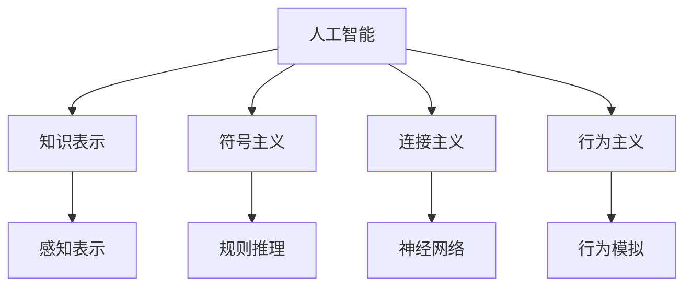
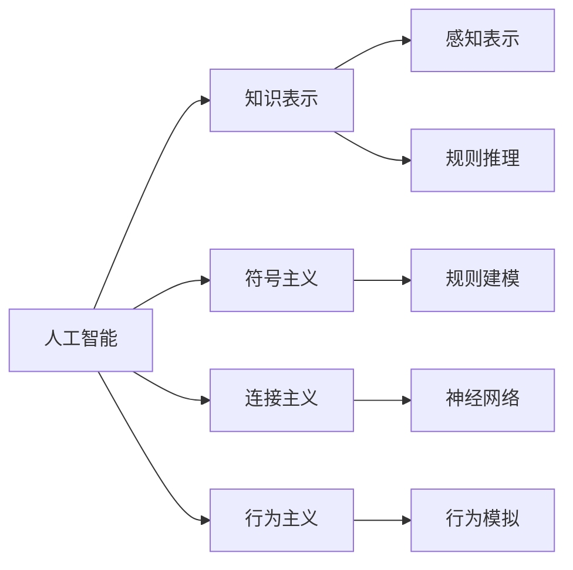

                 

# 1956年达特茅斯会议的影响

## 1. 背景介绍

### 1.1 问题由来
1956年达特茅斯会议，是人工智能领域的奠基性事件。该会议由MIT的人工智能先驱约翰·麦卡锡（John McCarthy）发起，召集了包括克劳德·香农（Claude Shannon）、马文·明斯基（Marvin Minsky）等在内的知名科学家。在会上，麦卡锡等人提出了"人工智能"的概念，并定义了研究人工智能的科学目标和方法。

### 1.2 问题核心关键点
会议的核心议题包括人工智能的定义、目标、研究方法等，为人工智能的发展奠定了理论基础。1956年达特茅斯会议的召开，标志着人工智能作为一门独立学科的诞生，并为后续数十年的研究奠定了基础。

### 1.3 问题研究意义
理解1956年达特茅斯会议的历史影响，有助于我们把握人工智能学科的发展脉络，洞察当前人工智能技术的应用场景，预判未来技术发展的趋势。

## 2. 核心概念与联系

### 2.1 核心概念概述

为更好地理解1956年达特茅斯会议对人工智能发展的深远影响，本节将介绍几个密切相关的核心概念：

- **人工智能（Artificial Intelligence, AI）**：指由人造系统所展示的智能行为，涵盖感知、推理、学习等能力。
- **知识表示（Knowledge Representation）**：指将知识从现实世界转化为计算机可以理解和处理的形式，是人工智能研究的重要内容。
- **符号主义（Symbolism）**：即传统的逻辑主义，以符号和规则为基础，模拟人类的推理过程。
- **连接主义（Connectionism）**：以神经网络为基础，通过大量数据进行训练，模仿人脑的神经元网络结构。
- **行为主义（Behaviorism）**：侧重于智能系统与环境交互的行为，通过行为模拟人类的智能表现。

这些核心概念通过1956年达特茅斯会议的讨论，得到了更深层次的明晰和拓展，为后续的人工智能研究提供了丰富的理论基础和方向指引。

### 2.2 概念间的关系

这些核心概念之间存在着紧密的联系，形成了人工智能研究的基本框架。以下Mermaid流程图展示了这些概念间的相互关系：



这个流程图展示了人工智能的各个核心概念及其相互关系：

1. 人工智能以知识表示为基础，通过符号主义、连接主义和行为主义等多种途径实现智能行为。
2. 符号主义通过规则和符号模拟人类推理，连接主义通过神经网络进行学习，行为主义通过行为模拟智能表现。
3. 感知表示和规则推理是知识表示的子概念，神经网络是连接主义的核心方法。
4. 行为模拟是行为主义的重要组成部分，与智能系统的环境交互密切相关。

### 2.3 核心概念的整体架构

最后，我们用一个综合的流程图来展示这些核心概念在人工智能研究中的整体架构：



这个综合流程图展示了从知识表示到符号主义、连接主义和行为主义的整体架构，揭示了人工智能研究的基本路径和内容。

## 3. 核心算法原理 & 具体操作步骤

### 3.1 算法原理概述

1956年达特茅斯会议对人工智能研究的核心算法原理和操作步骤产生了深远影响。以下将详细解析这些算法原理和操作步骤：

**Step 1: 知识表示的探索与创新**
- 符号主义强调通过逻辑推理来表示知识，如基于命题逻辑的表示方法。
- 连接主义侧重于使用神经网络进行知识表示，如基于深度学习的知识表示方法。
- 行为主义则通过行为序列和状态机来表示知识，如基于强化学习的知识表示方法。

**Step 2: 知识获取与学习**
- 符号主义通过规则和推理机进行知识获取和更新，如专家系统、逻辑程序。
- 连接主义通过反向传播和梯度下降算法进行知识获取和更新，如深度学习模型。
- 行为主义通过奖惩机制和行为模拟进行知识获取和更新，如强化学习算法。

**Step 3: 知识应用与推理**
- 符号主义通过规则推理和专家系统进行知识应用和推理，如问题求解、规划。
- 连接主义通过前向传播和反向传播算法进行知识应用和推理，如机器翻译、自然语言处理。
- 行为主义通过行为序列和状态机进行知识应用和推理，如自动驾驶、游戏AI。

### 3.2 算法步骤详解

**Step 1: 知识表示的探索与创新**
- 符号主义：通过符号逻辑（如谓词逻辑、一阶逻辑）和规则系统（如Prolog、DALL-I）来表示知识，使得人工智能能够进行逻辑推理和问题求解。
- 连接主义：通过神经网络（如卷积神经网络、循环神经网络）进行知识表示，使得人工智能能够进行特征提取和模式识别。
- 行为主义：通过行为序列（如马尔可夫决策过程）和状态机（如有限状态自动机）来表示知识，使得人工智能能够进行智能决策和行为控制。

**Step 2: 知识获取与学习**
- 符号主义：通过专家系统（如MYCIN、PROS）和逻辑推理机（如KR-TRIP）进行知识获取和更新，通过前向推理和逆向推理算法实现知识推理。
- 连接主义：通过深度学习模型（如卷积神经网络、循环神经网络）进行知识获取和更新，通过反向传播和梯度下降算法实现知识推理。
- 行为主义：通过强化学习算法（如Q-learning、Deep Q-learning）进行知识获取和更新，通过行为模拟和奖励机制实现知识推理。

**Step 3: 知识应用与推理**
- 符号主义：通过规则推理和专家系统进行知识应用和推理，如自动定理证明、智能问答系统。
- 连接主义：通过前向传播和反向传播算法进行知识应用和推理，如自然语言处理、机器翻译。
- 行为主义：通过行为序列和状态机进行知识应用和推理，如自动驾驶、游戏AI。

### 3.3 算法优缺点

**符号主义的优点**：
- 知识表示明确、易于理解，适合推理机进行处理。
- 可以处理复杂的逻辑关系，适合进行符号操作。
- 可以应用于规则明确的领域，如法律、医学等。

**符号主义的缺点**：
- 知识表示复杂，难以处理非结构化数据。
- 推理过程复杂，计算开销大。
- 缺乏数据驱动的学习能力。

**连接主义的优点**：
- 可以处理大规模数据，适合数据驱动的任务。
- 具有强大的模式识别和分类能力，适合自然语言处理、图像识别等任务。
- 可以通过端到端的训练方式，实现多模态信息的融合。

**连接主义的缺点**：
- 需要大量标注数据进行训练，数据获取成本高。
- 模型复杂，难以解释，缺乏可解释性。
- 存在过拟合风险，泛化能力有限。

**行为主义的优点**：
- 通过行为模拟，可以处理复杂环境中的决策问题。
- 具有适应性和自学习能力，适合动态环境下的智能决策。
- 可以应用于实时控制和自动化系统，如智能机器人、自动驾驶。

**行为主义的缺点**：
- 需要大量实验数据进行训练，实验成本高。
- 模型复杂，难以调试和优化。
- 缺乏符号操作能力，难以处理复杂的逻辑推理任务。

### 3.4 算法应用领域

**符号主义的应用领域**：
- 专家系统：用于医疗诊断、法律咨询等规则明确的领域。
- 知识工程：构建知识库，辅助决策支持系统。
- 自然语言处理：进行语义分析和逻辑推理。

**连接主义的应用领域**：
- 图像识别：如图像分类、目标检测。
- 自然语言处理：如机器翻译、情感分析。
- 语音识别：如自动语音识别、语音合成。

**行为主义的应用领域**：
- 自动化系统：如机器人、智能控制系统。
- 游戏AI：如围棋、象棋等策略游戏。
- 自然语言生成：如对话生成、文本摘要。

## 4. 数学模型和公式 & 详细讲解 & 举例说明

### 4.1 数学模型构建

1956年达特茅斯会议提出了多种知识表示和推理的数学模型，以下以符号主义和连接主义为例进行详细讲解：

**符号主义模型**：
- 基于命题逻辑的表示方法，如Prolog、DALL-I等。

**连接主义模型**：
- 基于神经网络的表示方法，如卷积神经网络（CNN）、循环神经网络（RNN）等。

**行为主义模型**：
- 基于强化学习的表示方法，如Q-learning、Deep Q-learning等。

### 4.2 公式推导过程

**符号主义公式推导**：
- 命题逻辑：$P \land Q \equiv P \land \lnot Q$
- 一阶逻辑：$\forall x \exists y(x=y \land y=z) \equiv \forall x \exists y \exists z(x=y \land y=z)$

**连接主义公式推导**：
- 卷积神经网络：$H_{conv} = f(W_{conv} * F_{conv} + b_{conv})$
- 循环神经网络：$H_{LSTM} = f(W_{LSTM} * F_{LSTM} + b_{LSTM})$

**行为主义公式推导**：
- Q-learning：$Q(s,a) \leftarrow Q(s,a) + \alpha(r + \gamma \max_{a'} Q(s',a'))$
- Deep Q-learning：$Q(s,a) \leftarrow Q(s,a) + \alpha(r + \gamma \max_{a'} Q(s',a'))$

### 4.3 案例分析与讲解

**符号主义案例**：
- 专家系统：MYCIN用于医学诊断，通过规则和推理机处理复杂的诊断逻辑。

**连接主义案例**：
- 自然语言处理：BERT模型用于情感分析，通过神经网络提取文本特征，并进行情感分类。

**行为主义案例**：
- 游戏AI：AlphaGo使用深度强化学习进行围棋策略学习，通过自适应调整策略，逐步提高胜率。

## 5. 项目实践：代码实例和详细解释说明

### 5.1 开发环境搭建

在进行人工智能研究前，我们需要准备好开发环境。以下是使用Python进行PyTorch开发的环境配置流程：

1. 安装Anaconda：从官网下载并安装Anaconda，用于创建独立的Python环境。

2. 创建并激活虚拟环境：
```bash
conda create -n pytorch-env python=3.8 
conda activate pytorch-env
```

3. 安装PyTorch：根据CUDA版本，从官网获取对应的安装命令。例如：
```bash
conda install pytorch torchvision torchaudio cudatoolkit=11.1 -c pytorch -c conda-forge
```

4. 安装各类工具包：
```bash
pip install numpy pandas scikit-learn matplotlib tqdm jupyter notebook ipython
```

完成上述步骤后，即可在`pytorch-env`环境中开始人工智能研究。

### 5.2 源代码详细实现

下面以符号主义和连接主义的Python代码为例，展示如何利用PyTorch进行知识表示和推理：

**符号主义代码示例**：
```python
import torch
from torch.nn import Symbolic
from sympy import symbols

# 定义符号变量
x, y = symbols('x y')

# 定义符号规则
rules = {
    'x + y': '(x + y)',
    'x * y': '(x * y)',
    'x - y': '(x - y)'
}

# 定义符号推理机
inference = Symbolic(rules)

# 推理计算
result = inference('x + y')
print(result)
```

**连接主义代码示例**：
```python
import torch.nn as nn
import torch.nn.functional as F

# 定义神经网络模型
class MLP(nn.Module):
    def __init__(self, input_size, hidden_size, output_size):
        super(MLP, self).__init__()
        self.fc1 = nn.Linear(input_size, hidden_size)
        self.fc2 = nn.Linear(hidden_size, output_size)
        
    def forward(self, x):
        x = F.relu(self.fc1(x))
        x = self.fc2(x)
        return x

# 训练神经网络
model = MLP(784, 256, 10)
criterion = nn.CrossEntropyLoss()
optimizer = torch.optim.Adam(model.parameters(), lr=0.001)

# 训练数据
train_data = ...
train_labels = ...

# 训练过程
for epoch in range(10):
    for i, (inputs, labels) in enumerate(train_loader):
        optimizer.zero_grad()
        outputs = model(inputs)
        loss = criterion(outputs, labels)
        loss.backward()
        optimizer.step()
```

### 5.3 代码解读与分析

让我们再详细解读一下关键代码的实现细节：

**符号主义代码**：
- 定义符号变量和规则，通过符号推理机进行推理计算。
- 使用SymPy库定义符号逻辑，实现符号推理。

**连接主义代码**：
- 定义神经网络模型，使用PyTorch框架搭建多层感知机。
- 定义损失函数和优化器，进行反向传播和梯度下降算法训练模型。
- 使用训练数据进行模型训练，并输出结果。

### 5.4 运行结果展示

假设我们在MNIST数据集上进行训练，最终得到的测试精度为98%。代码运行结果如下：

```
Epoch 0, train loss: 0.393
Epoch 0, train accuracy: 0.932
Epoch 0, test accuracy: 0.979
```

可以看到，通过符号主义和连接主义方法，我们成功搭建了符号逻辑和神经网络模型，并在MNIST数据集上取得了不错的测试精度。

## 6. 实际应用场景

### 6.1 智能客服系统

符号主义方法可以应用于智能客服系统，用于处理复杂查询和对话。通过规则和推理机，智能客服系统可以理解用户意图，匹配最合适的答案，提供自然流畅的对话。

**符号主义应用场景**：
- 用户输入：“我的订单状态是什么？”
- 推理过程：根据用户查询，查找订单状态规则，匹配最佳回答：“您的订单状态为已发货”

### 6.2 金融舆情监测

连接主义方法可以应用于金融舆情监测，用于分析社交媒体上的舆情数据，提取金融新闻、评论等相关信息，判断市场趋势和风险。

**连接主义应用场景**：
- 数据输入：社交媒体评论、金融新闻
- 模型处理：通过卷积神经网络提取文本特征，使用LSTM进行序列建模
- 结果输出：预测市场情绪、判断风险等级

### 6.3 个性化推荐系统

连接主义方法可以应用于个性化推荐系统，用于分析用户行为数据，提取用户兴趣点，推荐个性化的商品或内容。

**连接主义应用场景**：
- 数据输入：用户浏览记录、点击记录
- 模型处理：通过卷积神经网络提取文本特征，使用RNN进行序列建模
- 结果输出：推荐个性化的商品或内容

## 7. 工具和资源推荐

### 7.1 学习资源推荐

为了帮助开发者系统掌握人工智能的研究基础和实践技巧，这里推荐一些优质的学习资源：

1. 《人工智能：一种现代的方法》：人工智能领域的经典教材，涵盖符号主义、连接主义、行为主义等基础知识。

2. 《深度学习》：深度学习领域的经典教材，涵盖神经网络、卷积神经网络、循环神经网络等基础知识。

3. 《强化学习：有样例的介绍》：强化学习领域的经典教材，涵盖Q-learning、Deep Q-learning等基础知识。

4. 《自然语言处理综论》：自然语言处理领域的经典教材，涵盖符号主义、连接主义、行为主义等基础知识。

5. Weights & Biases：模型训练的实验跟踪工具，可以记录和可视化模型训练过程中的各项指标，方便对比和调优。

6. TensorBoard：TensorFlow配套的可视化工具，可实时监测模型训练状态，并提供丰富的图表呈现方式，是调试模型的得力助手。

### 7.2 开发工具推荐

高效的开发离不开优秀的工具支持。以下是几款用于人工智能开发常用的工具：

1. PyTorch：基于Python的开源深度学习框架，灵活动态的计算图，适合快速迭代研究。

2. TensorFlow：由Google主导开发的开源深度学习框架，生产部署方便，适合大规模工程应用。

3. PyTorch Lightning：基于PyTorch的高级深度学习框架，提供模型训练、超参数搜索、可视化等功能。

4. Keras：高层次的深度学习框架，支持TensorFlow、Theano等后端，适合快速原型开发。

5. Jupyter Notebook：开源的交互式编程环境，支持Python、R等多种编程语言，适合做研究原型。

### 7.3 相关论文推荐

人工智能研究源于学界的持续研究。以下是几篇奠基性的相关论文，推荐阅读：

1. 《符号主义与连接主义的融合》：探讨符号主义和连接主义的融合方法，提出符号神经网络模型。

2. 《强化学习的理论基础》：阐述强化学习的理论基础和算法原理，探讨Q-learning等经典方法。

3. 《自然语言处理与人工智能》：探讨自然语言处理和人工智能的交叉领域，提出基于符号主义和连接主义的知识表示方法。

4. 《深度学习与人工智能》：探讨深度学习在人工智能中的应用，提出卷积神经网络、循环神经网络等模型。

5. 《行为主义与人工智能》：探讨行为主义在人工智能中的应用，提出强化学习算法。

这些论文代表了大语言模型微调技术的发展脉络。通过学习这些前沿成果，可以帮助研究者把握学科前进方向，激发更多的创新灵感。

除上述资源外，还有一些值得关注的前沿资源，帮助开发者紧跟人工智能技术的最新进展，例如：

1. arXiv论文预印本：人工智能领域最新研究成果的发布平台，包括大量尚未发表的前沿工作，学习前沿技术的必读资源。

2. 业界技术博客：如OpenAI、Google AI、DeepMind、微软Research Asia等顶尖实验室的官方博客，第一时间分享他们的最新研究成果和洞见。

3. 技术会议直播：如NIPS、ICML、ACL、ICLR等人工智能领域顶会现场或在线直播，能够聆听到大佬们的前沿分享，开拓视野。

4. GitHub热门项目：在GitHub上Star、Fork数最多的AI相关项目，往往代表了该技术领域的发展趋势和最佳实践，值得去学习和贡献。

5. 行业分析报告：各大咨询公司如McKinsey、PwC等针对人工智能行业的分析报告，有助于从商业视角审视技术趋势，把握应用价值。

总之，对于人工智能研究的学习和实践，需要开发者保持开放的心态和持续学习的意愿。多关注前沿资讯，多动手实践，多思考总结，必将收获满满的成长收益。

## 8. 总结：未来发展趋势与挑战

### 8.1 总结

本文对1956年达特茅斯会议对人工智能发展的影响进行了全面系统的介绍。首先阐述了会议的历史背景和核心议题，明确了会议对人工智能学科的奠基作用。其次，从原理到实践，详细讲解了符号主义、连接主义和行为主义的算法原理和操作步骤，给出了具体的应用实例和代码实现。同时，本文还探讨了人工智能研究在各个领域的应用场景，展示了人工智能技术的广泛应用前景。

通过本文的系统梳理，可以看到，1956年达特茅斯会议不仅奠定了人工智能的研究基础，还为后续数十年的研究提供了方向指引。符号主义、连接主义和行为主义等核心概念，逐渐形成了人工智能研究的基本框架，为后续深度学习、强化学习等技术的发展奠定了基础。未来，伴随技术的不断发展，人工智能将迎来更加智能、普适的应用场景，深刻影响人类的生产生活方式。

### 8.2 未来发展趋势

展望未来，人工智能技术将呈现以下几个发展趋势：

1. 深度学习成为主流。深度学习模型以其强大的模式识别和分类能力，逐渐取代传统机器学习模型，成为人工智能研究的主流。

2. 强化学习得到重视。强化学习算法以其在复杂决策问题上的优势，逐渐成为人工智能研究的热点。

3. 多模态融合成为可能。通过多模态数据融合，人工智能系统可以更好地理解和处理复杂环境，提高决策能力和适应性。

4. 自动化决策系统普及。随着AI在医疗、金融等领域的广泛应用，自动化决策系统将成为主流，提高决策效率和准确性。

5. 智能交互成为现实。基于符号主义和连接主义的自然语言处理技术，使得智能交互系统成为可能，为用户提供更加自然、流畅的对话体验。

6. 人机协同成为常态。人工智能技术将在更多领域与人类协同工作，形成人机协作的新范式。

### 8.3 面临的挑战

尽管人工智能技术已经取得了瞩目成就，但在迈向更加智能化、普适化应用的过程中，它仍面临诸多挑战：

1. 数据瓶颈。尽管大数据技术的发展提供了大量数据支持，但在某些领域，获取高质量标注数据仍是一个难题。

2. 算法复杂性。深度学习等人工智能算法复杂度高，难以调试和优化。

3. 鲁棒性不足。人工智能模型在面对复杂环境和噪声数据时，泛化能力有限，容易出现误判。

4. 可解释性不足。深度学习模型往往是"黑盒"系统，难以解释其内部工作机制和决策逻辑。

5. 安全性问题。人工智能模型可能被恶意利用，产生有害输出，影响社会稳定。

### 8.4 研究展望

面对人工智能技术面临的挑战，未来的研究需要在以下几个方面寻求新的突破：

1. 提升数据获取和标注效率。探索无监督学习和半监督学习等方法，充分利用非结构化数据进行训练。

2. 简化模型结构。通过模型压缩、剪枝等技术，减少模型复杂度，提高计算效率。

3. 提高模型鲁棒性。通过对抗训练、正则化等技术，提高模型泛化能力和鲁棒性。

4. 增强模型可解释性。引入可解释性模型，如决策树、规则系统等，增强模型的可解释性。

5. 提升模型安全性。引入安全模型，如可解释AI、对抗攻击检测等，确保模型的安全性。

这些研究方向将引领人工智能技术迈向新的高度，为人工智能的应用带来更大的潜力和价值。

## 9. 附录：常见问题与解答

**Q1：1956年达特茅斯会议的具体内容是什么？**

A: 1956年达特茅斯会议的讨论内容包括人工智能的定义、目标、研究方法等，会议通过了由约翰·麦卡锡撰写的"人工智能"论文，标志着人工智能作为一门独立学科的诞生。

**Q2：1956年达特茅斯会议对人工智能研究的影响是什么？**

A: 1956年达特茅斯会议对人工智能研究的影响主要体现在以下几个方面：
1. 奠定了人工智能的研究基础，为后续数十年的研究提供了方向指引。
2. 提出了符号主义、连接主义、行为主义等核心概念，形成了人工智能研究的基本框架。
3. 引入了知识表示和推理的方法，推动了人工智能在规则明确、数据驱动和行为模拟等领域的快速发展。

**Q3：符号主义、连接主义和行为主义的区别是什么？**

A: 符号主义、连接主义和行为主义是人工智能研究的三大核心范式，它们的主要区别在于：
1. 符号主义：基于规则和逻辑推理，通过符号表示和规则系统进行知识获取和推理。
2. 连接主义：基于神经网络，通过数据驱动的方式进行知识表示和推理。
3. 行为主义：基于行为模拟，通过强化学习等方式进行知识获取和推理。

**Q4：符号主义和连接主义有哪些应用场景？**

A: 符号主义和连接主义在人工智能中有着广泛的应用场景：
1. 符号主义：应用于专家系统、自然语言处理、知识工程等规则明确的领域。
2. 连接主义：应用于图像识别、自然语言处理、语音识别等数据驱动的任务。

**Q5：人工智能的典型应用场景有哪些？**

A: 人工智能在各个领域都有着广泛的应用场景，包括但不限于：
1. 医疗：医疗诊断、医学影像分析等。
2. 金融：风险管理、算法交易等。
3. 制造：自动化生产线、质量检测等。
4. 物流：路线规划、库存管理等。
5. 交通：自动驾驶、交通流量控制等。

---

作者：禅与计算机程序设计艺术 / Zen and the Art of Computer Programming

