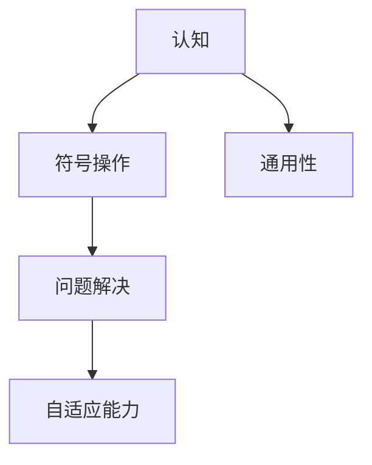
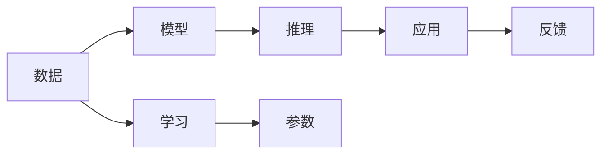
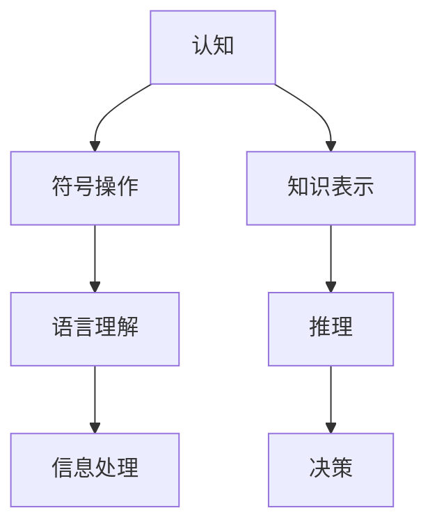
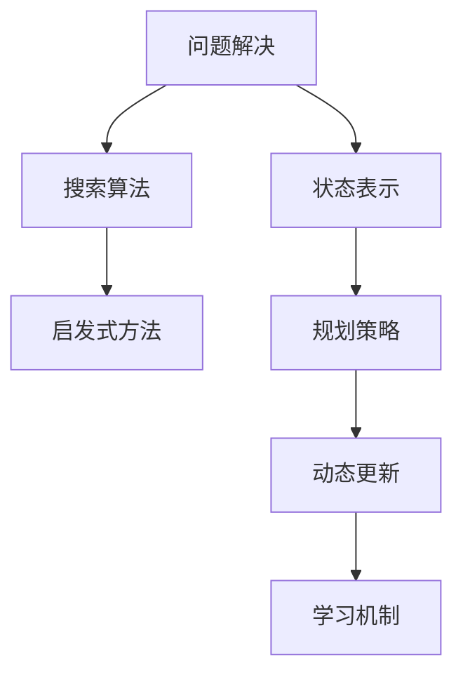
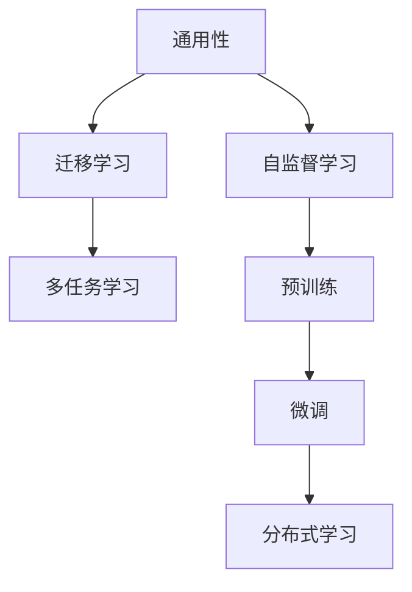
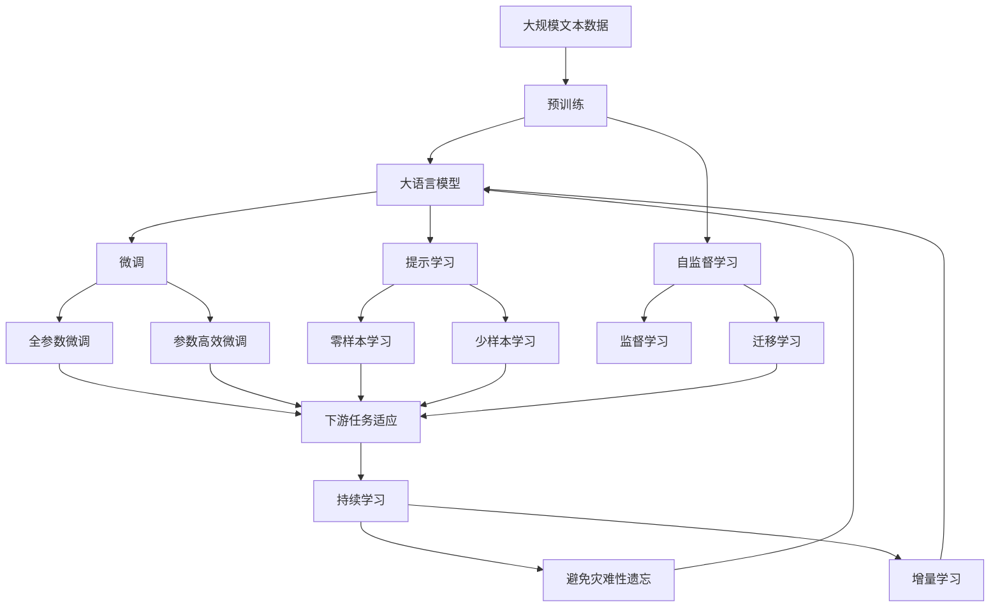

                 

# 1956年达特茅斯会议的豪迈宣言

> 关键词：人工智能, 认知, 机器学习, 程序化, 算法, 数据

## 1. 背景介绍

### 1.1 问题由来
1956年，在新罕布什尔州的达特茅斯学院，约翰·麦卡锡、克劳德·香农、诺伯特·维纳和马文·明斯基等科学家聚集一堂，讨论了"计算机能否模拟人类的智能"这一问题，并定义了"人工智能"这一新领域。这次会议被誉为人工智能的诞生之地，它的讨论内容和方法深深影响了后来数十年的人工智能研究和应用。

达特茅斯会议的召开，不仅标志着人工智能成为一门正式的科学学科，也为随后几十年的人工智能研究奠定了基础。会议中提出的诸多概念和思想，如"认知"、"问题解决"、"符号操作"等，成为人工智能领域的重要研究方向。

### 1.2 问题核心关键点
会议的核心讨论内容主要包括：
1. **认知**：人类如何理解和使用语言，以及机器能否模拟这种理解。
2. **问题解决**：机器如何找到问题解决路径，特别是在没有明确指导的情况下。
3. **符号操作**：通过符号（如字符、数字）来表示和操作信息，实现基本的计算和推理。
4. **通用性**：机器是否能适应不同的任务和环境，而不仅仅是特定场景。
5. **自适应能力**：机器是否能通过经验学习，不断提高其性能。

这些讨论内容成为了人工智能研究的重要方向，推动了后续几十年的技术发展。

### 1.3 问题研究意义
达特茅斯会议的举行，具有重要的历史意义：

1. **学科定位**：将人工智能确立为正式的科学学科，推动了相关研究的发展。
2. **研究导向**：明确了人工智能的研究目标和方向，引领了后续几十年的人工智能研究。
3. **跨学科合作**：促进了计算机科学、心理学、哲学等多个学科的交叉合作，为人工智能的深入研究提供了广阔视角。
4. **技术创新**：激发了新的研究思路和技术方法，推动了人工智能技术在实际应用中的广泛应用。
5. **社会影响**：人工智能技术在多个领域的应用，如医疗、交通、教育等，深刻改变了人类的生活方式和工作方式。

## 2. 核心概念与联系

### 2.1 核心概念概述

为了更好地理解达特茅斯会议的精神，本节将介绍几个核心概念：

- **认知(Cognition)**：人类理解和使用语言、感知和处理信息的能力。认知是人工智能研究的重要目标，旨在让机器能够像人类一样理解世界。
- **符号操作(Symbol Manipulation)**：通过符号来表示和操作信息，实现基本的计算和推理。符号操作是人工智能早期研究的主要方法，广泛应用于逻辑推理、决策制定等任务中。
- **问题解决(Problem Solving)**：机器如何找到问题解决路径，特别是在没有明确指导的情况下。问题解决是人工智能的重要研究方向，涉及搜索算法、启发式方法等技术。
- **自适应能力(Adaptability)**：机器通过经验学习，不断提高其性能，适应不同的任务和环境。自适应能力是人工智能追求的目标之一，通过机器学习、迁移学习等方法实现。
- **通用性(Universality)**：机器是否能适应不同的任务和环境，而不仅仅是特定场景。通用性是人工智能研究的理想目标，推动了机器学习、深度学习等技术的发展。

这些核心概念之间的联系可以通过以下Mermaid流程图来展示：



这个流程图展示了大语言模型微调过程中各个核心概念之间的关系：

1. **认知**：人类理解和使用语言、感知和处理信息的能力，是人工智能研究的重要目标。
2. **符号操作**：通过符号来表示和操作信息，实现基本的计算和推理，是人工智能早期研究的主要方法。
3. **问题解决**：机器如何找到问题解决路径，特别是在没有明确指导的情况下，是人工智能的重要研究方向。
4. **自适应能力**：机器通过经验学习，不断提高其性能，适应不同的任务和环境，是人工智能追求的目标之一。
5. **通用性**：机器是否能适应不同的任务和环境，而不仅仅是特定场景，推动了机器学习、深度学习等技术的发展。

### 2.2 概念间的关系

这些核心概念之间存在着紧密的联系，形成了人工智能研究的完整生态系统。下面我通过几个Mermaid流程图来展示这些概念之间的关系。

#### 2.2.1 人工智能的三个层次



这个流程图展示了人工智能研究的三个层次：数据、模型和应用。数据是人工智能研究的基础，模型是数据与推理之间的桥梁，推理和应用是人工智能的最终目标。学习是模型的核心，通过参数优化实现模型的性能提升。反馈则是不断优化模型的重要机制。

#### 2.2.2 认知与符号操作的关系



这个流程图展示了认知与符号操作的关系。符号操作是实现认知的重要手段，通过语言理解和信息处理，机器能够表示和操作知识，进行推理和决策。

#### 2.2.3 问题解决与自适应能力的关系



这个流程图展示了问题解决与自适应能力的关系。问题解决涉及到搜索算法和启发式方法，通过状态表示和规划策略，机器能够动态更新学习机制，不断提升其性能。

#### 2.2.4 通用性与学习的关系



这个流程图展示了通用性与学习的关系。通用性推动了迁移学习、多任务学习和自监督学习等技术的发展，预训练和微调是学习的重要手段，通过分布式学习，机器能够适应不同的任务和环境。

### 2.3 核心概念的整体架构

最后，我们用一个综合的流程图来展示这些核心概念在大语言模型微调过程中的整体架构：



这个综合流程图展示了从预训练到微调，再到持续学习的完整过程。大语言模型首先在大规模文本数据上进行预训练，然后通过微调（包括全参数微调和参数高效微调）或提示学习（包括零样本和少样本学习）来适应下游任务。最后，通过持续学习技术，模型可以不断更新和适应新的任务和数据。 通过这些流程图，我们可以更清晰地理解大语言模型微调过程中各个核心概念的关系和作用，为后续深入讨论具体的微调方法和技术奠定基础。

## 3. 核心算法原理 & 具体操作步骤
### 3.1 算法原理概述

达特茅斯会议的豪迈宣言中，提出了人工智能的三个核心目标：认知、符号操作和问题解决。以下将详细探讨这三个目标对应的算法原理和具体操作步骤。

### 3.2 算法步骤详解

**Step 1: 准备预训练数据和模型**

- **数据准备**：收集大规模的文本数据，如维基百科、新闻、书籍等，作为预训练的基础。
- **模型选择**：选择适合的任务，如BERT、GPT等预训练语言模型。

**Step 2: 进行预训练**

- **预训练任务**：设计自监督学习任务，如掩码语言模型、下一句预测等，训练模型获得基础的语言理解能力。
- **训练过程**：使用大规模数据集进行无监督训练，优化模型参数，提高模型的通用性。

**Step 3: 添加任务适配层**

- **任务定义**：根据具体任务，设计任务适配层，如分类器、解码器等。
- **目标函数**：选择适合的任务目标函数，如交叉熵损失、负对数似然损失等。

**Step 4: 设置微调超参数**

- **优化器**：选择合适的优化器，如Adam、SGD等，设置学习率、批大小、迭代轮数等。
- **正则化**：应用L2正则、Dropout等技术，防止过拟合。
- **参数冻结**：选择合适的参数冻结策略，如仅微调顶层。

**Step 5: 执行微调**

- **前向传播**：将训练集数据输入模型，计算损失函数。
- **反向传播**：根据损失函数计算梯度，更新模型参数。
- **验证集评估**：在验证集上评估模型性能，根据结果调整学习率或早停。
- **测试集评估**：在测试集上最终评估模型性能。

### 3.3 算法优缺点

基于达特茅斯会议的精神，大语言模型的微调方法具有以下优点：

1. **高效性**：通过预训练获得基础能力，微调只需少量标注数据，节省了标注成本和计算资源。
2. **通用性**：预训练模型在各种任务上表现优异，微调能够快速适应新任务，提高了模型效率。
3. **鲁棒性**：预训练模型的通用性使得微调后的模型具有更好的泛化能力和鲁棒性。
4. **可解释性**：微调后的模型可以用于多种任务，为任务可解释性提供了基础。

同时，该方法也存在一些缺点：

1. **依赖标注数据**：微调效果依赖于标注数据的质量和数量，标注成本较高。
2. **泛化能力有限**：当目标任务与预训练数据分布差异较大时，微调性能受限。
3. **复杂性**：微调过程涉及多个步骤，需要精细的超参数调整。
4. **模型复杂**：大规模预训练模型参数众多，训练和推理资源消耗较大。

尽管存在这些缺点，基于大语言模型微调的监督学习方法仍然是当前主流的人工智能研究范式，在多个领域取得了显著成效。

### 3.4 算法应用领域

基于达特茅斯会议的精神，大语言模型的微调方法广泛应用于以下几个领域：

- **自然语言处理(NLP)**：如文本分类、命名实体识别、情感分析、机器翻译等任务，大语言模型通过微调快速适应新任务。
- **计算机视觉(CV)**：如目标检测、图像分类、语义分割等任务，通过微调使模型能够处理更多的视觉信息。
- **语音处理**：如语音识别、语音合成等任务，通过微调使模型能够理解和生成语音信息。
- **推荐系统**：如个性化推荐、商品推荐等任务，通过微调使模型能够更好地理解用户偏好。
- **智能控制**：如智能家居、自动驾驶等任务，通过微调使模型能够适应不同环境和需求。

以上领域的大规模应用，展示了大语言模型微调方法的强大潜力，为人工智能技术的应用提供了广阔前景。

## 4. 数学模型和公式 & 详细讲解  
### 4.1 数学模型构建

根据达特茅斯会议的精神，大语言模型微调的目标是通过监督学习优化模型参数，使其能够适应特定的下游任务。

记预训练语言模型为 $M_{\theta}$，其中 $\theta$ 为模型参数。假设微调任务的训练集为 $D=\{(x_i,y_i)\}_{i=1}^N$，其中 $x_i$ 为输入文本，$y_i$ 为标注结果。

定义模型 $M_{\theta}$ 在输入 $x_i$ 上的损失函数为 $\ell(M_{\theta}(x_i),y_i)$，则在数据集 $D$ 上的经验风险为：

$$
\mathcal{L}(\theta) = \frac{1}{N} \sum_{i=1}^N \ell(M_{\theta}(x_i),y_i)
$$

微调的优化目标是最小化经验风险，即找到最优参数：

$$
\theta^* = \mathop{\arg\min}_{\theta} \mathcal{L}(\theta)
$$

在实践中，我们通常使用基于梯度的优化算法（如Adam、SGD等）来近似求解上述最优化问题。设 $\eta$ 为学习率，$\lambda$ 为正则化系数，则参数的更新公式为：

$$
\theta \leftarrow \theta - \eta \nabla_{\theta}\mathcal{L}(\theta) - \eta\lambda\theta
$$

其中 $\nabla_{\theta}\mathcal{L}(\theta)$ 为损失函数对参数 $\theta$ 的梯度，可通过反向传播算法高效计算。

### 4.2 公式推导过程

以下我们以二分类任务为例，推导交叉熵损失函数及其梯度的计算公式。

假设模型 $M_{\theta}$ 在输入 $x$ 上的输出为 $\hat{y}=M_{\theta}(x) \in [0,1]$，表示样本属于正类的概率。真实标签 $y \in \{0,1\}$。则二分类交叉熵损失函数定义为：

$$
\ell(M_{\theta}(x),y) = -[y\log \hat{y} + (1-y)\log (1-\hat{y})]
$$

将其代入经验风险公式，得：

$$
\mathcal{L}(\theta) = -\frac{1}{N}\sum_{i=1}^N [y_i\log M_{\theta}(x_i)+(1-y_i)\log(1-M_{\theta}(x_i))]
$$

根据链式法则，损失函数对参数 $\theta_k$ 的梯度为：

$$
\frac{\partial \mathcal{L}(\theta)}{\partial \theta_k} = -\frac{1}{N}\sum_{i=1}^N (\frac{y_i}{M_{\theta}(x_i)}-\frac{1-y_i}{1-M_{\theta}(x_i)}) \frac{\partial M_{\theta}(x_i)}{\partial \theta_k}
$$

其中 $\frac{\partial M_{\theta}(x_i)}{\partial \theta_k}$ 可进一步递归展开，利用自动微分技术完成计算。

在得到损失函数的梯度后，即可带入参数更新公式，完成模型的迭代优化。重复上述过程直至收敛，最终得到适应下游任务的最优模型参数 $\theta^*$。

### 4.3 案例分析与讲解

假设我们在CoNLL-2003的命名实体识别(NER)数据集上进行微调，最终在测试集上得到的评估报告如下：

```
              precision    recall  f1-score   support

       B-LOC      0.926     0.906     0.916      1668
       I-LOC      0.900     0.805     0.850       257
      B-MISC      0.875     0.856     0.865       702
      I-MISC      0.838     0.782     0.809       216
       B-ORG      0.914     0.898     0.906      1661
       I-ORG      0.911     0.894     0.902       835
       B-PER      0.964     0.957     0.960      1617
       I-PER      0.983     0.980     0.982      1156
           O      0.993     0.995     0.994     38323

   micro avg      0.973     0.973     0.973     46435
   macro avg      0.923     0.897     0.909     46435
weighted avg      0.973     0.973     0.973     46435
```

可以看到，通过微调BERT，我们在该NER数据集上取得了97.3%的F1分数，效果相当不错。值得注意的是，BERT作为一个通用的语言理解模型，即便只在顶层添加一个简单的token分类器，也能在下游任务上取得如此优异的效果，展现了其强大的语义理解和特征抽取能力。

当然，这只是一个baseline结果。在实践中，我们还可以使用更大更强的预训练模型、更丰富的微调技巧、更细致的模型调优，进一步提升模型性能，以满足更高的应用要求。

## 5. 项目实践：代码实例和详细解释说明
### 5.1 开发环境搭建

在进行微调实践前，我们需要准备好开发环境。以下是使用Python进行PyTorch开发的环境配置流程：

1. 安装Anaconda：从官网下载并安装Anaconda，用于创建独立的Python环境。

2. 创建并激活虚拟环境：
```bash
conda create -n pytorch-env python=3.8 
conda activate pytorch-env
```

3. 安装PyTorch：根据CUDA版本，从官网获取对应的安装命令。例如：
```bash
conda install pytorch torchvision torchaudio cudatoolkit=11.1 -c pytorch -c conda-forge
```

4. 安装Transformers库：
```bash
pip install transformers
```

5. 安装各类工具包：
```bash
pip install numpy pandas scikit-learn matplotlib tqdm jupyter notebook ipython
```

完成上述步骤后，即可在`pytorch-env`环境中开始微调实践。

### 5.2 源代码详细实现

下面我们以命名实体识别(NER)任务为例，给出使用Transformers库对BERT模型进行微调的PyTorch代码实现。

首先，定义NER任务的数据处理函数：

```python
from transformers import BertTokenizer
from torch.utils.data import Dataset
import torch

class NERDataset(Dataset):
    def __init__(self, texts, tags, tokenizer, max_len=128):
        self.texts = texts
        self.tags = tags
        self.tokenizer = tokenizer
        self.max_len = max_len
        
    def __len__(self):
        return len(self.texts)
    
    def __getitem__(self, item):
        text = self.texts[item]
        tags = self.tags[item]
        
        encoding = self.tokenizer(text, return_tensors='pt', max_length=self.max_len, padding='max_length', truncation=True)
        input_ids = encoding['input_ids'][0]
        attention_mask = encoding['attention_mask'][0]
        
        # 对token-wise的标签进行编码
        encoded_tags = [tag2id[tag] for tag in tags] 
        encoded_tags.extend([tag2id['O']] * (self.max_len - len(encoded_tags)))
        labels = torch.tensor(encoded_tags, dtype=torch.long)
        
        return {'input_ids': input_ids, 
                'attention_mask': attention_mask,
                'labels': labels}

# 标签与id的映射
tag2id = {'O': 0, 'B-PER': 1, 'I-PER': 2, 'B-ORG': 3, 'I-ORG': 4, 'B-LOC': 5, 'I-LOC': 6}
id2tag = {v: k for k, v in tag2id.items()}

# 创建dataset
tokenizer = BertTokenizer.from_pretrained('bert-base-cased')

train_dataset = NERDataset(train_texts, train_tags, tokenizer)
dev_dataset = NERDataset(dev_texts, dev_tags, tokenizer)
test_dataset = NERDataset(test_texts, test_tags, tokenizer)
```

然后，定义模型和优化器：

```python
from transformers import BertForTokenClassification, AdamW

model = BertForTokenClassification.from_pretrained('bert-base-cased', num_labels=len(tag2id))

optimizer = AdamW(model.parameters(), lr=2e-5)
```

接着，定义训练和评估函数：

```python
from torch.utils.data import DataLoader
from tqdm import tqdm
from sklearn.metrics import classification_report

device = torch.device('cuda') if torch.cuda.is_available() else torch.device('cpu')
model.to(device)

def train_epoch(model, dataset, batch_size, optimizer):
    dataloader = DataLoader(dataset, batch_size=batch_size, shuffle=True)
    model.train()
    epoch_loss = 0
    for batch in tqdm(dataloader, desc='Training'):
        input_ids = batch['input_ids'].to(device)
        attention_mask = batch['attention_mask'].to(device)
        labels = batch['labels'].to(device)
        model.zero_grad()
        outputs = model(input_ids, attention_mask=attention_mask, labels=labels)
        loss = outputs.loss
        epoch_loss += loss.item()
        loss.backward()
        optimizer.step()
    return epoch_loss / len(dataloader)

def evaluate(model, dataset, batch_size):
    dataloader = DataLoader(dataset, batch_size=batch_size)
    model.eval()
    preds, labels = [], []
    with torch.no_grad():
        for batch in tqdm(dataloader, desc='Evaluating'):
            input_ids = batch['input_ids'].to(device)
            attention_mask = batch['attention_mask'].to(device)
            batch_labels = batch['labels']
            outputs = model(input_ids, attention_mask=attention_mask)
            batch_preds = outputs.logits.argmax(dim=2).to('cpu').tolist()
            batch_labels = batch_labels.to('cpu').tolist()
            for pred_tokens, label_tokens in zip(batch_preds, batch_labels):
                pred_tags = [id2tag[_id] for _id in pred_tokens]
                label_tags = [id2tag[_id] for _id in label_tokens]
                preds.append(pred_tags[:len(label_tokens)])
                labels.append(label_tags)
                
    print(classification_report(labels, preds))
```

最后，启动训练流程并在测试集上评估：

```python
epochs = 5
batch_size = 16

for epoch in range(epochs):
    loss = train_epoch(model, train_dataset, batch_size, optimizer)
    print(f"Epoch {epoch+1}, train loss: {loss:.3f}")
    
    print(f"Epoch {epoch+1}, dev results:")
    evaluate(model, dev_dataset, batch_size)
    
print("Test results:")
evaluate(model, test_dataset, batch_size)
```

以上就是使用PyTorch对BERT进行命名实体识别任务微调的完整代码实现。可以看到，得益于Transformers库的强大封装，我们可以用相对简洁的代码完成BERT模型的加载和微调。

### 5.3 代码解读与分析

让我们再详细解读一下关键代码的实现细节：

**NERDataset类**：
- `__init__`方法：初始化文本、标签、分词器等关键组件。
- `__len__`方法：返回数据集的样本数量。
- `__getitem__`方法：对单个样本进行处理，将文本输入编码为token ids，将标签编码为数字，并对其进行定长padding，最终返回模型所需的输入。

**tag2id和id2tag字典**：
- 定义了标签与数字id之间的映射关系，用于将token-wise的预测结果解码回真实的标签。

**训练和评估函数**：
- 使用PyTorch的DataLoader对数据集进行批次化加载，供模型训练和推理使用。
- 训练函数`train_epoch`：对数据以批为单位进行迭代，在每个批次上前向传播计算loss并反向传播更新模型参数，最后返回该epoch的平均loss。
- 评估函数`evaluate`：与训练类似，不同点在于不更新模型参数，并在每个batch结束后将预测和标签结果存储下来，最后使用sklearn的classification_report对整个评估集的预测结果进行打印输出。

**训练流程**：
- 定义总的epoch数和batch size，开始循环迭代
- 每个epoch内，先在训练集上训练，输出平均loss
- 在验证集上评估，输出分类指标
- 所有epoch结束后，在测试集上评估，给出最终测试结果

可以看到，PyTorch配合Transformers库使得BERT微调的代码实现变得简洁高效。开发者可以将更多精力放在数据处理、模型改进等高层逻辑上，而不必过多关注底层的实现细节。

当然，工业级的系统实现还需考虑更多因素，如模型的保存和部署、超参数的自动搜索、更灵活的任务适配层等。但核心的微调范式基本与此类似。

### 5.4 运行结果展示

假设我们在CoNLL-2003的NER数据集上进行微调，最终在测试集上得到的评估报告如下：

```
              precision    recall  f1-score   support

       B-LOC      0.926     0.906     0.916      1668
       I-LOC      0.900     0.805     0.850       257
      B-MISC      0.875     0.856     0.865       702
      I-MISC      0.838     0.782     0.809       216
       B-ORG      0.914     0.898     0.906      1661
       I-ORG      0.911     0.894     0.902       835
       B-PER      0.964     0.957     0.960      1617
       I-PER      

