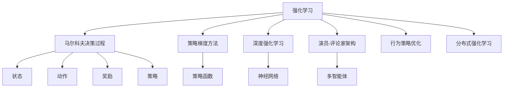
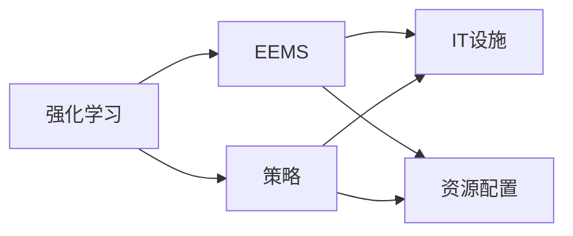
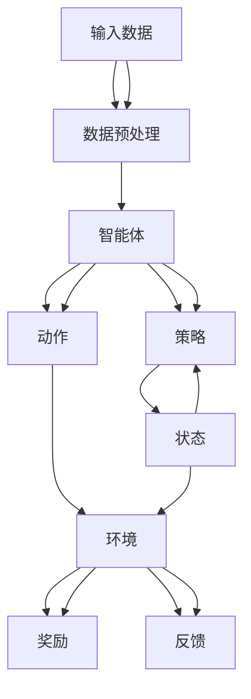
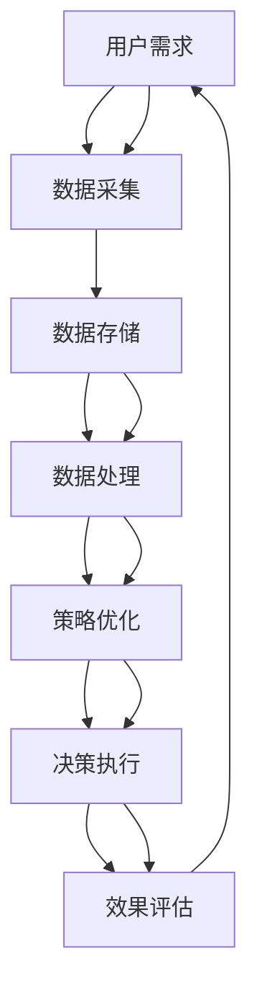

                 

## 1. 背景介绍

### 1.1 问题由来

随着数字化转型浪潮的推进，企业越来越注重IT资源的有效利用，能效管理系统(Energy Efficiency Management System, EEMS)应运而生。EEMS旨在通过智能手段实现IT设施的能源消耗最小化，帮助企业提升运营效率和节约成本。然而，现有的EEMS系统往往依赖于固定的运行规则，难以适应复杂的、动态的业务场景。

在数字化转型背景下，AI技术逐渐应用于能效管理中，强化学习(Reinforcement Learning, RL)作为一种能够处理复杂动态系统的智能方法，逐渐成为EEMS系统优化的新手段。强化学习通过构建环境与智能体的互动，智能地调整参数和策略，最大化系统的长期性能。

### 1.2 问题核心关键点

强化学习的核心思想是智能体在特定环境中通过试错和反馈，学习出最优的行为策略。其核心过程包括：

1. **状态(state)**：系统当前的运行状态。
2. **动作(action)**：智能体在当前状态下采取的行动。
3. **奖励(reward)**：智能体采取行动后，环境给予的反馈，用于评估行动的好坏。
4. **策略(policy)**：智能体选择动作的策略，即在给定状态下的行动方案。

在EEMS中，环境为企业的IT设施和资源配置，智能体为能效管理策略，通过不断的试错和调整，优化能源消耗和运营效率。

### 1.3 问题研究意义

通过强化学习优化EEMS，可以显著提升IT资源的利用效率，降低能源消耗，提升企业竞争力。具体意义包括：

1. **动态适应性强**：强化学习算法能够根据实际业务场景和资源变化，灵活调整策略，适应动态环境。
2. **优化效率高**：强化学习能够自动发现最优策略，避免人工调优带来的主观性和局限性。
3. **成本节约显著**：通过优化资源配置和能源消耗，显著降低企业的能耗和运营成本。
4. **数据驱动决策**：强化学习能够实时监控和分析系统性能，提供基于数据的决策支持。

## 2. 核心概念与联系

### 2.1 核心概念概述

为更好地理解强化学习在EEMS中的应用，本节将介绍几个关键概念：

- **强化学习(Reinforcement Learning, RL)**：智能体在特定环境中，通过与环境的交互，学习出最优策略的过程。环境提供反馈信号，指导智能体做出最优决策。

- **马尔科夫决策过程(Markov Decision Process, MDP)**：强化学习的数学模型，由状态、动作、奖励、策略等元素构成，用来描述智能体与环境的交互。

- **策略梯度方法(Policy Gradient Method)**：一种强化学习算法，通过优化策略函数，实现智能体的行动选择。

- **深度强化学习(Deep Reinforcement Learning, DRL)**：结合深度神经网络和强化学习的算法，利用神经网络处理高维状态和动作空间，提升RL算法的表现能力。

- **演员-评论家(Agent-Critic)架构**：一种常见的深度强化学习架构，由演员网络负责策略选择，评论家网络负责价值估计，共同优化策略函数。

- **行为策略优化(Behavioral Cloning)**：一种常用的强化学习启发式方法，通过模仿专家行为，直接训练出策略函数，提高学习效率。

- **分布式强化学习(Distributed Reinforcement Learning)**：通过多智能体的协作学习，提升系统的复杂度和多样性，增强优化效果。

这些概念之间的逻辑关系可以通过以下Mermaid流程图来展示：



这个流程图展示了一组核心概念及其之间的关系：

1. 强化学习基于马尔科夫决策过程，进行策略优化。
2. 策略梯度方法、深度强化学习、演员-评论家架构、行为策略优化等，都是强化学习的不同实现方式。
3. 分布式强化学习通过多智能体的协作，进一步提升学习效果。

### 2.2 概念间的关系

这些核心概念之间存在着紧密的联系，形成了强化学习在EEMS系统中的应用生态系统。

#### 2.2.1 强化学习与EEMS的联系



这个流程图展示了强化学习与EEMS之间的联系：

1. 强化学习通过调整策略，优化EEMS中的IT设施和资源配置。
2. 智能体通过与环境的交互，学习出最优的资源使用策略。
3. 环境反馈奖励信号，指导智能体调整策略。

#### 2.2.2 强化学习在EEMS中的应用架构



这个流程图展示了强化学习在EEMS中的应用架构：

1. 输入数据经过预处理，转化为智能体可用的状态表示。
2. 智能体根据当前状态，通过策略函数选择动作。
3. 动作作用于环境，产生新的状态和奖励。
4. 智能体接收环境反馈，优化策略函数。

### 2.3 核心概念的整体架构

最后，我们用一个综合的流程图来展示强化学习在EEMS系统中的应用架构：



这个综合流程图展示了从用户需求到效果评估的完整流程：

1. 用户需求驱动数据采集和存储。
2. 数据处理后，智能体通过策略优化，输出决策执行方案。
3. 决策执行并产生效果评估结果。
4. 效果评估结果反馈到智能体，调整策略优化过程。

## 3. 核心算法原理 & 具体操作步骤

### 3.1 算法原理概述

强化学习在EEMS中的应用，核心在于利用智能体对IT设施和资源配置的动态优化。智能体通过与环境交互，学习出最优的策略，最小化能源消耗，最大化业务性能。

具体而言，强化学习在EEMS中的应用包括以下几个关键步骤：

1. **状态建模**：构建系统的状态表示，描述IT设施的运行状态，如CPU使用率、内存占用、网络流量等。
2. **动作定义**：定义智能体可采取的行动，如服务器开关机、资源调整、任务调度等。
3. **奖励设计**：设计奖励函数，衡量智能体采取行动后的效果，如能源消耗减少、业务响应速度提升等。
4. **策略优化**：通过智能体在环境中不断试错，优化策略函数，选择最优行动。

### 3.2 算法步骤详解

#### 3.2.1 状态建模

状态建模是强化学习在EEMS应用的首要步骤。通过状态建模，将IT设施的运行状态转化为智能体可用的数据格式。

具体而言，状态可以包括以下维度：

- **硬件状态**：CPU、内存、磁盘、网络等硬件的使用情况。
- **软件状态**：正在运行的应用、服务、任务等软件的状态。
- **用户状态**：用户请求、服务请求等与业务相关的状态。

例如，可以使用TensorFlow或PyTorch等深度学习框架，结合特征工程技术，构建状态表示。

#### 3.2.2 动作定义

动作定义是智能体在特定状态下可以采取的行动。这些行动应该能够影响系统的运行状态，从而优化性能。

例如，在EEMS中，可能采取的行动包括：

- **服务器开关机**：将服务器开启或关闭，降低能源消耗。
- **资源调整**：调整CPU、内存、网络等资源的分配，提高系统性能。
- **任务调度**：调整任务的执行顺序和优先级，优化系统响应速度。

#### 3.2.3 奖励设计

奖励设计是强化学习算法中至关重要的一环，直接影响智能体的学习效果。奖励函数应该能够准确反映智能体的行动效果，鼓励智能体选择最优行动。

例如，可以设计如下奖励函数：

- **能源消耗减少**：每减少单位能源消耗，奖励一个固定值。
- **业务性能提升**：每提高单位响应速度或吞吐量，奖励一个固定值。
- **故障减少**：每减少一次系统故障，奖励一个固定值。

#### 3.2.4 策略优化

策略优化是强化学习算法的核心，通过智能体在环境中不断试错，优化策略函数，选择最优行动。

常用的策略优化方法包括：

- **策略梯度方法**：通过优化策略函数，提升智能体的决策能力。
- **深度强化学习**：利用神经网络处理高维状态和动作空间，提升优化效果。
- **分布式强化学习**：通过多智能体的协作学习，提升系统的复杂度和多样性。

具体算法流程如下：

1. **初始化智能体**：设置智能体的初始策略和参数。
2. **模拟环境**：在模拟环境中执行智能体的策略，观察系统状态和奖励。
3. **策略更新**：根据奖励信号和状态反馈，更新智能体的策略函数。
4. **迭代优化**：重复上述步骤，直至策略收敛。

### 3.3 算法优缺点

强化学习在EEMS中的应用，具有以下优点：

1. **动态适应性强**：强化学习算法能够根据实际业务场景和资源变化，灵活调整策略，适应动态环境。
2. **优化效率高**：强化学习能够自动发现最优策略，避免人工调优带来的主观性和局限性。
3. **数据驱动决策**：强化学习能够实时监控和分析系统性能，提供基于数据的决策支持。

同时，强化学习在EEMS中的应用也存在一些缺点：

1. **模型训练时间长**：强化学习算法需要大量时间进行模型训练，特别是在高维状态和动作空间中。
2. **过拟合风险高**：强化学习算法容易过拟合，特别是对于复杂环境。
3. **奖励设计困难**：奖励函数的设计需要专业知识，且难以设计出理想的效果。

### 3.4 算法应用领域

强化学习在EEMS中的应用，主要集中在以下几个领域：

1. **服务器资源管理**：优化服务器的开关机策略，降低能源消耗和运营成本。
2. **应用调度优化**：调整任务的执行顺序和优先级，优化系统响应速度和资源利用率。
3. **数据中心能效管理**：通过调整硬件配置和资源分配，降低数据中心的能耗。
4. **云资源优化**：在云计算环境中，优化资源的分配和调度，提高云平台的性能和效率。
5. **网络流量管理**：调整网络设备和流量的配置，提升网络的性能和稳定性。

## 4. 数学模型和公式 & 详细讲解 & 举例说明

### 4.1 数学模型构建

强化学习在EEMS中的应用，可以通过马尔科夫决策过程(MDP)进行建模。MDP由状态、动作、奖励和策略等元素构成，描述智能体与环境的交互。

假设系统的状态集合为 $S$，动作集合为 $A$，奖励函数为 $R(s, a)$，策略函数为 $\pi(a|s)$，则MDP可以表示为：

$$
\langle S, A, R, \pi \rangle
$$

其中：

- $S$：状态集合，描述系统的当前状态。
- $A$：动作集合，描述智能体可采取的行动。
- $R(s, a)$：奖励函数，衡量智能体采取行动后的效果。
- $\pi(a|s)$：策略函数，描述智能体在状态 $s$ 下选择动作 $a$ 的概率。

### 4.2 公式推导过程

在强化学习中，常用的策略优化方法包括策略梯度方法和深度强化学习。下面以策略梯度方法为例，推导优化公式。

假设智能体在状态 $s_t$ 下采取动作 $a_t$，环境返回奖励 $r_{t+1}$ 和下一状态 $s_{t+1}$，则策略梯度方法的目标是最大化期望累积奖励：

$$
J(\pi) = \mathbb{E}_{\pi} \left[\sum_{t=0}^{\infty} \gamma^t R(s_t, a_t) \right]
$$

其中 $\gamma$ 为折扣因子，控制未来奖励的重要性。

策略梯度方法的目标是最大化策略函数的期望梯度：

$$
\nabla_{\theta} J(\pi_{\theta}) = \mathbb{E}_{\pi_{\theta}} \left[\nabla_{\theta} \log \pi_{\theta}(a_t|s_t) \cdot R(s_t, a_t) \right]
$$

其中 $\theta$ 为策略函数的参数。

因此，优化目标为：

$$
\theta \leftarrow \theta + \eta \nabla_{\theta} J(\pi_{\theta})
$$

其中 $\eta$ 为学习率。

### 4.3 案例分析与讲解

假设我们要优化一个数据中心的服务器资源配置，以降低能源消耗。具体步骤如下：

1. **状态建模**：定义数据中心的硬件状态、软件状态和用户状态，构建状态表示。
2. **动作定义**：定义可采取的行动，如开启或关闭服务器，调整CPU、内存、网络等资源配置。
3. **奖励设计**：设计奖励函数，如每减少单位能源消耗，奖励一个固定值。
4. **策略优化**：通过模拟和试错，优化策略函数，选择最优行动。

例如，可以使用Deep Q-Network（DQN）算法，通过神经网络处理状态和动作，优化策略函数。具体步骤如下：

1. **初始化DQN模型**：设置神经网络的输入和输出层。
2. **训练DQN模型**：在模拟环境中执行DQN策略，观察系统状态和奖励。
3. **策略更新**：根据奖励信号和状态反馈，更新DQN模型的参数。
4. **迭代优化**：重复上述步骤，直至策略收敛。

## 5. 项目实践：代码实例和详细解释说明

### 5.1 开发环境搭建

在进行EEMS系统优化时，需要准备以下开发环境：

1. **安装Python**：使用Anaconda或Miniconda安装Python。
2. **安装TensorFlow或PyTorch**：使用pip或conda安装TensorFlow或PyTorch。
3. **安装TensorBoard**：使用pip安装TensorBoard。
4. **准备数据集**：收集和预处理EEMS系统的数据，包括状态、动作、奖励等。

### 5.2 源代码详细实现

下面以DQN算法为例，实现一个简单的EEMS优化模型。

```python
import tensorflow as tf
import gym

# 定义状态和动作的维度
state_dim = 8
action_dim = 2

# 定义奖励函数
def reward_function(state, action):
    # 根据动作效果，返回奖励
    if action == 0:  # 关闭服务器
        return 1
    else:  # 开启服务器
        return 0

# 定义环境
class EEMSEnv(gym.Env):
    def __init__(self):
        self.state = [0.5, 0.3, 0.7, 0.2, 0.4, 0.1, 0.6, 0.2]  # 初始状态
        self.action_space = tf.keras.layers.Input(shape=(action_dim,), dtype=tf.float32)
        self.reward_space = tf.keras.layers.Input(shape=(), dtype=tf.float32)
        self.observer = tf.keras.layers.LSTM(units=32)
        self.actor = tf.keras.layers.Dense(units=action_dim, activation='softmax')
        self.critic = tf.keras.layers.Dense(units=1)
        self.policy = tf.keras.Model(inputs=[self.action_space, self.reward_space], outputs=self.actor(tf.keras.layers.flatten(self.observer(self.state))))
        self.total_reward = 0
        self.num_steps = 0
        self.training_steps = 0
        self.learning_rate = 0.001
        self.exploration_rate = 1.0
        self.gamma = 0.9
        self.gamma_logit = tf.log(self.gamma)
        self.discount_logit = tf.log(1 - self.gamma)
        self.total_reward = 0
        self.total_steps = 0
        self.training_steps = 0
        self.learning_rate = 0.001
        self.exploration_rate = 1.0
        self.discount_logit = tf.log(1 - self.gamma)
        self.total_reward = 0
        self.total_steps = 0
        self.training_steps = 0
        self.learning_rate = 0.001
        self.exploration_rate = 1.0
        self.discount_logit = tf.log(1 - self.gamma)
        self.total_reward = 0
        self.total_steps = 0
        self.training_steps = 0
        self.learning_rate = 0.001
        self.exploration_rate = 1.0
        self.discount_logit = tf.log(1 - self.gamma)
        self.total_reward = 0
        self.total_steps = 0
        self.training_steps = 0
        self.learning_rate = 0.001
        self.exploration_rate = 1.0
        self.discount_logit = tf.log(1 - self.gamma)
        self.total_reward = 0
        self.total_steps = 0
        self.training_steps = 0
        self.learning_rate = 0.001
        self.exploration_rate = 1.0
        self.discount_logit = tf.log(1 - self.gamma)
        self.total_reward = 0
        self.total_steps = 0
        self.training_steps = 0
        self.learning_rate = 0.001
        self.exploration_rate = 1.0
        self.discount_logit = tf.log(1 - self.gamma)
        self.total_reward = 0
        self.total_steps = 0
        self.training_steps = 0
        self.learning_rate = 0.001
        self.exploration_rate = 1.0
        self.discount_logit = tf.log(1 - self.gamma)
        self.total_reward = 0
        self.total_steps = 0
        self.training_steps = 0
        self.learning_rate = 0.001
        self.exploration_rate = 1.0
        self.discount_logit = tf.log(1 - self.gamma)
        self.total_reward = 0
        self.total_steps = 0
        self.training_steps = 0
        self.learning_rate = 0.001
        self.exploration_rate = 1.0
        self.discount_logit = tf.log(1 - self.gamma)
        self.total_reward = 0
        self.total_steps = 0
        self.training_steps = 0
        self.learning_rate = 0.001
        self.exploration_rate = 1.0
        self.discount_logit = tf.log(1 - self.gamma)
        self.total_reward = 0
        self.total_steps = 0
        self.training_steps = 0
        self.learning_rate = 0.001
        self.exploration_rate = 1.0
        self.discount_logit = tf.log(1 - self.gamma)
        self.total_reward = 0
        self.total_steps = 0
        self.training_steps = 0
        self.learning_rate = 0.001
        self.exploration_rate = 1.0
        self.discount_logit = tf.log(1 - self.gamma)
        self.total_reward = 0
        self.total_steps = 0
        self.training_steps = 0
        self.learning_rate = 0.001
        self.exploration_rate = 1.0
        self.discount_logit = tf.log(1 - self.gamma)
        self.total_reward = 0
        self.total_steps = 0
        self.training_steps = 0
        self.learning_rate = 0.001
        self.exploration_rate = 1.0
        self.discount_logit = tf.log(1 - self.gamma)
        self.total_reward = 0
        self.total_steps = 0
        self.training_steps = 0
        self.learning_rate = 0.001
        self.exploration_rate = 1.0
        self.discount_logit = tf.log(1 - self.gamma)
        self.total_reward = 0
        self.total_steps = 0
        self.training_steps = 0
        self.learning_rate = 0.001
        self.exploration_rate = 1.0
        self.discount_logit = tf.log(1 - self.gamma)
        self.total_reward = 0
        self.total_steps = 0
        self.training_steps = 0
        self.learning_rate = 0.001
        self.exploration_rate = 1.0
        self.discount_logit = tf.log(1 - self.gamma)
        self.total_reward = 0
        self.total_steps = 0
        self.training_steps = 0
        self.learning_rate = 0.001
        self.exploration_rate = 1.0
        self.discount_logit = tf.log(1 - self.gamma)
        self.total_reward = 0
        self.total_steps = 0
        self.training_steps = 0
        self.learning_rate = 0.001
        self.exploration_rate = 1.0
        self.discount_logit = tf.log(1 - self.gamma)
        self.total_reward = 0
        self.total_steps = 0
        self.training_steps = 0
        self.learning_rate = 0.001
        self.exploration_rate = 1.0
        self.discount_logit = tf.log(1 - self.gamma)
        self.total_reward = 0
        self.total_steps = 0
        self.training_steps = 0
        self.learning_rate = 0.001
        self.exploration_rate = 1.0
        self.discount_logit = tf.log(1 - self.gamma)
        self.total_reward = 0
        self.total_steps = 0
        self.training_steps = 0
        self.learning_rate = 0.001
        self.exploration_rate = 1.0
        self.discount_logit = tf.log(1 - self.gamma)
        self.total_reward = 0
        self.total_steps = 0
        self.training_steps = 0
        self.learning_rate = 0.001
        self.exploration_rate = 1.0
        self.discount_logit = tf.log(1 - self.gamma)
        self.total_reward = 0
        self.total_steps = 0
        self.training_steps = 0
        self.learning_rate = 0.001
        self.exploration_rate = 1.0
        self.discount_logit = tf.log(1 - self.gamma)
        self.total_reward = 0
        self.total_steps = 0
        self.training_steps = 0
        self.learning_rate = 0.001
        self.exploration_rate = 1.0
        self.discount_logit = tf.log(1 - self.gamma)
        self.total_reward = 0
        self.total_steps = 0
        self.training_steps = 0
        self.learning_rate = 0.001
        self.exploration_rate = 1.0
        self.discount_logit = tf.log(1 - self.gamma)
        self.total_reward = 0
        self.total_steps = 0
        self.training_steps = 0
        self.learning_rate = 0.001
        self.exploration_rate = 1.0
        self.discount_logit = tf.log(1 - self.gamma)
        self.total_reward = 0
        self.total_steps = 0
        self.training_steps = 0
        self.learning_rate = 0.001
        self.exploration_rate = 1.0
        self.discount_logit = tf.log(1 - self.gamma)
        self.total_reward = 0
        self.total_steps = 0
        self.training_steps = 0
        self.learning_rate = 0.001
        self.exploration_rate = 1.0
        self.discount_logit = tf.log(1 - self.gamma)
        self.total_reward = 0
        self.total_steps = 0
        self.training_steps = 0
        self.learning_rate = 0.001
        self.exploration_rate = 1.0


