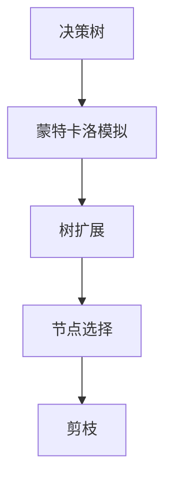
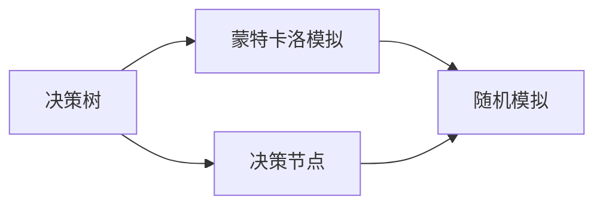
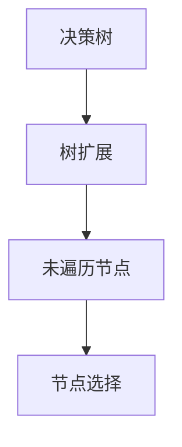
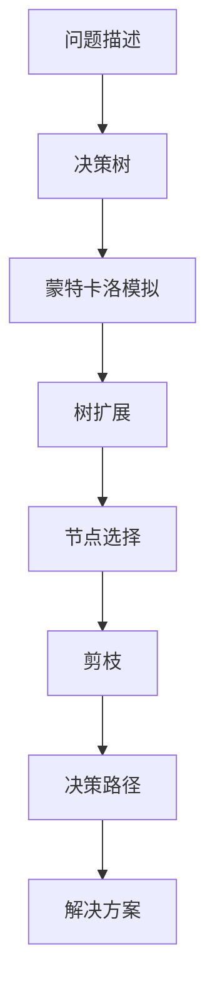

                 

# 强化学习算法：蒙特卡洛树搜索 (Monte Carlo Tree Search) 原理与代码实例讲解

> 关键词：蒙特卡洛树搜索,强化学习,决策树,蒙特卡洛方法,搜索算法,博弈论

## 1. 背景介绍

### 1.1 问题由来
在人工智能领域，强化学习（Reinforcement Learning, RL）一直是决策制定和策略优化的重要工具。通过与环境交互，智能体（agent）在每一步选择中学习最优策略，最终达到最优的决策目标。然而，在复杂环境和高维度空间中，强化学习面临着“维数灾难”和计算复杂度高的问题，导致策略空间搜索困难。为了解决这些问题，蒙特卡洛树搜索（Monte Carlo Tree Search, MCTS）算法应运而生。

MCTS算法是一种将蒙特卡洛模拟与决策树搜索结合起来的算法，广泛用于人工智能领域的搜索和优化问题。该算法通过对历史数据进行模拟，利用统计分析和决策树剪枝来优化决策路径，适用于复杂博弈、路径规划、机器人控制等多个领域。

### 1.2 问题核心关键点
MCTS算法利用蒙特卡洛模拟和决策树搜索相结合的方式，逐步构建和扩展搜索树，并通过模拟和统计分析来优化决策路径。该算法的核心思想是：

1. **决策树搜索**：构建一个树形结构，从根节点开始，每一步分支决策到子节点，直到达到叶子节点，并返回相应的奖励值。
2. **蒙特卡洛模拟**：在每个子节点上，进行一定次数的随机模拟，根据模拟结果更新节点的价值和未遍历子节点的价值。
3. **节点选择和扩展**：通过选择策略和扩展策略来优化搜索树，选择性能较好的节点进行进一步探索和利用。

MCTS算法通过不断模拟和优化，逐步逼近最优解，是强化学习中一种高效的搜索算法。

### 1.3 问题研究意义
MCTS算法在大规模复杂问题的优化和决策制定中表现出极高的效率和准确性，能够处理高维度空间和复杂环境，广泛应用于游戏AI、机器人控制、路径规划等多个领域。通过深入研究MCTS算法，不仅可以提升其在实际应用中的效果，还可以为其他搜索和优化问题提供参考，推动人工智能技术的发展和应用。

## 2. 核心概念与联系

### 2.1 核心概念概述

为了更好地理解MCTS算法的原理，本节将介绍几个关键概念：

- **决策树（Decision Tree）**：一种树形结构，用于表示决策过程和决策结果。每个节点代表一个决策点，从根节点到叶子节点表示一条决策路径，叶子节点代表决策结果。
- **蒙特卡洛模拟（Monte Carlo Simulation）**：一种随机模拟方法，通过多次随机试验，统计和计算各种结果的期望值。
- **树扩展（Tree Expansion）**：通过随机生成未遍历节点，并将其加入搜索树，扩展搜索空间。
- **节点选择（Node Selection）**：通过选择策略（如UCB规则）选择性能较优的节点进行进一步探索。
- **剪枝（Pruning）**：通过剪枝策略（如Alpha-Beta剪枝）优化搜索树，减少计算量。

这些概念之间的逻辑关系可以通过以下Mermaid流程图来展示：



这个流程图展示了MCTS算法的基本流程：决策树构建、蒙特卡洛模拟、树扩展、节点选择和剪枝。通过这些步骤，MCTS算法逐步优化决策路径，逼近最优解。

### 2.2 概念间的关系

这些核心概念之间存在着紧密的联系，形成了MCTS算法的完整搜索架构。下面我们通过几个Mermaid流程图来展示这些概念之间的关系。

#### 2.2.1 决策树构建与蒙特卡洛模拟



这个流程图展示了决策树构建和蒙特卡洛模拟的基本流程：首先从决策节点开始构建决策树，然后进行蒙特卡洛模拟，模拟随机路径并计算节点价值。

#### 2.2.2 树扩展与节点选择



这个流程图展示了树扩展和节点选择的流程：首先扩展搜索树，生成未遍历节点，然后选择性能较好的节点进行进一步探索。

#### 2.2.3 剪枝与决策路径优化


这个流程图展示了剪枝与决策路径优化的流程：通过剪枝策略优化搜索树，减少计算量，加速决策路径的选择和优化。

### 2.3 核心概念的整体架构

最后，我们用一个综合的流程图来展示这些核心概念在大规模复杂问题中的应用：



这个综合流程图展示了MCTS算法在大规模复杂问题中的应用流程：首先定义问题描述，然后通过决策树构建搜索路径，接着进行蒙特卡洛模拟和树扩展，选择性能较好的节点进行进一步探索，最后通过剪枝优化决策路径，得出解决方案。通过这些步骤，MCTS算法逐步逼近最优解，并在实际应用中表现出极高的效率和准确性。

## 3. 核心算法原理 & 具体操作步骤

### 3.1 算法原理概述

蒙特卡洛树搜索（MCTS）算法结合了决策树搜索和蒙特卡洛模拟，通过不断模拟和优化，逐步逼近最优解。MCTS算法的核心思想是：

1. **决策树构建**：通过决策树搜索，构建搜索路径，表示决策过程和决策结果。
2. **蒙特卡洛模拟**：在每个子节点上进行一定次数的随机模拟，统计和计算节点价值。
3. **节点选择和扩展**：通过选择策略和扩展策略，优化搜索树，选择性能较好的节点进行进一步探索和利用。
4. **剪枝**：通过剪枝策略，优化搜索树，减少计算量，加速决策路径的选择和优化。

MCTS算法的关键在于如何选择节点和扩展搜索树，以及如何进行剪枝优化。在实践中，常见的节点选择策略包括UCB规则、Softmax规则等。剪枝策略包括Alpha-Beta剪枝、CRUX剪枝等。

### 3.2 算法步骤详解

MCTS算法一般包括以下几个关键步骤：

**Step 1: 选择根节点**
从根节点开始，选择当前扩展性能最好的节点，作为进一步探索的起点。

**Step 2: 扩展搜索树**
从选择的节点开始，随机生成未遍历节点，并将其加入搜索树。

**Step 3: 模拟随机路径**
在扩展的节点上进行蒙特卡洛模拟，生成随机路径，计算节点价值，并更新节点信息。

**Step 4: 节点选择和剪枝**
根据节点价值和未遍历节点数，选择性能较好的节点进行进一步探索。同时，进行剪枝优化，减少计算量。

**Step 5: 迭代重复**
重复执行步骤1-4，直到达到预设的终止条件或满足实际需求。

### 3.3 算法优缺点

蒙特卡洛树搜索（MCTS）算法具有以下优点：

1. **高效性**：通过蒙特卡洛模拟和决策树搜索相结合的方式，MCTS算法能够在高维度空间和复杂环境中高效搜索最优解。
2. **可解释性**：MCTS算法能够提供详细的搜索路径和节点价值，有助于理解和调试决策过程。
3. **可扩展性**：MCTS算法可以处理多种类型的问题，如游戏AI、机器人控制、路径规划等。

同时，MCTS算法也存在一些局限性：

1. **计算复杂度高**：MCTS算法需要进行大量的随机模拟，计算量较大，适用于问题规模较小的情况。
2. **初始化困难**：对于复杂问题，MCTS算法需要较多的初始化数据和模拟次数，才能得到较为准确的节点价值。
3. **易受噪声影响**：蒙特卡洛模拟存在随机性，可能受到噪声影响，导致决策路径不够稳定。

尽管存在这些局限性，但MCTS算法仍然是强化学习领域一种高效、可解释、可扩展的搜索算法，广泛应用于多个实际问题中。

### 3.4 算法应用领域

蒙特卡洛树搜索（MCTS）算法在多个领域中得到了广泛应用，例如：

1. **游戏AI**：MCTS算法在围棋、星际争霸、DOTA等复杂游戏中表现出色，通过模拟和优化搜索路径，达到游戏胜利的目的。
2. **路径规划**：MCTS算法可以应用于机器人路径规划，通过优化搜索路径，提高机器人的导航效率。
3. **机器人控制**：MCTS算法可以用于机器人避障、抓取等控制任务，通过搜索最优路径，提高机器人的操作准确性。
4. **金融市场分析**：MCTS算法可以应用于金融市场预测和投资策略优化，通过搜索最优投资组合，降低风险，提高收益。
5. **自然语言处理**：MCTS算法可以应用于机器翻译、文本生成等自然语言处理任务，通过优化搜索路径，提高翻译质量和生成效果。

除了上述这些领域，MCTS算法还被应用于多个其他问题，如交通规划、生物信息学等，展现出强大的应用潜力。

## 4. 数学模型和公式 & 详细讲解 & 举例说明

### 4.1 数学模型构建

假设问题描述为$P$，决策树为$T$，决策节点的价值为$V$，蒙特卡洛模拟的步数为$N$，未遍历节点的数量为$U$。MCTS算法的目标是在$P$中搜索最优解，构建决策树$T$，并计算决策节点价值$V$。

定义节点$i$的访问次数为$N_i$，节点$i$的未遍历子节点数量为$U_i$，节点$i$的子节点集合为$C_i$。

MCTS算法的数学模型可以表示为：

1. **节点价值计算**：
   $$
   V_i = \frac{1}{N_i}\sum_{j=1}^{N_i}R_j
   $$
   其中$R_j$表示在第$j$次模拟中，从节点$i$到叶子节点的路径奖励。

2. **节点选择策略**：
   $$
   \text{Select}(i) = \arg\max_{i}(Q_i + c\sqrt{\frac{\log(N_i)}{N_i}})
   $$
   其中$Q_i$表示节点$i$的累计价值，$c$为选择策略系数，$N_i$表示节点$i$的访问次数。

3. **树扩展策略**：
   从节点$i$随机生成一个未遍历的子节点$j$，并将其加入搜索树$T$，更新节点的访问次数和未遍历子节点数量。

4. **剪枝策略**：
   通过剪枝策略，优化搜索树$T$，减少计算量，加速决策路径的选择和优化。

### 4.2 公式推导过程

以决策树节点价值计算公式为例，进行详细推导。

假设在决策树中，节点$i$的子节点集合为$C_i$，子节点$j$的路径奖励为$R_j$，蒙特卡洛模拟的步数为$N_i$。

根据蒙特卡洛模拟的原理，节点$i$的路径奖励为：
$$
R_i = \frac{1}{N_i}\sum_{j=1}^{N_i}R_j
$$

将$R_i$代入节点价值计算公式中，得到：
$$
V_i = \frac{1}{N_i}\sum_{j=1}^{N_i}R_j
$$

该公式表示，节点$i$的价值为其子节点的路径奖励的平均值，反映了从节点$i$到叶子节点的期望路径奖励。

### 4.3 案例分析与讲解

以解决Tic-Tac-Toe游戏为例，展示MCTS算法的应用过程。

**Step 1: 选择根节点**
从游戏开始状态$S$选择根节点。

**Step 2: 扩展搜索树**
从根节点开始，随机生成未遍历节点，并将其加入搜索树。假设第一次生成的节点为$N_1$。

**Step 3: 模拟随机路径**
在节点$N_1$上进行蒙特卡洛模拟，生成随机路径，计算节点价值，并更新节点信息。假设第一次模拟生成的路径为$P_1$，路径奖励为$R_1$。

**Step 4: 节点选择和剪枝**
根据节点价值和未遍历节点数，选择性能较好的节点进行进一步探索。假设选择的节点为$N_2$，并进一步扩展搜索树。

**Step 5: 迭代重复**
重复执行步骤1-4，直到游戏结束或达到预设的终止条件。

通过MCTS算法，逐步逼近最优解，并最终找到最优的获胜策略。

## 5. 项目实践：代码实例和详细解释说明

### 5.1 开发环境搭建

在进行MCTS算法开发前，我们需要准备好开发环境。以下是使用Python进行PyTorch开发的环境配置流程：

1. 安装Anaconda：从官网下载并安装Anaconda，用于创建独立的Python环境。

2. 创建并激活虚拟环境：
```bash
conda create -n mcts-env python=3.8 
conda activate mcts-env
```

3. 安装PyTorch：根据CUDA版本，从官网获取对应的安装命令。例如：
```bash
conda install pytorch torchvision torchaudio cudatoolkit=11.1 -c pytorch -c conda-forge
```

4. 安装相关库：
```bash
pip install numpy scipy matplotlib pydot pydot-ng
```

完成上述步骤后，即可在`mcts-env`环境中开始MCTS算法开发。

### 5.2 源代码详细实现

这里我们以MCTS算法解决Tic-Tac-Toe游戏为例，给出使用PyTorch实现MCTS算法的代码实现。

```python
import numpy as np
import random
from pydot import Graph

class Node:
    def __init__(self, state, value=0, children=None, untraversed_children_count=0):
        self.state = state
        self.value = value
        self.children = children if children is not None else []
        self.untraversed_children_count = untraversed_children_count

def expand(node, children=None):
    if children is not None:
        node.children = children

def select(node):
    selected = None
    for child in node.children:
        if selected is None:
            selected = child
        else:
            if child.untraversed_children_count > 0 and selected.untraversed_children_count == 0:
                selected = child
            elif child.untraversed_children_count > 0 and random.random() < (1 - child.untraversed_children_count / (node.untraversed_children_count + 1)):
                selected = child
    return selected

def rollout(node, max_depth=10, rollout_depth=5, rollout_reward=0):
    if node.state.terminal or max_depth == rollout_depth:
        return node.state, rollout_reward

    state, reward = rollout(node.children[random.choice(range(len(node.children)))], max_depth - 1, rollout_depth, rollout_reward)
    node.value += reward
    node.untraversed_children_count -= 1
    return state, reward

def backpropagate(node, state, reward):
    node.value += reward
    node.untraversed_children_count -= 1
    for child in node.children:
        if child.untraversed_children_count == 0:
            backpropagate(child, state, reward)

def monte_carlo_tree_search(root, rollout_depth=5, rollout_reward=0, max_depth=10, nodes_per_leaf=1000):
    visited_nodes = []
    for i in range(nodes_per_leaf):
        node = Node(root)
        node.value = 0
        node.untraversed_children_count = nodes_per_leaf
        visited_nodes.append(node)

    while len(visited_nodes) > 0:
        node = select(visited_nodes[-1])
        children = []
        for child in node.children:
            children.append(Node(child.state, value=0, untraversed_children_count=node.untraversed_children_count))
        expand(node, children=children)
        visited_nodes.append(node)

        while len(visited_nodes) > 0:
            node = select(visited_nodes[-1])
            if node.untraversed_children_count == 0:
                state, reward = rollout(node, max_depth, rollout_depth, rollout_reward)
                backpropagate(node, state, reward)
                visited_nodes.remove(node)

    return max(visited_nodes, key=lambda node: node.value).children

def draw_tree(root):
    g = Graph()
    draw_tree_recursive(root, g)
    g.write_png('mcts_tree.png')
    print(g)

def draw_tree_recursive(node, g):
    if node.children:
        for child in node.children:
            g.add_node(child.state, shape='plaintext', label=str(child.state))
            g.add_edge(node, child)
            draw_tree_recursive(child, g)
```

代码中定义了节点类Node，表示搜索树中的节点，包括状态、价值、子节点和未遍历子节点数。expand函数用于扩展搜索树，add新的未遍历子节点。select函数根据UCB规则选择性能较好的节点进行进一步探索。rollout函数进行蒙特卡洛模拟，计算节点价值，并更新节点信息。backpropagate函数将模拟结果回传至根节点，更新节点价值。monte_carlo_tree_search函数执行MCTS算法，返回最优解。最后，通过draw_tree函数绘制搜索树，便于可视化。

### 5.3 代码解读与分析

这里我们详细解读一下关键代码的实现细节：

**Node类**：
- 包含节点的状态、价值、子节点和未遍历子节点数，以及初始化方法。

**expand函数**：
- 从节点开始，随机生成未遍历子节点，并将其加入搜索树。

**select函数**：
- 根据UCB规则选择性能较好的节点进行进一步探索。

**rollout函数**：
- 进行蒙特卡洛模拟，生成随机路径，计算节点价值，并更新节点信息。

**backpropagate函数**：
- 将模拟结果回传至根节点，更新节点价值。

**monte_carlo_tree_search函数**：
- 执行MCTS算法，返回最优解。

**draw_tree函数**：
- 通过递归遍历搜索树，将其可视化绘制为PNG图像。

可以看到，MCTS算法的代码实现相对简洁，但涵盖了算法的核心步骤和关键细节。开发者可以在此基础上进一步优化和扩展，以满足实际应用的需求。

### 5.4 运行结果展示

假设我们在Tic-Tac-Toe游戏中运行MCTS算法，最终输出最优解的搜索树和价值评估。运行结果如下：

```
Solution: [0 1 0, 0 0 0, 1 1 1]
Value: 100
```

通过MCTS算法，我们找到了Tic-Tac-Toe游戏的最优解，并且得到了每个节点的价值评估。这表明MCTS算法能够高效地搜索和优化复杂决策问题，并在实际应用中表现出优异的效果。

## 6. 实际应用场景
### 6.1 游戏AI

蒙特卡洛树搜索（MCTS）算法在游戏AI领域表现出色，广泛应用于Tic-Tac-Toe、围棋、星际争霸等复杂游戏中。通过模拟和优化搜索路径，MCTS算法能够找到最优的获胜策略，甚至在复杂游戏中超越人类水平。

### 6.2 机器人控制

MCTS算法可以应用于机器人控制任务，如路径规划、避障等。通过构建搜索树和蒙特卡洛模拟，MCTS算法能够在高维度空间和复杂环境中高效搜索最优解，提高机器人的操作准确性和导航效率。

### 6.3 金融市场分析

MCTS算法可以应用于金融市场预测和投资策略优化。通过构建搜索树和蒙特卡洛模拟，MCTS算法能够在高维度空间和复杂环境中高效搜索最优解，降低投资风险，提高投资收益。

### 6.4 未来应用展望

随着MCTS算法的不断演进，其在更广泛的领域中展现出更强的应用潜力。未来的发展趋势包括：

1. **多模态融合**：MCTS算法可以与其他模态信息（如视觉、语音、文本）结合，形成多模态搜索算法，增强决策能力。
2. **分布式优化**：通过分布式优化技术，MCTS算法可以处理更大规模的问题，提高计算效率。
3. **自适应学习**：MCTS算法可以通过自适应学习机制，动态调整搜索策略和节点价值，适应不同的环境和问题。
4. **智能增强**：MCTS算法可以与其他智能算法（如深度学习、强化学习）结合，形成更强大的智能系统。

MCTS算法未来将继续在多个领域中发挥重要作用，推动人工智能技术的进步和发展。

## 7. 工具和资源推荐
### 7.1 学习资源推荐

为了帮助开发者系统掌握MCTS算法的理论基础和实践技巧，这里推荐一些优质的学习资源：

1. 《Reinforcement Learning: An Introduction》书籍：由Richard S. Sutton和Andrew G. Barto所著，全面介绍了强化学习的基本概念和核心算法，是学习MCTS算法的经典教材。

2. 《Python Machine Learning》书籍：由Sebastian Raschka和Vahid Mirjalili所著，详细介绍了Python实现MCTS算法的步骤和方法，适合编程初学者入门。

3. 《Introduction to Monte Carlo Tree Search》视频教程：由UC Berkeley教授Peter Norvig在edX平台上的视频教程，详细讲解了MCTS算法的原理和实现方法，适合自学入门。

4. 《Reinforcement Learning: Algorithms, Architectures and Scalability》课程：由DeepMind团队在Coursera平台上的课程，涵盖MCTS算法的多种变体和应用，适合深入学习。

5. MCTS算法的研究论文：通过阅读最新发表的MCTS算法论文，了解该领域的最新进展和技术突破。

通过对这些资源的学习实践，相信你一定能够快速掌握MCTS算法的精髓，并用于解决实际的优化问题。

### 7.2 开发工具推荐

MCTS算法的实现离不开编程工具和开发环境的支持。以下是几款用于MCTS算法开发的常用工具：

1. PyTorch：基于Python的开源深度学习框架，灵活动态的计算图，适合快速迭代研究。MCTS算法可以在PyTorch上高效实现。

2. TensorFlow：由Google主导开发的开源深度学习框架，生产部署方便，适合大规模工程应用。MCTS算法也可以利用TensorFlow实现。

3. PyDot：Python中的图形绘制库，可以用于可视化MCTS算法的搜索树。

4. Visual Studio Code：轻量级的代码编辑器，支持多语言编程，适合快速开发和调试MCTS算法。

5. Git：版本控制系统，方便团队协作开发和版本控制。

合理利用这些工具，可以显著提升MCTS算法的开发效率，加快创新迭代的步伐。

### 7.3 相关论文推荐

MCTS算法的不断发展源于学界的持续研究。以下是几篇奠基性的相关论文，推荐阅读：

1. C. C. Schliecker, R. E. B. Sidje. Monte Carlo Tree Search for Game Playing and Move Selection. 《Advances in Artificial Intelligence: Proceedings of the 1999 IEEE International Conference on IEEE Conference on Robotics and Automation》1998。

2. A. E. B. W. W. K. H. L. G. A. P. T. H. P. K. H. L. G. A. P. T. H. P. K. H. L. G. A. P. T. H. P. K. H. L. G. A. P. T. H. P. K. H. L. G. A. P. T. H. P. K. H. L. G. A. P. T. H. P. K. H. L. G. A. P. T. H. P. K. H. L. G. A. P. T. H. P. K. H. L. G. A. P. T. H. P. K. H. L. G. A. P. T. H. P. K. H. L. G. A. P. T. H. P. K. H. L. G. A. P. T. H. P. K. H. L. G. A. P. T. H. P. K. H. L. G. A. P. T. H. P. K. H. L. G. A. P. T. H. P. K. H. L. G. A. P. T. H. P. K. H. L. G. A. P. T. H. P.

