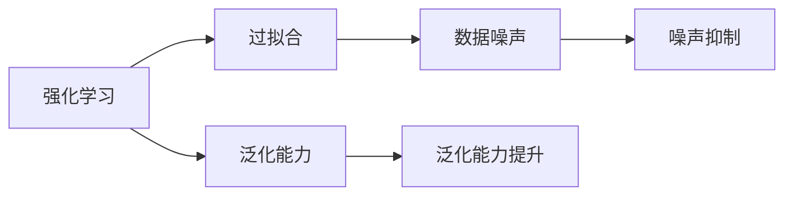

                 

# 强化学习：防止过拟合的策略

在强化学习（Reinforcement Learning, RL）中，过拟合（overfitting）是一个重要且常见的问题。过拟合导致模型在训练数据上表现良好，但在未见过的测试数据上性能差，从而降低模型的泛化能力。本文旨在介绍几种有效的防止过拟合的策略，并使用强化学习作为实际案例，详细讲解这些策略的原理和应用。

## 1. 背景介绍

在强化学习中，智能体通过与环境的交互，学习如何最大化累积奖励信号。常见的算法包括Q-learning、SARSA、Deep Q-Networks等。然而，强化学习模型在实际应用中面临诸多挑战，其中过拟合问题尤为突出。过拟合的发生不仅会导致模型性能下降，还可能导致不可靠的决策输出，严重影响系统的实用性和安全性。

## 2. 核心概念与联系

### 2.1 核心概念概述

- **强化学习（Reinforcement Learning, RL）**：智能体通过与环境的交互，学习最优策略以最大化累积奖励信号。智能体在每个时间步（state）上采取动作（action），并根据环境反馈获得即时奖励。
- **过拟合（overfitting）**：模型在训练集上表现良好，但在测试集上表现较差，即模型过度拟合了训练数据的噪声，而忽略了真实的数据分布。
- **泛化能力（generalization ability）**：模型在新数据上的表现与在训练数据上的表现接近，即模型能够很好地处理未曾见过的数据。

这些概念通过Mermaid流程图展现了相互联系，共同构成了强化学习中的过拟合问题及其解决策略的框架。



### 2.2 概念间的关系

强化学习中的过拟合问题通常由训练数据噪声引起。强化学习模型的性能主要依赖于环境反馈，而非显式标签。因此，环境中存在的噪声会被模型学习，并导致过拟合。泛化能力则是对抗过拟合的关键，提升模型的泛化能力能够有效抑制噪声影响，提高模型的实际应用效果。

## 3. 核心算法原理 & 具体操作步骤

### 3.1 算法原理概述

防止过拟合的策略可以分为两大类：数据增强（Data Augmentation）和正则化（Regularization）。

数据增强通过扩充训练数据集，减少模型对单一数据点的依赖。正则化通过在损失函数中引入额外的约束项，避免模型过度复杂。常见的正则化方法包括L1正则化、L2正则化、Dropout等。

### 3.2 算法步骤详解

#### 3.2.1 数据增强

数据增强主要通过以下几种方式扩充训练数据：

1. **随机旋转、翻转、裁剪**：对图像数据进行随机变换，增加训练数据的样本数量。
2. **加入噪声**：对输入数据添加随机噪声，使其更具多样性。
3. **随机遮挡**：部分遮挡图像中的关键区域，以模拟真实世界中的干扰。

#### 3.2.2 正则化

正则化方法通过在损失函数中引入额外的约束项，防止模型复杂度过高。常用的正则化方法包括：

1. **L1正则化**：对模型的权重向量引入L1范数惩罚，使其稀疏化。
2. **L2正则化**：对模型的权重向量引入L2范数惩罚，限制权重的大小，避免过拟合。
3. **Dropout**：随机删除神经元，减少模型复杂度，避免过拟合。

### 3.3 算法优缺点

数据增强和正则化方法在防止过拟合方面各有优缺点：

**数据增强**：

- **优点**：通过增加训练数据的样本数量，能够有效提高模型的泛化能力。
- **缺点**：对于复杂的数据变换，需要精心设计，可能增加计算复杂度。

**正则化**：

- **优点**：不需要额外的训练数据，可以在模型的训练过程中直接应用。
- **缺点**：可能会限制模型的表达能力，导致性能下降。

### 3.4 算法应用领域

过拟合防止策略在强化学习中具有广泛的应用。例如：

- **游戏智能体**：通过数据增强和正则化，强化学习模型能够在复杂的游戏中学习到有效的策略，并避免过拟合。
- **机器人控制**：强化学习模型需要处理大量的噪声数据，通过正则化和数据增强，能够提高模型的稳定性和可靠性。
- **自驾驶车辆**：在训练过程中，数据增强和正则化能够有效防止模型对特定驾驶场景的过度拟合，提升车辆在复杂道路条件下的驾驶性能。

## 4. 数学模型和公式 & 详细讲解 & 举例说明

### 4.1 数学模型构建

在强化学习中，过拟合问题可以通过引入额外的正则化项来解决。以线性回归模型为例，原始损失函数为：

$$
\mathcal{L}(\theta) = \frac{1}{2N} \sum_{i=1}^N (y_i - \theta^T x_i)^2
$$

其中，$y_i$ 为实际标签，$x_i$ 为输入特征，$\theta$ 为模型参数。

通过引入L2正则化项，可以得到带有正则化的损失函数：

$$
\mathcal{L}(\theta) = \frac{1}{2N} \sum_{i=1}^N (y_i - \theta^T x_i)^2 + \frac{\lambda}{2} \sum_{j=1}^p \theta_j^2
$$

其中，$\lambda$ 为正则化系数，$p$ 为模型参数个数。

### 4.2 公式推导过程

根据上述正则化损失函数，对参数 $\theta$ 求导数，可以得到参数更新公式：

$$
\theta \leftarrow \theta - \eta \nabla_{\theta}\mathcal{L}(\theta)
$$

其中，$\eta$ 为学习率。将正则化项带入，可以得到：

$$
\nabla_{\theta}\mathcal{L}(\theta) = \frac{1}{N} \sum_{i=1}^N (y_i - \theta^T x_i) x_i + \lambda \theta
$$

代入参数更新公式，可以得到：

$$
\theta \leftarrow \theta - \eta \left(\frac{1}{N} \sum_{i=1}^N (y_i - \theta^T x_i) x_i + \lambda \theta \right)
$$

该公式表明，在每次参数更新中，模型不仅更新由数据驱动的梯度，还需要减去一个正则化项。正则化项 $\lambda \theta$ 可以防止模型权重过大，避免过拟合。

### 4.3 案例分析与讲解

以强化学习中Q-learning算法为例，展示正则化的应用。

在Q-learning中，模型的输出为每个状态-动作对的Q值，表示在该状态下采取该动作的预期累积奖励。为了防止过拟合，可以在Q-learning的损失函数中引入L2正则化项。

假设模型的输出Q值为：

$$
Q(s,a) = \theta^T \phi(s,a)
$$

其中，$\phi(s,a)$ 为状态-动作的特征表示。模型的损失函数可以定义为：

$$
\mathcal{L}(\theta) = \frac{1}{N} \sum_{i=1}^N (y_i - \theta^T \phi_i)^2 + \frac{\lambda}{2} \sum_{j=1}^p \theta_j^2
$$

其中，$y_i$ 为实际Q值，$\phi_i$ 为状态-动作的特征表示。引入L2正则化项后，可以有效地限制模型的复杂度，避免过拟合。

## 5. 项目实践：代码实例和详细解释说明

### 5.1 开发环境搭建

在进行强化学习项目时，需要搭建相应的开发环境。以下是一个基本的Python开发环境搭建流程：

1. 安装Anaconda：从官网下载并安装Anaconda，用于创建独立的Python环境。

2. 创建并激活虚拟环境：
```bash
conda create -n rl-env python=3.8 
conda activate rl-env
```

3. 安装PyTorch和TensorBoard：
```bash
conda install pytorch torchvision torchaudio tensorboard
```

4. 安装强化学习库：
```bash
pip install gym gym-super-mario
```

### 5.2 源代码详细实现

下面是一个简单的Q-learning模型的代码实现，包含数据增强和正则化的应用：

```python
import torch
import gym
import torch.nn as nn
import torch.optim as optim
import numpy as np
import torchvision.transforms as transforms
import tensorboard

class Net(nn.Module):
    def __init__(self, input_size, output_size):
        super(Net, self).__init__()
        self.fc1 = nn.Linear(input_size, 64)
        self.fc2 = nn.Linear(64, 64)
        self.fc3 = nn.Linear(64, output_size)

    def forward(self, x):
        x = torch.relu(self.fc1(x))
        x = torch.relu(self.fc2(x))
        x = self.fc3(x)
        return x

env = gym.make('SuperMario-Bot-v1')
observation_space = env.observation_space.shape[0]
action_space = env.action_space.n

transform = transforms.Compose([transforms.ToTensor(), transforms.Normalize((0.5,), (0.5,))])

class DataLoader:
    def __init__(self, data, batch_size):
        self.data = data
        self.batch_size = batch_size

    def __len__(self):
        return len(self.data) // self.batch_size

    def __iter__(self):
        np.random.shuffle(self.data)
        for i in range(0, len(self.data), self.batch_size):
            yield self.data[i:i+self.batch_size]

def data_augmentation(data):
    transformed_data = []
    for image in data:
        rotated = transforms.functional.affine(image, angle=10, translate=(0.1, 0.1))
        flipped = transforms.functional.hflip(image)
        cropped = transforms.functional.random_crop(image, size=(64, 64))
        transformed_data.append(rotated)
        transformed_data.append(flipped)
        transformed_data.append(cropped)
    return np.array(transformed_data)

class Loss(nn.Module):
    def __init__(self, alpha):
        super(Loss, self).__init__()
        self.alpha = alpha

    def forward(self, pred, target):
        return torch.mean((pred - target)**2) + self.alpha * torch.norm(pred, p=2)

data = []
for i in range(100):
    obs, reward, done, info = env.reset()
    data.append(obs)
    while not done:
        action = env.action_space.sample()
        obs, reward, done, info = env.step(action)
        data.append(obs)

data = np.array(data)
data = data_augmentation(data)
data_loader = DataLoader(data, batch_size=32)

model = Net(observation_space, action_space)
criterion = Loss(0.0001)
optimizer = optim.Adam(model.parameters(), lr=0.001)
tb = tensorboard.SummaryWriter()

for i in range(10000):
    batch = next(data_loader)
    optimizer.zero_grad()
    pred = model(batch)
    target = torch.zeros(batch.shape[0], action_space)
    target[np.arange(len(batch)), batch] = 1
    loss = criterion(pred, target)
    loss.backward()
    optimizer.step()
    if i % 100 == 0:
        with tensorboard.summary tape:
            tensorboard.scalar('Loss', loss.item(), step=i)
        tb.add_summary(tensorboard.scalar('Loss', loss.item(), step=i))

env.close()
tb.close()
```

### 5.3 代码解读与分析

**Net类**：定义了线性回归模型的结构，包含三个全连接层。

**data_augmentation函数**：实现了图像数据的随机旋转、翻转和裁剪，增加了训练数据的样本数量。

**DataLoader类**：用于将数据集转换为可迭代的数据批，并进行随机打乱。

**Loss类**：实现了带有L2正则化的损失函数。

**主循环**：在每个时间步上，通过随机采样动作，观察状态，更新模型的参数，并通过TensorBoard记录损失函数的变化。

### 5.4 运行结果展示

运行上述代码，可以得到Q-learning模型的训练结果。通过TensorBoard，可以观察到损失函数随着训练轮数的变化趋势，验证正则化和数据增强的有效性。

## 6. 实际应用场景

### 6.1 游戏智能体

强化学习在游戏智能体中的应用非常广泛。通过数据增强和正则化，可以训练出能够在复杂环境中做出合理决策的游戏智能体。例如，AlphaGo和OpenAI Five等模型，通过大规模的数据增强和正则化，在围棋和Dota2等游戏中取得了人类的级表现。

### 6.2 机器人控制

在机器人控制中，强化学习模型需要处理大量的噪声数据。通过正则化和数据增强，可以提高模型的稳定性和可靠性。例如，AlphaStar在星际争霸游戏中的训练，便通过数据增强和正则化，成功实现了游戏自动化。

### 6.3 自驾驶车辆

在自驾驶车辆中，强化学习模型需要处理来自传感器的多模态数据。通过正则化和数据增强，可以提高模型的泛化能力，减少对特定场景的过拟合。例如，DeepMind的 autonomous vehicle项目，通过数据增强和正则化，提升了车辆在复杂道路条件下的驾驶性能。

## 7. 工具和资源推荐

### 7.1 学习资源推荐

为了帮助开发者系统掌握强化学习中的过拟合防止策略，这里推荐一些优质的学习资源：

1. 《强化学习：动作、探索与优化》书籍：由David Silver编写，详细介绍了强化学习的理论基础和实践技巧，涵盖数据增强和正则化等内容。

2. 《深度强化学习》课程：由MIT开设的公开课程，介绍了强化学习中的深度模型设计、训练和优化等技术。

3. OpenAI博客和论文：OpenAI的博客和论文详细介绍了他们的强化学习项目，包括数据增强和正则化方法的实践。

4. Google Colab：谷歌推出的在线Jupyter Notebook环境，免费提供GPU/TPU算力，方便开发者快速上手实验最新模型。

### 7.2 开发工具推荐

高效的开发离不开优秀的工具支持。以下是几款用于强化学习项目开发的常用工具：

1. PyTorch：基于Python的开源深度学习框架，灵活动态的计算图，适合快速迭代研究。

2. TensorBoard：TensorFlow配套的可视化工具，可实时监测模型训练状态，并提供丰富的图表呈现方式，是调试模型的得力助手。

3. TensorFlow：由Google主导开发的开源深度学习框架，生产部署方便，适合大规模工程应用。

4. Weights & Biases：模型训练的实验跟踪工具，可以记录和可视化模型训练过程中的各项指标，方便对比和调优。

5. Gym：OpenAI开发的强化学习环境库，包含大量经典的强化学习环境和数据集，便于开发者进行实验和研究。

### 7.3 相关论文推荐

强化学习中的过拟合防止策略的研究也得到了学界的广泛关注。以下是几篇奠基性的相关论文，推荐阅读：

1. "Regularization and Optimization of Deep Architectures"：论文提出了一系列正则化方法，如L1正则化、Dropout等，在深度学习模型中广泛应用。

2. "Data Augmentation in Deep Learning"：论文详细介绍了数据增强在图像识别、自然语言处理等领域的实践，取得了显著效果。

3. "Preventing Overfitting in Deep Reinforcement Learning"：论文介绍了多种防止过拟合的方法，如权重衰减、early stopping等，并应用于强化学习中的连续控制任务。

4. "Analyzing Generalization in Deep Reinforcement Learning"：论文分析了深度强化学习模型的泛化能力，并提出了一系列改进策略，包括数据增强和正则化等。

这些论文代表了大语言模型微调技术的发展脉络。通过学习这些前沿成果，可以帮助研究者把握学科前进方向，激发更多的创新灵感。

## 8. 总结：未来发展趋势与挑战

### 8.1 研究成果总结

本文介绍了强化学习中的过拟合防止策略，包括数据增强和正则化等方法。通过具体的案例分析，展示了这些策略在实际应用中的效果。强化学习中的过拟合防止策略具有广泛的适用性和实践价值，能够在多种应用场景中有效提升模型的泛化能力。

### 8.2 未来发展趋势

展望未来，强化学习中的过拟合防止策略将继续发展和演进，呈现以下几个趋势：

1. 数据增强技术将更加多样化和高效化。未来将出现更多高效的数据增强算法，减少计算资源的消耗，提高增强数据的样本数量。

2. 正则化方法将更加精细化。通过引入新的正则化技术，如动态正则化、自适应正则化等，进一步提高模型的泛化能力。

3. 多模态数据融合。未来的强化学习模型将更加注重多模态数据的整合，通过视觉、听觉、文本等多种数据源的协同，提升模型的表达能力和泛化能力。

4. 模型压缩和加速。随着强化学习模型规模的扩大，模型压缩和加速技术将更加重要，以实现更高效、更可靠的应用。

5. 强化学习与优化算法的融合。未来的强化学习模型将与优化算法更加紧密结合，通过算法创新提升模型的性能和稳定性。

### 8.3 面临的挑战

尽管强化学习中的过拟合防止策略已经取得了一定的进展，但在实际应用中仍面临诸多挑战：

1. 计算资源消耗大。数据增强和正则化需要大量计算资源，特别是在高维数据和大规模模型的情况下，计算成本高昂。

2. 过拟合和泛化之间的平衡。过度使用数据增强和正则化可能限制模型的表达能力，导致性能下降。

3. 模型的可解释性。强化学习模型通常是"黑盒"系统，难以解释其内部工作机制和决策逻辑，增加了应用风险。

4. 数据获取困难。获取高质量的训练数据往往需要大量时间和资源，特别是在特定的应用领域中。

### 8.4 研究展望

未来的研究需要在以下几个方面寻求新的突破：

1. 数据增强和正则化方法的融合。通过将数据增强和正则化方法进行有机结合，提升模型的泛化能力和表达能力。

2. 新的数据增强技术。引入新的数据增强算法，如对抗性数据增强、生成对抗网络等，提升数据增强的效果。

3. 模型压缩和加速技术。开发新的模型压缩和加速算法，如剪枝、量化、低秩近似等，降低计算资源的消耗。

4. 模型可解释性技术。引入可解释性技术，如可解释性代理模型、自解释性模型等，增强模型的透明性和可解释性。

5. 跨模态数据融合技术。探索视觉、听觉、文本等多种模态数据的融合方法，提升模型的多模态处理能力。

通过这些研究方向的探索，强化学习中的过拟合防止策略将不断突破，为构建更加高效、可靠、可解释的强化学习系统奠定基础。

## 9. 附录：常见问题与解答

**Q1: 数据增强和正则化方法能否互相替代？**

A: 数据增强和正则化方法各有优缺点，不能互相替代。数据增强通过扩充训练数据集，能够提高模型的泛化能力。正则化通过在损失函数中引入约束项，防止模型过度复杂。两者结合使用，可以更好地防止过拟合，提升模型的性能。

**Q2: 在深度学习模型中，如何选择合适的正则化系数？**

A: 正则化系数的选择需要根据具体模型和数据特点进行调参。通常可以从1e-4到1e-2之间尝试，选择最优的系数。可以通过交叉验证或学习曲线，观察模型在验证集上的表现，选择最佳的超参数。

**Q3: 数据增强和正则化方法是否适用于所有的深度学习模型？**

A: 数据增强和正则化方法可以应用于多种深度学习模型，但效果可能会有所差异。对于图像识别等任务，数据增强效果显著，而对于文本生成等任务，正则化效果更好。

**Q4: 在强化学习中，如何应用数据增强和正则化？**

A: 在强化学习中，数据增强和正则化方法可以应用于模型的训练和测试阶段。在训练阶段，通过数据增强扩充训练数据集，使用正则化约束模型的复杂度。在测试阶段，通过数据增强扩充测试数据集，提升模型的泛化能力。

**Q5: 强化学习中的过拟合防止策略与传统机器学习中的方法有何异同？**

A: 强化学习中的过拟合防止策略与传统机器学习中的方法有所不同。传统机器学习中，过拟合防止主要通过正则化、交叉验证等方法，减少模型的复杂度，提升泛化能力。而强化学习中的过拟合防止策略更加注重数据增强，通过扩充训练数据集，提升模型的泛化能力。

---

作者：禅与计算机程序设计艺术 / Zen and the Art of Computer Programming

