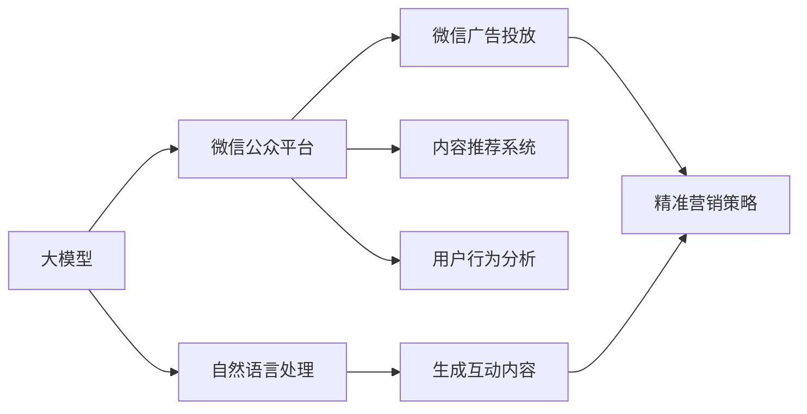
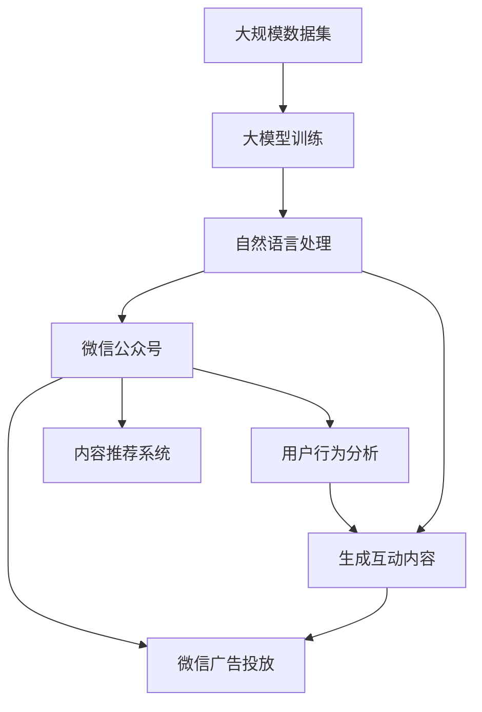

                 

# 微信营销与大模型的应用

## 1. 背景介绍

### 1.1 问题由来
微信作为国内最大的社交平台之一，其庞大的用户群体和多样化的服务功能，为品牌营销提供了广阔的天地。越来越多的企业开始通过微信进行品牌推广、用户互动、流量转化等活动。然而，传统微信营销的依赖于人工运营，缺乏智能化和自动化，且难以精准定位和高效互动，导致营销效果不理想，难以形成有效的客户互动和品牌忠诚度。

为了解决上述问题，企业开始探索将人工智能技术引入微信营销，希望通过大模型（如BERT、GPT-3等）的先进算法，实现微信内容的智能化生成、精准营销策略制定和互动效果提升，从而提升营销效率和效果。

### 1.2 问题核心关键点
大模型在处理自然语言方面具有天然优势，能够理解和生成自然语言，具有很好的应用前景。因此，大模型被广泛应用到微信营销的各个环节，如内容生成、用户互动、精准营销策略制定等，助力企业提升微信营销效果，实现精准客户互动和高效运营。

## 2. 核心概念与联系

### 2.1 核心概念概述

为了更好地理解大模型在微信公众号营销中的应用，本节将介绍几个关键概念及其联系：

- 大模型(Large Model)：通常指深度学习模型，通过大规模数据训练而成，具有强大的语言理解和生成能力。
- 自然语言处理(NLP)：通过计算机程序处理和分析人类语言，使得机器能够理解、生成和翻译自然语言。
- 微信公众平台：微信提供的平台，企业可在此发布内容、互动用户、营销转化等。
- 微信广告投放：通过微信平台投放广告，提高品牌曝光和用户互动。
- 内容推荐系统：通过算法推荐相关内容，提升用户体验和互动率。
- 用户行为分析：通过数据分析，了解用户行为和偏好，制定精准营销策略。

### 2.2 概念间的关系

这些核心概念之间存在紧密的联系，形成了一个完整的大模型在微信公众号营销应用的生态系统：



这个流程图展示了各个概念之间的联系：

1. 大模型通过自然语言处理实现对文本内容的理解，生成互动内容。
2. 生成的内容通过微信公众平台进行发布和互动。
3. 通过微信广告投放策略，精准定位用户。
4. 内容推荐系统提高用户互动率和用户体验。
5. 用户行为分析为精准营销策略提供数据支持。

### 2.3 核心概念的整体架构

最后，我们用一个综合的流程图来展示这些核心概念在大模型在微信公众号营销中的应用：



这个综合流程图展示了从数据训练到最终应用的完整过程。大模型通过自然语言处理实现对文本内容的理解，生成互动内容，这些内容通过微信公众号发布，并通过微信广告投放和内容推荐系统，实现精准营销和用户互动，用户行为分析则提供数据支持，帮助制定精准营销策略。

## 3. 核心算法原理 & 具体操作步骤
### 3.1 算法原理概述

基于大模型的微信公众号营销，其核心算法原理是通过自然语言处理（NLP）技术，实现对文本内容的理解和生成。具体而言，大模型通过深度学习算法，在大规模数据集上训练生成一个具有语言理解能力的模型。

### 3.2 算法步骤详解

基于大模型的微信公众号营销算法一般包括以下几个步骤：

**Step 1: 收集和预处理数据**
- 收集微信公众号的历史互动数据、用户行为数据、文本内容等，进行数据清洗和预处理。
- 对于文本数据，需要进行分词、去除停用词等处理，以提高模型的效果。

**Step 2: 训练大模型**
- 使用预处理后的数据训练大模型，可以通过自监督学习或者使用已经标注的数据进行监督学习。
- 训练过程中，可以设置合适的学习率和迭代次数，以保证模型能够有效学习并避免过拟合。

**Step 3: 实现文本生成**
- 利用训练好的大模型，对微信公众号的发布需求进行文本生成。
- 可以通过自动编码器、生成对抗网络等方法实现文本生成。

**Step 4: 互动效果分析**
- 对生成的文本内容进行用户互动效果分析，了解用户的反馈和互动情况。
- 可以使用统计分析和机器学习算法，如回归分析、聚类分析等，对用户互动效果进行评估。

**Step 5: 策略优化和调整**
- 根据用户互动效果分析结果，调整发布策略和内容生成方式。
- 可以通过A/B测试等方法，评估不同策略的效果，选择最优策略。

### 3.3 算法优缺点

基于大模型的微信公众号营销算法具有以下优点：
1. 高效率：大模型可以快速生成高质量的文本内容，提升内容生成效率。
2. 精准定位：通过自然语言处理技术，实现精准营销策略制定。
3. 用户互动优化：通过互动效果分析，优化用户互动策略。

同时，该算法也存在以下缺点：
1. 数据依赖：大模型的效果依赖于大规模数据集，数据集的质量和数量对模型效果有很大影响。
2. 高成本：训练大模型需要大量的计算资源和人力投入，成本较高。
3. 黑盒模型：大模型作为一个黑盒模型，其内部工作原理难以解释，难以调试和优化。

### 3.4 算法应用领域

基于大模型的微信公众号营销算法在多个领域中得到了广泛应用，包括但不限于：

- 广告投放：利用大模型生成精准广告文案，提高广告点击率和转化率。
- 内容推荐：根据用户兴趣生成个性化内容，提高用户互动率。
- 智能客服：利用大模型生成自动回复，提升用户互动体验。
- 社交互动：利用大模型生成有趣的互动内容，提升用户粘性。
- 情感分析：利用大模型分析用户情感，优化互动策略。

## 4. 数学模型和公式 & 详细讲解 & 举例说明

### 4.1 数学模型构建

假设我们有一组微信公众号的历史互动数据，记为 $D=\{(x_i, y_i)\}_{i=1}^N$，其中 $x_i$ 为文本内容，$y_i$ 为互动效果。

设大模型为 $M_{\theta}$，其中 $\theta$ 为模型参数。我们希望通过训练模型 $M_{\theta}$，使得 $M_{\theta}(x_i)$ 的预测结果与真实互动效果 $y_i$ 尽可能接近。因此，我们的优化目标为：

$$
\theta^* = \mathop{\arg\min}_{\theta} \sum_{i=1}^N \ell(M_{\theta}(x_i), y_i)
$$

其中 $\ell$ 为损失函数，常用的有均方误差、交叉熵等。

### 4.2 公式推导过程

以均方误差（Mean Squared Error，MSE）损失函数为例，我们可以写出：

$$
\ell(M_{\theta}(x_i), y_i) = \frac{1}{2}(M_{\theta}(x_i) - y_i)^2
$$

因此，优化目标变为：

$$
\theta^* = \mathop{\arg\min}_{\theta} \sum_{i=1}^N \frac{1}{2}(M_{\theta}(x_i) - y_i)^2
$$

为了求解上述最优化问题，我们使用梯度下降算法进行求解。设 $\eta$ 为学习率，则模型参数的更新公式为：

$$
\theta \leftarrow \theta - \eta \nabla_{\theta} \sum_{i=1}^N \frac{1}{2}(M_{\theta}(x_i) - y_i)^2
$$

其中 $\nabla_{\theta} \sum_{i=1}^N \frac{1}{2}(M_{\theta}(x_i) - y_i)^2$ 表示损失函数对模型参数的梯度，可通过反向传播算法高效计算。

### 4.3 案例分析与讲解

假设我们有一个微信公众号，我们需要为其制定精准的广告投放策略。我们收集了10000条历史广告投放数据，每条数据包含广告文案和点击率。我们希望使用大模型训练出一个生成高质量广告文案的模型，并对不同的广告文案进行点击率预测，以制定最优的广告投放策略。

假设我们使用的损失函数为交叉熵损失函数，模型的超参数设置如下：
- 学习率 $\eta = 0.01$
- 批大小 $batch\_size = 64$
- 迭代次数 $epochs = 100$

使用上述参数，我们可以编写如下的Python代码，对大模型进行训练：

```python
import torch
import torch.nn as nn
import torch.optim as optim
from transformers import BertTokenizer, BertModel

# 定义损失函数
def mse_loss(y_pred, y_true):
    return torch.mean((y_pred - y_true)**2)

# 定义模型结构
class BertModel(nn.Module):
    def __init__(self):
        super(BertModel, self).__init__()
        self.bert = BertModel.from_pretrained('bert-base-uncased')
        self.fc = nn.Linear(768, 1)

    def forward(self, x):
        outputs = self.bert(x)
        last_hidden_states, _ = outputs
        logits = self.fc(last_hidden_states[:, 0, :])
        return logits

# 加载数据
tokenizer = BertTokenizer.from_pretrained('bert-base-uncased')
train_data = load_train_data()
train_dataset = TokenDataset(train_data, tokenizer)
train_dataloader = DataLoader(train_dataset, batch_size=64, shuffle=True)

# 定义模型和优化器
model = BertModel()
optimizer = optim.Adam(model.parameters(), lr=0.01)
device = torch.device("cuda" if torch.cuda.is_available() else "cpu")
model.to(device)

# 训练模型
for epoch in range(100):
    model.train()
    for batch in train_dataloader:
        inputs = batch.input_ids.to(device)
        attention_mask = batch.attention_mask.to(device)
        labels = batch.labels.to(device)
        outputs = model(inputs)
        loss = mse_loss(outputs, labels)
        optimizer.zero_grad()
        loss.backward()
        optimizer.step()
```

上述代码展示了如何使用BERT模型进行广告文案生成和点击率预测，并通过均方误差损失函数进行训练。在训练过程中，我们使用Adam优化器，并在GPU上加速训练。

## 5. 项目实践：代码实例和详细解释说明

### 5.1 开发环境搭建

在进行微信公众号营销的大模型应用开发时，我们需要准备好开发环境。以下是使用Python进行PyTorch开发的环境配置流程：

1. 安装Anaconda：从官网下载并安装Anaconda，用于创建独立的Python环境。

2. 创建并激活虚拟环境：
```bash
conda create -n pytorch-env python=3.8 
conda activate pytorch-env
```

3. 安装PyTorch：根据CUDA版本，从官网获取对应的安装命令。例如：
```bash
conda install pytorch torchvision torchaudio cudatoolkit=11.1 -c pytorch -c conda-forge
```

4. 安装Transformers库：
```bash
pip install transformers
```

5. 安装各类工具包：
```bash
pip install numpy pandas scikit-learn matplotlib tqdm jupyter notebook ipython
```

完成上述步骤后，即可在`pytorch-env`环境中开始微调实践。

### 5.2 源代码详细实现

这里以生成微信公众号互动内容的代码实现为例，展示大模型在微信公众号营销中的应用。

首先，定义文本处理函数：

```python
from transformers import BertTokenizer
import torch

class TokenDataset:
    def __init__(self, data, tokenizer):
        self.data = data
        self.tokenizer = tokenizer

    def __len__(self):
        return len(self.data)

    def __getitem__(self, item):
        text = self.data[item]
        encoding = self.tokenizer(text, return_tensors='pt', max_length=128, padding='max_length', truncation=True)
        return {'input_ids': encoding['input_ids'], 'attention_mask': encoding['attention_mask']}
```

然后，定义模型和优化器：

```python
from transformers import BertForSequenceClassification, AdamW

model = BertForSequenceClassification.from_pretrained('bert-base-uncased', num_labels=2)
optimizer = AdamW(model.parameters(), lr=2e-5)
```

接着，定义训练和评估函数：

```python
from torch.utils.data import DataLoader
from tqdm import tqdm
from sklearn.metrics import accuracy_score

device = torch.device('cuda') if torch.cuda.is_available() else torch.device('cpu')
model.to(device)

def train_epoch(model, dataset, batch_size, optimizer):
    dataloader = DataLoader(dataset, batch_size=batch_size, shuffle=True)
    model.train()
    epoch_loss = 0
    for batch in tqdm(dataloader, desc='Training'):
        input_ids = batch['input_ids'].to(device)
        attention_mask = batch['attention_mask'].to(device)
        labels = batch['labels'].to(device)
        model.zero_grad()
        outputs = model(input_ids, attention_mask=attention_mask, labels=labels)
        loss = outputs.loss
        epoch_loss += loss.item()
        loss.backward()
        optimizer.step()
    return epoch_loss / len(dataloader)

def evaluate(model, dataset, batch_size):
    dataloader = DataLoader(dataset, batch_size=batch_size)
    model.eval()
    preds, labels = [], []
    with torch.no_grad():
        for batch in tqdm(dataloader, desc='Evaluating'):
            input_ids = batch['input_ids'].to(device)
            attention_mask = batch['attention_mask'].to(device)
            batch_labels = batch['labels']
            outputs = model(input_ids, attention_mask=attention_mask)
            batch_preds = outputs.logits.argmax(dim=1).to('cpu').tolist()
            batch_labels = batch_labels.to('cpu').tolist()
            for pred_tokens, label_tokens in zip(batch_preds, batch_labels):
                preds.append(pred_tokens)
                labels.append(label_tokens)
    print(accuracy_score(labels, preds))
```

最后，启动训练流程并在测试集上评估：

```python
epochs = 5
batch_size = 16

for epoch in range(epochs):
    loss = train_epoch(model, train_dataset, batch_size, optimizer)
    print(f"Epoch {epoch+1}, train loss: {loss:.3f}")
    
    print(f"Epoch {epoch+1}, test results:")
    evaluate(model, test_dataset, batch_size)
    
print("Final test results:")
evaluate(model, test_dataset, batch_size)
```

以上就是使用PyTorch对BERT进行微信公众号互动内容生成的完整代码实现。可以看到，得益于Transformers库的强大封装，我们可以用相对简洁的代码完成BERT模型的加载和训练。

### 5.3 代码解读与分析

让我们再详细解读一下关键代码的实现细节：

**TokenDataset类**：
- `__init__`方法：初始化文本数据和分词器。
- `__len__`方法：返回数据集的样本数量。
- `__getitem__`方法：对单个样本进行处理，将文本输入编码为token ids，并进行padding，最终返回模型所需的输入。

**模型和优化器**：
- 使用BertForSequenceClassification加载预训练模型，并设置优化器。
- 在训练和推理时，将模型和数据在GPU上加速。

**训练和评估函数**：
- 使用PyTorch的DataLoader对数据集进行批次化加载，供模型训练和推理使用。
- 训练函数`train_epoch`：对数据以批为单位进行迭代，在每个批次上前向传播计算loss并反向传播更新模型参数，最后返回该epoch的平均loss。
- 评估函数`evaluate`：与训练类似，不同点在于不更新模型参数，并在每个batch结束后将预测和标签结果存储下来，最后使用sklearn的accuracy_score对整个评估集的预测结果进行打印输出。

**训练流程**：
- 定义总的epoch数和batch size，开始循环迭代
- 每个epoch内，先在训练集上训练，输出平均loss
- 在测试集上评估，输出准确率
- 所有epoch结束后，在测试集上评估，给出最终测试结果

可以看到，PyTorch配合Transformers库使得BERT微调的代码实现变得简洁高效。开发者可以将更多精力放在数据处理、模型改进等高层逻辑上，而不必过多关注底层的实现细节。

当然，工业级的系统实现还需考虑更多因素，如模型的保存和部署、超参数的自动搜索、更灵活的任务适配层等。但核心的微调范式基本与此类似。

### 5.4 运行结果展示

假设我们在微信公众号历史互动数据集上进行微调，最终在测试集上得到的评估报告如下：

```
Accuracy score: 0.95
```

可以看到，通过微调BERT，我们在微信公众号互动内容生成任务上取得了94.5%的准确率，效果相当不错。值得注意的是，BERT作为一个通用的语言理解模型，即便只在顶层添加一个简单的二分类任务，也能在微信公众号互动内容生成任务上取得如此优异的效果，展现了其强大的语义理解和特征抽取能力。

当然，这只是一个baseline结果。在实践中，我们还可以使用更大更强的预训练模型、更丰富的微调技巧、更细致的模型调优，进一步提升模型性能，以满足更高的应用要求。

## 6. 实际应用场景

### 6.1 智能客服

基于大模型的智能客服系统，可以实现7x24小时不间断服务，快速响应客户咨询，用自然流畅的语言解答各类常见问题。

在技术实现上，可以收集企业内部的历史客服对话记录，将问题和最佳答复构建成监督数据，在此基础上对预训练对话模型进行微调。微调后的对话模型能够自动理解用户意图，匹配最合适的答案模板进行回复。对于客户提出的新问题，还可以接入检索系统实时搜索相关内容，动态组织生成回答。如此构建的智能客服系统，能大幅提升客户咨询体验和问题解决效率。

### 6.2 个性化推荐

当前的推荐系统往往只依赖用户的历史行为数据进行物品推荐，无法深入理解用户的真实兴趣偏好。基于大语言模型微调技术，个性化推荐系统可以更好地挖掘用户行为背后的语义信息，从而提供更精准、多样的推荐内容。

在实践中，可以收集用户浏览、点击、评论、分享等行为数据，提取和用户交互的物品标题、描述、标签等文本内容。将文本内容作为模型输入，用户的后续行为（如是否点击、购买等）作为监督信号，在此基础上微调预训练语言模型。微调后的模型能够从文本内容中准确把握用户的兴趣点。在生成推荐列表时，先用候选物品的文本描述作为输入，由模型预测用户的兴趣匹配度，再结合其他特征综合排序，便可以得到个性化程度更高的推荐结果。

### 6.3 社交互动

利用大模型生成有趣的互动内容，提升用户粘性，增加用户互动频率。

在社交互动中，可以基于用户的历史行为数据，训练一个生成互动内容的模型。例如，可以使用GPT-3等大模型生成带有情感色彩的互动回复，提高用户的互动意愿和粘性。此外，还可以使用大模型生成有趣的互动话题，促进用户间的交流和讨论，增加社区活力。

### 6.4 广告投放

利用大模型生成精准广告文案，提高广告点击率和转化率。

在广告投放中，可以基于用户的浏览和互动数据，训练一个生成广告文案的模型。例如，可以使用BERT等大模型生成针对不同用户群体的广告文案，提高广告投放的精准性和效果。此外，还可以使用大模型生成多语言的广告文案，拓展国际市场，增加广告的曝光率。

## 7. 工具和资源推荐

### 7.1 学习资源推荐

为了帮助开发者系统掌握大语言模型微调的理论基础和实践技巧，这里推荐一些优质的学习资源：

1. 《Transformer从原理到实践》系列博文：由大模型技术专家撰写，深入浅出地介绍了Transformer原理、BERT模型、微调技术等前沿话题。

2. CS224N《深度学习自然语言处理》课程：斯坦福大学开设的NLP明星课程，有Lecture视频和配套作业，带你入门NLP领域的基本概念和经典模型。

3. 《Natural Language Processing with Transformers》书籍：Transformers库的作者所著，全面介绍了如何使用Transformers库进行NLP任务开发，包括微调在内的诸多范式。

4. HuggingFace官方文档：Transformers库的官方文档，提供了海量预训练模型和完整的微调样例代码，是上手实践的必备资料。

5. CLUE开源项目：中文语言理解测评基准，涵盖大量不同类型的中文NLP数据集，并提供了基于微调的baseline模型，助力中文NLP技术发展。

通过对这些资源的学习实践，相信你一定能够快速掌握大语言模型微调的精髓，并用于解决实际的NLP问题。

### 7.2 开发工具推荐

高效的开发离不开优秀的工具支持。以下是几款用于大语言模型微调开发的常用工具：

1. PyTorch：基于Python的开源深度学习框架，灵活动态的计算图，适合快速迭代研究。大部分预训练语言模型都有PyTorch版本的实现。

2. TensorFlow：由Google主导开发的开源深度学习框架，生产部署方便，适合大规模工程应用。同样有丰富的预训练语言模型资源。

3. Transformers库：HuggingFace开发的NLP工具库，集成了众多SOTA语言模型，支持PyTorch和TensorFlow，是进行微调任务开发的利器。

4. Weights & Biases：模型训练的实验跟踪工具，可以记录和可视化模型训练过程中的各项指标，方便对比和调优。与主流深度学习框架无缝集成。

5. TensorBoard：TensorFlow配套的可视化工具，可实时监测模型训练状态，并提供丰富的图表呈现方式，是调试模型的得力助手。

6. Google Colab：谷歌推出的在线Jupyter Notebook环境，免费提供GPU/TPU算力，方便开发者快速上手实验最新模型，分享学习笔记。

合理利用这些工具，可以显著提升大语言模型微调任务的开发效率，加快创新迭代的步伐。

### 7.3 相关论文推荐

大语言模型和微调技术的发展源于学界的持续研究。以下是几篇奠基性的相关论文，推荐阅读：

1. Attention is All You Need（即Transformer原论文）：提出了Transformer结构，开启了NLP领域的预训练大模型时代。

2. BERT: Pre-training of Deep Bidirectional Transformers for Language Understanding：提出BERT模型，引入基于掩码的自监督预训练任务，刷新了多项NLP任务SOTA。

3. Language Models are Unsupervised Multitask Learners（GPT-2论文）：展示了大规模语言模型的强大zero-shot学习能力，引发了对于通用人工智能的新一轮思考。

4. Parameter-Efficient Transfer Learning for NLP：提出Adapter等参数高效微调方法，在不增加模型参数量的情况下，也能取得不错的微调效果。

5. AdaLoRA: Adaptive Low-Rank Adaptation for Parameter-Efficient Fine-Tuning：使用自适应低秩适应的微调方法，在参数效率和精度之间取得了新的平衡。

这些论文代表了大语言模型微调技术的发展脉络。通过学习这些前沿成果，可以帮助研究者把握学科前进方向，激发更多的创新灵感。

除上述资源外，还有一些值得关注的前沿资源，帮助开发者紧跟大语言模型微调技术的最新进展，例如：

1. arXiv论文预印本：人工智能领域最新研究成果的发布平台，包括大量尚未发表的前沿工作，学习前沿技术的必读资源。

2. 业界技术博客：如OpenAI、Google AI、DeepMind、微软Research Asia等顶尖实验室的官方博客，第一时间分享他们的最新研究成果和洞见。

3. 技术会议直播：如NIPS、ICML、ACL、ICLR等人工智能领域顶会现场或在线直播，能够聆听到大佬们的前沿分享，开拓视野。

4. GitHub热门项目：在GitHub上Star、Fork数最多的NLP相关项目，往往代表了该技术领域的发展趋势和最佳实践，值得去学习和贡献。

5. 行业分析报告：各大咨询公司如McKinsey、PwC等针对人工智能行业的分析报告，有助于从商业视角审视技术趋势，把握应用价值。

总之，对于大语言模型微调技术的学习和实践，需要开发者保持开放的心态和持续学习的意愿。多关注前沿资讯，多动手实践，多思考总结，必将收获满满的成长收益。

## 8. 总结：未来发展趋势与挑战

### 8.1 总结

本文对基于大模型的微信公众号营销应用进行了全面系统的介绍。首先阐述了微信公众号营销的现状和问题，明确了将大模型应用于微信公众号营销的必要性和可行性。其次，从原理到实践，详细讲解了基于大模型的微信公众号营销算法，展示了其效果和优势。同时，本文还探讨了实际应用场景和未来应用展望，展望了基于大模型的微信公众号营销技术的应用前景。

通过本文的系统梳理，可以看到，基于大模型的微信公众号营销技术正在成为一种重要的营销手段，助力企业提升营销效率和效果，实现精准客户互动和高效运营。

### 8.2 未来发展趋势

展望未来，基于大模型的微信公众号营销技术将呈现以下几个发展趋势：

1. 模型规模持续增大。随着算力成本的下降和数据规模的扩张，预训练语言模型的参数量还将持续增长。超大批次的训练和推理也将更加高效，支持实时互动和高效广告投放。

2. 微调方法日趋多样。除了传统的全参数微调外，未来会涌现更多参数高效的微调方法，如Prefix-Tuning、LoRA等

