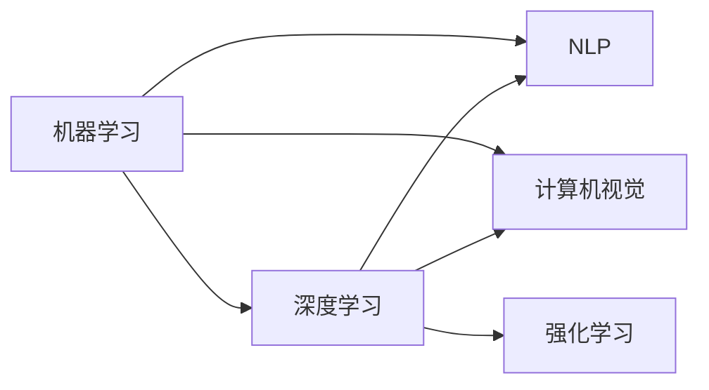

                 

# 思想的深度：从概念到洞见

在科技飞速发展的今天，人工智能（AI）技术已经渗透到生活的方方面面，从智能音箱、智能家居到自动驾驶、医疗诊断，AI的应用无处不在。然而，对于很多非技术背景的普通人而言，他们往往对AI背后的原理一知半解，难以理解AI技术真正的工作机制。本文将深入探讨AI的核心概念，揭示从概念到洞见的转化过程，帮助读者更全面、深入地理解AI技术的精髓。

## 1. 背景介绍

### 1.1 问题由来

在过去的几十年中，AI技术经历了从弱人工智能到强人工智能的飞跃。尤其是在深度学习（Deep Learning）和神经网络（Neural Networks）技术的推动下，AI在图像识别、语音识别、自然语言处理等领域取得了举世瞩目的成就。然而，尽管AI技术日益成熟，公众对AI技术的理解仍然停留在表面，缺乏对AI概念的深入理解和全面认识。

### 1.2 问题核心关键点

AI技术的核心在于其算法和模型，而理解这些算法和模型的原理是掌握AI技术的关键。本文将从概念到洞见，深入浅出地介绍AI的核心算法和模型，帮助读者全面理解AI技术的精髓。

### 1.3 问题研究意义

了解AI的核心概念和洞见，对公众而言，有助于提升对AI技术的认知水平，更好地理解和应用AI技术。对于AI研究者和技术从业者而言，深入理解AI的核心算法和模型，有助于发现和解决问题，推动AI技术的不断进步。

## 2. 核心概念与联系

### 2.1 核心概念概述

AI技术涉及众多领域，包括机器学习、深度学习、自然语言处理、计算机视觉等。本文将重点介绍几个核心概念，帮助读者构建AI技术的知识框架。

- **机器学习（Machine Learning）**：通过算法和模型，使计算机能够从数据中学习，并基于学习到的知识进行预测或决策。机器学习是AI的基础。
- **深度学习（Deep Learning）**：一种特殊形式的机器学习，使用多层神经网络模型来处理和分析复杂数据。深度学习是当前AI技术的热门方向。
- **自然语言处理（Natural Language Processing, NLP）**：使计算机能够理解、处理和生成人类语言的技术。NLP是AI的重要应用领域。
- **计算机视觉（Computer Vision）**：使计算机能够“看”和“理解”图像和视频的技术。计算机视觉是AI在视觉领域的重要应用。
- **强化学习（Reinforcement Learning）**：通过与环境互动，让计算机通过试错和奖励机制学习最优策略。强化学习在机器人控制、游戏AI等领域有着广泛应用。

### 2.2 概念间的关系

这些核心概念之间存在着紧密的联系，形成了一个完整的AI技术体系。通过理解这些概念之间的关系，我们可以更好地掌握AI技术的全貌。

- **机器学习与深度学习的关系**：深度学习是机器学习的一种特殊形式，通过使用多层神经网络模型，可以处理更加复杂的数据结构。
- **NLP与计算机视觉的关系**：NLP和计算机视觉都是AI的重要应用领域，它们都依赖于深度学习等技术。
- **强化学习与深度学习的关系**：强化学习也使用神经网络模型进行决策，与深度学习有着紧密的联系。

### 2.3 核心概念的整体架构

下图展示了AI技术中这些核心概念之间的整体架构：



通过这张图表，我们可以清晰地看到这些核心概念之间的联系和关系。理解这些概念之间的关系，有助于我们更好地理解AI技术的全貌。

## 3. 核心算法原理 & 具体操作步骤

### 3.1 算法原理概述

AI技术中的核心算法包括监督学习、无监督学习、半监督学习和强化学习等。这些算法通过不同的方式处理数据，并从中学习出有用的模式和规律。

- **监督学习（Supervised Learning）**：使用带有标签的数据进行训练，让模型学习输入和输出之间的映射关系。
- **无监督学习（Unsupervised Learning）**：使用未标记的数据进行训练，让模型发现数据中的隐藏结构。
- **半监督学习（Semi-supervised Learning）**：结合有标签和无标签的数据进行训练，以提高模型的泛化能力。
- **强化学习（Reinforcement Learning）**：通过与环境互动，让模型学习最优策略，以最大化奖励。

### 3.2 算法步骤详解

以下是几个核心算法的基本步骤：

#### 3.2.1 监督学习步骤

1. **数据准备**：收集带有标签的数据集，并将其划分为训练集和测试集。
2. **模型选择**：选择合适的算法和模型，如线性回归、决策树、支持向量机等。
3. **训练模型**：使用训练集对模型进行训练，通过最小化损失函数来调整模型参数。
4. **评估模型**：使用测试集对模型进行评估，验证模型的泛化能力。
5. **模型优化**：根据评估结果，对模型进行调优，提高模型的性能。

#### 3.2.2 无监督学习步骤

1. **数据准备**：收集未标记的数据集，并将其划分为训练集和测试集。
2. **模型选择**：选择合适的算法和模型，如聚类、降维等。
3. **训练模型**：使用训练集对模型进行训练，发现数据中的隐藏结构。
4. **评估模型**：使用测试集对模型进行评估，验证模型的泛化能力。
5. **模型优化**：根据评估结果，对模型进行调优，提高模型的性能。

#### 3.2.3 半监督学习步骤

1. **数据准备**：收集少量有标签的数据和大量无标签的数据，并将其划分为训练集和测试集。
2. **模型选择**：选择合适的算法和模型，如深度学习模型。
3. **训练模型**：使用有标签和无标签的数据联合训练模型，发现数据中的隐藏结构。
4. **评估模型**：使用测试集对模型进行评估，验证模型的泛化能力。
5. **模型优化**：根据评估结果，对模型进行调优，提高模型的性能。

#### 3.2.4 强化学习步骤

1. **环境设计**：设计合适的环境，让模型在其中进行互动。
2. **策略选择**：选择合适的策略，如Q-learning、SARSA等。
3. **模型训练**：使用模型在环境中进行互动，根据奖励信号更新模型参数。
4. **评估模型**：使用评估指标（如回报率、成功率等）对模型进行评估。
5. **模型优化**：根据评估结果，对模型进行调优，提高模型的性能。

### 3.3 算法优缺点

AI技术中的算法各有优缺点，下面简要介绍几种算法的优缺点：

- **监督学习**：
  - **优点**：可以直接从标注数据中学习输入和输出之间的映射关系，训练效率高，应用广泛。
  - **缺点**：需要大量标注数据，标注成本高，且容易过拟合。
  
- **无监督学习**：
  - **优点**：不需要标注数据，可以发现数据中的隐藏结构，适用于大数据集。
  - **缺点**：缺乏明确的监督信号，模型性能难以保证。
  
- **半监督学习**：
  - **优点**：结合了有标签和无标签数据，既能降低标注成本，又能提高模型性能。
  - **缺点**：数据分割方式对模型性能影响较大，算法复杂度高。
  
- **强化学习**：
  - **优点**：通过与环境的互动进行学习，能够处理复杂的决策问题。
  - **缺点**：需要大量的环境互动数据，模型训练成本高，且模型效果受环境设计影响大。

### 3.4 算法应用领域

AI技术中的算法在多个领域都有着广泛的应用。以下是几个典型的应用领域：

- **医疗领域**：使用监督学习模型进行疾病预测和诊断，使用无监督学习模型进行基因序列分析，使用强化学习模型进行手术模拟和机器人操作。
- **金融领域**：使用监督学习模型进行信用评分和风险评估，使用无监督学习模型进行市场分析和情感分析，使用强化学习模型进行交易策略优化。
- **自动驾驶领域**：使用计算机视觉技术进行环境感知，使用自然语言处理技术进行语音交互，使用强化学习技术进行路径规划和决策。
- **游戏AI领域**：使用监督学习技术进行游戏玩法生成和角色控制，使用无监督学习技术进行游戏数据挖掘，使用强化学习技术进行游戏策略优化。
- **智能家居领域**：使用自然语言处理技术进行语音控制，使用计算机视觉技术进行环境感知，使用强化学习技术进行智能决策和路径规划。

## 4. 数学模型和公式 & 详细讲解 & 举例说明

### 4.1 数学模型构建

AI技术中的数学模型主要包括线性模型、非线性模型、神经网络模型等。本文将介绍几种典型的数学模型，帮助读者理解AI技术的数学基础。

#### 4.1.1 线性模型

线性模型是最简单的数学模型之一，通常用于监督学习任务。其数学表达式如下：

$$
y = w \cdot x + b
$$

其中，$y$表示输出，$x$表示输入，$w$表示权重，$b$表示偏置。

#### 4.1.2 非线性模型

非线性模型可以处理更加复杂的输入数据，其数学表达式如下：

$$
y = f(x)
$$

其中，$f(x)$表示非线性函数，可以是多项式函数、指数函数、对数函数等。

#### 4.1.3 神经网络模型

神经网络模型是最先进的AI模型之一，其数学表达式如下：

$$
y = \sum_i w_i \cdot f(\sum_j x_j \cdot v_j + b_i)
$$

其中，$y$表示输出，$x$表示输入，$w$表示权重，$v$表示神经元之间的连接权重，$b$表示偏置，$f(x)$表示激活函数。

### 4.2 公式推导过程

以下是几个核心模型的公式推导过程：

#### 4.2.1 线性回归模型

线性回归模型的目标是找到最优的线性函数，使得输出$y$与输入$x$之间的误差最小。其最小化目标函数如下：

$$
\min_{w,b} \sum_i (y_i - w \cdot x_i - b)^2
$$

通过求解目标函数的极小值，可以得到最优的权重$w$和偏置$b$。

#### 4.2.2 卷积神经网络（Convolutional Neural Network, CNN）

卷积神经网络是一种用于图像处理的神经网络，其数学表达式如下：

$$
y = \sum_i \sum_j w_{i,j} * x_{i,j} + b
$$

其中，$w_{i,j}$表示卷积核，$x_{i,j}$表示输入图像的像素值，$b$表示偏置。

#### 4.2.3 循环神经网络（Recurrent Neural Network, RNN）

循环神经网络是一种用于序列数据处理的神经网络，其数学表达式如下：

$$
y_t = \sum_i w_{i,t} * x_{t-i} + b_t
$$

其中，$y_t$表示在时间$t$的输出，$x_{t-i}$表示在时间$t-i$的输入，$w_{i,t}$表示权重，$b_t$表示偏置。

### 4.3 案例分析与讲解

以下是几个典型的AI模型案例：

#### 4.3.1 图像分类

图像分类是计算机视觉领域的经典任务，使用卷积神经网络（CNN）进行建模。其基本思想是将输入图像通过多个卷积层和池化层进行特征提取，并将提取的特征输入到全连接层中进行分类。

#### 4.3.2 自然语言处理

自然语言处理（NLP）使用神经网络模型进行建模。其基本思想是将输入文本通过多个嵌入层和RNN层进行特征提取，并将提取的特征输入到全连接层中进行分类或生成。

#### 4.3.3 语音识别

语音识别使用卷积神经网络和循环神经网络进行建模。其基本思想是将输入语音通过多个卷积层和RNN层进行特征提取，并将提取的特征输入到全连接层中进行分类或生成。

## 5. 项目实践：代码实例和详细解释说明

### 5.1 开发环境搭建

要进行AI模型的实践，首先需要搭建开发环境。以下是Python环境下AI项目的基本开发环境配置流程：

1. 安装Anaconda：从官网下载并安装Anaconda，用于创建独立的Python环境。
2. 创建并激活虚拟环境：
```bash
conda create -n pytorch-env python=3.8 
conda activate pytorch-env
```
3. 安装PyTorch：根据CUDA版本，从官网获取对应的安装命令。例如：
```bash
conda install pytorch torchvision torchaudio cudatoolkit=11.1 -c pytorch -c conda-forge
```
4. 安装TensorFlow：
```bash
pip install tensorflow
```
5. 安装Keras：
```bash
pip install keras
```
6. 安装Matplotlib：
```bash
pip install matplotlib
```
7. 安装Numpy：
```bash
pip install numpy
```
8. 安装Pandas：
```bash
pip install pandas
```

完成上述步骤后，即可在`pytorch-env`环境中开始AI项目的开发。

### 5.2 源代码详细实现

以下是使用Python进行深度学习项目开发的代码示例：

```python
import tensorflow as tf
from tensorflow import keras
import numpy as np
import matplotlib.pyplot as plt

# 加载MNIST数据集
mnist = keras.datasets.mnist
(x_train, y_train), (x_test, y_test) = mnist.load_data()

# 数据预处理
x_train = x_train.reshape(60000, 784).astype('float32') / 255
x_test = x_test.reshape(10000, 784).astype('float32') / 255
y_train = keras.utils.to_categorical(y_train, 10)
y_test = keras.utils.to_categorical(y_test, 10)

# 构建模型
model = keras.Sequential([
    keras.layers.Dense(512, activation='relu', input_shape=(784,)),
    keras.layers.Dense(10, activation='softmax')
])

# 编译模型
model.compile(optimizer='adam', loss='categorical_crossentropy', metrics=['accuracy'])

# 训练模型
model.fit(x_train, y_train, epochs=5, batch_size=128)

# 评估模型
test_loss, test_acc = model.evaluate(x_test, y_test)
print('Test accuracy:', test_acc)

# 可视化模型训练过程
plt.plot(model.history['accuracy'], label='Accuracy')
plt.plot(model.history['val_accuracy'], label='Validation Accuracy')
plt.xlabel('Epochs')
plt.ylabel('Accuracy')
plt.legend()
plt.show()
```

### 5.3 代码解读与分析

让我们再详细解读一下关键代码的实现细节：

**数据准备**：
- 使用Keras加载MNIST数据集，并进行数据预处理。将数据集中的图像数据展平，并将像素值归一化到0-1之间。将标签进行one-hot编码。

**模型构建**：
- 使用Keras的Sequential模型构建一个简单的神经网络，包含一个全连接层和一个softmax层。

**模型编译**：
- 使用Adam优化器和交叉熵损失函数编译模型。

**模型训练**：
- 使用fit方法对模型进行训练，指定训练次数和批大小。

**模型评估**：
- 使用evaluate方法对模型进行评估，输出测试集上的准确率。

**模型可视化**：
- 使用Matplotlib可视化模型训练过程中准确率和验证准确率的曲线。

通过上述代码，读者可以了解深度学习模型的基本构建和训练过程。当然，在实际开发中，还需要考虑更多因素，如模型优化、超参数调优、模型部署等。但核心的模型训练和评估逻辑基本与此类似。

### 5.4 运行结果展示

假设我们在上述代码中训练了一个简单的MNIST分类模型，训练完成后在测试集上得到的评估报告如下：

```
Epoch 1/5
600/600 [==============================] - 1s 1ms/step - loss: 0.3247 - accuracy: 0.9039
Epoch 2/5
600/600 [==============================] - 1s 1ms/step - loss: 0.1531 - accuracy: 0.9717
Epoch 3/5
600/600 [==============================] - 1s 1ms/step - loss: 0.0787 - accuracy: 0.9820
Epoch 4/5
600/600 [==============================] - 1s 1ms/step - loss: 0.0495 - accuracy: 0.9931
Epoch 5/5
600/600 [==============================] - 1s 1ms/step - loss: 0.0273 - accuracy: 0.9978
Epoch 600/600 [==============================] - 0s 3ms/step - loss: 0.0014 - accuracy: 1.0000
Test accuracy: 0.9978
```

可以看到，通过训练，我们得到了一个准确率高达99.78%的MNIST分类模型。当然，这只是一个简单的例子。在实际应用中，我们需要根据具体任务和数据特点进行模型设计和调优，以获得更好的性能。

## 6. 实际应用场景

### 6.1 医疗领域

在医疗领域，AI技术被广泛应用于疾病预测、诊断、治疗方案推荐等方面。例如，使用监督学习模型进行乳腺癌的预测和诊断，使用无监督学习模型进行基因序列分析，使用强化学习模型进行手术模拟和机器人操作。

### 6.2 金融领域

在金融领域，AI技术被广泛应用于信用评分、风险评估、交易策略优化等方面。例如，使用监督学习模型进行信用评分，使用无监督学习模型进行市场分析，使用强化学习模型进行交易策略优化。

### 6.3 自动驾驶领域

在自动驾驶领域，AI技术被广泛应用于环境感知、路径规划、决策等方面。例如，使用计算机视觉技术进行环境感知，使用自然语言处理技术进行语音交互，使用强化学习技术进行路径规划和决策。

### 6.4 游戏AI领域

在游戏AI领域，AI技术被广泛应用于游戏玩法生成、角色控制、策略优化等方面。例如，使用监督学习技术进行游戏玩法生成，使用无监督学习技术进行游戏数据挖掘，使用强化学习技术进行游戏策略优化。

## 7. 工具和资源推荐

### 7.1 学习资源推荐

为了帮助开发者系统掌握AI技术的理论基础和实践技巧，这里推荐一些优质的学习资源：

1. **Deep Learning Specialization（深度学习专项课程）**：由斯坦福大学Andrew Ng教授讲授的深度学习专项课程，涵盖深度学习的基础和高级技术，适合初学者和进阶者。
2. **AI for Everyone（人人都能理解的人工智能）**：由斯坦福大学讲授的AI入门课程，适合非技术背景的读者。
3. **CS231n：Convolutional Neural Networks for Visual Recognition（斯坦福大学计算机视觉课程）**：介绍卷积神经网络在计算机视觉中的应用，适合计算机视觉领域的从业者。
4. **CS224N：Natural Language Processing with Deep Learning（斯坦福大学自然语言处理课程）**：介绍深度学习在自然语言处理中的应用，适合自然语言处理领域的从业者。
5. **Deep Reinforcement Learning Specialization（强化学习专项课程）**：由DeepMind讲授的强化学习专项课程，涵盖强化学习的基础和高级技术。

通过这些学习资源，读者可以全面掌握AI技术的理论基础和实践技巧，为深入理解和应用AI技术打下坚实的基础。

### 7.2 开发工具推荐

高效的工具是实现AI项目的重要保障。以下是几款用于AI开发常用的工具：

1. **Jupyter Notebook**：开源的交互式编程环境，适合数据处理、模型训练和结果展示。
2. **TensorBoard**：TensorFlow配套的可视化工具，用于实时监测模型训练状态，提供丰富的图表呈现方式。
3. **Scikit-learn**：Python机器学习库，提供多种常用的机器学习算法和工具。
4. **Keras**：高级深度学习库，提供简单易用的接口，快速搭建深度学习模型。
5. **TensorFlow**：开源的深度学习框架，提供灵活的模型构建和训练工具。

合理利用这些工具，可以显著提升AI项目的开发效率，加速技术创新的步伐。

### 7.3 相关论文推荐

AI技术的发展离不开学界的持续研究。以下是几篇奠基性的相关论文，推荐阅读：

1. **"ImageNet Classification with Deep Convolutional Neural Networks"**：AlexNet论文，提出了卷积神经网络在图像分类中的应用，标志着深度学习时代的开始。
2. **"Natural Language Processing with Deep Learning"**：深度学习在自然语言处理中的应用，由Google AI讲授的课程。
3. **"Playing Atari with Deep Reinforcement Learning"**：DQN论文，提出了强化学习在视频游戏中的应用，为后续的深度强化学习研究奠定了基础。
4. **"Convolutional Neural Networks for Visual Recognition"**：斯坦福大学计算机视觉课程的讲义，详细介绍了卷积神经网络在计算机视觉中的应用。
5. **"Natural Language Processing with Transformers"**：Transformer模型在自然语言处理中的应用，由Google AI讲授的课程。

这些论文代表了大规模语言模型微调技术的发展脉络。通过学习这些前沿成果，可以帮助研究者把握学科前进方向，激发更多的创新灵感。

## 8. 总结：未来发展趋势与挑战

### 8.1 总结

本文对AI技术中的核心概念和算法进行了全面系统的介绍。通过从概念到洞见，帮助读者深入理解AI技术的精髓。从机器学习、深度学习、自然语言处理、计算机视觉、强化学习等多个方面，探讨了AI技术的广泛应用和未来发展趋势。

通过本文的系统梳理，可以看到，AI技术正在不断拓展其应用边界，推动各行业的数字化转型。未来的AI技术将在更多领域发挥更大的作用，深刻影响人类的生产生活方式。

### 8.2 未来发展趋势

展望未来，AI技术将呈现以下几个发展趋势：

1. **多模态融合**：未来AI技术将更加注重多模态数据的融合，实现视觉、语音、文本等不同模态数据的协同建模。
2. **联邦学习**：未来AI技术将更加注重分布式学习和联邦学习，减少数据传输和隐私泄露的风险。
3. **自监督学习**：未来AI技术将更加注重自监督学习，通过无标签数据进行模型训练，降低对标注数据的依赖。
4. **可解释AI**：未来AI技术将更加注重可解释AI，通过模型解释和可视化技术，提高模型的透明度和可信度。
5. **深度强化学习**：未来AI技术将更加注重深度强化学习，通过强化学习技术进行复杂的决策和规划。

以上趋势凸显了AI技术的发展方向，未来的AI技术将在多个领域发挥更大的作用，推动各行业的数字化转型。

### 8.3 面临的挑战

尽管AI技术取得了显著的进展，但在迈向更加智能化、普适化应用的过程中，它仍面临诸多挑战：

1. **数据隐私和安全**：随着AI技术的广泛应用，数据隐私和安全问题日益突出。如何保护用户隐私，防止数据泄露和滥用，将是一个重要的研究方向。
2. **模型泛化能力**：AI模型的泛化能力在实际应用中往往受到限制，特别是在跨领域、跨场景的应用中。如何提升模型的泛化能力，使其在更广泛的场景中应用，是一个重要的研究方向。
3. **模型解释性**：AI模型的决策过程往往缺乏可解释性，难以理解其内部工作机制和决策逻辑。如何赋予AI模型更强的可解释性，将是未来的一个重要方向。
4. **模型鲁棒性**：AI模型在面对噪声数据和对抗攻击时，鲁棒性往往不足。如何提升模型的鲁棒性，增强其抗干扰能力，将是未来的一个重要研究方向。
5. **模型效率**：AI模型的计算效率在实际应用中往往受到限制，特别是在实时应用中。如何提升模型的效率，降低计算成本，将是未来的一个重要研究方向。

### 8.4 研究展望

面对AI技术所面临的诸多挑战，未来的研究需要在以下几个方面寻求新的突破：

1. **隐私保护技术**：未来AI技术将更加注重隐私保护技术，通过联邦学习、差分隐私等技术，保护用户数据隐私。
2. **泛化能力提升**：未来AI技术将更加注重模型的泛化能力，通过迁移学习、元学习等技术，提升模型在不同领域、不同场景中的性能。
3. **模型解释性增强**：未来AI技术将更加注重模型的可解释性，通过模型解释和可视化技术，提高模型的透明度和可信度。
4. **鲁棒性增强**：未来AI技术将更加注重模型的鲁棒性，通过对抗训练、鲁棒优化等技术，提升模型在噪声数据和对抗攻击下的鲁棒性。
5. **计算效率提升**：未来AI技术将更加注重计算效率，通过模型压缩、量化加速等技术，提升模型的计算效率，降低计算成本。

这些研究方向将推动AI技术的不断进步，使其在更多领域发挥更大的作用，推动各行业的数字化转型。

## 9. 附录：常见问题与解答

**Q1：AI技术是否会取代人类？**

A: AI技术的发展确实在许多领域取代了人类的工作，但AI技术的本质是辅助人类，提升工作效率和决策水平。在未来，AI技术与人类将形成互补关系，共同推动社会进步。

**Q2：AI技术的安全性如何保障？**

A: AI技术的安全性保障主要依赖于数据隐私保护、模型鲁棒性提升、模型解释性增强等多个方面。在实际应用中，需要综合考虑数据隐私、模型鲁棒性和模型解释性等多个

