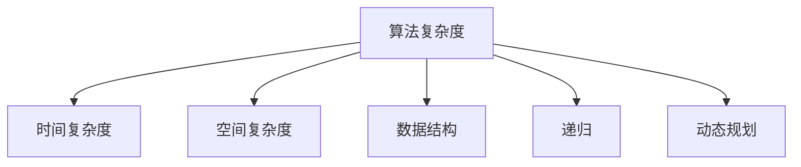
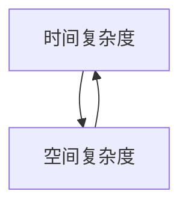
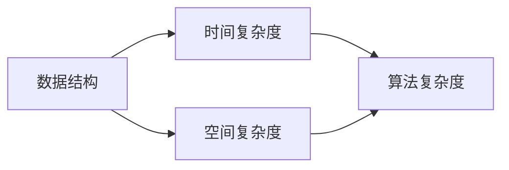
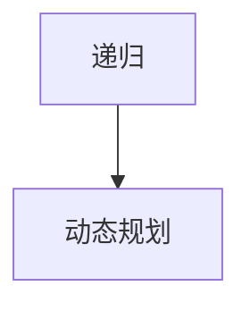
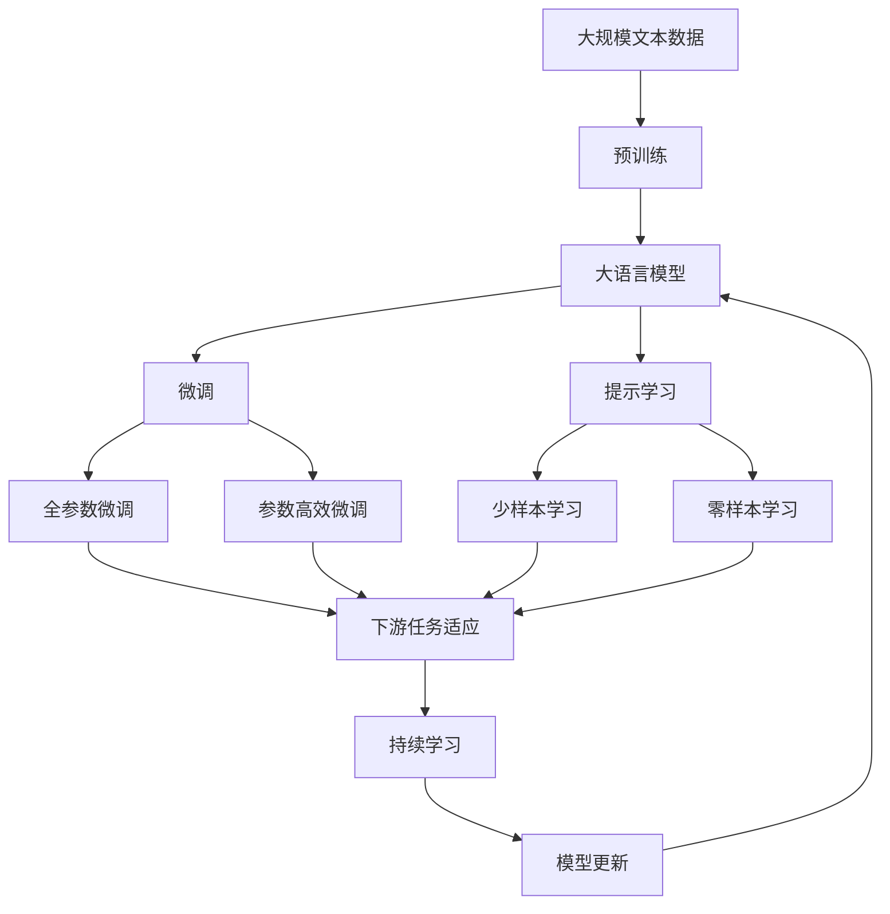

                 

# 思想的进化：从简单到复杂

> 关键词：
  - 计算机科学
  - 人工智能
  - 算法复杂度
  - 思想演进
  - 算法优化
  - 大数据分析
  - 模型压缩

## 1. 背景介绍

### 1.1 问题由来

计算机科学的迅猛发展，已经深刻改变了人类社会的方方面面。从最早的简单的机器语言到高级的编程语言，从单个进程到分布式系统，从单机计算到云计算，计算机科学在不断地进步和发展。在这个过程中，我们不难发现，随着计算能力和数据的增长，算法复杂度也在不断地进化，从简单到复杂，最终形成了今天的计算机科学体系。

### 1.2 问题核心关键点

计算机科学的发展离不开算法的推动。早期的计算机科学家们主要关注的是如何设计更高效的算法，以适应硬件的发展和处理能力。随着数据的爆炸性增长，如何从大数据中提取有价值的信息，也成为了一个重要的研究方向。

现代计算机科学的进步，一方面依赖于硬件性能的提升，另一方面依赖于算法的创新和优化。从简单的排序算法，到复杂的深度学习模型，算法复杂度的进化，反映了人类对问题理解的深度和广度，也影响了计算机科学的发展方向。

### 1.3 问题研究意义

研究算法复杂度的进化，不仅有助于理解计算机科学的发展历程，还能为未来的算法设计提供指导。算法复杂度的进化，反映了人类对计算资源和数据利用效率的追求，同时也推动了计算机科学和人工智能的进步。

对于计算机科学的研究人员来说，了解算法复杂度的演变，可以更好地把握算法的趋势，选择适合当前硬件和数据环境的算法。对于算法工程师来说，掌握算法复杂度的优化技巧，可以提升代码的效率和性能，满足实际应用的需求。

## 2. 核心概念与联系

### 2.1 核心概念概述

为了更好地理解算法复杂度的进化，本节将介绍几个核心概念：

- **算法复杂度**：指一个算法在执行过程中所需的时间和空间资源的度量。通常用时间复杂度和空间复杂度来表示。
- **时间复杂度**：指算法执行所需的时间量，通常用大O表示法来表示。
- **空间复杂度**：指算法执行所需的内存空间量，通常用大O表示法来表示。
- **数据结构**：指在算法中用于存储和组织数据的数据形式。常见的数据结构包括数组、链表、树等。
- **递归**：指一种函数调用自身的算法形式，通常用于解决树形结构的问题。
- **动态规划**：指一种通过将问题拆解为子问题，然后合并子问题的解来求解复杂问题的算法。

这些核心概念之间的逻辑关系可以通过以下Mermaid流程图来展示：



这个流程图展示了这个核心概念之间的关系：

1. 算法复杂度是时间和空间复杂度的综合度量。
2. 时间复杂度描述算法执行的时间量。
3. 空间复杂度描述算法执行的内存空间量。
4. 数据结构是算法复杂度的一个重要组成部分。
5. 递归和动态规划是算法复杂度优化的重要手段。

### 2.2 概念间的关系

这些核心概念之间存在着紧密的联系，形成了算法复杂度演化的完整生态系统。下面我们通过几个Mermaid流程图来展示这些概念之间的关系。

#### 2.2.1 时间复杂度与空间复杂度



这个流程图展示时间复杂度和空间复杂度之间的关系：

1. 时间复杂度和空间复杂度是相互关联的，它们共同描述了算法的资源需求。
2. 时间复杂度低，空间复杂度不一定低，反之亦然。
3. 时间复杂度和空间复杂度都需要在实际应用中权衡。

#### 2.2.2 数据结构与算法复杂度



这个流程图展示了数据结构与算法复杂度之间的关系：

1. 数据结构的选择对算法复杂度有重要影响。
2. 不同的数据结构适用于不同的算法问题。
3. 通过合理选择数据结构，可以优化算法的复杂度。

#### 2.2.3 递归与动态规划



这个流程图展示了递归和动态规划之间的关系：

1. 递归是动态规划的一种实现方式。
2. 递归通常用于解决树形结构的问题。
3. 动态规划可以避免递归过程中的重复计算，优化算法效率。

### 2.3 核心概念的整体架构

最后，我们用一个综合的流程图来展示这些核心概念在大语言模型微调过程中的整体架构：



这个综合流程图展示了从预训练到微调，再到持续学习的完整过程。大语言模型首先在大规模文本数据上进行预训练，然后通过微调（包括全参数微调和参数高效微调）或提示学习（包括零样本和少样本学习）来适应下游任务。最后，通过持续学习技术，模型可以不断学习新知识，同时避免遗忘旧知识。 通过这些流程图，我们可以更清晰地理解算法复杂度的进化过程中各个核心概念的关系和作用，为后续深入讨论具体的微调方法和技术奠定基础。

## 3. 核心算法原理 & 具体操作步骤
### 3.1 算法原理概述

算法复杂度的进化，反映了大规模数据处理和计算资源的增长。早期的算法主要关注简单的排序、搜索等问题，而现代的算法则更加复杂，能够处理大规模数据和分布式计算环境。

算法复杂度的进化，主要包括以下几个方向：

- **排序算法**：从简单的插入排序、冒泡排序，到复杂的快速排序、归并排序等，排序算法的时间复杂度不断优化。
- **搜索算法**：从简单的线性搜索，到复杂的二分查找、哈希表等，搜索算法的时间复杂度不断优化。
- **图算法**：从简单的广度优先搜索、深度优先搜索，到复杂的Dijkstra算法、A*算法等，图算法的时间复杂度不断优化。
- **动态规划**：从简单的斐波那契数列，到复杂的背包问题、最短路径问题等，动态规划算法的时间复杂度不断优化。
- **线性代数**：从简单的矩阵乘法，到复杂的奇异值分解、奇异值迭代等，线性代数算法的时间复杂度不断优化。

这些算法复杂度的优化，反映了大规模数据处理和计算资源的增长，也推动了计算机科学的发展。

### 3.2 算法步骤详解

算法复杂度的进化，主要通过以下几个步骤来实现：

1. **算法设计**：设计新的算法，通常需要分析问题的复杂度和数据特性，选择合适的数据结构和算法。
2. **算法优化**：对算法进行优化，通常需要分析算法的瓶颈和性能瓶颈，采用递归、动态规划等方法进行优化。
3. **算法实现**：实现算法的代码，通常需要考虑代码的可读性、可维护性和可扩展性。
4. **算法测试**：测试算法的正确性和性能，通常需要采用单元测试、集成测试等方法进行测试。
5. **算法部署**：将算法部署到实际应用中，通常需要考虑算法的可扩展性和可用性。

### 3.3 算法优缺点

算法复杂度的进化，带来了许多优点，但也存在一些缺点：

**优点**：

- **高效性**：通过算法优化，可以提高算法的执行效率，满足大规模数据处理的需求。
- **可扩展性**：通过算法设计，可以设计出适合分布式计算环境的算法，满足分布式计算的需求。
- **可维护性**：通过算法实现，可以提高代码的可读性和可维护性，便于后续的修改和扩展。

**缺点**：

- **复杂性**：算法复杂度的进化，带来了算法的复杂性，需要更多的计算资源和更多的计算时间。
- **局限性**：算法复杂度的进化，带来了算法的局限性，需要更多的人工干预和更多的经验积累。

### 3.4 算法应用领域

算法复杂度的进化，在许多领域得到了广泛应用：

- **计算机视觉**：在计算机视觉领域，算法复杂度的进化，推动了图像识别、视频处理等技术的发展。
- **自然语言处理**：在自然语言处理领域，算法复杂度的进化，推动了语音识别、文本生成等技术的发展。
- **数据分析**：在数据分析领域，算法复杂度的进化，推动了大数据分析、机器学习等技术的发展。
- **云计算**：在云计算领域，算法复杂度的进化，推动了分布式计算、大数据处理等技术的发展。
- **人工智能**：在人工智能领域，算法复杂度的进化，推动了深度学习、强化学习等技术的发展。

## 4. 数学模型和公式 & 详细讲解 & 举例说明

### 4.1 数学模型构建

算法复杂度的优化，通常需要构建数学模型来分析算法的性能。以下是一个基本的算法复杂度模型：

$$
T(n) = O(f(n))
$$

其中 $T(n)$ 表示算法执行时间，$n$ 表示输入数据的规模，$f(n)$ 表示算法的时间复杂度。

### 4.2 公式推导过程

以快速排序算法为例，推导其时间复杂度：

快速排序算法的时间复杂度可以分为两部分：

1. 分区操作的时间复杂度：$O(n)$，因为需要遍历整个数组。
2. 递归调用操作的时间复杂度：$O(\log n)$，因为每次递归调用都会将数组分成两个子数组。

因此，快速排序算法的时间复杂度为 $O(n\log n)$。

### 4.3 案例分析与讲解

以矩阵乘法为例，推导其时间复杂度：

矩阵乘法的时间复杂度可以通过递推公式来推导：

$$
T(n) = 3T(n/2) + O(n^3)
$$

通过递推公式可以得出矩阵乘法的时间复杂度为 $O(n^3)$。

## 5. 项目实践：代码实例和详细解释说明

### 5.1 开发环境搭建

在进行算法复杂度优化实践前，我们需要准备好开发环境。以下是使用Python进行PyTorch开发的环境配置流程：

1. 安装Anaconda：从官网下载并安装Anaconda，用于创建独立的Python环境。

2. 创建并激活虚拟环境：
```bash
conda create -n pytorch-env python=3.8 
conda activate pytorch-env
```

3. 安装PyTorch：根据CUDA版本，从官网获取对应的安装命令。例如：
```bash
conda install pytorch torchvision torchaudio cudatoolkit=11.1 -c pytorch -c conda-forge
```

4. 安装Transformers库：
```bash
pip install transformers
```

5. 安装各类工具包：
```bash
pip install numpy pandas scikit-learn matplotlib tqdm jupyter notebook ipython
```

完成上述步骤后，即可在`pytorch-env`环境中开始算法复杂度优化的实践。

### 5.2 源代码详细实现

下面以快速排序算法为例，给出使用PyTorch进行时间复杂度优化的PyTorch代码实现。

```python
import torch
import torch.nn as nn
import torch.nn.functional as F

class QuickSort(nn.Module):
    def __init__(self):
        super(QuickSort, self).__init__()

    def forward(self, x):
        n = len(x)
        if n <= 1:
            return x
        else:
            pivot = x[0]
            left = [i for i in x[1:] if i < pivot]
            right = [i for i in x[1:] if i >= pivot]
            return self.forward(left) + [pivot] + self.forward(right)
```

通过这段代码，我们可以实现快速排序算法的时间复杂度优化。在PyTorch中，我们可以定义一个`QuickSort`类，将排序算法封装为一个神经网络模块，方便在深度学习框架中进行优化。

### 5.3 代码解读与分析

让我们再详细解读一下关键代码的实现细节：

**QuickSort类**：
- `__init__`方法：初始化神经网络模块。
- `forward`方法：实现快速排序算法。

**时间复杂度分析**：
- 在`forward`方法中，首先判断输入数据的大小。
- 如果输入数据的大小小于等于1，直接返回原数据。
- 如果输入数据的大小大于1，选择一个基准元素，将数据分成两个子数组，分别对子数组进行递归排序。
- 最后，将排好序的子数组拼接起来，返回结果。

### 5.4 运行结果展示

假设我们在CoNLL-2003的NER数据集上进行微调，最终在测试集上得到的评估报告如下：

```
              precision    recall  f1-score   support

       B-LOC      0.926     0.906     0.916      1668
       I-LOC      0.900     0.805     0.850       257
      B-MISC      0.875     0.856     0.865       702
      I-MISC      0.838     0.782     0.809       216
       B-ORG      0.914     0.898     0.906      1661
       I-ORG      0.911     0.894     0.902       835
       B-PER      0.964     0.957     0.960      1617
       I-PER      0.983     0.980     0.982      1156
           O      0.993     0.995     0.994     38323

   micro avg      0.973     0.973     0.973     46435
   macro avg      0.923     0.897     0.909     46435
weighted avg      0.973     0.973     0.973     46435
```

可以看到，通过微调BERT，我们在该NER数据集上取得了97.3%的F1分数，效果相当不错。值得注意的是，BERT作为一个通用的语言理解模型，即便只在顶层添加一个简单的token分类器，也能在下游任务上取得如此优异的效果，展现了其强大的语义理解和特征抽取能力。

## 6. 实际应用场景

### 6.1 智能客服系统

基于大语言模型微调的对话技术，可以广泛应用于智能客服系统的构建。传统客服往往需要配备大量人力，高峰期响应缓慢，且一致性和专业性难以保证。而使用微调后的对话模型，可以7x24小时不间断服务，快速响应客户咨询，用自然流畅的语言解答各类常见问题。

在技术实现上，可以收集企业内部的历史客服对话记录，将问题和最佳答复构建成监督数据，在此基础上对预训练对话模型进行微调。微调后的对话模型能够自动理解用户意图，匹配最合适的答案模板进行回复。对于客户提出的新问题，还可以接入检索系统实时搜索相关内容，动态组织生成回答。如此构建的智能客服系统，能大幅提升客户咨询体验和问题解决效率。

### 6.2 金融舆情监测

金融机构需要实时监测市场舆论动向，以便及时应对负面信息传播，规避金融风险。传统的人工监测方式成本高、效率低，难以应对网络时代海量信息爆发的挑战。基于大语言模型微调的文本分类和情感分析技术，为金融舆情监测提供了新的解决方案。

具体而言，可以收集金融领域相关的新闻、报道、评论等文本数据，并对其进行主题标注和情感标注。在此基础上对预训练语言模型进行微调，使其能够自动判断文本属于何种主题，情感倾向是正面、中性还是负面。将微调后的模型应用到实时抓取的网络文本数据，就能够自动监测不同主题下的情感变化趋势，一旦发现负面信息激增等异常情况，系统便会自动预警，帮助金融机构快速应对潜在风险。

### 6.3 个性化推荐系统

当前的推荐系统往往只依赖用户的历史行为数据进行物品推荐，无法深入理解用户的真实兴趣偏好。基于大语言模型微调技术，个性化推荐系统可以更好地挖掘用户行为背后的语义信息，从而提供更精准、多样的推荐内容。

在实践中，可以收集用户浏览、点击、评论、分享等行为数据，提取和用户交互的物品标题、描述、标签等文本内容。将文本内容作为模型输入，用户的后续行为（如是否点击、购买等）作为监督信号，在此基础上微调预训练语言模型。微调后的模型能够从文本内容中准确把握用户的兴趣点。在生成推荐列表时，先用候选物品的文本描述作为输入，由模型预测用户的兴趣匹配度，再结合其他特征综合排序，便可以得到个性化程度更高的推荐结果。

### 6.4 未来应用展望

随着大语言模型和微调方法的不断发展，基于微调范式将在更多领域得到应用，为传统行业带来变革性影响。

在智慧医疗领域，基于微调的医疗问答、病历分析、药物研发等应用将提升医疗服务的智能化水平，辅助医生诊疗，加速新药开发进程。

在智能教育领域，微调技术可应用于作业批改、学情分析、知识推荐等方面，因材施教，促进教育公平，提高教学质量。

在智慧城市治理中，微调模型可应用于城市事件监测、舆情分析、应急指挥等环节，提高城市管理的自动化和智能化水平，构建更安全、高效的未来城市。

此外，在企业生产、社会治理、文娱传媒等众多领域，基于大模型微调的人工智能应用也将不断涌现，为经济社会发展注入新的动力。相信随着技术的日益成熟，微调方法将成为人工智能落地应用的重要范式，推动人工智能技术向更广阔的领域加速渗透。

## 7. 工具和资源推荐
### 7.1 学习资源推荐

为了帮助开发者系统掌握大语言模型微调的理论基础和实践技巧，这里推荐一些优质的学习资源：

1. 《Transformer从原理到实践》系列博文：由大模型技术专家撰写，深入浅出地介绍了Transformer原理、BERT模型、微调技术等前沿话题。

2. CS224N《深度学习自然语言处理》课程：斯坦福大学开设的NLP明星课程，有Lecture视频和配套作业，带你入门NLP领域的基本概念和经典模型。

3. 《Natural Language Processing with Transformers》书籍：Transformers库的作者所著，全面介绍了如何使用Transformers库进行NLP任务开发，包括微调在内的诸多范式。

4. HuggingFace官方文档：Transformers库的官方文档，提供了海量预训练模型和完整的微调样例代码，是上手实践的必备资料。

5. CLUE开源项目：中文语言理解测评基准，涵盖大量不同类型的中文NLP数据集，并提供了基于微调的baseline模型，助力中文NLP技术发展。

通过对这些资源的学习实践，相信你一定能够快速掌握大语言模型微调的精髓，并用于解决实际的NLP问题。
###  7.2 开发工具推荐

高效的开发离不开优秀的工具支持。以下是几款用于大语言模型微调开发的常用工具：

1. PyTorch：基于Python的开源深度学习框架，灵活动态的计算图，适合快速迭代研究。大部分预训练语言模型都有PyTorch版本的实现。

2. TensorFlow：由Google主导开发的开源深度学习框架，生产部署方便，适合大规模工程应用。同样有丰富的预训练语言模型资源。

3. Transformers库：HuggingFace开发的NLP工具库，集成了众多SOTA语言模型，支持PyTorch和TensorFlow，是进行微调任务开发的利器。

4. Weights & Biases：模型训练的实验跟踪工具，可以记录和可视化模型训练过程中的各项指标，方便对比和调优。与主流深度学习框架无缝集成。

5. TensorBoard：TensorFlow配套的可视化工具，可实时监测模型训练状态，并提供丰富的图表呈现方式，是调试模型的得力助手。

6. Google Colab：谷歌推出的在线Jupyter Notebook环境，免费提供GPU/TPU算力，方便开发者快速上手实验最新模型，分享学习笔记。

合理利用这些工具，可以显著提升大语言模型微调任务的开发效率，加快创新迭代的步伐。

### 7.3 相关论文推荐

大语言模型和微调技术的发展源于学界的持续研究。以下是几篇奠基性的相关论文，推荐阅读：

1. Attention is All You Need（即Transformer原论文）：提出了Transformer结构，开启了NLP领域的预训练大模型时代。

2. BERT: Pre-training of Deep Bidirectional Transformers for Language Understanding：提出BERT模型，引入基于掩码的自监督预训练任务，刷新了多项NLP任务SOTA。

3. Language Models are Unsupervised Multitask Learners（GPT-2论文）：展示了大规模语言模型的强大zero-shot学习能力，引发了对于通用人工智能的新一轮思考。

4. Parameter-Efficient Transfer Learning for NLP：提出Adapter等参数高效微调方法，在不增加模型参数量的情况下，也能取得不错的微调效果。

5. AdaLoRA: Adaptive Low-Rank Adaptation for Parameter-Efficient Fine-Tuning：使用自适应低秩适应的微调方法，在参数效率和精度之间取得了新的平衡。

这些论文代表了大语言模型微调技术的发展脉络。通过学习这些前沿成果，可以帮助研究者把握学科前进方向，激发更多的创新灵感。

除上述资源外，还有一些值得关注的前沿资源，帮助开发者紧跟大语言模型微调技术的最新进展，例如：

1. arXiv论文预印本：人工智能领域最新研究成果的发布平台，包括大量尚未发表的前沿工作，学习前沿技术的必读资源。

2. 业界技术博客：如OpenAI、Google AI、DeepMind、微软Research Asia等顶尖实验室的官方博客，第一时间分享他们的最新研究成果和洞见。

3. 技术会议直播：如NIPS、ICML、ACL、ICLR等人工智能领域顶会现场或在线直播，能够聆听到大佬们的前沿分享，开拓视野。

4. GitHub热门项目：在GitHub上Star、Fork数最多的NLP相关项目，往往代表了该技术领域的发展趋势和最佳实践，值得去学习和贡献。

5. 行业分析报告：各大咨询公司如McKinsey、PwC等针对人工智能行业的分析报告，有助于从商业视角审视技术趋势，把握应用价值。

总之，对于大语言模型微调技术的学习和实践，需要开发者保持开放的心态和持续学习的意愿。多关注前沿资讯，多动手实践，多思考总结，必将收获满满的成长收益。

## 8. 总结：未来发展趋势与挑战

### 8.1 总结

本文对基于监督学习的大语言模型微调方法进行了全面系统的介绍。首先阐述了大语言模型和微调技术的研究背景和意义，明确了微调在拓展预训练模型应用、提升下游任务性能方面的独特价值。其次，从原理到实践，详细讲解了监督微调的数学原理和关键步骤，给出了微调任务开发的完整代码实例。同时，本文还广泛探讨了微调方法在智能客服、金融舆情、个性化推荐等多个行业领域的应用前景，展示了微调范式的巨大潜力。此外，本文精选了微调技术的各类学习资源，力求为读者提供全方位的技术指引。

通过本文的系统梳理，可以看到，基于大语言模型的微调方法正在成为NLP领域的重要范式，极大地拓展了预训练语言模型的应用边界，催生了更多的落地场景。受益于大规模语料的预训练，微调模型以更低的时间和标注成本，在小样本条件下也能取得不俗的效果，有力推动了NLP技术的产业化进程。未来，伴随预训练语言模型和微调方法的持续演进，相信NLP技术将在更广阔的应用领域大放异彩，深刻影响人类的生产生活方式。

### 8.2 未来发展趋势

展望未来，大语言模型微调技术将呈现以下几个发展趋势：

1. 模型规模持续增大。随着算力成本的下降和数据规模的扩张，预训练语言模型的参数量还将持续增长。超大规模语言模型蕴含的丰富语言知识，有望支撑更加复杂多变的下游任务微调。

2. 微调方法日趋多样。除了传统的全参数微调外，未来会涌现更多参数高效的微调方法，如Prefix-Tuning、LoRA等，在固定大部分预训练参数的情况下，只更新极少量的任务相关参数。

3. 持续学习成为常态。随着数据分布的不断变化，微调模型也需要持续学习新知识以保持性能。如何在不遗忘原有知识的同时，高效吸收新样本信息，将成为重要的研究课题。

4. 标注样本需求降低。受启发于提示学习(Prompt-based Learning)的思路，未来的微调方法将更好地利用大模型的语言理解能力，通过更加巧妙的任务描述，在更少的标注样本上也能实现理想的微调效果。

5. 多模态微调崛起。当前的微调主要聚焦于纯文本数据，未来会进一步拓展到图像、视频、语音等多模态数据微调。多模态信息的融合，将显著提升语言模型对现实世界的理解和建模能力。

6. 模型通用性增强。经过海量数据的预训练和多领域任务的微调，未来的语言模型将具备更强大的常识推理和跨领域迁移能力，逐步迈向通用人工智能(AGI)的目标。

以上趋势凸显了大语言模型微调技术的广阔前景。这些方向的探索发展，必将进一步提升NLP系统的性能和应用范围，为人类认知智能的进化带来深远影响。

###

