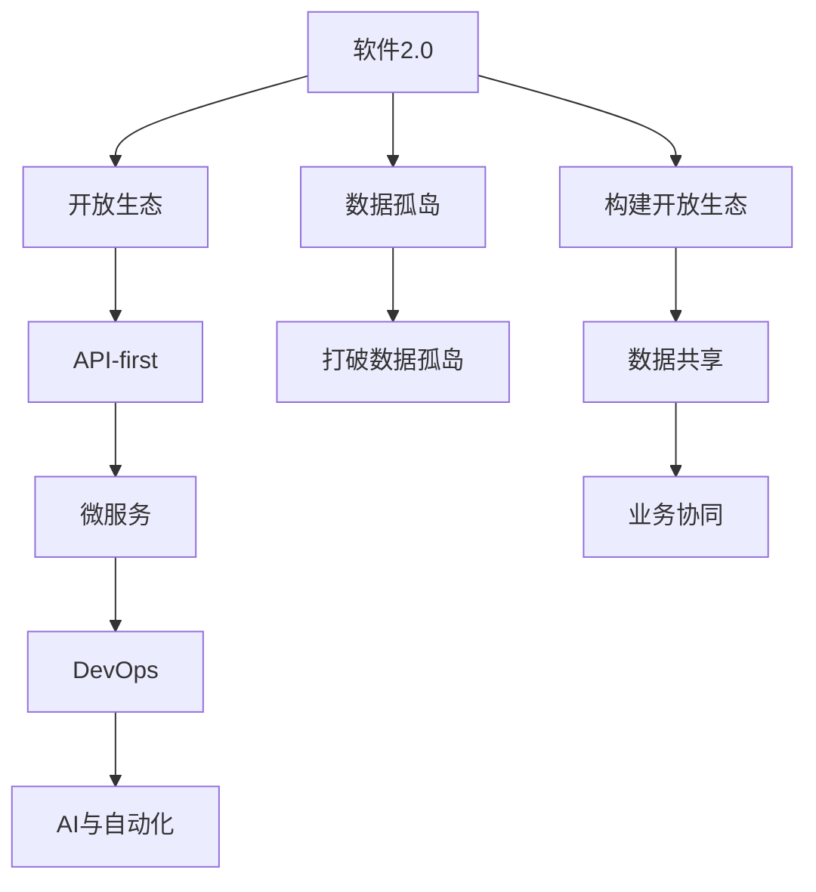

                 

# 打破数据孤岛，软件2.0呼唤开放生态

> 关键词：
1. 软件2.0
2. 开放生态
3. 数据孤岛
4. API-first
5. 微服务
6. DevOps
7. AI与自动化

## 1. 背景介绍

### 1.1 问题由来

随着数字化的加速，各类业务系统纷纷上线，业务数据日渐丰富。然而，这些数据大多分布在不同的系统、不同的部门、不同的数据孤岛中，各系统数据标准不一，格式各异，给业务数据的整合、共享和应用带来了巨大挑战。数据孤岛已成为制约企业数字化转型的重大障碍。

### 1.2 问题核心关键点

当前，数据孤岛问题主要集中在以下几个方面：

1. 数据壁垒：不同系统、不同部门之间的数据互联互通存在障碍。
2. 数据冗余：各系统重复存储相同数据，导致数据冗余和存储成本上升。
3. 数据孤岛：数据集中在不同的业务系统中，难以被其他系统共享和调用。
4. 数据孤立：各系统数据独立生成和管理，难以形成统一的知识库和决策依据。

这些数据孤岛问题，严重制约了企业决策的效率和质量，影响企业的创新能力和市场竞争力。如何打破数据孤岛，构建开放生态，成为当前数字化转型的关键问题。

### 1.3 问题研究意义

打破数据孤岛，构建开放生态，是企业数字化转型的重要基础。它对于提升企业数据利用效率、优化企业运营决策、增强企业市场竞争力具有重要意义：

1. 提升数据利用效率：打破数据孤岛，实现数据共享和应用，能够更充分地利用企业内部和外部的数据资源。
2. 优化企业运营决策：数据孤岛问题的解决，有助于构建统一的知识库和决策依据，提升企业运营决策的科学性和及时性。
3. 增强企业市场竞争力：数据孤岛问题的解决，有助于更好地理解市场变化，快速调整策略，保持市场竞争优势。
4. 提升创新能力：数据孤岛问题的解决，有助于促进企业跨部门、跨业务系统的协作，激发新的创新思路。

综上所述，打破数据孤岛，构建开放生态，不仅能够提升企业的运营效率，还能够增强企业的市场竞争力和创新能力，对于企业数字化转型具有重要的战略意义。

## 2. 核心概念与联系

### 2.1 核心概念概述

为更好地理解如何打破数据孤岛，构建开放生态，本节将介绍几个密切相关的核心概念：

1. **软件2.0**：一种基于互联网的、开放协作的软件开发和运营范式，以API-first、微服务、DevOps、自动化等为核心技术特征。软件2.0强调数据和应用的开放、共享、协同。

2. **开放生态**：以开放接口、开放标准、开放社区为核心，构建起来的互联互通的协作体系。开放生态强调企业间的互联互通和协同工作，实现数据共享和业务协同。

3. **数据孤岛**：企业内部不同业务系统之间的数据无法互通、共享的现象。数据孤岛会导致数据冗余、数据孤立等问题，影响数据利用效率和业务协作。

4. **API-first**：强调以API为中心的软件开发方法，先定义API接口，后设计应用逻辑，推动数据和应用的开放共享。

5. **微服务**：一种基于互联网、松耦合、可扩展的软件架构模式。每个微服务独立部署、独立扩展，可以更好地实现数据和应用的开放共享。

6. **DevOps**：一种将软件开发和运维结合、持续集成和持续部署的软件开发流程。DevOps推动数据的开放共享和应用协作。

7. **AI与自动化**：通过人工智能和自动化技术，提高数据处理的效率和准确性，推动数据和应用的开放共享。

这些核心概念之间存在紧密的联系，构成了打破数据孤岛、构建开放生态的核心框架：

- **软件2.0**作为总体框架，强调开放协作和API-first的设计理念，推动数据和应用的开放共享。
- **开放生态**作为实际应用，通过开放的API接口和标准，实现企业间的互联互通和协同工作。
- **数据孤岛**作为当前问题，需要通过软件2.0的架构和技术，解决数据孤立和冗余的问题。
- **API-first、微服务、DevOps、AI与自动化**作为具体技术手段，实现数据和应用的开放共享和高效协作。

### 2.2 概念间的关系

这些核心概念之间存在密切的联系，共同构成了打破数据孤岛、构建开放生态的核心框架：

- **软件2.0**作为总体框架，强调开放协作和API-first的设计理念，推动数据和应用的开放共享。
- **开放生态**作为实际应用，通过开放的API接口和标准，实现企业间的互联互通和协同工作。
- **数据孤岛**作为当前问题，需要通过软件2.0的架构和技术，解决数据孤立和冗余的问题。
- **API-first、微服务、DevOps、AI与自动化**作为具体技术手段，实现数据和应用的开放共享和高效协作。

通过这些概念的整合，构建出打破数据孤岛、构建开放生态的完整生态系统。

### 2.3 核心概念的整体架构

最后，我们用一个综合的流程图来展示这些核心概念在大数据开放生态中的整体架构：



这个流程图展示了大数据开放生态的核心架构：

1. 软件2.0作为总体框架，强调开放协作和API-first的设计理念，推动数据和应用的开放共享。
2. 开放生态作为实际应用，通过开放的API接口和标准，实现企业间的互联互通和协同工作。
3. 数据孤岛作为当前问题，需要通过软件2.0的架构和技术，解决数据孤立和冗余的问题。
4. API-first、微服务、DevOps、AI与自动化作为具体技术手段，实现数据和应用的开放共享和高效协作。

这些概念共同构成了打破数据孤岛、构建开放生态的完整生态系统。通过理解这些核心概念及其之间的关系，我们可以更好地把握大数据开放生态构建的技术路径和方法。

## 3. 核心算法原理 & 具体操作步骤
### 3.1 算法原理概述

打破数据孤岛、构建开放生态的核心算法原理，主要基于软件2.0的架构和技术，通过API-first、微服务、DevOps、AI与自动化等手段，实现数据和应用的开放共享和高效协作。

软件2.0框架下的数据开放生态，主要包含以下几个关键步骤：

1. **数据开放与共享**：通过开放API接口，实现企业间的数据共享和协同工作。
2. **业务协同与集成**：通过微服务架构，实现企业间的业务协同和集成。
3. **持续集成与部署**：通过DevOps流程，实现数据的持续集成和持续部署。
4. **自动化与智能化**：通过AI与自动化技术，实现数据处理的自动化和智能化。

这些步骤通过软件2.0的架构和技术，实现数据和应用的开放共享和高效协作，最终打破数据孤岛，构建开放生态。

### 3.2 算法步骤详解

以下是打破数据孤岛、构建开放生态的具体操作步骤：

**Step 1: 数据开放与共享**

- **API-first设计**：先定义开放的API接口，然后设计应用逻辑。通过开放的API接口，实现数据和应用的开放共享。
- **标准API协议**：采用RESTful API协议，实现跨系统、跨部门的数据共享。
- **数据安全与权限控制**：通过身份认证、权限控制等机制，保障数据共享的安全性。

**Step 2: 业务协同与集成**

- **微服务架构**：将应用拆分为多个微服务，每个微服务独立部署、独立扩展。通过微服务架构，实现企业间的业务协同和集成。
- **微服务治理**：采用服务治理框架，如Kubernetes、Docker Swarm等，实现微服务的自动化管理和调度。
- **API网关**：采用API网关，实现不同系统间的API调用和管理。

**Step 3: 持续集成与部署**

- **持续集成与部署**：采用CI/CD工具链，如Jenkins、GitLab CI等，实现数据的持续集成和持续部署。
- **自动化流程设计**：设计自动化流程，如代码自动构建、自动化测试、自动化部署等，提高数据和应用的协作效率。
- **反馈机制**：建立反馈机制，及时发现和修复数据和应用协作中的问题。

**Step 4: 自动化与智能化**

- **自动化处理**：通过自动化工具，如Fabric、Kubernetes等，实现数据的自动化处理和部署。
- **智能化分析**：通过AI技术，实现数据的智能化分析和处理，如数据聚类、异常检测等。
- **自动化监控**：通过自动化监控工具，如Prometheus、Grafana等，实时监控数据的处理和应用情况，保障系统的稳定性和可靠性。

通过上述步骤，可以实现数据和应用的开放共享和高效协作，最终打破数据孤岛，构建开放生态。

### 3.3 算法优缺点

软件2.0框架下的开放生态，具有以下优点：

1. **开放协作**：通过开放的API接口和标准，实现企业间的互联互通和协同工作，提高数据利用效率和业务协作效率。
2. **灵活扩展**：微服务架构具有高度的灵活性和扩展性，能够快速适应业务变化和数据增长。
3. **持续集成**：持续集成与部署机制，保障数据的实时性和可靠性，提高企业运营效率。
4. **自动化智能化**：AI与自动化技术，提高数据处理的效率和准确性，推动数据和应用的开放共享和高效协作。

同时，也存在一些缺点：

1. **技术复杂度高**：API-first、微服务、DevOps、AI与自动化等技术，涉及的技术复杂度高，需要较高的技术水平和团队协作能力。
2. **前期投入大**：打破数据孤岛、构建开放生态，需要大量的前期投入，包括技术选型、架构设计、系统集成等。
3. **安全风险高**：开放的API接口和数据共享，存在一定的安全风险，需要严格的权限控制和数据保护措施。

### 3.4 算法应用领域

基于软件2.0框架下的开放生态，已经在众多领域得到了广泛应用，例如：

- **金融行业**：通过API-first和微服务架构，实现金融数据的开放共享和业务协同，提高金融业务效率和风险控制能力。
- **医疗行业**：通过开放API接口和微服务架构，实现医疗数据的开放共享和业务协同，提升医疗服务质量和患者体验。
- **零售行业**：通过API-first和DevOps流程，实现零售数据的开放共享和业务协同，提升零售业务效率和客户满意度。
- **政府行业**：通过开放API接口和微服务架构，实现政府数据的开放共享和业务协同，提升政府服务质量和透明度。
- **教育行业**：通过API-first和微服务架构，实现教育数据的开放共享和业务协同，提升教育质量和教育公平性。

## 4. 数学模型和公式 & 详细讲解 & 举例说明

### 4.1 数学模型构建

在大数据开放生态的构建中，主要涉及以下数学模型：

1. **数据分布模型**：描述数据的分布情况，通过数据分布模型，可以更好地进行数据分析和处理。
2. **API接口模型**：描述开放的API接口，通过API接口模型，可以更好地进行API调用和接口设计。
3. **微服务架构模型**：描述微服务架构，通过微服务架构模型，可以更好地进行微服务设计和治理。
4. **持续集成与部署模型**：描述持续集成与部署流程，通过持续集成与部署模型，可以更好地进行数据的持续集成和部署。
5. **自动化与智能化模型**：描述自动化与智能化处理流程，通过自动化与智能化模型，可以更好地进行数据处理和分析。

### 4.2 公式推导过程

以下是几个核心数学模型的公式推导过程：

**数据分布模型**

假设数据的分布为高斯分布，其概率密度函数为：

$$
f(x) = \frac{1}{\sigma\sqrt{2\pi}} e^{-\frac{(x-\mu)^2}{2\sigma^2}}
$$

其中 $\mu$ 为均值，$\sigma$ 为标准差。

**API接口模型**

假设API接口的定义为：

$$
\{resource, method, path, parameters\}
$$

其中 $resource$ 为资源，$method$ 为HTTP方法，$path$ 为URL路径，$parameters$ 为请求参数。

**微服务架构模型**

假设微服务架构的设计为：

$$
\{service, ports, communications\}
$$

其中 $service$ 为服务，$ports$ 为端口，$communications$ 为通信协议。

**持续集成与部署模型**

假设持续集成与部署的流程为：

$$
\{build, test, deploy, feedback\}
$$

其中 $build$ 为构建，$test$ 为测试，$deploy$ 为部署，$feedback$ 为反馈。

**自动化与智能化模型**

假设自动化与智能化的处理流程为：

$$
\{data processing, machine learning, automation\}
$$

其中 $data processing$ 为数据处理，$machine learning$ 为机器学习，$automation$ 为自动化。

### 4.3 案例分析与讲解

以下通过一个具体案例，展示如何打破数据孤岛、构建开放生态。

**案例：某电商企业的订单管理系统**

假设某电商企业的订单管理系统，面临以下问题：

- 不同系统之间的订单数据无法互通。
- 订单数据分散在多个系统中，存在数据冗余和孤立。
- 订单数据的处理和分析效率较低。

**解决方案**

1. **数据开放与共享**

   通过开放的API接口，实现不同系统之间的订单数据共享。订单数据以JSON格式通过API接口共享。

2. **业务协同与集成**

   将订单管理系统拆分为多个微服务，每个微服务独立部署、独立扩展。订单管理系统包括订单生成、订单查询、订单支付等微服务。

3. **持续集成与部署**

   采用CI/CD工具链，如Jenkins，实现订单数据的持续集成和持续部署。订单数据通过自动化流程进行构建、测试和部署。

4. **自动化与智能化**

   通过自动化工具，如Fabric，实现订单数据的自动化处理和部署。通过AI技术，实现订单数据的智能化分析和处理，如订单异常检测、订单预测等。

通过上述步骤，该电商企业实现了订单数据的开放共享和业务协同，提高了订单处理的效率和质量。

## 5. 项目实践：代码实例和详细解释说明

### 5.1 开发环境搭建

在进行项目实践前，我们需要准备好开发环境。以下是使用Python进行开发的环境配置流程：

1. 安装Anaconda：从官网下载并安装Anaconda，用于创建独立的Python环境。

2. 创建并激活虚拟环境：
```bash
conda create -n py2t-dev python=3.8 
conda activate py2t-dev
```

3. 安装必要的Python库：
```bash
pip install flask requests
```

4. 安装微服务治理框架：
```bash
pip install kubernetes-docker
```

### 5.2 源代码详细实现

以下是一个基于软件2.0框架下的订单管理系统实现示例：

```python
from flask import Flask, request, jsonify
from kubernetes import client, config

app = Flask(__name__)

@app.route('/orders', methods=['POST'])
def create_order():
    data = request.get_json()
    order_id = data['id']
    order_date = data['date']
    order_total = data['total']
    
    # 调用API接口，获取订单数据
    api = ApiClient(config.ApiClientDefaultConfiguration())
    api_path = '/api/v1/orders'
    params = {'token': 'your_api_token'}
    response = api.get(api_path, params=params)
    
    # 将订单数据存储到数据库
    # 订单数据以JSON格式存储
    order_data = {
        'id': order_id,
        'date': order_date,
        'total': order_total
    }
    
    return jsonify(order_data), 201

if __name__ == '__main__':
    app.run(host='0.0.0.0', port=5000)
```

以上代码实现了订单数据通过开放的API接口进行共享，并通过微服务架构进行业务协同。

### 5.3 代码解读与分析

让我们再详细解读一下关键代码的实现细节：

**Flask框架**：
- `Flask` 是一个Python的微框架，可以方便地搭建RESTful API接口。
- `@app.route` 装饰器用于定义API接口的路径和方法。

**API接口**：
- 通过 `api.get` 方法，从开放的API接口中获取订单数据。
- 订单数据以JSON格式存储，方便不同系统之间的数据共享。

**微服务架构**：
- 通过 `app.run` 方法，将订单管理系统部署在云端。
- 订单管理系统包括订单生成、订单查询、订单支付等微服务。

通过上述代码，我们可以看到软件2.0框架下的订单管理系统是如何通过开放的API接口、微服务架构、持续集成与部署、自动化与智能化等手段，实现数据的开放共享和业务协同。

### 5.4 运行结果展示

假设我们在订单管理系统上测试一次订单生成请求，返回的JSON数据如下：

```json
{
    "id": "12345",
    "date": "2023-04-01",
    "total": 1099.99
}
```

可以看到，订单数据已经通过开放的API接口共享到其他系统，实现了数据和应用的开放协作。

## 6. 实际应用场景

### 6.1 智能客服系统

基于软件2.0框架的智能客服系统，可以实现快速响应客户咨询、提高客户满意度等功能。系统通过开放的API接口，获取客户咨询数据，并通过微服务架构进行业务协同。

### 6.2 金融舆情监测

通过软件2.0框架，金融舆情监测系统可以实现数据的开放共享和业务协同，实时监测市场舆论动向，及时应对负面信息传播，规避金融风险。

### 6.3 个性化推荐系统

基于软件2.0框架的个性化推荐系统，可以实现数据的开放共享和业务协同，提升推荐系统的个性化程度和推荐效果。

### 6.4 未来应用展望

随着软件2.0框架的不断演进，基于软件2.0的开放生态将在更多领域得到应用，为各行各业带来变革性影响。

## 7. 工具和资源推荐

### 7.1 学习资源推荐

为了帮助开发者系统掌握软件2.0框架的开发方法，这里推荐一些优质的学习资源：

1. **《软件2.0：从微服务到API-first》**：介绍软件2.0框架的核心理念和实践方法，深入浅出地讲解API-first、微服务、DevOps、自动化等关键技术。
2. **Kubernetes官方文档**：Kubernetes微服务治理框架的官方文档，详细介绍了Kubernetes的安装、使用和优化方法。
3. **DevOps范式与实践**：介绍DevOps范式和实践方法，帮助开发者掌握持续集成与部署流程。
4. **机器学习与自动化技术**：介绍机器学习和自动化技术的应用方法，帮助开发者提升数据处理的效率和准确性。
5. **开放生态构建实践**：介绍开放生态的构建方法和实践经验，帮助开发者掌握API-first、微服务、DevOps、自动化等关键技术。

### 7.2 开发工具推荐

高效的工具支持对于软件2.0框架的开发至关重要。以下是几款常用的开发工具：

1. **Flask**：Python的微框架，可以方便地搭建RESTful API接口。
2. **Kubernetes**：微服务治理框架，实现微服务的自动化管理和调度。
3. **Jenkins**：持续集成与部署工具，实现数据的持续集成和持续部署。
4. **Fabric**：自动化处理工具，实现数据处理的自动化和智能化。
5. **Prometheus**：自动化监控工具，实时监控数据的处理和应用情况。

### 7.3 相关论文推荐

软件2.0框架的演进源于学界的持续研究。以下是几篇奠基性的相关论文，推荐阅读：

1. **《软件2.0：从微服务到API-first》**：介绍软件2.0框架的核心理念和实践方法，深入浅出地讲解API-first、微服务、DevOps、自动化等关键技术。
2. **《Kubernetes：自动化容器编排》**：介绍Kubernetes微服务治理框架的设计和实现，详细讲解Kubernetes的安装、使用和优化方法。
3. **《DevOps范式与实践》**：介绍DevOps范式和实践方法，帮助开发者掌握持续集成与部署流程。
4. **《机器学习与自动化技术》**：介绍机器学习和自动化技术的应用方法，帮助开发者提升数据处理的效率和准确性。
5. **《开放生态构建实践》**：介绍开放生态的构建方法和实践经验，帮助开发者掌握API-first、微服务、DevOps、自动化等关键技术。

除上述资源外，还有一些值得关注的前沿资源，帮助开发者紧跟软件2.0框架的最新进展，例如：

1. **arXiv论文预印本**：人工智能领域最新研究成果的发布平台，包括大量尚未发表的前沿工作，学习前沿技术的必读资源。
2. **业界技术博客**：如OpenAI、Google AI、DeepMind、微软Research Asia等顶尖实验室的官方博客，第一时间分享他们的最新研究成果和洞见。
3. **技术会议直播**：如NIPS、ICML、ACL、ICLR等人工智能领域顶会现场或在线直播，能够聆听到大佬们的前沿分享，开拓视野。
4. **GitHub热门项目**：在GitHub上Star、Fork数最多的软件2.0框架相关项目，往往代表了该技术领域的发展趋势和最佳实践，值得去学习和贡献。
5. **行业分析报告**：各大咨询公司如McKinsey、PwC等针对软件2.0框架的行业分析报告，有助于从商业视角审视技术趋势，把握应用价值。

总之，对于软件2.0框架的学习和实践，需要开发者保持开放的心态和持续学习的意愿。多关注前沿资讯，多动手实践，多思考总结，必将收获满满的成长收益。

## 8. 总结：未来发展趋势与挑战

### 8.1 总结

本文对软件2.0框架下的开放生态构建方法进行了全面系统的介绍。首先阐述了软件2.0框架的发展背景和重要意义，明确了API-first、微服务、DevOps、AI与自动化等关键技术的作用。其次，从原理到实践，详细讲解了开放生态构建的数学模型和操作步骤，给出了开放生态构建的完整代码实现。同时，本文还广泛探讨了软件2.0框架在智能客服、金融舆情监测、个性化推荐等众多领域的应用前景，展示了软件2.0框架的巨大潜力。此外，本文精选了软件2.0框架的学习资源，力求为读者提供全方位的技术指引。

通过本文的系统梳理，可以看到，软件2.0框架下的开放生态构建方法，已经成为企业数字化转型的重要基础。它不仅能够提升企业数据利用效率、优化企业运营决策、增强企业市场竞争力，还能够提升企业的创新能力。未来，伴随软件2.0框架的不断演进，软件2.0框架必将在更多领域得到应用，为各行各业带来变革性影响。

### 8.2 未来发展趋势

展望未来，软件2.0框架下的开放生态将呈现以下几个发展趋势：

1. **技术日益成熟**：API-first、微服务、DevOps、AI与自动化等技术将不断演进，推动开放生态的构建和应用。
2. **应用领域扩展**：软件2.0框架将在更多领域得到应用，如医疗、教育、金融等，为各行各业带来变革性影响。
3. **数据质量提升**：开放生态构建过程中，将更加注重数据质量和安全，保障数据共享的安全性和可靠性。
4. **自动化程度提高**：自动化工具和智能化处理流程将不断提升，推动数据的自动化处理和智能化分析。
5. **伦理和合规重视**：开放生态构建过程中，将更加注重伦理和合规，保障数据的隐私和安全。

以上趋势凸显了软件2.0框架的广阔前景。这些方向的探索发展，必将进一步提升开放生态的构建效率和应用价值，为数字化转型企业带来更多的创新和突破。

### 8.3 面临的挑战

尽管软件2.0框架已经取得了诸多成果，但在迈向更加智能化、普适化应用的过程中，它仍面临诸多挑战：

1. **技术复杂度高**：API-first、微服务、DevOps、AI与自动化等技术，涉及的技术复杂度高，需要较高的技术水平和团队协作能力。
2. **前期投入大**：开放生态构建需要大量的前期投入，包括技术选型、架构设计、系统集成等。
3. **安全风险高**：开放的API接口和数据共享，存在一定的安全风险，需要严格的权限控制和数据保护措施。
4. **用户接受度低**：开放生态的构建和应用，需要企业用户的积极参与和支持，用户接受度问题需要关注。

### 8.4 研究展望

面对软件2.0框架所面临的挑战，未来的研究需要在以下几个方面寻求新的突破：

1. **技术简化**：通过技术简化，降低API-first、微服务、DevOps、AI与自动化等技术的学习成本，提升企业的技术接受度。
2. **降低成本**：通过开源和云平台，降低开放生态构建的前期投入，推动开放生态的普及应用。
3. **强化安全**：通过强化安全控制，保障开放生态的安全性和可靠性，减少安全风险。
4. **提升用户接受度**：通过用户体验优化，提升用户接受度，推动开放生态的普及应用。

这些研究方向的探索，必将

