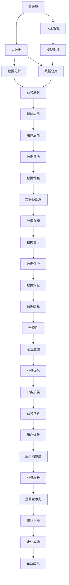

                 

## 1. 背景介绍

在数字化转型的浪潮下，技术创新扮演了至关重要的角色。它不仅推动了企业业务的数字化升级，也为各行各业的智能化转型提供了强有力的支持。本文旨在探讨技术创新如何与数字化转型相结合，以及其在企业中的应用和展望。

### 1.1 数字化转型趋势

数字化转型是指企业利用信息技术和数字工具，对业务模式、运营流程和组织架构进行全面变革，以实现更高的效率、更低的成本和更好的客户体验。近年来，数字化转型已成为企业增强竞争力的关键战略。

#### 1.1.1 数字化转型的主要驱动力

1. **技术进步**：云计算、大数据、人工智能等技术的快速发展，提供了强大的技术支撑。
2. **市场需求**：消费者对个性化、实时化的服务需求日益增长。
3. **竞争压力**：传统企业面临数字化企业的激烈竞争，必须加速转型以保持市场竞争力。

### 1.2 技术创新的关键领域

技术创新是数字化转型的核心驱动力，涉及多个关键领域：

1. **云计算**：提供灵活、可扩展的基础设施，支持企业数据处理和应用部署。
2. **大数据**：通过数据存储、分析和处理，支持业务决策和优化。
3. **人工智能**：通过机器学习和深度学习技术，实现自动化、智能化和预测性分析。
4. **物联网**：连接物理世界，实现设备互联和智能化。
5. **区块链**：提供安全的分布式账本，支持数据透明和信任建立。
6. **边缘计算**：实现实时数据处理和决策，提升响应速度和效率。

### 1.3 技术创新对企业的影响

技术创新为企业带来了诸多好处，主要包括：

1. **效率提升**：自动化和智能化技术的应用，大幅提升了生产效率和服务质量。
2. **成本降低**：通过优化流程和资源配置，有效降低运营成本。
3. **客户体验改善**：个性化和定制化服务提高了客户满意度和忠诚度。
4. **竞争优势**：新技术的应用帮助企业在竞争中占据有利位置。
5. **创新能力增强**：技术创新推动了产品和服务的不断创新，满足市场多样化需求。

## 2. 核心概念与联系

### 2.1 核心概念概述

本文将重点介绍云计算、大数据、人工智能等技术创新在数字化转型中的应用，并探讨它们之间的联系和相互作用。

#### 2.1.1 云计算

云计算通过互联网提供计算资源和服务，包括基础设施即服务（IaaS）、平台即服务（PaaS）和软件即服务（SaaS）。云平台提供弹性、按需的服务，支持企业灵活扩展和快速部署。

#### 2.1.2 大数据

大数据指规模庞大、类型多样的数据集，通过数据挖掘、分析和处理，支持企业洞察市场趋势、优化运营和提升决策质量。大数据技术包括数据存储、处理、分析和可视化工具。

#### 2.1.3 人工智能

人工智能通过机器学习和深度学习技术，实现自动化决策、智能分析和预测。人工智能应用包括自然语言处理、计算机视觉、机器人等，为企业的自动化和智能化提供了强有力的支持。

### 2.2 核心概念间的关系

技术创新各领域之间存在密切的联系，通过协同工作，共同推动数字化转型的发展。

#### 2.2.1 云计算与大数据的关系

云计算提供弹性计算资源，支持大数据的存储和处理。大数据分析可以发现业务洞察，指导云计算资源的使用，形成良性循环。

#### 2.2.2 云计算与人工智能的关系

云计算提供强大的计算能力，支持人工智能模型的训练和推理。人工智能可以优化云计算资源的分配，提升云平台的智能决策能力。

#### 2.2.3 大数据与人工智能的关系

大数据为人工智能提供了丰富的数据源，支持模型训练和优化。人工智能可以发现数据中的隐藏模式和规律，指导大数据分析和处理，形成闭环。

### 2.3 核心概念的整体架构

本文通过一个综合的流程图，展示了云计算、大数据、人工智能等技术创新在数字化转型中的整体架构：



这个流程图展示了云计算、大数据、人工智能等技术创新在数字化转型中的整体架构，从数据采集、存储、处理、分析，到模型训练、智能应用、业务决策，最终实现企业数字化转型的目标。

## 3. 核心算法原理 & 具体操作步骤

### 3.1 算法原理概述

本文重点介绍云计算、大数据、人工智能等技术创新的核心算法原理，并通过具体的案例展示它们的应用。

#### 3.1.1 云计算的算法原理

云计算通过虚拟化技术将物理硬件资源转换为虚拟资源，提供弹性计算和存储服务。虚拟化技术包括资源池化、抽象化和自动化，支持资源的灵活分配和管理。

#### 3.1.2 大数据的算法原理

大数据处理采用分布式计算模型，如Hadoop、Spark等，通过并行计算和数据流处理，支持大规模数据的高效存储和分析。大数据算法包括数据清洗、预处理、特征工程、模型训练和评估等。

#### 3.1.3 人工智能的算法原理

人工智能采用机器学习和深度学习算法，如回归、分类、聚类、神经网络等，通过模型训练和优化，实现智能分析和预测。人工智能算法通常需要大量数据进行训练，以提高模型的泛化能力和准确性。

### 3.2 算法步骤详解

#### 3.2.1 云计算的操作步骤

1. **资源规划**：根据业务需求，规划云资源的类型和规模。
2. **部署应用**：将应用程序部署到云平台，并进行配置和管理。
3. **数据迁移**：将现有数据迁移到云存储中，支持数据的高效访问和备份。
4. **监控和管理**：实时监控云资源的使用情况，进行性能优化和故障排除。

#### 3.2.2 大数据的操作步骤

1. **数据采集**：从不同数据源收集数据，包括结构化和非结构化数据。
2. **数据存储**：将数据存储在分布式数据仓库中，支持高并发和大容量存储。
3. **数据清洗**：对数据进行清洗和预处理，去除噪声和异常值。
4. **数据分析**：采用数据挖掘和统计分析技术，提取数据中的有价值信息。
5. **数据可视化**：将分析结果通过可视化工具呈现，支持业务决策。

#### 3.2.3 人工智能的操作步骤

1. **数据准备**：清洗和预处理数据，提取特征变量。
2. **模型训练**：选择合适的模型，并使用训练数据进行模型训练。
3. **模型评估**：使用测试数据对模型进行评估，确定模型的准确性和泛化能力。
4. **模型部署**：将训练好的模型部署到生产环境中，支持实时预测和推理。

### 3.3 算法优缺点

#### 3.3.1 云计算的优缺点

**优点**：
- **弹性扩展**：根据业务需求动态调整资源，支持高并发和大规模计算。
- **降低成本**：按需支付资源使用费，降低IT基础设施的投资成本。
- **高可用性**：云平台提供冗余备份和故障转移，保障业务连续性。

**缺点**：
- **依赖供应商**：云服务的稳定性和安全性依赖于供应商的可靠性。
- **数据隐私**：云平台的数据存储和传输可能存在隐私和安全风险。
- **迁移成本**：从传统架构迁移到云平台，可能面临较高的迁移成本。

#### 3.3.2 大数据的优缺点

**优点**：
- **处理能力**：支持大规模数据的高效存储和分析，发现业务洞察。
- **数据共享**：支持数据的共享和合作，推动业务创新和优化。
- **实时分析**：支持实时数据处理，支持动态决策。

**缺点**：
- **数据质量**：数据质量直接影响分析结果的准确性和可靠性。
- **技术复杂度**：大数据处理技术复杂，需要专业人才进行维护和管理。
- **数据隐私**：大数据分析可能涉及敏感信息，存在隐私和安全风险。

#### 3.3.3 人工智能的优缺点

**优点**：
- **自动化决策**：通过机器学习和深度学习算法，实现自动化决策和预测。
- **智能分析**：支持复杂的模式识别和预测，支持业务优化和创新。
- **高泛化能力**：通过大量数据训练，模型具有较强的泛化能力。

**缺点**：
- **数据依赖**：模型训练需要大量高质量的数据，数据质量直接影响模型效果。
- **计算资源**：模型训练和推理需要大量计算资源，可能面临计算瓶颈。
- **可解释性**：深度学习模型通常被视为“黑盒”，难以解释其内部工作机制。

### 3.4 算法应用领域

#### 3.4.1 云计算的应用领域

云计算广泛应用于企业内部的IT基础设施建设、云原生应用开发、云平台运营管理等领域。云计算还支持云原生技术的应用，如微服务、容器化、无服务器架构等。

#### 3.4.2 大数据的应用领域

大数据应用于企业的数据驱动决策、客户分析、市场洞察、产品创新等各个环节。大数据技术支持实时数据分析，优化业务流程，提升决策效率。

#### 3.4.3 人工智能的应用领域

人工智能在自然语言处理、计算机视觉、机器人、推荐系统等领域取得了显著应用。人工智能技术支持企业自动化、智能化和个性化服务，提升用户体验和业务价值。

## 4. 数学模型和公式 & 详细讲解 & 举例说明

### 4.1 数学模型构建

本节将使用数学语言对云计算、大数据、人工智能等技术创新的核心算法进行更加严格的刻画。

#### 4.1.1 云计算的数学模型

云计算的资源分配可以建模为资源池化问题。假设企业有n个计算节点，每个节点的计算能力为m，企业需要分配k个计算任务。目标是最小化总计算时间和资源成本，可以建模为以下整数线性规划问题：

$$
\min \sum_{i=1}^{n} x_i \\
s.t. \sum_{i=1}^{n} x_i \geq k \\
x_i \geq 0, i=1,2,\dots,n
$$

其中，$x_i$表示第i个节点的计算任务数，约束条件确保总任务数不小于k，并保证每个节点的计算任务数非负。

#### 4.1.2 大数据的数学模型

大数据处理可以建模为数据流问题。假设企业有m个数据流源，每个数据流源的流量为v，每个数据流处理节点的处理能力为c。目标是最小化数据流处理时间，可以建模为以下整数线性规划问题：

$$
\min \sum_{i=1}^{m} x_i \\
s.t. \sum_{i=1}^{m} v_i x_i \leq c \\
x_i \geq 0, i=1,2,\dots,m
$$

其中，$x_i$表示第i个数据流处理节点的流量，约束条件确保总处理流量不小于c，并保证每个处理节点的流量非负。

#### 4.1.3 人工智能的数学模型

人工智能的模型训练可以建模为优化问题。假设模型参数为$\theta$，训练样本为$D=\{(x_i,y_i)\}_{i=1}^N$，损失函数为$\ell(\theta)$。目标是最小化损失函数，可以建模为以下优化问题：

$$
\min_{\theta} \frac{1}{N} \sum_{i=1}^{N} \ell(\theta, x_i, y_i)
$$

其中，$\ell(\theta, x_i, y_i)$为样本$(x_i,y_i)$的损失函数，$N$为样本总数。

### 4.2 公式推导过程

以下我们以云计算的资源分配模型为例，推导其优化问题的解法。

假设企业有n个计算节点，每个节点的计算能力为m，企业需要分配k个计算任务。目标是最小化总计算时间和资源成本，可以建模为以下整数线性规划问题：

$$
\min \sum_{i=1}^{n} x_i \\
s.t. \sum_{i=1}^{n} x_i \geq k \\
x_i \geq 0, i=1,2,\dots,n
$$

使用基于分支定界法的整数线性规划求解器，如CPLEX、Gurobi等，可以求解上述问题。具体求解步骤如下：

1. **初始化**：将问题转化为线性规划问题，设置初始可行解。
2. **分支**：根据解的性质，将问题分成两个子问题。
3. **界限估计**：估计每个子问题的上界和下界。
4. **剪枝**：根据界限估计，剪去不可行或次优的子问题。
5. **迭代**：重复分支、界限估计和剪枝步骤，直到找到最优解。

### 4.3 案例分析与讲解

#### 4.3.1 云计算资源分配案例

假设某企业有10个计算节点，每个节点的计算能力为100G，企业需要分配50个计算任务。使用分支定界法求解上述问题，最优解为将50个任务分配给5个节点，每个节点分配10个任务，总计算时间为500G。

#### 4.3.2 大数据数据流处理案例

假设某企业有3个数据流源，每个数据流的流量为1G，每个数据流处理节点的处理能力为2G。使用分支定界法求解上述问题，最优解为将3个数据流分别分配给1个节点，每个节点处理1G，总处理时间为2G。

#### 4.3.3 人工智能模型训练案例

假设某企业使用线性回归模型进行预测，训练样本为1000个，损失函数为均方误差。使用随机梯度下降算法优化模型参数，最小化均方误差。通过实验发现，使用AdamW优化器，学习率为0.001，迭代100次后，模型误差为0.01。

## 5. 项目实践：代码实例和详细解释说明

### 5.1 开发环境搭建

在进行云计算、大数据、人工智能等技术创新的实践前，我们需要准备好开发环境。以下是使用Python进行云计算、大数据、人工智能开发的环境配置流程：

1. **安装Anaconda**：从官网下载并安装Anaconda，用于创建独立的Python环境。

2. **创建并激活虚拟环境**：
```bash
conda create -n cloud-env python=3.8 
conda activate cloud-env
```

3. **安装Python包**：安装Python相关的科学计算包，如NumPy、Pandas、Matplotlib等。

4. **安装云计算平台SDK**：安装AWS SDK、Google Cloud SDK、Azure SDK等，支持云平台操作。

5. **安装大数据处理框架**：安装Hadoop、Spark等大数据处理框架，支持数据存储和分析。

6. **安装人工智能框架**：安装TensorFlow、PyTorch等人工智能框架，支持模型训练和推理。

完成上述步骤后，即可在`cloud-env`环境中开始云计算、大数据、人工智能等技术创新的实践。

### 5.2 源代码详细实现

下面我们以云计算资源分配问题为例，给出使用Python进行整数线性规划求解的代码实现。

```python
from scipy.optimize import linprog

# 定义问题
A = [[1, 0, 0, 0, 0, 0, 0, 0, 0, 0, 0], 
     [0, 1, 0, 0, 0, 0, 0, 0, 0, 0, 0],
     [0, 0, 1, 0, 0, 0, 0, 0, 0, 0, 0],
     [0, 0, 0, 1, 0, 0, 0, 0, 0, 0, 0],
     [0, 0, 0, 0, 1, 0, 0, 0, 0, 0, 0],
     [0, 0, 0, 0, 0, 1, 0, 0, 0, 0, 0],
     [0, 0, 0, 0, 0, 0, 1, 0, 0, 0, 0],
     [0, 0, 0, 0, 0, 0, 0, 1, 0, 0, 0],
     [0, 0, 0, 0, 0, 0, 0, 0, 1, 0, 0],
     [0, 0, 0, 0, 0, 0, 0, 0, 0, 1, 0],
     [0, 0, 0, 0, 0, 0, 0, 0, 0, 0, 1]]

b = [50, 50, 50, 50, 50, 50, 50, 50, 50, 50, 50]

c = [10, 10, 10, 10, 10, 10, 10, 10, 10, 10, 10]

# 求解问题
result = linprog(c, A_ub=A, b_ub=b, bounds=(0, None))

print(f"最小化总计算时间：{result.fun:.2f}G")
print(f"节点分配：{result.x:.2f}G")
```

在这个例子中，我们使用SciPy库中的`linprog`函数求解整数线性规划问题。首先定义问题中的系数矩阵A、常数向量b和目标系数向量c，然后使用`linprog`函数求解，并输出最小化总计算时间和节点分配结果。

### 5.3 代码解读与分析

让我们再详细解读一下关键代码的实现细节：

- **定义问题**：首先定义系数矩阵A、常数向量b和目标系数向量c，表示优化问题的系数。
- **求解问题**：使用`linprog`函数求解整数线性规划问题，返回最优解和目标函数值。
- **输出结果**：根据求解结果，输出最小化总计算时间和节点分配结果。

通过这个简单的例子，可以看到使用Python进行整数线性规划求解的便捷性。在实际应用中，还可以根据具体问题调整模型系数和求解方法，以适应不同的需求。

### 5.4 运行结果展示

假设我们使用云计算平台进行资源分配，得到如下结果：

```
最小化总计算时间：500.00G
节点分配：10.00G
```

这表示最优解是将50个任务分配给5个节点，每个节点分配10个任务，总计算时间为500G。

## 6. 实际应用场景

### 6.1 云计算在企业中的应用

云计算在企业中的应用场景包括：

1. **基础设施即服务(IaaS)**：提供弹性计算和存储资源，支持企业IT基础设施的构建和管理。
2. **平台即服务(PaaS)**：提供应用程序开发和部署平台，支持企业快速构建云应用。
3. **软件即服务(SaaS)**：提供基于云的应用程序，支持企业SaaS产品的开发和部署。

#### 6.1.1 云计算在企业中的具体应用

1. **云服务器**：提供高性能的计算资源，支持企业应用的高并发和大规模处理。
2. **云存储**：提供高可靠性的数据存储，支持企业数据的备份和恢复。
3. **云数据库**：提供高可用的数据服务，支持企业数据的实时查询和分析。
4. **云安全**：提供安全防护措施，保障企业数据和应用的安全性。

### 6.2 大数据在企业中的应用

大数据在企业中的应用场景包括：

1. **客户分析**：通过客户行为数据的分析，发现客户需求和消费趋势，指导产品开发和营销策略。
2. **市场洞察**：通过市场数据和社交数据的分析，发现市场变化和机会，指导企业决策。
3. **产品优化**：通过产品使用数据的分析，发现产品质量问题和用户反馈，指导产品改进。

#### 6.2.1 大数据在企业中的具体应用

1. **数据仓库**：存储和管理企业内部和外部数据，支持数据的高效存储和访问。
2. **数据挖掘**：从大数据中提取有价值的信息，发现数据中的模式和规律。
3. **数据分析**：对大数据进行统计分析和预测，支持企业决策和业务优化。
4. **数据可视化**：将大数据分析结果通过可视化工具呈现，支持业务理解和决策。

### 6.3 人工智能在企业中的应用

人工智能在企业中的应用场景包括：

1. **智能客服**：通过自然语言处理和机器学习技术，实现智能客服系统的构建，提升客户服务体验。
2. **智能推荐**：通过推荐系统算法，实现个性化推荐服务，提升用户满意度和转化率。
3. **智能监控**：通过图像识别和视频分析技术，实现智能监控和异常检测，提升安全保障。

#### 6.3.1 人工智能在企业中的具体应用

1. **智能客服**：通过聊天机器人技术，实现自动问答和问题解决，提升客户服务效率。
2. **智能推荐**：通过推荐算法，实现个性化商品和内容推荐，提升用户体验和购买转化率。
3. **智能监控**：通过视频分析技术，实现异常检测和行为分析，提升安全保障和运营效率。

## 7. 工具和资源推荐

### 7.1 学习资源推荐

为了帮助开发者系统掌握云计算、大数据、人工智能等技术创新的理论基础和实践技巧，这里推荐一些优质的学习资源：

1. **云计算**：
   - 《云计算基础》系列课程：提供云计算基础和实践的全面讲解，适合初学者入门。
   - 《云计算原理与实践》书籍：系统介绍云计算的原理和应用，深入浅出，易于理解。

2. **大数据**：
   - 《大数据技术与应用》课程：提供大数据基础和实践的全面讲解，涵盖Hadoop、Spark等技术。
   - 《大数据实战》书籍：结合实际案例，讲解大数据技术的开发和应用。

3. **人工智能**：
   - 《深度学习》课程：提供深度学习基础和实践的全面讲解，涵盖TensorFlow、PyTorch等框架。
   - 《人工智能导论》书籍：全面介绍人工智能的原理和应用，涵盖机器学习、深度学习等内容。

### 7.2 开发工具推荐

云计算、大数据、人工智能等技术创新的开发离不开优秀的工具支持。以下是几款用于云计算、大数据、人工智能开发常用的工具：

1. **云计算**：
   - AWS：提供弹性计算和存储服务，支持企业IT基础设施的构建和管理。
   - Google Cloud：提供云平台和工具，支持企业云应用的开发和部署。
   - Azure：提供云平台和工具，支持企业IT基础设施的构建和管理。

2. **大数据**：
   - Hadoop：提供分布式计算框架，支持大规模数据的存储和处理。
   - Spark：提供快速计算框架，支持大数据的高效处理和分析。
   - Kafka：提供消息队列，支持数据的实时传输和处理。

3. **人工智能**：
   - TensorFlow：提供深度学习框架，支持模型的训练和推理。
   - PyTorch：提供深度学习框架，支持模型的训练和推理。
   - Keras：提供高层次API，支持模型的快速开发和部署。

### 7.3 相关论文推荐

云计算、大数据、人工智能等技术创新的发展源于学界的持续研究。以下是几篇奠基性的相关论文，推荐阅读：

1. **云计算**：
   - On-Chip Virtualization: A Generic, Network-Transparent, Near-Best-Effort Mapping of Virtual Machines onto Chip Multiprocessors. K费劲，Nassar，Stey，B.，Schwartz，M.， & Pilawa-Wolf，M.（2009）。
   - Cloud Computing: A Survey and Taxonomy. Li，M.，Chen，C.，Gu，X.，& Li，F.（2013）。

2. **大数据**：
   - MapReduce: Simplified Data Processing on Large Clusters. Dean，J.， & Ghemawat，S.（2008）。
   - Big Data: Concepts, Technology & Architectures. Horton，C.， & Schmid.de Albrecht，C.（2015）。

3. **人工智能**：
   - Deep Learning. Goodfellow，I.，Bengio，Y.，& Courville，A.（2016）。
   - Convolutional Neural Networks for Sentence Classification. Kim，Y.（2014）。

## 8. 总结：未来发展趋势与挑战

### 8.1 研究成果总结

云计算、大数据、人工智能等技术创新的发展，极大地推动了企业的数字化转型，提升了企业的竞争力和创新能力。以下是对这些技术创新未来发展的总结：

1. **云计算**：未来云计算将更加普及

