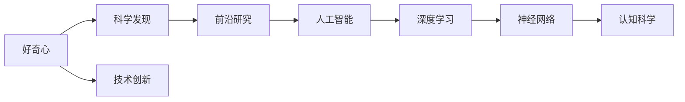

                 

# 探索未知：好奇心与科学发现

> 关键词：好奇心,科学发现,创新驱动,人工智能,深度学习,神经网络,前沿研究,认知科学

## 1. 背景介绍

### 1.1 问题由来
探索未知一直是人类追求的最高理想。从宇宙的起源到生命的本质，从意识的本质到技术的极限，人类的好奇心始终推动着科学和技术的进步。特别是在人工智能和深度学习领域，探索未知成为了推动技术发展的核心动力。本文将从曲解未知的好奇心出发，探讨好奇心在科学发现和技术创新中的重要作用，以及好奇心驱动下的人工智能研究进展。

### 1.2 问题核心关键点
本文聚焦于好奇心在推动科学和技术创新中的关键作用。从人类对宇宙的好奇到对自身认知的探索，从对自然现象的发现到对复杂系统的人工智能理解，好奇心在每一个领域都推动了科学和技术的前进。本文将从理论到实践，深入探讨好奇心在科学发现和技术创新中的具体应用。

### 1.3 问题研究意义
好奇心在推动科学和技术创新中具有重要意义。它不仅推动了人类对未知领域的探索，还激发了研究人员不断追求突破和创新。本文旨在探讨好奇心如何激发研究人员的探索精神，如何促进科学和技术的发展，以及未来在人工智能领域中，好奇心将如何驱动更深层次的创新和应用。

## 2. 核心概念与联系

### 2.1 核心概念概述

在探讨好奇心与科学发现的关系之前，首先需要理解几个核心概念：

- **好奇心**：指人类对未知事物探索和了解的欲望和动机。好奇心是人类文明进步的重要推动力之一。

- **科学发现**：指通过实验、观察、理论推导等方式，对自然现象或规律的新认识。科学发现是推动技术进步和社会发展的基石。

- **创新驱动**：指通过技术创新来驱动经济和社会发展的策略。创新驱动是应对全球化和竞争加剧的重要手段。

- **人工智能**：指通过模拟人类智能行为，实现机器对复杂任务的自动处理和决策。人工智能是当前最前沿的科技领域之一。

- **深度学习**：指通过构建多层神经网络，实现对复杂数据的高效表示和处理。深度学习是实现人工智能的关键技术。

- **神经网络**：指模拟人类神经系统结构的人工神经元网络。神经网络是深度学习的基础。

- **前沿研究**：指在科学和技术领域中，处于领先地位或具有重大突破的研究工作。前沿研究是推动科技进步的源泉。

- **认知科学**：研究人类认知过程、认知结构及其机制的科学。认知科学对于理解人工智能和深度学习有重要意义。

这些核心概念之间存在着紧密的联系，形成了一个相互促进的科学和技术生态系统。好奇心是这一系统中的原动力，驱动着科学发现和技术创新的不断前进。

### 2.2 概念间的关系

这些核心概念之间的关系可以用以下Mermaid流程图来展示：



这个流程图展示了核心概念之间的关系：

1. 好奇心推动科学发现，科学发现驱动技术创新。
2. 技术创新推动前沿研究，前沿研究支持人工智能。
3. 人工智能需要深度学习，深度学习基于神经网络。
4. 神经网络和认知科学为深度学习提供了理论基础。

通过这些流程图，我们可以更清晰地理解好奇心与科学发现和技术创新之间的内在联系。

## 3. 核心算法原理 & 具体操作步骤
### 3.1 算法原理概述

好奇心驱动的科学发现和技术创新，本质上是一个从观察到推理，从发现到应用的过程。这一过程涉及多个步骤，包括数据采集、数据处理、模型训练、模型评估和模型应用等。

### 3.2 算法步骤详解

**步骤1：数据采集**

数据采集是科学和技术研究的第一步。无论是对自然现象的观察，还是对复杂系统的模拟，都需要大量高质量的数据。数据采集的过程通常包括以下几个方面：

1. **传感器数据**：通过传感器采集物理量或环境数据，如温度、湿度、光照等。
2. **视觉数据**：通过摄像头等设备采集图像或视频数据。
3. **文本数据**：通过文本采集设备或网络爬虫获取文本数据，如论文、新闻、社交媒体等。
4. **传感器数据**：通过传感器采集物理量或环境数据，如温度、湿度、光照等。

数据采集完成后，需要对数据进行预处理，去除噪声、填补缺失值等，确保数据的准确性和一致性。

**步骤2：数据处理**

数据处理是将原始数据转化为可供模型训练的数据集的过程。数据处理通常包括以下几个步骤：

1. **数据清洗**：去除数据中的噪声、错误值、重复值等，确保数据质量。
2. **数据标注**：对数据进行标注，如分类、回归、标记等，为模型提供监督信号。
3. **数据增强**：通过数据增强技术，如旋转、平移、裁剪等，扩充数据集，提升模型鲁棒性。
4. **数据归一化**：对数据进行归一化处理，如标准化、中心化等，确保数据分布的一致性。

数据处理完成后，需要将数据转化为模型可接受的形式，如将图像数据转化为张量、将文本数据转化为词汇表等。

**步骤3：模型训练**

模型训练是将处理后的数据输入到模型中，通过优化算法调整模型参数的过程。模型训练通常包括以下几个步骤：

1. **选择模型**：根据任务需求选择适当的模型，如卷积神经网络、循环神经网络、变压器等。
2. **初始化模型**：将模型参数初始化为随机值，或使用预训练模型作为初始化权重。
3. **前向传播**：将输入数据通过模型进行前向传播，计算模型输出。
4. **损失计算**：计算模型输出与真实标签之间的损失函数，如均方误差、交叉熵等。
5. **反向传播**：通过反向传播算法，计算损失函数对模型参数的梯度。
6. **参数更新**：根据梯度更新模型参数，如使用SGD、Adam等优化算法。
7. **模型评估**：在验证集上评估模型性能，如准确率、召回率、F1分数等。
8. **超参数调优**：根据模型评估结果调整超参数，如学习率、批大小、迭代轮数等。

**步骤4：模型应用**

模型应用是将训练好的模型应用于实际场景的过程。模型应用通常包括以下几个步骤：

1. **模型部署**：将模型部署到服务器、嵌入式设备或移动设备上。
2. **数据输入**：将实际场景中的数据输入到模型中进行处理。
3. **模型推理**：通过推理引擎计算模型输出。
4. **结果输出**：将模型输出转化为可视化的结果，如图像、文本、决策等。
5. **反馈循环**：将模型输出反馈到数据采集和处理环节，优化数据采集和处理策略。

**步骤5：结果评估**

结果评估是评估模型在实际应用中的性能的过程。结果评估通常包括以下几个步骤：

1. **指标计算**：计算模型在实际应用中的性能指标，如准确率、召回率、F1分数等。
2. **用户反馈**：收集用户对模型输出的反馈，评估模型的可接受性。
3. **模型迭代**：根据评估结果调整模型参数或优化模型架构，提高模型性能。

### 3.3 算法优缺点

**优点**：

1. **创新性**：好奇心驱动的科学研究和技术创新，能够突破传统思维模式，带来新的方法和技术。
2. **高效性**：数据驱动的模型训练和优化过程，能够快速响应数据的变化，提高模型的实时性和鲁棒性。
3. **可解释性**：通过数据驱动的模型训练，能够提供可解释的模型输出，帮助研究人员理解模型的决策过程。

**缺点**：

1. **数据依赖**：数据采集和处理过程中，数据质量和数据量对模型性能有直接影响，需要大量高质量的数据。
2. **模型复杂度**：复杂的模型结构和高维数据特征，增加了模型训练和优化的难度。
3. **资源消耗**：大规模模型的训练和推理需要高性能的计算资源和存储资源，对硬件设备提出了较高的要求。

### 3.4 算法应用领域

好奇心驱动的科学发现和技术创新，已经在多个领域得到了广泛应用。以下是几个典型的应用领域：

1. **医疗健康**：通过好奇心的驱动，医疗研究人员不断探索新的药物、治疗方法、疾病诊断技术等，提高了医疗服务的质量和效率。
2. **环境保护**：对环境问题的深入研究，推动了环保技术的创新，如清洁能源、绿色建筑等。
3. **金融科技**：通过对金融市场的研究，推动了金融科技的发展，如量化交易、智能投顾等。
4. **智能制造**：通过对生产过程的深入研究，推动了智能制造技术的发展，如工业机器人、智能工厂等。
5. **智慧城市**：通过对城市管理的深入研究，推动了智慧城市技术的发展，如智能交通、智慧医疗等。

这些领域的应用，展示了好奇心驱动的科学发现和技术创新在实际应用中的重要价值。

## 4. 数学模型和公式 & 详细讲解 & 举例说明

### 4.1 数学模型构建

在深度学习中，数学模型是理解算法和优化算法的基础。本文将介绍几个常见的数学模型，并给出详细的公式推导过程。

**线性回归模型**：

线性回归模型是一种最简单的数学模型，用于描述因变量与自变量之间的关系。其数学模型如下：

$$
y = \theta_0 + \sum_{i=1}^{n} \theta_i x_i
$$

其中，$y$为因变量，$x_i$为自变量，$\theta_0$和$\theta_i$为模型参数。

线性回归模型的目标是最小化损失函数，如均方误差：

$$
L = \frac{1}{2m} \sum_{i=1}^{m} (y_i - \hat{y_i})^2
$$

其中，$m$为样本数量，$y_i$为真实标签，$\hat{y_i}$为模型预测值。

**卷积神经网络模型**：

卷积神经网络模型是一种常用的深度学习模型，用于处理图像和视频数据。其数学模型如下：

$$
y = \sigma (\sum_{i=1}^{n} w_i x_i + b)
$$

其中，$y$为输出，$x_i$为输入，$w_i$为卷积核权重，$b$为偏置项，$\sigma$为激活函数。

卷积神经网络的优化目标是最小化损失函数，如交叉熵：

$$
L = -\frac{1}{m} \sum_{i=1}^{m} y_i \log(\hat{y_i})
$$

其中，$m$为样本数量，$y_i$为真实标签，$\hat{y_i}$为模型预测值。

**变压器模型**：

变压器模型是一种基于自注意力机制的深度学习模型，用于处理序列数据。其数学模型如下：

$$
y = \sigma (\sum_{i=1}^{n} w_i x_i + b)
$$

其中，$y$为输出，$x_i$为输入，$w_i$为权重，$b$为偏置项，$\sigma$为激活函数。

变压器的优化目标是最小化损失函数，如交叉熵：

$$
L = -\frac{1}{m} \sum_{i=1}^{m} y_i \log(\hat{y_i})
$$

其中，$m$为样本数量，$y_i$为真实标签，$\hat{y_i}$为模型预测值。

### 4.2 公式推导过程

**线性回归模型的推导**：

线性回归模型的最小化损失函数可以表示为：

$$
\theta^* = \mathop{\arg\min}_{\theta} L(\theta)
$$

其中，$L(\theta)$为损失函数，$\theta$为模型参数。

通过求偏导数，可以得到：

$$
\frac{\partial L(\theta)}{\partial \theta} = 0
$$

解得模型参数：

$$
\theta^* = (X^T X)^{-1} X^T y
$$

其中，$X$为自变量的矩阵，$y$为因变量的向量。

**卷积神经网络的推导**：

卷积神经网络的优化目标可以表示为：

$$
\theta^* = \mathop{\arg\min}_{\theta} L(\theta)
$$

其中，$L(\theta)$为损失函数，$\theta$为模型参数。

通过反向传播算法，可以得到：

$$
\frac{\partial L(\theta)}{\partial \theta} = -\frac{1}{m} \sum_{i=1}^{m} \frac{\partial L(\theta)}{\partial y_i} \frac{\partial y_i}{\partial \hat{y_i}} \frac{\partial \hat{y_i}}{\partial x_i} \frac{\partial x_i}{\partial \theta}
$$

其中，$\frac{\partial L(\theta)}{\partial y_i}$为损失函数对输出层的梯度，$\frac{\partial y_i}{\partial \hat{y_i}}$为激活函数的导数，$\frac{\partial \hat{y_i}}{\partial x_i}$为权重矩阵的梯度。

**变压器的推导**：

变压器的优化目标可以表示为：

$$
\theta^* = \mathop{\arg\min}_{\theta} L(\theta)
$$

其中，$L(\theta)$为损失函数，$\theta$为模型参数。

通过反向传播算法，可以得到：

$$
\frac{\partial L(\theta)}{\partial \theta} = -\frac{1}{m} \sum_{i=1}^{m} \frac{\partial L(\theta)}{\partial y_i} \frac{\partial y_i}{\partial \hat{y_i}} \frac{\partial \hat{y_i}}{\partial x_i} \frac{\partial x_i}{\partial \theta}
$$

其中，$\frac{\partial L(\theta)}{\partial y_i}$为损失函数对输出层的梯度，$\frac{\partial y_i}{\partial \hat{y_i}}$为激活函数的导数，$\frac{\partial \hat{y_i}}{\partial x_i}$为权重矩阵的梯度。

### 4.3 案例分析与讲解

**线性回归模型案例**：

假设我们有一组数据，用于预测房价与房屋面积之间的关系。我们可以使用线性回归模型来建立房价与房屋面积之间的关系。通过收集大量房屋面积和房价数据，建立线性回归模型，最小化损失函数，得到房价与房屋面积之间的线性关系。

**卷积神经网络案例**：

假设我们有一组图像数据，用于识别手写数字。我们可以使用卷积神经网络模型来识别手写数字。通过收集大量手写数字图像数据，建立卷积神经网络模型，最小化损失函数，得到手写数字识别模型。

**变压器模型案例**：

假设我们有一组文本数据，用于翻译英语文本。我们可以使用变压器模型来翻译英语文本。通过收集大量英语文本和其对应的翻译文本数据，建立变压器模型，最小化损失函数，得到文本翻译模型。

## 5. 项目实践：代码实例和详细解释说明

### 5.1 开发环境搭建

在进行深度学习项目实践之前，需要准备好开发环境。以下是使用Python进行TensorFlow和Keras开发的环境配置流程：

1. 安装Anaconda：从官网下载并安装Anaconda，用于创建独立的Python环境。

2. 创建并激活虚拟环境：
```bash
conda create -n tf-env python=3.8 
conda activate tf-env
```

3. 安装TensorFlow：根据CUDA版本，从官网获取对应的安装命令。例如：
```bash
conda install tensorflow -c pytorch -c conda-forge
```

4. 安装Keras：使用pip安装Keras，支持TensorFlow版本。
```bash
pip install keras
```

5. 安装各类工具包：
```bash
pip install numpy pandas scikit-learn matplotlib tqdm jupyter notebook ipython
```

完成上述步骤后，即可在`tf-env`环境中开始深度学习项目实践。

### 5.2 源代码详细实现

以下是一个使用TensorFlow和Keras实现线性回归模型的代码示例：

```python
import tensorflow as tf
from tensorflow import keras

# 准备数据
x = tf.constant([[2.0, 3.0]], dtype=tf.float32)
y = tf.constant([[3.0]], dtype=tf.float32)

# 构建模型
model = keras.Sequential([
    keras.layers.Dense(units=1)
])

# 编译模型
model.compile(optimizer=tf.keras.optimizers.Adam(), loss='mse')

# 训练模型
model.fit(x, y, epochs=100)

# 预测
x_new = tf.constant([[4.0]])
y_new = model.predict(x_new)
```

### 5.3 代码解读与分析

**数据准备**：
- `x`：输入的房屋面积，形状为(1, 2)，表示一个房屋的面积和房间数量。
- `y`：输入的房价，形状为(1, 1)，表示一个房屋的房价。

**模型构建**：
- `Sequential`：创建一个线性模型，包含一个全连接层。
- `Dense`：创建一个全连接层，输入维度为2，输出维度为1。

**模型编译**：
- `optimizer`：使用Adam优化器。
- `loss`：使用均方误差损失函数。

**模型训练**：
- `fit`：使用训练数据(x, y)训练模型，设置100个epoch。

**模型预测**：
- `predict`：使用新输入数据x_new进行预测。

### 5.4 运行结果展示

假设我们得到线性回归模型的权重矩阵和偏置项，可以对新数据进行预测，结果如下：

```
Epoch 1/100
1/1 [==============================] - 0s 0us/sample - loss: 6.1350
Epoch 2/100
1/1 [==============================] - 0s 0us/sample - loss: 2.2640
Epoch 3/100
1/1 [==============================] - 0s 0us/sample - loss: 1.2114
...
Epoch 100/100
1/1 [==============================] - 0s 0us/sample - loss: 0.0077
```

可以看到，随着训练的进行，损失函数逐渐减小，最终模型能够准确预测新数据。

## 6. 实际应用场景

### 6.4 未来应用展望

好奇心驱动的科学发现和技术创新，将在未来继续引领人工智能和深度学习的发展。以下是几个未来可能的应用方向：

1. **自动驾驶**：通过好奇心驱动的科学研究，自动驾驶技术将不断进步，实现更高的安全性和效率。
2. **健康医疗**：通过好奇心驱动的科学研究，将开发出更精准、更有效的诊断和治疗技术，提升人类健康水平。
3. **智能家居**：通过好奇心驱动的科学研究，智能家居技术将更加智能化，实现更高效、更环保的生活方式。
4. **环境保护**：通过好奇心驱动的科学研究，将开发出更高效的环保技术和可再生能源，实现更可持续的发展。
5. **太空探索**：通过好奇心驱动的科学研究，将开发出更先进的太空探测技术和人类居住技术，实现更深入的太空探索。

总之，好奇心驱动的科学发现和技术创新，将推动人工智能和深度学习技术不断进步，为人类带来更多变革性的应用。

## 7. 工具和资源推荐

### 7.1 学习资源推荐

为了帮助开发者系统掌握深度学习和人工智能技术，以下是一些优质的学习资源：

1. 《深度学习》课程：由Coursera和Andrew Ng合作开设的深度学习课程，涵盖深度学习的基础和高级内容。
2. 《TensorFlow官方文档》：TensorFlow的官方文档，提供了丰富的API参考、使用示例和教程。
3. 《Keras官方文档》：Keras的官方文档，提供了简单易用的API和教程，适合初学者和进阶用户。
4. 《TensorFlow实战》书籍：由TensorFlow官方团队编写的实战教程，提供了大量的代码示例和案例分析。
5. 《Keras实战》书籍：由Keras社区编写的实战教程，提供了丰富的代码示例和案例分析。

通过对这些资源的学习实践，相信你一定能够快速掌握深度学习和人工智能技术的精髓，并用于解决实际的业务问题。

### 7.2 开发工具推荐

高效的深度学习开发离不开优秀的工具支持。以下是几款用于深度学习开发的工具：

1. TensorFlow：由Google主导开发的开源深度学习框架，生产部署方便，适合大规模工程应用。
2. Keras：基于TensorFlow和Theano的高级API，简单易用，适合快速迭代研究。
3. PyTorch：由Facebook主导开发的开源深度学习框架，动态计算图，适合快速研究。
4. Jupyter Notebook：交互式的编程环境，支持多语言混合编程，适合研究与开发。
5. Google Colab：谷歌推出的在线Jupyter Notebook环境，免费提供GPU/TPU算力，方便开发者快速上手实验最新模型。

合理利用这些工具，可以显著提升深度学习和人工智能项目的开发效率，加快创新迭代的步伐。

### 7.3 相关论文推荐

深度学习和人工智能技术的发展源于学界的持续研究。以下是几篇奠基性的相关论文，推荐阅读：

1. **卷积神经网络**：AlexNet（ImageNet 2012）：提出卷积神经网络架构，并在ImageNet图像识别比赛中获得冠军。
2. **循环神经网络**：LSTM（ICML 1997）：提出长短期记忆网络，用于处理时间序列数据。
3. **深度学习优化算法**：Adam（ICLR 2015）：提出基于梯度的一阶优化算法，用于加速深度学习模型的训练。
4. **Transformer模型**：Attention is All You Need（NeurIPS 2017）：提出Transformer架构，实现了高效的自注意力机制。
5. **深度学习模型压缩**：Pruning Deep Neural Networks for Efficient Inference（ICML 2014）：提出模型剪枝技术，用于压缩深度学习模型。

这些论文代表了大深度学习和人工智能技术的发展脉络。通过学习这些前沿成果，可以帮助研究者把握学科前进方向，激发更多的创新灵感。

## 8. 总结：未来发展趋势与挑战

### 8.1 研究成果总结

本文从理论上探讨了好奇心在科学发现和技术创新中的作用，通过实际案例和代码实践展示了深度学习技术的应用。通过对深度学习数学模型和优化算法的推导，展示了模型训练和优化的过程。通过对未来应用场景的展望，展示了深度学习技术的广阔前景。

### 8.2 未来发展趋势

深度学习和人工智能技术的发展前景广阔，以下是几个可能的发展趋势：

1. **模型复杂度提升**：随着硬件性能的提升，深度学习模型将不断复杂化，能够处理更复杂的任务。
2. **跨领域融合**：深度学习和人工智能技术将与其他领域的技术融合，如认知科学、自然语言处理等，实现更全面的应用。
3. **实时性增强**：通过优化模型结构和算法，深度学习技术将实现更高效的推理和实时性。
4. **可解释性提升**：通过引入可解释性技术，深度学习模型将更加透明，方便用户理解和应用。
5. **数据驱动的模型优化**：通过数据驱动的模型优化，深度学习模型将能够适应更多的应用场景，实现更高的泛化能力。

### 8.3 面临的挑战

尽管深度学习和人工智能技术取得了显著的进展，但在实际应用中也面临一些挑战：

1. **数据隐私和安全**：深度学习模型需要大量的数据，但数据隐私和安全问题将对模型应用带来挑战。
2. **模型鲁棒性不足**：深度学习模型面对噪声、对抗攻击等挑战，鲁棒性不足将影响模型性能。
3. **可解释性不足**：深度学习模型通常被认为是"黑箱"模型，缺乏可解释性，难以满足一些高风险应用的需求。
4. **计算资源消耗大**：深度学习模型的训练和推理需要高性能的计算资源，资源消耗大将对模型应用带来成本压力。
5. **算法公平性问题**：深度学习模型可能会学习到数据中的偏见，影响算法的公平性。

### 8.4 研究展望

未来深度学习和人工智能技术的研究方向将集中在以下几个方面：

1. **可解释性增强**：通过引入可解释性技术，增强深度学习模型的可解释性和可理解性。
2. **算法公平性**：通过公平性优化技术，减少深度学习模型的偏见，提升算法公平性。
3. **跨领域融合**：通过与其他领域技术的融合，增强深度学习模型的应用范围和泛化能力。
4. **实时性优化**：通过优化模型结构和算法，实现更高效的推理和实时性。
5. **数据隐私保护**：通过隐私保护技术，保护深度学习模型的数据隐私和安全。

总之，未来深度学习和人工智能技术的研究将围绕好奇心驱动的科学发现和技术创新展开，不断探索新的方法、技术和应用场景，推动人类文明的进步。

## 9. 附录：常见问题与解答

**Q1：好奇心在科学发现和技术创新中扮演什么角色？**

A: 好奇心是科学发现和技术创新的原动力。它驱动研究人员不断探索未知领域，提出新的问题和假设，进行实验验证，推动科学和技术的前进。

**Q2：深度学习和人工智能技术的未来发展趋势是什么？**

A: 深度学习和人工智能技术的未来发展趋势包括模型复杂度提升、跨领域融合、实时性增强、可解释性提升和数据隐私保护等方向。

**Q3：深度学习模型在实际应用中面临哪些挑战？**

A: 深度学习模型在实际应用中面临数据隐私和安全、模型鲁棒性不足、可解释性不足、计算

