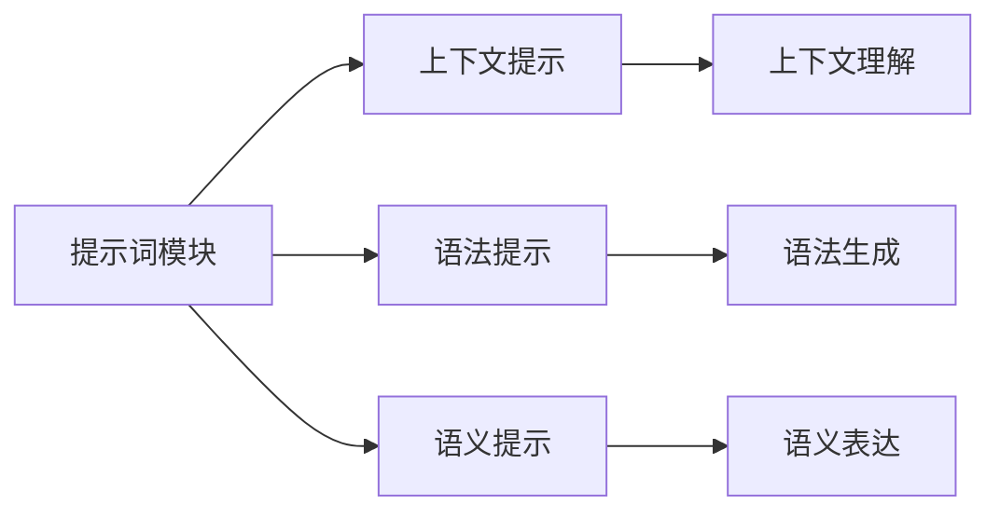

                 

# 提示词（Prompt）模板模块

> 关键词：提示词模板，自然语言处理(NLP)，自然语言理解(NLU)，智能问答系统，数据增强，多模态学习

## 1. 背景介绍

### 1.1 问题由来
在自然语言处理（NLP）领域，提示词（Prompt）模板模块是构建智能问答系统、智能客服、智能搜索等应用的重要技术之一。提示词通过精巧的设计，能够在模型训练和推理时提供明确的指导，帮助模型更好地理解和生成文本。近年来，随着深度学习技术的迅猛发展，基于大规模预训练语言模型（如BERT、GPT等）的模型已经展现出卓越的语言理解和生成能力。通过提示词模板，我们可以进一步提升这些模型的性能，实现更加智能、高效的NLP应用。

### 1.2 问题核心关键点
提示词模板的核心在于通过精心的文本设计和格式，引导大语言模型（如BERT、GPT等）输出预期的结果。常见的提示词模板包括问答模板、序列生成模板、文本分类模板等。提示词模板可以提升模型的零样本（Zero-shot）和少样本（Few-shot）学习能力，减少模型对大量标注数据的依赖，同时增强模型的泛化能力，使其在特定任务上表现更佳。

### 1.3 问题研究意义
研究提示词模板模块对于构建高性能的NLP应用具有重要意义：

- **提升模型性能**：通过精巧设计的提示词，模型能够在有限的标注数据下，快速适应新任务，取得优异性能。
- **降低标注成本**：提示词模板能够减少模型对大量标注数据的依赖，显著降低标注成本。
- **增强泛化能力**：提示词模板通过上下文语境的引导，使得模型能够更好地泛化到新场景和任务。
- **实现零样本和少样本学习**：提示词模板使得模型能够在没有经过特定任务训练的情况下，通过简单的上下文提示，生成符合预期的输出。
- **提高开发效率**：提示词模板简化了模型开发流程，使得开发者可以更快地构建和优化NLP应用。

## 2. 核心概念与联系

### 2.1 核心概念概述

为更好地理解提示词模板模块，我们首先介绍几个关键概念：

- **提示词（Prompt）**：在自然语言处理中，提示词是向模型提供上下文信息的关键手段。通过精心设计的提示词，可以引导模型在特定任务上的推理和生成。

- **序列生成（Sequence Generation）**：在自然语言处理中，序列生成是指模型根据上下文生成文本序列的过程。提示词模块通过设计适当的提示词，可以优化序列生成任务。

- **多模态学习（Multi-modal Learning）**：多模态学习是指模型能够同时处理和融合多种模态数据（如文本、图像、语音等），提升对复杂场景的理解和表达能力。提示词模块通过多模态融合，可以增强模型的学习能力。

- **自然语言理解（Natural Language Understanding, NLU）**：自然语言理解是指模型能够理解和处理自然语言的能力，包括词义理解、句法分析、语义推理等。提示词模块通过提供明确的上下文信息，可以帮助模型更好地理解输入。

- **自然语言生成（Natural Language Generation, NLG）**：自然语言生成是指模型能够生成符合语法和语义规则的文本序列。提示词模块通过提供明确的输出目标，可以引导模型生成更符合预期的文本。

这些核心概念之间的逻辑关系可以通过以下Mermaid流程图来展示：

```mermaid
graph TB
    A[提示词（Prompt）] --> B[序列生成]
    A --> C[Natural Language Understanding (NLU)]
    A --> D[Natural Language Generation (NLG)]
    B --> E[多模态学习]
    C --> F[词义理解]
    C --> G[句法分析]
    C --> H[语义推理]
    D --> I[语法生成]
    D --> J[语义表达]
    F --> K[上下文理解]
    G --> L[结构分析]
    H --> M[关系推理]
    I --> N[生成连贯句子]
    J --> O[生成语义文本]
```

这个流程图展示了提示词模块的核心概念及其相互关系：

1. **提示词模块**通过提供上下文信息，引导模型在序列生成、自然语言理解、自然语言生成等多个任务上取得更好的性能。
2. **序列生成**任务是提示词模块的重要应用场景之一，通过精巧的提示词设计，模型能够生成高质量的文本序列。
3. **多模态学习**结合了文本、图像、语音等多种模态信息，可以提升模型的泛化能力和理解深度。
4. **自然语言理解**通过上下文信息，模型能够更准确地理解和处理输入文本。
5. **自然语言生成**通过输出目标，模型能够生成符合语法和语义规则的文本。

### 2.2 概念间的关系

这些核心概念之间存在着紧密的联系，形成了提示词模板模块的完整生态系统。下面我们通过几个Mermaid流程图来展示这些概念之间的关系。

#### 2.2.1 提示词模块的核心组件



这个流程图展示了提示词模块的核心组件及其关系：

1. **上下文提示**：提供输入文本的上下文信息，帮助模型理解输入内容。
2. **语法提示**：提供语法结构的提示，引导模型生成符合语法的文本。
3. **语义提示**：提供语义信息的提示，帮助模型理解和生成更符合语义的文本。

#### 2.2.2 提示词模块的功能

```mermaid
graph LR
    A[提示词模块] --> B[序列生成]
    A --> C[Natural Language Understanding (NLU)]
    A --> D[Natural Language Generation (NLG)]
```

这个流程图展示了提示词模块的主要功能及其作用：

1. **序列生成**：通过上下文提示，模型能够生成连贯、准确的文本序列。
2. **自然语言理解**：通过上下文信息，模型能够更好地理解和处理输入文本。
3. **自然语言生成**：通过输出目标，模型能够生成符合语法和语义规则的文本。

### 2.3 核心概念的整体架构

最后，我们用一个综合的流程图来展示这些核心概念在提示词模板模块中的整体架构：

```mermaid
graph TB
    A[大规模文本数据] --> B[预训练]
    B --> C[提示词模块]
    C --> D[序列生成]
    C --> E[Natural Language Understanding (NLU)]
    C --> F[Natural Language Generation (NLG)]
    D --> G[多模态学习]
    E --> H[词义理解]
    E --> I[句法分析]
    E --> J[语义推理]
    F --> K[语法生成]
    F --> L[语义表达]
    G --> M[上下文理解]
    H --> N[结构分析]
    I --> O[关系推理]
    J --> P[生成连贯句子]
    K --> Q[生成语义文本]
```

这个综合流程图展示了从预训练到提示词模块构建的完整过程，以及提示词模块在不同NLP任务中的作用。提示词模板模块的核心在于通过上下文提示，引导模型在序列生成、自然语言理解和自然语言生成等多个任务上取得更好的性能，同时也能够实现多模态学习和上下文理解，进一步提升模型的能力。

## 3. 核心算法原理 & 具体操作步骤

### 3.1 算法原理概述

提示词模板模块的算法原理主要包括上下文提示设计、多模态融合和序列生成优化三个方面。具体来说，提示词模板通过上下文提示，引导模型理解输入文本并生成输出，同时融合多模态信息，提升模型的泛化能力和表达能力。

#### 3.1.1 上下文提示设计

上下文提示是提示词模板的核心组件，通过设计适当的提示词，可以引导模型在特定任务上更好地推理和生成文本。上下文提示一般包括以下几个部分：

1. **输入提示**：提供输入文本的上下文信息，帮助模型理解输入内容。
2. **输出提示**：提供输出目标的信息，引导模型生成符合预期的文本。
3. **语法提示**：提供语法结构的提示，帮助模型生成符合语法的文本。
4. **语义提示**：提供语义信息的提示，帮助模型生成更符合语义的文本。

#### 3.1.2 多模态融合

多模态学习是指模型能够同时处理和融合多种模态数据（如文本、图像、语音等），提升对复杂场景的理解和表达能力。提示词模块通过多模态融合，可以增强模型的学习能力，具体包括以下几个步骤：

1. **数据预处理**：对不同模态的数据进行预处理，使其具有相同的特征表示。
2. **特征提取**：使用预训练的特征提取器（如BERT、GPT等），提取每个模态的特征表示。
3. **融合融合**：使用融合方法（如concat、addition、attention等），将不同模态的特征表示进行融合，生成多模态的特征表示。
4. **模型训练**：将多模态的特征表示作为输入，训练模型进行推理和生成。

#### 3.1.3 序列生成优化

序列生成是指模型根据上下文生成文本序列的过程。提示词模板通过设计精巧的提示词，可以优化序列生成任务，具体包括以下几个步骤：

1. **提示词设计**：设计适当的提示词，提供输入文本的上下文信息。
2. **解码器设计**：使用适当的解码器（如GPT、Transformer等），生成文本序列。
3. **损失函数设计**：设计合适的损失函数（如交叉熵、BLEU等），评估模型生成的文本质量。
4. **优化算法设计**：选择适当的优化算法（如Adam、SGD等），更新模型参数。

### 3.2 算法步骤详解

提示词模板模块的具体操作步骤包括以下几个关键步骤：

**Step 1: 准备提示词模板和数据集**

1. 收集和标注数据集：根据任务需求，收集和标注相应的数据集，如问答数据集、文本分类数据集等。
2. 设计提示词模板：根据任务类型，设计适当的提示词模板，包含输入提示、输出提示、语法提示和语义提示等。

**Step 2: 添加提示词模块**

1. 加载预训练模型：选择适当的预训练模型（如BERT、GPT等），加载模型参数。
2. 添加提示词模块：在预训练模型的顶层设计提示词模块，包含输入提示、输出提示、语法提示和语义提示等。

**Step 3: 设置提示词模块超参数**

1. 选择提示词模板：根据任务需求，选择合适的提示词模板。
2. 设置模型参数：设置模型的超参数，如学习率、批大小、迭代轮数等。
3. 选择正则化方法：选择适当的正则化方法，如L2正则、Dropout等。

**Step 4: 执行提示词训练**

1. 分批次训练：将训练集数据分批次输入模型，前向传播计算损失函数。
2. 反向传播更新参数：反向传播计算参数梯度，根据设定的优化算法更新模型参数。
3. 周期性评估模型：周期性在验证集上评估模型性能，根据性能指标决定是否触发Early Stopping。
4. 重复上述步骤：重复上述步骤直至满足预设的迭代轮数或Early Stopping条件。

**Step 5: 测试和部署**

1. 在测试集上评估提示词模块：使用提示词模块对新样本进行推理预测，集成到实际的应用系统中。
2. 持续收集数据：持续收集新的数据，定期重新训练提示词模块，以适应数据分布的变化。

以上是提示词模板模块的一般流程。在实际应用中，还需要针对具体任务的特点，对提示词模板的设计和训练过程进行优化设计，如改进训练目标函数，引入更多的正则化技术，搜索最优的超参数组合等，以进一步提升模型性能。

### 3.3 算法优缺点

提示词模板模块具有以下优点：

1. **提升模型性能**：通过精巧设计的提示词，模型能够在有限的标注数据下，快速适应新任务，取得优异性能。
2. **降低标注成本**：提示词模板能够减少模型对大量标注数据的依赖，显著降低标注成本。
3. **增强泛化能力**：提示词模板通过上下文信息，使得模型能够更好地泛化到新场景和任务。
4. **实现零样本和少样本学习**：提示词模板使得模型能够在没有经过特定任务训练的情况下，通过简单的上下文提示，生成符合预期的输出。

同时，该方法也存在一定的局限性：

1. **提示词设计复杂**：设计适当的提示词需要一定的经验和技巧，难度较大。
2. **提示词模板通用性不足**：不同任务的提示词模板设计可能差异较大，难以实现通用的提示词模板设计。
3. **模型鲁棒性不足**：提示词模板可能对输入数据的变化敏感，影响模型鲁棒性。
4. **提示词模板更新频率高**：提示词模板需要根据数据分布的变化进行更新，更新频率较高。

尽管存在这些局限性，但就目前而言，提示词模板模块是提升NLP模型性能的重要手段，广泛应用于问答系统、智能客服、智能搜索等多个领域。

### 3.4 算法应用领域

提示词模板模块在NLP领域已经得到了广泛的应用，覆盖了几乎所有常见任务，例如：

- **问答系统**：在问答系统中，提示词模板通过设计适当的问答模板，引导模型理解问题并生成回答。
- **智能客服**：在智能客服系统中，提示词模板通过设计适当的对话模板，引导模型理解用户意图并生成回复。
- **智能搜索**：在智能搜索系统中，提示词模板通过设计适当的搜索模板，引导模型理解查询意图并生成搜索结果。
- **文本分类**：在文本分类任务中，提示词模板通过设计适当的分类模板，引导模型理解文本内容并生成分类结果。
- **情感分析**：在情感分析任务中，提示词模板通过设计适当的情感分析模板，引导模型理解文本情感并生成情感标签。
- **机器翻译**：在机器翻译任务中，提示词模板通过设计适当的翻译模板，引导模型理解源语言文本并生成目标语言文本。
- **文本摘要**：在文本摘要任务中，提示词模板通过设计适当的摘要模板，引导模型理解文本内容并生成摘要。

除了上述这些经典任务外，提示词模板模块还被创新性地应用到更多场景中，如可控文本生成、常识推理、代码生成、数据增强等，为NLP技术带来了全新的突破。随着提示词模板模块的不断演进，相信NLP技术将在更广阔的应用领域大放异彩。

## 4. 数学模型和公式 & 详细讲解 & 举例说明

### 4.1 数学模型构建

提示词模板模块的数学模型主要涉及上下文提示设计、多模态融合和序列生成优化三个方面。

#### 4.1.1 上下文提示设计

上下文提示设计主要涉及输入提示、输出提示、语法提示和语义提示等组件。以下是输入提示和输出提示的数学模型构建：

1. **输入提示模型**：
   输入提示模型用于提供输入文本的上下文信息，帮助模型理解输入内容。假设有$n$个提示词，每个提示词为$\phi_i$，则输入提示模型可以表示为：

   $$
   \phi(\text{input}) = \{\phi_i \mid i=1,\cdots,n\}
   $$

2. **输出提示模型**：
   输出提示模型用于提供输出目标的信息，引导模型生成符合预期的文本。假设有$m$个输出提示，每个输出提示为$\psi_j$，则输出提示模型可以表示为：

   $$
   \psi(\text{output}) = \{\psi_j \mid j=1,\cdots,m\}
   $$

#### 4.1.2 多模态融合

多模态融合主要涉及数据预处理、特征提取、融合方法和模型训练等步骤。以下是特征提取和融合方法的数学模型构建：

1. **特征提取模型**：
   特征提取模型用于提取每个模态的特征表示。假设有$k$种模态，每种模态的特征表示为$x_{k,i}$，则特征提取模型可以表示为：

   $$
   x_k = F_k(\text{modality}_k)
   $$

2. **融合方法**：
   融合方法用于将不同模态的特征表示进行融合，生成多模态的特征表示。假设有$f$种融合方法，每种融合方法的权重为$\omega_i$，则融合方法可以表示为：

   $$
   y = \sum_{i=1}^f \omega_i f_i(x_1, x_2, \cdots, x_k)
   $$

#### 4.1.3 序列生成优化

序列生成优化主要涉及提示词设计、解码器设计、损失函数设计和优化算法设计等步骤。以下是解码器和损失函数的数学模型构建：

1. **解码器模型**：
   解码器模型用于生成文本序列。假设解码器模型为$D(\theta)$，则解码器模型可以表示为：

   $$
   y = D(\theta)(x)
   $$

2. **损失函数模型**：
   损失函数模型用于评估模型生成的文本质量。假设有$l$种损失函数，每种损失函数的权重为$\alpha_i$，则损失函数模型可以表示为：

   $$
   L = \sum_{i=1}^l \alpha_i l_i(y, y^\ast)
   $$

   其中，$y^\ast$表示真实输出，$l_i$表示第$i$种损失函数的定义。

### 4.2 公式推导过程

以下我们以问答系统为例，推导提示词模板模块的数学模型和公式。

1. **输入提示设计**：
   在问答系统中，输入提示用于提供问题上下文信息，帮助模型理解问题内容。假设问题为$q$，问题提示为$\phi(q)$，则输入提示设计可以表示为：

   $$
   \phi(q) = \{q\} \cup \{\phi_i \mid i=1,\cdots,n\}
   $$

2. **输出提示设计**：
   在问答系统中，输出提示用于提供答案上下文信息，帮助模型生成答案。假设答案为$a$，答案提示为$\psi(a)$，则输出提示设计可以表示为：

   $$
   \psi(a) = \{a\} \cup \{\psi_j \mid j=1,\cdots,m\}
   $$

3. **多模态融合设计**：
   在问答系统中，多模态融合用于融合问题和答案的多模态信息，提升模型的泛化能力和表达能力。假设问题为$q$，答案为$a$，问题模态为$x_q$，答案模态为$x_a$，则多模态融合设计可以表示为：

   $$
   y = \sum_{i=1}^f \omega_i f_i(x_q, x_a)
   $$

4. **序列生成设计**：
   在问答系统中，序列生成用于生成答案文本序列。假设答案为$a$，问题提示为$\phi(q)$，答案提示为$\psi(a)$，则序列生成设计可以表示为：

   $$
   a = D(\theta)(\phi(q), \psi(a))
   $$

5. **损失函数设计**：
   在问答系统中，损失函数用于评估模型生成的答案质量。假设答案为$a$，真实答案为$a^\ast$，则损失函数设计可以表示为：

   $$
   L = \alpha_1 l_1(a, a^\ast) + \alpha_2 l_2(a, a^\ast) + \cdots + \alpha_l l_l(a, a^\ast)
   $$

   其中，$\alpha_i$表示第$i$种损失函数的权重，$l_i$表示第$i$种损失函数的定义。

### 4.3 案例分析与讲解

以智能客服系统为例，分析提示词模板模块的实际应用场景和效果。

**案例背景**：
某电商平台希望构建一个智能客服系统，以提升客户咨询体验和问题解决效率。

**解决方案**：
1. **数据准备**：
   收集历史客服对话记录，将其标注为问题和最佳答复。
2. **提示词设计**：
   设计适当的问答模板，包含输入提示、输出提示和语法提示等。
3. **模型选择**：
   选择适当的预训练模型，如BERT、GPT等。
4. **模型微调**：
   在问答模板的指导下，对预训练模型进行微调，使其能够理解客户咨询并生成最佳答复。
5. **系统部署**：
   将微调后的模型部署到智能客服系统中，实时处理客户咨询请求。

**效果分析**：
1. **提升响应速度**：
   智能客服系统能够在7x24小时不间断服务，快速响应客户咨询，提升客户满意度。
2. **减少人工成本**：
   智能客服系统能够自动处理简单咨询请求，减轻人工客服压力。
3. **提高咨询质量**：
   智能客服系统能够生成高质量的答复，提升问题解决效率和客户满意度。
4. **实时学习优化**：
   智能客服系统能够实时学习新咨询请求，不断优化回复内容。

通过案例分析，可以看出提示词模板模块在智能客服系统中具有显著的效果，能够提升客户咨询体验和问题解决效率。提示词模板模块的核心在于通过上下文提示，引导模型在序列生成、自然语言理解和自然语言生成等多个任务上取得更好的性能。

## 5. 项目实践：代码实例和详细解释说明

### 5.1 开发环境搭建

在进行提示词模板模块的开发实践前，我们需要准备好开发环境。以下是使用Python进行PyTorch开发的环境配置流程：

1. 安装Anaconda：从官网下载并安装Anaconda，用于创建独立的Python环境。

2. 创建并激活虚拟环境：
```bash
conda create -n pytorch-env python=3.8 
conda activate pytorch-env
```

3. 安装PyTorch：根据CUDA版本，从官网获取对应的安装命令。例如：
```bash
conda install pytorch torchvision torchaudio cudatoolkit=11.1 -c pytorch -c conda-forge
```

4. 安装Transformers库：
```bash
pip install transformers
```

5. 安装各类工具包：
```bash
pip install numpy pandas scikit-learn matplotlib tqdm jupyter notebook ipython
```

完成上述步骤后，即可在`pytorch-env`环境中开始提示词模板模块的实践。

### 5.2 源代码详细实现

下面我们以问答系统为例，给出使用Transformers库对BERT模型进行问答任务的提示词模板模块的PyTorch代码实现。

首先，定义问答任务的数据处理函数：

```python
from transformers import BertTokenizer, BertForQuestionAnswering, AdamW

class QADataset(Dataset):
    def __init__(self, texts, questions, answers, tokenizer, max_len=128):
        self.texts = texts
        self.questions = questions
        self.answers = answers
        self.tokenizer = tokenizer
        self.max_len = max_len
        
    def __len__(self):
        return len(self.texts)
    
    def __getitem__(self, item):
        text = self.texts[item]
        question = self.questions[item]
        answer = self.answers[item]
        
        encoding = self.tokenizer(question, text, return_tensors='pt', max_length=self.max_len, padding='max_length', truncation=True)
        input_ids = encoding['input_ids'][0]
        attention_mask = encoding['attention_mask'][0]
        answer_index = [tokenizer.convert_tokens_to_id(answer) + 1]
        start_position = [i for i, x in enumerate(encoding['input_ids'][0]) if x == answer_index[0]][0]
        end_position = [i for i, x in enumerate(encoding['input_ids'][0]) if x == answer_index[1]][0]
        label = torch.tensor([[0, 0, 0, 1], [0, 1, 0, 0]])
        
        return {
            'input_ids': input_ids,
            'attention_mask': attention_mask,
            'labels': label,
            'start_position': torch.tensor([start_position], dtype=torch.long),
            'end_position': torch.tensor([end_position], dtype=torch.long)
        }
```

然后，定义模型和优化器：

```python
tokenizer = BertTokenizer.from_pretrained('bert-base-cased')
model = BertForQuestionAnswering.from_pretrained('bert-base-cased', num_labels=2)

optimizer = AdamW(model.parameters(), lr=2e-5)
```

接着，定义训练和评估函数：

```python
device = torch.device('cuda') if torch.cuda.is_available() else torch.device('cpu')
model.to(device)

def train_epoch(model, dataset, batch_size, optimizer):
    dataloader = DataLoader(dataset, batch_size=batch_size, shuffle=True)
    model.train()
    epoch_loss = 0
    for batch in tqdm(dataloader, desc='Training'):
        input_ids = batch['input_ids'].to(device)
        attention_mask = batch['attention_mask'].to(device)
        labels = batch['labels'].to(device)
        start_position = batch['start_position'].to(device)
        end_position = batch['end_position'].to(device)
        model.zero_grad()
        outputs = model(input_ids, attention_mask=attention_mask, labels=labels, start_position=start_position, end_position=end_position)
        loss = outputs.loss
        epoch_loss += loss.item()
        loss.backward()
        optimizer.step()
    return epoch_loss / len(dataloader)

def evaluate(model, dataset, batch

