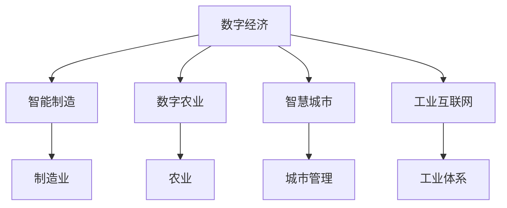

                 

# 数字中国与新质生产力布局

## 1. 背景介绍

随着数字经济的蓬勃发展，中国正在经历一场由数字技术驱动的产业转型和生产方式变革。从工业到农业，从服务业到公共事业，各行各业都正在被数字技术深度重塑，形成新质生产力布局。数字中国不仅是信息技术应用的全面覆盖，更是产业创新、业态变革、社会治理的深度融合，为我国经济高质量发展和人民美好生活创造新的动力。

### 1.1 数字中国的内涵

数字中国是全面数字化转型的战略目标，旨在通过新一代信息技术与传统产业的深度融合，推动经济社会发展的新一轮增长。数字中国不仅包括信息技术的广泛应用，更涵盖了从生产到消费，从政府到个人的各个层面，形成以数据为核心，以智能为驱动的新型生产力体系。

### 1.2 新质生产力的概念

新质生产力是指由数字技术推动的生产力形态，其特点包括：数据驱动、智能决策、弹性适应、协同共生。与传统生产力相比，新质生产力通过信息技术的深度嵌入，实现生产要素的智能化配置，生产过程的自动化控制，产品设计的个性化定制，消费需求的精准匹配，最终实现生产效率和质量的大幅提升。

## 2. 核心概念与联系

### 2.1 核心概念概述

1. **数字经济**：指依托数字技术，在互联网、大数据、云计算等新基建的支撑下，产生的一系列新业态、新模式和新价值。
2. **智能制造**：通过信息技术和制造业深度融合，实现从设计、生产到服务的全流程智能化，提升生产效率和产品质量。
3. **数字农业**：利用数字化技术，优化农业生产过程，提高农业生产效率和资源利用率。
4. **智慧城市**：通过数字化手段，提升城市管理水平和居民生活质量，实现城市运行的智能化、高效化和绿色化。
5. **工业互联网**：构建工业数据平台，实现工业资源、设备、产品的互联互通，推动工业体系向智能化、网络化、服务化转型。

### 2.2 核心概念的关系

这些核心概念之间存在着紧密的联系，形成了数字中国建设的整体框架。智能制造、数字农业、智慧城市、工业互联网等，都是数字经济在各个行业的应用体现。智能制造通过数字化、网络化、智能化手段，重塑传统制造业生产模式；数字农业则借助信息技术，优化农业生产管理；智慧城市和工业互联网则通过数据驱动，实现城市和工业体系的智能管理和高效运营。



## 3. 核心算法原理 & 具体操作步骤

### 3.1 算法原理概述

新质生产力的实现，依赖于一系列核心算法的支撑，包括但不限于机器学习、深度学习、自然语言处理、计算机视觉、物联网等。这些算法通过数据的处理、分析和应用，实现对生产要素的智能化配置，生产过程的自动化控制，以及产品和服务的个性化定制。

### 3.2 算法步骤详解

以智能制造为例，智能制造的核心算法步骤包括：

1. **数据采集**：通过传感器、物联网设备等，采集生产过程中的各类数据，如设备状态、生产参数、质量检测结果等。
2. **数据处理**：对采集到的数据进行清洗、预处理，去除噪声，提取关键特征。
3. **模型训练**：使用机器学习算法，构建生产流程的预测模型，如故障预测、质量控制、生产调度等。
4. **智能控制**：将训练好的模型应用于生产过程，实现生产设备的自动化控制和调度优化。
5. **反馈优化**：通过持续的数据采集和模型训练，不断优化生产流程，提升生产效率和产品质量。

### 3.3 算法优缺点

智能制造算法的主要优点包括：
1. **提升效率**：通过自动化控制，减少人为操作，提高生产效率。
2. **降低成本**：减少人工和物料浪费，降低生产成本。
3. **优化质量**：通过质量控制模型，及时发现和纠正生产缺陷，提升产品质量。

缺点主要体现在：
1. **数据依赖**：算法依赖大量高质量数据，数据采集和处理复杂。
2. **算法复杂**：智能制造涉及多领域算法，算法实现复杂。
3. **设备兼容性**：现有设备与新技术的兼容性问题，需要大量前期投入。

### 3.4 算法应用领域

智能制造算法在制造业中具有广泛应用，特别是在汽车、电子、机械等领域。通过智能制造，可以显著提升生产效率和产品质量，缩短产品上市周期，降低生产成本，从而提升企业竞争力。

## 4. 数学模型和公式 & 详细讲解

### 4.1 数学模型构建

以预测性维护算法为例，其数学模型可以表示为：
$$ P = f(D, \theta) $$
其中 $D$ 为生产过程中的历史数据，$\theta$ 为模型参数，$f$ 为预测函数。

### 4.2 公式推导过程

假设生产设备存在多种故障模式，每种故障模式的发生概率 $p_i$ 可通过历史数据 $D$ 进行估计。预测算法通过以下步骤进行：

1. **数据预处理**：对历史数据进行清洗、归一化处理，提取设备状态特征。
2. **特征选择**：选择对故障模式最有预测能力的特征。
3. **模型训练**：使用监督学习算法，如决策树、随机森林、神经网络等，构建故障预测模型。
4. **预测评估**：使用测试数据对模型进行评估，计算预测准确率、召回率等指标。

### 4.3 案例分析与讲解

假设某汽车制造企业，通过智能制造系统对生产设备进行预测性维护。系统采集了设备运行状态数据，如温度、振动、电流等，经过预处理和特征选择，构建了一个基于深度学习模型的故障预测系统。模型经过大量历史数据的训练，能够准确预测设备故障的发生时间和类型，从而实现设备的及时维护，减少停机时间和维修成本。

## 5. 项目实践：代码实例和详细解释说明

### 5.1 开发环境搭建

以下是在Python中使用TensorFlow实现预测性维护的代码环境搭建步骤：

1. 安装TensorFlow：
```bash
pip install tensorflow
```

2. 安装相关库：
```bash
pip install numpy pandas sklearn
```

### 5.2 源代码详细实现

```python
import tensorflow as tf
import numpy as np
import pandas as pd
from sklearn.model_selection import train_test_split

# 加载历史数据
data = pd.read_csv('device_data.csv')

# 数据预处理
data = data.dropna()
X = data.drop('故障类型', axis=1)
y = data['故障类型']

# 特征选择
X = X.select_dtypes(include=['int64', 'float64', 'bool'])

# 分割数据集
X_train, X_test, y_train, y_test = train_test_split(X, y, test_size=0.2, random_state=42)

# 构建模型
model = tf.keras.Sequential([
    tf.keras.layers.Dense(64, activation='relu', input_shape=(X_train.shape[1],)),
    tf.keras.layers.Dense(32, activation='relu'),
    tf.keras.layers.Dense(5, activation='softmax')
])

# 编译模型
model.compile(optimizer='adam', loss='sparse_categorical_crossentropy', metrics=['accuracy'])

# 训练模型
model.fit(X_train, y_train, epochs=10, batch_size=32)

# 评估模型
loss, accuracy = model.evaluate(X_test, y_test)
print(f'测试集损失：{loss:.4f}，准确率：{accuracy:.4f}')
```

### 5.3 代码解读与分析

1. **数据加载**：通过Pandas加载历史数据，并进行初步清洗。
2. **特征选择**：选择对故障预测有意义的特征。
3. **模型构建**：使用Sequential模型构建多层神经网络，最后一层使用softmax激活函数输出5类故障的预测概率。
4. **模型编译**：定义优化器、损失函数和评估指标。
5. **模型训练**：使用训练集数据进行模型训练。
6. **模型评估**：使用测试集数据评估模型性能。

## 6. 实际应用场景

### 6.1 智能制造

智能制造是数字中国建设的重要组成部分，通过数字化、网络化、智能化手段，实现制造业生产模式的全面转型。在智能制造中，智能制造算法广泛应用于生产设备的故障预测、生产调度、质量控制、供应链管理等多个环节，显著提升生产效率和产品质量。

### 6.2 数字农业

数字农业通过物联网、大数据、人工智能等技术，优化农业生产过程，提升农业生产效率和资源利用率。智能灌溉、智能施肥、智能病虫害检测等应用，使农业生产更加精细化、智能化。

### 6.3 智慧城市

智慧城市通过数字化手段，提升城市管理水平和居民生活质量。智慧交通、智慧医疗、智慧环保、智慧安防等应用，使城市运行更加智能化、高效化和绿色化。

### 6.4 未来应用展望

未来，随着数字技术的不断进步，新质生产力的应用将更加广泛深入。5G、物联网、边缘计算等技术的应用，将进一步提升生产要素的智能化配置和生产过程的自动化控制，推动制造业、农业、服务业、公共事业等多领域的智能化转型。

## 7. 工具和资源推荐

### 7.1 学习资源推荐

1. 《深度学习》书籍：Ian Goodfellow等人著，全面介绍了深度学习理论、算法和应用，是深度学习领域的经典教材。
2. 《Python深度学习》书籍：Francois Chollet等人著，介绍了深度学习在Python环境中的实现方法和实际应用。
3. TensorFlow官方文档：提供了TensorFlow的详细使用指南和实例代码，是学习TensorFlow的必备资源。
4. Coursera深度学习课程：由斯坦福大学Andrew Ng教授主讲，涵盖深度学习理论和实践，是入门深度学习的重要课程。

### 7.2 开发工具推荐

1. Jupyter Notebook：轻量级的交互式编程环境，支持Python、R等语言，方便进行代码调试和实验。
2. PyCharm：功能强大的Python集成开发环境，支持代码调试、自动补全、版本控制等。
3. Visual Studio Code：轻量级的代码编辑器，支持多种编程语言和插件扩展，具有高效、灵活的特点。
4. TensorBoard：TensorFlow的可视化工具，用于监控模型训练过程和结果。

### 7.3 相关论文推荐

1. J. M. Munkres. Algorithms for maximum flow through a network with capacity constraints. 1976.
2. Y. Bengio. Learning representations that generalize. 2015.
3. L. Bottou. Large-scale machine learning with stochastic gradient descent. 2010.
4. Y. LeCun, Y. Bengio, and G. Hinton. Deep learning. 2015.
5. A. G. Wilson, R. P. Adams, and N. D. Lawrence. Deep kernel learning. 2012.

## 8. 总结：未来发展趋势与挑战

### 8.1 研究成果总结

数字中国和新质生产力的发展，得益于信息技术的快速进步和广泛应用。通过智能制造、数字农业、智慧城市等领域的深入实践，我国经济和社会发展实现了质的飞跃。然而，数字中国建设也面临诸多挑战，如数据隐私保护、网络安全、伦理道德等，需要在技术、法律、伦理等多方面共同努力，推动数字经济的可持续发展。

### 8.2 未来发展趋势

1. **人工智能与产业深度融合**：人工智能技术将更加深入地融入各个产业领域，推动产业智能化、数字化、网络化转型。
2. **5G、物联网等技术的应用**：5G、物联网等技术将为数字中国建设提供更强大的技术支撑，提升生产要素的智能化配置和生产过程的自动化控制。
3. **边缘计算和云边协同**：边缘计算和云边协同将成为数字经济的重要基础设施，提升数据的实时处理能力和系统效率。
4. **数字经济的全球化**：数字经济的发展将加速全球化进程，各国将在数字技术、产业、贸易等方面展开更紧密的合作。

### 8.3 面临的挑战

1. **数据隐私保护**：随着数据的广泛应用，数据隐私保护问题日益突出，如何在保障隐私的前提下，充分利用数据价值，是未来需要解决的重要问题。
2. **网络安全**：数字经济依赖网络基础设施，网络安全问题不容忽视，需要建立健全的网络安全体系。
3. **伦理道德**：人工智能技术的发展需要遵循伦理道德原则，避免算法偏见、歧视等问题，确保技术的公平性和安全性。
4. **技术标准**：缺乏统一的技术标准和规范，将影响数字经济的健康发展，需要建立健全的技术标准体系。

### 8.4 研究展望

未来，数字中国和新质生产力的发展将依赖于技术创新和产业升级。人工智能、大数据、物联网、区块链等新兴技术将为数字中国建设提供更多可能性，推动我国经济高质量发展和人民美好生活的实现。同时，还需要在数据隐私保护、网络安全、伦理道德、技术标准等方面持续努力，构建更加安全、稳定、可信的数字经济体系。

## 9. 附录：常见问题与解答

**Q1：什么是新质生产力？**

A: 新质生产力是指由数字技术推动的生产力形态，其特点包括数据驱动、智能决策、弹性适应、协同共生。与传统生产力相比，新质生产力通过信息技术的深度嵌入，实现生产要素的智能化配置，生产过程的自动化控制，以及产品和服务的个性化定制，最终实现生产效率和质量的大幅提升。

**Q2：智能制造的核心算法有哪些？**

A: 智能制造的核心算法包括但不限于机器学习、深度学习、自然语言处理、计算机视觉、物联网等。通过这些算法，可以实现设备状态监测、故障预测、生产调度、质量控制等应用。

**Q3：智能制造的优点和缺点有哪些？**

A: 智能制造的优点包括提升效率、降低成本、优化质量等。缺点则体现在数据依赖、算法复杂、设备兼容性等方面。

**Q4：数字农业的应用有哪些？**

A: 数字农业通过物联网、大数据、人工智能等技术，优化农业生产过程，提升农业生产效率和资源利用率。智能灌溉、智能施肥、智能病虫害检测等应用，使农业生产更加精细化、智能化。

**Q5：智慧城市的构建需要哪些技术支持？**

A: 智慧城市的构建需要物联网、大数据、人工智能、区块链、5G等技术的支持。通过这些技术的应用，可以实现城市运行的智能化、高效化和绿色化。

总之，数字中国和新质生产力的发展，依赖于技术的创新和应用的深化。只有不断推进技术的进步，加强产业的协同，才能实现经济高质量发展和人民美好生活的目标。

