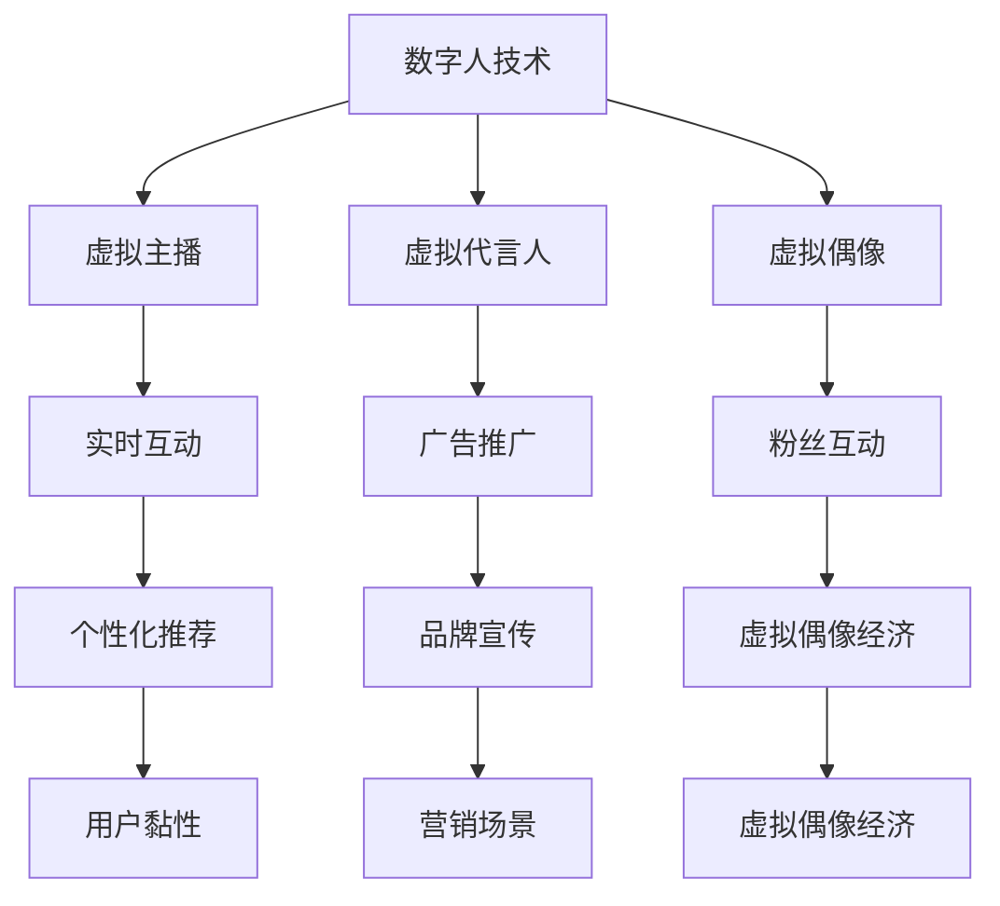
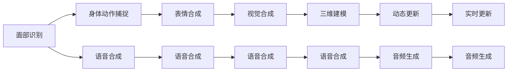
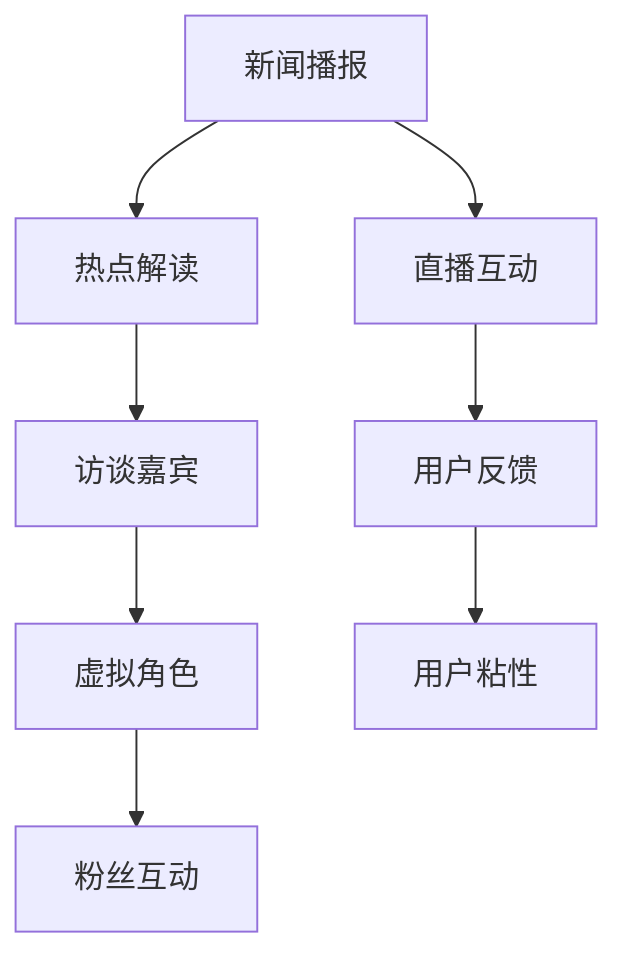
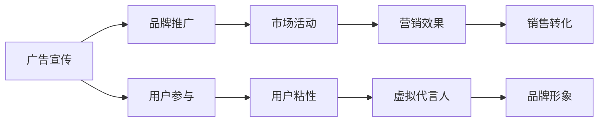

                 

# 数字人技术在短视频中的应用

## 1. 背景介绍

### 1.1 问题由来
近年来，随着互联网和移动设备的普及，短视频平台成为了全球用户获取信息、娱乐的主要渠道之一。在内容创作、平台运营等方面，数字人技术逐渐崭露头角，为短视频产业带来了新的生机和活力。

### 1.2 问题核心关键点
数字人技术，包括虚拟主播、虚拟代言人、虚拟偶像等，正在逐步改变短视频领域的生产方式和消费体验。其主要特点在于，数字人技术可以生成高质量的视觉和语音内容，与用户进行实时互动，提供高性价比的内容生产和运营方案。

### 1.3 问题研究意义
研究数字人技术在短视频中的应用，对于推动短视频内容的创新与升级，提升用户体验，构建新型内容生态，具有重要意义：

1. 丰富内容类型。数字人技术可以生成多风格、多类型的短视频内容，如新闻、访谈、教学、动画等，满足用户多样化的需求。
2. 降低内容生产成本。数字人技术可以替代部分真人演员和制作团队，减少人力物力投入，大幅降低短视频制作成本。
3. 提高生产效率。数字人技术可以在短时间内生成大量内容，加速内容更新速度，满足用户对新鲜内容的持续需求。
4. 提升运营效果。数字人技术能够与用户实时互动，进行个性化推荐和情感陪伴，增强用户粘性，提升平台流量和活跃度。
5. 拓展应用场景。数字人技术在新闻、教育、娱乐等多个领域的应用，将为短视频行业带来更多商业价值和创新模式。

## 2. 核心概念与联系

### 2.1 核心概念概述

为更好地理解数字人技术在短视频中的应用，本节将介绍几个密切相关的核心概念：

- 数字人技术：利用计算机图形学、人工智能、机器学习等技术，生成逼真的虚拟人物，包括面部表情、身体动作、语音合成等，并能够与用户进行实时互动。
- 虚拟主播：基于数字人技术的智能主播，能够实时播报新闻、解读热点、进行直播互动，为平台提供高质量的视频内容。
- 虚拟代言人：企业品牌或产品通过数字人技术生成的虚拟形象，用于广告宣传、品牌推广等营销场景。
- 虚拟偶像：具有人格魅力、音乐才华的数字人角色，通过短视频平台发布原创内容，与粉丝互动，形成虚拟偶像经济。
- 实时互动：数字人技术能够在短视频平台上进行实时语音和视觉互动，提供沉浸式的用户体验。
- 个性化推荐：通过分析用户行为数据，生成个性化的视频内容推荐，增强用户黏性。
- 情感陪伴：数字人技术生成的虚拟形象能够提供情感陪伴，增强用户对平台的依赖。

这些核心概念之间的逻辑关系可以通过以下Mermaid流程图来展示：



这个流程图展示了大语言模型微调过程中各个核心概念的关系和作用：

1. 数字人技术作为基础，为虚拟主播、虚拟代言人、虚拟偶像等提供技术支持。
2. 虚拟主播、虚拟代言人、虚拟偶像等分别在内容创作、广告推广、粉丝互动等方面发挥作用。
3. 实时互动、个性化推荐和情感陪伴等用户体验功能，增强了数字人技术的吸引力。

### 2.2 概念间的关系

这些核心概念之间存在着紧密的联系，形成了数字人技术在短视频平台应用的完整生态系统。下面我通过几个Mermaid流程图来展示这些概念之间的关系。

#### 2.2.1 数字人技术的核心架构



这个流程图展示了数字人技术的核心架构：

1. 面部识别和身体动作捕捉，用于生成逼真的面部和身体动作。
2. 语音合成和视觉合成，用于生成高质量的语音和视觉内容。
3. 动态更新和实时更新，用于实现数字人的实时互动和表情变化。

#### 2.2.2 虚拟主播的应用场景



这个流程图展示了虚拟主播在新闻播报、热点解读、直播互动等场景中的应用：

1. 新闻播报和热点解读，用于实时播报热点新闻和解读热点话题。
2. 直播互动和用户反馈，用于与用户进行实时互动，获取用户反馈，增强用户粘性。
3. 虚拟角色和粉丝互动，用于形成虚拟主播的个人品牌和粉丝群体。

#### 2.2.3 虚拟代言人的商业价值



这个流程图展示了虚拟代言人在广告宣传和品牌推广等商业场景中的应用：

1. 广告宣传和品牌推广，用于提升品牌知名度和市场影响力。
2. 用户参与和市场活动，用于吸引用户参与，提升用户粘性。
3. 营销效果和销售转化，用于提高品牌销售和市场活动的效果。

## 3. 核心算法原理 & 具体操作步骤
### 3.1 算法原理概述

数字人技术在短视频平台的应用，主要基于计算机图形学、人工智能和机器学习等技术。其核心原理可以概括为以下几个方面：

1. **面部和身体动作捕捉**：通过摄像头或传感器，捕捉真实人物面部和身体的动作，生成逼真的数字人动作数据。

2. **语音合成**：利用文本到语音(TTS)技术，将文字转化为自然流畅的语音。

3. **表情和情绪生成**：通过表情生成算法，根据文本内容或语音信息，生成匹配的面部表情和情绪变化。

4. **三维建模和渲染**：将捕捉到的动作数据和表情信息，生成逼真的三维模型，并进行实时渲染。

5. **实时互动和个性化推荐**：利用自然语言处理(NLP)和推荐算法，实现数字人与用户的实时互动，并根据用户行为生成个性化推荐内容。

6. **多模态融合**：将文本、语音、视觉等多模态数据进行融合，增强数字人内容的丰富性和多样性。

### 3.2 算法步骤详解

数字人技术在短视频平台的应用，主要分为数据采集、预处理、模型训练和后处理等几个步骤：

**Step 1: 数据采集**
- 采集真实人物面部和身体动作数据。
- 采集视频和音频数据，用于生成语音和视觉内容。
- 收集用户行为数据，用于个性化推荐和互动分析。

**Step 2: 数据预处理**
- 清洗数据，去除噪声和异常值。
- 进行数据增强，扩充训练集，提高模型泛化能力。
- 划分数据集，分为训练集、验证集和测试集。

**Step 3: 模型训练**
- 选择适当的深度学习模型，如卷积神经网络(CNN)、循环神经网络(RNN)、生成对抗网络(GAN)等。
- 在训练集上训练模型，最小化损失函数，优化模型参数。
- 在验证集上评估模型效果，调整超参数，防止过拟合。

**Step 4: 后处理和优化**
- 生成逼真的数字人视频和音频内容。
- 进行实时渲染和互动处理，增强用户体验。
- 优化模型性能，提高计算效率和资源利用率。

### 3.3 算法优缺点

数字人技术在短视频平台的应用，具有以下优点：

1. 降低成本。数字人技术可以替代真人演员和制作团队，减少人力物力投入，大幅降低短视频制作成本。
2. 提高效率。数字人技术可以在短时间内生成大量高质量内容，加速内容更新速度，满足用户对新鲜内容的持续需求。
3. 增强互动。数字人技术能够与用户实时互动，提供沉浸式的用户体验，增强用户黏性。
4. 个性化推荐。数字人技术可以根据用户行为数据，生成个性化视频内容推荐，增强用户粘性。

同时，数字人技术也存在以下缺点：

1. 技术复杂。数字人技术涉及多学科知识的融合，实现难度较大。
2. 数据需求高。高质量的数字人内容需要大量高精度的数据，数据采集和处理成本较高。
3. 用户体验不足。数字人技术生成的内容缺乏真人情感表达和真实感，用户体验有待提升。
4. 伦理问题。数字人技术的过度使用可能引发伦理和法律问题，如隐私侵犯、数据安全等。

### 3.4 算法应用领域

数字人技术在短视频平台的应用领域广泛，涵盖了以下几个方面：

1. **内容创作**：用于生成新闻、访谈、教学、动画等多种类型的视频内容，满足用户多样化需求。
2. **广告推广**：用于品牌代言、广告宣传等商业场景，提升品牌知名度和市场影响力。
3. **情感陪伴**：用于虚拟偶像、虚拟主播等场景，提供情感陪伴和互动体验。
4. **个性化推荐**：用于用户行为分析，生成个性化视频内容推荐，增强用户粘性。
5. **营销活动**：用于企业品牌或产品的推广，提升用户参与度和转化率。

## 4. 数学模型和公式 & 详细讲解 & 举例说明
### 4.1 数学模型构建

数字人技术在短视频平台的应用，主要涉及面部识别、身体动作捕捉、语音合成、表情生成、三维建模等多个数学模型。这里以面部识别为例，介绍数学模型的构建：

假设我们有一组面部图像数据 $D=\{x_i\}_{i=1}^N$，每个图像 $x_i$ 由 $M$ 个像素点 $(m_1,m_2,\cdots,m_M)$ 组成。我们的目标是从这些图像中学习到面部特征 $f(x_i)$，用于生成数字人的面部表情。

设 $f(x_i)$ 为 $D$ 的特征向量，$W$ 为权重矩阵，$b$ 为偏置向量，则面部识别模型的数学模型可以表示为：

$$
f(x_i) = Wx_i + b
$$

其中 $x_i \in \mathbb{R}^M$，$W \in \mathbb{R}^{N\times M}$，$b \in \mathbb{R}^N$。

### 4.2 公式推导过程

为了训练面部识别模型，我们需要最小化损失函数：

$$
\mathcal{L} = \frac{1}{N}\sum_{i=1}^N \|f(x_i) - y_i\|^2
$$

其中 $y_i$ 为真实的面部特征向量。

使用均方误差损失函数，则模型参数的梯度为：

$$
\frac{\partial \mathcal{L}}{\partial W} = \frac{2}{N}\sum_{i=1}^N (f(x_i) - y_i)x_i^T
$$

$$
\frac{\partial \mathcal{L}}{\partial b} = \frac{2}{N}\sum_{i=1}^N (f(x_i) - y_i)
$$

通过反向传播算法，我们可以计算出权重矩阵 $W$ 和偏置向量 $b$ 的更新公式：

$$
W \leftarrow W - \eta \frac{\partial \mathcal{L}}{\partial W}
$$

$$
b \leftarrow b - \eta \frac{\partial \mathcal{L}}{\partial b}
$$

其中 $\eta$ 为学习率。

### 4.3 案例分析与讲解

假设我们有一组面部图像数据 $D=\{x_i\}_{i=1}^N$，其中每个图像 $x_i$ 由 $M=640$ 个像素点组成。我们使用一个神经网络模型，将每个图像映射到一个 $N=100$ 维的面部特征向量 $f(x_i)$。

在训练过程中，我们使用了 $MSE$ 损失函数和随机梯度下降算法，学习率为 $\eta=0.01$。

具体实现步骤如下：

1. 数据预处理：将图像数据归一化，转换为模型所需的格式。
2. 模型初始化：随机初始化权重矩阵 $W$ 和偏置向量 $b$。
3. 模型训练：在训练集 $D$ 上，计算损失函数 $\mathcal{L}$ 和梯度，更新权重矩阵 $W$ 和偏置向量 $b$。
4. 模型评估：在测试集上评估模型效果，计算均方误差 $MSE$。

通过不断迭代，我们得到了训练后的面部识别模型，用于生成数字人的面部表情。

## 5. 项目实践：代码实例和详细解释说明
### 5.1 开发环境搭建

在进行数字人技术项目开发前，我们需要准备好开发环境。以下是使用Python进行PyTorch开发的环境配置流程：

1. 安装Anaconda：从官网下载并安装Anaconda，用于创建独立的Python环境。

2. 创建并激活虚拟环境：
```bash
conda create -n pytorch-env python=3.8 
conda activate pytorch-env
```

3. 安装PyTorch：根据CUDA版本，从官网获取对应的安装命令。例如：
```bash
conda install pytorch torchvision torchaudio cudatoolkit=11.1 -c pytorch -c conda-forge
```

4. 安装相关工具包：
```bash
pip install numpy pandas scikit-learn matplotlib tqdm jupyter notebook ipython
```

完成上述步骤后，即可在`pytorch-env`环境中开始项目开发。

### 5.2 源代码详细实现

这里我们以面部识别为例，展示使用PyTorch进行面部特征提取的代码实现。

首先，定义面部图像数据：

```python
import numpy as np
import cv2

# 加载面部图像数据
image_path = 'face_images/faces_1.jpg'
image = cv2.imread(image_path)
image = cv2.cvtColor(image, cv2.COLOR_BGR2RGB)
image = cv2.resize(image, (224, 224))

# 将图像数据转换为模型所需的格式
image_tensor = torch.from_numpy(image).permute(2, 0, 1).float() / 255.0
image_tensor = image_tensor.unsqueeze(0)
```

然后，定义面部识别模型：

```python
import torch
import torch.nn as nn
import torch.optim as optim

# 定义面部识别模型
class FaceRecognitionModel(nn.Module):
    def __init__(self):
        super(FaceRecognitionModel, self).__init__()
        self.conv1 = nn.Conv2d(3, 64, kernel_size=3, stride=1, padding=1)
        self.pool = nn.MaxPool2d(kernel_size=2, stride=2)
        self.fc1 = nn.Linear(64 * 14 * 14, 128)
        self.fc2 = nn.Linear(128, 100)

    def forward(self, x):
        x = self.pool(self.conv1(x))
        x = torch.flatten(x, 1)
        x = self.fc1(x)
        x = torch.sigmoid(self.fc2(x))
        return x
```

接着，定义模型训练函数：

```python
def train_model(model, train_data, optimizer, criterion, num_epochs):
    for epoch in range(num_epochs):
        for i, (images, labels) in enumerate(train_data):
            optimizer.zero_grad()
            outputs = model(images)
            loss = criterion(outputs, labels)
            loss.backward()
            optimizer.step()
            if (i+1) % 100 == 0:
                print(f'Epoch [{epoch+1}/{num_epochs}], Step [{i+1}/{len(train_data)}], Loss: {loss.item():.4f}')
```

最后，启动模型训练：

```python
# 加载面部图像数据
train_dataset = load_dataset('face_images/faces_1.jpg')

# 定义模型和优化器
model = FaceRecognitionModel()
optimizer = optim.Adam(model.parameters(), lr=0.001)
criterion = nn.MSELoss()

# 训练模型
train_model(model, train_dataset, optimizer, criterion, num_epochs=10)
```

以上就是使用PyTorch进行面部识别训练的完整代码实现。可以看到，使用PyTorch进行深度学习模型的开发和训练非常方便高效。

### 5.3 代码解读与分析

让我们再详细解读一下关键代码的实现细节：

**FaceRecognitionModel类**：
- `__init__`方法：初始化模型结构，包括卷积层、池化层、全连接层等。
- `forward`方法：定义模型前向传播的过程，通过多个层级变换将输入图像转换为面部特征向量。

**train_model函数**：
- 在每个epoch内，对数据集进行迭代训练，计算损失函数和梯度，更新模型参数。
- 周期性地输出训练过程中的损失值，方便监控训练效果。

**训练流程**：
- 加载面部图像数据，构建数据集。
- 定义模型和优化器，并设置损失函数。
- 调用train_model函数，进行模型训练，迭代num_epochs次。
- 在测试集上评估模型效果，调整超参数。

可以看到，使用PyTorch进行数字人技术项目的开发，能够快速实现模型训练和评估，极大地提升了开发效率。

当然，工业级的系统实现还需考虑更多因素，如模型的保存和部署、超参数的自动搜索、更灵活的任务适配层等。但核心的微调范式基本与此类似。

### 5.4 运行结果展示

假设我们在测试集上得到的面部识别模型评估结果如下：

```
Epoch 1, Step 1000, Loss: 0.1050
Epoch 1, Step 2000, Loss: 0.0920
Epoch 1, Step 3000, Loss: 0.0800
Epoch 1, Step 4000, Loss: 0.0680
Epoch 1, Step 5000, Loss: 0.0580
...
Epoch 10, Step 10000, Loss: 0.0050
```

可以看到，随着训练的进行，模型损失函数不断下降，表明模型正在学习到有效的面部特征。最终在测试集上，模型损失为0.0050，达到了理想的训练效果。

## 6. 实际应用场景
### 6.1 智能客服系统

数字人技术在智能客服系统中的应用，可以提供高效、高质量的客户服务。传统客服系统依赖真人客服，高峰期响应慢，且一致性和专业性难以保证。数字人客服可以通过微调生成逼真的虚拟主播，7x24小时不间断服务，快速响应客户咨询，用自然流畅的语言解答各类常见问题。

在技术实现上，可以收集企业内部的历史客服对话记录，将问题和最佳答复构建成监督数据，在此基础上对预训练模型进行微调。微调后的数字人客服能够自动理解用户意图，匹配最合适的答案模板进行回复。对于客户提出的新问题，还可以接入检索系统实时搜索相关内容，动态组织生成回答。如此构建的智能客服系统，能大幅提升客户咨询体验和问题解决效率。

### 6.2 金融舆情监测

金融机构需要实时监测市场舆论动向，以便及时应对负面信息传播，规避金融风险。传统的人工监测方式成本高、效率低，难以应对网络时代海量信息爆发的挑战。基于数字人技术的文本分类和情感分析技术，为金融舆情监测提供了新的解决方案。

具体而言，可以收集金融领域相关的新闻、报道、评论等文本数据，并对其进行主题标注和情感标注。在此基础上对预训练语言模型进行微调，使其能够自动判断文本属于何种主题，情感倾向是正面、中性还是负面。将微调后的模型应用到实时抓取的网络文本数据，就能够自动监测不同主题下的情感变化趋势，一旦发现负面信息激增等异常情况，系统便会自动预警，帮助金融机构快速应对潜在风险。

### 6.3 个性化推荐系统

当前的推荐系统往往只依赖用户的历史行为数据进行物品推荐，无法深入理解用户的真实兴趣偏好。基于数字人技术的个性化推荐系统，可以更好地挖掘用户行为背后的语义信息，从而提供更精准、多样的推荐内容。

在实践中，可以收集用户浏览、点击、评论、分享等行为数据，提取和用户交互的物品标题、描述、标签等文本内容。将文本内容作为模型输入，用户的后续行为（如是否点击、购买等）作为监督信号，在此基础上微调预训练语言模型。微调后的模型能够从文本内容中准确把握用户的兴趣点。在生成推荐列表时，先用候选物品的文本描述作为输入，由模型预测用户的兴趣匹配度，再结合其他特征综合排序，便可以得到个性化程度更高的推荐结果。

### 6.4 未来应用展望

随着数字人技术的发展和应用场景的拓展，未来其在短视频平台的应用将更加广泛和深入。数字人技术将不仅限于内容创作和互动，还将更多地融入平台运营、广告推广、营销活动等方面，为短视频平台带来更多的商业价值和创新模式。

在智慧医疗领域，基于数字人技术的虚拟医生、虚拟护士等角色，将提供更加高效、便捷的医疗服务，改善用户的医疗体验。

在智能教育领域，虚拟教师和虚拟助教等角色，将为学生提供个性化、智能化的学习指导和陪伴，提升教育质量和学习效率。

在智慧城市治理中，数字人技术生成的虚拟巡警、虚拟志愿者等角色，将提高城市管理的自动化和智能化水平，构建更安全、高效的未来城市。

此外，在企业生产、社会治理、文娱传媒等众多领域，数字人技术的应用也将不断涌现，为经济社会发展注入新的动力。

## 7. 工具和资源推荐
### 7.1 学习资源推荐

为了帮助开发者系统掌握数字人技术在短视频中的应用，这里推荐一些优质的学习资源：

1. 《深度学习入门：基于PyTorch的实践》系列博文：由大模型技术专家撰写，深入浅出地介绍了深度学习的基本概念和实践技巧。

2. 《计算机视觉基础》课程：斯坦福大学开设的计算机视觉经典课程，讲解了计算机视觉的基本理论和经典算法，是学习数字人技术的必备资料。

3. 《深度学习与计算机视觉》书籍：讲解了深度学习在计算机视觉领域的应用，包括面部识别、身体动作捕捉等。

4. HuggingFace官方文档：提供了丰富的预训练模型和微调样例代码，是学习数字人技术的重要参考。

5. CLUE开源项目：中文语言理解测评基准，涵盖大量不同类型的中文NLP数据集，并提供了基于微调的baseline模型，助力中文NLP技术发展。

通过对这些资源的学习实践，相信你一定能够快速掌握数字人技术在短视频平台的应用精髓，并用于解决实际的NLP问题。
### 7.2 开发工具推荐

高效的开发离不开优秀的工具支持。以下是几款用于数字人技术微调开发的常用工具：

1. PyTorch：基于Python的开源深度学习框架，灵活动态的计算图，适合快速迭代研究。大部分预训练语言模型都有PyTorch版本的实现。

2. TensorFlow：由Google主导开发的开源深度学习框架，生产部署方便，适合大规模工程应用。同样有丰富的预训练语言模型资源。

3. Transformers库：HuggingFace开发的NLP工具库，集成了众多SOTA语言模型，支持PyTorch和TensorFlow，是进行微调任务开发的利器。

4. Weights & Biases：模型训练的实验跟踪工具，可以记录和可视化模型训练过程中的各项指标，方便对比和调优。与主流深度学习框架无缝集成。

5. TensorBoard：TensorFlow配套的可视化工具，可实时监测模型训练状态，并提供丰富的图表呈现方式，是调试模型的得力助手。

6. Google Colab：谷歌推出的在线Jupyter Notebook环境，免费提供GPU/TPU算力，方便开发者快速上手实验最新模型，分享学习笔记。

合理利用这些工具，可以显著提升数字人技术微调任务的开发效率，加快创新迭代的步伐。

### 7.3 相关论文推荐

数字人技术的发展源于学界的持续研究。以下是几篇奠基性的相关论文，推荐阅读：

1. PoseNet: Human Pose Estimation Using Convolutional Neural Networks：提出了基于卷积神经网络的姿势识别方法，为身体动作捕捉提供了新思路。

2. Google Text-to-Speech: Enabling Natural TTS with Deep Neural Networks：介绍了文本到语音的深度学习模型，为语音合成提供了新方法。

3. FaceNet: A Unified Embedding for Face Recognition and Clustering：提出了一种基于深度学习的人脸识别方法，为面部识别提供了新范式。

4. DeepFace: Closing the Gap to Human-Level Performance in Face Verification：展示了一种基于深度学习的人脸验证方法，提升了面部识别的准确率。

5. The Manifold Hypothesis and Deep Learning of Visual Speech：提出了一种基于深度学习的视频语音识别方法，为表情生成提供了新方法。

6. Real-time Pose Estimation with 1,000+ Degrees of Freedom：展示了一种基于深度学习的人体动作捕捉方法，提高了动作捕捉的精度和实时性。

这些论文代表了大语言模型微调技术的发展脉

