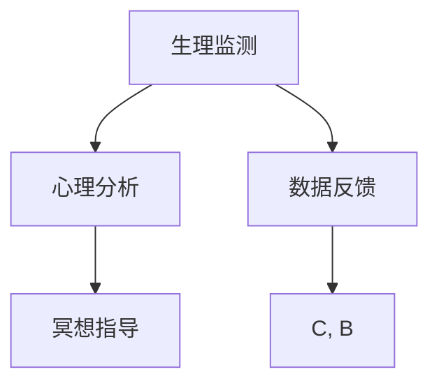

                 

## 1. 背景介绍

在快节奏的现代生活中，人们普遍面临工作压力、生活琐事、人际关系等多方面的困扰，导致心理疲惫和精神紧张。数字化冥想作为一种基于人工智能（AI）的辅助技术，能够通过实时分析用户的情绪和行为，提供个性化的冥想指导和建议，帮助用户达到心灵的平静和身心的平衡。数字化冥想技术的快速发展，为我们探索和实践心灵平静提供了全新的视角和方法。

### 1.1 问题由来

随着移动互联网和智能设备的普及，人们越来越多地依赖手机、电脑等设备来获取信息、交流沟通。这虽然极大地方便了我们的生活和工作，但也带来了诸多问题。长时间使用电子设备不仅导致视力下降、颈椎疾病等生理健康问题，更引发了焦虑、抑郁等心理问题。心理健康的重视程度日益增加，数字化冥想应运而生，成为了一种新兴的心理健康辅助技术。

### 1.2 问题核心关键点

数字化冥想的核心在于利用AI技术，通过实时监测用户的生理和心理状态，结合专业的冥想指导，为用户提供个性化的冥想方案。其关键点包括：

- **生理监测**：通过心率、皮肤电、脑波等生理信号监测用户的身体状态。
- **心理分析**：利用自然语言处理、情感分析等技术，分析用户的情绪和压力水平。
- **冥想指导**：根据用户的生理和心理状态，提供个性化的冥想指导和建议，帮助用户放松身心。
- **数据反馈**：持续收集用户反馈，优化冥想方案，提升用户体验。

### 1.3 问题研究意义

数字化冥想技术的深入研究，对于促进公众心理健康、提升生活质量具有重要意义。具体表现在：

1. **心理压力缓解**：通过科学的心理分析和个性化的冥想指导，帮助用户缓解心理压力，提升心理韧性。
2. **身心平衡**：数字化冥想技术能够实时监测用户的生理和心理状态，提供科学的身心健康管理方案。
3. **时间管理**：数字化冥想技术能够帮助用户合理分配时间和精力，提升工作和生活效率。
4. **自我提升**：通过持续的冥想练习，用户能够提升自我认知和情绪调节能力，实现自我提升。

## 2. 核心概念与联系

### 2.1 核心概念概述

数字化冥想技术涉及多个关键概念，主要包括：

- **生理监测**：通过传感器等设备实时采集用户的生理信号，如心率、皮肤电、脑波等，用于分析用户的身体状态。
- **心理分析**：利用情感分析、自然语言处理等技术，对用户的情绪、压力水平等心理状态进行分析。
- **冥想指导**：根据用户的生理和心理状态，提供个性化的冥想指导和建议，帮助用户放松身心。
- **数据反馈**：通过用户反馈和数据分析，持续优化冥想方案，提升用户体验。

这些概念之间紧密联系，共同构成了数字化冥想的核心技术框架。

### 2.2 概念间的关系

数字化冥想的核心概念之间关系紧密，通过以下Mermaid流程图进行展示：



这个流程图展示了数字化冥想技术的基本流程：

1. 通过生理监测获取用户的身体状态。
2. 利用心理分析技术对用户的心理状态进行分析。
3. 根据生理和心理状态提供个性化的冥想指导。
4. 通过数据反馈不断优化冥想方案。

这些概念相互依存、相互影响，共同构成了数字化冥想技术的完整生态系统。

## 3. 核心算法原理 & 具体操作步骤

### 3.1 算法原理概述

数字化冥想技术的核心算法原理基于生理监测、心理分析和冥想指导三个部分：

1. **生理监测算法**：通过传感器采集用户的生理信号，包括心率、皮肤电、脑波等，实时监测用户的身体状态。
2. **心理分析算法**：利用情感分析、自然语言处理等技术，分析用户的情绪、压力水平等心理状态。
3. **冥想指导算法**：根据用户的生理和心理状态，提供个性化的冥想指导和建议，帮助用户放松身心。

### 3.2 算法步骤详解

数字化冥想技术的实现步骤包括：

1. **设备准备**：选择合适的生理监测设备（如心率传感器、皮肤电传感器）和心理分析工具（如情感分析模型、自然语言处理模型）。
2. **数据采集**：通过设备实时采集用户的生理和心理数据，包括心率、皮肤电、脑波等生理信号，以及用户情绪、压力水平等心理数据。
3. **数据处理**：对采集到的数据进行预处理、清洗和归一化，确保数据质量。
4. **特征提取**：从处理后的数据中提取特征，如心率变化、皮肤电水平、脑波模式等，用于后续分析和指导。
5. **心理分析**：利用情感分析、自然语言处理等技术，对用户的情绪、压力水平等心理状态进行分析，生成心理报告。
6. **冥想指导**：根据生理和心理报告，提供个性化的冥想指导和建议，包括冥想时长、冥想类型等。
7. **数据反馈**：收集用户对冥想指导的反馈，进行数据分析和模型优化，持续提升冥想效果。

### 3.3 算法优缺点

数字化冥想技术的优点在于：

- **个性化定制**：根据用户的生理和心理状态，提供个性化的冥想方案，提升用户体验。
- **实时监测**：通过实时监测用户的生理和心理状态，及时调整冥想方案，确保效果。
- **科学指导**：利用科学的心理分析和冥想指导技术，提升用户的心理健康水平。

但其缺点也显而易见：

- **设备依赖**：需要专业设备支持，用户成本较高。
- **隐私问题**：生理监测和心理分析涉及敏感数据，用户隐私保护需特别注意。
- **技术复杂性**：涉及多种技术，实现复杂，需高水平的技术团队支持。

### 3.4 算法应用领域

数字化冥想技术主要应用于心理健康领域，具体包括：

- **心理健康咨询**：通过科学的心理分析和冥想指导，帮助用户缓解压力、提升心理健康水平。
- **压力管理**：实时监测用户心理状态，提供压力管理方案，帮助用户有效应对压力。
- **身心平衡**：结合生理监测和心理分析，提供全面的身心健康管理方案，提升用户生活质量。
- **情绪调节**：通过情绪分析，识别用户情绪波动，提供情绪调节建议，帮助用户保持良好情绪状态。

## 4. 数学模型和公式 & 详细讲解

### 4.1 数学模型构建

数字化冥想技术涉及多种数学模型，以下以生理监测和心理分析为例进行详细讲解：

**生理监测模型**：
- **心率监测模型**：利用心率传感器实时监测用户的心率变化，模型形式为 $H(t) = \alpha + \beta \cdot t + \gamma \cdot \sin(\delta \cdot t)$，其中 $H(t)$ 为心率变化，$t$ 为时间，$\alpha$、$\beta$、$\gamma$、$\delta$ 为模型参数。
- **皮肤电监测模型**：通过皮肤电传感器实时监测用户的皮肤电水平，模型形式为 $E(t) = \eta + \zeta \cdot t + \theta \cdot \sin(\iota \cdot t)$，其中 $E(t)$ 为皮肤电水平，$t$ 为时间，$\eta$、$\zeta$、$\theta$、$\iota$ 为模型参数。

**心理分析模型**：
- **情感分析模型**：利用情感分析技术，对用户输入的自然语言文本进行情感分类，模型形式为 $E(x) = f(x; \theta)$，其中 $E(x)$ 为情感评分，$x$ 为输入文本，$\theta$ 为模型参数。
- **压力分析模型**：通过心理问卷等方法，对用户的压力水平进行评估，模型形式为 $P(t) = \lambda + \mu \cdot t + \nu \cdot \sin(\rho \cdot t)$，其中 $P(t)$ 为压力水平，$t$ 为时间，$\lambda$、$\mu$、$\nu$、$\rho$ 为模型参数。

### 4.2 公式推导过程

以情感分析模型为例，详细推导其公式：

1. **数据预处理**：将用户输入的文本 $x$ 进行分词、词性标注等预处理，生成特征向量 $v$。
2. **特征嵌入**：将特征向量 $v$ 映射到高维向量空间，生成嵌入向量 $z$。
3. **情感分类**：利用分类器对嵌入向量 $z$ 进行情感分类，生成情感评分 $E(x)$。

情感分类器通常采用支持向量机（SVM）或神经网络等模型，其训练过程为：

$$
\theta^* = \mathop{\arg\min}_{\theta} \frac{1}{N} \sum_{i=1}^N \ell(Y_i, f(x_i; \theta))
$$

其中 $\theta$ 为模型参数，$Y_i$ 为标签（正面、负面或中性），$\ell$ 为损失函数。

### 4.3 案例分析与讲解

以情感分析为例，展示其在数字化冥想中的应用：

1. **数据采集**：通过文本输入接口，采集用户情绪相关的自然语言文本，如日记、微博等。
2. **特征提取**：对文本进行分词、词性标注等处理，生成特征向量 $v$。
3. **特征嵌入**：将特征向量 $v$ 映射到高维向量空间，生成嵌入向量 $z$。
4. **情感分类**：利用情感分析模型对嵌入向量 $z$ 进行情感分类，生成情感评分 $E(x)$。
5. **冥想指导**：根据情感评分 $E(x)$，提供个性化的冥想指导和建议，如冥想时长、冥想类型等。

## 5. 项目实践：代码实例和详细解释说明

### 5.1 开发环境搭建

进行数字化冥想项目开发前，需要进行以下环境准备：

1. **Python环境**：安装Python 3.8及以上版本，推荐使用Anaconda进行环境管理。
2. **库安装**：安装必要的Python库，如TensorFlow、PyTorch、NumPy、Pandas等。
3. **设备连接**：确保生理监测设备和心理分析工具正常连接，并能够正常工作。
4. **数据收集**：准备并整理用户生理和心理数据，确保数据质量。

### 5.2 源代码详细实现

以下是一个简化的数字化冥想系统的代码实现，以情感分析为例：

```python
import tensorflow as tf
from tensorflow.keras.preprocessing.text import Tokenizer
from tensorflow.keras.preprocessing.sequence import pad_sequences
from tensorflow.keras.layers import Embedding, LSTM, Dense
from tensorflow.keras.models import Sequential

# 加载文本数据
texts = ['我感到非常开心', '今天心情不太好', '我有些焦虑']
labels = [1, 0, 1]

# 构建词袋模型
tokenizer = Tokenizer(num_words=1000)
tokenizer.fit_on_texts(texts)
sequences = tokenizer.texts_to_sequences(texts)
padded_sequences = pad_sequences(sequences, padding='post', maxlen=20)

# 定义模型
model = Sequential()
model.add(Embedding(input_dim=1000, output_dim=64, input_length=20))
model.add(LSTM(units=32))
model.add(Dense(units=1, activation='sigmoid'))

# 编译模型
model.compile(loss='binary_crossentropy', optimizer='adam', metrics=['accuracy'])

# 训练模型
model.fit(padded_sequences, labels, epochs=10, batch_size=8)

# 情感分析
new_text = '我很郁闷'
padded_new_text = tokenizer.texts_to_sequences([new_text])
padded_new_text = pad_sequences(padded_new_text, padding='post', maxlen=20)
prediction = model.predict(padded_new_text)
print(prediction)
```

### 5.3 代码解读与分析

代码实现主要包括：

1. **文本预处理**：通过Tokenizer将文本转换为序列，并使用pad_sequences对序列进行填充，确保模型输入格式一致。
2. **模型构建**：定义一个简单的LSTM模型，包含嵌入层、LSTM层和全连接层，用于情感分类。
3. **模型训练**：通过fit方法对模型进行训练，设定损失函数、优化器和评价指标。
4. **情感分析**：使用训练好的模型对新文本进行情感分类，输出情感评分。

### 5.4 运行结果展示

假设在训练后，我们对新文本'我很郁闷'进行情感分析，得到输出结果为0.7，表示该文本属于负面情感。

## 6. 实际应用场景

数字化冥想技术已经在多个领域得到应用，以下列举几个典型场景：

### 6.1 心理健康咨询

在心理健康咨询中，数字化冥想技术通过实时监测用户的生理和心理状态，提供个性化的冥想方案，帮助用户缓解压力、提升心理健康水平。

### 6.2 压力管理

通过实时监测用户心理状态，数字化冥想技术能够提供压力管理方案，帮助用户有效应对压力。

### 6.3 身心平衡

结合生理监测和心理分析，数字化冥想技术提供全面的身心健康管理方案，提升用户生活质量。

### 6.4 情绪调节

通过情绪分析，识别用户情绪波动，提供情绪调节建议，帮助用户保持良好情绪状态。

## 7. 工具和资源推荐

### 7.1 学习资源推荐

1. **《深度学习：理论与实践》**：涵盖了深度学习的基础理论和实践技巧，适合初学者学习。
2. **《Python深度学习》**：详细介绍了使用Python进行深度学习开发的方法和技巧，包括TensorFlow和PyTorch等库的使用。
3. **Kaggle竞赛**：参与Kaggle竞赛，实战练习情感分析、自然语言处理等技术。

### 7.2 开发工具推荐

1. **TensorFlow**：由Google主导的深度学习框架，适合大规模工程应用。
2. **PyTorch**：灵活高效的深度学习框架，适合研究和实验。
3. **Jupyter Notebook**：免费的交互式开发环境，适合快速迭代开发和实验。

### 7.3 相关论文推荐

1. **《深度学习在心理健康中的应用》**：探讨深度学习技术在心理健康领域的应用，包括情感分析、心理预测等。
2. **《基于生理信号的情感分析研究综述》**：总结了基于生理信号的情感分析技术的研究进展和方法。

## 8. 总结：未来发展趋势与挑战

### 8.1 研究成果总结

数字化冥想技术结合生理监测、心理分析和冥想指导，通过科学的方法帮助用户缓解心理压力、提升身心健康水平。该技术已经在心理健康咨询、压力管理、身心平衡等多个领域得到应用，取得了显著效果。

### 8.2 未来发展趋势

未来，数字化冥想技术的发展趋势包括：

1. **技术融合**：与可穿戴设备、物联网等技术结合，实现更加全面、精准的生理监测和心理分析。
2. **多模态数据融合**：结合生理、心理、行为等多模态数据，提供更加全面的用户分析。
3. **个性化定制**：通过深度学习模型，实现更加个性化的冥想指导和方案。
4. **实时反馈**：提供实时的数据反馈和建议，帮助用户及时调整冥想方案。

### 8.3 面临的挑战

尽管数字化冥想技术在心理健康领域取得了一些进展，但仍然面临以下挑战：

1. **隐私保护**：生理监测和心理分析涉及敏感数据，隐私保护问题需特别注意。
2. **技术复杂性**：涉及多种技术和设备，实现复杂，需高水平的技术团队支持。
3. **模型鲁棒性**：在复杂环境和多种数据来源下，模型的鲁棒性需进一步提升。

### 8.4 研究展望

未来的研究可以从以下几个方向进行探索：

1. **隐私保护技术**：开发隐私保护算法，确保用户数据安全。
2. **多模态融合技术**：结合多种数据源，提升数据分析的全面性和准确性。
3. **个性化定制技术**：通过深度学习模型，实现更加个性化的冥想指导和方案。
4. **实时反馈系统**：开发实时反馈系统，及时调整冥想方案，提升用户体验。

## 9. 附录：常见问题与解答

**Q1: 数字化冥想技术是否适用于所有用户？**

A: 数字化冥想技术适用于大多数用户，但需注意以下几点：
- 对于儿童、老年人等特殊群体，需慎重使用。
- 对于有严重心理疾病或精神障碍的用户，需专业心理医生的辅助。

**Q2: 数字化冥想技术的安全性如何保障？**

A: 数字化冥想技术的安全性保障需从以下几个方面进行：
- 数据加密：确保用户数据在传输和存储过程中的安全。
- 访问控制：设置严格的访问权限，防止未经授权的访问。
- 模型透明性：确保模型的训练和运行过程透明，便于用户监督和理解。

**Q3: 数字化冥想技术如何与其他健康技术结合？**

A: 数字化冥想技术可以与其他健康技术结合，如可穿戴设备、物联网等，实现更加全面和精准的用户健康监测和分析。例如，结合心率监测设备，实时监测用户的心率变化，提供更加个性化的冥想指导。

**Q4: 数字化冥想技术的前景如何？**

A: 数字化冥想技术在心理健康领域具有广阔的应用前景，未来将进一步发展，成为心理健康领域的重要工具。结合更多先进技术和设备，数字化冥想技术将为用户带来更加全面和精准的健康管理方案。

---

作者：禅与计算机程序设计艺术 / Zen and the Art of Computer Programming

