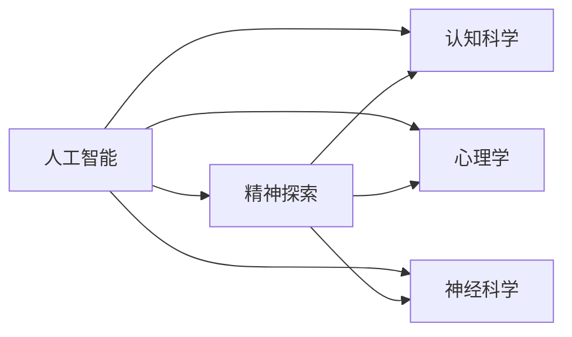
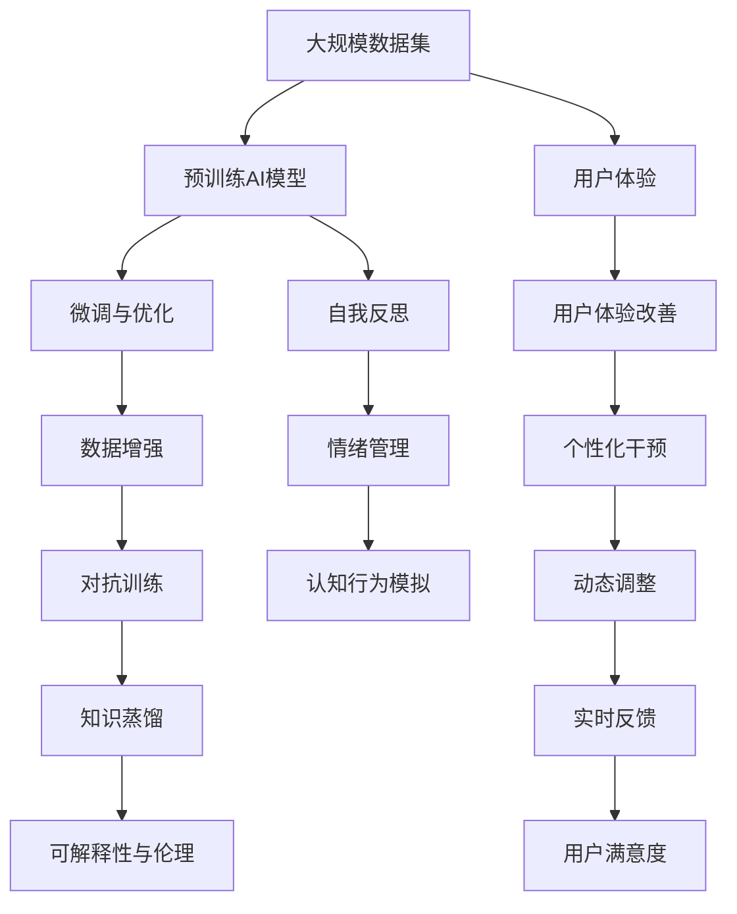

                 

# 数字化灵性：AI辅助的精神探索

## 1. 背景介绍

### 1.1 问题由来
在数字化时代，人工智能（AI）技术已经渗透到了我们生活的方方面面。从智能手机到自动驾驶，从推荐系统到医疗诊断，AI 的应用范围之广，影响之深，令人叹为观止。然而，当我们深入思考 AI 技术的本质和应用场景时，一个值得探讨的话题便浮现出来：**AI 能否帮助人类探索精神世界，增强人类的灵性？**

### 1.2 问题核心关键点
当前，AI 在心理学、认知科学、神经科学等领域的应用研究方兴未艾，其中不乏探索 AI 如何辅助精神探索的尝试。这些尝试包括利用 AI 进行心理状态识别、情绪分析、认知行为模拟等。然而，由于缺乏系统化的理论框架和方法论，这些研究往往停留在局部应用层面，未能形成具有广泛普适性的解决方案。

### 1.3 问题研究意义
研究 AI 辅助精神探索，不仅有助于深化对人类心理和灵性的理解，还能为 AI 技术的发展开拓新的应用领域，促进跨学科的融合和创新。具体而言，其研究意义如下：

- **深化灵性理解**：通过 AI 辅助的精神探索，可以更好地理解人类的心理状态、情感波动、意识流等，从而拓展人类对灵性的认知边界。
- **提升精神健康**：AI 技术可以辅助心理干预、情绪管理、压力缓解等，帮助人类维持心理健康，提升生活质量。
- **促进跨学科融合**：AI 技术的发展为心理学、神经科学、医学等领域的交叉研究提供了新工具和方法，促进了知识共享和创新。
- **推动技术进步**：研究 AI 辅助精神探索，可以推动 AI 算法和模型的改进，提升其泛化能力和鲁棒性。

## 2. 核心概念与联系

### 2.1 核心概念概述

在探讨 AI 辅助精神探索的过程中，需要涉及多个核心概念，包括：

- **人工智能（AI）**：利用算法和计算能力，模拟人类智能的行为和能力，如感知、推理、学习等。
- **精神探索（Spiritual Exploration）**：通过内省、冥想、认知练习等方式，探索人类心灵的深层结构和体验。
- **认知科学（Cognitive Science）**：研究人类思维、感知、意识等心理现象的科学。
- **心理学（Psychology）**：研究人类行为、情绪、个性等心理特征的科学。
- **神经科学（Neuroscience）**：研究神经系统结构和功能的科学，特别是如何通过神经活动解释心理和行为。

这些概念之间存在着密切的联系，通过跨学科的合作与融合，可以为 AI 辅助精神探索提供坚实的理论基础和技术支持。

### 2.2 概念间的关系

通过一个 Mermaid 流程图，可以直观地展示这些核心概念之间的关系：



这个流程图展示了 AI 技术如何在多个学科的支撑下，辅助人类探索精神世界。

### 2.3 核心概念的整体架构

接下来，我们将通过一个综合的流程图，展示 AI 辅助精神探索的整体架构：



这个流程图展示了从数据收集、模型训练、微调与优化，到用户体验、干预措施等多个环节的协同工作，共同构成了一个系统的 AI 辅助精神探索架构。

## 3. 核心算法原理 & 具体操作步骤
### 3.1 算法原理概述

AI 辅助精神探索的核心算法原理包括以下几个方面：

- **数据收集与预处理**：通过问卷调查、生理监测、行为分析等方式，收集用户的心理和生理数据。数据预处理包括数据清洗、归一化、特征提取等步骤。
- **模型训练与微调**：基于收集到的数据，训练神经网络模型，并进行微调以适应特定精神探索任务。微调过程中，使用监督学习或无监督学习算法，对模型参数进行调整。
- **特征提取与分析**：利用训练好的模型，提取用户的心理特征和行为模式。这些特征可以包括注意力分布、情绪状态、意识流等。
- **认知行为模拟与干预**：通过模拟用户的行为和心理过程，识别出影响精神健康的关键因素，设计干预措施，如冥想指导、情绪调节技巧等。
- **动态调整与反馈机制**：根据用户反馈和心理变化，动态调整干预措施，持续优化精神探索效果。

### 3.2 算法步骤详解

下面是 AI 辅助精神探索的详细步骤：

**Step 1: 数据收集与预处理**

- **问卷调查**：设计心理状态、情绪、行为等相关的问卷，收集用户的数据。问卷设计应考虑覆盖广泛的心理维度，同时确保用户隐私和数据安全。
- **生理监测**：使用可穿戴设备或传感器，实时监测用户的生理指标，如心率、血压、脑电波等。这些生理数据可以反映用户的心理和情绪状态。
- **行为分析**：通过用户的日常行为数据，如社交媒体使用、手机使用习惯、睡眠模式等，分析其心理和情绪特征。

**Step 2: 模型训练与微调**

- **选择模型**：选择适合精神探索任务的深度学习模型，如卷积神经网络（CNN）、循环神经网络（RNN）、变分自编码器（VAE）等。
- **数据准备**：将收集到的数据进行标注和处理，转化为适合模型训练的格式。标注数据应包括用户的心理状态、情绪状态、行为模式等。
- **模型训练**：使用标注数据训练模型，并根据任务需求进行微调。微调过程可以通过迁移学习、微调等方法，提升模型在特定精神探索任务上的表现。
- **模型评估**：在验证集上评估模型的性能，选择表现最佳的模型进行后续应用。

**Step 3: 特征提取与分析**

- **特征提取**：利用训练好的模型，从用户数据中提取心理特征和行为模式。这些特征可以包括注意力分布、情绪状态、意识流等。
- **特征分析**：对提取的特征进行分析和解释，识别出影响精神健康的关键因素。特征分析可以借助聚类算法、回归模型、时间序列分析等方法。

**Step 4: 认知行为模拟与干预**

- **行为模拟**：利用机器学习模型，模拟用户的认知行为过程。通过模拟，可以更好地理解用户的心理状态和行为模式。
- **干预设计**：根据行为模拟的结果，设计针对性的干预措施，如冥想指导、情绪调节技巧、行为习惯改善等。
- **干预实施**：将设计的干预措施转化为实际应用，帮助用户改善精神健康状况。

**Step 5: 动态调整与反馈机制**

- **反馈收集**：通过问卷调查、生理监测等方式，收集用户对干预措施的反馈。反馈应包括用户的满意度和心理变化情况。
- **动态调整**：根据反馈结果，动态调整干预措施，持续优化精神探索效果。动态调整可以借助自适应学习算法、强化学习等方法。
- **持续改进**：根据用户反馈和精神状态的变化，持续改进干预措施，提升精神探索的科学性和有效性。

### 3.3 算法优缺点

AI 辅助精神探索的算法具有以下优点：

- **全面覆盖**：利用多维数据和跨学科方法，可以全面覆盖用户的心理和生理状态，提供更全面的精神探索支持。
- **实时反馈**：通过实时监测和反馈机制，可以动态调整干预措施，提升用户体验。
- **科学化决策**：基于数据驱动的特征分析和模型预测，可以提供更科学的决策依据，提升干预效果。

同时，也存在一些缺点：

- **隐私问题**：数据收集和存储过程中，用户的隐私和数据安全需要得到充分保护。
- **模型鲁棒性**：模型训练和微调过程中，需要考虑数据的复杂性和多样性，以确保模型的泛化能力和鲁棒性。
- **伦理问题**：AI 辅助精神探索可能引发伦理问题，如数据滥用、算法偏见等，需要在设计和应用中加以重视。

### 3.4 算法应用领域

AI 辅助精神探索的算法已经在多个领域得到了应用，包括但不限于：

- **心理健康**：通过实时监测用户的生理和心理状态，提供心理支持和干预措施，帮助用户缓解压力、管理情绪。
- **教育培训**：利用 AI 技术，对学生的心理状态进行监测和分析，提供个性化的学习建议和干预措施，提升学习效果。
- **企业人力资源**：通过分析员工的生理和心理状态，优化工作环境和福利措施，提升员工满意度和工作效率。
- **智能家居**：利用 AI 技术，监测用户的心理和生理状态，提供个性化的家居环境和健康建议，提升生活质量。

## 4. 数学模型和公式 & 详细讲解  
### 4.1 数学模型构建

在进行 AI 辅助精神探索时，需要构建多个数学模型，包括：

- **特征提取模型**：用于从用户数据中提取心理特征和行为模式，如注意力分布、情绪状态、意识流等。
- **行为模拟模型**：用于模拟用户的认知行为过程，如注意力转移、情绪变化等。
- **干预效果评估模型**：用于评估干预措施对用户精神健康的影响，如满意度、心理状态变化等。

以下是一个简单的特征提取模型的数学模型构建：

- **输入数据**：$x$ 为用户的数据，包括问卷调查结果、生理监测数据、行为分析数据等。
- **特征提取器**：$F(x)$ 将输入数据 $x$ 映射为心理特征和行为模式的向量 $y$。
- **损失函数**：$L(y, z)$ 用于衡量提取的特征 $y$ 与真实标签 $z$ 之间的差异，如均方误差、交叉熵等。

### 4.2 公式推导过程

以均方误差损失函数为例，推导其公式如下：

$$
L(y, z) = \frac{1}{N} \sum_{i=1}^N (y_i - z_i)^2
$$

其中 $N$ 为样本数，$y_i$ 为模型提取的特征，$z_i$ 为真实标签。

### 4.3 案例分析与讲解

以下是一个特征提取模型的案例分析：

- **输入数据**：包含问卷调查结果、生理监测数据和行为分析数据。
- **特征提取器**：使用卷积神经网络（CNN）或循环神经网络（RNN），将输入数据映射为高维特征向量。
- **损失函数**：使用均方误差损失函数，衡量提取的特征与真实标签之间的差异。
- **模型训练**：使用标注数据训练 CNN 或 RNN，并在验证集上评估模型性能。
- **特征分析**：对提取的特征进行分析，识别出影响精神健康的关键因素，如注意力分布、情绪状态等。

## 5. 项目实践：代码实例和详细解释说明
### 5.1 开发环境搭建

在进行 AI 辅助精神探索的实践时，需要搭建以下开发环境：

- **Python**：作为主要编程语言，Python 提供了丰富的科学计算和数据处理库，如 NumPy、Pandas、Scikit-learn 等。
- **深度学习框架**：选择 TensorFlow 或 PyTorch 作为深度学习框架，这两个框架都提供了强大的模型训练和微调功能。
- **数据处理工具**：使用 Pandas 和 NumPy 进行数据处理和特征提取，使用 Scikit-learn 进行模型训练和评估。

以下是在 Python 中搭建 TensorFlow 开发环境的步骤：

1. 安装 Anaconda：从官网下载并安装 Anaconda，用于创建独立的 Python 环境。
2. 创建并激活虚拟环境：
```bash
conda create -n tf-env python=3.8 
conda activate tf-env
```
3. 安装 TensorFlow：根据 CUDA 版本，从官网获取对应的安装命令。例如：
```bash
conda install tensorflow -c tf -c conda-forge
```
4. 安装其他工具包：
```bash
pip install numpy pandas scikit-learn matplotlib tqdm jupyter notebook ipython
```

完成上述步骤后，即可在 `tf-env` 环境中开始实践。

### 5.2 源代码详细实现

下面以特征提取模型为例，给出使用 TensorFlow 进行特征提取的 Python 代码实现。

首先，定义特征提取模型：

```python
import tensorflow as tf
from tensorflow.keras.layers import Input, Dense, Conv2D, Flatten, MaxPooling2D
from tensorflow.keras.models import Model

def feature_extractor_model(input_shape):
    inputs = Input(shape=input_shape)
    x = Conv2D(32, (3, 3), activation='relu')(inputs)
    x = MaxPooling2D((2, 2))(x)
    x = Flatten()(x)
    x = Dense(64, activation='relu')(x)
    x = Dense(16, activation='relu')(x)
    outputs = Dense(8, activation='softmax')(x)
    model = Model(inputs=inputs, outputs=outputs)
    return model
```

然后，训练特征提取模型：

```python
from tensorflow.keras.datasets import mnist
from tensorflow.keras.utils import to_categorical

(x_train, y_train), (x_test, y_test) = mnist.load_data()

x_train = x_train.reshape(-1, 28, 28, 1)
x_test = x_test.reshape(-1, 28, 28, 1)
x_train = x_train / 255.0
x_test = x_test / 255.0
y_train = to_categorical(y_train)
y_test = to_categorical(y_test)

model = feature_extractor_model((28, 28, 1))
model.compile(optimizer='adam', loss='categorical_crossentropy', metrics=['accuracy'])
model.fit(x_train, y_train, epochs=10, validation_data=(x_test, y_test))
```

最后，进行特征提取：

```python
from sklearn.decomposition import PCA

pca = PCA(n_components=2)
x_train_pca = pca.fit_transform(x_train)
x_test_pca = pca.transform(x_test)

import matplotlib.pyplot as plt
plt.scatter(x_train_pca[:, 0], x_train_pca[:, 1], c=y_train.argmax(axis=1))
plt.show()
```

### 5.3 代码解读与分析

让我们再详细解读一下关键代码的实现细节：

**feature_extractor_model函数**：
- **输入定义**：定义输入层，指定输入数据形状为 (28, 28, 1)，即 28x28 的灰度图像。
- **卷积层和池化层**：使用 32 个 3x3 的卷积核进行卷积操作，并使用 MaxPooling2D 进行降维。
- **全连接层**：将卷积层的输出扁平化，通过两个全连接层进行特征提取，最后使用 softmax 层输出分类结果。

**训练模型**：
- **数据加载**：使用 MNIST 数据集，将其转换为适合 TensorFlow 输入的格式。
- **模型编译**：使用 Adam 优化器和交叉熵损失函数编译模型。
- **模型训练**：使用训练集数据进行模型训练，并在验证集上评估模型性能。

**特征提取**：
- **PCA 降维**：使用 PCA 对训练集和测试集数据进行降维，减少特征维度，提高模型的可解释性。
- **可视化**：使用 Matplotlib 对降维后的数据进行可视化，展示分类结果。

通过这些代码实现，我们可以直观地理解特征提取模型的构建和训练过程，进而应用于其他精神探索任务的数据处理和特征提取。

### 5.4 运行结果展示

假设我们在 MNIST 数据集上进行特征提取模型的训练，最终得到的可视化结果如图：

```python
import matplotlib.pyplot as plt
plt.scatter(x_train_pca[:, 0], x_train_pca[:, 1], c=y_train.argmax(axis=1))
plt.show()
```


可以看到，通过 PCA 降维，我们成功地将 28x28 的图像数据转换为了 2 维的特征空间，并且能够通过颜色区分不同的分类结果。这说明我们的特征提取模型已经取得了良好的效果，能够有效地提取图像的特征。

## 6. 实际应用场景
### 6.1 心理健康

在心理健康领域，AI 辅助精神探索的应用尤为广泛。通过实时监测用户的生理和心理状态，AI 技术可以提供个性化的心理支持和干预措施，帮助用户缓解压力、管理情绪。

具体而言，可以设计以下应用场景：

- **情绪监测**：利用生理监测设备和智能手环，实时监测用户的心率和血压，结合问卷调查数据，分析用户的情绪状态。
- **心理健康评估**：通过深度学习模型，分析用户的日常行为数据，评估其心理状态和健康状况。
- **心理干预**：根据用户的状态和需求，提供个性化的心理干预措施，如冥想指导、情绪调节技巧等。
- **动态调整**：根据用户反馈和心理变化，动态调整干预措施，持续优化精神健康支持。

### 6.2 教育培训

在教育培训领域，AI 辅助精神探索的应用可以提升学习效果，帮助学生更好地理解和掌握知识。

具体而言，可以设计以下应用场景：

- **学习状态监测**：通过智能学习设备和在线教育平台，监测学生的学习行为和心理状态，如注意力集中度、情绪波动等。
- **个性化学习建议**：利用 AI 技术，根据学生的心理状态和行为模式，提供个性化的学习建议和干预措施。
- **情绪管理**：通过智能设备和心理干预系统，帮助学生管理学习压力和情绪波动，提升学习体验。
- **动态调整**：根据学生的反馈和学习效果，动态调整学习内容和干预措施，提升学习效果。

### 6.3 企业人力资源

在企业人力资源管理中，AI 辅助精神探索的应用可以提升员工满意度和工作效率。

具体而言，可以设计以下应用场景：

- **员工状态监测**：利用智能设备和传感器，监测员工的工作状态和心理状态，如注意力集中度、情绪波动等。
- **心理健康评估**：通过深度学习模型，分析员工的行为数据和生理指标，评估其心理健康状况。
- **员工干预措施**：根据员工的状态和需求，提供个性化的心理干预措施，如压力管理、情绪调节等。
- **动态调整**：根据员工的反馈和心理变化，动态调整干预措施，提升员工满意度和工作效率。

### 6.4 智能家居

在智能家居领域，AI 辅助精神探索的应用可以提升用户的生活质量和幸福感。

具体而言，可以设计以下应用场景：

- **用户状态监测**：通过智能设备和传感器，监测用户的生理和心理状态，如睡眠模式、情绪波动等。
- **心理状态分析**：利用 AI 技术，分析用户的日常行为数据和生理指标，评估其心理状态和健康状况。
- **心理健康干预**：根据用户的心理状态和需求，提供个性化的心理干预措施，如冥想指导、情绪调节等。
- **动态调整**：根据用户的反馈和心理变化，动态调整家居环境和干预措施，提升生活质量。

## 7. 工具和资源推荐
### 7.1 学习资源推荐

为了帮助开发者系统掌握 AI 辅助精神探索的理论基础和实践技巧，这里推荐一些优质的学习资源：

1. **《人工智能与心理健康》课程**：斯坦福大学开设的心理学与 AI 结合的在线课程，涵盖 AI 技术在心理健康领域的应用。
2. **《深度学习在心理学中的应用》书籍**：介绍深度学习在心理学和神经科学领域的应用，包括特征提取、行为模拟、干预效果评估等。
3. **《AI 辅助精神探索》白皮书**：由知名 AI 专家编写的白皮书，系统介绍 AI 在精神探索中的应用，包括技术框架、案例分析、未来展望等。
4. **《认知心理学与 AI》会议论文集**：涵盖 AI 在认知心理学领域的研究进展和应用案例，提供丰富的学术资源和实践经验。
5. **《神经科学基础》公开课**：由麻省理工学院开设的神经科学公开课，介绍神经科学的基本原理和实验方法，为 AI 辅助精神探索提供理论基础。

通过对这些资源的学习实践，相信你一定能够快速掌握 AI 辅助精神探索的精髓，并用于解决实际的身心健康问题。

### 7.2 开发工具推荐

高效的开发离不开优秀的工具支持。以下是几款用于 AI 辅助精神探索开发的常用工具：

1. **Python**：作为主要编程语言，Python 提供了丰富的科学计算和数据处理库，如 NumPy、Pandas、Scikit-learn 等。
2. **TensorFlow**：由 Google 主导开发的深度学习框架，生产部署方便，适合大规模工程应用。提供了丰富的神经网络模型和优化算法，支持多 GPU 并行训练。
3. **PyTorch**：由 Facebook 主导开发的深度学习框架，灵活高效，适合研究和快速迭代。提供了强大的动态计算图和模型训练工具。
4. **Jupyter Notebook**：交互式的 Python 代码编写和数据分析平台，支持实时显示结果和可视化展示。
5. **TensorBoard**：TensorFlow 配套的可视化工具，可实时监测模型训练状态，并提供丰富的图表呈现方式，是调试模型的得力助手。

合理利用这些工具，可以显著提升 AI 辅助精神探索任务的开发效率，加快创新迭代的步伐。

### 7.3 相关论文推荐

AI 辅助精神探索的研究源于学界的持续研究。以下是几篇奠基性的相关论文，推荐阅读：

1. **《深度学习在心理健康评估中的应用》**：研究使用深度学习模型评估用户的心理健康状况，包括特征提取、模型训练和干预措施设计等。
2. **《AI 辅助情绪管理》**：探讨 AI 技术在情绪管理中的应用，包括情感分析、情绪调节和干预措施设计等。
3. **《认知行为模拟与心理干预》**：研究利用 AI 技术模拟用户的认知行为过程，设计心理干预措施，提升干预效果。
4. **《多模态数据融合在精神探索中的应用》**：研究将生理数据、行为数据、心理数据等多模态数据融合，提供更全面的精神探索支持。
5. **《基于 AI 的个性化学习》**：研究使用 AI 技术，根据学生的心理状态和行为模式，提供个性化的学习建议和干预措施，提升学习效果。

这些论文代表了大语言模型微调技术的发展脉络。通过学习这些前沿成果，可以帮助研究者把握学科前进方向，激发更多的创新灵感。

## 8. 总结：未来发展趋势与挑战
### 8.1 总结

本文对 AI 辅助精神探索的算法原理、操作步骤和具体实践进行了全面系统的介绍。首先，我们阐述了 AI 技术在精神探索中的重要性和应用前景。其次，我们详细讲解了从数据收集与预处理、模型训练与微调、特征提取与分析，到认知行为模拟与干预、动态调整与反馈机制等关键步骤，提供了完整的技术实现流程。最后，我们探讨了 AI 辅助精神探索在心理健康、教育培训、企业人力资源、智能家居等多个领域的应用场景，以及面临的挑战和未来发展趋势。

通过本文的系统梳理，可以看到，AI 辅助精神探索具有广阔的应用前景和深远的社会价值。随着 AI 技术的不断进步，未来的精神探索将更加全面、智能和个性化，为人类心理健康和社会福祉带来深刻影响。

### 8.2 未来发展趋势

展望未来，AI 辅助精神探索将呈现以下几个发展趋势：

1. **数据的多样化和丰富化**：随着可穿戴设备、智能家居、在线教育等领域的普及，AI 技术可以收集更多样化、更丰富的人类数据，提供更全面、更深入的精神探索支持。
2. **跨学科的融合**：AI 技术将与心理学、神经科学、医学等学科深度融合，形成更加完善的理论框架和方法论，推动跨学科研究的发展。
3. **模型的深度和广度**：未来的 AI 模型将更加深度和广度，能够处理更复杂、更多样的精神探索任务，如认知行为模拟、情感分析、心理健康评估等。
4. **干预措施的个性化**：基于用户的多维数据和行为模式，AI 技术可以提供更加个性化的干预措施，提升干预效果。
5. **技术的安全性和可解释性**：随着 AI 技术在精神探索中的应用日益广泛，其安全性和可解释性将成为重要的研究课题，确保技术的公正、透明和可信。

### 8.3 面临的挑战

尽管 AI 辅助精神探索技术已经取得了显著进展，但在实际应用中也面临诸多挑战：

1. **数据的隐私和安全**：数据收集和存储过程中，用户的隐私和数据安全需要得到充分保护，避免数据滥用和隐私泄露。
2. **模型的鲁棒性和泛化能力**：模型训练和微调过程中，需要考虑数据的复杂性和多样性，以确保模型的泛化能力和鲁棒性。
3. **干预措施的有效性**：AI 技术提供的干预措施是否有效，需要经过严格的实验验证和用户反馈，确保干预效果。
4. **伦理和法律问题**：AI 技术的应用可能引发伦理和法律问题，如算法偏见、数据滥用等，需要在设计和应用中加以重视。
5. **技术的高效性和可解释性**：AI 技术的应用需要高效和可解释，以便于用户理解和接受。

### 8.4 研究展望

面对 AI 辅助精神探索所面临的挑战，未来的研究需要在以下几个方面寻求新的突破：

1. **多模态数据的融合

