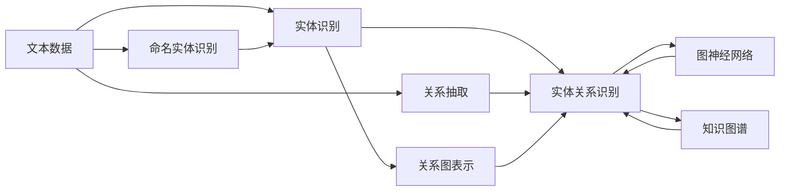
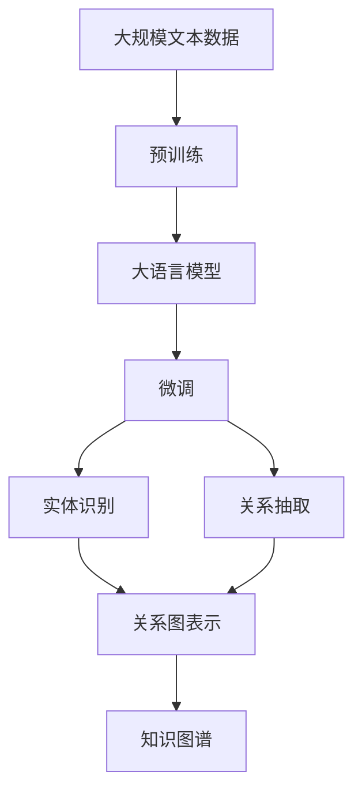

                 

# 数字实体与物理实体的自动化进展

## 1. 背景介绍

### 1.1 问题由来

在当今的数字化时代，数字实体的识别和处理已经成为人工智能和机器学习领域的重要研究方向。数字实体，即从文本中提取的有特定意义的信息单元，包括人名、地名、组织机构名、时间、金额等。它们的自动识别和分类，对于信息提取、文本分类、问答系统、机器翻译等众多NLP任务，具有重要意义。

随着大规模数据集的可用性增加，以及深度学习模型的不断发展，数字实体识别的准确性和鲁棒性得到了显著提升。然而，数字实体的自动识别和处理，也面临着一些挑战：

1. **数据标注成本高**：高质量标注数据的获取成本高，难以覆盖所有可能出现的实体类型和命名规则。
2. **实体多样性**：实体类型繁多，命名规则复杂，导致识别难度大。
3. **实体识别与关联**：单个实体的识别相对简单，但多个实体的关联和上下文理解，要求更复杂的模型和算法。
4. **跨领域应用**：实体识别模型在不同领域（如医疗、金融、法律等）的表现不一致，需要领域适应性强的模型。

为了应对这些挑战，研究人员提出了多种自动化方法，旨在降低人工标注成本，提高实体识别的准确性和泛化能力。本文将详细介绍这些方法，并探讨其应用前景。

## 2. 核心概念与联系

### 2.1 核心概念概述

数字实体识别任务可以分为两个子任务：实体识别（Named Entity Recognition, NER）和实体关系识别（Relation Extraction, RE）。实体识别旨在从文本中识别出具体的实体，并分类到预定义的实体类型中；实体关系识别则在此基础上，识别出实体之间的语义关系。

### 2.2 概念间的关系

数字实体识别涉及多个关键概念，它们的相互关系可以通过以下Mermaid流程图表示：



这个流程图展示了从文本数据到实体关系识别的完整流程：

1. **文本数据**：输入的原始文本数据。
2. **命名实体识别**：识别文本中的实体及其类型。
3. **实体关系识别**：在已识别的实体基础上，识别实体之间的关系。
4. **关系抽取**：识别实体之间的语义关系。
5. **关系图表示**：将实体和关系表示为图结构。
6. **图神经网络**：用于处理图结构数据的神经网络模型。
7. **知识图谱**：将实体和关系存储为图结构的知识库，供后续推理和查询使用。

### 2.3 核心概念的整体架构

大语言模型微调在此过程中扮演了重要角色。通过微调，模型可以学习特定的实体识别和关系抽取规则，从而在特定领域或任务上取得优异的表现。以下是综合的流程图，展示了从预训练模型到微调的具体流程：



该流程图展示了预训练模型、微调以及实体识别、关系抽取和知识图谱构建的整体流程。预训练模型在无标签数据上学习通用的语言表示，微调过程根据特定任务进行模型适配，最终实现实体识别和关系抽取。

## 3. 核心算法原理 & 具体操作步骤

### 3.1 算法原理概述

实体识别和关系抽取主要依赖于基于深度学习的模型，其中最常用的是基于卷积神经网络（CNN）和循环神经网络（RNN）的序列标注模型，以及近年来兴起的基于Transformer的序列到序列模型。

序列标注模型的目标是将输入文本的每个位置标注为特定的实体类型或关系类别，通过学习序列上的特征，预测每个位置的标签。序列到序列模型则将输入序列映射到输出序列，通常用于从文本中抽取完整的实体和关系信息。

### 3.2 算法步骤详解

以下是基于Transformer的实体识别和关系抽取模型的详细步骤：

1. **数据预处理**：将原始文本数据转换为模型所需的格式，包括分词、去除停用词、词性标注等。
2. **模型初始化**：选择预训练语言模型（如BERT、GPT-3等）作为初始化参数。
3. **微调训练**：在特定任务的数据集上，使用带有实体类型标签的标注数据进行微调，通过有监督学习优化模型参数。
4. **实体识别**：在微调后的模型上进行实体识别任务，输出文本中每个位置的实体类型。
5. **关系抽取**：根据实体识别结果，抽取实体之间的关系，通常通过标注实体间的关系来训练模型。
6. **评估和调优**：使用测试集评估模型性能，根据评估结果调整模型参数或训练策略。

### 3.3 算法优缺点

#### 3.3.1 优点

1. **泛化能力强**：基于深度学习的模型能够学习到丰富的语言表示，具有较强的泛化能力。
2. **适应性强**：通过微调，模型可以在不同领域和任务上进行调整，适应特定的应用场景。
3. **效率高**：深度学习模型能够并行处理大规模数据，加速实体识别和关系抽取过程。

#### 3.3.2 缺点

1. **数据依赖**：模型的性能高度依赖于标注数据的质量和数量。
2. **复杂度**：模型结构复杂，需要大量计算资源和训练时间。
3. **可解释性不足**：深度学习模型通常是"黑盒"模型，难以解释其内部工作机制。

### 3.4 算法应用领域

数字实体识别和关系抽取技术广泛应用于信息提取、文本分类、问答系统、机器翻译、搜索引擎、推荐系统等多个领域。以下是几个具体的应用场景：

1. **金融领域**：识别金融文档中的实体和关系，进行风险评估、欺诈检测和市场分析。
2. **医疗领域**：从医学文献中提取病人信息、疾病和药物实体，分析临床数据和研究成果。
3. **法律领域**：处理法律文本，识别出人名、组织机构名、日期等关键信息，用于法律文档的自动分类和摘要生成。
4. **社交媒体分析**：识别社交媒体中的实体和关系，分析公众情绪、舆情变化等。

## 4. 数学模型和公式 & 详细讲解

### 4.1 数学模型构建

假设输入文本为 $X=\{x_1, x_2, ..., x_n\}$，输出实体标注序列为 $Y=\{y_1, y_2, ..., y_n\}$，其中 $y_i$ 表示 $x_i$ 对应的实体类型标签。模型的目标是学习映射 $f:X \rightarrow Y$，使得 $f(x_i)=y_i$。

常用的模型包括基于CNN的序列标注模型和基于Transformer的序列到序列模型。以基于Transformer的模型为例，其输入和输出均通过自注意力机制和前馈神经网络进行建模。

### 4.2 公式推导过程

以BERT作为预训练模型的例子，其微调过程可以表示为：

1. **编码器**：将输入文本 $X$ 通过BERT编码器进行编码，得到隐状态 $H=\{h_1, h_2, ..., h_n\}$。
2. **分类器**：在隐状态 $H$ 的基础上，通过多层感知器（MLP）进行分类，输出标注序列 $Y$。
3. **损失函数**：使用交叉熵损失函数 $L$ 来衡量模型的预测结果与真实标签之间的差距，即 $L = -\sum_{i=1}^n y_i \log \hat{y_i}$。
4. **优化器**：使用AdamW优化器进行参数更新，最小化损失函数 $L$。

具体计算过程如下：

$$
H = BERT(X) \\
Y = MLP(H) \\
L = -\sum_{i=1}^n y_i \log \hat{y_i} \\
\theta \leftarrow \theta - \eta \nabla_{\theta}L \\
$$

其中 $\theta$ 为模型参数，$\eta$ 为学习率，$\nabla_{\theta}L$ 为损失函数对参数的梯度。

### 4.3 案例分析与讲解

假设我们训练一个BERT模型来识别文本中的时间实体，使用CoNLL-2003时间实体识别数据集进行微调。模型的输入为原始文本，输出为每个时间实体的时间格式。

#### 4.3.1 编码器

使用BERT作为编码器，输入文本 $X$ 通过BERT编码器后得到隐状态 $H$。

#### 4.3.2 分类器

在隐状态 $H$ 的基础上，通过多层感知器（MLP）进行分类，输出标注序列 $Y$。

$$
Y = MLP(H) = MLP([CLS] + [SEP] + [SEP] + [SEP] + H_{time})
$$

其中 $[CLS]$ 和 $[SEP]$ 是特殊的标记符号，分别表示文本的起始和结束。$H_{time}$ 是BERT编码器对时间实体部分的编码结果。

#### 4.3.3 损失函数

使用交叉熵损失函数 $L$ 来衡量模型的预测结果与真实标签之间的差距。

$$
L = -\sum_{i=1}^n y_i \log \hat{y_i}
$$

#### 4.3.4 优化器

使用AdamW优化器进行参数更新，最小化损失函数 $L$。

$$
\theta \leftarrow \theta - \eta \nabla_{\theta}L
$$

通过上述步骤，我们可以使用BERT模型对时间实体进行微调，并在测试集上评估模型性能。

## 5. 项目实践：代码实例和详细解释说明

### 5.1 开发环境搭建

在进行实体识别和关系抽取的实践前，我们需要准备好开发环境。以下是使用Python进行PyTorch开发的环境配置流程：

1. 安装Anaconda：从官网下载并安装Anaconda，用于创建独立的Python环境。

2. 创建并激活虚拟环境：
```bash
conda create -n pytorch-env python=3.8 
conda activate pytorch-env
```

3. 安装PyTorch：根据CUDA版本，从官网获取对应的安装命令。例如：
```bash
conda install pytorch torchvision torchaudio cudatoolkit=11.1 -c pytorch -c conda-forge
```

4. 安装HuggingFace Transformers库：
```bash
pip install transformers
```

5. 安装各类工具包：
```bash
pip install numpy pandas scikit-learn matplotlib tqdm jupyter notebook ipython
```

完成上述步骤后，即可在`pytorch-env`环境中开始实践。

### 5.2 源代码详细实现

下面我们以BERT模型为例，给出使用PyTorch进行时间实体识别的代码实现。

```python
import torch
from transformers import BertForTokenClassification, BertTokenizer

# 定义时间实体标注的标签集合
labels = ["O", "B-TIME", "I-TIME"]

# 初始化BERT模型和分词器
model = BertForTokenClassification.from_pretrained("bert-base-cased")
tokenizer = BertTokenizer.from_pretrained("bert-base-cased")

# 定义时间实体标注函数
def predict_time_entities(text):
    tokens = tokenizer.tokenize(text)
    inputs = tokenizer.encode(tokens, return_tensors="pt")
    outputs = model(inputs)
    predictions = torch.argmax(outputs.logits, dim=-1).cpu().numpy()

    time_entities = []
    current_entity = []
    start_index = -1
    for i, (token, prediction) in enumerate(zip(tokens, predictions)):
        if labels[prediction] == "B-TIME":
            start_index = i
            current_entity = [token]
        elif labels[prediction] == "I-TIME" and start_index != -1:
            current_entity.append(token)
        elif labels[prediction] == "O" and start_index != -1:
            time_entities.append((start_index, i, " ".join(current_entity)))
            current_entity = []
            start_index = -1

    return time_entities

# 加载数据集并进行微调
train_dataset = ...
dev_dataset = ...
test_dataset = ...

model.train()
optimizer = torch.optim.Adam(model.parameters(), lr=1e-5)

for epoch in range(epochs):
    for batch in train_dataset:
        inputs = tokenizer(batch["input"], return_tensors="pt", padding="max_length", truncation=True)
        outputs = model(inputs.input_ids, attention_mask=inputs.attention_mask)
        loss = outputs.loss
        optimizer.zero_grad()
        loss.backward()
        optimizer.step()

    # 在验证集上评估模型性能
    with torch.no_grad():
        model.eval()
        dev_entities = predict_time_entities(dev_dataset[0]["input"])
        print("Dev Accuracy:", len(dev_entities) / len(dev_dataset))
```

### 5.3 代码解读与分析

让我们再详细解读一下关键代码的实现细节：

#### 5.3.1 标签集合

定义了时间实体的标注标签集合，包括普通文本（"O"）、开始时间实体（"B-TIME"）和中间时间实体（"I-TIME"）。

#### 5.3.2 模型初始化

使用预训练的BERT模型进行初始化，分词器也从预训练模型中获取。

#### 5.3.3 时间实体标注函数

定义了一个函数，用于对输入文本进行时间实体标注。首先对文本进行分词，并编码成模型所需的输入格式。然后通过模型进行预测，得到每个位置的时间实体标注。最后将预测结果解析为时间实体的起始和结束位置以及标签。

#### 5.3.4 训练和评估

在训练集上对模型进行微调，使用AdamW优化器进行优化。在验证集上评估模型性能，输出准确度。

## 6. 实际应用场景

### 6.1 金融领域

在金融领域，数字实体识别和关系抽取可以用于自动化金融文档的实体识别和关系分析，识别出人名、组织机构名、日期、金额等关键信息，并进行风险评估、欺诈检测和市场分析。例如，可以通过对新闻报道、公司公告等文本进行实体识别和关系抽取，自动化生成市场分析报告，提升投资决策的准确性和效率。

### 6.2 医疗领域

在医疗领域，数字实体识别可以用于自动化处理电子病历、医学文献等文本数据，提取病人信息、疾病和药物实体，并进行临床数据分析和医学研究。例如，可以通过对医学文献进行实体识别和关系抽取，自动化生成临床指南和医学知识库，提升医疗服务的效率和质量。

### 6.3 社交媒体分析

在社交媒体分析中，数字实体识别可以用于识别社交媒体中的实体和关系，分析公众情绪、舆情变化等。例如，可以通过对社交媒体评论进行实体识别和关系抽取，自动化生成舆情报告，及时发现和应对社会事件，提升公共安全和秩序。

### 6.4 未来应用展望

随着数字实体识别和关系抽取技术的不断发展，未来将有更多的应用场景涌现：

1. **智能客服**：应用于智能客服系统中，自动识别用户输入中的实体和关系，进行自动回复和智能推荐。
2. **知识图谱构建**：应用于知识图谱构建中，自动识别文本中的实体和关系，构建更加全面的知识图谱，促进知识共享和推理。
3. **自动化文档处理**：应用于自动化文档处理中，自动识别文档中的实体和关系，进行文档分类、摘要生成和信息抽取。
4. **跨语言翻译**：应用于跨语言翻译中，自动识别文本中的实体和关系，并进行跨语言实体映射和翻译。

## 7. 工具和资源推荐

### 7.1 学习资源推荐

为了帮助开发者系统掌握数字实体识别和关系抽取的理论基础和实践技巧，这里推荐一些优质的学习资源：

1. 《Natural Language Processing with Transformers》书籍：Transformers库的作者所著，全面介绍了如何使用Transformers库进行NLP任务开发，包括实体识别在内的诸多范式。

2. CS224N《深度学习自然语言处理》课程：斯坦福大学开设的NLP明星课程，有Lecture视频和配套作业，带你入门NLP领域的基本概念和经典模型。

3. 《Transformers: State-of-the-Art Natural Language Processing》论文：Transformer原论文，介绍了Transformer模型的原理和应用。

4. 《Learning to Extract Semantic Roles with Structured Prediction》论文：介绍了Structured Prediction模型在关系抽取中的应用。

5. HuggingFace官方文档：Transformers库的官方文档，提供了海量预训练模型和完整的实体识别和关系抽取样例代码，是上手实践的必备资料。

### 7.2 开发工具推荐

1. PyTorch：基于Python的开源深度学习框架，灵活动态的计算图，适合快速迭代研究。大部分预训练语言模型都有PyTorch版本的实现。

2. TensorFlow：由Google主导开发的开源深度学习框架，生产部署方便，适合大规模工程应用。同样有丰富的预训练语言模型资源。

3. Transformers库：HuggingFace开发的NLP工具库，集成了众多SOTA语言模型，支持PyTorch和TensorFlow，是进行实体识别和关系抽取开发的利器。

4. Weights & Biases：模型训练的实验跟踪工具，可以记录和可视化模型训练过程中的各项指标，方便对比和调优。与主流深度学习框架无缝集成。

5. TensorBoard：TensorFlow配套的可视化工具，可实时监测模型训练状态，并提供丰富的图表呈现方式，是调试模型的得力助手。

### 7.3 相关论文推荐

1. Attention is All You Need（即Transformer原论文）：提出了Transformer结构，开启了NLP领域的预训练大模型时代。

2. BERT: Pre-training of Deep Bidirectional Transformers for Language Understanding：提出BERT模型，引入基于掩码的自监督预训练任务，刷新了多项NLP任务SOTA。

3. Knowledge-Base Augmented Relation Extraction：提出Knowledge-Base Augmented RE，结合知识图谱进行关系抽取，提升了模型性能。

4. Relation Reasoning Network：提出Relation Reasoning Network，通过双塔模型进行关系抽取，提升了模型效果。

5. Multilingual Multi-Label Sequence Prediction：提出Multilingual Multi-Label Sequence Prediction，实现了多语言多标签序列预测，拓展了实体识别的应用场景。

6. Graph Convolutional Networks for Graph-Structured Sequence Labeling：提出GCN模型，用于处理图结构数据的序列标注任务。

这些论文代表了大语言模型实体识别和关系抽取的发展脉络。通过学习这些前沿成果，可以帮助研究者把握学科前进方向，激发更多的创新灵感。

除上述资源外，还有一些值得关注的前沿资源，帮助开发者紧跟数字实体识别和关系抽取技术的最新进展，例如：

1. arXiv论文预印本：人工智能领域最新研究成果的发布平台，包括大量尚未发表的前沿工作，学习前沿技术的必读资源。

2. 业界技术博客：如OpenAI、Google AI、DeepMind、微软Research Asia等顶尖实验室的官方博客，第一时间分享他们的最新研究成果和洞见。

3. 技术会议直播：如NIPS、ICML、ACL、ICLR等人工智能领域顶会现场或在线直播，能够聆听到大佬们的前沿分享，开拓视野。

4. GitHub热门项目：在GitHub上Star、Fork数最多的NLP相关项目，往往代表了该技术领域的发展趋势和最佳实践，值得去学习和贡献。

5. 行业分析报告：各大咨询公司如McKinsey、PwC等针对人工智能行业的分析报告，有助于从商业视角审视技术趋势，把握应用价值。

总之，对于数字实体识别和关系抽取技术的学习和实践，需要开发者保持开放的心态和持续学习的意愿。多关注前沿资讯，多动手实践，多思考总结，必将收获满满的成长收益。

## 8. 总结：未来发展趋势与挑战

### 8.1 总结

本文对数字实体识别和关系抽取技术进行了全面系统的介绍。首先阐述了实体识别的重要性、关键技术和应用场景，明确了其在信息提取、文本分类、问答系统、机器翻译等众多NLP任务中的重要作用。其次，从原理到实践，详细讲解了基于Transformer的实体识别和关系抽取模型的详细步骤，给出了代码实例和详细解释说明。同时，本文还广泛探讨了实体识别和关系抽取技术在不同领域的应用前景，展示了其巨大的潜力和广泛的应用价值。

通过本文的系统梳理，可以看到，数字实体识别和关系抽取技术正在成为NLP领域的重要组成部分，极大地拓展了语言模型在实体理解和语义推理方面的能力。随着预训练模型和微调方法的持续演进，实体识别和关系抽取技术必将取得更多的突破，为人工智能技术在更多领域的应用提供新的引擎。

### 8.2 未来发展趋势

展望未来，数字实体识别和关系抽取技术将呈现以下几个发展趋势：

1. **多模态融合**：未来实体识别和关系抽取将更多地融合视觉、语音等多模态信息，提升模型的跨模态理解和推理能力。

2. **知识图谱结合**：实体识别和关系抽取将与知识图谱结合，进行更为复杂的实体关系推理和知识整合。

3. **实时处理**：随着实时处理技术的进步，实体识别和关系抽取将实时应用于社交媒体分析、智能客服、推荐系统等场景。

4. **领域适应性**：未来的模型将更加注重领域适应性，通过微调和调整，提升在不同领域中的性能表现。

5. **自动化标注**：通过自动化标注技术，降低标注成本，提升实体识别和关系抽取的效率和质量。

6. **知识注入**：通过结合知识图谱、逻辑规则等先验知识，提高模型在特定领域的泛化能力和解释性。

以上趋势凸显了数字实体识别和关系抽取技术的广阔前景。这些方向的探索发展，必将进一步提升NLP系统的性能和应用范围，为人类认知智能的进化带来深远影响。

### 8.3 面临的挑战

尽管数字实体识别和关系抽取技术已经取得了瞩目成就，但在迈向更加智能化、普适化应用的过程中，它仍面临着诸多挑战：

1. **数据标注成本**：高质量标注数据的获取成本高，难以覆盖所有可能出现的实体类型和命名规则。
2. **模型鲁棒性**：模型面对域外数据时，泛化性能往往大打折扣。对于测试样本的微小扰动，模型也容易发生波动。
3. **推理效率**：大规模语言模型虽然精度高，但在实际部署时往往面临推理速度慢、内存占用大等效率问题。
4. **可解释性不足**：深度学习模型通常是"黑盒"模型，难以解释其内部工作机制和决策逻辑。
5. **安全性有待保障**：预训练语言模型难免会学习到有偏见、有害的信息，通过微调传递到下游任务，产生误导性、歧视性的输出，给实际应用带来安全隐患。

### 8.4 未来突破

面对数字实体识别和关系抽取所面临的挑战，未来的研究需要在以下几个方面寻求新的突破：

1. **多模态融合**：将视觉、语音等多模态信息与文本信息结合，提升模型的跨模态理解和推理能力。

2. **知识图谱结合**：通过结合知识图谱、逻辑规则等先验知识，提高模型在特定领域的泛化能力和解释性。

3. **实时处理**：通过实时处理技术，提升实体识别和关系抽取的实时性，满足社交媒体分析、智能客服等实时场景的需求。

4. **领域适应性**：通过模型微调和调整，提升在不同领域中的性能表现，降低模型对标注数据的依赖。

5. **自动化标注**：通过自动化标注技术，降低标注成本，提升实体识别和关系抽取的效率和质量。

6. **知识注入**：结合知识图谱、逻辑规则等先验知识，提高模型在特定领域的泛化能力和解释性。

这些研究方向将引领数字实体识别和关系抽取技术迈向更高的台阶，为构建安全、可靠、可解释、可控的智能系统铺平道路。面向未来，数字实体识别和关系抽取技术还需要与其他人工智能技术进行更深入的融合，如知识表示、因果推理、强化学习等，多路径协同发力，共同推动自然语言理解和智能交互系统的进步。只有勇于创新、敢于突破，才能不断拓展语言模型的边界，让智能技术更好地造福人类社会。

## 9. 附录：常见问题与解答

**Q1：数字实体识别和关系抽取是否有高效自动标注方法？**

A: 是的。目前已经有高效自动标注方法，如基于BERT的实体标注、基于CRF的实体标注等，这些方法能够在不需要大量人工标注的情况下，快速获得高质量的标注数据。

**Q2：如何在不同领域中进行实体识别和关系抽取？**

A: 在不同领域中进行实体识别和关系抽取，需要针对具体领域的特点，对模型进行微调和优化。可以通过领域特定语料进行预训练，或者结合领域知识进行模型训练。

**Q3：实体识别和关系抽取的效率如何提升？**

A: 可以通过优化模型结构、使用多卡并行训练、分布式训练等方法提升实体识别和关系抽取的效率。同时，也可以通过优化算法和数据处理流程，进一步提升模型训练和推理的效率。

**Q4：实体识别和关系抽取的模型可解释性如何提升？**

A: 可以通过引入可解释性模块、使用可视化工具、结合领域知识等方法提升实体识别和关系抽取模型的可解释性。同时，可以通过模型解释性评估指标，如

