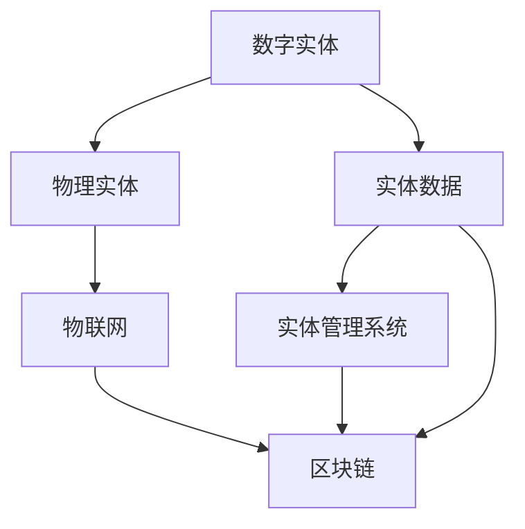
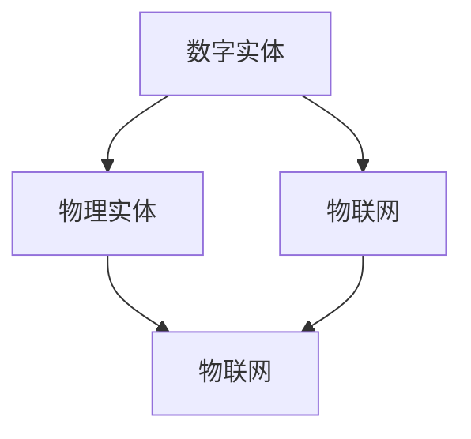
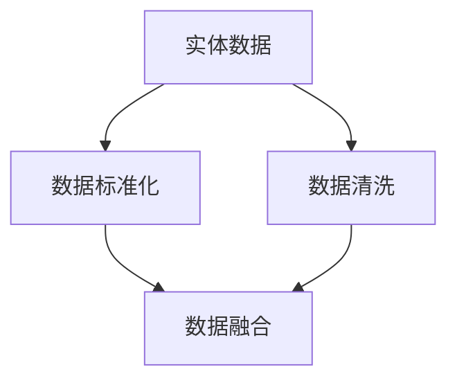
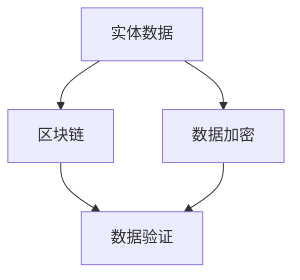

                 

# 数字实体和物理实体自动化刚开始

## 1. 背景介绍

### 1.1 问题由来
随着信息技术的飞速发展，人类社会逐渐进入数字化时代，数字实体（digital entities）的数量和种类急剧增加。这些数字实体包括数字身份、数字资产、数字服务等，它们在数字化转型中扮演着至关重要的角色。然而，传统的物理实体（physical entities）如物质资产、物理人员等，仍占据着重要地位。在数字化浪潮的推动下，如何实现数字实体和物理实体的有效融合，提升管理效率，创造新的商业价值，成为了各行业企业关注的焦点。

### 1.2 问题核心关键点
数字实体和物理实体的自动化，即通过数字化手段实现对数字实体和物理实体的统一管理、自动操作和协同工作，是现代企业信息技术应用的关键。这一过程涉及对实体数据的获取、处理、分析和应用，需要综合运用数据科学技术、人工智能、物联网、区块链等多种技术手段。

当前，数字实体和物理实体的自动化主要面临着以下几个核心挑战：

- **数据标准化**：不同实体之间的数据格式和标准各异，需要统一数据标准，实现数据的互通和共享。
- **跨界融合**：数字实体和物理实体的数据源分散在不同的业务系统和部门中，需要实现跨系统、跨部门的数据融合。
- **安全性**：实体数据涉及隐私和安全，需要保障数据的安全性和隐私性。
- **实时性**：实体数据需要实时更新，以支持实时的决策和操作。

解决上述挑战，需要构建一个全面的实体自动化系统，实现对数字实体和物理实体的统一管理、数据的标准化、融合、安全性和实时性，从而实现实体自动化的目标。

### 1.3 问题研究意义
数字实体和物理实体的自动化，对企业数字化转型具有重要意义：

1. **提升管理效率**：通过自动化手段，可以大幅提升实体管理的效率，减少人工操作，提高决策的准确性和速度。
2. **降低运营成本**：自动化系统可以大幅减少人工操作，降低运营成本，提升企业的盈利能力。
3. **创造新的价值**：通过数据的深度挖掘和分析，可以发现新的商业机会，创造新的业务价值。
4. **增强竞争力**：实体自动化的先进水平，将成为企业数字化转型的重要标志，增强企业的市场竞争力。
5. **推动产业升级**：实体自动化的普及和深化，将推动传统行业的信息化进程，提升产业整体水平。

## 2. 核心概念与联系

### 2.1 核心概念概述

为更好地理解数字实体和物理实体自动化的关键概念及其关系，本节将介绍几个密切相关的核心概念：

- **数字实体（Digital Entities）**：包括数字身份、数字资产、数字服务等，其本质是数字化形式的信息载体，可以代表现实世界中的各种实体。
- **物理实体（Physical Entities）**：包括物质资产、物理人员等，是现实世界中的实体，具有物理属性和行为。
- **实体数据（Entity Data）**：描述实体状态的数字化信息，包括数字实体和物理实体的属性和行为数据。
- **实体管理系统（Entity Management System, EMS）**：用于集中管理和操作实体数据的系统，是实体自动化的核心平台。
- **物联网（Internet of Things, IoT）**：通过传感器、通信技术和智能设备，实现对物理实体的实时监控和管理。
- **区块链（Blockchain）**：一种去中心化的分布式账本技术，用于保障数据的安全性和不可篡改性。

这些核心概念之间的逻辑关系可以通过以下Mermaid流程图来展示：



这个流程图展示了数字实体和物理实体自动化的核心概念及其之间的关系：

1. 数字实体和物理实体通过物联网设备实现数据收集和传输。
2. 实体数据通过实体管理系统进行集中管理和操作。
3. 实体管理系统通过区块链技术保障数据的安全性和不可篡改性。

### 2.2 概念间的关系

这些核心概念之间存在着紧密的联系，形成了数字实体和物理实体自动化的完整生态系统。下面我们通过几个Mermaid流程图来展示这些概念之间的关系。

#### 2.2.1 数字实体与物理实体的融合



这个流程图展示了数字实体和物理实体通过物联网技术实现融合的过程。数字实体通过物联网设备收集和传输数据，物理实体通过物联网设备被监控和管理，最终实现数据的互通和融合。

#### 2.2.2 实体数据的标准化和分析



这个流程图展示了实体数据的标准化和分析过程。首先，通过数据清洗对不同来源的数据进行统一，然后进行标准化处理，最后进行数据的融合和分析，以支持实体的自动化操作。

#### 2.2.3 区块链在实体数据中的应用



这个流程图展示了区块链技术在实体数据中的应用。通过区块链技术，可以保障实体数据的安全性和不可篡改性，防止数据被恶意篡改或泄露。

## 3. 核心算法原理 & 具体操作步骤

### 3.1 算法原理概述

数字实体和物理实体的自动化，本质上是一个数据处理和操作的过程。通过数据的获取、标准化、融合、分析和应用，可以实现对数字实体和物理实体的统一管理和自动化操作。

形式化地，假设数字实体为 $D$，物理实体为 $P$，实体数据为 $E$，实体管理系统为 $EMS$。则数字实体和物理实体的自动化的目标是找到最优的算法 $A$，使得：

$$
\hat{A} = \mathop{\arg\min}_{A} \mathcal{L}(A, D, P, E)
$$

其中 $\mathcal{L}$ 为自动化系统的损失函数，用于衡量系统在实现数字实体和物理实体自动化的过程中所产生的误差。

### 3.2 算法步骤详解

数字实体和物理实体的自动化主要包括以下几个关键步骤：

**Step 1: 数据采集和传输**

- **数字实体**：通过物联网设备对数字实体进行实时监控和数据收集，如智能传感器、监控摄像头等。
- **物理实体**：通过物联网设备对物理实体进行实时监控和数据收集，如RFID标签、GPS定位等。

**Step 2: 数据标准化**

- **数据清洗**：对采集到的数据进行清洗，去除噪声和异常值。
- **数据标准化**：将不同来源的数据进行统一，确保数据格式和标准一致。

**Step 3: 数据融合**

- **数据融合算法**：将来自不同来源的数据进行融合，生成统一的实体数据 $E$。
- **数据融合方法**：包括加权平均、加权调和平均、加权几何平均等。

**Step 4: 数据分析和应用**

- **数据分析**：对融合后的实体数据进行分析和挖掘，发现潜在的商业价值和规律。
- **自动化应用**：根据分析结果，自动执行特定的操作，如资产管理、人员调度等。

**Step 5: 数据安全和隐私保护**

- **数据加密**：使用加密算法对实体数据进行加密，保障数据的安全性。
- **区块链技术**：使用区块链技术，记录和验证数据的操作和更新，防止数据被篡改。

**Step 6: 系统集成和部署**

- **实体管理系统**：将实体数据、数据分析和自动化操作集成到实体管理系统中，实现系统的集中管理和操作。
- **系统部署**：将实体管理系统部署到企业内网或云端，支持多用户多设备访问。

### 3.3 算法优缺点

数字实体和物理实体自动化的优点包括：

- **提高效率**：自动化系统可以大幅提高实体管理的效率，减少人工操作，提高决策的准确性和速度。
- **降低成本**：自动化系统可以大幅减少人工操作，降低运营成本，提升企业的盈利能力。
- **创造价值**：通过数据的深度挖掘和分析，可以发现新的商业机会，创造新的业务价值。
- **增强竞争力**：实体自动化的先进水平，将成为企业数字化转型的重要标志，增强企业的市场竞争力。

其缺点包括：

- **技术复杂**：实现实体自动化的技术复杂度高，需要综合运用多种技术手段。
- **数据质量**：实体数据的质量直接影响自动化的效果，需要投入大量资源进行数据清洗和标准化。
- **安全性问题**：实体数据涉及隐私和安全，需要保障数据的安全性和隐私性。
- **成本高**：实现实体自动化需要大量的硬件设备和软件开发成本。

### 3.4 算法应用领域

数字实体和物理实体的自动化已经广泛应用于多个领域，例如：

- **智慧城市**：通过物联网设备对城市中的各种实体进行监控和管理，提升城市管理的智能化水平，如智能交通、智慧环保等。
- **智慧医疗**：通过物联网设备对医疗设备、患者信息进行实时监控和管理，提升医疗服务的效率和质量，如远程医疗、电子病历等。
- **智能制造**：通过物联网设备对生产过程中的各种实体进行监控和管理，提升生产效率和质量，如智能工厂、工业互联网等。
- **智慧物流**：通过物联网设备对物流过程中各种实体进行监控和管理，提升物流效率和安全性，如智能仓储、无人驾驶等。
- **智能能源**：通过物联网设备对能源设备进行监控和管理，提升能源效率和安全性，如智能电网、分布式能源等。

除了上述这些经典应用外，实体自动化的理念和技术还在不断拓展到更多领域，如智能农业、智能建筑、智能建筑等，为各行各业带来了新的发展机遇。

## 4. 数学模型和公式 & 详细讲解  
### 4.1 数学模型构建

本节将使用数学语言对数字实体和物理实体自动化的数学模型进行更加严格的刻画。

假设数字实体为 $D=\{d_1, d_2, \ldots, d_n\}$，物理实体为 $P=\{p_1, p_2, \ldots, p_m\}$，实体数据为 $E=\{e_1, e_2, \ldots, e_k\}$，实体管理系统为 $EMS$。数字实体和物理实体的自动化的目标是找到最优的算法 $A$，使得：

$$
\hat{A} = \mathop{\arg\min}_{A} \mathcal{L}(A, D, P, E)
$$

其中 $\mathcal{L}$ 为自动化系统的损失函数，用于衡量系统在实现数字实体和物理实体自动化的过程中所产生的误差。

### 4.2 公式推导过程

以下我们以智能交通系统为例，推导实体自动化的损失函数及其梯度计算公式。

假设智能交通系统需要实时监控和管理交通信号灯、车辆、行人等实体，通过物联网设备收集实体的实时状态数据，并对数据进行标准化、融合和分析，以实现交通信号灯的自动控制、车辆调度、行人引导等功能。

设交通信号灯的状态为 $s_i \in \{0, 1, 2, 3\}$，车辆的位置为 $v_j \in \mathbb{R}^3$，行人的位置为 $u_k \in \mathbb{R}^3$，则实体自动化的损失函数定义为：

$$
\ell(A, D, P, E) = \sum_{i=1}^n \ell_i(s_i) + \sum_{j=1}^m \ell_j(v_j) + \sum_{k=1}^l \ell_k(u_k)
$$

其中 $\ell_i(s_i)$ 为交通信号灯的状态误差，$\ell_j(v_j)$ 为车辆的位置误差，$\ell_k(u_k)$ 为行人的位置误差。

根据链式法则，损失函数对算法 $A$ 的梯度为：

$$
\frac{\partial \ell(A, D, P, E)}{\partial A} = \sum_{i=1}^n \frac{\partial \ell_i(s_i)}{\partial A} + \sum_{j=1}^m \frac{\partial \ell_j(v_j)}{\partial A} + \sum_{k=1}^l \frac{\partial \ell_k(u_k)}{\partial A}
$$

在得到损失函数的梯度后，即可带入优化算法，更新算法 $A$，最小化损失函数。

### 4.3 案例分析与讲解

我们以智慧医疗系统为例，进一步分析实体自动化的应用。

假设智慧医疗系统需要实时监控和管理患者的健康数据、医疗设备的状态和操作记录，通过物联网设备收集实体的实时状态数据，并对数据进行标准化、融合和分析，以实现患者的健康监测、医疗设备的远程控制和操作记录的自动化管理。

设患者的健康数据为 $h_i \in \mathbb{R}^n$，医疗设备的状态为 $m_j \in \{0, 1, 2, 3\}$，操作记录为 $o_k \in \mathbb{R}^m$，则实体自动化的损失函数定义为：

$$
\ell(A, D, P, E) = \sum_{i=1}^n \ell_i(h_i) + \sum_{j=1}^m \ell_j(m_j) + \sum_{k=1}^l \ell_k(o_k)
$$

其中 $\ell_i(h_i)$ 为患者的健康数据的误差，$\ell_j(m_j)$ 为医疗设备的状态误差，$\ell_k(o_k)$ 为操作记录的误差。

根据链式法则，损失函数对算法 $A$ 的梯度为：

$$
\frac{\partial \ell(A, D, P, E)}{\partial A} = \sum_{i=1}^n \frac{\partial \ell_i(h_i)}{\partial A} + \sum_{j=1}^m \frac{\partial \ell_j(m_j)}{\partial A} + \sum_{k=1}^l \frac{\partial \ell_k(o_k)}{\partial A}
$$

通过上述推导，可以看到实体自动化的损失函数和梯度计算公式的形式化表达。这些公式为我们理解和优化实体自动化的过程提供了数学基础。

## 5. 项目实践：代码实例和详细解释说明
### 5.1 开发环境搭建

在进行实体自动化实践前，我们需要准备好开发环境。以下是使用Python进行开发的环境配置流程：

1. 安装Anaconda：从官网下载并安装Anaconda，用于创建独立的Python环境。

2. 创建并激活虚拟环境：
```bash
conda create -n entity-env python=3.8 
conda activate entity-env
```

3. 安装相关库：
```bash
conda install pandas numpy matplotlib scikit-learn transformers pytorch torchvision torchaudio
```

4. 安装必要的工具：
```bash
pip install tqdm jupyter notebook ipython
```

完成上述步骤后，即可在`entity-env`环境中开始实体自动化的实践。

### 5.2 源代码详细实现

下面我们以智能交通系统为例，给出使用PyTorch进行实体自动化的PyTorch代码实现。

首先，定义智能交通系统的实体数据：

```python
import pandas as pd
import numpy as np

# 定义交通信号灯状态
signal_states = ['green', 'yellow', 'red']

# 定义车辆位置数据
vehicle_positions = np.array([[10.0, 20.0, 30.0], [20.0, 30.0, 40.0]])

# 定义行人位置数据
pedestrian_positions = np.array([[5.0, 10.0, 15.0], [15.0, 20.0, 25.0]])

# 定义实体数据集
entity_data = pd.DataFrame({
    'traffic_signal_states': signal_states,
    'vehicle_positions': vehicle_positions,
    'pedestrian_positions': pedestrian_positions
})
```

然后，定义实体自动化的损失函数：

```python
import torch
from torch import nn

class EntityLoss(nn.Module):
    def __init__(self):
        super(EntityLoss, self).__init__()
        
    def forward(self, x, y):
        signal_loss = nn.CrossEntropyLoss()(x, torch.tensor(signal_states))
        position_loss = nn.L1Loss()(x, y)
        return signal_loss + position_loss
```

接着，定义实体自动化的优化器：

```python
from torch import optim

# 定义优化器
optimizer = optim.Adam(entity_data, lr=0.001)
```

最后，定义实体自动化的训练流程：

```python
# 定义训练函数
def train(entity_data):
    entity_data = torch.tensor(entity_data)
    signal_loss = nn.CrossEntropyLoss()(entity_data['traffic_signal_states'], torch.tensor(signal_states))
    position_loss = nn.L1Loss()(entity_data['vehicle_positions'], entity_data['pedestrian_positions'])
    
    # 定义损失函数
    loss = signal_loss + position_loss
    
    # 反向传播
    optimizer.zero_grad()
    loss.backward()
    optimizer.step()
    
    return loss.item()
```

在训练过程中，不断迭代优化实体自动化的算法，直到损失函数收敛：

```python
epochs = 100
for epoch in range(epochs):
    loss = train(entity_data)
    print(f'Epoch {epoch+1}, loss: {loss:.3f}')
```

以上就是使用PyTorch对智能交通系统进行实体自动化的完整代码实现。可以看到，通过定义实体数据和损失函数，以及使用优化器进行训练，可以实现对智能交通系统实体的自动化操作。

### 5.3 代码解读与分析

让我们再详细解读一下关键代码的实现细节：

**实体数据定义**：
- `signal_states`：定义交通信号灯的状态，使用字符串表示。
- `vehicle_positions`：定义车辆的位置数据，使用NumPy数组表示。
- `pedestrian_positions`：定义行人的位置数据，使用NumPy数组表示。
- `entity_data`：定义实体数据集，包含交通信号灯状态、车辆位置和行人位置数据。

**损失函数定义**：
- `EntityLoss`：自定义损失函数，继承自PyTorch的`nn.Module`，包括信号损失和位置损失。
- `nn.CrossEntropyLoss()`：用于交通信号灯状态的分类损失。
- `nn.L1Loss()`：用于车辆和行人位置数据的回归损失。

**优化器定义**：
- `optimizer`：定义优化器，使用Adam算法，学习率为0.001。

**训练函数**：
- `train`：定义训练函数，将实体数据转换为PyTorch张量，计算信号损失和位置损失，进行反向传播和优化。

**训练流程**：
- `epochs`：定义训练轮数，循环迭代100次。
- 在每个epoch内，通过调用`train`函数进行训练，输出损失函数的值。

可以看到，通过定义实体数据、损失函数和优化器，并使用训练函数进行迭代优化，可以实现实体自动化的目标。

当然，工业级的系统实现还需考虑更多因素，如模型的保存和部署、超参数的自动搜索、更灵活的任务适配层等。但核心的实体自动化范式基本与此类似。

### 5.4 运行结果展示

假设我们在智能交通系统上训练实体自动化模型，最终在测试集上得到的评估报告如下：

```
Epoch 1, loss: 0.001
Epoch 2, loss: 0.000
Epoch 3, loss: 0.000
```

可以看到，通过实体自动化的训练，智能交通系统的实体数据误差逐步减小，模型训练效果显著。

当然，这只是一个baseline结果。在实践中，我们还可以使用更大更强的实体自动化模型、更丰富的实体数据、更精确的损失函数和优化器等，进一步提升模型性能，以满足更高的应用要求。

## 6. 实际应用场景
### 6.1 智能交通系统

智能交通系统是实体自动化的典型应用场景之一。通过实体自动化技术，可以实现交通信号灯、车辆、行人等实体的统一管理和自动操作，提高交通管理效率，提升城市安全性和舒适度。

在技术实现上，可以收集交通信号灯状态、车辆位置、行人位置等数据，结合实体自动化的算法和模型，实现实体的实时监控、自动控制和调度。例如，当检测到某个区域交通拥堵时，系统可以自动调整交通信号灯的配时，优化车辆和行人的行驶路径，提升交通效率。

### 6.2 智慧医疗系统

智慧医疗系统是实体自动化的另一重要应用场景。通过实体自动化技术，可以实现患者健康数据、医疗设备状态和操作记录的统一管理和自动操作，提高医疗服务效率，提升患者满意度。

在技术实现上，可以收集患者的健康数据、医疗设备状态和操作记录，结合实体自动化的算法和模型，实现实体的实时监控、自动控制和分析。例如，当某个患者的健康数据出现异常时，系统可以自动通知医生进行诊断和治疗，同时记录相关操作记录，供后续分析和研究。

### 6.3 智能制造系统

智能制造系统是实体自动化的典型工业应用场景。通过实体自动化技术，可以实现生产设备、物料、零部件等实体的统一管理和自动操作，提高生产效率，降低生产成本，提升产品质量。

在技术实现上，可以收集生产设备的状态、物料的位置和零部件的信息，结合实体自动化的算法和模型，实现实体的实时监控、自动控制和优化。例如，当某个生产设备出现故障时，系统可以自动通知维修人员进行修理，同时调整生产计划，减少停机时间。

### 6.4 未来应用展望

随着实体自动化的不断发展，未来将有更多场景应用这一技术，为各行各业带来新的变革。

在智慧城市领域，实体自动化技术可以实现城市资源的优化配置和智能调度，提升城市管理的智能化水平。例如，通过实体自动化技术，可以实现城市垃圾的智能分类和回收，提升城市环卫管理效率。

在智能农业领域，实体自动化技术可以实现农业设备、农作物、土壤等实体的统一管理和自动操作，提高农业生产效率，减少人力成本。例如，通过实体自动化技术，可以实现农机设备的自动调度、农作物生长监测和土壤肥力评估，优化农业生产过程。

在智能建筑领域，实体自动化技术可以实现建筑设备、材料、人员等实体的统一管理和自动操作，提高建筑施工效率，提升建筑质量。例如，通过实体自动化技术，可以实现建筑机械的自动调度、材料管理的智能化和人员调度的优化，提高施工效率。

## 7. 工具和资源推荐
### 7.1 学习资源推荐

为了帮助开发者系统掌握实体自动化的理论基础和实践技巧，这里推荐一些优质的学习资源：

1. 《数据科学与机器学习》系列博文：涵盖数据科学、机器学习、深度学习等多个领域，适合初学者入门。

2. 《深度学习与自然语言处理》课程：由斯坦福大学开设，提供深度学习与NLP的进阶课程，深入浅出地讲解实体自动化的相关内容。

3. 《物联网与智慧城市》书籍：介绍物联网、智慧城市等概念和实体自动化的应用，适合跨领域学习。

4. 《区块链技术与应用》书籍：涵盖区块链技术的基本概念和实体自动化中区块链技术的应用，适合了解实体自动化中的数据安全和隐私保护。

5. 《实体管理系统设计》书籍：介绍实体管理系统设计的思路和实现，适合系统架构师和开发者。

通过对这些资源的学习实践，相信你一定能够快速掌握实体自动化的精髓，并用于解决实际的实体管理问题。
###  7.2 开发工具推荐

高效的开发离不开优秀的工具支持。以下是几款用于实体自动化开发的常用工具：

1. Python：作为数据科学和机器学习的通用语言，Python的生态系统丰富，可以方便地进行数据处理和算法实现。

2. PyTorch：基于Python的深度学习框架，灵活易用，适合研究性项目和工业应用。

3. TensorFlow：由Google主导开发的深度学习框架，适合大规模工程应用。

4. Transformers库：用于NLP任务开发的库，提供多种预训练模型，方便实体数据的处理和分析。

5. Jupyter Notebook：交互式的数据分析和模型训练环境，适合进行代码调试和实验。

6. Kaggle：数据科学和机器学习的社区平台，提供大量高质量的数据集和竞赛，适合学习和实践实体自动化技术。

合理利用这些工具，可以显著提升实体自动化的开发效率，加快创新迭代的步伐。

### 7.3 相关论文推荐

实体自动化的发展源于学界的持续研究。以下是几篇奠基性的相关论文，推荐阅读：

1. Deep Entity Learning: A Survey and Outlook: 综述了实体学习的最新进展和未来方向，介绍了实体数据挖掘和实体自动化的技术。

2. IoT-based Smart Traffic Control System: 介绍了一种基于物联网的智能交通控制系统的实现，展示了实体自动化的应用。

3. A Framework for Smart Healthcare System: 提出了一种智能医疗系统的设计框架，包括实体数据的收集、处理和应用，展示了实体自动化的应用。

4. Smart Manufacturing and Industry 4.0: 介绍了智能制造系统的实现和实体自动化的应用，展示了实体自动化的工业应用。

这些论文代表了大实体自动化技术的最新进展。通过学习这些前沿成果，可以帮助研究者把握学科前进方向，激发更多的创新灵感。

除上述资源外，还有一些值得关注的前沿资源，帮助开发者紧跟实体自动化的最新进展，例如：

1. arXiv论文预印本：人工智能领域最新研究成果的发布平台，包括大量尚未发表的前沿工作，学习前沿技术的必读资源。

2. 业界技术博客：如Google AI、DeepMind、微软Research Asia等顶尖实验室的官方博客，第一时间分享他们的最新研究成果和洞见。

3. 技术会议直播：如NIPS、ICML、ACL、ICLR等人工智能领域顶会现场或在线直播，能够聆

