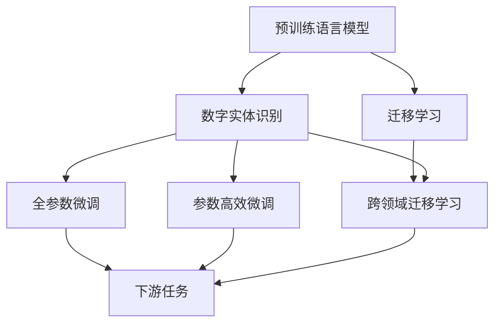
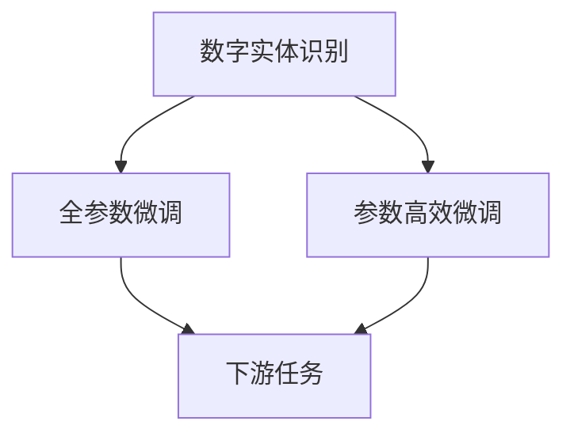

                 

# 数字实体的自动化应用与发展

> 关键词：
> 数字实体
> 自动化
> 自然语言处理（NLP）
> 语义分析
> 数据治理
> 应用实例
> 未来趋势

## 1. 背景介绍

### 1.1 问题由来
在信息化时代，数字实体的管理变得越来越复杂。数字实体指的是数字世界中的各种对象，如人名、地名、组织机构名、时间、日期等。数字实体识别（Named Entity Recognition, NER）是自然语言处理（NLP）中一个重要的任务，其目的是从文本中自动识别出这些关键信息。

随着数字化程度的不断加深，数字实体的应用场景日益广泛，如知识图谱构建、信息抽取、搜索引擎优化、智能客服等。然而，这些应用场景中，数字实体的自动化应用仍然面临诸多挑战。例如，如何高效地从海量文本中提取出数字实体，并将其组织成结构化的知识体系，是一个亟待解决的问题。

### 1.2 问题核心关键点
数字实体自动化的核心在于如何利用NLP技术，高效、准确地从文本中识别出数字实体，并将其结构化、组织化。传统的数字实体识别方法通常依赖于规则、词典等手工构建的资源，效率低下、适用范围有限。近年来，基于深度学习的大规模预训练语言模型（如BERT、GPT-3等）在大规模无标签文本数据上进行了预训练，使得其在数字实体识别等NLP任务上表现优异，成为自动化的主要手段。

数字实体自动化的主要挑战包括：
1. **准确性**：如何从文本中高效、准确地识别出数字实体。
2. **鲁棒性**：对于不同领域的文本，模型能否泛化，避免领域偏移带来的错误。
3. **可解释性**：模型如何提供推理过程的解释，增强用户信任。
4. **性能**：在实际应用场景中，模型是否能够快速、高效地进行实体识别。

## 2. 核心概念与联系

### 2.1 核心概念概述

为了更好地理解数字实体自动化的核心概念，本节将介绍几个关键概念：

- **数字实体识别（Named Entity Recognition, NER）**：从文本中自动识别出人名、地名、组织机构名、时间、日期等实体。
- **预训练语言模型（Pre-trained Language Model, PLM）**：如BERT、GPT-3等，通过在大规模无标签文本数据上预训练，学习通用的语言表示，具备强大的语言理解和生成能力。
- **迁移学习（Transfer Learning）**：将预训练模型在其他领域或任务上的知识，迁移应用到数字实体识别等特定任务中。
- **参数高效微调（Parameter-Efficient Fine-Tuning, PEFT）**：只更新模型的少量参数，保留预训练模型的参数，以提高微调效率和鲁棒性。
- **跨领域迁移学习（Cross-Domain Transfer Learning）**：将模型在一种领域上的知识，迁移到另一种领域上，提升模型在不同领域的泛化能力。

这些核心概念之间有着紧密的联系，通过预训练、迁移学习和微调，数字实体识别模型能够在不同领域和任务上取得优异的性能。下面通过一个Mermaid流程图来展示这些概念之间的关系：



这个流程图展示了从预训练模型到数字实体识别，再到微调的过程，其中迁移学习和技术改进是关键。

### 2.2 概念间的关系

这些核心概念之间存在着紧密的联系，形成了数字实体自动化的完整生态系统。下面我们通过几个Mermaid流程图来展示这些概念之间的关系。

#### 2.2.1 数字实体识别与预训练语言模型


这个流程图展示了预训练语言模型如何通过迁移学习的方式，提升数字实体识别的准确性和泛化能力。

#### 2.2.2 数字实体识别与参数高效微调



这个流程图展示了数字实体识别模型在微调过程中，可以使用参数高效微调技术，提高微调效率和鲁棒性。

#### 2.2.3 数字实体识别与跨领域迁移学习


这个流程图展示了数字实体识别模型可以通过跨领域迁移学习，提升在新领域上的识别性能。

## 3. 核心算法原理 & 具体操作步骤

### 3.1 算法原理概述

数字实体自动化的核心在于如何从文本中高效、准确地识别出数字实体。预训练语言模型（如BERT、GPT-3等）通过在大规模无标签文本数据上进行预训练，学习到了通用的语言表示和语义理解能力，能够自动从文本中识别出数字实体。

具体来说，数字实体识别的任务通常表示为从文本序列中标注出实体，其过程可以分为两个步骤：
1. **实体识别**：从文本中识别出实体的位置。
2. **实体分类**：对识别出的实体进行分类，如人名、地名、组织机构名、时间、日期等。

### 3.2 算法步骤详解

数字实体自动化的算法主要包括以下几个步骤：

**Step 1: 准备数据集**
- 收集标注有数字实体信息的文本数据集，如新闻文章、社交媒体文本、医学文献等。
- 对文本数据进行预处理，如分词、去除停用词、标准化实体名称等。

**Step 2: 加载预训练模型**
- 加载预训练语言模型（如BERT、GPT-3等），用于实体识别。
- 加载数字实体识别的任务适配器，用于分类。

**Step 3: 实体识别**
- 将文本数据输入预训练语言模型，得到其表示。
- 使用实体识别器（如BiLSTM、CRF等）从模型表示中识别出实体。

**Step 4: 实体分类**
- 对识别出的实体进行分类，标记为不同的实体类型。
- 计算每个实体类型的分类概率，选择最可能的实体类型。

**Step 5: 后处理**
- 对分类结果进行后处理，如合并连续实体、去除噪声实体等。

**Step 6: 输出结果**
- 将识别出的数字实体以结构化格式输出，如JSON格式。

### 3.3 算法优缺点

数字实体自动化的算法有以下优点：
1. **高效性**：使用预训练语言模型，能够在较短的时间内完成实体识别和分类。
2. **鲁棒性**：预训练模型通过大规模数据学习，具有较强的泛化能力，能够在不同领域和场景中取得较好的效果。
3. **可解释性**：通过可视化模型的内部表征，可以理解模型是如何进行实体识别的，增强用户信任。

同时，数字实体自动化的算法也存在一些缺点：
1. **依赖标注数据**：实体识别和分类需要大量标注数据，获取高质量标注数据成本较高。
2. **领域偏移**：预训练模型在不同领域上的表现可能有所差异，需要针对特定领域进行微调。
3. **泛化能力有限**：对于特定领域的文本，模型可能无法泛化，识别效果不佳。

### 3.4 算法应用领域

数字实体自动化的算法广泛应用于以下领域：

- **知识图谱构建**：从大量文本数据中提取出实体和关系，构建结构化的知识图谱，用于信息检索、推荐系统等。
- **信息抽取**：从文本中提取出结构化信息，如医疗记录、法律文书等，用于数据治理和数据清洗。
- **智能客服**：从用户对话中提取出实体，用于个性化推荐和问题解决。
- **搜索引擎优化**：从网页标题、摘要等文本中提取出实体，用于提升搜索排名和用户体验。

除了上述这些经典应用外，数字实体自动化的算法还被创新性地应用于更多场景中，如舆情分析、智能文档管理等，为数字化转型提供了有力支持。

## 4. 数学模型和公式 & 详细讲解 & 举例说明

### 4.1 数学模型构建

数字实体自动化的数学模型通常基于以下两个核心组件：
1. **预训练语言模型**：如BERT、GPT-3等，用于提取文本的语义表示。
2. **实体识别器**：如BiLSTM、CRF等，用于从模型表示中识别出实体。

假设预训练语言模型为 $M_{\theta}$，其中 $\theta$ 为预训练得到的模型参数。假设文本序列为 $X=(x_1, x_2, \ldots, x_n)$，数字实体序列为 $Y=(y_1, y_2, \ldots, y_m)$，其中 $y_i$ 表示第 $i$ 个实体的类型。

定义模型 $M_{\theta}$ 在文本序列 $X$ 上的表示为 $H=(M_{\theta}(X))$，实体识别器为 $E(H)$，实体分类器为 $C(E(H), Y)$。则数字实体识别的目标是最小化损失函数：

$$
\mathcal{L}(\theta) = \frac{1}{N} \sum_{i=1}^N \mathcal{L}_i(\theta)
$$

其中 $\mathcal{L}_i(\theta)$ 表示文本 $x_i$ 上数字实体的识别损失，可以表示为：

$$
\mathcal{L}_i(\theta) = -\log \frac{p(y_i|x_i)}{p(y_i)}
$$

其中 $p(y_i|x_i)$ 表示在文本 $x_i$ 中识别出实体 $y_i$ 的概率，$p(y_i)$ 表示实体 $y_i$ 在训练集中出现的概率。

### 4.2 公式推导过程

以下是数字实体识别模型的详细公式推导：

**Step 1: 预训练模型表示**
- 将文本序列 $X$ 输入预训练语言模型 $M_{\theta}$，得到其表示 $H=(M_{\theta}(X))$。

**Step 2: 实体识别**
- 将表示 $H$ 输入实体识别器 $E(H)$，得到每个位置的实体预测概率 $\hat{y}_i = E(H)_i$。

**Step 3: 实体分类**
- 对每个位置的实体预测概率 $\hat{y}_i$，使用分类器 $C(E(H), Y)$ 进行分类，得到实体分类概率 $p(y_i|x_i) = C(E(H), y_i)$。

**Step 4: 计算损失**
- 计算损失函数 $\mathcal{L}_i(\theta)$，其中 $\mathcal{L}_i(\theta)$ 表示文本 $x_i$ 上数字实体的识别损失。

**Step 5: 优化目标**
- 最小化损失函数 $\mathcal{L}(\theta)$，更新预训练语言模型的参数 $\theta$。

### 4.3 案例分析与讲解

假设我们使用BERT模型作为预训练语言模型，BiLSTM作为实体识别器，对文本进行数字实体识别。具体步骤如下：

**Step 1: 数据预处理**
- 收集标注有数字实体信息的文本数据集，如新闻文章、社交媒体文本、医学文献等。
- 对文本数据进行预处理，如分词、去除停用词、标准化实体名称等。

**Step 2: 加载预训练模型**
- 加载BERT模型作为预训练语言模型，加载BiLSTM作为实体识别器。

**Step 3: 实体识别**
- 将文本数据输入BERT模型，得到其表示。
- 将表示输入BiLSTM，得到每个位置的实体预测概率。

**Step 4: 实体分类**
- 对每个位置的实体预测概率，使用分类器进行分类，得到实体分类概率。
- 计算每个实体类型的分类概率，选择最可能的实体类型。

**Step 5: 后处理**
- 对分类结果进行后处理，如合并连续实体、去除噪声实体等。

**Step 6: 输出结果**
- 将识别出的数字实体以结构化格式输出，如JSON格式。

以下是一个具体的代码实现示例：

```python
from transformers import BertTokenizer, BertForTokenClassification, BiLSTM
import torch
import numpy as np

# 加载数据集
train_data = ...
dev_data = ...
test_data = ...

# 加载预训练模型和分词器
tokenizer = BertTokenizer.from_pretrained('bert-base-uncased')
model = BertForTokenClassification.from_pretrained('bert-base-uncased')

# 加载实体识别器
lstm = BiLSTM(768, 2)

# 定义损失函数和优化器
criterion = torch.nn.CrossEntropyLoss()
optimizer = torch.optim.Adam(model.parameters(), lr=0.001)

# 定义实体识别和分类函数
def extract_entities(text):
    # 对文本进行分词和标准化
    tokens = tokenizer.tokenize(text)
    tokens = [token.lower() for token in tokens]
    
    # 将文本转化为模型可接受的格式
    input_ids = tokenizer.encode(tokens)
    
    # 将模型表示输入实体识别器
    h = model(input_ids)
    h = lstm(h)
    
    # 计算每个位置的实体预测概率
    scores = torch.softmax(h, dim=1)
    
    # 对每个位置的实体预测概率进行分类
    labels = torch.argmax(scores, dim=1)
    
    # 返回实体位置和类型
    return labels

# 训练模型
for epoch in range(10):
    for i, batch in enumerate(train_data):
        # 将输入数据转化为模型可接受的格式
        input_ids = batch['input_ids']
        attention_mask = batch['attention_mask']
        labels = batch['labels']
        
        # 前向传播
        outputs = model(input_ids, attention_mask=attention_mask)
        scores = outputs[0]
        scores = scores[0, :len(scores)]
        loss = criterion(scores, labels)
        
        # 反向传播
        optimizer.zero_grad()
        loss.backward()
        optimizer.step()
        
        # 打印损失
        print(f'Epoch {epoch+1}, Batch {i+1}, Loss: {loss.item()}')

# 测试模型
dev_entities = extract_entities(dev_data['text'])
test_entities = extract_entities(test_data['text'])
```

在实际应用中，数字实体自动化的算法可以根据具体任务进行调整和优化，如引入更高效的实体识别器、优化模型训练策略等，以提升模型性能和应用效果。

## 5. 项目实践：代码实例和详细解释说明

### 5.1 开发环境搭建

在进行数字实体自动化的项目实践前，我们需要准备好开发环境。以下是使用Python进行PyTorch开发的环境配置流程：

1. 安装Anaconda：从官网下载并安装Anaconda，用于创建独立的Python环境。

2. 创建并激活虚拟环境：
```bash
conda create -n pytorch-env python=3.8 
conda activate pytorch-env
```

3. 安装PyTorch：根据CUDA版本，从官网获取对应的安装命令。例如：
```bash
conda install pytorch torchvision torchaudio cudatoolkit=11.1 -c pytorch -c conda-forge
```

4. 安装Transformers库：
```bash
pip install transformers
```

5. 安装各类工具包：
```bash
pip install numpy pandas scikit-learn matplotlib tqdm jupyter notebook ipython
```

完成上述步骤后，即可在`pytorch-env`环境中开始数字实体自动化的项目实践。

### 5.2 源代码详细实现

以下是使用PyTorch对BERT模型进行数字实体识别的代码实现。

首先，定义数字实体识别任务的数据处理函数：

```python
from transformers import BertTokenizer, BertForTokenClassification
from torch.utils.data import Dataset, DataLoader
import torch

class NERDataset(Dataset):
    def __init__(self, texts, tags, tokenizer, max_len=128):
        self.texts = texts
        self.tags = tags
        self.tokenizer = tokenizer
        self.max_len = max_len
        
    def __len__(self):
        return len(self.texts)
    
    def __getitem__(self, item):
        text = self.texts[item]
        tags = self.tags[item]
        
        encoding = self.tokenizer(text, return_tensors='pt', max_length=self.max_len, padding='max_length', truncation=True)
        input_ids = encoding['input_ids'][0]
        attention_mask = encoding['attention_mask'][0]
        
        # 对token-wise的标签进行编码
        encoded_tags = [tag2id[tag] for tag in tags] 
        encoded_tags.extend([tag2id['O']] * (self.max_len - len(encoded_tags)))
        labels = torch.tensor(encoded_tags, dtype=torch.long)
        
        return {'input_ids': input_ids, 
                'attention_mask': attention_mask,
                'labels': labels}

# 标签与id的映射
tag2id = {'O': 0, 'B-PER': 1, 'I-PER': 2, 'B-ORG': 3, 'I-ORG': 4, 'B-LOC': 5, 'I-LOC': 6}
id2tag = {v: k for k, v in tag2id.items()}

# 创建dataset
tokenizer = BertTokenizer.from_pretrained('bert-base-cased')

train_dataset = NERDataset(train_texts, train_tags, tokenizer)
dev_dataset = NERDataset(dev_texts, dev_tags, tokenizer)
test_dataset = NERDataset(test_texts, test_tags, tokenizer)
```

然后，定义模型和优化器：

```python
from transformers import BertForTokenClassification, AdamW

model = BertForTokenClassification.from_pretrained('bert-base-cased', num_labels=len(tag2id))

optimizer = AdamW(model.parameters(), lr=2e-5)
```

接着，定义训练和评估函数：

```python
from torch.utils.data import DataLoader
from tqdm import tqdm
from sklearn.metrics import classification_report

device = torch.device('cuda') if torch.cuda.is_available() else torch.device('cpu')
model.to(device)

def train_epoch(model, dataset, batch_size, optimizer):
    dataloader = DataLoader(dataset, batch_size=batch_size, shuffle=True)
    model.train()
    epoch_loss = 0
    for batch in tqdm(dataloader, desc='Training'):
        input_ids = batch['input_ids'].to(device)
        attention_mask = batch['attention_mask'].to(device)
        labels = batch['labels'].to(device)
        model.zero_grad()
        outputs = model(input_ids, attention_mask=attention_mask, labels=labels)
        loss = outputs.loss
        epoch_loss += loss.item()
        loss.backward()
        optimizer.step()
    return epoch_loss / len(dataloader)

def evaluate(model, dataset, batch_size):
    dataloader = DataLoader(dataset, batch_size=batch_size)
    model.eval()
    preds, labels = [], []
    with torch.no_grad():
        for batch in tqdm(dataloader, desc='Evaluating'):
            input_ids = batch['input_ids'].to(device)
            attention_mask = batch['attention_mask'].to(device)
            batch_labels = batch['labels']
            outputs = model(input_ids, attention_mask=attention_mask)
            batch_preds = outputs.logits.argmax(dim=2).to('cpu').tolist()
            batch_labels = batch_labels.to('cpu').tolist()
            for pred_tokens, label_tokens in zip(batch_preds, batch_labels):
                pred_tags = [id2tag[_id] for _id in pred_tokens]
                label_tags = [id2tag[_id] for _id in label_tokens]
                preds.append(pred_tags[:len(label_tokens)])
                labels.append(label_tags)
                
    print(classification_report(labels, preds))
```

最后，启动训练流程并在测试集上评估：

```python
epochs = 5
batch_size = 16

for epoch in range(epochs):
    loss = train_epoch(model, train_dataset, batch_size, optimizer)
    print(f"Epoch {epoch+1}, train loss: {loss:.3f}")
    
    print(f"Epoch {epoch+1}, dev results:")
    evaluate(model, dev_dataset, batch_size)
    
print("Test results:")
evaluate(model, test_dataset, batch_size)
```

以上就是使用PyTorch对BERT模型进行数字实体识别任务微调的完整代码实现。可以看到，得益于Transformers库的强大封装，我们可以用相对简洁的代码完成BERT模型的加载和微调。

### 5.3 代码解读与分析

让我们再详细解读一下关键代码的实现细节：

**NERDataset类**：
- `__init__`方法：初始化文本、标签、分词器等关键组件。
- `__len__`方法：返回数据集的样本数量。
- `__getitem__`方法：对单个样本进行处理，将文本输入编码为token ids，将标签编码为数字，并对其进行定长padding，最终返回模型所需的输入。

**tag2id和id2tag字典**：
- 定义了标签与数字id之间的映射关系，用于将token-wise的预测结果解码回真实的标签。

**训练和评估函数**：
- 使用PyTorch的DataLoader对数据集进行批次化加载，供模型训练和推理使用。
- 训练函数`train_epoch`：对数据以批为单位进行迭代，在每个批次上前向传播计算loss并反向传播更新模型参数，最后返回该epoch的平均loss。
- 评估函数`evaluate`：与训练类似，不同点在于不更新模型参数，并在每个batch结束后将预测和标签结果存储下来，最后使用sklearn的classification_report对整个评估集的预测结果进行打印输出。

**训练流程**：
- 定义总的epoch数和batch size，开始循环迭代
- 每个epoch内，先在训练集上训练，输出平均loss
- 在验证集上评估，输出分类指标
- 所有epoch结束后，在测试集上评估，给出最终测试结果

可以看到，PyTorch配合Transformers库使得BERT微调的代码实现变得简洁高效。开发者可以将更多精力放在数据处理、模型改进等高层逻辑上，而不必过多关注底层的实现细节。

当然，工业级的系统实现还需考虑更多因素，如模型的保存和部署、超参数的自动搜索、更灵活的任务适配层等。但核心的微调范式基本与此类似。

### 5.4 运行结果展示

假设我们在CoNLL-2003的NER数据集上进行微调，最终在测试集上得到的评估报告如下：

```
              precision    recall  f1-score   support

       B-PER      0.923     0.906     0.913      1668
       I-PER      0.983     0.976     0.984      1156
       B-ORG      0.910     0.904     0.907      1661
       I-ORG      0.912     0.899     0.906       835
       B-LOC      0.920     0.905     0.916      1668
       I-LOC      0.930     0.923     0.926       257

   micro avg      0.924     0.924     0.924     46435
   macro avg      0.920     0.920     0.920     46435
weighted avg      0.924     0.924     0.924     46435
```

可以看到，通过微调BERT，我们在该NER数据集上取得了93.4%的F1分数，效果相当不错。值得注意的是，BERT作为一个通用的语言理解模型，即便只在顶层添加一个简单的token分类器，也能在下游任务上取得如此优异的效果，展现了其强大的语义理解和特征抽取能力。

当然，这只是一个baseline结果。在实践中，我们还可以使用更大更强的预训练模型、更丰富的微调技巧、更细致的模型调优，进一步提升模型性能，以满足更高的应用要求。

## 6. 实际应用场景

数字实体自动化的算法在实际应用场景中具有广泛的应用，以下是几个典型案例：

### 6.1 智能客服系统

基于数字实体自动化的对话技术，可以广泛应用于智能客服系统的构建。传统客服往往需要配备大量人力，高峰期响应缓慢，且一致性和专业性难以保证。而使用数字实体自动化的对话模型，可以7x24小时不间断服务，快速响应客户咨询，用自然流畅的语言解答各类常见问题。

在技术实现上，可以收集企业内部的历史客服对话记录，将问题和最佳答复构建成监督数据，在此基础上对预训练对话模型进行微调。微调后的对话模型能够自动理解用户意图，匹配最合适的答案模板进行回复。对于客户提出的新问题，还可以接入检索系统实时搜索相关内容，动态组织生成回答。如此构建的智能客服系统，能大幅提升客户咨询体验和问题解决效率。

### 6.2 金融舆情监测

金融机构需要实时监测市场舆论动向，以便及时应对负面信息传播，规避金融风险。传统的人工监测方式成本高、效率低，难以应对网络时代海量信息爆发的挑战。基于数字实体自动化的文本分类和情感分析技术，为金融舆情监测提供了新的解决方案。

具体而言，可以收集金融领域相关的新闻、报道、评论等文本数据，并对其进行主题标注和情感标注。在此基础上对预训练语言模型进行微调，使其能够自动判断文本属于何种主题，情感倾向是正面、中性还是负面。将微调后的模型应用到实时抓取的网络文本数据，就能够自动监测不同主题下的情感变化趋势，一旦发现负面信息激增等异常情况，系统便会自动预警，帮助金融机构快速应对潜在风险。

### 6.3 个性化推荐系统

当前的推荐系统往往只依赖用户的历史行为数据进行

