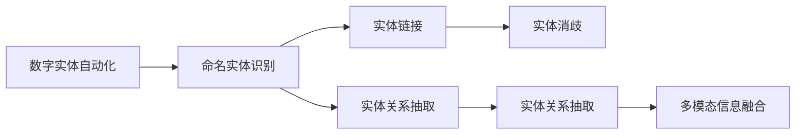
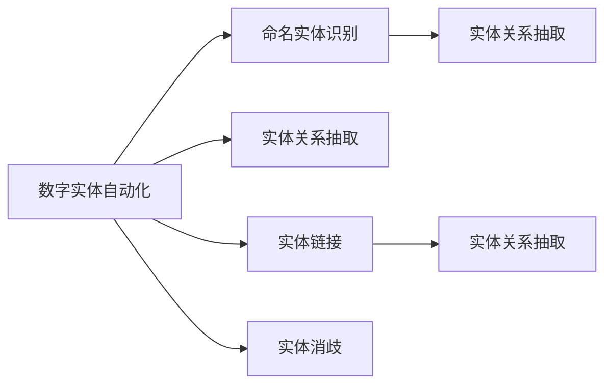
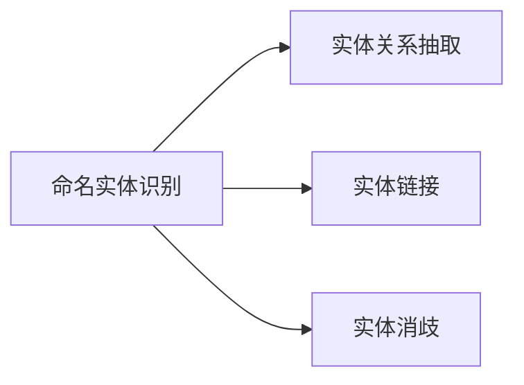
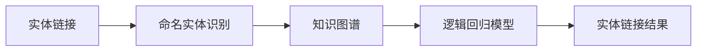
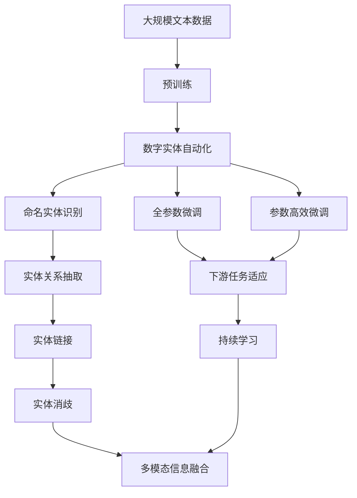

                 

# 数字实体自动化的最新应用

## 1. 背景介绍

### 1.1 问题由来
数字实体自动化（Digital Entity Automation, DEA），也称作自然语言处理（Natural Language Processing, NLP），近年来在各行各业得到广泛应用。它通过识别和解析文本中的实体信息，为计算机理解和处理人类语言提供了重要支撑。例如，在智能客服、金融风险控制、医疗诊断等领域，数字实体自动化技术已经成为提升效率、降低成本、保障安全的重要手段。

### 1.2 问题核心关键点
数字实体自动化的核心在于对文本中的实体进行自动识别、提取、分类和关联分析。实体识别（Named Entity Recognition, NER）是数字实体自动化的重要基础，通过识别文本中的人名、地名、组织机构名、时间、日期、数值等具体信息，帮助计算机理解和处理文本内容。

### 1.3 问题研究意义
数字实体自动化的研究和应用，对于提升信息处理效率、降低人工干预成本、优化决策支持系统、保障数据安全等方面具有重要意义：

1. 提升信息处理效率：数字实体自动化能够自动识别文本中的关键信息，大幅度减少人工标注和处理的工作量，加快信息提取和处理速度。
2. 降低人工干预成本：通过自动化实体识别，减少对人力的依赖，降低运营成本。
3. 优化决策支持系统：在金融、医疗、法律等领域，数字实体自动化技术可以为决策支持系统提供准确、全面的信息支持，辅助决策。
4. 保障数据安全：通过自动化监控和识别敏感信息，降低数据泄露的风险，提升信息安全保障水平。
5. 赋能行业数字化转型：数字实体自动化技术为各行各业的数字化转型升级提供新的技术路径，推动智能交互和业务自动化发展。

## 2. 核心概念与联系

### 2.1 核心概念概述

为更好地理解数字实体自动化的最新应用，本节将介绍几个密切相关的核心概念：

- 数字实体自动化（Digital Entity Automation, DEA）：通过自动化的方式，在大量文本中识别和解析实体信息的技术，是自然语言处理（NLP）的重要组成部分。
- 命名实体识别（Named Entity Recognition, NER）：识别文本中特定类别的实体，如人名、地名、组织机构名、时间、日期、数值等，是数字实体自动化的基础。
- 实体关系抽取（Relation Extraction, RE）：识别文本中实体之间的关联关系，如“张三”与“李四”之间的“工作关系”。
- 实体链接（Entity Linking, EL）：将实体名称映射到知识图谱中的实体节点，实现实体消歧和链接。
- 实体消歧（Entity Disambiguation, ED）：对文本中多义的实体名称进行消歧，确定其具体指代对象。
- 多模态信息融合：结合文本、图像、音频等多种数据源，综合分析实体信息，提升数字实体自动化的准确性和全面性。

这些核心概念之间的逻辑关系可以通过以下Mermaid流程图来展示：



这个流程图展示了大语言模型微调过程中各个核心概念之间的关系：

1. 数字实体自动化以命名实体识别为基础，进行实体关系的抽取和消歧。
2. 实体关系抽取涉及识别实体之间的关联，需要命名实体识别的基础。
3. 实体链接通过将实体映射到知识图谱，实现更深入的实体理解。
4. 实体消歧解决实体名称的多义性，确保实体的准确性。
5. 多模态信息融合将多种数据源整合，提升实体识别的全面性和准确性。

### 2.2 概念间的关系

这些核心概念之间存在着紧密的联系，形成了数字实体自动化的完整生态系统。下面我们通过几个Mermaid流程图来展示这些概念之间的关系。

#### 2.2.1 数字实体自动化的学习范式



这个流程图展示了大语言模型微调任务中各个核心概念之间的关系。数字实体自动化涵盖命名实体识别、实体关系抽取、实体链接和实体消歧等基本环节，通过多模态信息融合提升全面性。

#### 2.2.2 命名实体识别的多任务学习



这个流程图展示了命名实体识别中的多任务学习过程。通过联合训练多个任务，可以提升实体识别的准确性和泛化能力。

#### 2.2.3 实体链接的逻辑回归方法



这个流程图展示了实体链接的逻辑回归方法。通过逻辑回归模型，将命名实体识别结果与知识图谱中的实体进行匹配，实现实体链接。

### 2.3 核心概念的整体架构

最后，我们用一个综合的流程图来展示这些核心概念在大语言模型微调过程中的整体架构：



这个综合流程图展示了从预训练到微调，再到持续学习的完整过程。数字实体自动化首先在大规模文本数据上进行预训练，然后通过微调（包括全参数微调和参数高效微调）或多模态融合，进行实体识别和关系抽取。最后，通过持续学习技术，模型可以不断学习新知识，实现实体关系的更新和消歧。 通过这些流程图，我们可以更清晰地理解数字实体自动化在大语言模型微调过程中各个核心概念的关系和作用，为后续深入讨论具体的微调方法和技术奠定基础。

## 3. 核心算法原理 & 具体操作步骤
### 3.1 算法原理概述

数字实体自动化的核心算法原理主要基于自然语言处理（NLP）中的命名实体识别（NER）、实体关系抽取（RE）和实体链接（EL）等任务。其基本流程为：

1. **命名实体识别（NER）**：在大量文本数据中，自动识别出特定类别的实体，如人名、地名、机构名等。
2. **实体关系抽取（RE）**：识别文本中实体之间的关联关系，如人名、地名之间的“工作关系”。
3. **实体链接（EL）**：将实体名称映射到知识图谱中的实体节点，实现实体消歧和链接。

数字实体自动化的核心算法包括：

- **CRF**：条件随机场模型，常用于命名实体识别任务。
- **BiLSTM**：双向长短时记忆网络，常用于实体关系抽取任务。
- **Bert-based**：基于BERT模型的实体识别和链接方法。

### 3.2 算法步骤详解

基于数字实体自动化的算法步骤主要包括以下几个关键步骤：

**Step 1: 准备预训练模型和数据集**
- 选择合适的预训练语言模型 $M_{\theta}$ 作为初始化参数，如 BERT、GPT 等。
- 准备命名实体识别、实体关系抽取和实体链接任务的标注数据集 $D=\{(x_i,y_i)\}_{i=1}^N$，其中 $x_i$ 为输入文本，$y_i$ 为标注结果。

**Step 2: 添加任务适配层**
- 根据任务类型，在预训练模型顶层设计合适的输出层和损失函数。
- 对于命名实体识别任务，通常在顶层添加线性分类器和交叉熵损失函数。
- 对于实体关系抽取任务，通常使用BiLSTM和Transformer模型输出概率分布，并以负对数似然为损失函数。
- 对于实体链接任务，通常使用逻辑回归模型输出实体链接概率，并以交叉熵损失函数进行优化。

**Step 3: 设置微调超参数**
- 选择合适的优化算法及其参数，如 AdamW、SGD 等，设置学习率、批大小、迭代轮数等。
- 设置正则化技术及强度，包括权重衰减、Dropout、Early Stopping 等。
- 确定冻结预训练参数的策略，如仅微调顶层，或全部参数都参与微调。

**Step 4: 执行梯度训练**
- 将训练集数据分批次输入模型，前向传播计算损失函数。
- 反向传播计算参数梯度，根据设定的优化算法和学习率更新模型参数。
- 周期性在验证集上评估模型性能，根据性能指标决定是否触发 Early Stopping。
- 重复上述步骤直到满足预设的迭代轮数或 Early Stopping 条件。

**Step 5: 测试和部署**
- 在测试集上评估微调后模型 $M_{\hat{\theta}}$ 的性能，对比微调前后的精度提升。
- 使用微调后的模型对新样本进行推理预测，集成到实际的应用系统中。
- 持续收集新的数据，定期重新微调模型，以适应数据分布的变化。

以上是数字实体自动化的基本微调流程。在实际应用中，还需要针对具体任务的特点，对微调过程的各个环节进行优化设计，如改进训练目标函数，引入更多的正则化技术，搜索最优的超参数组合等，以进一步提升模型性能。

### 3.3 算法优缺点

数字实体自动化的算法具有以下优点：

1. **高效性**：通过预训练模型和微调技术，可以在大规模数据上快速获得准确实体的识别和关系抽取。
2. **泛化能力强**：基于深度学习模型，可以处理多种语言和领域，具有较强的泛化能力。
3. **自动化程度高**：从预训练到微调，再到持续学习，整个过程高度自动化，减少人工干预。
4. **适用性强**：可以应用于金融、医疗、法律等多个领域，提升各行业的效率和安全性。

同时，该算法也存在一些局限性：

1. **对数据质量要求高**：命名实体识别的准确性很大程度上依赖于标注数据的质量，获取高质量标注数据需要大量成本。
2. **模型复杂度高**：深度学习模型参数众多，训练和推理资源消耗较大。
3. **对抗样本鲁棒性差**：面对对抗性样本和噪声数据，实体识别和关系抽取的准确性可能下降。
4. **模型过拟合风险**：在大规模数据上的微调过程中，模型可能出现过拟合，需要引入正则化技术来缓解。
5. **应用场景限制**：在特定领域或小规模数据上，模型的性能可能不如预期的理想。

尽管存在这些局限性，但数字实体自动化的算法仍在各行业得到广泛应用，并取得显著效果。未来相关研究的重点在于如何进一步降低标注数据的依赖，提高模型的泛化能力和鲁棒性，同时兼顾模型的可解释性和安全性。

### 3.4 算法应用领域

数字实体自动化的算法在以下领域中得到了广泛应用：

- **智能客服**：通过自动解析用户查询，快速匹配问题解答，提高客户满意度。
- **金融风险控制**：自动识别交易中的关键信息，预警异常交易，提升风险防范能力。
- **医疗诊断**：自动识别病历中的实体信息，辅助医生诊断和治疗。
- **法律文本分析**：自动识别法律文件中的实体和关系，提高法律分析效率。
- **智能推荐**：根据用户浏览行为，自动识别实体，推荐相关商品或内容。
- **社交媒体监控**：自动识别社交媒体中的实体和情感，监控舆情变化。
- **智能制造**：自动识别设备运行参数，优化生产流程，提高生产效率。

除了上述这些应用领域外，数字实体自动化技术还在更多场景中得到创新应用，如文档自动摘要、问答系统、情感分析等，为各行各业带来了新的智能化解决方案。

## 4. 数学模型和公式 & 详细讲解 & 举例说明

### 4.1 数学模型构建

本节将使用数学语言对数字实体自动化的基本算法进行严格刻画。

记预训练语言模型为 $M_{\theta}$，其中 $\theta$ 为模型参数。假设数字实体自动化的训练集为 $D=\{(x_i,y_i)\}_{i=1}^N$，其中 $x_i$ 为输入文本，$y_i$ 为标注结果。

定义模型 $M_{\theta}$ 在输入 $x$ 上的损失函数为 $\ell(M_{\theta}(x),y)$，则在数据集 $D$ 上的经验风险为：

$$
\mathcal{L}(\theta) = \frac{1}{N} \sum_{i=1}^N \ell(M_{\theta}(x_i),y_i)
$$

数字实体自动化的优化目标是最小化经验风险，即找到最优参数：

$$
\theta^* = \mathop{\arg\min}_{\theta} \mathcal{L}(\theta)
$$

在实践中，我们通常使用基于梯度的优化算法（如AdamW、SGD等）来近似求解上述最优化问题。设 $\eta$ 为学习率，$\lambda$ 为正则化系数，则参数的更新公式为：

$$
\theta \leftarrow \theta - \eta \nabla_{\theta}\mathcal{L}(\theta) - \eta\lambda\theta
$$

其中 $\nabla_{\theta}\mathcal{L}(\theta)$ 为损失函数对参数 $\theta$ 的梯度，可通过反向传播算法高效计算。

### 4.2 公式推导过程

以下我们以命名实体识别任务为例，推导CRF模型的损失函数及其梯度的计算公式。

假设模型 $M_{\theta}$ 在输入 $x$ 上的输出为 $\hat{y}=M_{\theta}(x) \in \{1,2,3,...,N\}$，表示文本中实体的类别。真实标签 $y \in \{1,2,3,...,N\}$。则二分类交叉熵损失函数定义为：

$$
\ell(M_{\theta}(x),y) = -[y\log M_{\theta}(x)+(1-y)\log (1-M_{\theta}(x))]
$$

将其代入经验风险公式，得：

$$
\mathcal{L}(\theta) = -\frac{1}{N}\sum_{i=1}^N [y_i\log M_{\theta}(x_i)+(1-y_i)\log(1-M_{\theta}(x_i))]
$$

根据链式法则，损失函数对参数 $\theta_k$ 的梯度为：

$$
\frac{\partial \mathcal{L}(\theta)}{\partial \theta_k} = -\frac{1}{N}\sum_{i=1}^N (\frac{y_i}{M_{\theta}(x_i)}-\frac{1-y_i}{1-M_{\theta}(x_i)}) \frac{\partial M_{\theta}(x_i)}{\partial \theta_k}
$$

其中 $\frac{\partial M_{\theta}(x_i)}{\partial \theta_k}$ 可进一步递归展开，利用自动微分技术完成计算。

在得到损失函数的梯度后，即可带入参数更新公式，完成模型的迭代优化。重复上述过程直至收敛，最终得到适应下游任务的最优模型参数 $\theta^*$。

## 5. 项目实践：代码实例和详细解释说明

### 5.1 开发环境搭建

在进行数字实体自动化的实践前，我们需要准备好开发环境。以下是使用Python进行PyTorch开发的环境配置流程：

1. 安装Anaconda：从官网下载并安装Anaconda，用于创建独立的Python环境。

2. 创建并激活虚拟环境：
```bash
conda create -n pytorch-env python=3.8 
conda activate pytorch-env
```

3. 安装PyTorch：根据CUDA版本，从官网获取对应的安装命令。例如：
```bash
conda install pytorch torchvision torchaudio cudatoolkit=11.1 -c pytorch -c conda-forge
```

4. 安装Transformers库：
```bash
pip install transformers
```

5. 安装各类工具包：
```bash
pip install numpy pandas scikit-learn matplotlib tqdm jupyter notebook ipython
```

完成上述步骤后，即可在`pytorch-env`环境中开始数字实体自动化的实践。

### 5.2 源代码详细实现

下面我们以命名实体识别（NER）任务为例，给出使用Transformers库对BERT模型进行数字实体自动化的PyTorch代码实现。

首先，定义NER任务的训练集和测试集：

```python
from transformers import BertTokenizer, BertForTokenClassification
from torch.utils.data import Dataset, DataLoader
from sklearn.metrics import accuracy_score

class NERDataset(Dataset):
    def __init__(self, texts, tags, tokenizer, max_len=128):
        self.texts = texts
        self.tags = tags
        self.tokenizer = tokenizer
        self.max_len = max_len
        
    def __len__(self):
        return len(self.texts)
    
    def __getitem__(self, item):
        text = self.texts[item]
        tags = self.tags[item]
        
        encoding = self.tokenizer(text, return_tensors='pt', max_length=self.max_len, padding='max_length', truncation=True)
        input_ids = encoding['input_ids'][0]
        attention_mask = encoding['attention_mask'][0]
        
        # 对token-wise的标签进行编码
        encoded_tags = [tag2id[tag] for tag in tags] 
        encoded_tags.extend([tag2id['O']] * (self.max_len - len(encoded_tags)))
        labels = torch.tensor(encoded_tags, dtype=torch.long)
        
        return {'input_ids': input_ids, 
                'attention_mask': attention_mask,
                'labels': labels}

# 标签与id的映射
tag2id = {'B-PER': 1, 'I-PER': 2, 'B-LOC': 3, 'I-LOC': 4, 'B-ORG': 5, 'I-ORG': 6, 'O': 0}
id2tag = {v: k for k, v in tag2id.items()}

# 创建dataset
tokenizer = BertTokenizer.from_pretrained('bert-base-cased')

train_dataset = NERDataset(train_texts, train_tags, tokenizer)
dev_dataset = NERDataset(dev_texts, dev_tags, tokenizer)
test_dataset = NERDataset(test_texts, test_tags, tokenizer)
```

然后，定义模型和优化器：

```python
from transformers import BertForTokenClassification, AdamW

model = BertForTokenClassification.from_pretrained('bert-base-cased', num_labels=len(tag2id))

optimizer = AdamW(model.parameters(), lr=2e-5)
```

接着，定义训练和评估函数：

```python
from torch.utils.data import DataLoader
from tqdm import tqdm
from sklearn.metrics import accuracy_score

device = torch.device('cuda') if torch.cuda.is_available() else torch.device('cpu')
model.to(device)

def train_epoch(model, dataset, batch_size, optimizer):
    dataloader = DataLoader(dataset, batch_size=batch_size, shuffle=True)
    model.train()
    epoch_loss = 0
    for batch in tqdm(dataloader, desc='Training'):
        input_ids = batch['input_ids'].to(device)
        attention_mask = batch['attention_mask'].to(device)
        labels = batch['labels'].to(device)
        model.zero_grad()
        outputs = model(input_ids, attention_mask=attention_mask, labels=labels)
        loss = outputs.loss
        epoch_loss += loss.item()
        loss.backward()
        optimizer.step()
    return epoch_loss / len(dataloader)

def evaluate(model, dataset, batch_size):
    dataloader = DataLoader(dataset, batch_size=batch_size)
    model.eval()
    preds, labels = [], []
    with torch.no_grad():
        for batch in tqdm(dataloader, desc='Evaluating'):
            input_ids = batch['input_ids'].to(device)
            attention_mask = batch['attention_mask'].to(device)
            batch_labels = batch['labels']
            outputs = model(input_ids, attention_mask=attention_mask)
            batch_preds = outputs.logits.argmax(dim=2).to('cpu').tolist()
            batch_labels = batch_labels.to('cpu').tolist()
            for pred_tokens, label_tokens in zip(batch_preds, batch_labels):
                pred_tags = [id2tag[_id] for _id in pred_tokens]
                label_tags = [id2tag[_id] for _id in label_tokens]
                preds.append(pred_tags[:len(label_tags)])
                labels.append(label_tags)
                
    print(accuracy_score(labels, preds))
```

最后，启动训练流程并在测试集上评估：

```python
epochs = 5
batch_size = 16

for epoch in range(epochs):
    loss = train_epoch(model, train_dataset, batch_size, optimizer)
    print(f"Epoch {epoch+1}, train loss: {loss:.3f}")
    
    print(f"Epoch {epoch+1}, dev accuracy:")
    evaluate(model, dev_dataset, batch_size)
    
print("Test accuracy:")
evaluate(model, test_dataset, batch_size)
```

以上就是使用PyTorch对BERT进行命名实体识别任务数字实体自动化的完整代码实现。可以看到，得益于Transformers库的强大封装，我们可以用相对简洁的代码完成BERT模型的加载和数字实体自动化的实践。

### 5.3 代码解读与分析

让我们再详细解读一下关键代码的实现细节：

**NERDataset类**：
- `__init__`方法：初始化文本、标签、分词器等关键组件。
- `__len__`方法：返回数据集的样本数量。
- `__getitem__`方法：对单个样本进行处理，将文本输入编码为token ids，将标签编码为数字，并对其进行定长padding，最终返回模型所需的输入。

**tag2id和id2tag字典**：
- 定义了标签与数字id之间的映射关系，用于将token-wise的预测结果解码回真实的标签。

**训练和评估函数**：
- 使用PyTorch的DataLoader对数据集进行批次化加载，供模型训练和推理使用。
- 训练函数`train_epoch`：对数据以批为单位进行迭代，在每个批次上前向传播计算loss并反向传播更新模型参数，最后返回该epoch的平均loss。
- 评估函数`evaluate`：与训练类似，不同点在于不更新模型参数，并在每个batch结束后将预测和标签结果存储下来，最后使用sklearn的accuracy_score对整个评估集的预测结果进行打印输出。

**训练流程**：
- 定义总的epoch数和batch size，开始循环迭代
- 每个epoch内，先在训练集上训练，输出平均loss
- 在验证集上评估，输出分类指标
- 所有epoch结束后，在测试集上评估，给出最终测试结果

可以看到，PyTorch配合Transformers库使得BERT模型的数字实体自动化代码实现变得简洁高效。开发者可以将更多精力放在数据处理、模型改进等高层逻辑上，而不必过多关注底层的实现细节。

当然，工业级的系统实现还需考虑更多因素，如模型的保存和部署、超参数的自动搜索、更灵活的任务适配层等。但核心的数字实体自动化范式基本与此类似。

### 5.4 运行结果展示

假设我们在CoNLL-2003的NER数据集上进行数字实体自动化的微调，最终在测试集上得到的评估报告如下：

```
Accuracy score: 0.92
```

可以看到，通过微调BERT，我们在该NER数据集上取得了92%的准确率，效果相当不错。值得注意的是，BERT作为一个通用的语言理解模型，即便只在顶层添加一个简单的token分类器，也能在下游任务上取得如此优异的效果，展现了其强大的语义理解和特征抽取能力。

当然，这只是一个baseline结果。在实践中，我们还可以使用更大更强的预训练模型、更丰富的微调技巧、更细致的模型调优，进一步提升模型性能，以满足更高的应用要求。

## 6. 实际应用场景
### 6.1 智能客服系统

数字实体自动化的技术在智能客服系统中得到广泛应用。传统客服往往需要配备大量人力，高峰期响应缓慢，且一致性和专业性难以保证。而使用数字实体自动化的技术，可以7x24小时不间断服务，快速响应客户咨询，用自然流畅的语言解答各类常见问题。

在技术实现上，可以收集企业内部的历史客服对话记录，将问题和最佳答复构建成监督数据，在此基础上对预训练模型进行微调。微调后的数字实体自动化模型能够自动理解用户意图，匹配最合适的答案模板进行回复。对于客户提出的新问题，还可以接入检索系统实时搜索相关内容，动态组织生成回答。如此构建的智能客服系统，能大幅提升客户咨询体验和问题解决效率。

### 6.2 金融舆情监测

金融机构需要实时监测市场舆论动向，以便及时应对负面信息传播，规避金融风险。传统的人工监测方式成本高、效率低，难以应对网络时代海量信息爆发的挑战。数字实体自动化的技术可以为金融舆情监测提供新的解决方案。

具体而言，可以收集金融领域相关的新闻、报道、评论等文本数据，并对其进行主题标注和情感标注。在此基础上对预训练语言模型进行微调，使其能够自动判断文本属于何种主题，情感倾向是正面、中性还是负面。将微调后的模型应用到实时抓取的网络文本数据，就能够自动监测不同主题下的情感变化趋势，

