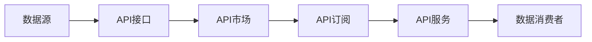
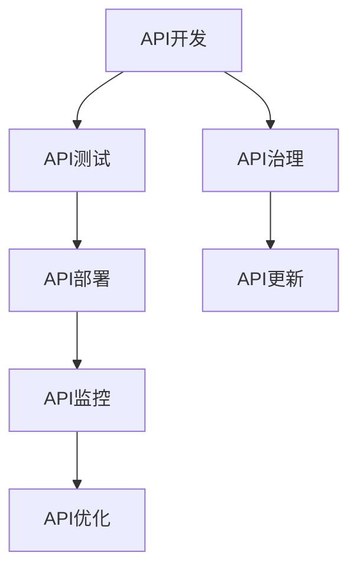
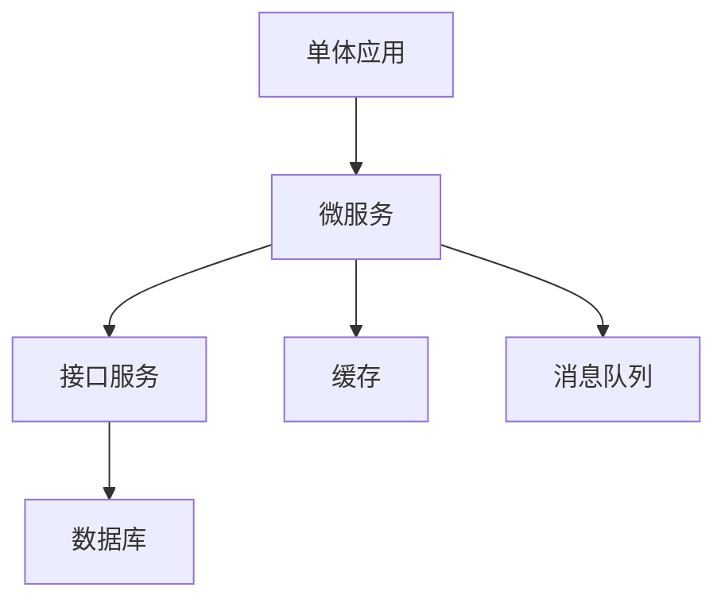
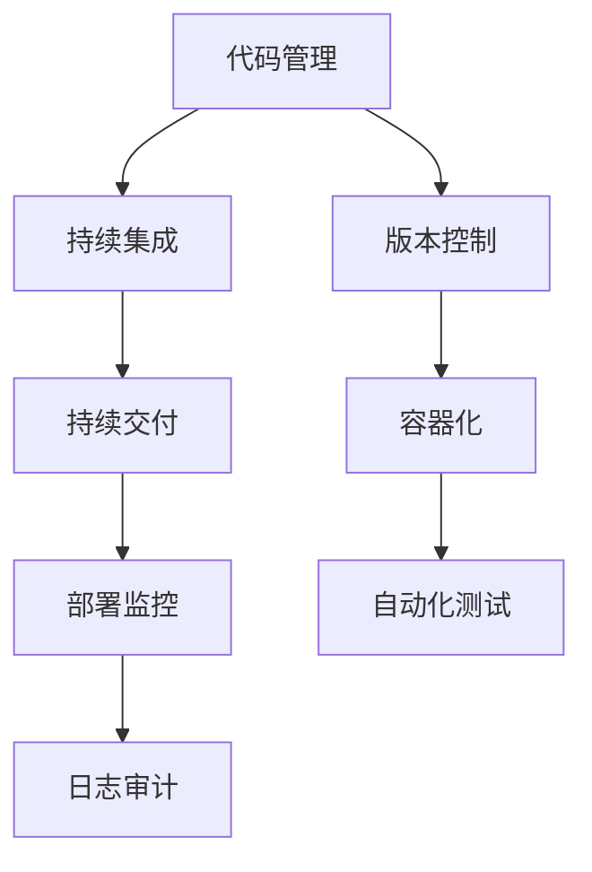
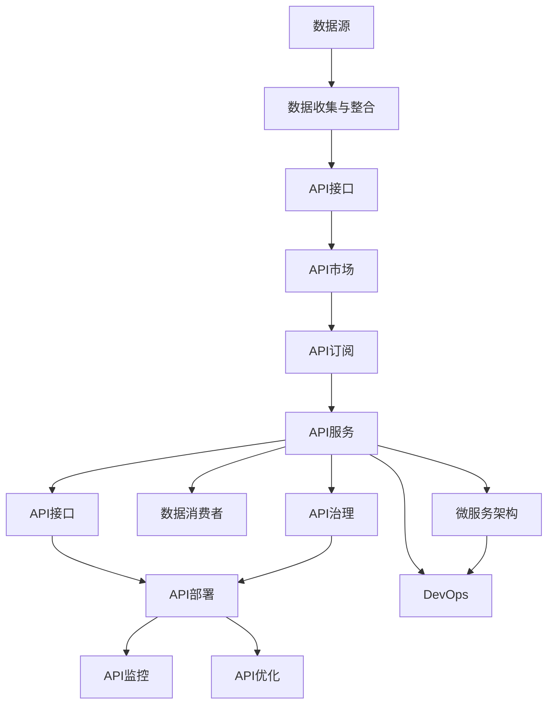

                 

# 数据即服务:API经济下的新型数据交易模式

## 1. 背景介绍

### 1.1 问题由来

在现代经济活动中，数据正成为不可或缺的重要资源。无论是智能制造、精准农业、智慧城市，还是电子商务、金融科技、医疗健康等领域，数据都发挥着至关重要的作用。据统计，数据占全球所有经济体的总量的10%，并且预计到2025年，数据将会占到全球经济产出的近60%。

然而，数据资源的高价值和复杂性，使得其获取和使用面临诸多挑战。一方面，数据源众多且分布分散，数据所有者分散且利益诉求各异，导致数据获取难度大、成本高。另一方面，数据的存储、清洗、分析等环节复杂繁琐，非专业人员难以有效管理和利用。此外，数据的隐私和安全问题也日益凸显，如何保护数据隐私、确保数据安全成为一大难题。

为了解决这些问题，数据即服务(Data as a Service, DaaS)应运而生。DaaS模式旨在将数据资源作为服务提供，客户只需按需获取所需数据，而无需关心数据的所有权、存储、安全等细节。DaaS通过API接口，将数据服务封装成可调用模块，使得数据获取和使用更加便捷、高效、安全。

### 1.2 问题核心关键点

DaaS模式的核心在于将数据资源转化为可交易的服务。这一过程包括以下几个关键步骤：

- **数据收集与整合**：从多个数据源获取数据，并进行清洗、标准化、整合等预处理。
- **API封装与发布**：将预处理后的数据封装成可调用的API接口，并通过云端或本地服务器进行发布。
- **服务订阅与使用**：客户通过API接口订阅所需数据服务，并按照使用量付费。
- **安全与隐私保护**：采用加密、访问控制等技术，确保数据传输和使用过程中的安全性和隐私性。

### 1.3 问题研究意义

DaaS模式的提出，对于推动数据资源的开发利用、提升数据服务效率、保护数据隐私安全，具有重要意义：

1. **降低数据获取成本**：DaaS模式将数据资源转化为服务，简化了数据获取流程，降低了数据获取的门槛和成本。
2. **提高数据服务质量**：通过API封装，数据服务被标准化、规范化，用户可以按需获取高质量、高可靠性的数据。
3. **确保数据安全与隐私**：DaaS模式采用了先进的安全与隐私保护技术，确保数据在传输和使用过程中的安全性和隐私性。
4. **促进数据共享与合作**：DaaS模式将数据服务化，推动数据共享与合作，实现数据价值的最大化。
5. **推动数据市场化发展**：DaaS模式为数据交易提供了新的渠道和模式，促进数据市场的形成和发展。

## 2. 核心概念与联系

### 2.1 核心概念概述

为更好地理解DaaS模式及其核心概念，本节将介绍几个关键概念：

- **数据即服务(DaaS)**：将数据资源转化为可交易的服务，客户按需获取所需数据。
- **API经济**：通过API接口，实现数据、服务、功能等资源的连接和整合，形成以API为中心的生态系统。
- **API接口**：用于定义和实现服务功能的接口规范，支持客户端和服务端之间的数据交换和功能调用。
- **API市场**：以API接口为核心，提供API服务的平台，供客户按需订阅和调用。
- **API生命周期管理**：API开发、部署、监控、优化等全生命周期的管理和维护。
- **微服务架构**：将应用程序拆分为多个独立、自治的微服务，以提高系统的灵活性和扩展性。
- **DevOps**：结合软件开发(SD)和运维(Ops)的方法和实践，提升软件开发生命周期的效率和质量。

这些核心概念之间的关系可以通过以下Mermaid流程图来展示：

```mermaid
graph TB
    A[数据即服务(DaaS)] --> B[API接口]
    B --> C[API经济]
    B --> D[API市场]
    B --> E[API生命周期管理]
    B --> F[微服务架构]
    B --> G[DevOps]
    A --> H[数据源]
    A --> I[数据收集与整合]
    H --> I
    C --> J[API服务]
    I --> J
    D --> K[API订阅]
    J --> K
    E --> L[API部署]
    F --> M[服务治理]
    G --> N[持续集成]
    G --> O[持续交付]
    G --> P[监控与告警]
    N --> O
    L --> M
    P --> M
```

这个流程图展示了大数据即服务(DaaS)模式的基本架构，其中数据源、数据收集与整合、API接口、API经济、API市场、API生命周期管理、微服务架构、DevOps等核心概念相互作用，共同构成了一个完整的DaaS生态系统。

### 2.2 概念间的关系

这些核心概念之间存在着紧密的联系，形成了DaaS模式的基本架构。下面我们通过几个Mermaid流程图来展示这些概念之间的关系。

#### 2.2.1 DaaS模式的基本架构

```mermaid
graph LR
    A[数据即服务(DaaS)] --> B[API接口]
    B --> C[API经济]
    B --> D[API市场]
    B --> E[API生命周期管理]
    B --> F[微服务架构]
    B --> G[DevOps]
```

这个流程图展示了DaaS模式的基本架构，其中数据即服务(DaaS)是核心，通过API接口、API经济、API市场、API生命周期管理、微服务架构、DevOps等组件，实现数据服务的完整生命周期管理和高效使用。

#### 2.2.2 API接口的核心作用



这个流程图展示了API接口在DaaS模式中的核心作用。数据源通过API接口发布，客户通过API市场订阅，数据服务通过API接口提供，最终由数据消费者按需调用。

#### 2.2.3 API生命周期管理的关键节点



这个流程图展示了API生命周期管理的关键节点。API开发、API测试、API部署、API监控、API优化等环节，共同构成了API的生命周期管理，确保API服务的稳定性和可靠性。

#### 2.2.4 微服务架构的设计思路



这个流程图展示了微服务架构的设计思路。将单体应用拆分为多个微服务，通过接口服务实现跨服务的数据交换和功能调用，提升系统的灵活性和扩展性。

#### 2.2.5 DevOps的持续集成与交付



这个流程图展示了DevOps的持续集成与交付过程。通过代码管理、持续集成、持续交付、部署监控、日志审计等环节，实现软件开发生命周期的自动化和高效管理。

### 2.3 核心概念的整体架构

最后，我们用一个综合的流程图来展示这些核心概念在大数据即服务(DaaS)模式中的整体架构：



这个综合流程图展示了DaaS模式中的各个核心概念及其相互作用，从数据源到数据消费者，涵盖了数据收集与整合、API接口、API市场、API订阅、API服务、API治理、API部署、API监控、API优化、微服务架构、DevOps等组件，共同构成了一个完整的DaaS生态系统。

## 3. 核心算法原理 & 具体操作步骤
### 3.1 算法原理概述

DaaS模式的原理基于API接口的定义和实现，通过将数据资源封装成服务，客户按需获取所需数据。其核心思想是：将数据资源转化为可交易的服务，客户无需关心数据的所有权、存储、安全等细节，只需关注数据服务的功能和性能。

形式化地，假设数据资源为 $D$，API接口为 $I$，客户需求为 $C$，DaaS模式可以表示为：

$$
D^* = f(I, C)
$$

其中 $f$ 为数据服务映射函数，将数据资源 $D$ 和客户需求 $C$ 映射为数据服务 $D^*$。

在实践中，DaaS模式通常包含以下几个关键步骤：

1. **数据收集与整合**：从多个数据源获取数据，并进行清洗、标准化、整合等预处理。
2. **API接口设计**：定义API接口，包括接口功能、参数、返回值等，确保接口的稳定性和易用性。
3. **API服务部署**：将API接口部署到云端或本地服务器，确保API服务的可访问性和可扩展性。
4. **API订阅与使用**：客户通过API接口订阅所需数据服务，并按照使用量付费。
5. **API生命周期管理**：对API接口进行持续的开发、测试、部署、监控、优化等管理，确保API服务的稳定性和可靠性。

### 3.2 算法步骤详解

以下是DaaS模式的具体操作步骤：

**Step 1: 数据收集与整合**

- **数据源选择**：根据数据需求，选择合适的数据源。数据源可以是公开数据集、企业内部数据、第三方数据服务等。
- **数据采集**：从数据源中获取数据，通常采用API接口、爬虫、数据库导出等方式。
- **数据清洗与标准化**：对采集到的数据进行去重、去噪、标准化等预处理，确保数据质量和一致性。
- **数据整合**：将清洗后的数据进行整合，生成统一的数据集，以便后续的API接口设计和部署。

**Step 2: API接口设计**

- **接口功能定义**：根据数据需求和用户需求，定义API接口的功能。接口功能通常包括数据查询、数据统计、数据可视化等。
- **接口参数设计**：设计API接口的参数，包括输入参数、输出参数、请求方法等。接口参数需要满足RESTful标准，支持通用的HTTP请求方式。
- **接口返回值设计**：定义API接口的返回值格式，通常为JSON格式，包含数据查询结果、统计结果、可视化结果等。

**Step 3: API服务部署**

- **API接口部署**：将设计好的API接口部署到云端或本地服务器，确保API服务的稳定性和可访问性。通常采用Docker容器化、Kubernetes集群部署等方式。
- **API接口测试**：对部署后的API接口进行测试，确保接口功能的正确性和稳定性。测试工具包括Postman、Swagger等。
- **API接口文档发布**：将API接口的文档发布到API市场，供客户按需订阅。API文档通常包含接口功能描述、接口参数、返回值格式等。

**Step 4: API订阅与使用**

- **API市场创建**：创建API市场，提供API接口的订阅和管理服务。API市场通常采用云端部署方式，支持Web界面和API接口订阅。
- **API订阅管理**：客户通过API市场订阅所需API接口，根据使用量付费。API市场提供计费和支付功能，支持多种支付方式。
- **API接口调用**：客户通过API接口调用所需数据服务，API接口提供标准的HTTP请求方式和数据格式，支持多种编程语言和开发工具。

**Step 5: API生命周期管理**

- **API接口持续开发**：对API接口进行持续的开发和优化，满足客户新的数据需求和业务需求。
- **API接口持续测试**：对API接口进行持续的测试和优化，确保接口功能的正确性和稳定性。
- **API接口持续部署**：对API接口进行持续的部署和优化，确保API服务的稳定性和可扩展性。
- **API接口持续监控**：对API接口进行持续的监控和优化，确保接口性能和可靠性的稳定性和安全性。

### 3.3 算法优缺点

DaaS模式具有以下优点：

1. **降低数据获取成本**：DaaS模式将数据资源转化为服务，简化了数据获取流程，降低了数据获取的门槛和成本。
2. **提高数据服务质量**：通过API接口，数据服务被标准化、规范化，用户可以按需获取高质量、高可靠性的数据。
3. **确保数据安全与隐私**：DaaS模式采用了先进的安全与隐私保护技术，确保数据在传输和使用过程中的安全性和隐私性。
4. **促进数据共享与合作**：DaaS模式将数据服务化，推动数据共享与合作，实现数据价值的最大化。
5. **推动数据市场化发展**：DaaS模式为数据交易提供了新的渠道和模式，促进数据市场的形成和发展。

同时，该模式也存在一定的局限性：

1. **数据源依赖性强**：DaaS模式依赖于稳定的数据源，数据源不可靠或中断可能导致服务中断。
2. **API接口复杂度**：API接口的设计和维护需要较高的技术要求，复杂的API接口可能导致使用困难。
3. **API接口性能瓶颈**：API接口的性能瓶颈可能限制服务的高效性和可靠性。
4. **API接口安全风险**：API接口的安全风险可能导致数据泄露和恶意攻击。
5. **API接口费用高昂**：API接口的调用费用可能较高，客户需要权衡成本与收益。

尽管存在这些局限性，但DaaS模式在数据资源日益重要的今天，已经显现出巨大的潜力，成为数据交易和服务的重要模式。

### 3.4 算法应用领域

DaaS模式在多个领域得到了广泛的应用，包括但不限于：

- **智慧城市**：城市管理、交通监控、公共安全、环境保护等领域，通过数据即服务模式，提供实时数据支持。
- **金融科技**：银行业务、证券交易、风险控制、信用评估等领域，通过数据即服务模式，提供数据驱动的决策支持。
- **医疗健康**：电子病历、患者管理、疾病预测、健康监测等领域，通过数据即服务模式，提供精准的医疗服务。
- **智能制造**：工业物联网、设备监控、供应链管理、生产优化等领域，通过数据即服务模式，提供工业互联网的数据支持。
- **智能农业**：农作物种植、土壤监测、气象预报、病虫害防治等领域，通过数据即服务模式，提供农业大数据支持。

除了上述这些领域外，DaaS模式还广泛应用于电子商务、物流配送、零售商超、能源管理等多个行业，为各行业的数字化转型提供了有力支持。

## 4. 数学模型和公式 & 详细讲解  
### 4.1 数学模型构建

本节将使用数学语言对DaaS模式进行更加严格的刻画。

记数据资源为 $D$，API接口为 $I$，客户需求为 $C$。假设DaaS模式可以表示为：

$$
D^* = f(I, C)
$$

其中 $f$ 为数据服务映射函数，将数据资源 $D$ 和客户需求 $C$ 映射为数据服务 $D^*$。

定义数据资源 $D$ 的规模为 $N$，API接口 $I$ 的复杂度为 $M$，客户需求 $C$ 的数量为 $K$。则DaaS模式的计算复杂度可以表示为：

$$
C(D^*, I, C) = \sum_{k=1}^K \sum_{m=1}^M \sum_{n=1}^N f(n, m, k)
$$

其中 $C(D^*, I, C)$ 为DaaS模式的计算复杂度，$n$ 为数据资源 $D$ 中的元素数量，$m$ 为API接口 $I$ 的复杂度，$k$ 为客户需求 $C$ 的数量，$f(n, m, k)$ 为数据服务映射函数的计算复杂度。

### 4.2 公式推导过程

以下我们以智慧城市数据即服务为例，推导DaaS模式的计算复杂度。

假设智慧城市的数据资源 $D$ 包含交通流量、环境监测、公共安全等多个数据集，API接口 $I$ 包括交通预测、环境分析、预警提示等功能，客户需求 $C$ 包括实时交通、空气质量、安全警报等。则数据服务映射函数 $f(n, m, k)$ 可以表示为：

$$
f(n, m, k) = \begin{cases}
n + m, & \text{如果数据资源 $D$ 中有 $n$ 个元素，API接口 $I$ 有 $m$ 个功能，客户需求 $C$ 有 $k$ 个} \\
0, & \text{否则}
\end{cases}
$$

将数据资源规模 $N$、API接口复杂度 $M$、客户需求数量 $K$ 代入计算复杂度公式，得：

$$
C(D^*, I, C) = \sum_{k=1}^K \sum_{m=1}^M \sum_{n=1}^N (n + m)
$$

这个公式展示了DaaS模式的计算复杂度，即数据资源规模、API接口复杂度、客户需求数量等参数的综合影响。

### 4.3 案例分析与讲解

**案例1：智能制造数据即服务**

假设智能制造的数据资源 $D$ 包含设备运行状态、生产数据、质量数据等多个数据集，API接口 $I$ 包括设备监控、生产调度、质量控制等功能，客户需求 $C$ 包括设备状态报告、生产计划优化、质量异常预警等。则数据服务映射函数 $f(n, m, k)$ 可以表示为：

$$
f(n, m, k) = \begin{cases}
n + m, & \text{如果数据资源 $D$ 中有 $n$ 个元素，API接口 $I$ 有 $m$ 个功能，客户需求 $C$ 有 $k$ 个} \\
0, & \text{否则}
\end{cases}
$$

通过计算得到数据服务映射函数的计算复杂度为 $n + m$，表示智能制造数据即服务的计算复杂度。

**案例2：智慧医疗数据即服务**

假设智慧医疗的数据资源 $D$ 包含电子病历、患者信息、医学影像等多个数据集，API接口 $I$ 包括病情诊断、治疗方案、健康管理等功能，客户需求 $C$ 包括病情诊断报告、治疗方案推荐、健康管理提示等。则数据服务映射函数 $f(n, m, k)$ 可以表示为：

$$
f(n, m, k) = \begin{cases}
n + m, & \text{如果数据资源 $D$ 中有 $n$ 个元素，API接口 $I$ 有 $m$ 个功能，客户需求 $C$ 有 $k$ 个} \\
0, & \text{否则}
\end{cases}
$$

通过计算得到数据服务映射函数的计算复杂度为 $n + m$，表示智慧医疗数据即服务的计算复杂度。

## 5. 项目实践：代码实例和详细解释说明
### 5.1 开发环境搭建

在进行DaaS模式实践前，我们需要准备好开发环境。以下是使用Python进行DaaS模式开发的环境配置流程：

1. 安装Anaconda：从官网下载并安装Anaconda，用于创建独立的Python环境。

2. 创建并激活虚拟环境：
```bash
conda create -n daas-env python=3.8 
conda activate daas-env
```

3. 安装相关库：
```bash
pip install flask sqlalchemy sqlalchemy-sqlalchemy flask-sqlalchemy
```

4. 初始化数据库：
```bash
sqlite3 -f data.db
```

完成上述步骤后，即可在`daas-env`环境中开始DaaS模式的实践。

### 5.2 源代码详细实现

这里我们以智慧城市数据即服务为例，给出使用Flask框架进行DaaS模式开发的基本代码实现。

```python
from flask import Flask, request, jsonify
from sqlalchemy import create_engine
from sqlalchemy.orm import sessionmaker

app = Flask(__name__)

# 初始化数据库
engine = create_engine('sqlite:///data.db')
Session = sessionmaker(bind=engine)

# 定义数据资源
class DataResource:
    def __init__(self, id, name, data):
        self.id = id
        self.name = name
        self.data = data

# 定义API接口
class APIInterface:
    def __init__(self, id, name, functions):
        self.id = id
        self.name = name
        self.functions = functions

# 定义客户需求
class CustomerDemand:
    def __init__(self, id, name, requirements):
        self.id = id
        self.name = name
        self.requirements = requirements

# 初始化数据资源、API接口和客户需求
resources = [
    DataResource(1, '交通流量', {'time': 1, 'data': ['拥堵', '通行时间']}),
    DataResource(2, '环境监测', {'time': 1, 'data': ['空气质量', '水质']}),
    DataResource(3, '公共安全', {'time': 1, 'data': ['报警事件']})
]

interfaces = [
    APIInterface(1, '交通预测', ['实时预测', '趋势预测']),
    APIInterface(2, '环境分析', ['空气污染分析', '水质分析']),
    APIInterface(3, '预警提示', ['异常预警', '安全提示'])
]

demands = [
    CustomerDemand(1, '实时交通', ['real-time traffic']),
    CustomerDemand(2, '空气质量', ['air quality']),
    CustomerDemand(3, '安全警报', ['safety alert'])
]

@app.route('/api/resource', methods=['GET', 'POST'])
def resource():
    if request.method == 'GET':
        # 获取所有数据资源
        return jsonify([resource.to_json() for resource in resources])
    elif request.method == 'POST':
        # 新增数据资源
        resource = request.json
        new_resource = DataResource(id=resource['id'], name=resource['name'], data=resource['data'])
        resources.append(new_resource)
        return jsonify(new_resource.to_json())

@app.route('/api/interface', methods=['GET', 'POST'])
def interface():
    if request.method == 'GET':
        # 获取所有API接口
        return jsonify([interface.to_json() for interface in interfaces])
    elif request.method == 'POST':
        # 新增API接口
        interface = request.json
        new_interface = APIInterface(id=interface['id'], name=interface['name'], functions=interface['functions'])
        interfaces.append(new_interface)
        return jsonify(new_interface.to_json())

@app.route('/api/demand', methods=['GET', 'POST'])
def demand():
    if request.method == 'GET':
        # 获取所有客户需求
        return jsonify([demand.to_json() for demand in demands])
    elif request.method == 'POST':
        # 新增客户需求
        demand = request.json
        new_demand = CustomerDemand(id=demand['id'], name=demand['name'], requirements=demand['requirements'])
        demands.append(new_demand)
        return jsonify(new_demand.to_json())

@app.route('/api/service', methods=['GET'])
def service():
    # 获取数据服务
    resources = resources
    interfaces = interfaces
    demands = demands
    data_service = DataService(resources, interfaces, demands)
    return jsonify(data_service.to_json())

if __name__ == '__main__':
    app.run(debug=True)
```

### 5.3 代码解读与分析

让我们再详细解读一下关键代码的实现细节：

**DataResource类**：
- `__init__`方法：初始化数据资源的名称和数据集。
- `to_json`方法：将数据资源转换为JSON格式，便于API接口调用。

**APIInterface类**：
- `__init__`方法：初始化API接口的名称和功能列表。
- `to_json`方法：将API接口转换为JSON格式，便于API接口调用。

**CustomerDemand类**：
- `__init__`方法：初始化客户需求的名称和需求列表。
- `to_json`方法：将客户需求转换为JSON格式，便于API接口调用。

**DataService类**：
- `__init__`方法：初始化数据服务，包括数据资源、API接口和客户需求。
- `to_json`方法：将数据服务转换为JSON格式，便于API接口调用。

**Flask应用**：
- `/api/resource`接口：获取和新增数据资源。
- `/api/interface`接口：获取和新增API接口。
- `/api/demand`接口：获取和新增客户需求。
- `/api/service`接口：获取数据服务。

### 5.4 运行结果展示

假设我们在SQLite数据库中存储了数据资源、API接口和客户需求，可以通过Flask应用获取和新增数据服务。以下是Flask应用的基本运行结果：

**获取数据资源**：
```json
{"id":

