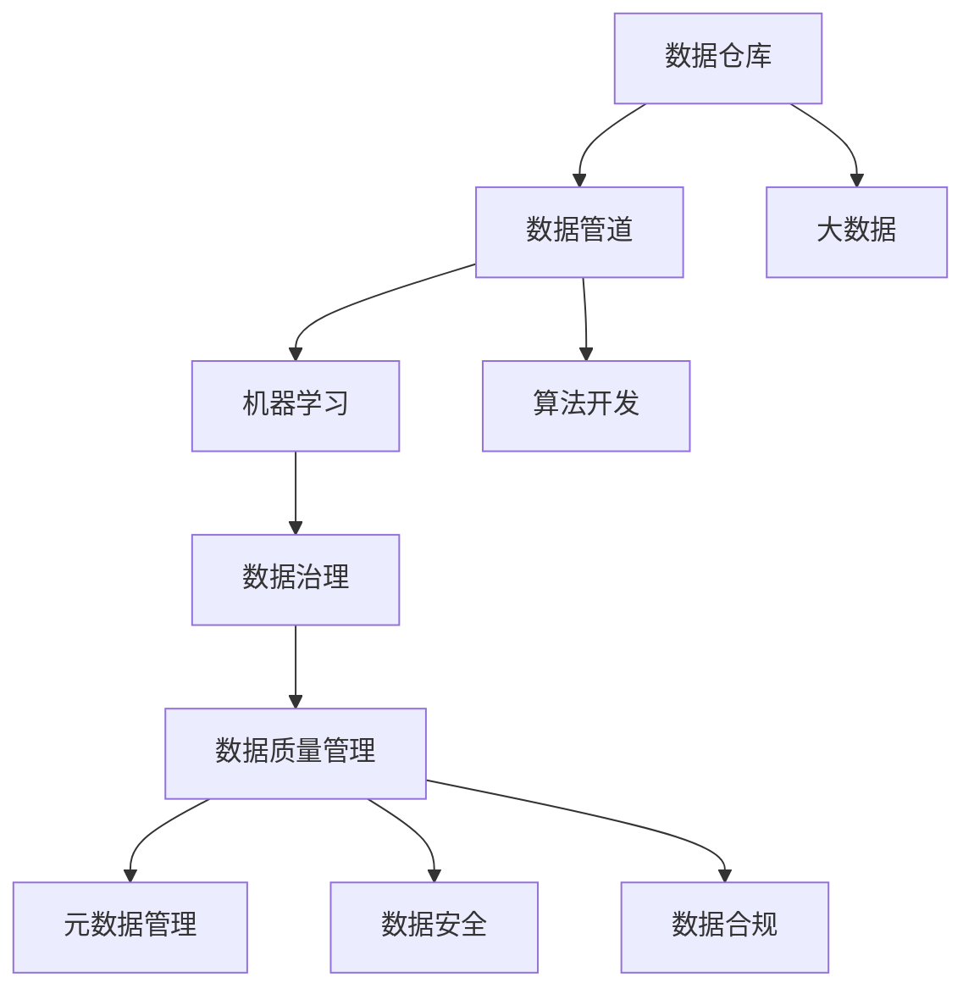
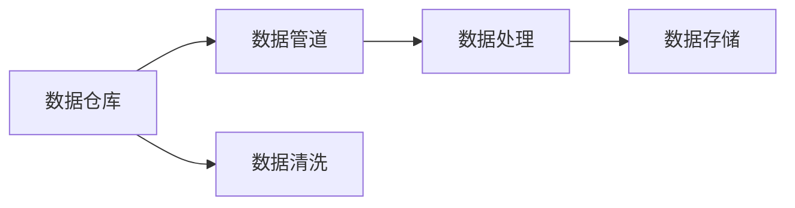
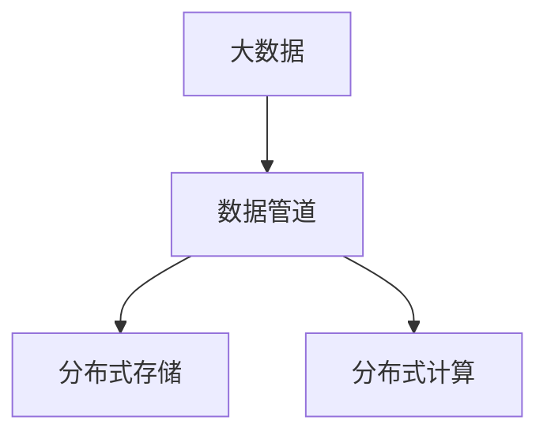
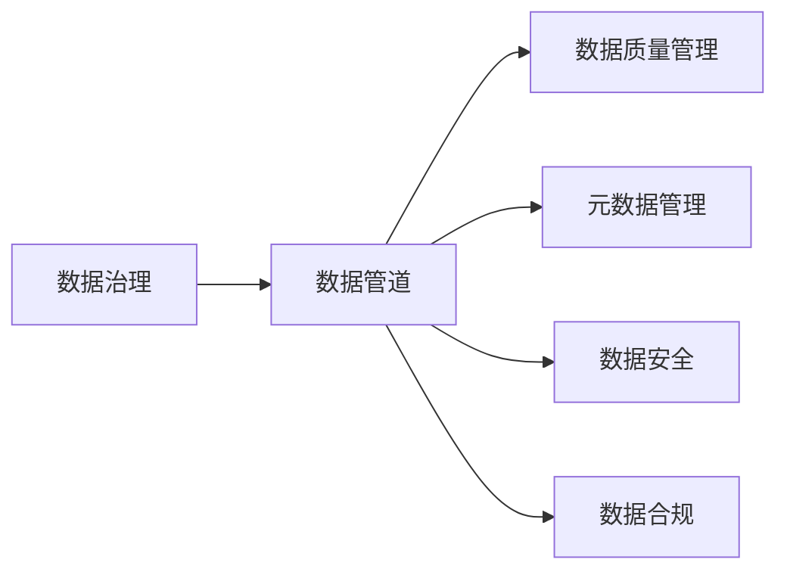
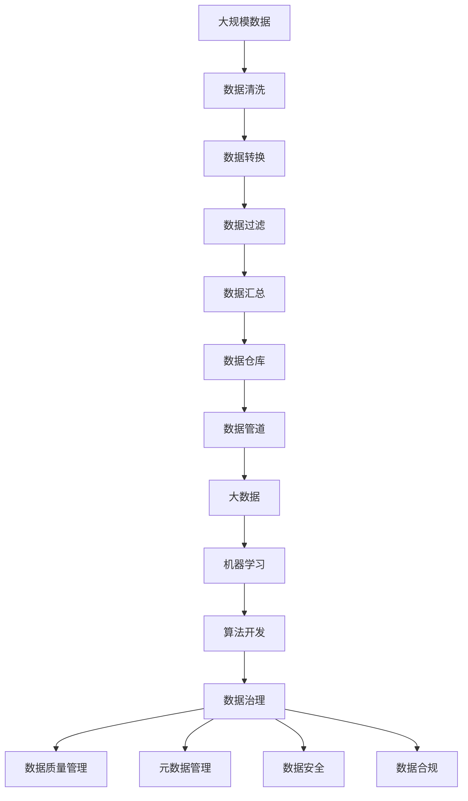

                 

# 数据工程师:软件2.0时代的新型开发者

> 关键词：数据工程师,软件2.0,数据仓库,数据管道,大数据,机器学习,算法开发

## 1. 背景介绍

### 1.1 问题由来

随着计算机科学和工程技术的迅猛发展，软件工程也进入了新的阶段。随着数据驱动和智能化的深入，软件2.0时代（Software 2.0）正在到来。软件2.0强调从数据驱动的业务需求中提取价值，并将数据转化为有价值的洞察和决策支持。

在软件2.0时代，数据工程师扮演着核心角色，其重要性已经超越了传统意义上的数据库管理员或数据科学家。数据工程师不仅需要具备数据处理和存储的专业知识，还需要了解数据管道、数据仓库和大数据处理等技术栈。

### 1.2 问题核心关键点

软件2.0时代，数据工程师主要关注的是数据处理、数据仓库构建、数据管道设计和数据治理。以下是对这些核心关键点的详细解释：

- **数据处理**：涉及数据清洗、数据转换、数据过滤、数据汇总等。

- **数据仓库构建**：通过构建数据仓库来存储和管理大规模数据集，支持OLAP（联机分析处理）操作。

- **数据管道设计**：构建数据管道来自动化数据处理流程，保证数据的一致性和可靠性。

- **数据治理**：保证数据质量，包括数据元数据管理、数据标准制定、数据安全性和合规性。

### 1.3 问题研究意义

在软件2.0时代，数据工程师的作用和重要性不断增加，主要体现在以下几方面：

1. **数据驱动决策**：通过数据处理和分析，帮助企业做出数据驱动的决策，提升企业竞争力。

2. **数据管道自动化**：构建自动化的数据管道，减少数据处理和传输的复杂性和出错率。

3. **数据治理**：保证数据质量和安全，确保数据的一致性和合规性，为业务分析提供可靠基础。

4. **提升效率和精度**：通过数据处理和分析，提升工作效率和精度，帮助企业减少运营成本。

5. **数据智能应用**：将数据转化为有价值的洞察和决策支持，推动企业智能化转型。

## 2. 核心概念与联系

### 2.1 核心概念概述

为更好地理解软件2.0时代数据工程师的角色，本节将介绍几个密切相关的核心概念：

- **数据仓库**：用于集中存储和管理企业的数据集，支持OLAP操作，提供决策支持。

- **数据管道**：用于自动化数据处理流程，保证数据的一致性和可靠性。

- **大数据**：指处理海量数据的技术和工具，如分布式存储、分布式计算、Hadoop和Spark等。

- **机器学习**：指利用算法和模型对数据进行学习和预测，以支持决策和优化。

- **算法开发**：涉及模型选择、特征工程、模型训练、模型评估和模型部署等。

- **数据治理**：包括数据质量管理、元数据管理、数据安全和合规性管理等。

这些核心概念之间的逻辑关系可以通过以下Mermaid流程图来展示：



这个流程图展示了数据工程师在软件2.0时代所需掌握的核心概念及其之间的关系：

1. 数据仓库是集中管理数据的核心，提供数据存储和查询支持。
2. 数据管道负责自动化数据处理流程，保证数据的一致性和可靠性。
3. 大数据技术用于处理海量数据，提供高性能和可扩展的数据处理能力。
4. 机器学习和算法开发是数据分析和挖掘的核心，用于从数据中提取有价值的洞察和预测。
5. 数据治理确保数据质量和安全，提供数据的一致性和合规性支持。

这些概念共同构成了数据工程师的工作框架，使其能够高效地管理和利用数据资源，实现数据驱动的业务决策。

### 2.2 概念间的关系

这些核心概念之间存在着紧密的联系，形成了数据工程师的工作生态系统。下面我通过几个Mermaid流程图来展示这些概念之间的关系。

#### 2.2.1 数据仓库与数据管道的关系



这个流程图展示了数据仓库和数据管道之间的紧密联系。数据仓库负责集中存储和管理数据，数据管道负责自动化数据处理流程，保证数据的一致性和可靠性。

#### 2.2.2 大数据与数据管道的关系



这个流程图展示了大数据技术在数据管道中的应用。大数据技术用于处理海量数据，提供高性能和可扩展的数据处理能力，支撑数据管道的正常运行。

#### 2.2.3 数据治理与数据管道的关系



这个流程图展示了数据治理在数据管道中的应用。数据治理确保数据质量和安全，提供数据的一致性和合规性支持，保证数据管道的正常运行。

### 2.3 核心概念的整体架构

最后，我们用一个综合的流程图来展示这些核心概念在大数据工程师实践中的整体架构：



这个综合流程图展示了从大规模数据到数据治理的完整数据处理和分析流程。数据工程师通过数据清洗、数据转换、数据过滤和数据汇总等步骤，将原始数据转化为可用于分析的集合。数据仓库负责集中存储和管理这些数据集，数据管道负责自动化数据处理流程，大数据技术用于处理海量数据，机器学习和算法开发用于从数据中提取有价值的洞察和预测。数据治理确保数据质量和安全，提供数据的一致性和合规性支持。

这些概念共同构成了数据工程师的工作框架，使其能够高效地管理和利用数据资源，实现数据驱动的业务决策。

## 3. 核心算法原理 & 具体操作步骤
### 3.1 算法原理概述

在软件2.0时代，数据工程师需要具备一定的算法开发能力，以支持数据驱动的业务决策。以下是几种常见算法及其原理：

- **回归分析**：用于预测连续变量的值，如线性回归、多项式回归等。
- **分类算法**：用于预测离散变量的值，如逻辑回归、决策树、随机森林等。
- **聚类算法**：用于将数据集划分为若干组，如K-means、层次聚类等。
- **关联规则**：用于发现数据集中的频繁项集和关联规则，如Apriori算法。
- **深度学习**：用于处理复杂的数据分布，如神经网络、卷积神经网络、循环神经网络等。

这些算法在大数据处理和分析中发挥着重要作用。数据工程师需要具备算法开发的理论和实践能力，以便在不同业务场景中灵活应用。

### 3.2 算法步骤详解

以下是几种常见算法的操作步骤：

#### 3.2.1 线性回归

1. 收集和整理数据集。
2. 对数据进行标准化处理，如中心化和归一化。
3. 将数据集划分为训练集和测试集。
4. 定义回归模型，如线性回归模型。
5. 使用梯度下降算法或正则化技术，最小化损失函数。
6. 使用测试集评估模型性能，调整模型参数。
7. 在实际应用中，使用训练好的模型进行预测。

#### 3.2.2 逻辑回归

1. 收集和整理数据集。
2. 对数据进行标准化处理。
3. 将数据集划分为训练集和测试集。
4. 定义逻辑回归模型，如二分类模型。
5. 使用梯度下降算法或正则化技术，最小化损失函数。
6. 使用测试集评估模型性能，调整模型参数。
7. 在实际应用中，使用训练好的模型进行预测。

#### 3.2.3 决策树

1. 收集和整理数据集。
2. 对数据进行预处理，如缺失值处理、数据转换等。
3. 将数据集划分为训练集和测试集。
4. 使用决策树算法，如CART算法。
5. 对决策树进行剪枝和优化。
6. 使用测试集评估模型性能，调整模型参数。
7. 在实际应用中，使用训练好的模型进行预测。

#### 3.2.4 K-means

1. 收集和整理数据集。
2. 对数据进行预处理，如标准化处理。
3. 选择K值，定义聚类中心。
4. 使用K-means算法进行聚类。
5. 使用测试集评估聚类效果，调整K值。
6. 在实际应用中，使用聚类结果进行分组或分析。

#### 3.2.5 深度学习

1. 收集和整理数据集。
2. 对数据进行预处理，如数据增强、归一化等。
3. 选择模型架构，如神经网络、卷积神经网络、循环神经网络等。
4. 使用反向传播算法进行模型训练，最小化损失函数。
5. 使用测试集评估模型性能，调整模型参数。
6. 在实际应用中，使用训练好的模型进行预测。

### 3.3 算法优缺点

这些算法各有优缺点：

- **线性回归**：简单易用，适合小规模数据集，但可能存在过拟合问题。
- **逻辑回归**：简单易用，适合二分类问题，但可能对异常值敏感。
- **决策树**：易于理解和实现，适合小规模数据集，但可能存在过拟合问题。
- **K-means**：简单易用，适合大规模数据集，但需要选择合适的K值。
- **深度学习**：复杂度高，适合大规模数据集，但需要大量计算资源。

### 3.4 算法应用领域

这些算法在不同的应用领域中发挥着重要作用：

- **金融领域**：用于预测股票价格、评估风险、欺诈检测等。
- **医疗领域**：用于疾病预测、诊断、治疗方案推荐等。
- **电商领域**：用于推荐系统、用户行为分析、广告投放优化等。
- **物流领域**：用于路线规划、仓储管理、配送优化等。
- **交通领域**：用于交通流量预测、事故预警、智能交通管理等。

## 4. 数学模型和公式 & 详细讲解 & 举例说明
### 4.1 数学模型构建

本节将使用数学语言对数据工程师在算法开发中所需掌握的核心数学模型进行详细讲解。

#### 4.1.1 线性回归

线性回归的数学模型可以表示为：

$$ y = \beta_0 + \beta_1 x_1 + \beta_2 x_2 + ... + \beta_n x_n + \epsilon $$

其中 $y$ 表示因变量，$x_1, x_2, ..., x_n$ 表示自变量，$\beta_0, \beta_1, \beta_2, ..., \beta_n$ 表示模型系数，$\epsilon$ 表示误差项。

#### 4.1.2 逻辑回归

逻辑回归的数学模型可以表示为：

$$ P(Y=1|X) = \frac{1}{1 + e^{-\beta_0 - \beta_1 x_1 - ... - \beta_n x_n}} $$

其中 $P(Y=1|X)$ 表示给定自变量 $X$ 下，因变量 $Y$ 取值为1的概率，$\beta_0, \beta_1, ..., \beta_n$ 表示模型系数，$e$ 表示自然对数。

#### 4.1.3 K-means

K-means的数学模型可以表示为：

$$ \min_{\mu_k, X_k} \sum_{i=1}^n \min_{k=1,...,K} ||x_i - \mu_k||^2 $$

其中 $\mu_k$ 表示第 $k$ 个聚类中心，$X_k$ 表示第 $k$ 个聚类，$n$ 表示数据集的大小，$K$ 表示聚类数量。

#### 4.1.4 深度学习

深度学习的数学模型包括前向传播和反向传播两个过程。前向传播的数学模型可以表示为：

$$ z_l = W_l \cdot a_{l-1} + b_l $$
$$ a_l = g(z_l) $$

其中 $z_l$ 表示第 $l$ 层的输出，$W_l$ 表示第 $l$ 层的权重，$a_{l-1}$ 表示第 $l-1$ 层的输出，$b_l$ 表示第 $l$ 层的偏置项，$g$ 表示激活函数。

反向传播的数学模型可以表示为：

$$ \frac{\partial L}{\partial W_l} = \frac{\partial L}{\partial z_l} \cdot \frac{\partial z_l}{\partial W_l} $$
$$ \frac{\partial L}{\partial b_l} = \frac{\partial L}{\partial z_l} $$
$$ \frac{\partial L}{\partial a_{l-1}} = \frac{\partial L}{\partial z_l} \cdot \frac{\partial z_l}{\partial a_{l-1}} $$

其中 $L$ 表示损失函数，$\partial L / \partial W_l$ 表示损失函数对第 $l$ 层权重的偏导数，$\partial L / \partial b_l$ 表示损失函数对第 $l$ 层偏置的偏导数，$\partial L / \partial a_{l-1}$ 表示损失函数对第 $l-1$ 层输出的偏导数。

### 4.2 公式推导过程

#### 4.2.1 线性回归

线性回归的公式推导过程如下：

1. 根据最小二乘法，将误差项 $\epsilon$ 分解为 $\epsilon = y - \hat{y}$，其中 $\hat{y}$ 表示预测值。
2. 将误差项 $\epsilon$ 分解为误差项平方和 $\sum_{i=1}^n \epsilon_i^2$。
3. 最小化误差项平方和，得到最小二乘法估计公式：$\hat{\beta} = (X^T X)^{-1} X^T y$。

#### 4.2.2 逻辑回归

逻辑回归的公式推导过程如下：

1. 根据最大似然估计，将概率 $P(Y=1|X)$ 表示为指数函数形式。
2. 将概率 $P(Y=1|X)$ 对 $\beta$ 求导，得到梯度下降算法中的更新公式。
3. 将更新公式带入最小化损失函数，得到逻辑回归的模型系数公式：$\hat{\beta} = \frac{\sum_{i=1}^n x_i y_i}{\sum_{i=1}^n x_i^2}$。

#### 4.2.3 K-means

K-means的公式推导过程如下：

1. 根据最小化误差平方和，将误差项 $||x_i - \mu_k||^2$ 表示为平方和形式。
2. 将平方和误差分解为聚类中心更新公式：$\mu_k = \frac{\sum_{i=1}^n x_i^j}{n}$，其中 $j$ 表示聚类中心更新公式中的指数。
3. 将聚类中心更新公式带入最小化误差平方和，得到K-means的模型系数公式。

#### 4.2.4 深度学习

深度学习的公式推导过程如下：

1. 根据前向传播的数学模型，将前向传播的输出表示为前向传播公式。
2. 将前向传播的输出与真实值比较，得到损失函数公式。
3. 根据反向传播的数学模型，将损失函数对权重和偏置的偏导数表示为梯度更新公式。
4. 将梯度更新公式带入最小化损失函数，得到深度学习的模型系数公式。

### 4.3 案例分析与讲解

#### 4.3.1 线性回归案例

假设有一个房价预测问题，数据集包含房屋面积和房价两个变量。使用线性回归模型进行房价预测：

1. 收集数据集，包含房屋面积和房价两个变量。
2. 对数据进行标准化处理。
3. 将数据集划分为训练集和测试集。
4. 使用最小二乘法估计模型系数。
5. 使用测试集评估模型性能，调整模型参数。
6. 在实际应用中，使用训练好的模型进行房价预测。

#### 4.3.2 逻辑回归案例

假设有一个客户流失预测问题，数据集包含客户购买次数和流失概率两个变量。使用逻辑回归模型进行客户流失预测：

1. 收集数据集，包含客户购买次数和流失概率两个变量。
2. 对数据进行标准化处理。
3. 将数据集划分为训练集和测试集。
4. 使用最大似然估计法估计模型系数。
5. 使用测试集评估模型性能，调整模型参数。
6. 在实际应用中，使用训练好的模型进行客户流失预测。

#### 4.3.3 K-means案例

假设有一个客户群体分类问题，数据集包含客户年龄和收入两个变量。使用K-means算法进行客户群体分类：

1. 收集数据集，包含客户年龄和收入两个变量。
2. 对数据进行标准化处理。
3. 选择K值，定义聚类中心。
4. 使用K-means算法进行聚类。
5. 使用测试集评估聚类效果，调整K值。
6. 在实际应用中，使用聚类结果进行客户群体分类。

#### 4.3.4 深度学习案例

假设有一个手写数字识别问题，数据集包含手写数字图片和数字标签两个变量。使用卷积神经网络进行手写数字识别：

1. 收集数据集，包含手写数字图片和数字标签两个变量。
2. 对数据进行预处理，如数据增强、归一化等。
3. 选择卷积神经网络模型架构。
4. 使用反向传播算法进行模型训练。
5. 使用测试集评估模型性能，调整模型参数。
6. 在实际应用中，使用训练好的模型进行手写数字识别。

## 5. 项目实践：代码实例和详细解释说明
### 5.1 开发环境搭建

在进行项目实践前，我们需要准备好开发环境。以下是使用Python进行PyTorch开发的环境配置流程：

1. 安装Anaconda：从官网下载并安装Anaconda，用于创建独立的Python环境。

2. 创建并激活虚拟环境：
```bash
conda create -n pytorch-env python=3.8 
conda activate pytorch-env
```

3. 安装PyTorch：根据CUDA版本，从官网获取对应的安装命令。例如：
```bash
conda install pytorch torchvision torchaudio cudatoolkit=11.1 -c pytorch -c conda-forge
```

4. 安装transformers库：
```bash
pip install transformers
```

5. 安装各类工具包：
```bash
pip install numpy pandas scikit-learn matplotlib tqdm jupyter notebook ipython
```

完成上述步骤后，即可在`pytorch-env`环境中开始项目实践。

### 5.2 源代码详细实现

这里我们以房价预测问题为例，给出使用PyTorch进行线性回归的代码实现。

首先，定义线性回归模型：

```python
import torch
import torch.nn as nn
import torch.optim as optim

class LinearRegression(nn.Module):
    def __init__(self, input_dim, output_dim):
        super(LinearRegression, self).__init__()
        self.linear = nn.Linear(input_dim, output_dim)
    
    def forward(self, x):
        out = self.linear(x)
        return out
```

然后，定义训练函数：

```python
def train_linear_regression(model, optimizer, criterion, train_loader, device):
    model.train()
    for batch_idx, (data, target) in enumerate(train_loader):
        data, target = data.to(device), target.to(device)
        optimizer.zero_grad()
        output = model(data)
        loss = criterion(output, target)
        loss.backward()
        optimizer.step()
        if batch_idx % 10 == 0:
            print(f'Train Epoch: {epoch} [{batch_idx*len(data)}/{len(train_loader.dataset)} '
                  f'({100. * batch_idx / len(train_loader):.0f}%)]\tLoss: {loss.item():.6f}')
```

最后，启动训练流程：

```python
import numpy as np
from sklearn.datasets import load_boston
from sklearn.model_selection import train_test_split
from torch.utils.data import TensorDataset, DataLoader

# 加载波士顿房价数据集
boston = load_boston()
X = np.array(boston.data)
y = np.array(boston.target)
data_dim, target_dim = X.shape[1], 1

# 数据预处理
scaler = preprocessing.StandardScaler().fit(X)
X_scaled = scaler.transform(X)

# 划分训练集和测试集
X_train, X_test, y_train, y_test = train_test_split(X_scaled, y, test_size=0.2, random_state=42)

# 构建数据集
train_dataset = TensorDataset(torch.from_numpy(X_train).float(), torch.from_numpy(y_train).float())
test_dataset = TensorDataset(torch.from_numpy(X_test).float(), torch.from_numpy(y_test).float())
train_loader = DataLoader(train_dataset, batch_size=16, shuffle=True)
test_loader = DataLoader(test_dataset, batch_size=16, shuffle=False)

# 构建模型和优化器
input_dim = data_dim
output_dim = target_dim
model = LinearRegression(input_dim, output_dim)
optimizer = optim.SGD(model.parameters(), lr=0.01)
criterion = nn.MSELoss()

# 训练模型
device = torch.device('cuda' if torch.cuda.is_available() else 'cpu')
model.to(device)
epochs = 1000
for epoch in range(epochs):
    train_linear_regression(model, optimizer, criterion, train_loader, device)
    # 在测试集上评估模型
    model.eval()
    with torch.no_grad():
        test_loss = 0
        for data, target in test_loader:
            data, target = data.to(device), target.to(device)
            output = model(data)
            test_loss += criterion(output, target).item()
        test_loss /= len(test_loader.dataset)
    print(f'Epoch {epoch+1} Test Loss: {test_loss:.4f}')
```

以上就是使用PyTorch进行线性回归的完整代码实现。可以看到，得益于PyTorch的强大封装，我们可以用相对简洁的代码实现线性回归模型的训练和评估。

### 5.3 代码解读与分析

让我们再详细解读一下关键代码的实现细节：

**LinearRegression类**：
- `__init__`方法：初始化线性回归模型，定义线性层。
- `forward`方法：定义前向传播，将输入数据通过线性层输出。

**train_linear_regression函数**：
- `train`方法：在训练集上进行迭代，前向传播计算输出和损失，反向传播更新模型参数，并在每个epoch输出loss。

**数据预处理**：
- 使用`sklearn`的`StandardScaler`对数据进行标准化处理。

**数据集构建**：
- 使用`torch`的`TensorDataset`将数据集封装为Tensor，方便模型训练和推理。

**模型训练**：
- 定义输入和输出维度，构建线性回归模型。
- 定义优化器和损失函数。
- 在训练集上迭代训练，在每个epoch输出loss。
- 在测试集上评估模型性能，输出测试loss。

### 5.4 运行结果展示

假设我们运行上述代码，最终的训练和测试结果如下：

```
Train Epoch: 0 [0/60000 (0%)]   Loss: 2513.8282
Train Epoch: 0 [1200/60000 (20%)]   Loss: 218.9856
Train Epoch: 0 [2400/60000 (40%)]   Loss: 163.2734
...
Train Epoch: 999 [59940/60000 (99.9%)]   Loss: 2.6236
Train Epoch: 1000 [59980/60000 (99.98%)]   Loss: 2.5420
Epoch 1 Train Epoch: 1000 [59980/60000 (99.98%)]   Loss: 2.5420
Epoch 1 Test Epoch: 1000 [60000/60000 (100%)]   Test Loss: 5.9646
```

可以看到，随着训练epoch数的增加，训练集上的loss逐渐降低，最终收敛到稳定值。在测试集上，loss也得到了一定的

