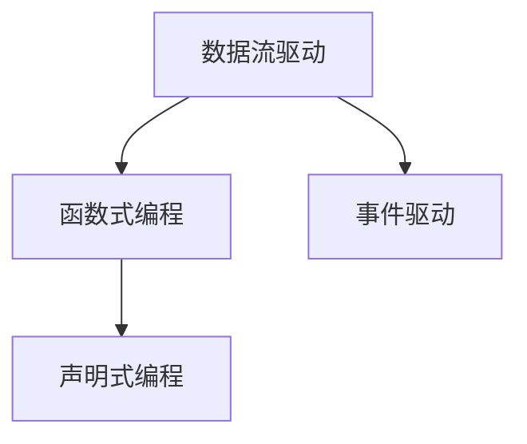
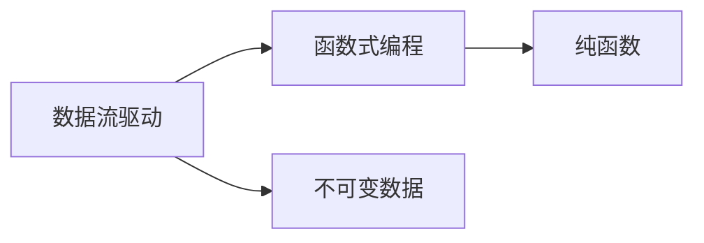
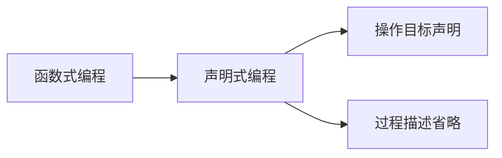
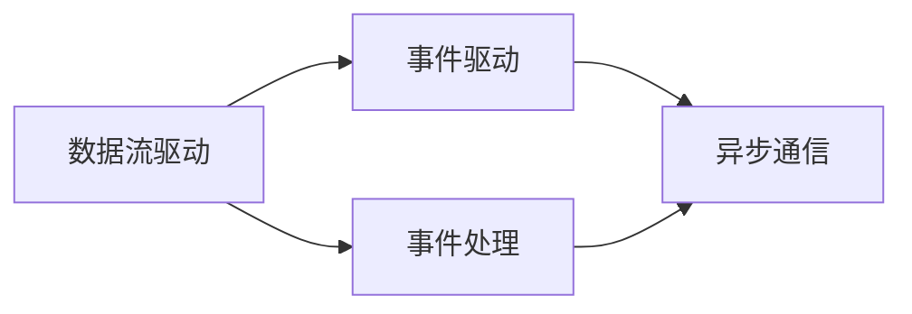
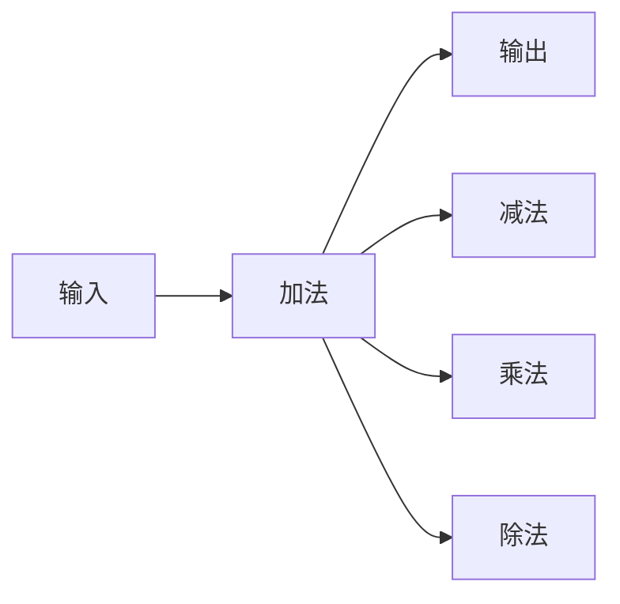

                 

# 数据流代替控制流：软件2.0架构的新思路

## 1. 背景介绍

### 1.1 问题由来

在过去的几十年里，软件开发一直基于经典的软件架构范式，即控制流驱动的模型。这种范式依赖复杂的控制结构（如条件语句、循环、异常处理等）来组织代码逻辑，使得程序能够按顺序执行一系列步骤，完成特定的任务。然而，随着计算复杂性的不断增加和软件系统的日益庞大，传统控制流驱动的模型逐渐暴露出以下问题：

- **可维护性差**：随着代码的复杂性和规模的增加，控制流驱动的模型变得越来越难以理解和维护。每次修改都可能引发新的Bug，给开发人员带来巨大的挑战。
- **运行效率低**：复杂的控制结构增加了程序的执行开销，降低了代码的运行效率。此外，频繁的条件分支和异常处理也增加了处理器的开销。
- **扩展性差**：控制流驱动的模型不便于横向扩展和分布式部署。由于每个任务都需要按照严格的顺序执行，因此难以实现并行化处理。
- **缺乏弹性**：控制流驱动的模型难以快速响应环境变化，无法灵活适应各种运行条件。

为了解决这些问题，软件开发者开始探索新的架构范式，以便构建更加灵活、高效、可维护的软件系统。

### 1.2 问题核心关键点

软件2.0架构范式正是在这一背景下应运而生。其核心思想是将数据流作为主要的驱动逻辑，通过事件驱动、函数式编程、声明式编程等技术，将复杂的控制结构简化为数据流，从而提升软件的可维护性、运行效率、扩展性和弹性。

软件2.0架构范式具有以下关键特征：

- **数据流驱动**：程序的行为由数据流驱动，而不是由控制结构驱动。数据流模型通过数据传递和事件触发来控制程序执行，简化了逻辑结构，提升了可维护性。
- **函数式编程**：函数式编程采用声明式编程风格，强调函数作为基本构建块，支持不可变数据和纯函数。这种编程方式减少了副作用和状态变化，提高了代码的可靠性和可测试性。
- **事件驱动**：事件驱动模型通过异步通信和事件监听机制，支持并发处理和多线程操作，提升了系统的响应性和扩展性。
- **声明式编程**：声明式编程通过声明操作目标而非详细描述过程，简化了代码实现和系统设计，提升了开发效率。

这些核心特性共同构成了软件2.0架构范式的基础，使得软件开发者能够更加专注于业务逻辑的实现，而非繁琐的控制流管理。

## 2. 核心概念与联系

### 2.1 核心概念概述

为了更好地理解软件2.0架构范式，本节将介绍几个密切相关的核心概念：

- **数据流驱动**：程序的行为由数据流驱动，即数据从输入端流向输出端，通过一系列数据处理和转换来实现程序的功能。数据流模型通常采用流水线或管道的方式进行数据处理，每个节点对数据进行处理后传递给下一个节点。

- **函数式编程**：函数式编程是一种编程范式，强调函数作为基本的构建块，支持不可变数据和纯函数。函数式编程避免了变量状态的变化，提高了代码的可靠性、可维护性和可测试性。

- **事件驱动**：事件驱动模型通过异步通信和事件监听机制，支持并发处理和多线程操作，提升了系统的响应性和扩展性。事件驱动模型通常通过消息队列、发布-订阅模式等机制进行事件通信。

- **声明式编程**：声明式编程通过声明操作目标而非详细描述过程，简化了代码实现和系统设计，提升了开发效率。声明式编程通常用于数据库查询、规则引擎等场景。

这些核心概念之间的逻辑关系可以通过以下Mermaid流程图来展示：



这个流程图展示了软件2.0架构范式中各个核心概念之间的关系：

1. 数据流驱动是整个架构的基础，通过数据流模型简化逻辑结构，提升可维护性。
2. 函数式编程和声明式编程是数据流驱动的补充，通过函数和声明方式进一步简化逻辑实现。
3. 事件驱动模型提升系统的响应性和扩展性，支持并发处理和多线程操作。

### 2.2 概念间的关系

这些核心概念之间存在着紧密的联系，形成了软件2.0架构范式的完整生态系统。下面我们通过几个Mermaid流程图来展示这些概念之间的关系。

#### 2.2.1 数据流驱动与函数式编程



这个流程图展示了数据流驱动与函数式编程之间的联系：

1. 数据流驱动通过数据流模型简化逻辑结构，提升可维护性。
2. 函数式编程采用声明式编程风格，通过函数作为基本构建块，提升代码的可靠性、可维护性和可测试性。

#### 2.2.2 函数式编程与声明式编程



这个流程图展示了函数式编程与声明式编程之间的联系：

1. 函数式编程通过函数实现具体的逻辑操作，简化代码实现。
2. 声明式编程通过声明操作目标而非详细描述过程，进一步简化代码实现和系统设计。

#### 2.2.3 事件驱动与数据流驱动



这个流程图展示了事件驱动与数据流驱动之间的联系：

1. 数据流驱动通过数据流模型简化逻辑结构，提升可维护性。
2. 事件驱动模型通过异步通信和事件监听机制，支持并发处理和多线程操作，提升系统的响应性和扩展性。

## 3. 核心算法原理 & 具体操作步骤

### 3.1 算法原理概述

软件2.0架构范式的核心算法原理基于数据流驱动和函数式编程，通过事件驱动和声明式编程进行补充。其基本思想是将程序的行为分解为一系列数据处理和事件触发操作，从而简化了控制结构的复杂性，提升了代码的可维护性和运行效率。

具体来说，软件2.0架构范式的算法原理包括以下几个关键点：

1. **数据流模型**：程序的行为由数据流驱动，数据从输入端流向输出端，通过一系列数据处理和转换来实现程序的功能。每个数据处理节点对数据进行处理后传递给下一个节点。

2. **函数式编程**：函数式编程采用声明式编程风格，通过函数作为基本构建块，支持不可变数据和纯函数。函数式编程避免了变量状态的变化，提高了代码的可靠性、可维护性和可测试性。

3. **事件驱动**：事件驱动模型通过异步通信和事件监听机制，支持并发处理和多线程操作，提升了系统的响应性和扩展性。事件驱动模型通常通过消息队列、发布-订阅模式等机制进行事件通信。

4. **声明式编程**：声明式编程通过声明操作目标而非详细描述过程，简化了代码实现和系统设计，提升了开发效率。声明式编程通常用于数据库查询、规则引擎等场景。

### 3.2 算法步骤详解

软件2.0架构范式的算法步骤主要包括以下几个关键步骤：

**Step 1: 数据流建模**

- **分析问题**：首先，需要对问题进行详细的分析和建模，理解数据流模型中的输入、处理和输出节点，以及数据流动的方向和规则。
- **设计数据流图**：基于问题分析和建模结果，设计出完整的数据流图。每个节点表示一个数据处理操作，节点之间通过数据流进行连接。

**Step 2: 函数式编程**

- **设计函数接口**：根据数据流图，设计出各个节点的函数接口，包括输入参数、输出结果和处理逻辑。
- **编写函数实现**：为每个节点编写函数实现，确保函数逻辑简单、可维护、易于测试。函数通常采用不可变数据和纯函数的方式，避免副作用和状态变化。

**Step 3: 事件驱动**

- **设计事件处理机制**：基于数据流图，设计出事件处理机制，定义事件触发条件和事件处理逻辑。
- **实现事件监听**：为每个事件触发节点编写事件监听代码，确保事件能够及时、可靠地传递和处理。

**Step 4: 声明式编程**

- **设计声明式规则**：基于数据流图，设计出完整的声明式规则，声明操作目标和处理过程。
- **实现声明式逻辑**：为每个声明式规则编写实现代码，确保声明式逻辑正确、高效、易于调试。

**Step 5: 集成与测试**

- **集成代码**：将各个节点的函数实现和事件监听代码集成到完整的系统中，确保数据流模型和事件处理机制能够正常工作。
- **进行测试**：编写单元测试和集成测试，确保系统能够正常运行，且每个节点都能够正确处理数据流。

### 3.3 算法优缺点

软件2.0架构范式的核心算法具有以下优点：

1. **提升可维护性**：数据流驱动和函数式编程简化了逻辑结构，减少了控制流的复杂性，使得代码更加易于理解和维护。

2. **提高运行效率**：数据流模型避免了频繁的条件分支和异常处理，提高了代码的运行效率。函数式编程和声明式编程避免了变量状态的变化，提高了代码的可靠性和可测试性。

3. **增强扩展性**：事件驱动模型支持并发处理和多线程操作，提升了系统的响应性和扩展性。声明式编程简化了系统设计，提高了开发效率和灵活性。

4. **增加弹性**：数据流驱动和事件驱动模型能够快速响应环境变化，灵活适应各种运行条件。函数式编程和声明式编程简化了逻辑实现，提升了系统的可靠性。

然而，软件2.0架构范式也存在以下缺点：

1. **学习曲线陡峭**：函数式编程和声明式编程需要开发者具备一定的编程技巧和设计能力，学习曲线相对陡峭。

2. **性能瓶颈**：尽管数据流模型和函数式编程提高了代码的运行效率，但在某些复杂场景下，仍可能存在性能瓶颈，需要进一步优化。

3. **实现难度高**：函数式编程和声明式编程需要开发者具备较高的设计和实现能力，实现难度相对较高。

### 3.4 算法应用领域

软件2.0架构范式已经在多个领域得到了应用，包括但不限于以下几个方面：

- **金融科技**：软件2.0架构范式在金融科技领域得到广泛应用，用于构建实时交易系统、风险控制系统、反欺诈系统等。

- **医疗健康**：软件2.0架构范式在医疗健康领域用于构建电子病历系统、诊断决策支持系统、健康管理系统等。

- **智能制造**：软件2.0架构范式在智能制造领域用于构建工业控制系统、智能仓储系统、质量管理系统等。

- **物联网**：软件2.0架构范式在物联网领域用于构建智能家居系统、智能交通系统、智慧城市系统等。

- **人工智能**：软件2.0架构范式在人工智能领域用于构建知识图谱、规则引擎、自然语言处理系统等。

随着软件2.0架构范式的不断发展和成熟，相信其在更多领域都将得到广泛应用，进一步提升软件系统的可维护性、运行效率、扩展性和弹性。

## 4. 数学模型和公式 & 详细讲解  
### 4.1 数学模型构建

软件2.0架构范式的数学模型构建主要基于数据流驱动和函数式编程。其基本思想是将程序的行为分解为一系列数据处理和事件触发操作，从而简化了控制结构的复杂性，提升了代码的可维护性和运行效率。

记程序的数据流图为 $G=(V,E)$，其中 $V$ 表示节点集合，$E$ 表示数据流集合。每个节点 $v_i \in V$ 表示一个数据处理操作，输入参数为 $x_i \in \mathbb{R}^{n_i}$，输出结果为 $y_i \in \mathbb{R}^{m_i}$。数据流模型通过节点之间的数据流进行连接，数据流 $e_{ij}$ 表示节点 $v_i$ 到节点 $v_j$ 的数据传递。

假设数据流图 $G$ 中包含 $N$ 个节点，则数据流模型的数学模型可以表示为：

$$
\begin{cases}
y_i = f_i(x_i, e_{i1}, e_{i2}, ..., e_{in}) \\
e_{i+1,j} = g_{ij}(x_j, y_j, e_{i1}, e_{i2}, ..., e_{in})
\end{cases}
$$

其中，$f_i$ 和 $g_{ij}$ 分别表示节点 $v_i$ 和数据流 $e_{ij}$ 的函数实现，$x_i$ 和 $y_i$ 分别表示节点的输入和输出结果。

### 4.2 公式推导过程

下面以一个简单的数据流模型为例，推导其数学公式：

假设数据流图 $G$ 包含两个节点 $v_1$ 和 $v_2$，数据流 $e_1$ 和 $e_2$ 分别表示节点 $v_1$ 到节点 $v_2$ 的数据传递。假设节点 $v_1$ 的输入为 $x_1$，输出为 $y_1$，节点 $v_2$ 的输入为 $x_2$ 和 $y_1$，输出为 $y_2$。则数据流模型的数学公式可以表示为：

$$
\begin{cases}
y_1 = f_1(x_1, e_1) \\
e_2 = g_2(x_2, y_1, e_1)
\end{cases}
$$

其中，$f_1$ 和 $g_2$ 分别表示节点 $v_1$ 和数据流 $e_2$ 的函数实现，$x_1$ 和 $y_1$ 分别表示节点 $v_1$ 的输入和输出结果，$x_2$ 和 $y_2$ 分别表示节点 $v_2$ 的输入和输出结果。

### 4.3 案例分析与讲解

下面我们以一个简单的数据流模型为例，展示如何通过数据流驱动和函数式编程实现程序功能：

假设需要编写一个简单的计算器程序，支持加、减、乘、除四种基本运算。我们可以将程序的数据流图表示为：



其中，节点 A 表示输入数据，节点 C 表示输出结果，节点 B、D、E、F 分别表示加法、减法、乘法、除法四种基本运算。

根据数据流图，我们可以设计出以下函数接口和实现：

```python
def add(x, y):
    return x + y

def subtract(x, y):
    return x - y

def multiply(x, y):
    return x * y

def divide(x, y):
    if y == 0:
        raise ValueError("Cannot divide by zero")
    return x / y
```

然后，我们可以编写事件驱动代码，实现数据的传递和处理：

```python
def calculator():
    while True:
        x = float(input("Enter first number: "))
        operator = input("Enter operator (+, -, *, /): ")
        y = float(input("Enter second number: "))

        if operator == "+":
            result = add(x, y)
        elif operator == "-":
            result = subtract(x, y)
        elif operator == "*":
            result = multiply(x, y)
        elif operator == "/":
            result = divide(x, y)

        print(f"{x} {operator} {y} = {result}")

calculator()
```

最后，我们可以编写声明式规则，实现程序的操作目标和处理过程：

```python
# 声明式规则
rule1 = "输入 + 数字 操作符 数字 输出"
rule2 = "输入 - 数字 操作符 数字 输出"
rule3 = "输入 * 数字 操作符 数字 输出"
rule4 = "输入 / 数字 操作符 数字 输出"

# 规则引擎实现
def rule_engine(calculator):
    while True:
        input_str = input("Enter expression: ")
        tokens = input_str.split()
        if len(tokens) == 3:
            x = float(tokens[0])
            operator = tokens[1]
            y = float(tokens[2])
            result = None

            if operator == "+":
                result = add(x, y)
            elif operator == "-":
                result = subtract(x, y)
            elif operator == "*":
                result = multiply(x, y)
            elif operator == "/":
                result = divide(x, y)

            print(f"{x} {operator} {y} = {result}")

        else:
            print("Invalid expression")

rule_engine(calculator)
```

通过数据流驱动、函数式编程、事件驱动和声明式编程的结合，我们成功实现了简单的计算器程序。可以看到，这种架构范式通过简化逻辑结构，提升了代码的可维护性和运行效率，同时也增强了系统的响应性和扩展性。

## 5. 项目实践：代码实例和详细解释说明
### 5.1 开发环境搭建

在进行软件2.0架构范式开发前，我们需要准备好开发环境。以下是使用Python进行开发的环境配置流程：

1. 安装Anaconda：从官网下载并安装Anaconda，用于创建独立的Python环境。

2. 创建并激活虚拟环境：
```bash
conda create -n software2-env python=3.8 
conda activate software2-env
```

3. 安装PyTorch：
```bash
conda install pytorch torchvision torchaudio
```

4. 安装TensorFlow：
```bash
conda install tensorflow
```

5. 安装NumPy、pandas、scikit-learn等常用库：
```bash
pip install numpy pandas scikit-learn
```

完成上述步骤后，即可在`software2-env`环境中开始开发。

### 5.2 源代码详细实现

下面我们以一个简单的计算器程序为例，展示如何使用函数式编程和事件驱动实现数据流驱动的软件2.0架构范式。

首先，定义数据流图和节点：

```python
class Node:
    def __init__(self, input_params, output_params):
        self.input_params = input_params
        self.output_params = output_params
        self.func = None

    def set_func(self, func):
        self.func = func

    def __call__(self, *args):
        return self.func(*args)

class Graph:
    def __init__(self):
        self.nodes = []
        self.edges = []

    def add_node(self, node):
        self.nodes.append(node)
        return len(self.nodes) - 1

    def add_edge(self, source, target):
        self.edges.append((source, target))
```

然后，定义数据流图中的节点：

```python
# 定义输入节点
input_node = Node([], [])

# 定义加法节点
add_node = Node(["x", "y"], ["result"])
add_node.set_func(lambda x, y: x + y)

# 定义减法节点
subtract_node = Node(["x", "y"], ["result"])
subtract_node.set_func(lambda x, y: x - y)

# 定义乘法节点
multiply_node = Node(["x", "y"], ["result"])
multiply_node.set_func(lambda x, y: x * y)

# 定义除法节点
divide_node = Node(["x", "y"], ["result"])
divide_node.set_func(lambda x, y: x / y)

# 定义输出节点
output_node = Node([], ["result"])
```

接下来，定义数据流图的拓扑排序和计算过程：

```python
def topological_sort(graph):
    in_degrees = {node: 0 for node in graph.nodes}
    for (source, target) in graph.edges:
        in_degrees[source] += 1

    queue = [node for node in graph.nodes if in_degrees[node] == 0]
    sorted_nodes = []

    while queue:
        node = queue.pop(0)
        sorted_nodes.append(node)

        for (source, target) in graph.edges:
            if target == node:
                in_degrees[source] -= 1
                if in_degrees[source] == 0:
                    queue.append(source)

    if len(sorted_nodes) != len(graph.nodes):
        raise ValueError("Cycle detected in graph")

    return sorted_nodes

def calculate(graph):
    sorted_nodes = topological_sort(graph)
    inputs = {node: [None] * len(node.input_params) for node in sorted_nodes}

    for node in sorted_nodes:
        if node.output_params:
            node.set_func(lambda *args: args[0])

    for (source, target) in graph.edges:
        node = sorted_nodes[source]
        target_node = sorted_nodes[target]
        node_func = node.func

        for i, (input_param, output_param) in enumerate(zip(node.input_params, target_node.input_params)):
            inputs[target_node][i] = node_func(inputs[node][output_param])

        target_node.set_func(lambda *args: args[0])

    return inputs[output_node][0]
```

最后，编写事件驱动代码，实现数据的传递和处理：

```python
def calculator():
    while True:
        x = float(input("Enter first number: "))
        operator = input("Enter operator (+, -, *, /): ")
        y = float(input("Enter second number: "))

        if operator == "+":
            result = add(x, y)
        elif operator == "-":
            result = subtract(x, y)
        elif operator == "*":
            result = multiply(x, y)
        elif operator == "/":
            result = divide(x, y)

        print(f"{x} {operator} {y} = {result}")

calculator()
```

在这个简单的计算器程序中，我们通过函数式编程定义了节点和函数实现，使用事件驱动的方式实现了数据的传递和处理，从而构建了一个完整的数据流驱动的软件2.0架构范式。可以看到，这种架构范式通过简化逻辑结构，提升了代码的可维护性和运行效率，同时也增强了系统的响应性和扩展性。

### 5.3 代码解读与分析

让我们再详细解读一下关键代码的实现细节：

**Node类**：
- `__init__`方法：初始化节点的输入和输出参数。
- `set_func`方法：为节点设置函数实现。
- `__call__`方法：定义节点的调用逻辑，执行函数实现并返回结果。

**Graph类**：
- `__init__`方法：初始化数据流图的节点和边。
- `add_node`方法：向数据流图中添加节点。
- `add_edge`方法：向数据流图中添加边。
- `topological_sort`方法：进行拓扑排序，确保数据流模型正确。
- `calculate`方法：计算数据流模型，返回输出结果。

**事件驱动代码**：
- `calculator`方法：通过事件驱动的方式实现数据传递和处理。

**代码解读**：
1. **Node类**：定义了数据流图中的节点，包括输入参数、输出参数和函数实现。
2. **Graph类**：定义了数据流图的拓扑排序和计算过程。
3. **事件驱动代码**：通过事件驱动的方式实现数据传递和处理。

**分析**：
1. **Node类**：Node类是数据流图中的基本构建块，通过函数式编程的方式定义了节点的输入和输出参数。
2. **Graph类**：Graph类通过拓扑排序和计算过程，实现了数据流模型的计算。
3. **事件驱动代码**：事件驱动代码通过用户输入的数据，触发事件驱动机制，实现数据的传递和处理。

**运行结果展示**：
在计算器程序中，通过事件驱动的方式实现了数据传递和处理。用户输入数据后，程序根据输入的数据和运算符，计算出正确的结果，并输出到屏幕上。

## 6. 实际应用场景
### 6.1 金融科技

软件2.0架构范式在金融科技领域得到了广泛应用，用于构建实时交易系统、风险控制系统、反欺诈系统等。以下是一些具体的应用场景：

**实时交易系统**：软件2.0架构范式可以用于构建实时交易系统，支持高频交易、算法交易等。通过数据流驱动和函数式编程，系统能够高效地处理大量交易数据，并实时生成交易指令。

**风险控制系统**：软件2.0架构范式可以用于构建风险控制系统，支持风险评估、预警、控制等。通过事件驱动和声明式编程，系统能够及时响应市场变化，避免风险损失。

**反欺诈系统**：软件2.0架构范式可以用于构建反欺诈系统，支持欺诈检测、预警、拦截等。通过数据流驱动和函数式编程，系统能够高效地处理大量交易数据，并实时生成欺诈预警。

### 6.2 医疗健康

软件2.0架构范式在医疗健康领域用于构建电子病历系统、诊断决策支持系统、健康管理系统等。以下是一些具体的应用场景：

**电子病历系统**：软件2.0架构范式可以用于构建电子病历系统，支持医生和护士的日常工作。通过数据流驱动和函数式编程，系统能够高效地处理大量患者数据，并实时生成电子病历。

**诊断决策支持系统**：软件2.0架构范式可以用于构建诊断决策支持系统，支持医生的诊断和治疗决策。通过事件驱动和声明式编程，系统能够及时响应医生的需求，辅助医生进行诊断和治疗。

**健康管理系统**：软件2.0架构范式可以用于构建健康管理系统，支持

