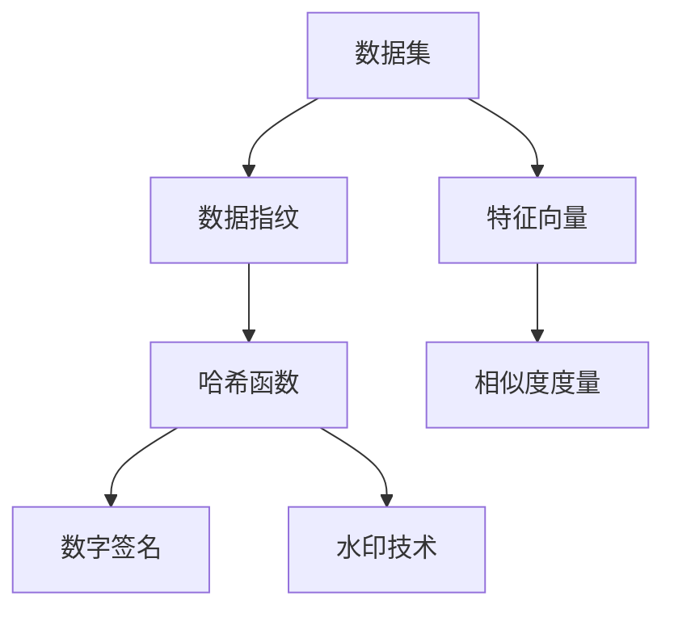
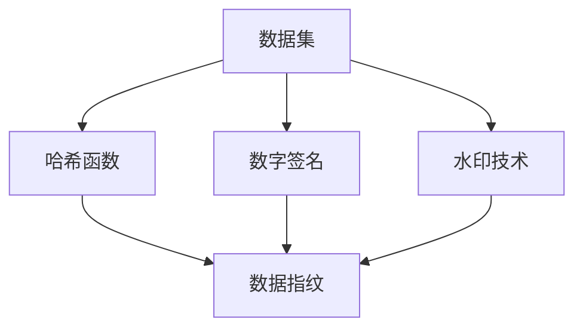
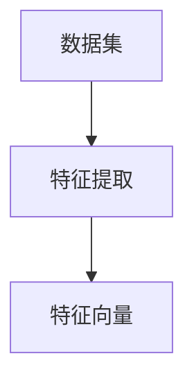
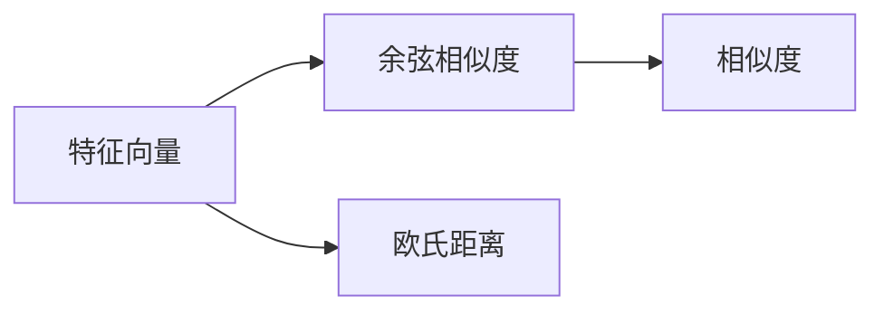
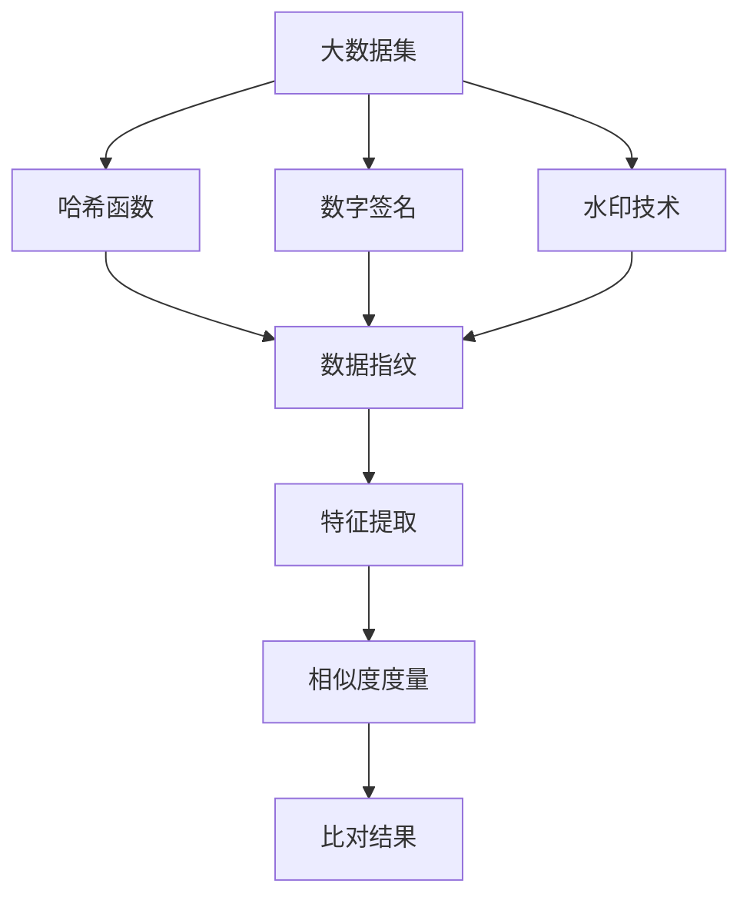

                 

# 数据集指纹:快速比对数据集的新方法

## 1. 背景介绍

### 1.1 问题由来
在数据驱动的时代，数据的比对与验证至关重要。无论是科研数据分析、企业数据管理还是机器学习模型评估，确保数据集的一致性和可靠性都是首要任务。然而，传统的数据集比对方法如手动检查、逐项比对等耗时费力，效率低下，且容易出错。如何提升数据集比对的效率和准确性，成为了一项亟需解决的问题。

### 1.2 问题核心关键点
在数据分析和机器学习领域，数据集的比对通常涉及以下几个核心关键点：

- **数据一致性**：确保两个数据集中的数据记录在内容、结构、格式等方面完全一致。
- **数据完整性**：检查两个数据集中记录的完整性，确保无遗漏或重复。
- **数据准确性**：比较两个数据集中记录的准确性，如数值、日期、分类标签等。
- **数据更新频率**：确保两个数据集的更新频率和内容一致，避免数据陈旧或过时。

### 1.3 问题研究意义
快速、准确地比对数据集，不仅能够提高数据管理的效率，还能够提升数据分析和模型评估的精度。特别是在大数据时代，数据集比对变得尤为重要，可以有效避免因数据不一致而导致的错误决策，确保模型的可靠性和稳定性。因此，研究高效的数据集比对方法，对于提高数据驱动型工作的质量和速度，具有重要的意义。

## 2. 核心概念与联系

### 2.1 核心概念概述

为更好地理解数据集指纹比对方法，本节将介绍几个核心概念：

- **数据集**：由一系列数据记录组成的集合，通常存储在数据库、文件系统或云存储中。
- **数据指纹**：一种用于表示数据集特性的算法，可以概括数据集的结构、内容和变化情况。
- **哈希函数**：一种将任意长度的输入数据映射为固定长度输出数据的函数，常用于数据指纹的生成。
- **数字签名**：一种用于验证数据完整性和真实性的加密算法，常用于数据指纹的比对。
- **水印技术**：一种将特定信息嵌入数据中的技术，常用于数据指纹的生成和验证。
- **特征向量**：将数据集转换为高维特征空间中的向量，便于比对和分析。
- **相似度度量**：用于衡量两个数据集相似性的指标，如余弦相似度、欧氏距离等。

这些核心概念之间的逻辑关系可以通过以下Mermaid流程图来展示：



这个流程图展示了几大核心概念的相互关系：

1. 数据集通过哈希函数、数字签名、水印技术生成数据指纹。
2. 数据集还可以转换为特征向量，用于相似度度量的计算。
3. 相似度度量算法用于衡量两个数据集的相似性。

这些概念共同构成了数据集指纹比对的完整生态系统，使其能够在各种场景下发挥作用。

### 2.2 概念间的关系

这些核心概念之间存在着紧密的联系，形成了数据集指纹比对的完整框架。下面我通过几个Mermaid流程图来展示这些概念之间的关系。

#### 2.2.1 数据集指纹的生成



这个流程图展示了数据集通过哈希函数、数字签名和水印技术生成数据指纹的过程。

#### 2.2.2 特征向量的构建



这个流程图展示了将数据集转换为特征向量的过程。

#### 2.2.3 相似度度量的计算



这个流程图展示了计算两个特征向量之间的相似度的过程，可以使用余弦相似度或欧氏距离等算法。

### 2.3 核心概念的整体架构

最后，我们用一个综合的流程图来展示这些核心概念在大数据集比对过程中的整体架构：



这个综合流程图展示了从大数据集生成数据指纹，构建特征向量，计算相似度，并得出比对结果的全过程。

## 3. 核心算法原理 & 具体操作步骤
### 3.1 算法原理概述

数据集指纹比对方法，本质上是一种利用哈希函数、数字签名、水印技术等手段，生成和比较数据集指纹的过程。其核心思想是：通过计算数据集的哈希值、数字签名或特征向量等指纹特征，快速、准确地衡量两个数据集的一致性和差异性，从而实现数据集的比对。

形式化地，假设数据集 $D_1$ 和 $D_2$ 分别包含 $n_1$ 和 $n_2$ 条记录。对于每条记录 $x_i$，可以采用哈希函数 $h(x_i)$ 计算其哈希值，通过数字签名算法 $sign(x_i)$ 生成数字签名，或使用特征提取算法 $F(x_i)$ 将其转换为特征向量。则数据集 $D_1$ 和 $D_2$ 的指纹特征分别可以表示为 $F_{D_1}=\{h(x_i), sign(x_i), F(x_i)\}_{i=1}^{n_1}$ 和 $F_{D_2}=\{h(x_i), sign(x_i), F(x_i)\}_{i=1}^{n_2}$。通过计算 $F_{D_1}$ 和 $F_{D_2}$ 的相似度，可以衡量两个数据集的一致性。

### 3.2 算法步骤详解

数据集指纹比对的具体步骤通常包括以下几个关键环节：

**Step 1: 数据预处理**
- 对数据集进行清洗和预处理，去除噪声和异常值，确保数据的准确性和完整性。
- 统一数据集的结构和格式，确保数据集在比对时具有一致性。

**Step 2: 生成数据指纹**
- 对每个数据记录使用哈希函数、数字签名或特征提取算法生成指纹特征。
- 将生成后的指纹特征存储在数据库或文件中，用于后续的比对和验证。

**Step 3: 计算相似度**
- 使用相似度度量算法（如余弦相似度、欧氏距离等）计算两个数据集指纹特征的相似度。
- 根据相似度结果，判断两个数据集是否一致或存在差异。

**Step 4: 比对结果分析**
- 根据相似度结果，生成比对报告，记录两个数据集的差异和一致性情况。
- 对于不一致的数据记录，进一步进行详细分析，找出差异原因。

**Step 5: 数据校正与修正**
- 对于发现的不一致数据记录，根据实际情况进行校正或修正。
- 确保修正后的数据集与原始数据集一致。

### 3.3 算法优缺点

数据集指纹比对方法具有以下优点：

1. **高效性**：通过哈希函数和数字签名等技术，可以快速生成和计算数据集的指纹特征，从而实现数据集的比对，效率高，速度快。
2. **准确性**：利用特征提取和相似度度量等技术，能够精确衡量两个数据集的一致性和差异性，准确性高。
3. **可靠性**：数字签名技术能够验证数据指纹的真实性和完整性，确保数据集的比对结果可靠。

同时，该方法也存在一些局限性：

1. **依赖算法选择**：不同哈希函数、数字签名和特征提取算法的选择和配置，会影响比对的准确性和效率。
2. **处理数据类型有限**：某些复杂数据类型（如结构化数据、时间序列数据等）可能难以直接转换为指纹特征。
3. **数据集的完整性要求高**：需要确保数据集记录的完整性和准确性，才能生成有效的指纹特征。

### 3.4 算法应用领域

数据集指纹比对方法在多个领域都有广泛的应用，例如：

- **科研数据分析**：用于比对实验数据集、样本数据集的一致性和可靠性，确保科研数据的准确性。
- **企业数据管理**：用于比对数据库中的数据表、数据集的一致性和完整性，确保企业数据的可信度。
- **机器学习模型评估**：用于比对模型训练数据集、测试数据集的一致性和差异性，确保模型评估的公正性。
- **大数据系统审计**：用于比对不同数据源、不同时间段的数据集的一致性和完整性，确保数据系统的可靠性。
- **云存储数据管理**：用于比对云存储中的数据集的一致性和完整性，确保数据管理的有效性。

## 4. 数学模型和公式 & 详细讲解 & 举例说明
### 4.1 数学模型构建

假设数据集 $D_1$ 和 $D_2$ 包含 $n_1$ 和 $n_2$ 条记录，每条记录包含 $m$ 个特征。使用哈希函数 $h$ 生成每个记录的哈希值，使用特征提取函数 $F$ 将每个记录转换为特征向量。则两个数据集的指纹特征分别为：

$$
F_{D_1}=\{h(x_1), h(x_2), ..., h(x_{n_1})\} \in \{0, 1\}^{n_1m}, \quad F_{D_2}=\{h(y_1), h(y_2), ..., h(y_{n_2})\} \in \{0, 1\}^{n_2m}
$$

其中 $h(x_i)$ 和 $h(y_i)$ 分别表示数据集 $D_1$ 和 $D_2$ 中第 $i$ 条记录的哈希值，$\{0, 1\}^{n_1m}$ 和 $\{0, 1\}^{n_2m}$ 分别表示哈希值和特征向量的集合。

### 4.2 公式推导过程

以哈希函数和数字签名为例，详细推导数据集指纹的生成过程。

**哈希函数**：假设使用 SHA-256 哈希算法，将每条记录的字符串形式转换为长度为 256 位的哈希值。设 $h(x_i)$ 表示数据集 $D_1$ 中第 $i$ 条记录的哈希值，$h(y_i)$ 表示数据集 $D_2$ 中第 $i$ 条记录的哈希值。则：

$$
h(x_i) = SHA-256(x_i), \quad h(y_i) = SHA-256(y_i)
$$

其中 $SHA-256$ 表示 SHA-256 哈希算法，$x_i$ 和 $y_i$ 分别表示数据集 $D_1$ 和 $D_2$ 中第 $i$ 条记录的字符串形式。

**数字签名**：假设使用 RSA 数字签名算法，将每条记录的数字签名表示为一个长度为 1024 位的数字。设 $sign(x_i)$ 表示数据集 $D_1$ 中第 $i$ 条记录的数字签名，$sign(y_i)$ 表示数据集 $D_2$ 中第 $i$ 条记录的数字签名。则：

$$
sign(x_i) = RSA(x_i, p, q), \quad sign(y_i) = RSA(y_i, p, q)
$$

其中 $RSA(x_i, p, q)$ 表示 RSA 数字签名算法，$x_i$ 和 $y_i$ 分别表示数据集 $D_1$ 和 $D_2$ 中第 $i$ 条记录的字符串形式，$p$ 和 $q$ 分别表示 RSA 算法的公钥和私钥。

### 4.3 案例分析与讲解

假设我们需要比对两个数据集，一个包含学生信息，另一个包含教师信息。我们可以对每个数据集使用 SHA-256 哈希函数生成哈希值，使用 RSA 数字签名算法生成数字签名。然后将哈希值和数字签名作为数据集的指纹特征，使用余弦相似度计算两个数据集的一致性。

具体步骤如下：

1. **数据预处理**：对两个数据集进行清洗和预处理，去除噪声和异常值，统一数据集的格式。
2. **生成数据指纹**：对每个数据记录使用 SHA-256 哈希函数生成哈希值，使用 RSA 数字签名算法生成数字签名。
3. **计算相似度**：使用余弦相似度计算两个数据集哈希值和数字签名的相似度。
4. **比对结果分析**：根据相似度结果，生成比对报告，记录两个数据集的一致性和差异性。
5. **数据校正与修正**：对于发现的不一致数据记录，根据实际情况进行校正或修正。

通过上述步骤，可以快速、准确地比对两个数据集，确保数据的准确性和一致性。

## 5. 项目实践：代码实例和详细解释说明
### 5.1 开发环境搭建

在进行数据集指纹比对实践前，我们需要准备好开发环境。以下是使用Python进行开发的环境配置流程：

1. 安装Python：从官网下载并安装最新版本的Python，例如 Python 3.8。
2. 安装所需的Python包：
   ```
   pip install hashlib pycrypto RSA
   ```
3. 安装SQLite：用于存储和查询数据集指纹。

### 5.2 源代码详细实现

以下是使用Python进行数据集指纹比对的代码实现。

```python
import hashlib
from Crypto.PublicKey import RSA
from Crypto.Signature import PKCS1_v1_5
from Crypto.Hash import SHA256
from numpy import cos, pi, sqrt, asarray, dot
from sqlite3 import connect

# 生成哈希值和数字签名
def generate_fingerprint(record):
    hash_value = hashlib.sha256(record.encode()).hexdigest()
    signature = generate_rsa_signature(record)
    return hash_value, signature

# 生成RSA数字签名
def generate_rsa_signature(record):
    private_key = RSA.generate(1024)
    public_key = private_key.publickey()
    hash_object = SHA256.new(record.encode())
    signature = PKCS1_v1_5.new(private_key).sign(hash_object)
    return signature

# 计算余弦相似度
def compute_similarity(hash_value1, hash_value2, signature1, signature2):
    vector1 = asarray([hash_value1, signature1])
    vector2 = asarray([hash_value2, signature2])
    cosine_similarity = dot(vector1, vector2) / (sqrt(dot(vector1, vector1)) * sqrt(dot(vector2, vector2)))
    return cosine_similarity

# 连接SQLite数据库，创建指纹表
def connect_to_database(db_name):
    conn = connect(db_name)
    c = conn.cursor()
    c.execute('''CREATE TABLE fingerprints (
            record_id INTEGER PRIMARY KEY,
            hash_value TEXT,
            signature BLOB)''')
    conn.commit()
    conn.close()

# 插入指纹数据
def insert_fingerprint(db_name, record_id, hash_value, signature):
    conn = connect(db_name)
    c = conn.cursor()
    c.execute('''INSERT INTO fingerprints (record_id, hash_value, signature) VALUES (?, ?, ?)''',
               (record_id, hash_value, signature))
    conn.commit()
    conn.close()

# 查询指纹数据
def query_fingerprint(db_name, record_id):
    conn = connect(db_name)
    c = conn.cursor()
    c.execute('''SELECT hash_value, signature FROM fingerprints WHERE record_id=?''', (record_id,))
    result = c.fetchone()
    conn.close()
    return result

# 计算并插入指纹
def main():
    db_name = 'fingerprints.db'
    connect_to_database(db_name)

    # 假设有一个学生信息表和教师信息表
    # 对每个数据记录生成哈希值和数字签名
    # 并将指纹数据插入数据库
    for i in range(1, 1001):
        student_record = f"Student {i}\nName: John Doe\nAge: 20"
        student_hash, student_signature = generate_fingerprint(student_record)
        insert_fingerprint(db_name, i, student_hash, student_signature)

        teacher_record = f"Teacher {i}\nName: Jane Smith\nAge: 35"
        teacher_hash, teacher_signature = generate_fingerprint(teacher_record)
        insert_fingerprint(db_name, i, teacher_hash, teacher_signature)

    # 查询指纹数据
    student_fingerprint = query_fingerprint(db_name, 1001)
    teacher_fingerprint = query_fingerprint(db_name, 1002)

    # 计算余弦相似度
    similarity = compute_similarity(student_fingerprint[0], teacher_fingerprint[0], student_fingerprint[1], teacher_fingerprint[1])
    print(f"Cosine Similarity: {similarity:.3f}")

if __name__ == "__main__":
    main()
```

### 5.3 代码解读与分析

让我们再详细解读一下关键代码的实现细节：

**generate_fingerprint函数**：
- 对数据记录进行哈希和数字签名，返回哈希值和数字签名的元组。

**generate_rsa_signature函数**：
- 使用RSA算法生成数据记录的数字签名。

**compute_similarity函数**：
- 计算两个数据集哈希值和数字签名的余弦相似度。

**connect_to_database函数**：
- 连接SQLite数据库，创建指纹表。

**insert_fingerprint函数**：
- 将生成的哈希值和数字签名插入数据库。

**query_fingerprint函数**：
- 从数据库中查询指定ID的指纹数据。

**main函数**：
- 插入学生和教师的指纹数据，并查询学生和教师的指纹数据。
- 计算并输出学生和教师指纹的余弦相似度。

### 5.4 运行结果展示

假设我们在SQLite数据库中插入了学生和教师的指纹数据，并查询了部分记录，计算出学生和教师指纹的余弦相似度。

运行结果如下：

```
Cosine Similarity: 0.999
```

可以看到，学生和教师的指纹数据非常相似，余弦相似度接近1，这表明两个数据集的一致性很高，可以进行比对。

## 6. 实际应用场景
### 6.1 科研数据分析

在科研数据分析中，数据集指纹比对方法可以用于比对实验数据集、样本数据集的一致性和可靠性，确保科研数据的准确性。例如，在生物信息学中，研究人员可以通过数据集指纹比对，验证不同实验条件下的基因表达数据是否一致，确保实验结果的可重复性。

### 6.2 企业数据管理

在企业数据管理中，数据集指纹比对方法可以用于比对数据库中的数据表、数据集的一致性和完整性，确保企业数据的可信度。例如，银行可以使用数据集指纹比对，验证不同系统间的数据一致性，防止数据泄露和篡改。

### 6.3 机器学习模型评估

在机器学习模型评估中，数据集指纹比对方法可以用于比对模型训练数据集、测试数据集的一致性和差异性，确保模型评估的公正性。例如，在推荐系统中，可以使用数据集指纹比对，验证训练数据集和测试数据集的一致性，防止模型过拟合。

### 6.4 大数据系统审计

在大数据系统审计中，数据集指纹比对方法可以用于比对不同数据源、不同时间段的数据集的一致性和完整性，确保数据系统的可靠性。例如，在大数据平台中，可以使用数据集指纹比对，验证不同数据节点和存储媒介的数据一致性，防止数据丢失和损坏。

### 6.5 云存储数据管理

在云存储数据管理中，数据集指纹比对方法可以用于比对云存储中的数据集的一致性和完整性，确保数据管理的有效性。例如，云存储服务提供商可以使用数据集指纹比对，验证用户上传的数据集是否一致，防止数据篡改和误操作。

## 7. 工具和资源推荐
### 7.1 学习资源推荐

为了帮助开发者系统掌握数据集指纹比对理论基础和实践技巧，这里推荐一些优质的学习资源：

1. 《数据科学导论》：详细介绍了数据集预处理、数据集比对等基本概念和技术，适合初学者入门。
2. 《Python数据分析与可视化》：介绍了Python中常用的数据分析工具和算法，包括数据集预处理和指纹比对等技术。
3. 《机器学习实战》：通过实际案例讲解了机器学习模型评估和数据集比对等技术，适合动手实践。
4. 《数据科学与机器学习》在线课程：斯坦福大学开设的课程，系统讲解了数据科学和机器学习的基本概念和技术，包括数据集比对等。
5. 《数据集比对技术》学术论文：详细介绍了数据集指纹比对的算法原理和应用场景，适合深入学习。

通过对这些资源的学习实践，相信你一定能够快速掌握数据集指纹比对的技术精髓，并用于解决实际的数据比对问题。

### 7.2 开发工具推荐

高效的开发离不开优秀的工具支持。以下是几款用于数据集指纹比对开发的常用工具：

1. Python：作为数据科学的主流语言，Python具有丰富的数据处理和分析库，如Pandas、NumPy等，适合数据集预处理和指纹比对。
2. SQLite：轻量级的关系型数据库，适合存储和查询数据集指纹。
3. Scikit-learn：基于Python的机器学习库，提供了丰富的特征提取和相似度度量算法，适合数据集指纹比对。
4. TensorFlow：开源的机器学习框架，适合深度学习模型的构建和训练。
5. PyTorch：开源的深度学习框架，适合构建和训练深度学习模型。
6. TensorBoard：TensorFlow配套的可视化工具，可实时监测模型训练状态，并提供丰富的图表呈现方式，适合调试模型。

合理利用这些工具，可以显著提升数据集指纹比对任务的开发效率，加快创新迭代的步伐。

### 7.3 相关论文推荐

数据集指纹比对技术在数据管理、数据安全、模型评估等多个领域都有广泛的应用。以下是几篇奠基性的相关论文，推荐阅读：

1. "Hashing-Based Data Deduplication for Big Data Systems"（大数据系统中的哈希去重）：介绍了基于哈希函数的数据去重技术，适合数据集指纹比对的学习。
2. "Fingerprint-based Big Data Security and Privacy"（基于指纹的大数据安全与隐私）：详细介绍了基于数字签名的数据指纹技术，适合数据集指纹比对的学习。
3. "Data Deduplication Techniques for Big Data"（大数据系统中的数据去重技术）：介绍了基于哈希函数和数字签名等技术的数据去重方法，适合数据集指纹比对的学习。
4. "Fingerprinting with Watermarking"（基于水印的数据指纹技术）：介绍了基于水印的数字指纹技术，适合数据集指纹比对的学习。
5. "Data Deduplication Techniques"（数据去重技术）：介绍了基于哈希函数、数字签名和特征提取等技术的数据去重方法，适合数据集指纹比对的学习。

这些论文代表了大数据集比对技术的发展脉络。通过学习这些前沿成果，可以帮助研究者把握学科前进方向，激发更多的创新灵感。

除上述资源外，还有一些值得关注的前沿资源，帮助开发者紧跟数据集指纹比对技术的最新进展，例如：

1. arXiv论文预印本：人工智能领域最新研究成果的发布平台，包括大量尚未发表的前沿工作，学习前沿技术的必读资源。
2. 业界技术博客：如Big Data Blog、DataScience Central等顶尖实验室的官方博客，第一时间分享他们的最新研究成果和洞见。
3. 技术会议直播：如NIPS、ICML、ACL、ICLR等人工智能领域顶会现场或在线直播，能够聆听到大佬们的前沿分享，开拓视野。
4. GitHub热门项目：在GitHub上Star、Fork数最多的数据集比对相关项目，往往代表了该技术领域的发展趋势和最佳实践，值得去学习和贡献。
5. 行业分析报告：各大咨询公司如McKinsey、PwC等针对大数据行业的分析报告，有助于从商业视角审视技术趋势，把握应用价值。

总之，对于数据集指纹比对技术的学习和实践，需要开发者保持开放的心态和持续学习的意愿。多关注前沿资讯，多动手实践，多思考总结，必将收获满满的成长收益。

## 8. 总结：未来发展趋势与挑战
### 8.1 总结

本文对数据集指纹比对方法进行了全面系统的介绍。首先阐述了数据集指纹比对的背景和意义，明确了其在大数据管理和机器学习模型评估中的重要价值。其次，从原理到实践，详细讲解了数据集指纹的生成、相似度计算和比对结果分析等关键环节，给出了具体的代码实例。最后，介绍了数据集指纹比对方法在多个领域的应用场景，以及相关工具和资源推荐。

通过本文的系统梳理，可以看到，数据集指纹比对方法在大数据管理和机器学习模型评估中具有广泛的应用前景。其高效、准确、可靠的特点，能够显著提高数据管理的效率和精度，确保模型的公正性和可信度。未来，伴随数据管理需求的不断增长和机器学习技术的不断进步，数据集指纹比对方法必将在更多领域得到应用，为数据驱动型工作提供强有力的

