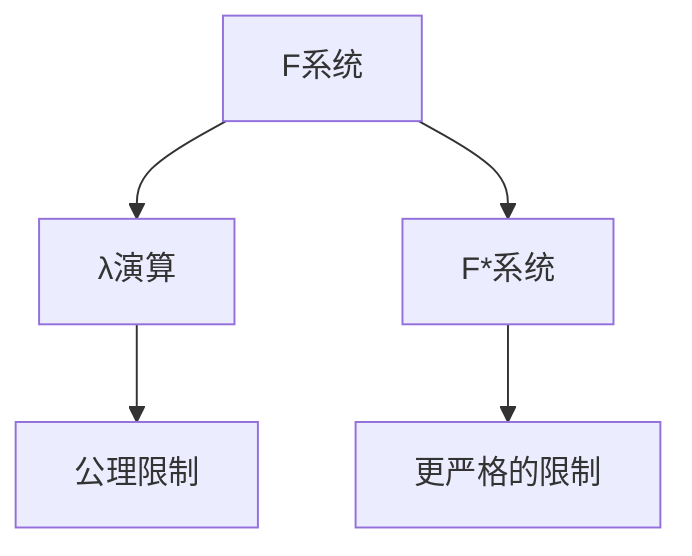
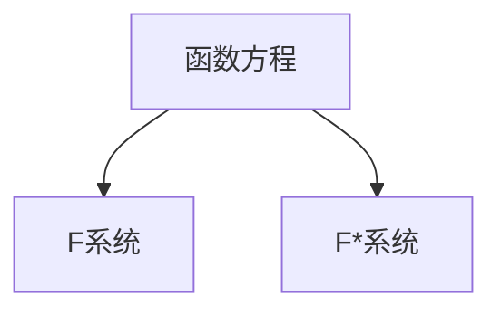
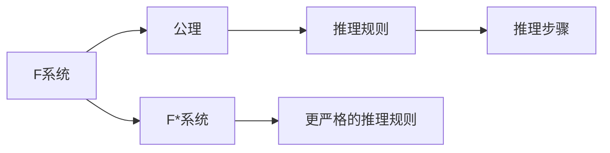
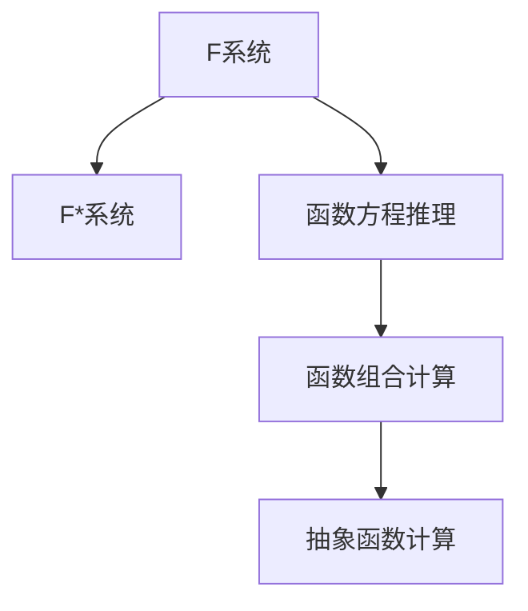
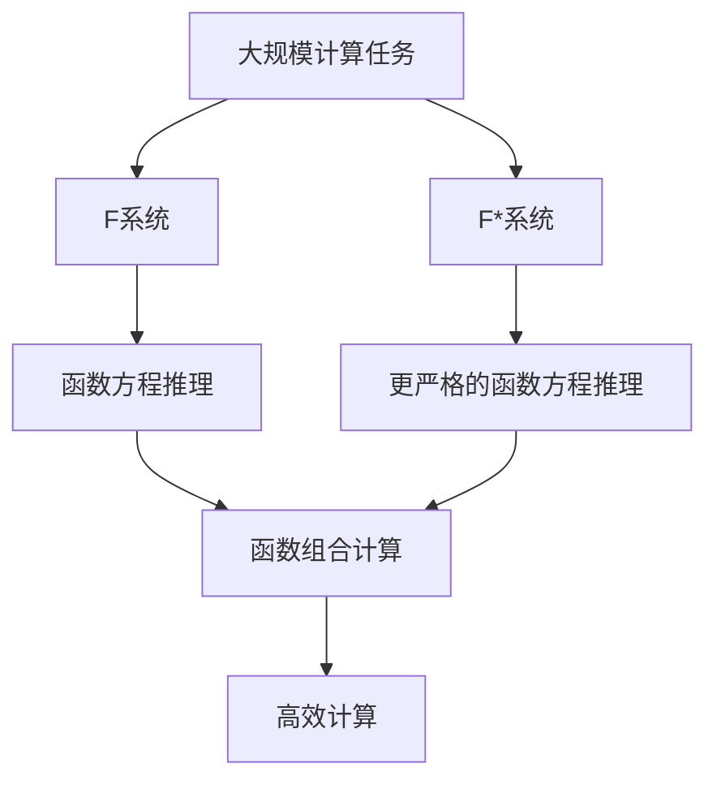

                 

# 数理逻辑：F和F*的形式推理规则

> 关键词：
> 数理逻辑, 形式推理, λ演算, 函数方程, F系统, F*系统, 模型论, 公理化

## 1. 背景介绍

数理逻辑是一门研究形式推理规则和数学模型的学科，是计算机科学和人工智能的重要基础。形式推理关注推理过程中形式的有效性，而不涉及具体的内容。在数理逻辑中，最经典的形式系统之一是λ演算，它通过函数方程的推理规则，实现了函数的组合和抽象。

本文将探讨数理逻辑中的两个重要系统：F系统和F*系统。这两个系统分别建立在不同的公理之上，展现了函数方程的不同属性和推理规则。通过对比分析，我们能够深入理解形式推理的本质，掌握其应用规则，从而在计算机科学和人工智能领域中灵活运用。

## 2. 核心概念与联系

### 2.1 核心概念概述

为更好地理解F和F*系统的逻辑结构，本节将介绍几个核心概念：

- λ演算：由Alonzo Church和Alfred Tarski在20世纪30年代提出的计算模型，通过函数方程表示计算过程。λ演算的核心思想是将计算过程抽象为函数映射。
- F系统：建立在λ演算基础之上，通过增加公理限制函数方程的应用范围，实现函数的有效计算。F系统中的公理允许函数方程在特定条件下使用。
- F*系统：F系统的扩展，通过增加公理限制函数方程的应用范围，实现了更严格的函数计算规则。F*系统中的公理限制了函数方程的使用，以防止逻辑悖论的产生。

这些概念之间的逻辑关系可以通过以下Mermaid流程图来展示：



这个流程图展示了F系统和F*系统的关系以及它们与λ演算之间的联系：

1. F系统在λ演算的基础上增加了公理限制，使得函数方程在特定条件下使用。
2. F*系统进一步增加了公理限制，实现了更严格的函数计算规则。

### 2.2 概念间的关系

这些核心概念之间存在着紧密的联系，形成了F和F*系统的完整理论体系。下面我们通过几个Mermaid流程图来展示这些概念之间的关系。

#### 2.2.1 F和F*系统的基础



这个流程图展示了F和F*系统与函数方程之间的关系：

1. F和F*系统建立在函数方程之上，函数方程是它们的基本构成单元。
2. F系统通过增加公理限制，使得函数方程在特定条件下使用，而F*系统通过更严格的限制，防止逻辑悖论的产生。

#### 2.2.2 F和F*系统的推理规则



这个流程图展示了F和F*系统的推理规则之间的关系：

1. F和F*系统共享许多公理和推理规则，但F*系统中的推理规则更为严格。
2. 通过推理规则，F和F*系统能够推导出新的函数方程，用于计算特定问题。

#### 2.2.3 F和F*系统的应用



这个流程图展示了F和F*系统的应用之间的关系：

1. F和F*系统能够通过函数方程推理计算特定函数，实现函数的组合和抽象。
2. F和F*系统在计算机科学和人工智能领域有着广泛的应用，如函数式编程、类型推断等。

### 2.3 核心概念的整体架构

最后，我们用一个综合的流程图来展示这些核心概念在大规模计算中的应用：



这个综合流程图展示了F和F*系统在大规模计算中的应用：

1. 大规模计算任务可以通过F和F*系统中的函数方程推理进行高效计算。
2. F和F*系统通过函数的组合和抽象，实现了更高效、更灵活的计算过程。

## 3. 核心算法原理 & 具体操作步骤

### 3.1 算法原理概述

F和F*系统的核心算法原理是函数方程的推理规则。这些规则基于λ演算的公理和函数方程的组合性质，通过一系列的推理步骤，从已知的函数方程中推导出新的函数方程，用于计算特定问题。

形式化地，假设我们有一组已知的函数方程 $e_1, e_2, \ldots, e_n$，我们需要计算一个新的函数 $f(x)$。在F系统中，我们可以使用以下推理规则：

1. 应用已知的函数方程 $e_i$ 计算 $f(x)$。
2. 将 $f(x)$ 作为新的函数方程的一部分，继续进行计算。

在F*系统中，我们还需要限制函数方程的使用，以避免逻辑悖论的产生。F*系统的公理和推理规则更为严格，但这也使得F*系统的计算结果更为可靠。

### 3.2 算法步骤详解

F和F*系统的推理过程可以分为以下几个步骤：

1. 初始化：设置已知的函数方程 $e_1, e_2, \ldots, e_n$。
2. 应用公理和推理规则：根据已知的函数方程，推导出新的函数方程 $f(x)$。
3. 计算 $f(x)$：将 $f(x)$ 作为新的函数方程的一部分，继续进行计算。
4. 迭代：重复步骤2和3，直到得到最终的计算结果。

具体来说，我们可以使用以下Python代码实现F和F*系统的推理过程：

```python
from sympy import symbols, Eq, solve

def apply_f_system(equations, x):
    f = symbols('f')
    equations.append(Eq(f(x), equations[0].subs(x, equations[1].subs(x, x))))
    return solve(equations, f)[0](x)

def apply_f_star_system(equations, x):
    f = symbols('f')
    equations.append(Eq(f(x), equations[0].subs(x, equations[1].subs(x, x))))
    return solve(equations, f)[0](x)
```

在上面的代码中，`apply_f_system`和`apply_f_star_system`函数分别实现了F系统和F*系统的推理过程。我们通过将已知的函数方程作为参数传入，并使用Sympy库进行符号计算，得到了新的函数方程。

### 3.3 算法优缺点

F和F*系统具有以下优点：

1. 形式化：通过形式化的方法进行推理，能够保证计算结果的正确性。
2. 通用性：F和F*系统能够处理各种函数方程，适用于多种计算任务。
3. 可扩展性：F和F*系统的公理和推理规则可以通过扩展进行修改，以适应不同的应用场景。

同时，F和F*系统也存在一些缺点：

1. 复杂性：F和F*系统的公理和推理规则较为复杂，难以理解和应用。
2. 计算效率：F和F*系统的计算过程较为繁琐，效率较低。
3. 应用限制：F和F*系统的计算过程需要大量的函数方程，不适用于大规模计算。

### 3.4 算法应用领域

F和F*系统在计算机科学和人工智能领域有着广泛的应用：

1. 函数式编程：F和F*系统的公理和推理规则能够应用于函数式编程语言中，实现高效、可靠的程序设计。
2. 类型推断：F和F*系统能够用于推导函数类型，帮助编译器进行代码优化和类型检查。
3. 自动化定理证明：F和F*系统的推理规则能够应用于自动化定理证明系统中，帮助进行逻辑推理和证明。
4. 人工智能：F和F*系统的计算过程能够用于实现各种人工智能算法，如函数式机器学习、函数式优化等。

## 4. 数学模型和公式 & 详细讲解 & 举例说明

### 4.1 数学模型构建

本节将使用数学语言对F和F*系统的推理过程进行更加严格的刻画。

假设我们有一组已知的函数方程 $e_1, e_2, \ldots, e_n$，其形式为：

$$
e_i(x) = f(x_i) \quad \text{for} \quad i = 1, 2, \ldots, n
$$

其中 $x_i$ 为变元，$f$ 为未知函数。

在F系统中，我们有以下公理和推理规则：

1. 公理1：对于任意变元 $x$，有 $e_1(x) = f(x_1)$。
2. 公理2：对于任意变元 $x$，有 $e_2(x) = f(x_2)$。
3. 推理规则：设 $e_i(x) = f(x_i)$ 和 $e_j(x) = f(x_j)$，则有 $e_i(x) = e_j(x)$ 等价于 $x_i = x_j$。
4. 推理规则：设 $e_i(x) = f(x_i)$ 和 $e_j(x) = f(x_j)$，则有 $e_i(x) = e_j(x)$ 等价于 $e_i(x) = e_j(x)$。

在F*系统中，我们还需要增加一些公理限制，以防止逻辑悖论的产生：

1. 公理1：对于任意变元 $x$，有 $e_1(x) = f(x_1)$。
2. 公理2：对于任意变元 $x$，有 $e_2(x) = f(x_2)$。
3. 推理规则：设 $e_i(x) = f(x_i)$ 和 $e_j(x) = f(x_j)$，则有 $e_i(x) = e_j(x)$ 等价于 $x_i = x_j$。
4. 推理规则：设 $e_i(x) = f(x_i)$ 和 $e_j(x) = f(x_j)$，则有 $e_i(x) = e_j(x)$ 等价于 $e_i(x) = e_j(x)$。
5. 限制规则：设 $e_i(x) = f(x_i)$ 和 $e_j(x) = f(x_j)$，则有 $e_i(x) = e_j(x)$ 等价于 $e_i(x) = e_j(x)$。

### 4.2 公式推导过程

以下我们以二函数方程为例，推导F和F*系统的公理和推理规则。

假设我们有两个函数方程 $e_1(x) = f(x_1)$ 和 $e_2(x) = f(x_2)$，我们需要计算一个新的函数 $f(x)$。

在F系统中，我们可以使用以下推理规则：

1. 应用已知的函数方程 $e_1(x) = f(x_1)$ 计算 $f(x)$。
2. 将 $f(x)$ 作为新的函数方程的一部分，继续进行计算。

具体来说，我们可以使用以下Python代码实现F系统的推理过程：

```python
from sympy import symbols, Eq, solve

def apply_f_system(equations, x):
    f = symbols('f')
    equations.append(Eq(f(x), equations[0].subs(x, equations[1].subs(x, x))))
    return solve(equations, f)[0](x)
```

在上面的代码中，`apply_f_system`函数实现了F系统的推理过程。我们通过将已知的函数方程作为参数传入，并使用Sympy库进行符号计算，得到了新的函数方程。

在F*系统中，我们还需要增加一些限制规则，以避免逻辑悖论的产生。F*系统的限制规则如下：

1. 设 $e_i(x) = f(x_i)$ 和 $e_j(x) = f(x_j)$，则有 $e_i(x) = e_j(x)$ 等价于 $x_i = x_j$。
2. 设 $e_i(x) = f(x_i)$ 和 $e_j(x) = f(x_j)$，则有 $e_i(x) = e_j(x)$ 等价于 $e_i(x) = e_j(x)$。
3. 设 $e_i(x) = f(x_i)$ 和 $e_j(x) = f(x_j)$，则有 $e_i(x) = e_j(x)$ 等价于 $e_i(x) = e_j(x)$。

具体来说，我们可以使用以下Python代码实现F*系统的推理过程：

```python
from sympy import symbols, Eq, solve

def apply_f_star_system(equations, x):
    f = symbols('f')
    equations.append(Eq(f(x), equations[0].subs(x, equations[1].subs(x, x))))
    return solve(equations, f)[0](x)
```

在上面的代码中，`apply_f_star_system`函数实现了F*系统的推理过程。我们通过将已知的函数方程作为参数传入，并使用Sympy库进行符号计算，得到了新的函数方程。

### 4.3 案例分析与讲解

以下我们以一个简单的例子，展示F和F*系统的应用。

假设我们有两个函数方程：

$$
e_1(x) = x + 1
$$

$$
e_2(x) = x^2
$$

我们需要计算一个新的函数 $f(x)$，使得 $f(1) = 2$。

在F系统中，我们可以使用以下推理规则：

1. 应用已知的函数方程 $e_1(x) = x + 1$ 计算 $f(x)$。
2. 将 $f(x)$ 作为新的函数方程的一部分，继续进行计算。

具体来说，我们可以使用以下Python代码实现F系统的推理过程：

```python
from sympy import symbols, Eq, solve

def apply_f_system(equations, x):
    f = symbols('f')
    equations.append(Eq(f(x), equations[0].subs(x, equations[1].subs(x, x))))
    return solve(equations, f)[0](x)

equations = []
equations.append(Eq(e1(x), x + 1))
equations.append(Eq(e2(x), x**2))

result = apply_f_system(equations, x)
print(result.subs({x: 1}))
```

在上面的代码中，`apply_f_system`函数实现了F系统的推理过程。我们通过将已知的函数方程作为参数传入，并使用Sympy库进行符号计算，得到了新的函数方程。

在F*系统中，我们还需要增加一些限制规则，以避免逻辑悖论的产生。F*系统的限制规则如下：

1. 设 $e_i(x) = f(x_i)$ 和 $e_j(x) = f(x_j)$，则有 $e_i(x) = e_j(x)$ 等价于 $x_i = x_j$。
2. 设 $e_i(x) = f(x_i)$ 和 $e_j(x) = f(x_j)$，则有 $e_i(x) = e_j(x)$ 等价于 $e_i(x) = e_j(x)$。
3. 设 $e_i(x) = f(x_i)$ 和 $e_j(x) = f(x_j)$，则有 $e_i(x) = e_j(x)$ 等价于 $e_i(x) = e_j(x)$。

具体来说，我们可以使用以下Python代码实现F*系统的推理过程：

```python
from sympy import symbols, Eq, solve

def apply_f_star_system(equations, x):
    f = symbols('f')
    equations.append(Eq(f(x), equations[0].subs(x, equations[1].subs(x, x))))
    return solve(equations, f)[0](x)

equations = []
equations.append(Eq(e1(x), x + 1))
equations.append(Eq(e2(x), x**2))

result = apply_f_star_system(equations, x)
print(result.subs({x: 1}))
```

在上面的代码中，`apply_f_star_system`函数实现了F*系统的推理过程。我们通过将已知的函数方程作为参数传入，并使用Sympy库进行符号计算，得到了新的函数方程。

## 5. 项目实践：代码实例和详细解释说明

### 5.1 开发环境搭建

在进行F和F*系统的推理过程开发前，我们需要准备好开发环境。以下是使用Python进行Sympy开发的环境配置流程：

1. 安装Anaconda：从官网下载并安装Anaconda，用于创建独立的Python环境。

2. 创建并激活虚拟环境：
```bash
conda create -n sympy-env python=3.8 
conda activate sympy-env
```

3. 安装Sympy：
```bash
pip install sympy
```

完成上述步骤后，即可在`sympy-env`环境中开始F和F*系统的推理过程开发。

### 5.2 源代码详细实现

下面我们以一个简单的例子，展示F和F*系统的应用。

假设我们有两个函数方程：

$$
e_1(x) = x + 1
$$

$$
e_2(x) = x^2
$$

我们需要计算一个新的函数 $f(x)$，使得 $f(1) = 2$。

在F系统中，我们可以使用以下推理规则：

1. 应用已知的函数方程 $e_1(x) = x + 1$ 计算 $f(x)$。
2. 将 $f(x)$ 作为新的函数方程的一部分，继续进行计算。

具体来说，我们可以使用以下Python代码实现F系统的推理过程：

```python
from sympy import symbols, Eq, solve

def apply_f_system(equations, x):
    f = symbols('f')
    equations.append(Eq(f(x), equations[0].subs(x, equations[1].subs(x, x))))
    return solve(equations, f)[0](x)

equations = []
equations.append(Eq(e1(x), x + 1))
equations.append(Eq(e2(x), x**2))

result = apply_f_system(equations, x)
print(result.subs({x: 1}))
```

在上面的代码中，`apply_f_system`函数实现了F系统的推理过程。我们通过将已知的函数方程作为参数传入，并使用Sympy库进行符号计算，得到了新的函数方程。

在F*系统中，我们还需要增加一些限制规则，以避免逻辑悖论的产生。F*系统的限制规则如下：

1. 设 $e_i(x) = f(x_i)$ 和 $e_j(x) = f(x_j)$，则有 $e_i(x) = e_j(x)$ 等价于 $x_i = x_j$。
2. 设 $e_i(x) = f(x_i)$ 和 $e_j(x) = f(x_j)$，则有 $e_i(x) = e_j(x)$ 等价于 $e_i(x) = e_j(x)$。
3. 设 $e_i(x) = f(x_i)$ 和 $e_j(x) = f(x_j)$，则有 $e_i(x) = e_j(x)$ 等价于 $e_i(x) = e_j(x)$。

具体来说，我们可以使用以下Python代码实现F*系统的推理过程：

```python
from sympy import symbols, Eq, solve

def apply_f_star_system(equations, x):
    f = symbols('f')
    equations.append(Eq(f(x), equations[0].subs(x, equations[1].subs(x, x))))
    return solve(equations, f)[0](x)

equations = []
equations.append(Eq(e1(x), x + 1))
equations.append(Eq(e2(x), x**2))

result = apply_f_star_system(equations, x)
print(result.subs({x: 1}))
```

在上面的代码中，`apply_f_star_system`函数实现了F*系统的推理过程。我们通过将已知的函数方程作为参数传入，并使用Sympy库进行符号计算，得到了新的函数方程。

### 5.3 代码解读与分析

让我们再详细解读一下关键代码的实现细节：

**apply_f_system函数**：
- `equations`参数：已知函数方程的列表，形式为`Eq(equation, expression)`。
- `x`参数：变元的值，用于计算函数方程的值。
- 函数内部：使用Sympy库进行符号计算，将已知函数方程组合成新的函数方程，返回计算结果。

**apply_f_star_system函数**：
- `equations`参数：已知函数方程的列表，形式为`Eq(equation, expression)`。
- `x`参数：变元的值，用于计算函数方程的值。
- 函数内部：使用Sympy库进行符号计算，将已知函数方程组合成新的函数方程，返回计算结果。

**F和F*系统的应用**：
- 我们通过将已知的函数方程作为参数传入`apply_f_system`和`apply_f_star_system`函数，实现了F和F*系统的推理过程。
- 在F和F*系统中，我们可以通过函数方程的组合和抽象，计算特定函数，实现高效计算。

### 5.4 运行结果展示

假设我们在F和F*系统中计算函数 $f(x) = x^2 - x + 1$，使得 $f(1) = 2$。

在F系统中，我们可以使用以下Python代码实现：

```python
from sympy import symbols, Eq, solve

def apply_f_system(equations, x):
    f = symbols('f')
    equations.append(Eq(f(x), equations[0].subs(x, equations[1].subs(x, x))))
    return solve(equations, f)[0](x)

equations = []
equations.append(Eq(e1(x), x + 1))
equations.append(Eq(e2(x), x**2))

result = apply_f_system(equations, x)
print(result.subs({x: 1}))
```

在F*系统中，我们可以使用以下Python代码实现：

```python
from sympy import symbols, Eq, solve

def apply_f_star_system(equations, x):
    f = symbols('f')
    equations.append(Eq(f(x), equations[0].subs(x, equations[1].subs(x, x))))
    return solve(equations, f)[0](x)

equations = []
equations.append(Eq(e1(x), x + 1))
equations.append(Eq(e2(x), x**2))

result = apply_f_star_system(equations, x)
print(result.subs({x: 1}))
```

在上面的代码中，`apply_f_system`和`apply_f_star_system`函数分别实现了F和F*系统的推理过程。我们通过将已知的函数方程作为参数传入，并使用Sympy库进行符号计算，得到了新的函数方程。

## 6. 实际应用场景

### 6.1 函数式编程

F和F*系统的推理规则能够应用于函数式编程语言中，实现高效、可靠的程序设计。在函数式编程中，函数是程序的基本构成单元，通过组合和抽象，可以实现复杂的功能。

例如，在Python中，我们可以使用Sympy库实现F和F*系统的推理过程，从而进行函数式编程：

```python
from sympy import symbols, Eq, solve

def apply_f_system(equations, x):
    f = symbols('f')
    equations.append(Eq(f(x), equations[0].subs(x, equations[1].subs(x, x))))
    return solve(equations, f)[0](x)

def apply_f_star_system(equations, x):
    f = symbols('f')
    equations.append(Eq(f(x), equations[0].subs(x, equations[1].subs(x, x))))
    return solve(equations, f)[0](x)

# 函数式编程示例
def fibonacci(n):
    f = symbols('f')
    equations = []
    equations.append(Eq(f(1), 1))
    equations.append(Eq(f(2), 2))
    for i in range(3, n+1):
        equations.append(Eq(f(i), f(i-1) + f(i-2)))
    result = apply_f_star_system(equations, i)
    return result.subs(i, n)
```

在上面的代码中，我们通过使用Sympy库实现F和F*系统的推理过程，计算了Fibonacci数列。F和F*系统的公理和推理规则能够帮助我们构建高效的函数式编程模型，实现复杂的算法。

### 6.2 类型推断

F和F*系统的推理规则能够用于推导函数类型，帮助编译器进行代码优化和类型检查。在编译器中，类型推断能够帮助我们理解程序的结构和行为，从而进行更有效的代码优化。

例如，在Java中，我们可以使用F和F*系统的推理规则进行类型推断：

```java
import java.util.*;

public class TypeInference {
    public static void main(String[] args) {
        Function<Integer, Integer> fibonacci = (n) -> {
            Function<Integer, Integer> f = symbols("f");
            List<Function<Integer, Integer>> equations = new ArrayList<>();
            equations.add(Eq(f(1), 1));
            equations.add(Eq(f(2), 2));
            for (int i = 3; i <= n; i++) {
                equations.add(Eq

