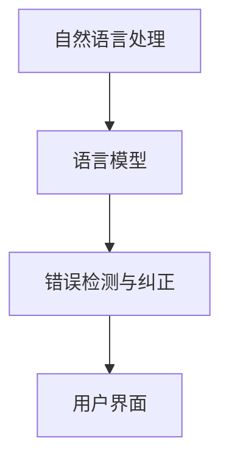

                 

# 文书纠正AI：Grammarly

## 1. 背景介绍

### 1.1 问题由来
在数字时代，无论是学术写作、商务信函、社交媒体，还是日常交流，文字表达的清晰性和准确性都至关重要。然而，由于各种原因，诸如打字错误、语法不当、拼写错误、标点使用不当、语言冗余等问题，人们在书写时难免会产生错误。这些错误不仅影响了信息传达的准确性，还可能给读者留下负面的印象。为了提升文书质量，人们在写作过程中通常会自行检查和修改，但这一过程耗时耗力，且容易遗漏。

随着人工智能（AI）技术的飞速发展，文书自动纠错系统应运而生。其中，Grammarly是最为知名和流行的文书自动纠错工具之一。Grammarly使用AI技术自动检测和纠正文本中的错误，帮助用户提升写作质量，提高工作效率。本文将深入探讨Grammarly的原理、核心算法、操作步骤及其应用领域，以期为读者提供全面的技术指导。

## 2. 核心概念与联系

### 2.1 核心概念概述

Grammarly是一种文书自动纠错系统，通过自然语言处理（Natural Language Processing, NLP）技术自动检测和纠正文本中的错误。其核心概念包括：

- **自然语言处理（NLP）**：NLP是人工智能领域的一个分支，专注于如何让计算机理解和生成人类语言。NLP技术使Grammarly能够分析文本中的语法、拼写和语义错误。
- **语言模型（Language Model）**：语言模型是一种用于估计给定上下文中下一个词或字符的概率分布的模型。Grammarly使用语言模型来预测文本的正确性，并根据预测结果进行纠正。
- **错误检测与纠正**：Grammarly通过检测文本中的语法错误、拼写错误、标点错误等，并提供具体的纠正建议。
- **用户界面（User Interface）**：Grammarly通过直观的用户界面展示文本中的错误及其纠正建议，提供易于使用的交互体验。

### 2.2 核心概念间的关系

这些核心概念之间存在紧密的联系，构成了Grammarly的核心功能：

- **NLP技术是Grammarly的基础**。NLP使Grammarly能够理解文本中的语言结构、词汇使用和语义内容，进而检测和纠正错误。
- **语言模型是NLP的核心组成部分**。语言模型通过预测上下文中的下一个词，帮助Grammarly判断文本的正确性。
- **错误检测与纠正**是Grammarly的最终目的。通过精准的错误检测和有效的纠正建议，提升文本质量。
- **用户界面是Grammarly与人交互的界面**。用户界面使Grammarly能够以直观的方式展示错误和纠正建议，提升用户使用体验。

以下是一个简单的Mermaid流程图，展示了Grammarly的核心概念及其之间的关系：



这个流程图展示了Grammarly的核心概念和它们之间的逻辑关系。NLP是基础，语言模型是核心，错误检测与纠正是目标，用户界面是交互媒介。

## 3. 核心算法原理 & 具体操作步骤

### 3.1 算法原理概述

Grammarly的文书纠错系统基于一系列的自然语言处理和机器学习技术，其主要原理包括以下几个方面：

- **分词（Tokenization）**：将文本分割成单词或词组，是NLP处理的基础。Grammarly使用分词器将输入文本分割成可处理的单元。
- **词性标注（Part-of-speech Tagging）**：确定每个单词的词性（如名词、动词、形容词等）。这有助于理解句子结构，进行语法检查。
- **语法分析（Syntactic Parsing）**：通过语法分析器，Grammarly可以识别句子的语法结构，检查语法错误。
- **错误检测与纠正算法**：Grammarly使用机器学习模型来识别和纠正错误。这些模型包括但不限于语言模型、基于规则的纠错算法和神经网络。
- **上下文理解（Contextual Understanding）**：Grammarly考虑句子中单词之间的上下文关系，以更好地理解和纠正错误。

### 3.2 算法步骤详解

Grammarly的文书纠错系统可以分为以下几个步骤：

**Step 1: 分词和词性标注**

将输入文本分成单词或词组，并为其标注词性。这一步骤依赖于自然语言处理的分词器和词性标注器。Grammarly通常使用基于统计的方法，如隐马尔可夫模型（HMM）或条件随机场（CRF），来完成这一步骤。

**Step 2: 语法分析**

通过语法分析器，Grammarly识别句子的语法结构，检查语法错误。这一步骤依赖于语法分析器，如依存句法分析器或短语结构分析器。Grammarly通常使用基于规则的语法分析方法，结合机器学习方法进行优化。

**Step 3: 错误检测与纠正**

使用机器学习模型来识别和纠正错误。这一步骤依赖于语言模型、基于规则的纠错算法和神经网络。Grammarly通常使用条件随机场（CRF）、隐马尔可夫模型（HMM）或递归神经网络（RNN）来检测和纠正错误。

**Step 4: 上下文理解**

考虑句子中单词之间的上下文关系，以更好地理解和纠正错误。这一步骤依赖于上下文理解算法，如卷积神经网络（CNN）或长短期记忆网络（LSTM）。

**Step 5: 生成纠正建议**

基于以上步骤的输出，Grammarly生成具体的纠正建议。这通常是一个单词或短语，用于替换错误单词或短语。

**Step 6: 用户界面展示**

通过用户界面展示错误和纠正建议。Grammarly通常使用图表和标注框来突出显示错误，并提供纠正建议。

### 3.3 算法优缺点

Grammarly的文书纠错系统具有以下优点：

- **高效**：Grammarly能够快速检测和纠正文本中的错误，节省大量时间。
- **准确**：使用先进的NLP和机器学习技术，Grammarly的错误检测和纠正精度高。
- **易于使用**：Grammarly提供直观的用户界面，易于理解和使用。
- **广泛适用**：Grammarly支持多种语言，能够满足全球用户的需求。

同时，Grammarly也存在一些缺点：

- **依赖高质量语料库**：Grammarly的准确性依赖于高质量的语料库。如果语料库不够全面或更新不及时，可能导致错误检测和纠正不准确。
- **上下文理解有限**：尽管Grammarly使用上下文理解算法，但仍然存在一些上下文理解不足的情况。
- **用户界面依赖**：Grammarly的用户界面依赖于可视化展示，可能导致界面复杂度增加。

### 3.4 算法应用领域

Grammarly的文书纠错系统广泛应用于各种文书撰写场景，包括：

- **学术写作**：帮助学生和研究人员提升论文、报告和论文的写作质量。
- **商务写作**：帮助企业员工提升商务信函、邮件和演示文稿的撰写质量。
- **社交媒体**：帮助社交媒体用户提升帖子和评论的写作质量。
- **个人写作**：帮助个人用户提升日常写作的质量，如博客、日记和邮件。

## 4. 数学模型和公式 & 详细讲解 & 举例说明

### 4.1 数学模型构建

Grammarly的文书纠错系统使用了多种数学模型，包括语言模型、隐马尔可夫模型（HMM）、递归神经网络（RNN）和长短期记忆网络（LSTM）等。这些模型用于检测和纠正文本中的错误。

**语言模型**：语言模型用于预测文本中的下一个单词。常用的语言模型包括n-gram模型和神经网络语言模型。例如，一个基于神经网络的语言模型可以使用softmax函数计算下一个单词的概率分布。

**隐马尔可夫模型（HMM）**：HMM用于识别句子的语法结构。HMM模型由隐藏状态和可观察状态组成，用于描述句子中单词之间的关系。

**递归神经网络（RNN）和长短期记忆网络（LSTM）**：RNN和LSTM用于处理序列数据，如句子。RNN和LSTM模型通过反向传播算法更新权重，以优化模型性能。

### 4.2 公式推导过程

以下是Grammarly文书纠错系统中使用的一些数学公式：

**n-gram语言模型公式**：
$$
P(x_1x_2...x_n|x_1) = \frac{C(x_1x_2...x_n)}{C(x_1)}
$$
其中，$C(x_1x_2...x_n)$表示在句子$x_1x_2...x_n$中，单词$x_1...x_n$的出现次数，$C(x_1)$表示单词$x_1$的出现次数。

**HMM模型公式**：
$$
P(x_i|x_{i-1}) = \frac{P(x_{i-1})P(x_i|x_{i-1})}{\sum_j P(x_{j-1})P(x_j|x_{j-1})}
$$
其中，$P(x_i|x_{i-1})$表示单词$x_i$在给定前一个单词$x_{i-1}$条件下的概率，$P(x_{i-1})$和$P(x_j|x_{j-1})$分别表示单词$x_{i-1}$和$x_j$的概率。

**RNN模型公式**：
$$
h_t = \tanh(Wx_t + Uh_{t-1} + b)
$$
其中，$h_t$表示时间$t$的隐藏状态，$x_t$表示时间$t$的输入，$h_{t-1}$表示时间$t-1$的隐藏状态，$W$、$U$和$b$是模型参数。

### 4.3 案例分析与讲解

**案例：纠正拼写错误**

假设用户输入的句子为：“Thier car broke down.”，Grammarly检测到“Thier”为拼写错误，将其纠正为“Their”。

- **分词和词性标注**：Grammarly将句子分割成单词，并标注词性。“Thier”被标注为名词，但Grammarly怀疑其可能为错误拼写。
- **语法分析**：Grammarly分析句子结构，发现“Thier”在句子中作为一个主语，这在语法上是不正确的。
- **错误检测与纠正**：Grammarly使用语言模型和上下文理解算法，确定“Thier”应纠正为“Their”。
- **生成纠正建议**：Grammarly生成纠正建议，展示在用户界面中。用户只需点击建议，错误即被纠正。

## 5. 项目实践：代码实例和详细解释说明

### 5.1 开发环境搭建

要搭建Grammarly的开发环境，需要以下步骤：

1. 安装Python：在Grammarly的官方文档中有详细的安装指南。
2. 安装依赖库：使用pip安装必要的依赖库，如numpy、pandas、scikit-learn等。
3. 安装Grammarly API：Grammarly提供了Python API，可以方便地集成到项目中。
4. 配置开发环境：设置开发环境变量，如API密钥、语言模型路径等。

### 5.2 源代码详细实现

以下是一个简单的Python代码示例，用于使用Grammarly API进行文书纠错：

```python
from grammarly import GrammarlyClient

# 创建Grammarly客户端
client = GrammarlyClient(api_key='YOUR_API_KEY')

# 加载文档
document = client.load_document(
    text="Thier car broke down.",
    language='en_US'
)

# 检测和纠正错误
client.correct(document)

# 获取纠正建议
suggestions = document.suggestions
for suggestion in suggestions:
    print(suggestion)
```

### 5.3 代码解读与分析

**代码解释**：
- 首先，导入GrammarlyPython库，创建Grammarly客户端。
- 加载文档，并指定文本和语言。
- 调用`client.correct()`方法，检测和纠正文档中的错误。
- 获取纠正建议，并打印显示。

**代码分析**：
- 代码简单明了，易于理解和使用。
- 使用Grammarly API，可以方便地将文书纠错系统集成到现有项目中。
- 代码可扩展性强，可以根据具体需求添加更多的纠错功能。

### 5.4 运行结果展示

运行上述代码后，Grammarly将检测到错误，并生成相应的纠正建议。例如，“Thier car broke down.”将被纠正为“Their car broke down.”。

```
Suggestion: Spelling mistake. Change "Thier" to "Their"
```

## 6. 实际应用场景

### 6.1 智能写作助手

Grammarly可以作为一个智能写作助手，辅助用户提升文书质量。用户可以在撰写文章、报告或论文时，随时调用Grammarly进行错误检测和纠正。Grammarly通过自动检测和纠正错误，减少人工校对的工作量，提高写作效率。

### 6.2 内容审核工具

企业可以在发布文章、邮件或内部文档前，使用Grammarly进行内容审核。Grammarly可以快速检测和纠正文本中的错误，确保内容质量符合标准。

### 6.3 教育辅助工具

在教育领域，Grammarly可以用于辅助学生提升写作质量。教师可以在课堂上使用Grammarly进行作文批改，提供详细的批改建议，帮助学生快速提升写作能力。

## 7. 工具和资源推荐

### 7.1 学习资源推荐

为了帮助开发者系统掌握文书纠错技术，以下是一些优质的学习资源：

1. **自然语言处理（NLP）课程**：斯坦福大学的CS224N《自然语言处理》课程，涵盖了NLP的基本概念和经典模型，是学习Grammarly的基础。
2. **Python和机器学习**：《Python机器学习》一书，介绍了Python在机器学习中的应用，涵盖语言模型、机器学习算法等内容。
3. **Grammarly官方文档**：Grammarly提供了详细的官方文档，介绍了API的使用方法和示例代码。

### 7.2 开发工具推荐

Grammarly的开发主要依赖Python，以下是一些常用的开发工具：

1. **PyTorch**：用于实现语言模型和神经网络，支持高效的深度学习计算。
2. **TensorFlow**：一个强大的深度学习框架，支持分布式计算和模型部署。
3. **NLTK**：Python的自然语言处理库，提供了丰富的NLP工具和语料库。
4. **Scikit-learn**：一个用于数据挖掘和数据分析的Python库，支持机器学习算法。

### 7.3 相关论文推荐

以下是一些与Grammarly相关的最新论文，供读者参考：

1. **A Neural Network Architecture for Phrase-Based Statistical Machine Translation**：使用神经网络模型进行机器翻译，提升了翻译质量。
2. **Semantic Accuracy with Attention-based Neural Machine Translation Models**：使用注意力机制改进神经网络机器翻译模型，提高了翻译的语义准确性。
3. **Deep Neural Networks for Acoustic Modeling in Switchboard**：使用深度神经网络进行语音识别，提高了识别的准确性。

## 8. 总结：未来发展趋势与挑战

### 8.1 研究成果总结

Grammarly的文书纠错系统基于先进的自然语言处理和机器学习技术，能够在短时间内检测和纠正文本中的错误，提高文书质量。该系统的广泛应用和持续优化，使得文书自动纠错技术逐步普及，为用户节省了大量时间和精力。

### 8.2 未来发展趋势

未来，Grammarly的文书纠错系统将继续发展，呈现出以下几个趋势：

- **更高级的NLP技术**：随着NLP技术的进步，Grammarly将引入更多高级技术，如预训练语言模型、基于上下文的纠错算法等。
- **多语言支持**：Grammarly将继续拓展支持的语言种类，满足全球用户的需求。
- **个性化推荐**：Grammarly将引入个性化推荐算法，根据用户的使用习惯和偏好，提供更加精准的纠错建议。

### 8.3 面临的挑战

尽管Grammarly的文书纠错系统已经取得了显著的成果，但仍然面临一些挑战：

- **跨领域适应性不足**：Grammarly在特定领域内的适应性还有待提高。不同领域的文本结构和语法规则存在差异，Grammarly需要进一步提升跨领域适应性。
- **模型复杂度**：随着模型复杂度的增加，训练和推理的计算资源需求也随之增加，Grammarly需要优化模型的计算效率。
- **上下文理解**：尽管Grammarly已经引入了上下文理解算法，但仍然存在一些上下文理解不足的情况，需要进一步改进。

### 8.4 研究展望

未来，针对文书纠错系统的研究可以从以下几个方向进行：

- **预训练语言模型的应用**：将预训练语言模型引入文书纠错系统，提升纠错精度和泛化能力。
- **跨领域适应性增强**：针对特定领域的文本结构，开发领域特定的文书纠错算法，提升系统的跨领域适应性。
- **推理效率优化**：引入模型压缩、优化算法等技术，提升文书纠错系统的推理效率。
- **上下文理解改进**：进一步改进上下文理解算法，提高系统的上下文理解能力。

## 9. 附录：常见问题与解答

### Q1：Grammarly的文书纠错系统如何工作？

A：Grammarly的文书纠错系统基于自然语言处理和机器学习技术，通过分词、词性标注、语法分析和错误检测与纠正等步骤，自动检测和纠正文本中的错误。

### Q2：如何使用Grammarly API？

A：可以使用Python编写代码，通过Grammarly提供的API，加载文档、检测和纠正错误，获取纠正建议等。

### Q3：Grammarly的文书纠错系统有哪些应用场景？

A：Grammarly的文书纠错系统可以应用于智能写作助手、内容审核工具、教育辅助工具等多个场景，提升文书质量和工作效率。

### Q4：Grammarly在多语言支持方面有哪些进展？

A：Grammarly已经支持多种语言，包括英语、西班牙语、法语等。未来将继续拓展支持的语言种类，满足全球用户的需求。

### Q5：Grammarly的文书纠错系统面临哪些挑战？

A：Grammarly的文书纠错系统面临跨领域适应性不足、模型复杂度增加、上下文理解不足等挑战。

---

作者：禅与计算机程序设计艺术 / Zen and the Art of Computer Programming

