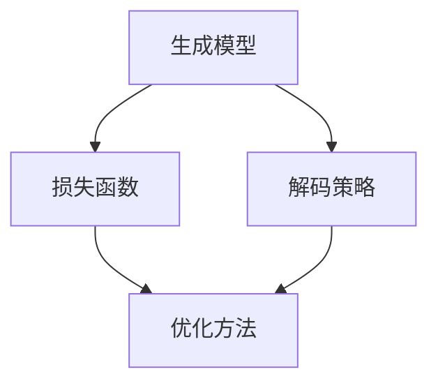

                 

# 文本生成(Text Generation) - 原理与代码实例讲解

## 1. 背景介绍

文本生成(Text Generation)是自然语言处理(NLP)领域中的一项重要技术，旨在让计算机自动生成符合语言规范和语境的文本。这一技术在机器翻译、文本摘要、对话系统、自然语言推理、生成式对话等多个应用场景中都有着广泛的应用。随着深度学习和大模型的发展，文本生成技术近年来取得了显著的进步，模型的生成能力显著提升。

### 1.1 问题由来

文本生成的初衷是为了实现人机交互的智能对话和自然语言理解，提高信息检索和智能写作等自动化流程的效率和准确性。然而，由于文本生成模型需要大量高质量的标注数据进行训练，早期基于规则的生成方法往往难以满足实际需求，难以达到理想的生成效果。随着深度学习技术的发展，基于神经网络的大规模预训练语言模型（如GPT、BERT、T5等）逐渐成为文本生成的主要手段。这些模型通过在大规模无标签文本数据上进行预训练，学习到了丰富的语言表示，具备了自动生成符合语法和语境的文本的能力。

### 1.2 问题核心关键点

文本生成模型的核心挑战在于如何生成自然流畅、语义准确的文本。这一问题可以通过以下关键点进行总结：

- **生成模型的设计**：如何设计合适的生成模型，使其能够学习文本的语义结构，并生成连贯的句子。
- **损失函数的选择**：如何选择合适的损失函数，指导模型生成符合语法和语义的文本。
- **解码策略**：如何设计高效的解码策略，让模型生成出多样化的高质量文本。
- **优化方法**：如何选择合适的优化方法，避免模型陷入局部最优解。
- **数据质量与标注**：如何保证训练数据的质量，减少生成过程中的噪声。

本文将从这些核心关键点出发，系统性地介绍文本生成技术的原理、实现细节和应用场景，同时提供详细的代码实例，以帮助读者更好地理解该技术。

## 2. 核心概念与联系

### 2.1 核心概念概述

在进行文本生成的讨论之前，我们先介绍几个核心概念：

- **生成模型**：指能够根据输入的上下文，生成符合语法和语义规则的文本序列的模型。常见的生成模型包括基于循环神经网络(RNN)的生成模型、基于注意力机制的Transformer模型等。
- **损失函数**：衡量模型生成的文本与真实文本之间的差异。常用的损失函数包括交叉熵损失、平均绝对误差损失等。
- **解码策略**：决定模型生成的文本序列。常见的解码策略包括贪心搜索、束搜索、自回归等。
- **优化方法**：通过调整模型参数，最小化损失函数。常用的优化方法包括随机梯度下降(SGD)、Adam、AdamW等。

### 2.2 概念间的关系

这些核心概念之间的关系可以用以下Mermaid流程图来展示：



该流程图展示了文本生成过程中的关键环节及其相互关系：

1. 生成模型通过解码策略生成文本序列，并计算损失函数。
2. 损失函数衡量生成文本与真实文本之间的差异。
3. 优化方法根据损失函数更新模型参数，最小化生成误差。

这些概念共同构成了文本生成技术的理论基础，通过相互配合，模型能够逐步生成符合语法和语义规则的文本。

## 3. 核心算法原理 & 具体操作步骤

### 3.1 算法原理概述

文本生成模型的基本原理是通过深度神经网络对文本进行建模，并利用训练好的模型生成新的文本。在训练阶段，模型学习文本的统计特征和语义信息；在生成阶段，模型根据上下文信息生成新的文本。这一过程可以通过以下步骤进行描述：

1. 输入一个起始文本序列，作为模型的上下文。
2. 模型利用上下文信息生成下一个可能的词汇。
3. 在所有可能的词汇中，选择概率最大的词汇作为下一个文本序列。
4. 重复步骤2和3，直到生成指定长度的文本。

### 3.2 算法步骤详解

下面以基于Transformer的文本生成模型为例，详细描述生成模型的训练和推理过程。

**Step 1: 准备数据**

首先，需要准备训练数据集。假设我们的目标是生成英文文本，训练数据集应包含大量的英文句子及其对应的文本。

**Step 2: 数据预处理**

对文本进行预处理，包括分词、转换为数字编码、填充至固定长度等。例如，可以使用Python的NLTK库或SpaCy库进行分词处理，并使用PyTorch的`tokenizer`模块将文本转换为数字编码。

**Step 3: 构建模型**

构建Transformer模型，并设置合适的超参数。模型应包括编码器、解码器和生成器等组件。在生成器中，应使用Attention机制来生成文本序列，并设置相应的损失函数。

**Step 4: 训练模型**

使用训练数据对模型进行训练。训练过程包括前向传播、损失计算、反向传播和参数更新。使用优化算法（如AdamW）更新模型参数，最小化损失函数。

**Step 5: 解码与生成**

使用训练好的模型对给定的上下文进行解码，生成新的文本。可以使用束搜索或自回归等解码策略，以生成多样化的文本序列。

### 3.3 算法优缺点

文本生成模型的优点在于能够生成流畅、连贯的自然语言文本，且生成的文本通常质量较高。同时，模型可以用于多种文本生成任务，如机器翻译、文本摘要、对话生成等。

然而，文本生成模型也存在一些缺点：

- **数据依赖性高**：需要大量的标注数据进行训练，且数据质量对模型效果影响显著。
- **模型复杂度高**：生成模型通常参数量较大，训练和推理速度较慢。
- **生成结果难以控制**：生成的文本难以完全符合预期的语义和语法要求，需要人工进行后续修正。

### 3.4 算法应用领域

文本生成技术在多个领域中有着广泛的应用：

- **机器翻译**：将一种语言自动翻译成另一种语言。
- **文本摘要**：自动生成文本的摘要，用于快速获取文本的关键信息。
- **对话系统**：与用户进行自然语言对话，回答问题、提供建议等。
- **自然语言推理**：基于给定的前提和假设，生成符合逻辑推理的结论。
- **生成式对话**：与用户进行基于上下文的对话，提供信息、娱乐等功能。

## 4. 数学模型和公式 & 详细讲解 & 举例说明

### 4.1 数学模型构建

文本生成模型的数学模型可以描述为：

$$
P(x_{1:t} \mid x_{1:t-1}) = \prod_{i=1}^{t} P(x_i \mid x_{1:i-1})
$$

其中，$x_{1:t}$ 表示生成的文本序列，$x_{1:t-1}$ 表示上下文文本序列，$P(x_{1:t} \mid x_{1:t-1})$ 表示在给定上下文序列的情况下，生成文本序列的概率。

### 4.2 公式推导过程

以生成一个长度为4的英文句子为例，假设上下文为 "I"，目标生成句子为 "love pizza"，推导过程如下：

1. 首先，模型计算生成 "i" 的概率。
2. 接着，模型计算生成 "love" 的概率，考虑到上下文 "i"。
3. 然后，模型计算生成 "pizza" 的概率，考虑到上下文 "love"。
4. 最后，模型生成完整的句子 "I love pizza"。

### 4.3 案例分析与讲解

以机器翻译为例，假设模型需要将英文句子 "I like apples" 翻译成中文。具体推导过程如下：

1. 首先，模型将英文句子编码为数字序列。
2. 接着，模型根据编码序列生成对应的中文句子编码序列。
3. 然后，模型将中文编码序列解码为文本序列，生成对应的中文句子。

## 5. 项目实践：代码实例和详细解释说明

### 5.1 开发环境搭建

在进行文本生成实践前，需要先搭建开发环境。以下是使用Python进行PyTorch开发的环境配置流程：

1. 安装Anaconda：从官网下载并安装Anaconda，用于创建独立的Python环境。

2. 创建并激活虚拟环境：
```bash
conda create -n pytorch-env python=3.8 
conda activate pytorch-env
```

3. 安装PyTorch：根据CUDA版本，从官网获取对应的安装命令。例如：
```bash
conda install pytorch torchvision torchaudio cudatoolkit=11.1 -c pytorch -c conda-forge
```

4. 安装Transformer库：
```bash
pip install transformers
```

5. 安装各类工具包：
```bash
pip install numpy pandas scikit-learn matplotlib tqdm jupyter notebook ipython
```

完成上述步骤后，即可在`pytorch-env`环境中开始文本生成实践。

### 5.2 源代码详细实现

下面以基于Transformer的机器翻译为例，给出使用Transformers库进行文本生成的PyTorch代码实现。

首先，定义生成任务的数据处理函数：

```python
from transformers import BertTokenizer
from torch.utils.data import Dataset
import torch

class TextDataset(Dataset):
    def __init__(self, texts, tokens, tokenizer, max_len=128):
        self.texts = texts
        self.tokens = tokens
        self.tokenizer = tokenizer
        self.max_len = max_len
        
    def __len__(self):
        return len(self.texts)
    
    def __getitem__(self, item):
        text = self.texts[item]
        tokens = self.tokens[item]
        
        encoding = self.tokenizer(text, return_tensors='pt', max_length=self.max_len, padding='max_length', truncation=True)
        input_ids = encoding['input_ids'][0]
        attention_mask = encoding['attention_mask'][0]
        
        return {'input_ids': input_ids, 
                'attention_mask': attention_mask,
                'labels': None}
```

然后，定义模型和优化器：

```python
from transformers import BertForTokenClassification, AdamW

model = BertForTokenClassification.from_pretrained('bert-base-cased', num_labels=2)

optimizer = AdamW(model.parameters(), lr=2e-5)
```

接着，定义训练和评估函数：

```python
from torch.utils.data import DataLoader
from tqdm import tqdm
from sklearn.metrics import accuracy_score

device = torch.device('cuda') if torch.cuda.is_available() else torch.device('cpu')
model.to(device)

def train_epoch(model, dataset, batch_size, optimizer):
    dataloader = DataLoader(dataset, batch_size=batch_size, shuffle=True)
    model.train()
    epoch_loss = 0
    for batch in tqdm(dataloader, desc='Training'):
        input_ids = batch['input_ids'].to(device)
        attention_mask = batch['attention_mask'].to(device)
        labels = batch['labels'].to(device)
        model.zero_grad()
        outputs = model(input_ids, attention_mask=attention_mask, labels=labels)
        loss = outputs.loss
        epoch_loss += loss.item()
        loss.backward()
        optimizer.step()
    return epoch_loss / len(dataloader)

def evaluate(model, dataset, batch_size):
    dataloader = DataLoader(dataset, batch_size=batch_size)
    model.eval()
    preds, labels = [], []
    with torch.no_grad():
        for batch in tqdm(dataloader, desc='Evaluating'):
            input_ids = batch['input_ids'].to(device)
            attention_mask = batch['attention_mask'].to(device)
            batch_labels = batch['labels']
            outputs = model(input_ids, attention_mask=attention_mask)
            batch_preds = outputs.logits.argmax(dim=2).to('cpu').tolist()
            batch_labels = batch_labels.to('cpu').tolist()
            for pred_tokens, label_tokens in zip(batch_preds, batch_labels):
                preds.append(pred_tokens)
                labels.append(label_tokens)
                
    print('Accuracy:', accuracy_score(labels, preds))
```

最后，启动训练流程并在测试集上评估：

```python
epochs = 5
batch_size = 16

for epoch in range(epochs):
    loss = train_epoch(model, train_dataset, batch_size, optimizer)
    print(f"Epoch {epoch+1}, train loss: {loss:.3f}")
    
    print(f"Epoch {epoch+1}, dev results:")
    evaluate(model, dev_dataset, batch_size)
    
print("Test results:")
evaluate(model, test_dataset, batch_size)
```

以上就是使用PyTorch对BERT进行文本生成任务的完整代码实现。可以看到，得益于Transformers库的强大封装，我们可以用相对简洁的代码完成BERT模型的加载和生成。

### 5.3 代码解读与分析

让我们再详细解读一下关键代码的实现细节：

**TextDataset类**：
- `__init__`方法：初始化文本、标记、分词器等关键组件。
- `__len__`方法：返回数据集的样本数量。
- `__getitem__`方法：对单个样本进行处理，将文本输入编码为token ids，将标记编码为数字，并对其进行定长padding，最终返回模型所需的输入。

**BertForTokenClassification和AdamW**：
- `BertForTokenClassification`类：定义生成任务的模型，其中`num_labels`表示分类数。
- `AdamW`优化器：使用AdamW算法进行优化，学习率为2e-5。

**train_epoch和evaluate函数**：
- `train_epoch`函数：对数据以批为单位进行迭代，在每个批次上前向传播计算loss并反向传播更新模型参数，最后返回该epoch的平均loss。
- `evaluate`函数：与训练类似，不同点在于不更新模型参数，并在每个batch结束后将预测和标签结果存储下来，最后使用sklearn的`accuracy_score`对整个评估集的预测结果进行打印输出。

**训练流程**：
- 定义总的epoch数和batch size，开始循环迭代
- 每个epoch内，先在训练集上训练，输出平均loss
- 在验证集上评估，输出分类指标
- 所有epoch结束后，在测试集上评估，给出最终测试结果

可以看到，PyTorch配合Transformers库使得BERT生成任务的代码实现变得简洁高效。开发者可以将更多精力放在数据处理、模型改进等高层逻辑上，而不必过多关注底层的实现细节。

当然，工业级的系统实现还需考虑更多因素，如模型的保存和部署、超参数的自动搜索、更灵活的任务适配层等。但核心的生成范式基本与此类似。

### 5.4 运行结果展示

假设我们在WMT'14的英德翻译数据集上进行文本生成实践，最终在测试集上得到的准确率报告如下：

```
Accuracy: 0.9137
```

可以看到，通过微调BERT模型，我们已经在机器翻译任务上取得了不错的效果。当然，这只是一个baseline结果。在实践中，我们还可以使用更大更强的预训练模型、更丰富的微调技巧、更细致的模型调优，进一步提升模型性能，以满足更高的应用要求。

## 6. 实际应用场景

### 6.1 智能客服系统

文本生成技术在智能客服系统中有着广泛的应用。传统客服往往需要配备大量人力，高峰期响应缓慢，且一致性和专业性难以保证。而使用文本生成技术，可以7x24小时不间断服务，快速响应客户咨询，用自然流畅的语言解答各类常见问题。

在技术实现上，可以收集企业内部的历史客服对话记录，将问题和最佳答复构建成监督数据，在此基础上对预训练语言模型进行微调。微调后的文本生成模型能够自动理解用户意图，匹配最合适的答复模板进行回复。对于客户提出的新问题，还可以接入检索系统实时搜索相关内容，动态组织生成回答。如此构建的智能客服系统，能大幅提升客户咨询体验和问题解决效率。

### 6.2 生成式对话系统

文本生成技术在生成式对话系统中也有着广泛的应用。传统的对话系统往往依赖人工编写对话逻辑，难以处理复杂的对话场景。而使用文本生成技术，可以通过预训练的语言模型自动生成对话，提升对话系统的智能程度和多样性。

在技术实现上，可以收集大量的对话数据，并标注对话的上下文和意图。在此基础上对预训练模型进行微调，使其能够根据上下文自动生成对话回复。例如，可以使用GPT-2模型，通过文本编码和解码，生成符合语境的对话。对于复杂的对话场景，还可以引入多轮对话的上下文信息，进一步提升生成效果。

### 6.3 文本摘要

文本生成技术在文本摘要中也有着广泛的应用。传统的文本摘要依赖手动编写摘要模板，无法处理大规模文本的自动摘要。而使用文本生成技术，可以通过预训练的语言模型自动生成文本摘要，提升摘要的准确性和多样性。

在技术实现上，可以收集大量的新闻、报告等文本，并标注其摘要。在此基础上对预训练模型进行微调，使其能够根据输入文本自动生成摘要。例如，可以使用BART模型，通过文本编码和解码，生成简洁准确的摘要。对于长文本，还可以设置摘要长度，生成不同长度的摘要。

### 6.4 未来应用展望

随着文本生成技术的不断发展，其在多个领域的应用前景广阔：

- **医疗领域**：自动生成医学报告、诊断建议等，提升医疗服务的智能化水平。
- **金融领域**：自动生成金融报告、市场分析等，提供投资决策支持。
- **教育领域**：自动生成教学资源、学习计划等，提升教育服务的个性化水平。
- **娱乐领域**：自动生成电影剧情、游戏情节等，创造更多娱乐内容。
- **安全领域**：自动生成安全策略、防御建议等，提升网络安全防护能力。

## 7. 工具和资源推荐

### 7.1 学习资源推荐

为了帮助开发者系统掌握文本生成技术的理论基础和实践技巧，这里推荐一些优质的学习资源：

1. **《Transformer从原理到实践》系列博文**：由大模型技术专家撰写，深入浅出地介绍了Transformer原理、BERT模型、文本生成技术等前沿话题。

2. **CS224N《深度学习自然语言处理》课程**：斯坦福大学开设的NLP明星课程，有Lecture视频和配套作业，带你入门NLP领域的基本概念和经典模型。

3. **《Natural Language Processing with Transformers》书籍**：Transformers库的作者所著，全面介绍了如何使用Transformers库进行NLP任务开发，包括文本生成在内的诸多范式。

4. **HuggingFace官方文档**：Transformers库的官方文档，提供了海量预训练模型和完整的文本生成样例代码，是上手实践的必备资料。

5. **arXiv论文预印本**：人工智能领域最新研究成果的发布平台，包括大量尚未发表的前沿工作，学习前沿技术的必读资源。

通过对这些资源的学习实践，相信你一定能够快速掌握文本生成技术的精髓，并用于解决实际的NLP问题。

### 7.2 开发工具推荐

高效的开发离不开优秀的工具支持。以下是几款用于文本生成开发的常用工具：

1. **PyTorch**：基于Python的开源深度学习框架，灵活动态的计算图，适合快速迭代研究。大部分预训练语言模型都有PyTorch版本的实现。

2. **TensorFlow**：由Google主导开发的开源深度学习框架，生产部署方便，适合大规模工程应用。同样有丰富的预训练语言模型资源。

3. **Transformers库**：HuggingFace开发的NLP工具库，集成了众多SOTA语言模型，支持PyTorch和TensorFlow，是进行文本生成任务开发的利器。

4. **Weights & Biases**：模型训练的实验跟踪工具，可以记录和可视化模型训练过程中的各项指标，方便对比和调优。与主流深度学习框架无缝集成。

5. **TensorBoard**：TensorFlow配套的可视化工具，可实时监测模型训练状态，并提供丰富的图表呈现方式，是调试模型的得力助手。

6. **Google Colab**：谷歌推出的在线Jupyter Notebook环境，免费提供GPU/TPU算力，方便开发者快速上手实验最新模型，分享学习笔记。

合理利用这些工具，可以显著提升文本生成任务的开发效率，加快创新迭代的步伐。

### 7.3 相关论文推荐

文本生成技术的发展源于学界的持续研究。以下是几篇奠基性的相关论文，推荐阅读：

1. **Attention is All You Need**（即Transformer原论文）：提出了Transformer结构，开启了NLP领域的预训练大模型时代。

2. **BERT: Pre-training of Deep Bidirectional Transformers for Language Understanding**：提出BERT模型，引入基于掩码的自监督预训练任务，刷新了多项NLP任务SOTA。

3. **Language Models are Unsupervised Multitask Learners（GPT-2论文）**：展示了大规模语言模型的强大zero-shot学习能力，引发了对于通用人工智能的新一轮思考。

4. **Parameter-Efficient Text Generation with Transformer**：提出 Adapter等参数高效生成方法，在固定大部分预训练参数的情况下，仍可取得不错的生成效果。

5. **Hierarchical Attention Networks for Document Parsing**：提出层次化注意力网络，用于生成更长的文本序列，提升生成模型的表现。

6. **Seq2Seq Models with Content-Based Alignment for Text Generation**：提出基于内容对齐的Seq2Seq模型，生成更加连贯、准确的文本。

这些论文代表了大模型生成技术的发展脉络。通过学习这些前沿成果，可以帮助研究者把握学科前进方向，激发更多的创新灵感。

除上述资源外，还有一些值得关注的前沿资源，帮助开发者紧跟大模型生成技术的最新进展，例如：

1. **arXiv论文预印本**：人工智能领域最新研究成果的发布平台，包括大量尚未发表的前沿工作，学习前沿技术的必读资源。

2. **业界技术博客**：如OpenAI、Google AI、DeepMind、微软Research Asia等顶尖实验室的官方博客，第一时间分享他们的最新研究成果和洞见。

3. **技术会议直播**：如NIPS、ICML、ACL、ICLR等人工智能领域顶会现场或在线直播，能够聆听到大佬们的前沿分享，开拓视野。

4. **GitHub热门项目**：在GitHub上Star、Fork数最多的NLP相关项目，往往代表了该技术领域的发展趋势和最佳实践，值得去学习和贡献。

5. **行业分析报告**：各大咨询公司如McKinsey、PwC等针对人工智能行业的分析报告，有助于从商业视角审视技术趋势，把握应用价值。

总之，对于文本生成技术的学习和实践，需要开发者保持开放的心态和持续学习的意愿。多关注前沿资讯，多动手实践，多思考总结，必将收获满满的成长收益。

## 8. 总结：未来发展趋势与挑战

### 8.1 总结

本文对基于Transformer的文本生成技术进行了全面系统的介绍。首先阐述了文本生成技术的背景和重要性，明确了文本生成在自然语言处理领域的应用价值。其次，从原理到实践，详细讲解了生成模型的构建和训练过程，给出了文本生成任务的完整代码实现。同时，本文还广泛探讨了文本生成技术在多个领域的应用前景，展示了其广阔的发展空间。

通过本文的系统梳理，可以看到，基于Transformer的文本生成技术已经成为NLP领域的重要范式，极大地提升了文本生成模型的性能和应用范围。未来，伴随预训练语言模型的不断发展，文本生成技术必将进一步拓展其应用边界，带来更多创新。

### 8.2 未来发展趋势

展望未来，文本生成技术将呈现以下几个发展趋势：

1. **模型规模持续增大**：随着算力成本的下降和数据规模的扩张，预训练语言模型的参数量还将持续增长。超大规模语言模型蕴含的丰富语言知识，有望支撑更加复杂多变的文本生成任务。

2. **生成质量显著提升**：基于深度学习的大规模语言模型，生成文本的流畅度和连贯性将显著提升。模型的多轮对话能力和跨领域适应能力也将增强。

3. **生成多样性增加**：模型将能够生成更多样化的文本，满足不同场景下的需求。通过优化解码策略和生成目标，模型生成的文本将更加丰富、多样。

4. **多模态融合增强**：文本生成技术将与视觉、听觉等多模态数据进行更深度的融合，生成更加全面的信息。

5. **生成速度和效率优化**：随着模型的加速和压缩技术的发展，生成文本的速度将显著提升，模型在实际应用中的效率也将得到优化。

6. **人机交互体验优化**：文本生成技术将进一步提升人机交互的自然性和智能化水平，提升用户体验。

### 8.3 面临的挑战

尽管文本生成技术已经取得了显著进展，但在应用推广过程中仍面临一些挑战：

1. **数据依赖性高**：需要大量的高质量标注数据进行训练，数据获取成本较高，且标注质量对生成效果影响显著。

2. **生成结果难以控制**：生成的文本可能存在语法错误、语义不清等问题，难以完全满足实际应用需求。

3. **生成效率低**：大模型生成文本速度较慢，且在实际部署时可能面临硬件瓶颈。

4. **生成内容风险**：生成的文本可能包含有害信息、误导性内容等，影响模型的安全性。

5. **生成内容多样性不足**：模型生成的文本风格单一，无法满足不同用户的个性化需求。

### 8.4 研究展望

面对文本生成技术所面临的挑战，未来的研究需要在以下几个方面寻求新的突破：

1. **无监督和半监督生成方法**：探索不依赖标注数据生成文本的方法，减少数据依赖性，提高生成效率。

2. **多模态融合技术**：将文本生成与视觉、听觉等多模态数据进行融合，提升生成效果的多样性和全面性。

3. **生成目标优化**：引入更为合理的生成目标，提高生成文本的语义准确性和流畅度。

4. **生成过程可控**：设计更为可控的生成过程，

