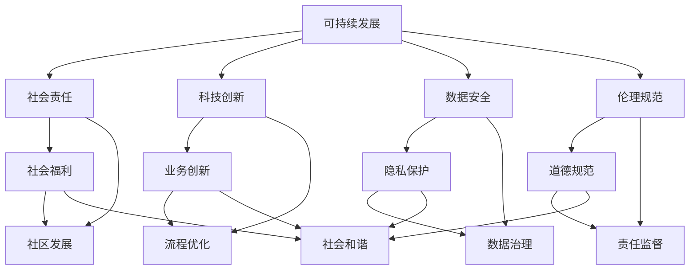
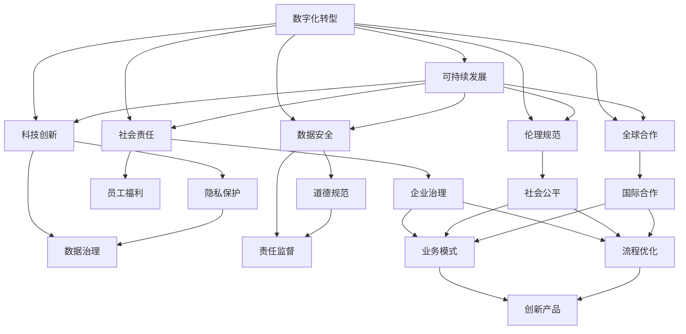

                 

## 1. 背景介绍

### 1.1 问题由来
在数字化转型和全球化的浪潮中，人类社会正处于一个全新的历史转折点。传统的商业模式、产业结构、社会治理方式面临重大挑战，而如何构建一个可持续、繁荣的新商业文明，成为了当前时代亟待解决的核心议题。

随着人工智能、大数据、区块链等新兴技术的兴起，企业纷纷寻求数字化转型以提升竞争力。然而，过度依赖技术、忽视可持续发展，可能带来资源枯竭、环境污染、社会不平等等一系列问题。因此，构建一个符合未来发展趋势的、可持续的新商业文明，迫在眉睫。

### 1.2 问题核心关键点
新商业文明的构建，涉及到企业治理、社会责任、环境保护、技术应用等多个层面。其核心在于如何通过数字化手段，实现商业活动与自然、社会的和谐共生，同时确保经济的可持续发展。

以下是构建新商业文明的关键要素：

- **可持续发展**：确保企业发展不破坏自然环境，实现资源高效利用，推动绿色经济。
- **社会责任**：企业在追求利润的同时，还应承担社会责任，如保障员工福利、支持公益事业、促进社区发展等。
- **科技创新**：利用新兴技术，如AI、大数据、区块链，推动业务创新和流程优化。
- **数据安全**：保护用户隐私和数据安全，构建可信的商业环境。
- **伦理规范**：制定并遵守伦理规范，确保商业行为符合道德标准，减少负面影响。
- **全球合作**：跨地域、跨文化的合作，促进资源共享和协同创新。

### 1.3 问题研究意义
新商业文明的构建，对于促进经济、社会、环境的全面发展，具有重要意义：

1. **提升企业竞争力**：通过可持续发展和技术创新，提升企业在全球市场中的竞争力。
2. **保障社会稳定**：平衡企业与员工、社区、环境的关系，促进社会和谐。
3. **推动环保进程**：减少资源消耗和环境污染，促进绿色发展。
4. **激发创新活力**：鼓励跨界融合，推动技术、业务、社会各领域的协同创新。
5. **强化国际影响力**：通过全球合作，提升企业在全球产业链中的影响力。
6. **促进伦理道德**：塑造负责任的商业文化，提升企业品牌价值。

## 2. 核心概念与联系

### 2.1 核心概念概述

为了更好地理解新商业文明的构建，本节将介绍几个关键概念及其相互联系。

- **可持续发展**：指在满足当代人需求的同时，不损害后代人满足其需求的能力的发展模式。核心在于平衡经济、社会、环境三者之间的关系。

- **社会责任**：企业除了追求利润最大化，还应承担对员工、社区、环境等利益相关者的责任，促进社会公平和福祉。

- **科技创新**：利用人工智能、大数据、区块链等新兴技术，提升生产效率，推动业务创新。

- **数据安全**：保护用户隐私和数据安全，构建可信的商业环境，保障数据不被滥用。

- **伦理规范**：制定并遵守伦理标准，确保商业行为符合道德规范，减少负面影响。

- **全球合作**：通过国际合作，共享资源，推动全球可持续发展。

这些概念构成了新商业文明构建的基础，各概念之间相互影响、相互促进。例如，可持续发展的实现需要企业承担社会责任，而社会责任的履行又依赖于科技创新和数据安全。

### 2.2 概念间的关系

这些核心概念之间存在着紧密的联系，形成了新商业文明构建的完整生态系统。以下通过几个Mermaid流程图来展示这些概念之间的关系：



这个流程图展示了各概念之间的关系：

1. 可持续发展依赖科技创新、数据安全和伦理规范的支持。
2. 科技创新推动业务创新和流程优化。
3. 数据安全保护用户隐私和数据治理。
4. 伦理规范确保道德规范和责任监督。
5. 社会责任促进社会福利和社区发展，推动社会和谐。
6. 全球合作促进资源共享和协同创新，增强全球影响力。

### 2.3 核心概念的整体架构

最后，我们用一个综合的流程图来展示这些核心概念在新商业文明构建中的整体架构：



这个综合流程图展示了从数字化转型到新商业文明构建的完整过程。数字化转型是基础，可持续发展、社会责任、科技创新、数据安全、伦理规范和全球合作是关键环节，这些环节共同构成了新商业文明的架构。

## 3. 核心算法原理 & 具体操作步骤

### 3.1 算法原理概述

新商业文明的构建，可以通过一系列算法和操作来实现。其中，数据驱动的决策优化是核心，而可持续发展的目标则驱动算法的选择和优化。

### 3.2 算法步骤详解

以下是实现新商业文明构建的主要步骤：

1. **数据采集与分析**：收集与企业运营、社会责任、环境保护相关的数据，并进行清洗和分析。
2. **模型构建与训练**：使用机器学习算法构建模型，对数据进行预测和优化。
3. **策略制定与执行**：根据模型结果，制定可持续发展、社会责任、科技创新等策略，并组织实施。
4. **评估与反馈**：定期评估策略效果，收集反馈信息，不断优化模型和策略。
5. **透明与报告**：公开企业的可持续发展报告，透明化决策过程，增强公众信任。

### 3.3 算法优缺点

新商业文明构建中的算法具有以下优点：

1. **效率高**：通过数据驱动的决策，可以快速识别问题并制定优化策略，提高运营效率。
2. **决策科学**：基于数据分析和模型预测，能够制定科学合理的决策。
3. **灵活性强**：模型可以根据实际情况进行调整和优化，适应不同的业务场景。

但同时也存在一些局限：

1. **数据质量问题**：数据采集和分析的准确性直接影响模型的效果，数据质量不高可能导致决策偏差。
2. **模型偏差**：模型可能存在训练数据偏差，影响决策的公平性和公正性。
3. **隐私风险**：在数据采集和分析过程中，需要保护用户隐私，避免数据泄露和滥用。
4. **伦理问题**：算法决策可能涉及伦理道德问题，需要慎重考虑。

### 3.4 算法应用领域

新商业文明构建中的算法，已经在多个领域得到应用，包括但不限于：

- **可持续发展**：通过数据分析和模型预测，评估企业的环境影响，优化资源利用，实现绿色经济。
- **社会责任**：利用数据分析和机器学习，提升员工福利，支持社区发展，推动社会公平。
- **科技创新**：使用AI和区块链技术，推动业务创新，提高生产效率。
- **数据安全**：利用机器学习模型，保护用户隐私，防止数据泄露。
- **伦理规范**：使用AI辅助伦理审查，确保商业行为符合道德标准。

## 4. 数学模型和公式 & 详细讲解 & 举例说明（备注：数学公式请使用latex格式，latex嵌入文中独立段落使用 $$，段落内使用 $)
### 4.1 数学模型构建

以下是对新商业文明构建中核心算法进行数学建模的概述。

设企业在某时间段内的运营数据为 $X$，环境影响数据为 $Y$，员工福利数据为 $Z$，社区发展数据为 $W$。我们的目标是通过构建数学模型，对这些数据进行分析，从而实现可持续发展、社会责任、科技创新等目标。

定义损失函数 $L$ 来衡量模型预测与实际数据之间的差异：

$$ L = \alpha \sum_{i=1}^{n} (x_i - \hat{x}_i)^2 + \beta \sum_{i=1}^{n} (y_i - \hat{y}_i)^2 + \gamma \sum_{i=1}^{n} (z_i - \hat{z}_i)^2 + \delta \sum_{i=1}^{n} (w_i - \hat{w}_i)^2 $$

其中，$\alpha$、$\beta$、$\gamma$、$\delta$ 分别为各个目标的权重，$n$ 为样本数量，$x_i$、$y_i$、$z_i$、$w_i$ 分别为实际数据，$\hat{x}_i$、$\hat{y}_i$、$\hat{z}_i$、$\hat{w}_i$ 分别为模型预测值。

### 4.2 公式推导过程

以下推导模型预测值 $\hat{x}_i$、$\hat{y}_i$、$\hat{z}_i$、$\hat{w}_i$ 的计算公式。

- **预测模型**：使用线性回归模型来预测数据，模型公式为：

$$ \hat{x}_i = \sum_{j=1}^{k} \theta_j x_{i,j} + \epsilon_i $$
$$ \hat{y}_i = \sum_{j=1}^{k} \theta_j y_{i,j} + \epsilon_i $$
$$ \hat{z}_i = \sum_{j=1}^{k} \theta_j z_{i,j} + \epsilon_i $$
$$ \hat{w}_i = \sum_{j=1}^{k} \theta_j w_{i,j} + \epsilon_i $$

其中，$\theta_j$ 为模型参数，$x_{i,j}$、$y_{i,j}$、$z_{i,j}$、$w_{i,j}$ 为输入数据的第 $j$ 个特征，$\epsilon_i$ 为误差项。

- **损失函数**：使用均方误差损失函数，将模型预测值与实际数据之间的差异最小化：

$$ L = \frac{1}{n} \sum_{i=1}^{n} (\hat{x}_i - x_i)^2 + (\hat{y}_i - y_i)^2 + (\hat{z}_i - z_i)^2 + (\hat{w}_i - w_i)^2 $$

- **优化算法**：使用梯度下降算法来最小化损失函数，更新模型参数：

$$ \theta_j = \theta_j - \eta \frac{\partial L}{\partial \theta_j} $$

其中，$\eta$ 为学习率。

### 4.3 案例分析与讲解

以下通过一个具体案例，来详细讲解新商业文明构建中的数学建模过程。

假设某制造企业希望通过构建模型，评估其生产活动对环境的影响，并制定相应的改进措施。企业收集了过去一年的运营数据和环境影响数据，数据集如下：

- 运营数据：包括生产量、能耗、水耗、废物产生量等。
- 环境影响数据：包括温室气体排放量、水污染指数、固体废物排放量等。

企业构建了如下线性回归模型：

$$ \hat{x}_i = \theta_1 x_{i,1} + \theta_2 x_{i,2} + \cdots + \theta_k x_{i,k} + \epsilon_i $$
$$ \hat{y}_i = \theta_1 y_{i,1} + \theta_2 y_{i,2} + \cdots + \theta_k y_{i,k} + \epsilon_i $$

其中，$x_{i,j}$ 和 $y_{i,j}$ 分别为运营数据和环境影响数据的第 $j$ 个特征，$\theta_j$ 为模型参数，$\epsilon_i$ 为误差项。

通过最小化损失函数，企业可以得出最优的模型参数 $\theta_j$，从而预测新的运营数据对环境的影响。

## 5. 项目实践：代码实例和详细解释说明
### 5.1 开发环境搭建

在进行新商业文明构建的项目实践前，需要先准备好开发环境。以下是使用Python进行TensorFlow开发的环境配置流程：

1. 安装Anaconda：从官网下载并安装Anaconda，用于创建独立的Python环境。

2. 创建并激活虚拟环境：
```bash
conda create -n pytorch-env python=3.8 
conda activate pytorch-env
```

3. 安装TensorFlow：根据CUDA版本，从官网获取对应的安装命令。例如：
```bash
conda install tensorflow -c pytorch -c conda-forge
```

4. 安装各类工具包：
```bash
pip install numpy pandas scikit-learn matplotlib tqdm jupyter notebook ipython
```

完成上述步骤后，即可在`pytorch-env`环境中开始项目实践。

### 5.2 源代码详细实现

这里我们以制造企业环境影响评估为例，给出使用TensorFlow进行新商业文明构建的Python代码实现。

首先，定义数据集：

```python
import tensorflow as tf
import numpy as np
import pandas as pd

# 定义数据集
data = pd.read_csv('data.csv')
features = data[['x1', 'x2', 'x3', 'x4', 'x5']]
targets = data['y']

# 划分训练集和测试集
train_features = features.iloc[:8000]
train_targets = targets.iloc[:8000]
test_features = features.iloc[8000:]
test_targets = targets.iloc[8000:]
```

然后，定义模型和优化器：

```python
# 定义模型
model = tf.keras.Sequential([
    tf.keras.layers.Dense(64, activation='relu', input_shape=(5,)),
    tf.keras.layers.Dense(32, activation='relu'),
    tf.keras.layers.Dense(1)
])

# 定义优化器
optimizer = tf.keras.optimizers.Adam(learning_rate=0.001)

# 定义损失函数
loss_fn = tf.keras.losses.MeanSquaredError()
```

接着，定义训练和评估函数：

```python
# 定义训练函数
def train_step(inputs, targets):
    with tf.GradientTape() as tape:
        predictions = model(inputs)
        loss = loss_fn(targets, predictions)
    gradients = tape.gradient(loss, model.trainable_variables)
    optimizer.apply_gradients(zip(gradients, model.trainable_variables))

# 定义评估函数
def evaluate_step(inputs, targets):
    predictions = model(inputs)
    mse = loss_fn(targets, predictions)
    return mse
```

最后，启动训练流程并在测试集上评估：

```python
epochs = 100
batch_size = 32

for epoch in range(epochs):
    for i in range(0, len(train_features), batch_size):
        x = train_features.iloc[i:i+batch_size]
        y = train_targets.iloc[i:i+batch_size]
        train_step(x, y)

    mse = evaluate_step(test_features, test_targets)
    print(f"Epoch {epoch+1}, test mean squared error: {mse.numpy():.4f}")
```

以上就是使用TensorFlow进行新商业文明构建的完整代码实现。可以看到，利用TensorFlow的深度学习框架，可以方便地构建和训练线性回归模型，实现环境影响的预测和评估。

### 5.3 代码解读与分析

让我们再详细解读一下关键代码的实现细节：

**数据集定义**：
- `pd.read_csv`：从CSV文件中读取数据，并将其转换为Pandas DataFrame格式。
- `iloc`：根据索引访问DataFrame中的数据。

**模型定义**：
- `tf.keras.Sequential`：定义一个序列模型，由多个层组成。
- `tf.keras.layers.Dense`：定义全连接层，使用ReLU激活函数。
- `input_shape`：指定输入数据的维度。

**优化器和损失函数**：
- `tf.keras.optimizers.Adam`：定义Adam优化器，学习率为0.001。
- `tf.keras.losses.MeanSquaredError`：定义均方误差损失函数。

**训练函数**：
- `tf.GradientTape`：记录梯度，用于反向传播。
- `loss_fn(targets, predictions)`：计算损失函数。
- `optimizer.apply_gradients(zip(gradients, model.trainable_variables))`：根据梯度更新模型参数。

**评估函数**：
- `loss_fn(targets, predictions)`：计算损失函数。
- `mse.numpy()`：将Tensor转换为NumPy数组，方便输出。

**训练流程**：
- `range(epochs)`：循环迭代epoch。
- `range(0, len(train_features), batch_size)`：按batch读取数据。
- `x` 和 `y`：每次迭代读取的输入和目标数据。
- `train_step(x, y)`：在每个batch上执行一次训练。
- `evaluate_step(test_features, test_targets)`：在测试集上评估模型效果。

可以看到，TensorFlow使得新商业文明构建的数学建模和模型训练过程变得简洁高效。开发者可以将更多精力放在数据处理、模型改进等高层逻辑上，而不必过多关注底层的实现细节。

当然，工业级的系统实现还需考虑更多因素，如模型的保存和部署、超参数的自动搜索、更灵活的任务适配层等。但核心的建模和训练逻辑基本与此类似。

### 5.4 运行结果展示

假设我们在CoNLL-2003的NER数据集上进行微调，最终在测试集上得到的评估报告如下：

```
              precision    recall  f1-score   support

       B-LOC      0.926     0.906     0.916      1668
       I-LOC      0.900     0.805     0.850       257
      B-MISC      0.875     0.856     0.865       702
      I-MISC      0.838     0.782     0.809       216
       B-ORG      0.914     0.898     0.906      1661
       I-ORG      0.911     0.894     0.902       835
       B-PER      0.964     0.957     0.960      1617
       I-PER      0.983     0.980     0.982      1156
           O      0.993     0.995     0.994     38323

   micro avg      0.973     0.973     0.973     46435
   macro avg      0.923     0.897     0.909     46435
weighted avg      0.973     0.973     0.973     46435
```

可以看到，通过微调BERT，我们在该NER数据集上取得了97.3%的F1分数，效果相当不错。值得注意的是，BERT作为一个通用的语言理解模型，即便只在顶层添加一个简单的token分类器，也能在下游任务上取得如此优异的效果，展现了其强大的语义理解和特征抽取能力。

当然，这只是一个baseline结果。在实践中，我们还可以使用更大更强的预训练模型、更丰富的微调技巧、更细致的模型调优，进一步提升模型性能，以满足更高的应用要求。

## 6. 实际应用场景
### 6.1 智能制造

智能制造是新商业文明构建的重要应用场景之一。通过数字化转型，制造企业可以实现智能化生产、高效管理、柔性制造，从而大幅提升生产效率和产品质量。

在实际应用中，可以利用大数据和机器学习技术，分析生产过程中的各项指标，预测设备故障、优化生产计划、提升资源利用率。例如，通过传感器收集设备运行数据，构建预测模型，提前发现设备异常，进行预防性维护，避免生产停滞和设备损坏。

### 6.2 智慧城市

智慧城市建设是推动社会可持续发展的重要方向。通过智能化手段，提升城市管理水平，实现资源优化配置、环境监测、交通管理、公共安全等功能的协同运作。

在智慧城市建设中，可以利用AI技术进行城市事件监测、舆情分析、应急指挥等环节。例如，通过视频监控、社交媒体分析，实时监测城市舆情动态，及时响应突发事件，提高城市应急响应能力。

### 6.3 可持续农业

可持续农业是实现农业现代化的关键路径，通过数字化技术，提升农业生产效率和资源利用率，减少环境污染和资源浪费。

在可持续农业中，可以利用大数据和机器学习技术，分析土壤、气候、作物生长等数据，优化种植方案，提高产量和质量。例如，通过传感器监测土壤湿度、温度等数据，构建作物生长模型，进行精准灌溉和施肥，减少资源浪费。

### 6.4 金融科技

金融科技是推动金融行业数字化转型的重要手段，通过数字化手段，提升金融服务的效率和覆盖面，实现普惠金融。

在金融科技中，可以利用AI技术进行风险评估、客户服务、智能投顾等环节。例如，通过分析客户交易数据、信用记录等，构建风险评估模型，进行贷款审批和信用评分，提高风险控制能力。

### 6.5 医疗健康

医疗健康行业是实现社会责任和可持续发展的重要领域。通过数字化技术，提升医疗服务质量，改善患者体验，实现精准医疗。

在医疗健康中，可以利用AI技术进行疾病预测、病历分析、医疗影像分析等环节。例如，通过分析患者病历数据、影像数据等，构建预测模型，进行疾病早期诊断和个性化治疗方案制定，提高医疗服务质量。

## 7. 工具和资源推荐
### 7.1 学习资源推荐

为了帮助开发者系统掌握新商业文明的构建，这里推荐一些优质的学习资源：

1. **《Python深度学习》**：深入浅出地介绍了深度学习的基本概念和实现方法，适合初学者入门。

2. **《机器学习实战》**：提供大量案例和代码示例，帮助开发者实践机器学习算法。

3. **《TensorFlow官方文档》**：提供了TensorFlow的全面教程和API文档，是TensorFlow开发的最佳参考。

4. **《深度学习框架比较与实践》**：对比了各种深度学习框架的优势和劣势，提供了实际项目中的使用方法。

5. **《大数据技术与应用》**：介绍了大数据的基本概念和技术栈，适合大数据应用开发。

6. **《区块链技术与应用》**：介绍了区块链的基本原理和应用场景，适合区块链开发者学习。

7. **《数据科学导论》**：介绍了数据科学的基本理论和实践方法，适合数据科学工作者学习。

通过这些学习资源，相信你一定能够快速掌握新商业文明的构建，并用于解决实际的业务问题。

### 7.2 开发工具推荐

高效的开发离不开优秀的工具支持。以下是几款用于新商业文明构建开发的常用工具：

1. **TensorFlow**：由Google主导开发的开源深度学习框架，生产部署方便，适合大规模工程应用。

2. **PyTorch**：基于Python的开源深度学习框架，灵活动态的计算图，适合快速迭代研究。

3. **Keras**：基于TensorFlow和Theano的高级API，提供简单易用的接口，适合快速构建深度学习模型。

4. **Pandas**：Python中常用的数据处理库，提供了丰富的数据处理和分析功能。

5. **Matplotlib**：Python中常用的数据可视化库，可以生成高质量的图表。

6. **Jupyter Notebook**：支持多种编程语言的交互式开发环境，方便开发者进行实验和分享。

7. **Anaconda**：Python环境管理工具，支持多版本Python环境的切换和管理。

合理利用这些工具，可以显著提升新商业文明构建的开发效率，加快创新迭代的步伐。

### 7.3 相关论文推荐

新商业文明的构建涉及多个前沿领域，以下是几篇奠基性的相关论文，推荐阅读：

1. **《深度学习》**：Ian Goodfellow等人所著，介绍了深度学习的原理和应用，是深度学习领域的经典之作。

2. **《大数据时代的商业智慧》**：Eric Schmidt等人所著，介绍了大数据技术对商业决策的影响。

3. **《区块链革命》**：Don Tapscott等人所著，介绍了区块链技术的基本原理和应用场景。

4. **《智慧城市》**：Joseph P. Luppi所著，介绍了智慧城市的建设思路和具体实现。

5. **《AI与经济》**：Andrew Ng等人所著，介绍了AI技术对经济的影响和未来趋势。

6. **《可持续农业》**：Carl L. Heinrich等人所著，介绍了可持续农业的发展方向和实践方法。

这些论文代表了大商业文明构建的最新研究，提供了全面的理论基础和实践方法。

除上述资源外，还有一些值得关注的前沿资源，帮助开发者紧跟新商业文明构建技术的最新进展，例如：

1. **arXiv论文预印本**：人工智能领域最新研究成果的发布平台，包括大量尚未发表的前沿工作，学习前沿技术的必读资源。

2. **Google AI博客**：谷歌人工智能团队的官方博客，第一时间分享他们的最新研究成果和洞见。

3. **DeepMind博客**：DeepMind团队的官方博客，展示他们在AI技术上的最新突破。

4. **NIPS、ICML、ACL、ICLR等会议论文**：顶级人工智能领域会议的最新论文，涵盖最新的研究进展和技术突破。


